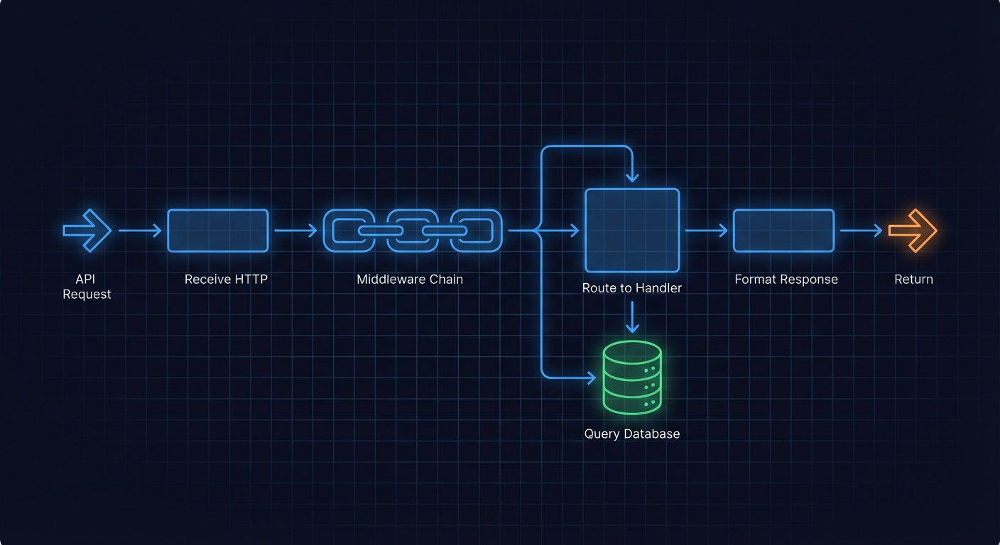
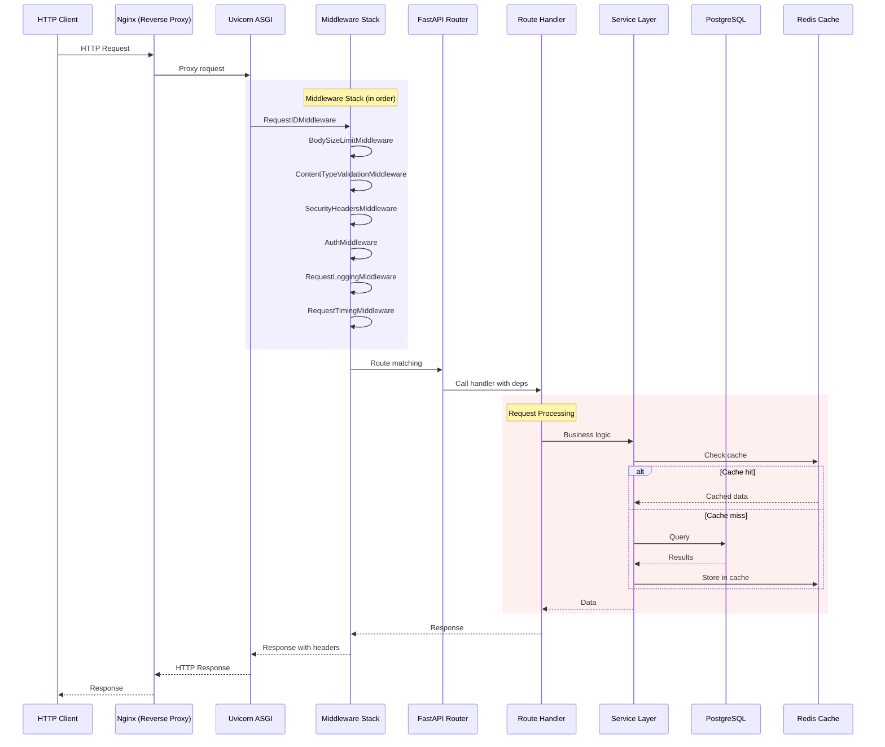
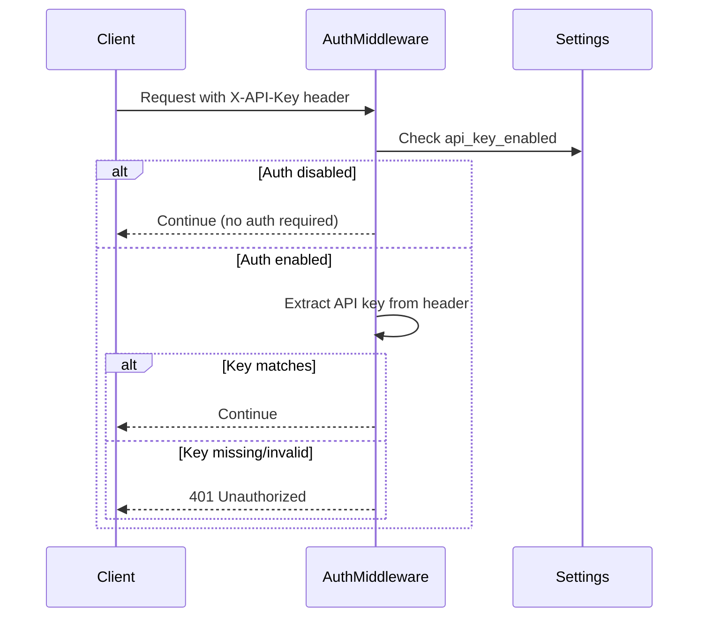
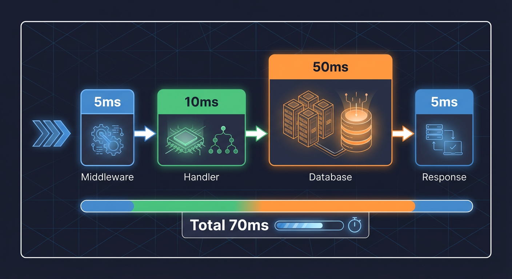
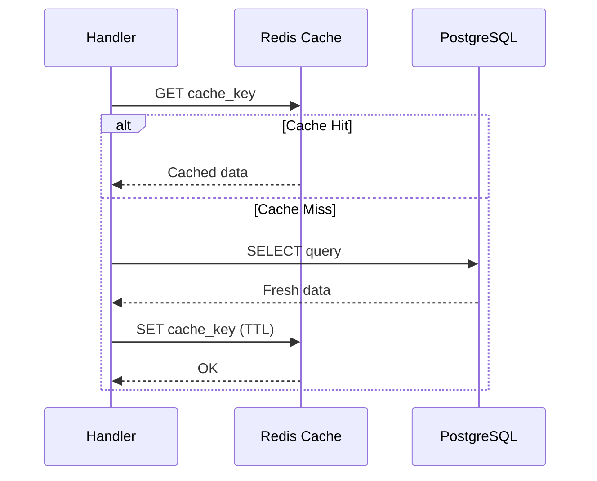

# API Request Flow

This document describes the complete lifecycle of a REST API request, from HTTP reception through response, including middleware processing, route handling, and error responses.



## Request Flow Sequence Diagram



## Middleware Stack

**Source:** `backend/main.py:21-34`

### Middleware Order (outer to inner)

```python
# backend/main.py:21-34
from backend.api.middleware import (
    AuthMiddleware,
    BodySizeLimitMiddleware,
    ContentTypeValidationMiddleware,
    DeprecationConfig,
    DeprecationLoggerMiddleware,
    DeprecationMiddleware,
    IdempotencyMiddleware,
    RequestLoggingMiddleware,
    RequestRecorderMiddleware,
    RequestTimingMiddleware,
    SecurityHeadersMiddleware,
)
from backend.api.middleware.request_id import RequestIDMiddleware
```

| Order | Middleware                        | Purpose                       |
| ----- | --------------------------------- | ----------------------------- |
| 1     | `RequestIDMiddleware`             | Assign unique request ID      |
| 2     | `BodySizeLimitMiddleware`         | Limit request body size       |
| 3     | `ContentTypeValidationMiddleware` | Validate Content-Type header  |
| 4     | `SecurityHeadersMiddleware`       | Add security response headers |
| 5     | `AuthMiddleware`                  | API key authentication        |
| 6     | `IdempotencyMiddleware`           | Idempotent request handling   |
| 7     | `DeprecationMiddleware`           | API deprecation warnings      |
| 8     | `RequestLoggingMiddleware`        | Log request/response          |
| 9     | `RequestTimingMiddleware`         | Track request latency         |

### Request ID

Every request receives a unique identifier for tracing:

```
X-Request-ID: req-abc123def456
```

This ID is:

- Generated if not provided by client
- Propagated through all service calls
- Included in all log entries
- Returned in response headers

### Security Headers

```python
# Security headers added to all responses
X-Content-Type-Options: nosniff
X-Frame-Options: DENY
X-XSS-Protection: 1; mode=block
Strict-Transport-Security: max-age=31536000; includeSubDomains
```

## Authentication Flow

### API Key Authentication



### Supported Authentication Methods

| Method      | Header/Parameter   | Example                        |
| ----------- | ------------------ | ------------------------------ |
| API Key     | `X-API-Key` header | `X-API-Key: your-api-key`      |
| Query param | `api_key`          | `/api/events?api_key=your-key` |

## Route Registration

**Source:** `backend/main.py:35-71`

### Route Groups

```python
# backend/main.py:35-71
from backend.api.routes import (
    admin,
    ai_audit,
    alertmanager,
    alerts,
    analytics,
    audit,
    calibration,
    cameras,
    debug,
    detections,
    dlq,
    entities,
    events,
    exports,
    feedback,
    health_ai_services,
    hierarchy,
    household,
    jobs,
    logs,
    media,
    metrics,
    notification,
    notification_preferences,
    prompt_management,
    queues,
    rum,
    services,
    settings_api,
    summaries,
    system,
    webhooks,
    websocket,
    zone_household,
    zones,
)
```

### Key API Groups

| Route Prefix      | Purpose              | Rate Limited |
| ----------------- | -------------------- | ------------ |
| `/api/events`     | Security events CRUD | No           |
| `/api/cameras`    | Camera management    | No           |
| `/api/detections` | Detection records    | No           |
| `/api/alerts`     | Alert rules          | No           |
| `/api/zones`      | Zone management      | No           |
| `/api/metrics`    | Prometheus metrics   | No           |
| `/health`         | Health checks        | No           |
| `/api/admin`      | Administrative ops   | Yes          |

## Dependency Injection

### Database Session

```python
# Route handler with database dependency
@router.get("/events/{event_id}")
async def get_event(
    event_id: int,
    session: AsyncSession = Depends(get_session),
) -> EventResponse:
    result = await session.execute(
        select(Event).where(Event.id == event_id)
    )
    event = result.scalar_one_or_none()
    if not event:
        raise HTTPException(status_code=404, detail="Event not found")
    return EventResponse.from_orm(event)
```

### Redis Client

```python
# Route handler with Redis dependency
@router.get("/queue-stats")
async def get_queue_stats(
    redis: RedisClient = Depends(get_redis),
) -> QueueStatsResponse:
    detection_queue_len = await redis.llen(DETECTION_QUEUE)
    analysis_queue_len = await redis.llen(ANALYSIS_QUEUE)
    return QueueStatsResponse(
        detection_queue=detection_queue_len,
        analysis_queue=analysis_queue_len,
    )
```

## Request Processing Timeline



```
Time 0ms:   Request received by Uvicorn
Time 1ms:   RequestIDMiddleware assigns ID
Time 2ms:   BodySizeLimitMiddleware checks size
Time 3ms:   ContentTypeValidationMiddleware validates
Time 4ms:   SecurityHeadersMiddleware prepares headers
Time 5ms:   AuthMiddleware validates API key
Time 6ms:   RequestLoggingMiddleware logs start
Time 7ms:   Route matching
Time 8ms:   Dependency resolution (get_session, etc.)
Time 10ms:  Handler execution starts
            ...
            Handler execution (variable)
            ...
Time N ms:  Handler returns response
Time N+1ms: RequestLoggingMiddleware logs completion
Time N+2ms: RequestTimingMiddleware records latency
Time N+3ms: Response sent
```

## Caching Strategy

### Cache-Aside Pattern



### Cache Keys

| Resource     | Key Pattern          | TTL  |
| ------------ | -------------------- | ---- |
| Events list  | `events:list:{hash}` | 30s  |
| Event by ID  | `events:{id}`        | 60s  |
| Camera list  | `cameras:list`       | 120s |
| Camera by ID | `cameras:{id}`       | 120s |
| Zone list    | `zones:list`         | 300s |
| Metrics      | `metrics:{type}`     | 10s  |

## Error Handling

### Exception Handlers

**Source:** `backend/api/exception_handlers.py`

```python
# Exception handler registration
register_exception_handlers(app)
```

### Standard Error Response Format

```json
{
  "detail": "Event not found",
  "request_id": "req-abc123def456",
  "timestamp": "2025-12-23T12:00:00Z"
}
```

### HTTP Status Codes

| Code | Meaning               | Use Case                          |
| ---- | --------------------- | --------------------------------- |
| 200  | OK                    | Successful GET/PUT/PATCH          |
| 201  | Created               | Successful POST creating resource |
| 204  | No Content            | Successful DELETE                 |
| 400  | Bad Request           | Invalid request body              |
| 401  | Unauthorized          | Missing/invalid auth              |
| 403  | Forbidden             | Insufficient permissions          |
| 404  | Not Found             | Resource doesn't exist            |
| 409  | Conflict              | Duplicate resource                |
| 422  | Unprocessable Entity  | Validation error                  |
| 429  | Too Many Requests     | Rate limit exceeded               |
| 500  | Internal Server Error | Unexpected error                  |
| 503  | Service Unavailable   | Dependency unavailable            |

### Circuit Breaker Errors

When a dependency circuit breaker is open:

```json
{
  "detail": "Service temporarily unavailable",
  "service": "yolo26",
  "circuit_state": "open",
  "retry_after": 60
}
```

## Request Validation

### Pydantic Schema Validation

```python
# Request body validation
class EventCreateRequest(BaseModel):
    camera_id: str = Field(..., min_length=1, max_length=50)
    risk_score: int = Field(..., ge=0, le=100)
    summary: str = Field(..., min_length=1, max_length=1000)

@router.post("/events")
async def create_event(
    request: EventCreateRequest,
) -> EventResponse:
    ...
```

### Path Parameter Validation

```python
@router.get("/events/{event_id}")
async def get_event(
    event_id: int = Path(..., ge=1, description="Event ID"),
) -> EventResponse:
    ...
```

### Query Parameter Validation

```python
@router.get("/events")
async def list_events(
    limit: int = Query(default=50, ge=1, le=100),
    offset: int = Query(default=0, ge=0),
    camera_id: str | None = Query(default=None),
    risk_level: str | None = Query(default=None),
) -> EventListResponse:
    ...
```

## Response Serialization

### Response Models

```python
class EventResponse(BaseModel):
    id: int
    batch_id: str
    camera_id: str
    risk_score: int
    risk_level: str
    summary: str
    reasoning: str | None
    created_at: datetime
    acknowledged_at: datetime | None

    class Config:
        from_attributes = True
```

### Pagination

```python
class PaginatedResponse(BaseModel, Generic[T]):
    items: list[T]
    total: int
    limit: int
    offset: int
    has_more: bool

# Response
{
    "items": [...],
    "total": 150,
    "limit": 50,
    "offset": 0,
    "has_more": true
}
```

## Complete Request Example

### GET /api/events/{id}

```
1. Client sends:
   GET /api/events/42
   Headers:
     X-API-Key: your-api-key
     Accept: application/json

2. Middleware processing:
   - RequestID: req-abc123 assigned
   - Auth: API key validated
   - Logging: Request logged

3. Route matching:
   - Matched: GET /api/events/{event_id}
   - Path params: event_id=42

4. Dependency injection:
   - AsyncSession created
   - Connection from pool

5. Handler execution:
   - SELECT * FROM events WHERE id = 42
   - Result: Event object

6. Response:
   HTTP/1.1 200 OK
   Content-Type: application/json
   X-Request-ID: req-abc123
   X-Content-Type-Options: nosniff

   {
     "id": 42,
     "batch_id": "batch-a1b2c3d4",
     "camera_id": "front_door",
     "risk_score": 75,
     "risk_level": "high",
     ...
   }
```

## Metrics and Observability

### Request Metrics

- `hsi_http_requests_total` - Total requests by path and status
- `hsi_http_request_duration_seconds` - Request latency histogram
- `hsi_http_request_size_bytes` - Request body size
- `hsi_http_response_size_bytes` - Response body size

### Request Tracing

When OpenTelemetry is enabled:

```
Trace: GET /api/events/42
  Span: http_request
    Span: db_query (SELECT events)
    Span: cache_check (Redis GET)
```

## Related Documents

- [websocket-message-flow.md](websocket-message-flow.md) - WebSocket comparison
- [error-recovery-flow.md](error-recovery-flow.md) - Error handling patterns
- [startup-shutdown-flow.md](startup-shutdown-flow.md) - Application lifecycle
