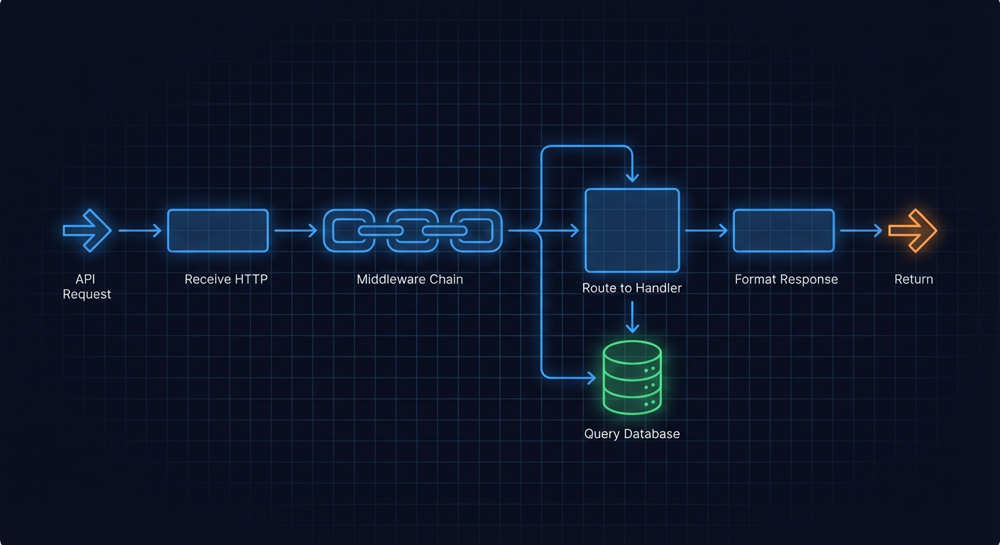
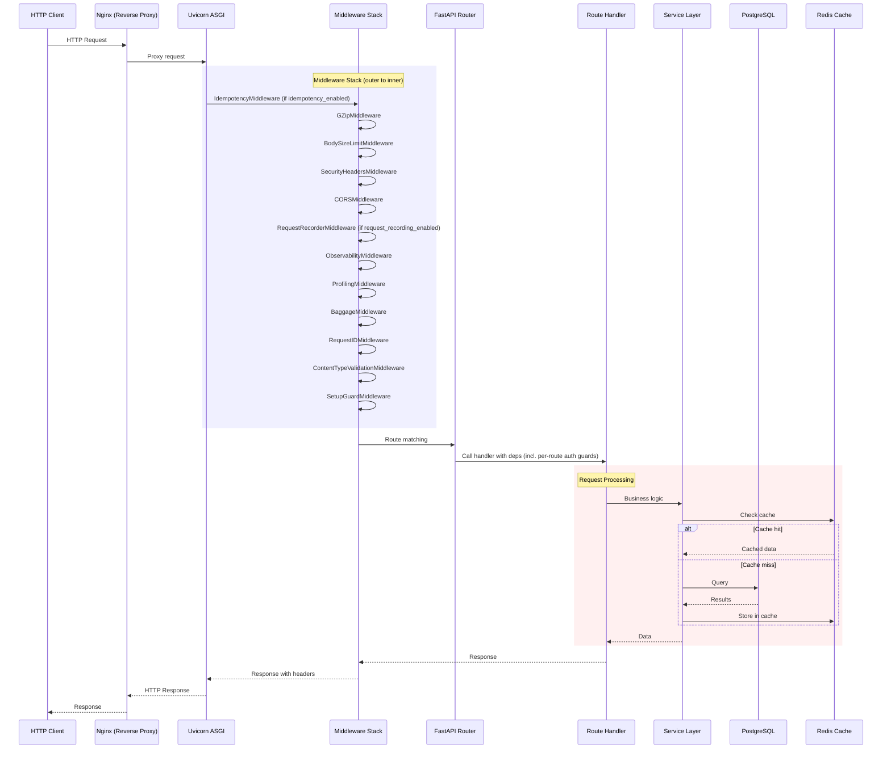
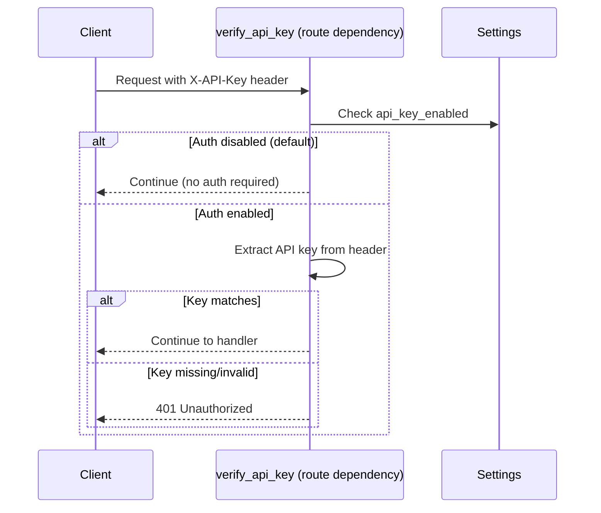
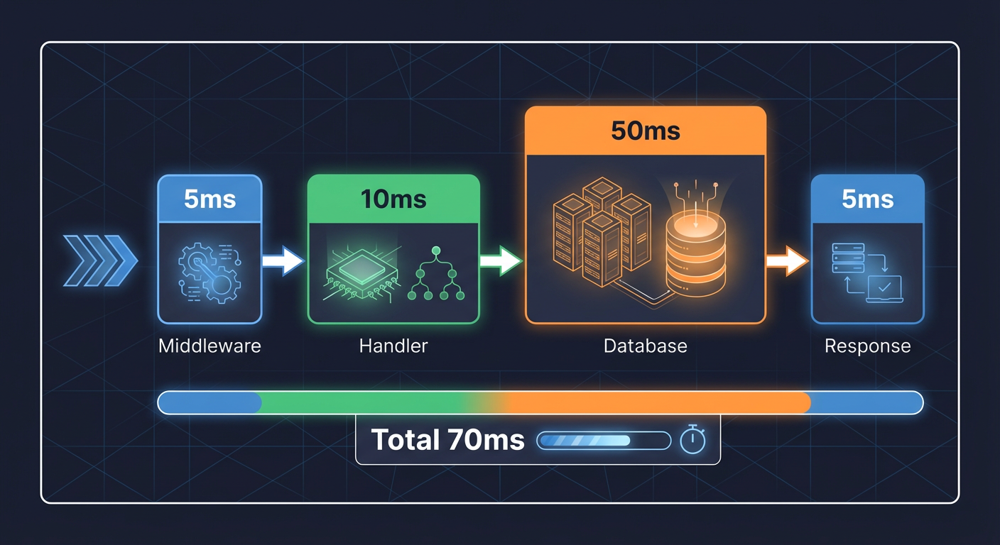
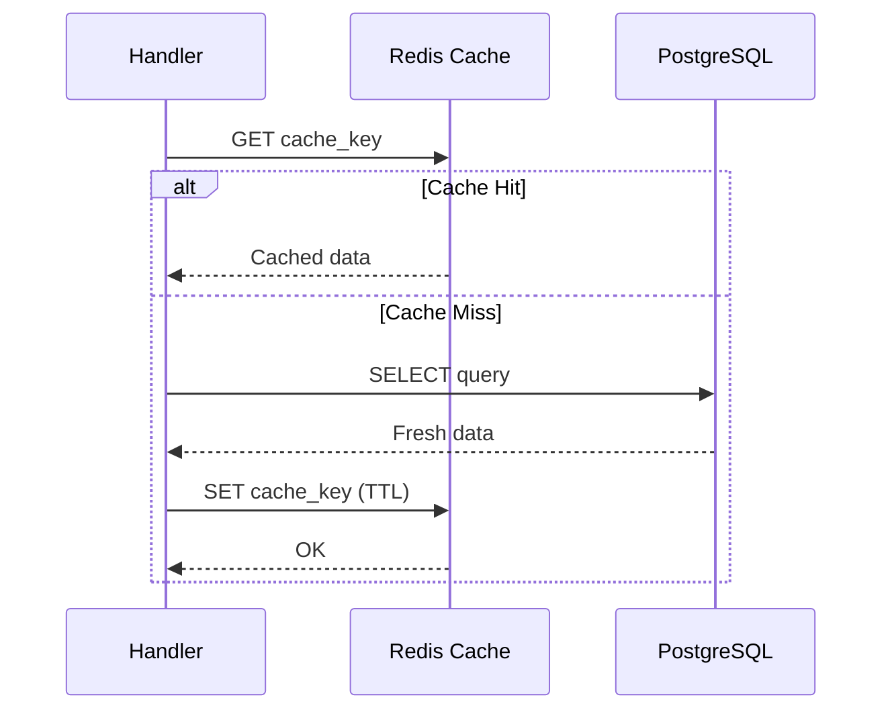

# API Request Flow

This document describes the complete lifecycle of a REST API request, from HTTP reception through response, including middleware processing, route handling, and error responses.



## Request Flow Sequence Diagram


```mermaid
sequenceDiagram
    participant Client as HTTP Client
    participant Nginx as Nginx (Reverse Proxy)
    participant Uvicorn as Uvicorn ASGI
    participant MW as Middleware Stack
    participant Router as FastAPI Router
    participant Handler as Route Handler
    participant Service as Service Layer
    participant DB as PostgreSQL
    participant Cache as Redis Cache

    Client->>Nginx: HTTP Request
    Nginx->>Uvicorn: Proxy request

    rect rgb(240, 240, 255)
        Note over MW: Middleware Stack (outer to inner)
        Uvicorn->>MW: IdempotencyMiddleware (if idempotency_enabled)
        MW->>MW: GZipMiddleware
        MW->>MW: BodySizeLimitMiddleware
        MW->>MW: SecurityHeadersMiddleware
        MW->>MW: CORSMiddleware
        MW->>MW: RequestRecorderMiddleware (if request_recording_enabled)
        MW->>MW: ObservabilityMiddleware
        MW->>MW: ProfilingMiddleware
        MW->>MW: BaggageMiddleware
        MW->>MW: RequestIDMiddleware
        MW->>MW: ContentTypeValidationMiddleware
        MW->>MW: SetupGuardMiddleware
    end

    MW->>Router: Route matching
    Router->>Handler: Call handler with deps (incl. per-route auth guards)

    rect rgb(255, 240, 240)
        Note over Handler: Request Processing
        Handler->>Service: Business logic
        Service->>Cache: Check cache
        alt Cache hit
            Cache-->>Service: Cached data
        else Cache miss
            Service->>DB: Query
            DB-->>Service: Results
            Service->>Cache: Store in cache
        end
        Service-->>Handler: Data
    end

    Handler-->>MW: Response
    MW-->>Uvicorn: Response with headers
    Uvicorn-->>Nginx: HTTP Response
    Nginx-->>Client: Response
```

## Middleware Stack

**Source:** imports at `backend/main.py:24-40`, registration at `backend/main.py:1351-1441`

### Middleware Imports (what actually gets registered)

```python
# backend/main.py:24-25 (FastAPI builtins)
from fastapi.middleware.cors import CORSMiddleware
from fastapi.middleware.gzip import GZipMiddleware

# backend/main.py:29-40
from backend.api.middleware import (
    BaggageMiddleware,
    BodySizeLimitMiddleware,
    ContentTypeValidationMiddleware,
    IdempotencyMiddleware,
    ObservabilityMiddleware,
    ProfilingMiddleware,
    RequestRecorderMiddleware,
    SecurityHeadersMiddleware,
    SetupGuardMiddleware,
)
from backend.api.middleware.request_id import RequestIDMiddleware
```

No `AuthMiddleware` import and no `Deprecation*` imports: those classes are not registered (NEM-5527 / NEM-5558, see below).

### Middleware Order (outer to inner)

With Starlette, the **last** `add_middleware()` call becomes the **outermost** layer, so requests hit the bottom of the registration block first:

| Order | Middleware                        | Purpose                                              | Gating                                         |
| ----- | --------------------------------- | ---------------------------------------------------- | ---------------------------------------------- |
| 1     | `IdempotencyMiddleware`           | Cache responses by `Idempotency-Key` (mutating only) | `idempotency_enabled`, default on              |
| 2     | `GZipMiddleware`                  | Compress responses > 1 KB                            | always                                         |
| 3     | `BodySizeLimitMiddleware`         | Limit request body size (10 MB)                      | always                                         |
| 4     | `SecurityHeadersMiddleware`       | Add security response headers                        | always                                         |
| 5     | `CORSMiddleware`                  | Cross-origin requests + preflight                    | always                                         |
| 6     | `RequestRecorderMiddleware`       | Record requests for debug replay                     | `request_recording_enabled`, default off       |
| 7     | `ObservabilityMiddleware`         | Timing, structured logging, Prometheus metrics       | always (logging via `request_logging_enabled`) |
| 8     | `ProfilingMiddleware`             | Tag Pyroscope profiles with trace IDs                | always                                         |
| 9     | `BaggageMiddleware`               | W3C Baggage context propagation                      | always                                         |
| 10    | `RequestIDMiddleware`             | Assign/propagate `X-Request-ID`                      | always                                         |
| 11    | `ContentTypeValidationMiddleware` | Validate Content-Type header                         | always                                         |
| 12    | `SetupGuardMiddleware`            | 503 until the first admin is registered              | always (whitelist excepted)                    |

**Present-but-unregistered middleware:**

- `AuthMiddleware` (`backend/api/middleware/auth.py`) — **not registered** (NEM-5527). It
  returned 401 for all non-exempt endpoints and broke Grafana dashboards and GPU settings;
  auth is handled by per-route dependencies instead (see Authentication Flow).
- `DeprecationMiddleware` / `DeprecationLoggerMiddleware` (`deprecation.py`, `deprecation_logger.py`) —
  **not registered** (NEM-5558). Zero deprecated endpoints were registered; re-add them when endpoints are deprecated.

### Request ID

Every request receives a unique identifier for tracing:

```
X-Request-ID: req-abc123def456
```

This ID is:

- Generated if not provided by client
- Propagated through all service calls
- Included in all log entries
- Returned in response headers

### Security Headers

```python
# Security headers added to all responses
X-Content-Type-Options: nosniff
X-Frame-Options: DENY
X-XSS-Protection: 1; mode=block
Strict-Transport-Security: max-age=31536000; includeSubDomains
```

## Authentication Flow

There is **no global authentication step on the live request path**. The single-user
local deployment model (AGENTS.md "Auth model") means that after first-admin
registration, API endpoints are open by design — network binding to `127.0.0.1` is
the primary security boundary — and only specific sensitive routes carry auth
guards, in the form of per-route FastAPI dependencies, not middleware:

| Guard                    | Defined in                                                         | Used by                                                                                                                                     | Fails with                                                                                                  |
| ------------------------ | ------------------------------------------------------------------ | ------------------------------------------------------------------------------------------------------------------------------------------- | ----------------------------------------------------------------------------------------------------------- |
| `verify_api_key`         | `backend/api/routes/system.py:272`, `backend/api/routes/dlq.py:41` | selected `/api/system` routes (config, anomaly-config, severity, cleanup, circuit-breaker reset), destructive `/api/dlq` POST/DELETE routes | 401 only when `api_key_enabled=true` (default `false` → guard is a no-op)                                   |
| `verify_api_key`         | `backend/api/routes/inbound_webhooks.py:121`                       | inbound webhook POST routes                                                                                                                 | 401 whenever the `X-API-Key` header is missing or shorter than 16 chars (not gated on `api_key_enabled`)    |
| `require_admin_access`   | `backend/api/routes/admin.py:262`                                  | destructive/seeding `/api/admin` routes                                                                                                     | 403 when `admin_enabled=false` (default `true` → passes; the flag is a kill switch, not a credential check) |
| `get_current_admin_user` | `backend/api/routes/auth.py:474`                                   | `/api/auth` api-key-management routes and three `/api/admin` routes — 403 unless the user `is_admin`                                        | 401 without a valid `session_id` cookie (checked via Redis session store)                                   |

A general route such as `GET /api/events` has no guard at all: a 401 there is
impossible on the live path.

### API Key Authentication (per-route dependency)

The 401 flow that remains lives in the `verify_api_key` dependency of the guarded routes:


```mermaid
sequenceDiagram
    participant Client
    participant Guard as verify_api_key (route dependency)
    participant Settings

    Client->>Guard: Request with X-API-Key header
    Guard->>Settings: Check api_key_enabled
    alt Auth disabled (default)
        Guard-->>Client: Continue (no auth required)
    else Auth enabled
        Guard->>Guard: Extract API key from header
        alt Key matches
            Guard-->>Client: Continue to handler
        else Key missing/invalid
            Guard-->>Client: 401 Unauthorized
        end
    end
```

### Supported Authentication Methods

| Method      | Header/Parameter    | Example                         | Notes                                       |
| ----------- | ------------------- | ------------------------------- | ------------------------------------------- |
| API Key     | `X-API-Key` header  | `X-API-Key: your-api-key`       | Guarded routes only, when `api_key_enabled` |
| Query param | `api_key`           | `/api/dlq/...?api_key=your-key` | Fallback accepted by `dlq.py`'s guard       |
| Session     | `session_id` cookie | browser login via `/api/auth`   | Routes using `get_current_admin_user`       |

## Route Registration

**Source:** `backend/main.py:35-71`

### Route Groups

```python
# backend/main.py:35-71
from backend.api.routes import (
    admin,
    ai_audit,
    alertmanager,
    alerts,
    analytics,
    audit,
    calibration,
    cameras,
    debug,
    detections,
    dlq,
    entities,
    events,
    exports,
    feedback,
    health_ai_services,
    hierarchy,
    household,
    jobs,
    logs,
    media,
    metrics,
    notification,
    notification_preferences,
    prompt_management,
    queues,
    rum,
    services,
    settings_api,
    summaries,
    system,
    webhooks,
    websocket,
    zone_household,
    zones,
)
```

### Key API Groups

| Route Prefix      | Purpose              | Rate Limited |
| ----------------- | -------------------- | ------------ |
| `/api/events`     | Security events CRUD | No           |
| `/api/cameras`    | Camera management    | No           |
| `/api/detections` | Detection records    | No           |
| `/api/alerts`     | Alert rules          | No           |
| `/api/zones`      | Zone management      | No           |
| `/api/metrics`    | Prometheus metrics   | No           |
| `/health`         | Health checks        | No           |
| `/api/admin`      | Administrative ops   | Yes          |

## Dependency Injection

### Database Session

```python
# Route handler with database dependency
@router.get("/events/{event_id}")
async def get_event(
    event_id: int,
    session: AsyncSession = Depends(get_session),
) -> EventResponse:
    result = await session.execute(
        select(Event).where(Event.id == event_id)
    )
    event = result.scalar_one_or_none()
    if not event:
        raise HTTPException(status_code=404, detail="Event not found")
    return EventResponse.from_orm(event)
```

### Redis Client

```python
# Route handler with Redis dependency
@router.get("/queue-stats")
async def get_queue_stats(
    redis: RedisClient = Depends(get_redis),
) -> QueueStatsResponse:
    detection_queue_len = await redis.llen(DETECTION_QUEUE)
    analysis_queue_len = await redis.llen(ANALYSIS_QUEUE)
    return QueueStatsResponse(
        detection_queue=detection_queue_len,
        analysis_queue=analysis_queue_len,
    )
```

## Request Processing Timeline



```
Time 0ms:   Request received by Uvicorn
Time 1ms:   IdempotencyMiddleware — pass-through for GETs
Time 2ms:   BodySizeLimitMiddleware checks size
Time 3ms:   SecurityHeadersMiddleware prepares headers
Time 4ms:   CORS check (preflight OPTIONS stops here)
Time 5ms:   ObservabilityMiddleware starts timer (logs/metrics emitted on the way out)
Time 6ms:   RequestIDMiddleware assigns ID
Time 7ms:   ContentTypeValidationMiddleware validates
Time 8ms:   SetupGuardMiddleware check (503 if no users exist yet)
Time 9ms:   Route matching
Time 10ms:  Dependency resolution (get_session, per-route auth guards, etc.)
Time 12ms:  Handler execution starts
            ...
            Handler execution (variable)
            ...
Time N ms:  Handler returns response
Time N+1ms: RequestIDMiddleware echoes X-Request-ID / X-Correlation-ID
Time N+2ms: ObservabilityMiddleware adds X-Response-Time, logs completion,
            observes the duration histogram
Time N+3ms: Response sent (gzip-compressed if > 1 KB)
```

## Caching Strategy

### Cache-Aside Pattern


```mermaid
sequenceDiagram
    participant Handler
    participant Cache as Redis Cache
    participant DB as PostgreSQL

    Handler->>Cache: GET cache_key
    alt Cache Hit
        Cache-->>Handler: Cached data
    else Cache Miss
        Handler->>DB: SELECT query
        DB-->>Handler: Fresh data
        Handler->>Cache: SET cache_key (TTL)
        Cache-->>Handler: OK
    end
```

### Cache Keys

| Resource     | Key Pattern          | TTL  |
| ------------ | -------------------- | ---- |
| Events list  | `events:list:{hash}` | 30s  |
| Event by ID  | `events:{id}`        | 60s  |
| Camera list  | `cameras:list`       | 120s |
| Camera by ID | `cameras:{id}`       | 120s |
| Zone list    | `zones:list`         | 300s |
| Metrics      | `metrics:{type}`     | 10s  |

## Error Handling

### Exception Handlers

**Source:** `backend/api/exception_handlers.py`

```python
# Exception handler registration
register_exception_handlers(app)
```

### Standard Error Response Format

```json
{
  "detail": "Event not found",
  "request_id": "req-abc123def456",
  "timestamp": "2025-12-23T12:00:00Z"
}
```

### HTTP Status Codes

| Code | Meaning               | Use Case                          |
| ---- | --------------------- | --------------------------------- |
| 200  | OK                    | Successful GET/PUT/PATCH          |
| 201  | Created               | Successful POST creating resource |
| 204  | No Content            | Successful DELETE                 |
| 400  | Bad Request           | Invalid request body              |
| 401  | Unauthorized          | Missing/invalid auth              |
| 403  | Forbidden             | Insufficient permissions          |
| 404  | Not Found             | Resource doesn't exist            |
| 409  | Conflict              | Duplicate resource                |
| 422  | Unprocessable Entity  | Validation error                  |
| 429  | Too Many Requests     | Rate limit exceeded               |
| 500  | Internal Server Error | Unexpected error                  |
| 503  | Service Unavailable   | Dependency unavailable            |

### Circuit Breaker Errors

When a dependency circuit breaker is open:

```json
{
  "detail": "Service temporarily unavailable",
  "service": "yolo26",
  "circuit_state": "open",
  "retry_after": 60
}
```

## Request Validation

### Pydantic Schema Validation

```python
# Request body validation
class EventCreateRequest(BaseModel):
    camera_id: str = Field(..., min_length=1, max_length=50)
    risk_score: int = Field(..., ge=0, le=100)
    summary: str = Field(..., min_length=1, max_length=1000)

@router.post("/events")
async def create_event(
    request: EventCreateRequest,
) -> EventResponse:
    ...
```

### Path Parameter Validation

```python
@router.get("/events/{event_id}")
async def get_event(
    event_id: int = Path(..., ge=1, description="Event ID"),
) -> EventResponse:
    ...
```

### Query Parameter Validation

```python
@router.get("/events")
async def list_events(
    limit: int = Query(default=50, ge=1, le=100),
    offset: int = Query(default=0, ge=0),
    camera_id: str | None = Query(default=None),
    risk_level: str | None = Query(default=None),
) -> EventListResponse:
    ...
```

## Response Serialization

### Response Models

```python
class EventResponse(BaseModel):
    id: int
    batch_id: str
    camera_id: str
    risk_score: int
    risk_level: str
    summary: str
    reasoning: str | None
    created_at: datetime
    acknowledged_at: datetime | None

    class Config:
        from_attributes = True
```

### Pagination

```python
class PaginatedResponse(BaseModel, Generic[T]):
    items: list[T]
    total: int
    limit: int
    offset: int
    has_more: bool

# Response
{
    "items": [...],
    "total": 150,
    "limit": 50,
    "offset": 0,
    "has_more": true
}
```

## Complete Request Example

### GET /api/events/{id}

```
1. Client sends:
   GET /api/events/42
   Headers:
     Accept: application/json

2. Middleware processing (outer to inner):
   - Idempotency: pass-through (GET is not a mutating method)
   - BodySizeLimit / SecurityHeaders / CORS: checked, pass
   - Observability: timer started
   - RequestID: req-abc123 assigned
   - SetupGuard: users exist, pass
   (No auth step: /api/events carries no auth guard — see Authentication Flow)

3. Route matching:
   - Matched: GET /api/events/{event_id}
   - Path params: event_id=42

4. Dependency injection:
   - AsyncSession created
   - Connection from pool

5. Handler execution:
   - SELECT * FROM events WHERE id = 42
   - Result: Event object

6. Response:
   HTTP/1.1 200 OK
   Content-Type: application/json
   X-Request-ID: req-abc123
   X-Content-Type-Options: nosniff

   {
     "id": 42,
     "batch_id": "batch-a1b2c3d4",
     "camera_id": "front_door",
     "risk_score": 75,
     "risk_level": "high",
     ...
   }
```

## Metrics and Observability

### Request Metrics

- `http_request_duration_seconds` - Request latency histogram (Prometheus
  middleware, `backend/api/middleware/prometheus.py`), labeled `method`,
  `handler`, `status`, `http_route`. Request totals and rate come from the
  histogram's derived `_count` series. No separate `hsi_http_requests_total`,
  `hsi_http_request_duration_seconds` or request/response size metrics exist.

### Request Tracing

When OpenTelemetry is enabled:

```
Trace: GET /api/events/42
  Span: http_request
    Span: db_query (SELECT events)
    Span: cache_check (Redis GET)
```

## Related Documents

- [websocket-message-flow.md](websocket-message-flow.md) - WebSocket comparison
- [error-recovery-flow.md](error-recovery-flow.md) - Error handling patterns
- [startup-shutdown-flow.md](startup-shutdown-flow.md) - Application lifecycle
