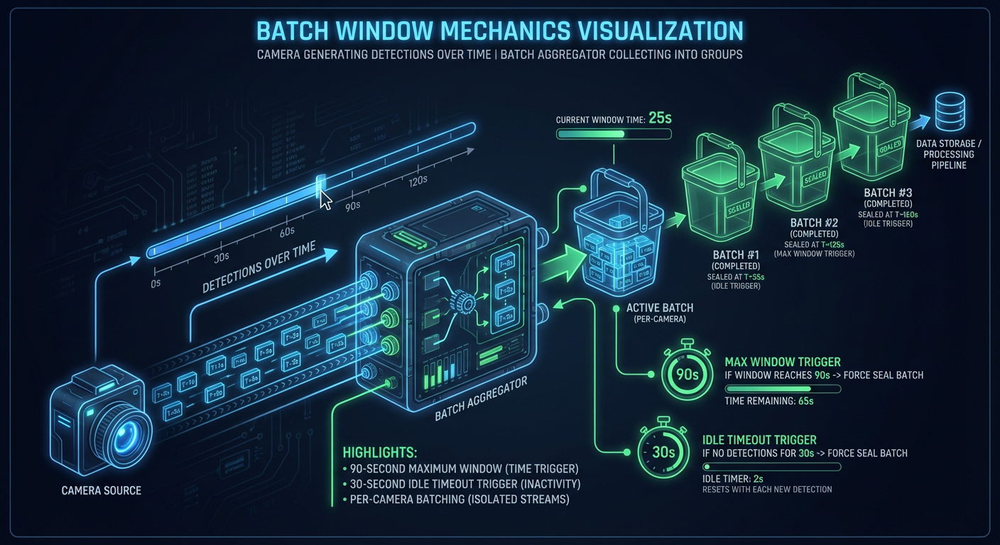
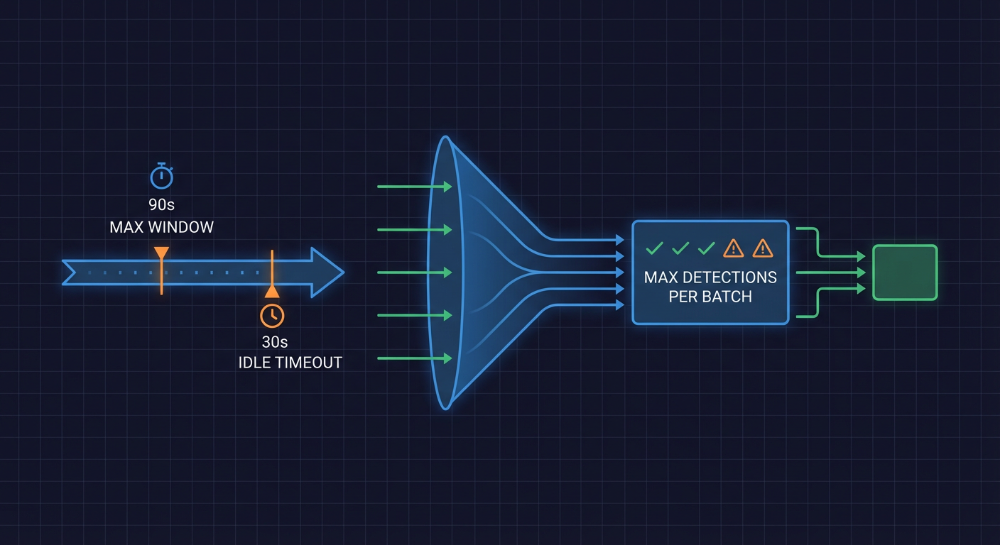
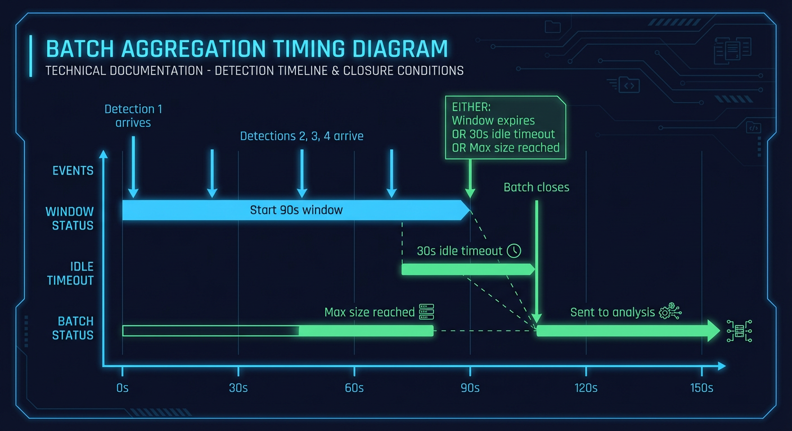
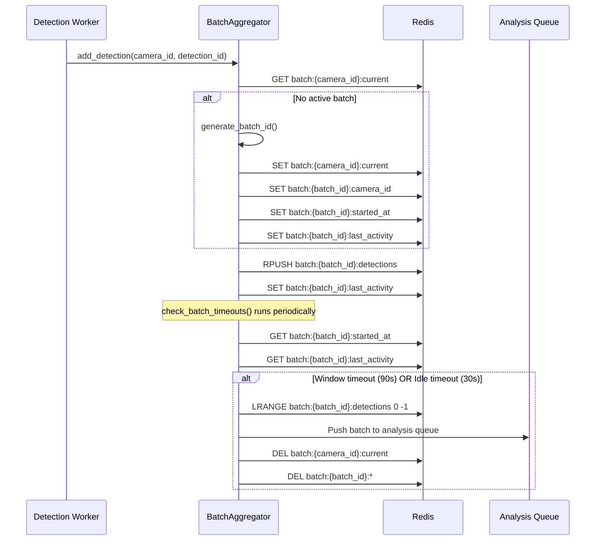
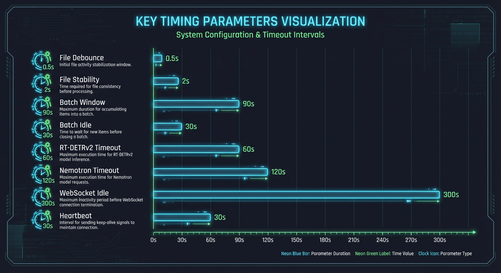
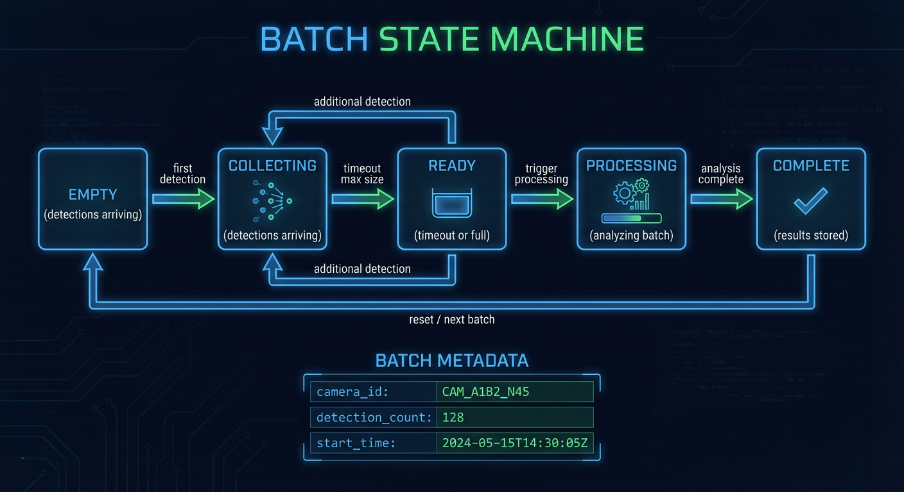

# Batch Aggregation Flow

This document describes the detection batching mechanism, including timing windows, Redis data structures, and batch lifecycle management.




## Batch Aggregation Overview



**Source:** `backend/services/batch_aggregator.py:1-40`

```python
# backend/services/batch_aggregator.py:1-40
# Batching Logic:
#     - Create new batch when first detection arrives for a camera
#     - Add subsequent detections within 90-second window
#     - Close batch if:
#         * 90 seconds elapsed from batch start (window timeout)
#         * 30 seconds with no new detections (idle timeout)
#     - On batch close: push to analysis_queue with batch_id, camera_id, detection_ids
```

## Timing Diagram



```
Timeline for Camera "front_door"
═══════════════════════════════════════════════════════════════════════

T+0s    Detection #1 arrives
        ├── Create batch-a1b2c3d4
        ├── Set batch:started_at = T+0
        └── Set batch:last_activity = T+0

T+5s    Detection #2 arrives
        ├── Add to batch:detections
        └── Update batch:last_activity = T+5

T+15s   Detection #3 arrives
        ├── Add to batch:detections
        └── Update batch:last_activity = T+15

T+45s   (30s idle check - PASS, last activity at T+15, only 30s ago)

T+50s   Detection #4 arrives
        ├── Add to batch:detections
        └── Update batch:last_activity = T+50

═══════════════════════════════════════════════════════════════════════
SCENARIO A: Idle Timeout (30s with no activity)
═══════════════════════════════════════════════════════════════════════

T+80s   (30s idle check - FAIL, last activity at T+50, 30s ago)
        ├── Close batch-a1b2c3d4
        ├── Push to analysis_queue
        └── Clear batch:{camera_id}:current

═══════════════════════════════════════════════════════════════════════
SCENARIO B: Window Timeout (90s elapsed from start)
═══════════════════════════════════════════════════════════════════════

T+60s   Detection #5 arrives
        ├── Add to batch:detections
        └── Update batch:last_activity = T+60

T+75s   Detection #6 arrives
        ├── Add to batch:detections
        └── Update batch:last_activity = T+75

T+90s   (Window timeout - 90s elapsed from T+0)
        ├── Close batch-a1b2c3d4
        ├── Push to analysis_queue
        └── Clear batch:{camera_id}:current
```

## Batch Sequence Diagram



## Redis Data Structures

**Source:** `backend/services/batch_aggregator.py:20-35`

```python
# backend/services/batch_aggregator.py:20-35
# Redis Keys (all keys have 1-hour TTL for orphan cleanup):
#     - batch:{camera_id}:current - Current batch ID for camera
#     - batch:{batch_id}:camera_id - Camera ID for batch
#     - batch:{batch_id}:detections - Redis LIST of detection IDs (uses RPUSH)
#     - batch:{batch_id}:started_at - Batch start timestamp (float)
#     - batch:{batch_id}:last_activity - Last activity timestamp (float)
```

### Key Structure Example

```
Camera: front_door
Batch: batch-a1b2c3d4

Keys:
  batch:front_door:current     = "batch-a1b2c3d4"
  batch:batch-a1b2c3d4:camera_id     = "front_door"
  batch:batch-a1b2c3d4:detections    = [1, 2, 3, 4]  (LIST)
  batch:batch-a1b2c3d4:started_at    = 1703332800.0
  batch:batch-a1b2c3d4:last_activity = 1703332850.0
  batch:batch-a1b2c3d4:pipeline_start_time = "2024-12-23T12:00:00Z"
```

### Key TTL

**Source:** `backend/services/batch_aggregator.py:132-133`

```python
# backend/services/batch_aggregator.py:132-133
# TTL for batch Redis keys (1 hour) - ensures orphan cleanup if service crashes
BATCH_KEY_TTL_SECONDS = 3600
```

## BatchAggregator Class

**Source:** `backend/services/batch_aggregator.py:122-160`

```python
# backend/services/batch_aggregator.py:122-160
class BatchAggregator:
    """Aggregates detections into time-based batches for analysis."""

    # TTL for batch Redis keys (1 hour)
    BATCH_KEY_TTL_SECONDS = 3600

    def __init__(self, redis_client: RedisClient | None = None, analyzer: Any | None = None):
        self._redis = redis_client
        self._analyzer = analyzer
        settings = get_settings()
        self._batch_window = settings.batch_window_seconds      # 90s
        self._idle_timeout = settings.batch_idle_timeout_seconds # 30s
        self._analysis_queue = ANALYSIS_QUEUE
        self._fast_path_threshold = settings.fast_path_confidence_threshold
        self._fast_path_types = settings.fast_path_object_types
        self._batch_max_detections = settings.batch_max_detections

        # Per-camera locks to prevent race conditions
        self._camera_locks: defaultdict[str, asyncio.Lock] = defaultdict(asyncio.Lock)

        # Global lock for batch timeout checking and closing operations
        self._batch_close_lock = asyncio.Lock()

        # Lock for the camera_locks dict itself
        self._locks_lock = asyncio.Lock()
```



### Configuration Parameters

| Parameter      | Default      | Setting                      |
| -------------- | ------------ | ---------------------------- |
| Batch window   | 90s          | `batch_window_seconds`       |
| Idle timeout   | 30s          | `batch_idle_timeout_seconds` |
| Max detections | Configurable | `batch_max_detections`       |
| Key TTL        | 3600s        | `BATCH_KEY_TTL_SECONDS`      |

## Batch ID Generation

**Source:** `backend/services/batch_aggregator.py:63-77`

```python
# backend/services/batch_aggregator.py:63-77
def generate_batch_id() -> str:
    """Generate a short, unique batch identifier.

    Returns a batch ID in the format 'batch-XXXXXXXX' where X is a hex character.
    This provides 4 billion unique IDs while keeping logs human-readable.

    Returns:
        Unique batch identifier string (e.g., 'batch-a1b2c3d4')
    """
    return f"batch-{uuid.uuid4().hex[:8]}"
```

## Atomic Operations

**Source:** `backend/services/batch_aggregator.py:282-331`

### Atomic List Append

```python
# backend/services/batch_aggregator.py:282-304
async def _atomic_list_append(self, key: str, value: int, ttl: int) -> int:
    """Atomically append a value to a Redis list and refresh TTL.

    Uses Redis RPUSH for atomic append, eliminating race conditions
    in distributed environments.
    """
    client = self._redis._client
    # RPUSH is atomic - multiple processes can safely append
    length: int = await client.rpush(key, str(value))
    # Refresh TTL
    await client.expire(key, ttl)
    return length
```

### Atomic Batch Creation

**Source:** `backend/services/batch_aggregator.py:333-391`

```python
# backend/services/batch_aggregator.py:333-391
async def _create_batch_metadata_atomic(
    self,
    batch_key: str,
    batch_id: str,
    camera_id: str,
    current_time: float,
    ttl: int,
    pipeline_start_time: str | None = None,
) -> None:
    """Create batch metadata atomically using Redis pipeline with MULTI/EXEC.

    NEM-2014: All batch metadata keys are set in a single transaction to prevent
    partial data if the process crashes between Redis commands.

    Using pipeline(transaction=True) wraps all operations in MULTI/EXEC,
    ensuring atomic execution - either all keys are set or none are.
    """
    client = self._redis._client

    # Use Redis pipeline with transaction=True for MULTI/EXEC atomicity
    async with client.pipeline(transaction=True) as pipe:
        pipe.set(batch_key, batch_id, ex=ttl)
        pipe.set(f"batch:{batch_id}:camera_id", camera_id, ex=ttl)
        pipe.set(f"batch:{batch_id}:started_at", str(current_time), ex=ttl)
        pipe.set(f"batch:{batch_id}:last_activity", str(current_time), ex=ttl)

        if pipeline_start_time:
            pipe.set(f"batch:{batch_id}:pipeline_start_time", pipeline_start_time, ex=ttl)

        await pipe.execute()
```

## Concurrency Control

**Source:** `backend/services/batch_aggregator.py:27-35`

```python
# backend/services/batch_aggregator.py:27-35
# Concurrency:
#     Uses per-camera locks to prevent race conditions when multiple detections
#     arrive for the same camera simultaneously. Global lock protects batch
#     timeout checking and closing operations.
#
#     For distributed environments (multiple backend instances), detection list
#     updates use Redis RPUSH for atomic append operations, eliminating race
#     conditions in the read-modify-write pattern.
```

### Lock Hierarchy

```
1. _locks_lock (asyncio.Lock)
   └── Protects camera_locks dict creation

2. _camera_locks[camera_id] (per-camera asyncio.Lock)
   └── Protects batch operations for a single camera

3. _batch_close_lock (asyncio.Lock)
   └── Protects batch timeout checking and closing
```

## Batch Close Conditions

| Condition      | Trigger                   | Check Frequency         |
| -------------- | ------------------------- | ----------------------- |
| Window timeout | 90s from batch start      | Periodic (configurable) |
| Idle timeout   | 30s without new detection | Periodic (configurable) |
| Max detections | Batch size limit reached  | On each detection add   |

### Close Flag Protection

**Source:** `backend/services/batch_aggregator.py:58-60`

```python
# backend/services/batch_aggregator.py:58-60
# TTL for batch closing flag (5 minutes) - prevents orphaned lock flags if process crashes
# NEM-2507: This ensures closing flags auto-expire if the batch close operation doesn't complete
BATCH_CLOSING_FLAG_TTL_SECONDS = 300
```

## WebSocket Broadcasts

**Source:** `backend/services/batch_aggregator.py:163-264`

### Detection New Broadcast

```python
# backend/services/batch_aggregator.py:163-211
async def _broadcast_detection_new(
    self,
    detection_id: int,
    batch_id: str,
    camera_id: str,
    label: str | None = None,
    confidence: float | None = None,
) -> None:
    """Broadcast a detection.new event via WebSocket (NEM-2506)."""
    broadcaster = await get_broadcaster(self._redis)
    detection_data = {
        "detection_id": detection_id,
        "batch_id": batch_id,
        "camera_id": camera_id,
        "label": label or "unknown",
        "confidence": confidence if confidence is not None else 0.0,
        "timestamp": datetime.now(UTC).isoformat(),
    }
    await broadcaster.broadcast_detection_new(detection_data)
```

### Batch Closed Broadcast

```python
# backend/services/batch_aggregator.py:213-264
async def _broadcast_detection_batch(
    self,
    batch_id: str,
    camera_id: str,
    detection_ids: list[int],
    started_at: float,
    closed_at: float,
    close_reason: str | None = None,
) -> None:
    """Broadcast a detection.batch event via WebSocket (NEM-2506)."""
    broadcaster = await get_broadcaster(self._redis)
    batch_data = {
        "batch_id": batch_id,
        "camera_id": camera_id,
        "detection_ids": detection_ids,
        "detection_count": len(detection_ids),
        "started_at": datetime.fromtimestamp(started_at, tz=UTC).isoformat(),
        "closed_at": datetime.fromtimestamp(closed_at, tz=UTC).isoformat(),
        "close_reason": close_reason,
    }
    await broadcaster.broadcast_detection_batch(batch_data)
```

## Memory Pressure Backpressure

**Source:** `backend/services/batch_aggregator.py:36-40`

```python
# backend/services/batch_aggregator.py:36-40
# Memory Pressure Backpressure (NEM-1727):
#     When GPU memory pressure reaches CRITICAL levels, the batch aggregator can
#     apply backpressure to reduce processing load. Use should_apply_backpressure()
#     to check if backpressure should be applied before processing detections.
```

```python
# backend/services/batch_aggregator.py:98-119
async def get_memory_pressure_level() -> Any:
    """Get current GPU memory pressure level."""
    from backend.services.gpu_monitor import MemoryPressureLevel

    if _gpu_monitor is None:
        return MemoryPressureLevel.NORMAL

    try:
        return await _gpu_monitor.check_memory_pressure()
    except Exception as e:
        logger.debug(f"Failed to check memory pressure: {e}")
        return MemoryPressureLevel.NORMAL
```

## Batch Lifecycle State Diagram



```mermaid
stateDiagram-v2
    [*] --> Empty: No batch for camera

    Empty --> Active: First detection arrives
    Note right of Active: batch:{camera_id}:current set

    Active --> Active: Detection arrives (within window)
    Note right of Active: RPUSH to detections list

    Active --> Closing: Timeout triggered
    Note right of Closing: Close flag set (5min TTL)

    Closing --> Closed: Batch pushed to queue
    Note right of Closed: Keys deleted

    Closed --> Empty: Ready for next batch

    Active --> Closed: Max detections reached
```

## Error Handling

### Redis Unavailable

```python
# If Redis fails during batch creation
try:
    await self._create_batch_metadata_atomic(...)
except Exception as e:
    logger.error("Atomic batch metadata creation failed - transaction rolled back")
    raise
```

### Orphan Cleanup

All Redis keys have 1-hour TTL (`BATCH_KEY_TTL_SECONDS = 3600`):

- If service crashes mid-batch, keys auto-expire
- Next startup begins with clean state
- No manual cleanup required

### Close Flag Recovery

Close flag TTL of 5 minutes (`BATCH_CLOSING_FLAG_TTL_SECONDS = 300`):

- Prevents deadlock if close operation fails
- Auto-expires if process crashes during close
- Subsequent timeout check will retry close

## Batch to Analysis Queue Message

When a batch is closed, it's pushed to the analysis queue:

```json
{
  "batch_id": "batch-a1b2c3d4",
  "camera_id": "front_door",
  "detection_ids": [1, 2, 3, 4],
  "started_at": "2024-12-23T12:00:00Z",
  "closed_at": "2024-12-23T12:01:30Z",
  "close_reason": "idle_timeout",
  "pipeline_start_time": "2024-12-23T11:59:58Z"
}
```

## Related Documents

- [image-to-event.md](image-to-event.md) - Complete detection flow
- [llm-analysis-flow.md](llm-analysis-flow.md) - What happens after batch close
- [error-recovery-flow.md](error-recovery-flow.md) - Error handling patterns
