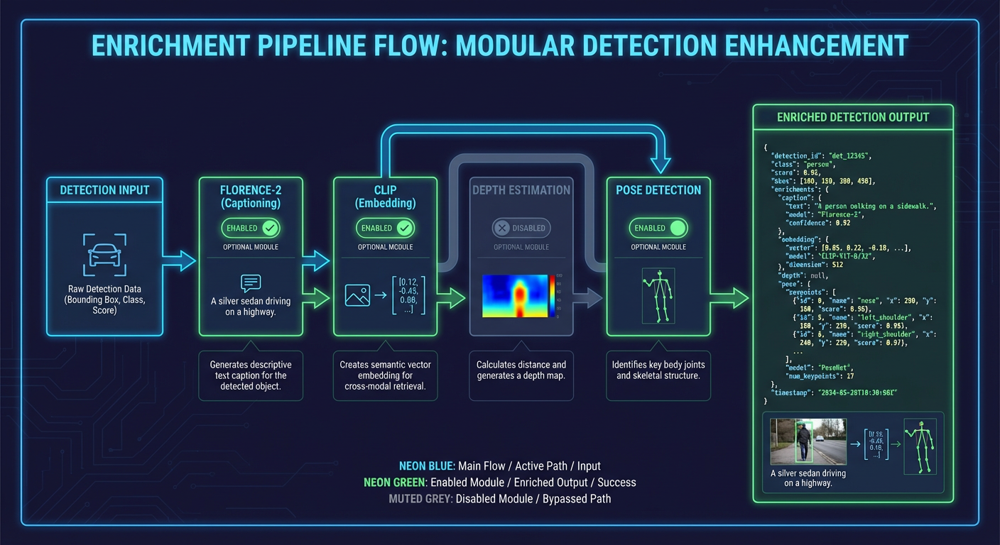
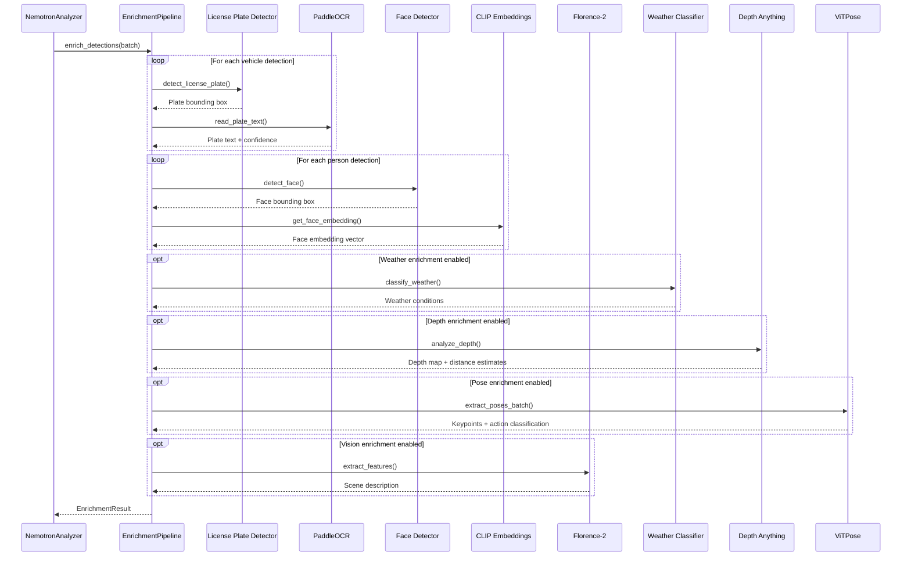
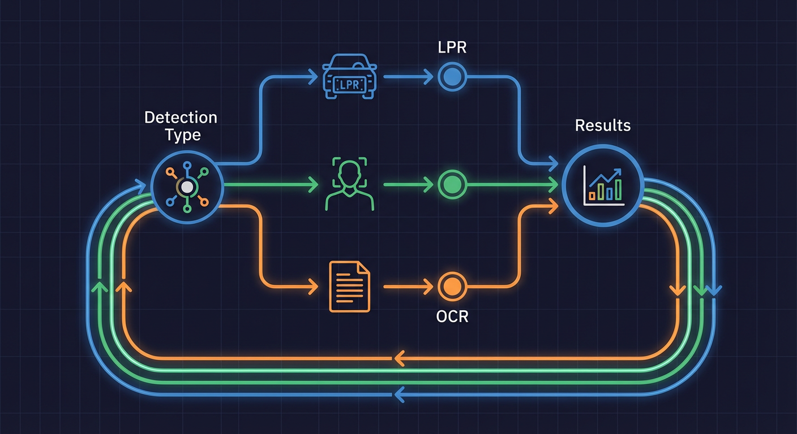
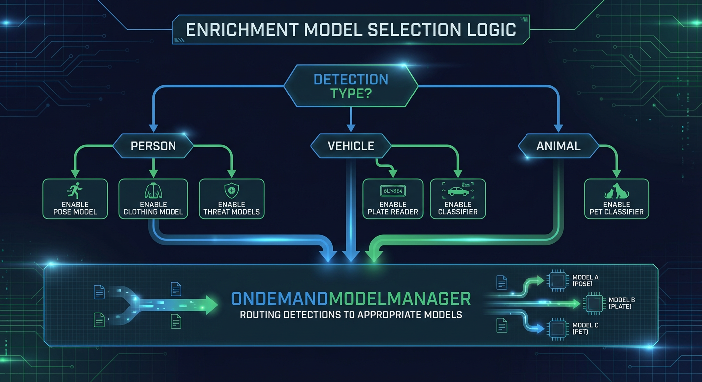

# Enrichment Pipeline Flow

This document describes the enrichment pipeline that enhances detections with additional AI-generated context before LLM analysis.



## Pipeline Overview

**Source:** `backend/services/enrichment_pipeline.py:1-17`

```python
# backend/services/enrichment_pipeline.py:1-17
"""Enrichment Pipeline for detection context enhancement.

This module provides the EnrichmentPipeline service that enriches detections
with additional context by running on-demand AI models:

1. License Plate Detection: Runs YOLO11 on vehicle detections
2. License Plate OCR: Runs PaddleOCR on detected plates
3. Face Detection: Runs YOLO11 on person detections
4. Image Quality Assessment: BRISQUE for blur/noise/tampering detection

The pipeline can use either:
- Local models via ModelManager (default, for single-process deployments)
- Remote HTTP service at ai-enrichment:8094 (for containerized deployments)
"""
```

## Enrichment Sequence Diagram



## EnrichmentStatus Enum

**Source:** `backend/services/enrichment_pipeline.py:154-167`

```python
# backend/services/enrichment_pipeline.py:154-167
class EnrichmentStatus(str, Enum):
    """Status of enrichment pipeline execution.

    Tracks the overall success/failure state of enrichment operations:
    - FULL: All enabled enrichment models succeeded
    - PARTIAL: Some models succeeded, some failed (partial enrichment available)
    - FAILED: All models failed (no enrichment data available)
    - SKIPPED: Enrichment was not attempted (disabled or no applicable detections)
    """

    FULL = "full"
    PARTIAL = "partial"
    FAILED = "failed"
    SKIPPED = "skipped"
```

## ErrorCategory Enum

**Source:** `backend/services/enrichment_pipeline.py:170-189`

```python
# backend/services/enrichment_pipeline.py:170-189
class ErrorCategory(str, Enum):
    """Category of enrichment error for observability.

    Error categories help distinguish between transient failures that
    can be retried and permanent failures that indicate bugs.
    """

    # Transient errors (use fallback, retry later)
    SERVICE_UNAVAILABLE = "service_unavailable"  # Connection errors, service down
    TIMEOUT = "timeout"                          # Request timed out
    RATE_LIMITED = "rate_limited"                # HTTP 429, back off
    SERVER_ERROR = "server_error"                # HTTP 5xx, transient issue

    # Permanent errors (likely a bug, requires investigation)
    CLIENT_ERROR = "client_error"                # HTTP 4xx, bad request
    PARSE_ERROR = "parse_error"                  # JSON/response parsing failed
    VALIDATION_ERROR = "validation_error"        # Invalid input data

    # Unexpected errors (catch-all, needs investigation)
    UNEXPECTED = "unexpected"                    # Unknown error type
```

## EnrichmentError Dataclass

**Source:** `backend/services/enrichment_pipeline.py:192-225`

```python
# backend/services/enrichment_pipeline.py:192-225
@dataclass(slots=True)
class EnrichmentError:
    """Structured error information for enrichment failures.

    Provides detailed error context for observability and debugging,
    including the error category, reason, and original exception type.

    Attributes:
        operation: The operation that failed (e.g., "license_plate_detection")
        category: Error category for classification
        reason: Human-readable reason for the failure
        error_type: The type name of the original exception
        is_transient: Whether the error is transient (retry may succeed)
        details: Additional context-specific details
    """

    operation: str
    category: ErrorCategory
    reason: str
    error_type: str
    is_transient: bool = True
    details: dict[str, Any] = field(default_factory=dict)
```

### Error Classification

**Source:** `backend/services/enrichment_pipeline.py:227-356`

```python
# backend/services/enrichment_pipeline.py:227-356
@classmethod
def from_exception(
    cls,
    operation: str,
    exc: Exception,
    *,
    details: dict[str, Any] | None = None,
) -> EnrichmentError:
    """Create an EnrichmentError from an exception.

    Classifies the exception into the appropriate category and determines
    whether it is transient (retry may succeed) or permanent (likely a bug).
    """
```

| Exception Type                        | Category              | Transient |
| ------------------------------------- | --------------------- | --------- |
| `httpx.ConnectError`                  | `SERVICE_UNAVAILABLE` | Yes       |
| `httpx.TimeoutException`              | `TIMEOUT`             | Yes       |
| HTTP 429                              | `RATE_LIMITED`        | Yes       |
| HTTP 5xx                              | `SERVER_ERROR`        | Yes       |
| HTTP 4xx                              | `CLIENT_ERROR`        | No        |
| `ValueError`, `KeyError`, `TypeError` | `PARSE_ERROR`         | No        |
| `ValidationError`                     | `VALIDATION_ERROR`    | No        |
| Other                                 | `UNEXPECTED`          | Yes       |

## EnrichmentTrackingResult

**Source:** `backend/services/enrichment_pipeline.py:359-400`

```python
# backend/services/enrichment_pipeline.py:359-400
@dataclass(slots=True)
class EnrichmentTrackingResult:
    """Tracks which enrichment models succeeded/failed for a batch.

    This provides visibility into partial failures instead of silently
    degrading when some enrichment models fail.

    Attributes:
        status: Overall enrichment status (full, partial, failed, skipped)
        successful_models: List of model names that succeeded
        failed_models: List of model names that failed
        errors: Dictionary mapping model names to error messages
        data: The actual EnrichmentResult data (if any models succeeded)
    """

    status: EnrichmentStatus = EnrichmentStatus.SKIPPED
    successful_models: list[str] = field(default_factory=list)
    failed_models: list[str] = field(default_factory=list)
    errors: dict[str, str] = field(default_factory=dict)
    data: EnrichmentResult | None = None

    @property
    def success_rate(self) -> float:
        """Calculate the success rate of enrichment models."""
        total = len(self.successful_models) + len(self.failed_models)
        if total == 0:
            return 1.0
        return len(self.successful_models) / total
```




## Model Dependencies

**Source:** `backend/services/enrichment_pipeline.py:67-147`

```python
# backend/services/enrichment_pipeline.py:67-147
# Model imports for various enrichment capabilities
from backend.services.depth_anything_loader import (
    DepthAnalysisResult,
    analyze_depth,
)
from backend.services.fashion_clip_loader import (
    ClothingClassification,
    classify_clothing,
)
from backend.services.household_matcher import (
    HouseholdMatch,
    get_household_matcher,
)
from backend.services.image_quality_loader import (
    ImageQualityResult,
    assess_image_quality,
)
from backend.services.model_zoo import (
    ANIMAL_CLASSES,
    PERSON_CLASS,
    VEHICLE_CLASSES,
    ModelManager,
)
from backend.services.pet_classifier_loader import (
    PetClassificationResult,
    classify_pet,
)
from backend.services.vehicle_classifier_loader import (
    VehicleClassificationResult,
    classify_vehicle,
)
from backend.services.vehicle_damage_loader import (
    VehicleDamageResult,
    detect_vehicle_damage,
)
from backend.services.violence_loader import (
    ViolenceDetectionResult,
    classify_violence,
)
from backend.services.vitpose_loader import (
    PoseResult,
    extract_poses_batch,
)
from backend.services.weather_loader import (
    WeatherResult,
    classify_weather,
)
from backend.services.xclip_loader import (
    classify_actions,
)
```

## Enrichment Models

| Model                      | Input        | Output              | Use Case                 |
| -------------------------- | ------------ | ------------------- | ------------------------ |
| **YOLO11 (License Plate)** | Vehicle crop | Plate bounding box  | Detect license plates    |
| **PaddleOCR**              | Plate crop   | Text + confidence   | Read plate characters    |
| **YOLO11 (Face)**          | Person crop  | Face bounding box   | Detect faces             |
| **CLIP**                   | Face crop    | Embedding vector    | Face similarity matching |
| **Florence-2**             | Full image   | Scene description   | Visual context           |
| **Weather Classifier**     | Full image   | Weather conditions  | Environmental context    |
| **Depth Anything**         | Full image   | Depth map           | Distance estimation      |
| **ViTPose**                | Person crop  | Keypoints           | Pose/action detection    |
| **FashionCLIP**            | Person crop  | Clothing attributes | Clothing description     |
| **Vehicle Classifier**     | Vehicle crop | Make/model/color    | Vehicle identification   |
| **Pet Classifier**         | Animal crop  | Species/breed       | Pet identification       |

## Enrichment Flow by Detection Type



### Vehicle Detections

```
Vehicle Detection
       │
       ├──> License Plate Detection (YOLO11)
       │           │
       │           └──> OCR (PaddleOCR)
       │                    │
       │                    └──> Household Database Lookup
       │
       ├──> Vehicle Classification (make/model/color)
       │
       └──> Vehicle Damage Detection (optional)
```

### Person Detections

```
Person Detection
       │
       ├──> Face Detection (YOLO11)
       │           │
       │           └──> Face Embedding (CLIP)
       │                    │
       │                    └──> Household Face Matching
       │
       ├──> Pose Estimation (ViTPose)
       │           │
       │           └──> Action Recognition
       │
       └──> Clothing Analysis (FashionCLIP)
```

### Scene-Level Enrichment

```
Full Image
       │
       ├──> Weather Classification
       │
       ├──> Depth Analysis
       │
       ├──> Image Quality Assessment
       │
       └──> Florence-2 Vision Features
```

## Timing Estimates

| Model                   | Typical Latency | Batch Support |
| ----------------------- | --------------- | ------------- |
| License Plate Detection | 50-100ms        | Yes           |
| PaddleOCR               | 100-200ms       | Yes           |
| Face Detection          | 50-100ms        | Yes           |
| CLIP Embedding          | 100-200ms       | Yes           |
| Florence-2              | 500ms-2s        | Yes           |
| Weather Classifier      | 50-100ms        | No            |
| Depth Anything          | 200-500ms       | No            |
| ViTPose                 | 100-300ms       | Yes           |
| FashionCLIP             | 100-200ms       | Yes           |
| Vehicle Classifier      | 100-200ms       | Yes           |

**Total enrichment time:** 500ms-5s depending on detection count and enabled models

## Remote Service Mode

For containerized deployments, enrichment can use a remote HTTP service:

```python
# backend/services/enrichment_pipeline.py:14-16
# Set use_enrichment_service=True to use the HTTP service for vehicle, pet,
# and clothing classification instead of loading models locally.
```

### Remote Service URL

```
ai-enrichment:8094
```

### Endpoints

| Endpoint                  | Purpose                       |
| ------------------------- | ----------------------------- |
| `POST /classify/vehicle`  | Vehicle make/model/color      |
| `POST /classify/pet`      | Pet species/breed             |
| `POST /classify/clothing` | Clothing attributes           |
| `POST /detect/plates`     | License plate detection + OCR |
| `POST /detect/faces`      | Face detection + embedding    |

## Graceful Degradation

The pipeline is designed to continue even when individual models fail:

```python
# If license plate detection fails
try:
    plate_result = await detect_license_plate(vehicle_crop)
except Exception as e:
    error = EnrichmentError.from_exception("license_plate_detection", e)
    tracking.failed_models.append("license_plate")
    tracking.errors["license_plate"] = error.reason
    # Continue with other enrichments

# If face detection fails
try:
    face_result = await detect_face(person_crop)
except Exception as e:
    error = EnrichmentError.from_exception("face_detection", e)
    tracking.failed_models.append("face")
    tracking.errors["face"] = error.reason
    # Continue with other enrichments
```

### Partial Results

```python
EnrichmentTrackingResult(
    status=EnrichmentStatus.PARTIAL,
    successful_models=["weather", "depth", "face"],
    failed_models=["license_plate", "vehicle_classifier"],
    errors={
        "license_plate": "Service unavailable: Connection refused",
        "vehicle_classifier": "Timeout after 30s"
    },
    data=EnrichmentResult(
        weather=WeatherResult(condition="Clear", confidence=0.95),
        depth=DepthAnalysisResult(...),
        faces=[FaceResult(...)],
        license_plates=[],  # Empty due to failure
        vehicle_info=None,  # None due to failure
    )
)
```

## Metrics

**Source:** `backend/core/metrics.py`

```python
from backend.core.metrics import (
    observe_enrichment_model_duration,
    record_enrichment_model_call,
    record_enrichment_model_error,
)
```

| Metric                                  | Type      | Labels                     |
| --------------------------------------- | --------- | -------------------------- |
| `hsi_enrichment_model_duration_seconds` | Histogram | model_name                 |
| `hsi_enrichment_model_calls_total`      | Counter   | model_name, status         |
| `hsi_enrichment_model_errors_total`     | Counter   | model_name, error_category |

## Error Recovery

| Error Type         | Recovery                 | Impact                          |
| ------------------ | ------------------------ | ------------------------------- |
| Model service down | Skip model, continue     | Partial enrichment              |
| Timeout            | Skip model, continue     | Partial enrichment              |
| Invalid input      | Skip detection, continue | Detection not enriched          |
| Parse error        | Log error, continue      | Detection not enriched          |
| All models fail    | Return FAILED status     | LLM analyzes without enrichment |

## Configuration

| Setting                   | Default | Purpose                   |
| ------------------------- | ------- | ------------------------- |
| `use_enriched_context`    | True    | Enable context enrichment |
| `use_enrichment_pipeline` | True    | Enable model enrichment   |
| `enrichment_timeout`      | 30s     | Per-model timeout         |
| `use_enrichment_service`  | False   | Use remote HTTP service   |

## Related Documents

- [llm-analysis-flow.md](llm-analysis-flow.md) - How enrichment feeds into LLM
- [image-to-event.md](image-to-event.md) - Complete pipeline context
- [error-recovery-flow.md](error-recovery-flow.md) - Error handling patterns
