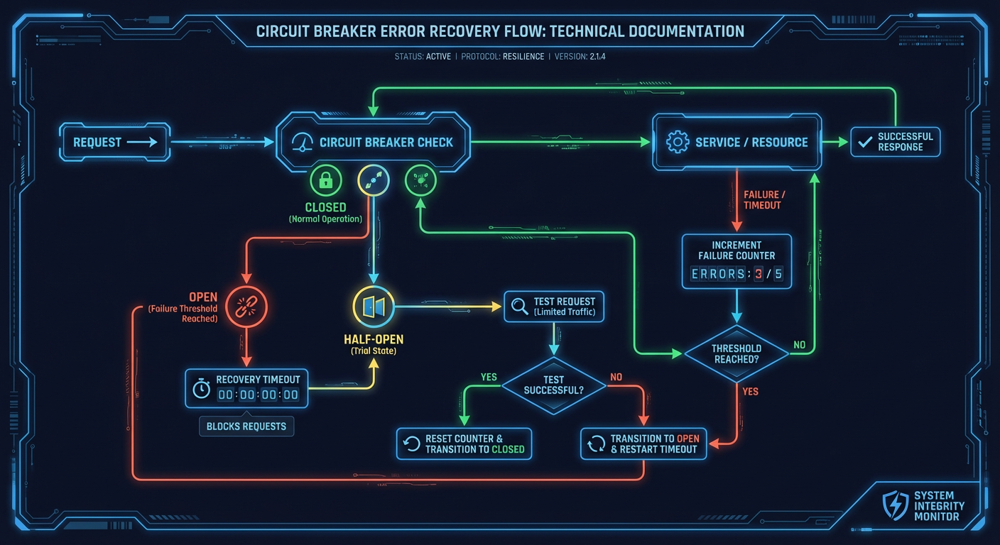
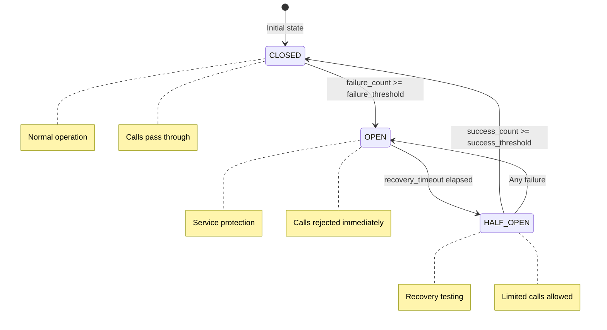
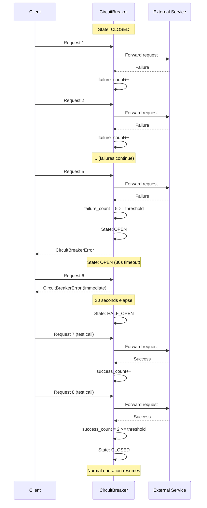
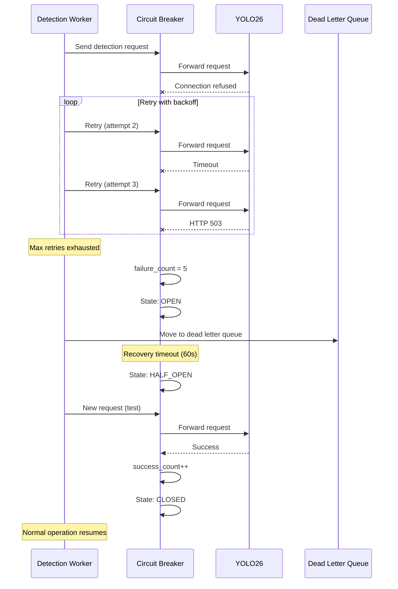

# Error Recovery Flow

This document describes the error handling and recovery mechanisms used throughout the system, including circuit breakers, retry logic, and graceful degradation.


## Circuit Breaker Pattern

**Source:** `backend/services/circuit_breaker.py:1-42`

```python
# backend/services/circuit_breaker.py:1-42
"""Circuit breaker pattern implementation for external service protection.

This module provides a circuit breaker implementation that protects external services
from cascading failures. When a service experiences repeated failures, the circuit
breaker "opens" to prevent further calls, allowing the service time to recover.

States:
    - CLOSED: Normal operation, calls pass through
    - OPEN: Circuit tripped, calls are rejected immediately
    - HALF_OPEN: Recovery testing, limited calls allowed to test service health

Features:
    - Configurable failure thresholds and recovery timeouts
    - Half-open state for gradual recovery testing
    - Excluded exceptions that don't count as failures
    - Thread-safe async implementation
    - Registry for managing multiple circuit breakers
    - Prometheus metrics integration for monitoring
"""
```

## Circuit Breaker State Machine





## CircuitState Enum

**Source:** `backend/services/circuit_breaker.py:118-124`

```python
# backend/services/circuit_breaker.py:118-124
class CircuitState(StrEnum):
    """Circuit breaker states."""

    CLOSED = auto()
    OPEN = auto()
    HALF_OPEN = auto()
```

## CircuitBreakerConfig

**Source:** `backend/services/circuit_breaker.py:126-142`

```python
# backend/services/circuit_breaker.py:126-142
@dataclass(slots=True)
class CircuitBreakerConfig:
    """Configuration for circuit breaker behavior.

    Attributes:
        failure_threshold: Number of failures before opening circuit
        recovery_timeout: Seconds to wait before transitioning to half-open
        half_open_max_calls: Maximum calls allowed in half-open state
        success_threshold: Successes needed in half-open to close circuit
        excluded_exceptions: Exception types that don't count as failures
    """

    failure_threshold: int = 5
    recovery_timeout: float = 30.0
    half_open_max_calls: int = 3
    success_threshold: int = 2
    excluded_exceptions: tuple[type[Exception], ...] = ()
```

## Service Circuit Breaker Configurations

**Source:** `backend/main.py:248-297`

### AI Services (Aggressive)

```python
# backend/main.py:265-270
ai_service_config = CircuitBreakerConfig(
    failure_threshold=5,        # Opens after 5 consecutive failures
    recovery_timeout=30.0,      # Wait 30s before recovery attempt
    half_open_max_calls=3,      # Allow 3 test calls in half-open
    success_threshold=2,        # 2 successes close the circuit
)
```

### Infrastructure Services (Tolerant)

```python
# backend/main.py:273-278
infrastructure_config = CircuitBreakerConfig(
    failure_threshold=10,       # More tolerant - 10 failures
    recovery_timeout=60.0,      # Longer recovery - 60s
    half_open_max_calls=5,      # More test calls
    success_threshold=3,        # More successes needed
)
```

### Service-Specific Configurations

| Service    | Failure Threshold | Recovery Timeout | Source                |
| ---------- | ----------------- | ---------------- | --------------------- |
| YOLO26  | 5                 | 30s              | AI config             |
| Nemotron   | 5                 | 30s              | AI config             |
| PostgreSQL | 10                | 60s              | Infrastructure config |
| Redis      | 10                | 60s              | Infrastructure config |

## Circuit Breaker Sequence Diagram



## YOLO26 Circuit Breaker

**Source:** `backend/services/detector_client.py:295-309`

```python
# backend/services/detector_client.py:295-309
self._circuit_breaker = CircuitBreaker(
    name="yolo26",
    config=CircuitBreakerConfig(
        failure_threshold=5,        # Opens after 5 consecutive failures
        recovery_timeout=60.0,      # Waits 60 seconds before attempting recovery
        half_open_max_calls=3,      # Allow 3 test calls in half-open
        success_threshold=2,        # 2 successes close the circuit
        excluded_exceptions=(ValueError,),  # HTTP 4xx errors don't trip circuit
    ),
)
```

## Retry Logic

### Exponential Backoff with Jitter

**Source:** `backend/services/event_broadcaster.py:145-244`

```python
# backend/services/event_broadcaster.py:204-209
# Calculate exponential backoff with jitter
delay = min(base_delay * (2**attempt), max_delay)
jitter = delay * random.uniform(0.1, 0.3)  # 10-30% jitter
total_delay = delay + jitter
```

### Retry Timing

| Attempt | Base Delay | With Jitter | Cumulative |
| ------- | ---------- | ----------- | ---------- |
| 1       | 0s         | 0s          | 0s         |
| 2       | 2s         | 2.2-2.6s    | ~2.4s      |
| 3       | 4s         | 4.4-5.2s    | ~7.2s      |
| 4       | 8s         | 8.8-10.4s   | ~16.8s     |
| Max     | 30s        | 33-39s      | Capped     |

### Detector Client Retry

**Source:** `backend/services/detector_client.py:31-34`

```python
# backend/services/detector_client.py:31-34
# Retry Logic (NEM-1343):
#     - Configurable max retries via DETECTOR_MAX_RETRIES setting (default: 3)
#     - Exponential backoff: 2^attempt seconds between retries (capped at 30s)
#     - Only retries transient failures (connection, timeout, HTTP 5xx)
```

### Nemotron Analyzer Retry

**Source:** `backend/services/nemotron_analyzer.py:24-27`

```python
# backend/services/nemotron_analyzer.py:24-27
# Retry Logic (NEM-1343):
#     - Configurable max retries via NEMOTRON_MAX_RETRIES setting (default: 3)
#     - Exponential backoff: 2^attempt seconds between retries (capped at 30s)
#     - Only retries transient failures (connection, timeout, HTTP 5xx)
```

## Broadcast Retry

**Source:** `backend/services/event_broadcaster.py:145-182`

```python
# backend/services/event_broadcaster.py:145-182
async def broadcast_with_retry[T](
    broadcast_func: Callable[[], Awaitable[T]],
    message_type: str,
    *,
    max_retries: int = DEFAULT_MAX_RETRIES,    # 3
    base_delay: float = DEFAULT_BASE_DELAY,     # 1.0s
    max_delay: float = DEFAULT_MAX_DELAY,       # 30.0s
    metrics: BroadcastRetryMetrics | None = None,
) -> T:
    """Execute a broadcast function with retry logic and exponential backoff.

    This function wraps any broadcast operation with retry logic that:
    - Uses exponential backoff (1s, 2s, 4s, etc.) with jitter
    - Logs each retry attempt with context
    - Records metrics for monitoring
    - Raises the final exception if all retries are exhausted
    """
```

## Error Recovery Matrix

### Detection Pipeline Errors

| Error              | Location       | Handling       | Recovery        |
| ------------------ | -------------- | -------------- | --------------- |
| Image truncated    | FileWatcher    | Skip file      | Camera retries  |
| Connection refused | DetectorClient | Retry 3x       | Circuit breaker |
| Timeout            | DetectorClient | Retry 3x       | Circuit breaker |
| HTTP 5xx           | DetectorClient | Retry 3x       | Circuit breaker |
| HTTP 4xx           | DetectorClient | No retry       | Log and skip    |
| Circuit open       | DetectorClient | Immediate fail | Wait recovery   |

### Analysis Pipeline Errors

| Error            | Location         | Handling | Recovery           |
| ---------------- | ---------------- | -------- | ------------------ |
| Batch not found  | NemotronAnalyzer | Skip     | Data inconsistency |
| LLM timeout      | NemotronAnalyzer | Retry 3x | Backoff            |
| Parse error      | NemotronAnalyzer | No retry | Log and skip       |
| Validation error | NemotronAnalyzer | No retry | Log and skip       |

### Enrichment Pipeline Errors

| Error               | Location           | Handling      | Recovery              |
| ------------------- | ------------------ | ------------- | --------------------- |
| Service unavailable | EnrichmentPipeline | Skip model    | Continue with partial |
| Timeout             | EnrichmentPipeline | Skip model    | Continue with partial |
| All models fail     | EnrichmentPipeline | Return FAILED | LLM analyzes without  |

### Broadcast Errors

| Error             | Location         | Handling       | Recovery           |
| ----------------- | ---------------- | -------------- | ------------------ |
| Redis unavailable | EventBroadcaster | Retry 3x       | Degrade gracefully |
| WebSocket closed  | EventBroadcaster | Buffer message | Client reconnects  |
| All retries fail  | EventBroadcaster | Log error      | Message lost       |

## WebSocket Circuit Breaker

**Source:** `backend/services/event_broadcaster.py:388-396`

```python
# backend/services/event_broadcaster.py:388-396
# Circuit breaker for WebSocket connection resilience
self._circuit_breaker = WebSocketCircuitBreaker(
    failure_threshold=self.MAX_RECOVERY_ATTEMPTS,  # 5
    recovery_timeout=30.0,
    half_open_max_calls=1,
    success_threshold=1,
    name="event_broadcaster",
)
```

## Recovery Sequence Diagram



## Prometheus Metrics

**Source:** `backend/services/circuit_breaker.py:64-97`

```python
# backend/services/circuit_breaker.py:64-97
# Legacy metrics
CIRCUIT_BREAKER_STATE = Gauge(
    "circuit_breaker_state",
    "Current state of the circuit breaker (0=closed, 1=open, 2=half_open)",
    labelnames=["service"],
)

CIRCUIT_BREAKER_FAILURES_TOTAL = Counter(
    "circuit_breaker_failures_total",
    "Total number of failures recorded by the circuit breaker",
    labelnames=["service"],
)

CIRCUIT_BREAKER_STATE_CHANGES_TOTAL = Counter(
    "circuit_breaker_state_changes_total",
    "Total number of state transitions",
    labelnames=["service", "from_state", "to_state"],
)

# HSI-prefixed metrics (Grafana dashboard)
HSI_CIRCUIT_BREAKER_STATE = Gauge(
    "hsi_circuit_breaker_state",
    "Current state of the circuit breaker (0=closed, 1=open, 2=half_open)",
    labelnames=["service"],
)

HSI_CIRCUIT_BREAKER_TRIPS_TOTAL = Counter(
    "hsi_circuit_breaker_trips_total",
    "Total number of times the circuit breaker has tripped",
    labelnames=["service"],
)
```

## CircuitBreakerMetrics

**Source:** `backend/services/circuit_breaker.py:145-184`

```python
# backend/services/circuit_breaker.py:145-184
@dataclass(slots=True)
class CircuitBreakerMetrics:
    """Metrics for circuit breaker monitoring.

    Attributes:
        name: Circuit breaker name
        state: Current state
        failure_count: Consecutive failures
        success_count: Consecutive successes in half-open
        total_calls: Total calls attempted
        rejected_calls: Calls rejected due to open circuit
        last_failure_time: Timestamp of last failure
        last_state_change: Timestamp of last state transition
    """

    name: str
    state: CircuitState
    failure_count: int = 0
    success_count: int = 0
    total_calls: int = 0
    rejected_calls: int = 0
    last_failure_time: datetime | None = None
    last_state_change: datetime | None = None
```

## Graceful Degradation Strategies

### Detection Service Down

```
Normal Flow:
  Image -> YOLO26 -> Detection -> Batch -> LLM

Degraded Flow (YOLO26 down):
  Image -> Queue (waiting) -> DLQ after max retries

Recovery:
  Circuit closes -> Process DLQ -> Resume normal flow
```

### LLM Service Down

```
Normal Flow:
  Batch -> Nemotron LLM -> Event -> Broadcast

Degraded Flow (Nemotron down):
  Batch -> Queue (waiting) -> DLQ after max retries

Recovery:
  Circuit closes -> Process DLQ -> Resume normal flow
```

### Enrichment Service Down

```
Normal Flow:
  Detection -> Enrichment -> LLM (enriched prompt)

Degraded Flow (Enrichment down):
  Detection -> LLM (basic prompt, no enrichment)

Recovery:
  Service available -> Full enrichment resumes
```

### Redis Down

```
Normal Flow:
  Event -> Redis Pub/Sub -> WebSocket Clients

Degraded Flow (Redis down):
  Event -> DB (events still stored)
  WebSocket: No real-time updates

Recovery:
  Redis available -> Pub/Sub resumes
  Clients reconnect -> Get latest state via API
```

## Dead Letter Queue

When all retries are exhausted, messages go to the Dead Letter Queue:

```python
# DLQ structure
DLQ:detection_queue -> [failed detection jobs]
DLQ:analysis_queue -> [failed analysis batches]
```

### DLQ Processing

1. Manual inspection via `/api/dlq` endpoint
2. Automatic retry after recovery
3. Manual requeue via admin API

## Related Documents

- [circuit-breaker.md](../resilience-patterns/circuit-breaker.md) - Detailed circuit breaker docs
- [startup-shutdown-flow.md](startup-shutdown-flow.md) - Initialization of breakers
- [image-to-event.md](image-to-event.md) - Where errors can occur
