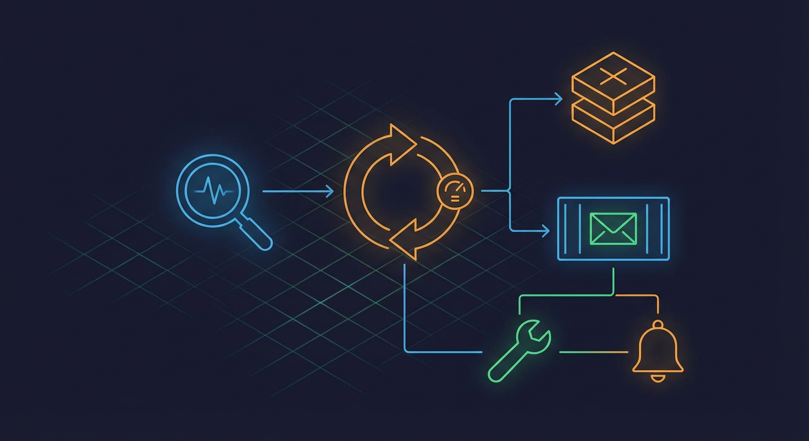
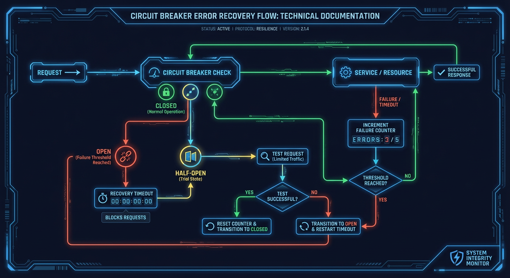
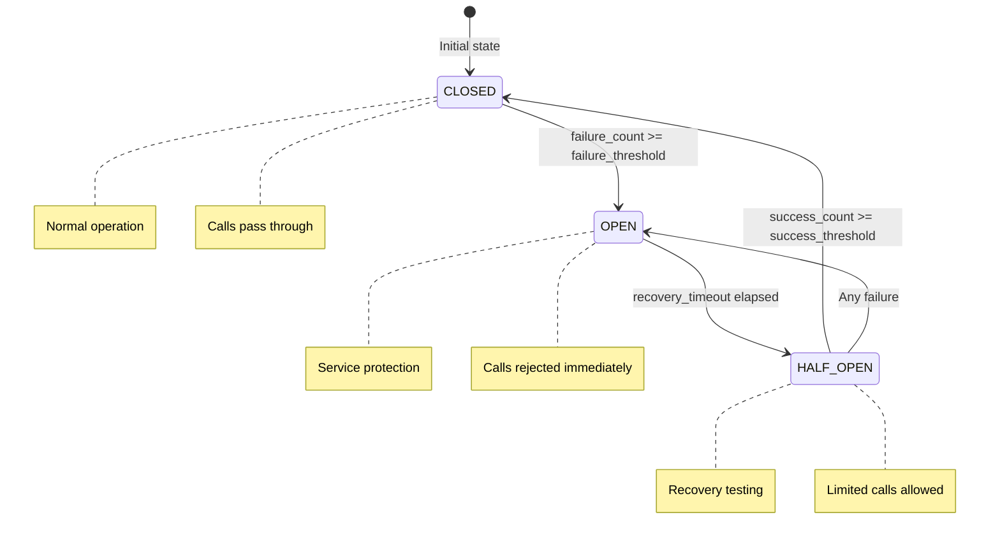
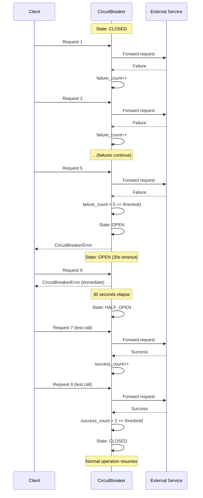
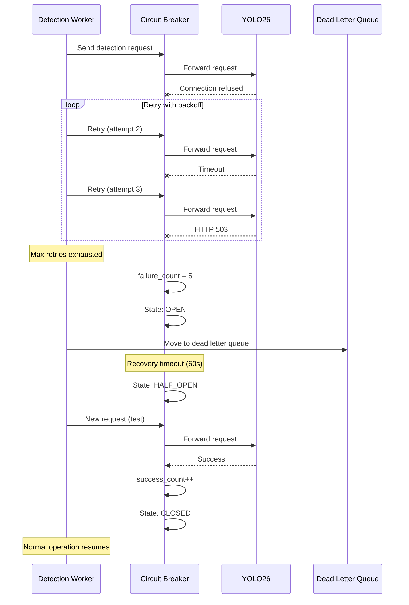

# Error Recovery Flow

This document describes the error handling and recovery mechanisms used throughout the system, including circuit breakers, retry logic, and graceful degradation.



## Circuit Breaker Pattern

**Source:** `backend/services/circuit_breaker.py:1-42`

```python
# backend/services/circuit_breaker.py:1-42
"""Circuit breaker pattern implementation for external service protection.

This module provides a circuit breaker implementation that protects external services
from cascading failures. When a service experiences repeated failures, the circuit
breaker "opens" to prevent further calls, allowing the service time to recover.

States:
    - CLOSED: Normal operation, calls pass through
    - OPEN: Circuit tripped, calls are rejected immediately
    - HALF_OPEN: Recovery testing, limited calls allowed to test service health

Features:
    - Configurable failure thresholds and recovery timeouts
    - Half-open state for gradual recovery testing
    - Excluded exceptions that don't count as failures
    - Thread-safe async implementation
    - Registry for managing multiple circuit breakers
    - Prometheus metrics integration for monitoring
"""
```

## Circuit Breaker State Machine




```mermaid
stateDiagram-v2
    [*] --> CLOSED: Initial state

    CLOSED --> OPEN: failure_count >= failure_threshold
    Note right of CLOSED: Normal operation
    Note right of CLOSED: Calls pass through

    OPEN --> HALF_OPEN: recovery_timeout elapsed
    Note right of OPEN: Service protection
    Note right of OPEN: Calls rejected immediately

    HALF_OPEN --> CLOSED: success_count >= success_threshold
    HALF_OPEN --> OPEN: Any failure
    Note right of HALF_OPEN: Recovery testing
    Note right of HALF_OPEN: Limited calls allowed
```

## CircuitState Enum

**Source:** `backend/services/circuit_breaker.py:130-136`

```python
# backend/services/circuit_breaker.py:130-136
class CircuitState(StrEnum):
    """Circuit breaker states."""

    CLOSED = auto()
    OPEN = auto()
    HALF_OPEN = auto()
```

## CircuitBreakerConfig

**Source:** `backend/services/circuit_breaker.py:138-154`

```python
# backend/services/circuit_breaker.py:138-154
@dataclass(slots=True)
class CircuitBreakerConfig:
    """Configuration for circuit breaker behavior.

    Attributes:
        failure_threshold: Number of failures before opening circuit
        recovery_timeout: Seconds to wait before transitioning to half-open
        half_open_max_calls: Maximum calls allowed in half-open state
        success_threshold: Successes needed in half-open to close circuit
        excluded_exceptions: Exception types that don't count as failures
    """

    failure_threshold: int = 5
    recovery_timeout: float = 30.0
    half_open_max_calls: int = 3
    success_threshold: int = 2
    excluded_exceptions: tuple[type[Exception], ...] = ()
```

## Service Circuit Breaker Configurations

**Source:** `backend/main.py:286-331`

### AI Services (Aggressive)

```python
# backend/main.py:302-307
ai_service_config = CircuitBreakerConfig(
    failure_threshold=5,
    recovery_timeout=30.0,
    half_open_max_calls=3,
    success_threshold=2,
)
```

### Infrastructure Services (Tolerant)

```python
# backend/main.py:310-315
infrastructure_config = CircuitBreakerConfig(
    failure_threshold=10,
    recovery_timeout=60.0,
    half_open_max_calls=5,
    success_threshold=3,
)
```

### Service-Specific Configurations

`init_circuit_breakers()` pre-registers `yolo26`, `postgresql`, and `redis` at
startup so they appear in monitoring before first use
(`backend/main.py:321-329`). `get_circuit_breaker()` is get-or-create
(`backend/services/circuit_breaker.py:1104-1117`), so a service can also
register its own breaker on first use — `ai-vlm` does exactly that, with
`failure_threshold=5` and `recovery_timeout=60.0`
(`backend/services/vlm_client.py:319-322`).

| Service         | Failure Threshold | Recovery Timeout | Source                                                           |
| --------------- | ----------------- | ---------------- | ---------------------------------------------------------------- |
| yolo26          | 5                 | 30s              | AI config (`backend/main.py:321`)                                |
| detector_yolo26 | 5                 | 60s              | `DetectorClient` (`backend/services/detector_client.py:336-345`) |
| ai-vlm          | 5                 | 60s              | `VlmClient` (`backend/services/vlm_client.py:319-322`)           |
| postgresql      | 10                | 60s              | Infrastructure config (`backend/main.py:325`)                    |
| redis           | 10                | 60s              | Infrastructure config (`backend/main.py:328`)                    |

The detector's own client-side breaker is `detector_yolo26` — the name is
built from the detector type (`backend/services/detector_client.py:280`), so
the guard on live detection traffic is the 5/60s breaker, while the
`yolo26`-named one is the startup pre-registration.

When the `ai-vlm` breaker opens, the client pushes the service UNHEALTHY to
`DegradationManager` on the way out and clears the flag on the next success
(`backend/services/vlm_client.py:1118-1139`).

## Circuit Breaker Sequence Diagram


```mermaid
sequenceDiagram
    participant Client
    participant CB as CircuitBreaker
    participant Service as External Service

    Note over CB: State: CLOSED

    Client->>CB: Request 1
    CB->>Service: Forward request
    Service--xCB: Failure
    CB->>CB: failure_count++

    Client->>CB: Request 2
    CB->>Service: Forward request
    Service--xCB: Failure
    CB->>CB: failure_count++

    Note over CB: ... (failures continue)

    Client->>CB: Request 5
    CB->>Service: Forward request
    Service--xCB: Failure
    CB->>CB: failure_count = 5 >= threshold
    CB->>CB: State: OPEN
    CB-->>Client: CircuitBreakerError

    Note over CB: State: OPEN (30s timeout)

    Client->>CB: Request 6
    CB-->>Client: CircuitBreakerError (immediate)

    Note over CB: 30 seconds elapse

    CB->>CB: State: HALF_OPEN

    Client->>CB: Request 7 (test call)
    CB->>Service: Forward request
    Service-->>CB: Success
    CB->>CB: success_count++

    Client->>CB: Request 8 (test call)
    CB->>Service: Forward request
    Service-->>CB: Success
    CB->>CB: success_count = 2 >= threshold
    CB->>CB: State: CLOSED

    Note over CB: Normal operation resumes
```

## YOLO26 Circuit Breaker

**Source:** `backend/services/detector_client.py:336-345`

```python
# backend/services/detector_client.py:336-345
self._circuit_breaker = CircuitBreaker(
    name=f"detector_{self._detector_type}",
    config=CircuitBreakerConfig(
        failure_threshold=5,
        recovery_timeout=60.0,
        half_open_max_calls=3,
        success_threshold=2,
        excluded_exceptions=(ValueError,),  # HTTP 4xx errors should not trip circuit
    ),
)
```

## Retry Logic

### Exponential Backoff with Jitter

**Source:** `backend/services/event_broadcaster.py:215-219`

```python
# backend/services/event_broadcaster.py:215-219
                # Calculate exponential backoff with jitter
                # Using random.uniform for timing jitter - not cryptographic
                delay = min(base_delay * (2**attempt), max_delay)
                jitter = delay * random.uniform(0.1, 0.3)  # noqa: S311
                total_delay = delay + jitter
```

### Retry Timing

| Attempt | Base Delay | With Jitter | Cumulative |
| ------- | ---------- | ----------- | ---------- |
| 1       | 0s         | 0s          | 0s         |
| 2       | 2s         | 2.2-2.6s    | ~2.4s      |
| 3       | 4s         | 4.4-5.2s    | ~7.2s      |
| 4       | 8s         | 8.8-10.4s   | ~16.8s     |
| Max     | 30s        | 33-39s      | Capped     |

### Detector Client Retry

**Source:** `backend/services/detector_client.py:37-40`

```python
# backend/services/detector_client.py:37-40
# Retry Logic (NEM-1343):
#     - Configurable max retries via DETECTOR_MAX_RETRIES setting (default: 3)
#     - Exponential backoff: 2^attempt seconds between retries (capped at 30s)
#     - Only retries transient failures (connection, timeout, HTTP 5xx)
```

### VLM Client Retry

**Source:** `backend/services/vlm_client.py:965-972`

The analysis leg does not use the backoff ladder. `VlmClient.assess()` makes at
most two attempts and the retry is a plain re-send of the same body (the first
attempt is greedy too) — but the ladder has been re-cut (B1.1): an attempt that
outruns `settings.ai_vlm_read_timeout` (default 25 s) in either phase — waiting
for the reply, or waiting to finish sending the image-bearing body — raises on
the spot as a budget and is never retried:

```python
# backend/services/vlm_client.py:965-972
last_error: VlmClientError | None = None
for attempt, temperature in enumerate((None, 0.0)):
    if temperature is not None:
        # §6 step 1: retry at temp 0. The first attempt is greedy too
        # (_ASSESS_TEMPERATURE), so the retry is a plain re-send; it stays
        # explicit so changing the first-attempt temperature cannot
        # silently change the retry.
        body["temperature"] = temperature
```

Only failures where re-asking is not futile get that second attempt: the
request never completed its trip (connection refused, `ConnectTimeout`, HTTP
5xx) or a complete reply that violates the verdict schema — at temperature 0
the failure may not recur on a plain re-send. A stalled read, a stalled write,
a context-overflow refusal and a reply cut off at `max_tokens` all raise on the
spot: the bytes are unchanged, so re-asking at the same budget cannot change
any of them. Each counted failure feeds the `ai-vlm` breaker
(`backend/services/vlm_client.py:1080-1091`), while budget-exhaustion failures are
recorded WITHOUT feeding it — a reply truncated by a token count, or timed out by
a duration the backend chose, is not evidence that the service is down
(`backend/services/vlm_client.py:1096-1116`).

## Broadcast Retry

**Source:** `backend/services/event_broadcaster.py:155-192`

```python
# backend/services/event_broadcaster.py:155-192 (abridged)
async def broadcast_with_retry[T](
    broadcast_func: Callable[[], Awaitable[T]],
    message_type: str,
    *,
    max_retries: int = DEFAULT_MAX_RETRIES,    # 3
    base_delay: float = DEFAULT_BASE_DELAY,     # 1.0s
    max_delay: float = DEFAULT_MAX_DELAY,       # 30.0s
    metrics: BroadcastRetryMetrics | None = None,
) -> T:
    """Execute a broadcast function with retry logic and exponential backoff.

    This function wraps any broadcast operation with retry logic that:
    - Uses exponential backoff (1s, 2s, 4s, etc.) with jitter
    - Logs each retry attempt with context
    - Records metrics for monitoring
    - Raises the final exception if all retries are exhausted
    """
```

## Error Recovery Matrix

### Detection Pipeline Errors

| Error              | Location       | Handling       | Recovery        |
| ------------------ | -------------- | -------------- | --------------- |
| Image truncated    | FileWatcher    | Skip file      | Camera retries  |
| Connection refused | DetectorClient | Retry 3x       | Circuit breaker |
| Timeout            | DetectorClient | Retry 3x       | Circuit breaker |
| HTTP 5xx           | DetectorClient | Retry 3x       | Circuit breaker |
| HTTP 4xx           | DetectorClient | No retry       | Log and skip    |
| Circuit open       | DetectorClient | Immediate fail | Wait recovery   |

### Analysis Pipeline Errors

| Error                     | Location    | Handling                    | Recovery                                      |
| ------------------------- | ----------- | --------------------------- | --------------------------------------------- |
| No camera/detections      | VlmAnalyzer | Raise, skip the batch       | Payload bug — nothing to analyze              |
| Transport failure         | VlmClient   | Retry once at temperature 0 | `verification_failed`, NULL score, event kept |
| Schema violation          | VlmClient   | Retry once at temperature 0 | `verification_failed`, NULL score, event kept |
| Reply truncated by budget | VlmClient   | No retry                    | `verification_failed`; breaker untouched      |
| Context overflow          | VlmClient   | No retry                    | `verification_failed`; prompt fit is short    |
| Breaker open              | VlmClient   | Refuse without I/O          | Wait 60s recovery                             |

Every one of these lands as a written Event: `_DEGRADABLE_ERRORS` is caught in
`analyze_batch()` and mapped to `verification_failed`
(`backend/services/vlm_analyzer.py:556-560`), so a batch is never lost to an
engine failure (`backend/services/vlm_analyzer.py:654-657`).

### Specialist Lookup Errors

The three prompt lookups (`faces`, `person_reid`, `plates`) degrade rather than
fail:

| Error                   | Location        | Handling                             | Recovery              |
| ----------------------- | --------------- | ------------------------------------ | --------------------- |
| Weights absent          | vlm_specialists | Line reads "unavailable"             | Verdict proceeds      |
| Optional package absent | vlm_specialists | Line reads "unavailable"             | Verdict proceeds      |
| Database hiccup         | vlm_specialists | Line reads "unavailable"             | Verdict proceeds      |
| Vector space mismatch   | vlm_specialists | Line reads "unavailable (re-enroll)" | Re-enroll the gallery |

The stage has no path that raises into the analyzer, and the analyzer keeps a
belt catch so even a bug there yields three `unavailable` lines rather than a
lost event (`backend/services/vlm_analyzer.py:514-523`).

### Broadcast Errors

| Error             | Location         | Handling       | Recovery           |
| ----------------- | ---------------- | -------------- | ------------------ |
| Redis unavailable | EventBroadcaster | Retry 3x       | Degrade gracefully |
| WebSocket closed  | EventBroadcaster | Buffer message | Client reconnects  |
| All retries fail  | EventBroadcaster | Log error      | Message lost       |

## WebSocket Circuit Breaker

**Source:** `backend/services/event_broadcaster.py:403-410`

```python
# backend/services/event_broadcaster.py:403-410
# Circuit breaker for WebSocket connection resilience
self._circuit_breaker = WebSocketCircuitBreaker(
    failure_threshold=self.MAX_RECOVERY_ATTEMPTS,
    recovery_timeout=30.0,
    half_open_max_calls=1,
    success_threshold=1,
    name="event_broadcaster",
)
```

## Recovery Sequence Diagram


```mermaid
sequenceDiagram
    participant DW as Detection Worker
    participant CB as Circuit Breaker
    participant RT as YOLO26
    participant DLQ as Dead Letter Queue

    DW->>CB: Send detection request
    CB->>RT: Forward request
    RT--xCB: Connection refused

    loop Retry with backoff
        DW->>CB: Retry (attempt 2)
        CB->>RT: Forward request
        RT--xCB: Timeout

        DW->>CB: Retry (attempt 3)
        CB->>RT: Forward request
        RT--xCB: HTTP 503
    end

    Note over DW: Max retries exhausted

    CB->>CB: failure_count = 5
    CB->>CB: State: OPEN

    DW->>DLQ: Move to dead letter queue

    Note over CB: Recovery timeout (60s)

    CB->>CB: State: HALF_OPEN

    DW->>CB: New request (test)
    CB->>RT: Forward request
    RT-->>CB: Success

    CB->>CB: success_count++
    CB->>CB: State: CLOSED

    Note over DW: Normal operation resumes
```

## Prometheus Metrics

**Source:** `backend/services/circuit_breaker.py:80-127`

```python
# backend/services/circuit_breaker.py:80-127 (abridged)
# Legacy metrics (without hsi_ prefix) - maintained for backward compatibility
CIRCUIT_BREAKER_STATE = Gauge(
    "circuit_breaker_state",
    "Current state of the circuit breaker (0=closed, 1=open, 2=half_open)",
    labelnames=["service"],
)

CIRCUIT_BREAKER_FAILURES_TOTAL = Counter(
    "circuit_breaker_failures_total",
    "Total number of failures recorded by the circuit breaker",
    labelnames=["service"],
)

CIRCUIT_BREAKER_STATE_CHANGES_TOTAL = Counter(
    "circuit_breaker_state_changes_total",
    "Total number of state transitions",
    labelnames=["service", "from_state", "to_state"],
)

# HSI-prefixed metrics (Grafana dashboard)
HSI_CIRCUIT_BREAKER_STATE = Gauge(
    "hsi_circuit_breaker_state",
    "Current state of the circuit breaker (0=closed, 1=open, 2=half_open)",
    labelnames=["service"],
)

HSI_CIRCUIT_BREAKER_TRIPS_TOTAL = Counter(
    "hsi_circuit_breaker_trips_total",
    "Total number of times the circuit breaker has tripped (transitioned to open)",
    labelnames=["service"],
)
```

## CircuitBreakerMetrics

**Source:** `backend/services/circuit_breaker.py:157-179`

```python
# backend/services/circuit_breaker.py:157-179
@dataclass(slots=True)
class CircuitBreakerMetrics:
    """Metrics for circuit breaker monitoring.

    Attributes:
        name: Circuit breaker name
        state: Current state
        failure_count: Consecutive failures
        success_count: Consecutive successes in half-open
        total_calls: Total calls attempted
        rejected_calls: Calls rejected due to open circuit
        last_failure_time: Timestamp of last failure
        last_state_change: Timestamp of last state transition
    """

    name: str
    state: CircuitState
    failure_count: int = 0
    success_count: int = 0
    total_calls: int = 0
    rejected_calls: int = 0
    last_failure_time: datetime | None = None
    last_state_change: datetime | None = None
```

## Graceful Degradation Strategies

### Detection Service Down

```
Normal Flow:
  Image -> YOLO26 -> Detection -> Batch -> VLM

Degraded Flow (YOLO26 down):
  Image -> Queue (waiting) -> DLQ after max retries

Recovery:
  Circuit closes -> Process DLQ -> Resume normal flow
```

### VLM Service Down

```
Normal Flow:
  Batch -> ai-vlm verdict -> Event (+ EventVerification) -> Broadcast

Degraded Flow (ai-vlm down):
  Batch -> one retry at temperature 0 -> Event written anyway:
          verdict=verification_failed, risk_score=NULL
  5 consecutive failures OPEN the ai-vlm breaker -> later batches refuse
  without I/O and DegradationManager reports ai-vlm UNHEALTHY

Recovery:
  Breaker half-opens -> test calls succeed -> flag cleared -> verdicts resume
```

The event is the point: a batch is never parked or discarded waiting for the
engine, because the UI needs a row that reads "needs review"
(`backend/services/vlm_analyzer.py:654-657`). The wake ping
(`backend/services/vlm_client.py:1145-1177`) is the cold-start path — one
`max_tokens: 1` request that loads llama.cpp's weights, and a failed wake is
swallowed rather than retried.

### Specialist Lookups Unavailable

```
Normal Flow:
  Key frames -> faces / person re-ID / plates lookups -> three prompt lines

Degraded Flow (a lookup cannot answer):
  That line reads "unavailable" (or "unavailable (re-enroll)")
  The assess call proceeds with the remaining lines

Recovery:
  Weights present / gallery re-enrolled -> the line answers again
```

A degraded lookup changes what the model is told, never whether the event
exists (`backend/services/vlm_specialists.py:12-16`).

### Redis Down

```
Normal Flow:
  Event -> Redis Pub/Sub -> WebSocket Clients

Degraded Flow (Redis down):
  Event -> DB (events still stored)
  WebSocket: No real-time updates

Recovery:
  Redis available -> Pub/Sub resumes
  Clients reconnect -> Get latest state via API
```

## Dead Letter Queue

Detection jobs land in the dead-letter queue when retries are exhausted or the
delivery ceiling is reached (`backend/services/pipeline_workers.py:403-404`,
`backend/services/retry_handler.py`); queue overflow uses the same policy
(`backend/core/config.py:2246-2249`). The queues are the `dlq:`-prefixed names
built in `backend/core/constants.py:167-173`:

```python
# DLQ structure
dlq:detection_queue -> [failed detection jobs]
dlq:analysis_queue  -> [failed analysis batches]
```

Analysis differs: an engine failure does not park a batch in the DLQ, because
the analyzer converts it into a written `verification_failed` event. The
analysis DLQ holds batches rejected before analysis (invalid payloads, queue
overflow), not batches the VLM failed to score.

### DLQ Processing

1. Inspection via the `/api/dlq` endpoints (`backend/api/routes/dlq.py:38`)
2. Requeue a single job via `POST /api/dlq/requeue/{queue_name}`
   (`backend/api/routes/dlq.py:222`)
3. Bulk requeue via `POST /api/dlq/requeue-all/{queue_name}`, bounded by
   `settings.max_requeue_iterations` (`backend/api/routes/dlq.py:275`)

Requeue is an admin action behind API-key authentication
(`backend/api/routes/dlq.py:9`) — nothing re-drains the DLQ on a timer.

## Related Documents

- [circuit-breaker.md](../resilience-patterns/circuit-breaker.md) - Detailed circuit breaker docs
- [startup-shutdown-flow.md](startup-shutdown-flow.md) - Initialization of breakers
- [image-to-event.md](image-to-event.md) - Where errors can occur
