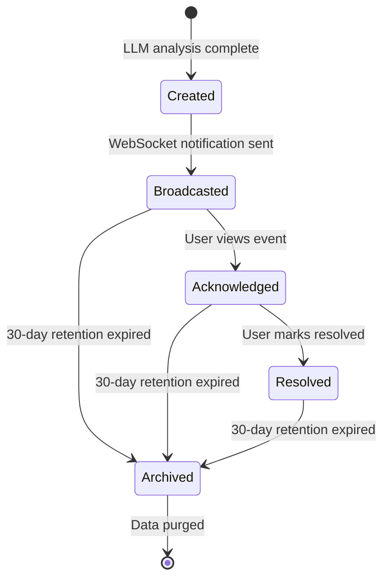
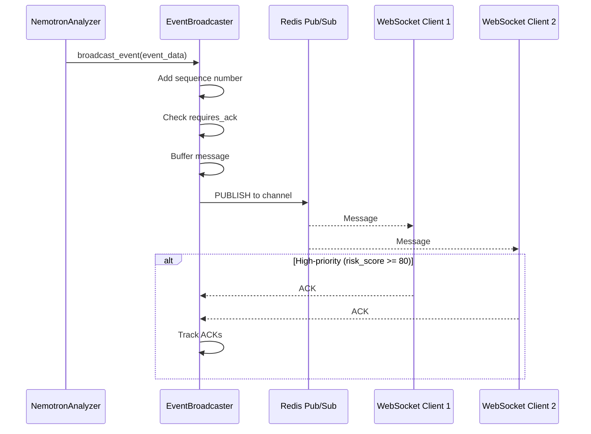
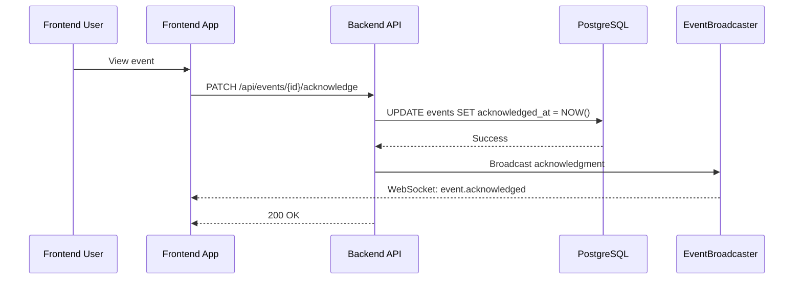
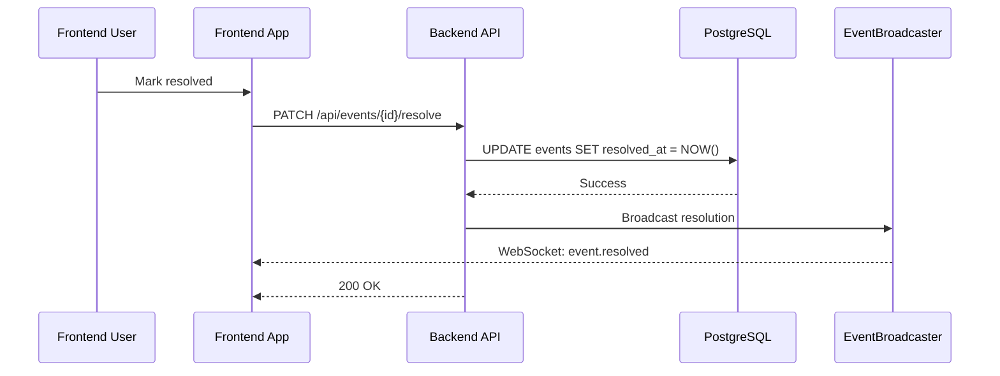
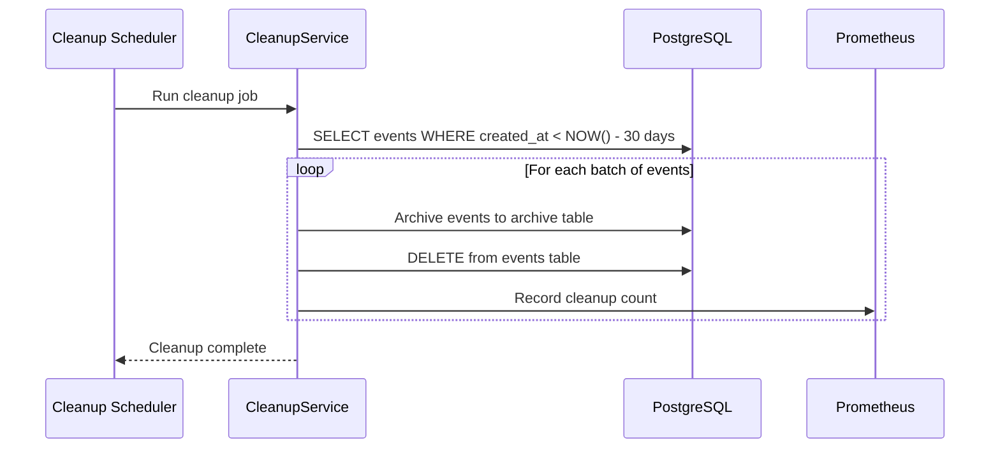

# Event Lifecycle

This document describes the complete lifecycle of a security event from creation through archival, including state transitions, data transformations, and retention policies.

## Event State Machine



## Event Creation

**Source:** `backend/services/nemotron_analyzer.py:6-17`

### Creation Trigger

Events are created after successful LLM analysis of a detection batch:

```python
# backend/services/nemotron_analyzer.py:6-17
# Analysis Flow:
#     1. Fetch batch detections from Redis/database
#     2. Enrich context with zones, baselines, and cross-camera activity
#     3. Run enrichment pipeline for license plates, faces, OCR (optional)
#     4. Format prompt with enriched detection details
#     5. Acquire shared AI inference semaphore (NEM-1463)
#     6. POST to llama.cpp completion endpoint (with retry on transient failures)
#     7. Release semaphore
#     8. Parse JSON response
#     9. Create Event with risk assessment    <-- Event Created
#     10. Store Event in database
#     11. Broadcast via WebSocket (if available)
```

### Event Data Model

```python
# Core event fields
Event:
    id: int                    # Primary key, auto-increment
    batch_id: str              # Links to detection batch (e.g., "batch-a1b2c3d4")
    camera_id: str             # Normalized camera ID (e.g., "front_door")
    risk_score: int            # 0-100, from LLM analysis
    risk_level: str            # Derived: "low", "medium", "high", "critical"
    summary: str               # Human-readable description
    reasoning: str             # LLM reasoning for assessment
    started_at: datetime       # First detection in batch
    ended_at: datetime | None  # Last detection in batch (optional)
    created_at: datetime       # Event creation timestamp
    acknowledged_at: datetime | None  # User acknowledgment timestamp
    resolved_at: datetime | None      # User resolution timestamp
```

### Risk Level Derivation

Risk level is derived from risk score:

| Score Range | Risk Level |
| ----------- | ---------- |
| 0-29        | low        |
| 30-59       | medium     |
| 60-79       | high       |
| 80-100      | critical   |

## Event Broadcasting

**Source:** `backend/services/event_broadcaster.py:335-400`

### Broadcast Sequence



### Message Format

```json
{
  "type": "event",
  "sequence": 42,
  "requires_ack": true,
  "data": {
    "id": 1,
    "event_id": 1,
    "batch_id": "batch_abc123",
    "camera_id": "front_door",
    "risk_score": 85,
    "risk_level": "critical",
    "summary": "Person detected at front door",
    "reasoning": "Unknown individual approaching entrance during nighttime hours",
    "started_at": "2025-12-23T12:00:00Z"
  }
}
```

### Acknowledgment Requirements

**Source:** `backend/services/event_broadcaster.py:296-323`

```python
# backend/services/event_broadcaster.py:296-323
def requires_ack(message: dict[str, Any]) -> bool:
    """Determine if a message requires client acknowledgment.

    High-priority messages that require acknowledgment:
    - Events with risk_score >= 80
    - Events with risk_level == 'critical'
    """
    if message.get("type") != "event":
        return False

    data = message.get("data")
    if not data:
        return False

    # Check risk_score >= 80
    risk_score = data.get("risk_score", 0)
    if risk_score >= 80:
        return True

    # Check risk_level == 'critical'
    risk_level = data.get("risk_level", "")
    return bool(risk_level == "critical")
```

### Message Sequencing and Buffering

**Source:** `backend/services/event_broadcaster.py:68-69, 398-401`

```python
# backend/services/event_broadcaster.py:68-69
# Buffer size for message replay on reconnection (NEM-1688)
MESSAGE_BUFFER_SIZE = 100

# backend/services/event_broadcaster.py:398-401
# Message sequencing and buffering (NEM-1688)
self._sequence_counter = 0
self._message_buffer: deque[dict[str, Any]] = deque(maxlen=self.MESSAGE_BUFFER_SIZE)
self._client_acks: dict[WebSocket, int] = {}
```

**Features:**

- Monotonically increasing sequence numbers
- Last 100 messages buffered for replay
- Per-client ACK tracking for delivery confirmation

## Event Acknowledgment

### User Acknowledgment Flow



### API Endpoint

```
PATCH /api/events/{event_id}/acknowledge

Response:
{
    "id": 1,
    "acknowledged_at": "2025-12-23T12:05:00Z",
    ...
}
```

## Event Resolution

### Resolution Flow



### Resolution Data

```python
# Resolution metadata
Event:
    resolved_at: datetime     # When user marked as resolved
    resolution_notes: str     # Optional notes from user
    resolved_by: str | None   # User who resolved (if auth enabled)
```

## Event Archival

### Retention Policy

**Default retention:** 30 days

Events older than the retention period are subject to archival and eventual purging.

### Archival Process



### Cleanup Service

The CleanupService handles data retention:

```python
# Retention periods
EVENT_RETENTION_DAYS = 30          # Keep events for 30 days
DETECTION_RETENTION_DAYS = 30     # Keep detections for 30 days
LOG_RETENTION_DAYS = 7            # Keep logs for 7 days
```

## Event Data Flow Summary

```
┌─────────────────────────────────────────────────────────────────────┐
│                         Event Lifecycle                              │
├─────────────────────────────────────────────────────────────────────┤
│                                                                      │
│  Detection Batch     LLM Analysis      Event Creation                │
│  ┌─────────────┐    ┌───────────┐    ┌──────────────┐               │
│  │ detections  │ -> │ Nemotron  │ -> │ PostgreSQL   │               │
│  │ (batch-id)  │    │ (risk)    │    │ INSERT       │               │
│  └─────────────┘    └───────────┘    └──────────────┘               │
│                                             │                        │
│                                             v                        │
│                                      ┌──────────────┐                │
│                                      │ EventBroad-  │                │
│                                      │ caster       │                │
│                                      └──────────────┘                │
│                                             │                        │
│         ┌───────────────────────────────────┼───────────────────┐   │
│         │                                   │                   │   │
│         v                                   v                   v   │
│  ┌──────────────┐                ┌──────────────┐      ┌───────────┐│
│  │ WebSocket    │                │ WebSocket    │      │ WebSocket ││
│  │ Client 1     │                │ Client 2     │      │ Client N  ││
│  └──────────────┘                └──────────────┘      └───────────┘│
│                                                                      │
│  User Interaction                                                    │
│  ┌──────────────┐    ┌──────────────┐    ┌──────────────┐           │
│  │ Acknowledge  │ -> │ Resolve      │ -> │ Archive      │           │
│  │ (view)       │    │ (mark done)  │    │ (30 days)    │           │
│  └──────────────┘    └──────────────┘    └──────────────┘           │
│                                                                      │
└─────────────────────────────────────────────────────────────────────┘
```

## Event Timestamps

| Timestamp         | Description              | Set When              |
| ----------------- | ------------------------ | --------------------- |
| `created_at`      | Event creation time      | LLM analysis complete |
| `started_at`      | First detection in batch | From batch metadata   |
| `ended_at`        | Last detection in batch  | From batch metadata   |
| `acknowledged_at` | User viewed event        | User clicks event     |
| `resolved_at`     | User marked resolved     | User resolves event   |

## Event Relationships

```
Event (1) ─────────┬───────── (*) Detection
                   │
                   └───────── (1) Camera
                   │
                   └───────── (1) Batch
                   │
                   └───────── (*) AlertRule (triggers)
```

## Error Handling

### Broadcast Failures

**Source:** `backend/services/event_broadcaster.py:145-244`

```python
# backend/services/event_broadcaster.py:145-182
async def broadcast_with_retry[T](
    broadcast_func: Callable[[], Awaitable[T]],
    message_type: str,
    *,
    max_retries: int = DEFAULT_MAX_RETRIES,  # 3
    base_delay: float = DEFAULT_BASE_DELAY,   # 1.0s
    max_delay: float = DEFAULT_MAX_DELAY,     # 30.0s
    metrics: BroadcastRetryMetrics | None = None,
) -> T:
    """Execute a broadcast function with retry logic and exponential backoff."""
```

### Retry Configuration

| Parameter             | Value | Source                                     |
| --------------------- | ----- | ------------------------------------------ |
| `DEFAULT_MAX_RETRIES` | 3     | `backend/services/event_broadcaster.py:72` |
| `DEFAULT_BASE_DELAY`  | 1.0s  | `backend/services/event_broadcaster.py:73` |
| `DEFAULT_MAX_DELAY`   | 30.0s | `backend/services/event_broadcaster.py:74` |

### Error Recovery

| Error             | Handling            | User Impact                               |
| ----------------- | ------------------- | ----------------------------------------- |
| WebSocket closed  | Buffer message      | Client reconnects, gets buffered messages |
| Redis unavailable | Retry with backoff  | Events still created, broadcast delayed   |
| Database error    | Fail event creation | Detection batch lost                      |

## Metrics and Observability

### Event Metrics

- `hsi_events_total` - Total events created
- `hsi_events_by_risk_level` - Events by risk level
- `hsi_events_by_camera` - Events by camera
- `hsi_event_broadcast_duration_seconds` - Broadcast latency

### Broadcast Metrics

```python
# backend/services/event_broadcaster.py:79-98
@dataclass
class BroadcastRetryMetrics:
    total_attempts: int = 0
    successful_broadcasts: int = 0
    failed_broadcasts: int = 0
    retries_exhausted: int = 0
    retry_counts: dict[int, int]  # Count by retry attempts needed
```

## Related Documents

- [image-to-event.md](image-to-event.md) - Event creation flow
- [websocket-message-flow.md](websocket-message-flow.md) - Broadcast details
- [api-request-flow.md](api-request-flow.md) - API interaction
