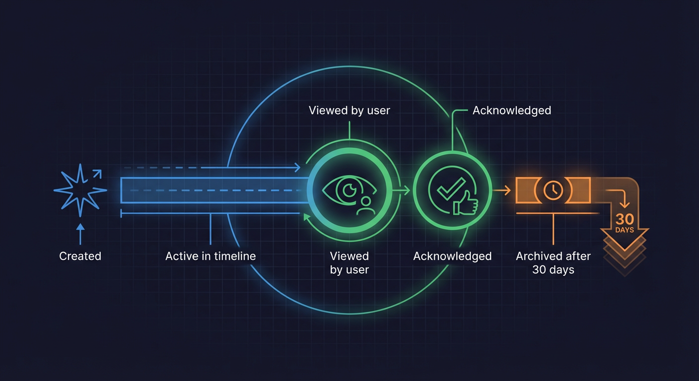
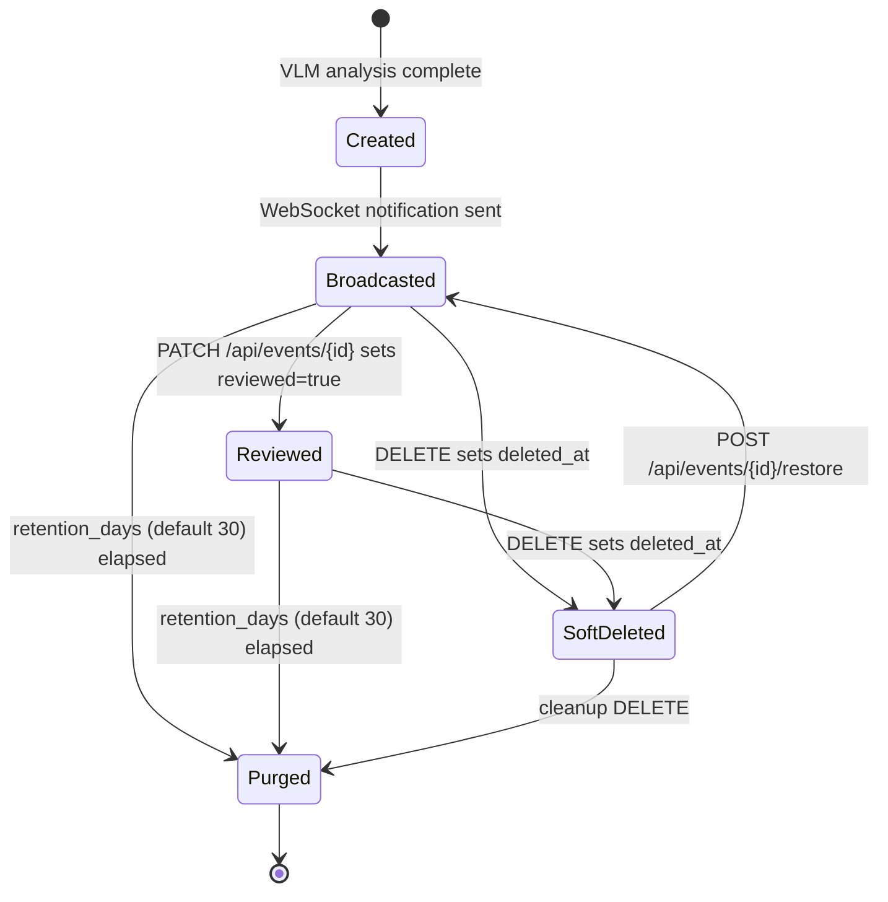
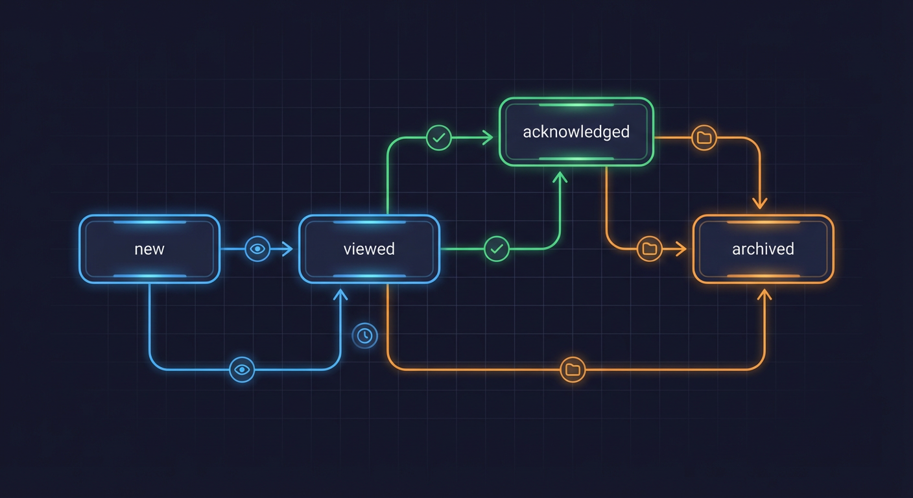
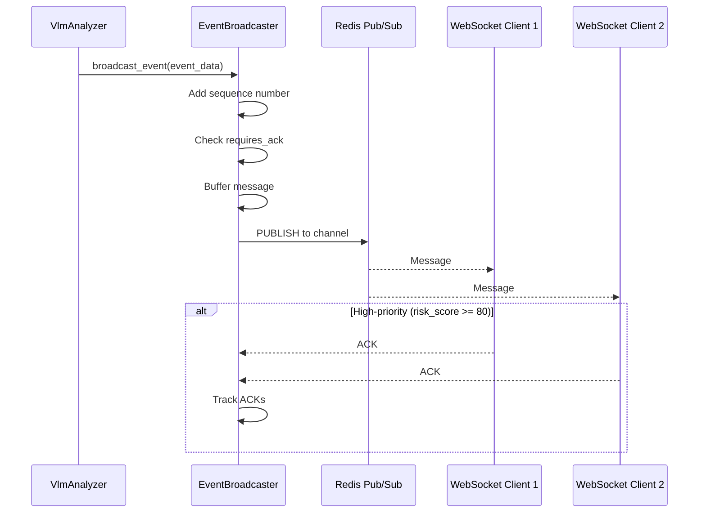
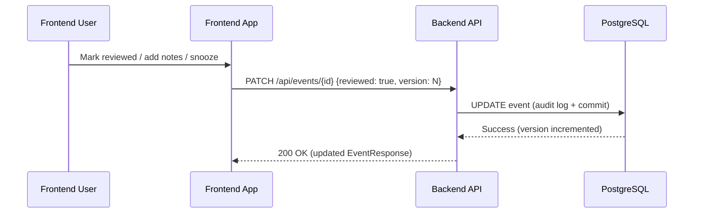
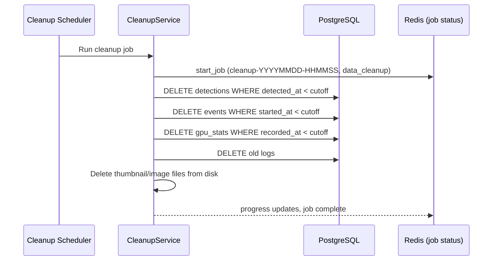

# Event Lifecycle

This document describes the complete lifecycle of a security event from creation through deletion, including state transitions, data transformations, and retention policies.



<!-- Image predates the soft-delete model: it shows "resolve" and "archive to table"
steps that do not exist in backend/api/routes/events.py or cleanup_service.py. -->

## Event State Machine

Events carry no status column. Their lifecycle is driven by boolean/timestamp fields on `backend/models/event.py` (`reviewed`, `flagged`, `snooze_until`, `deleted_at`) plus the retention cleanup job.


```mermaid
stateDiagram-v2
    [*] --> Created: VLM analysis complete
    Created --> Broadcasted: WebSocket notification sent
    Broadcasted --> Reviewed: PATCH /api/events/{id} sets reviewed=true
    Broadcasted --> SoftDeleted: DELETE sets deleted_at
    SoftDeleted --> Broadcasted: POST /api/events/{id}/restore
    Reviewed --> SoftDeleted: DELETE sets deleted_at
    Broadcasted --> Purged: retention_days (default 30) elapsed
    Reviewed --> Purged: retention_days (default 30) elapsed
    SoftDeleted --> Purged: cleanup DELETE
    Purged --> [*]
```

There is no resolve step: alert _instances_ are acknowledged or dismissed via `POST /api/alerts/{alert_id}/acknowledge` and `POST /api/alerts/{alert_id}/dismiss` (`backend/api/routes/alerts.py:566, 657`); events themselves are reviewed or snoozed.

## Event Creation



<!-- Image shows an acknowledge/resolve state machine; the Event model has no status
column — see the state diagram above for the field-driven lifecycle. -->

**Source:** `backend/services/vlm_analyzer.py:380-655`

### Creation Trigger

Events are created by `VlmAnalyzer.analyze_batch()`, which the Analysis Worker
calls once per closed batch (`backend/services/pipeline_workers.py:1052`):

```python
# backend/services/vlm_analyzer.py:380-655 (steps numbered from the body)
# Creation flow:
#     1. Idempotency key batch_event:<batch_id> — a repeat returns the
#        existing Event (:401)
#     2. Resolve camera/detection ids from the queue payload or the batch:
#        Redis keys; with neither, refuse loudly — the VLM never originates
#        an event (:417-431)
#     3. SESSION 1 (READ): detections, zones, household (:434)
#     4. Specialist lookups: faces, person re-ID, plates (:503-524)
#     5. One VLM assess outside any session (:551-568)
#     6. apply_verdict_invariants() -> the stored fields (:570)
#     7. SESSION 2 (WRITE): Event + EventVerification in ONE transaction (:573)
#     8. Broadcast LAST, best-effort (:643)                     <-- Event Created
```

The write is unconditional with respect to the engine: a VLM transport or schema
failure still writes the Event, with `verification_failed` and a NULL score
(`backend/services/vlm_analyzer.py:267-280`). No batch is ever dropped on the
floor, precisely so the UI can show it as needing review.

### Event Data Model

```python
# Core event fields (backend/models/event.py)
Event:
    id: int                    # Primary key, auto-increment
    batch_id: str              # Unique — links to the detection batch (e.g., "batch-a1b2c3d4")
    camera_id: str             # Normalized camera ID (e.g., "front_door")
    risk_score: int | None     # 0-100 from the VLM verdict; NULL when verification failed
    risk_level: str | None     # Derived from the score: "low", "medium", "high", "critical"
    summary: str               # Human-readable description
    reasoning: str             # Verdict reasoning (a §6 clamp stays visible here)
    llm_prompt: str            # The prompt actually sent, plus the key frames shown
    started_at: datetime       # First detection in batch
    ended_at: datetime | None  # Last detection in batch (optional)
    reviewed: bool             # Marked reviewed by a user (also drives hsi_events_reviewed_total)
    snooze_until: datetime     # NEM-2359 — suppress until this time
    deleted_at: datetime       # Soft delete (restorable until cleanup purges it)
    version: int               # Optimistic-locking counter (NEM-3625)
    # Event has no created_at column — started_at is the event's time reference.
```

The verification detail is a separate row, not a column: `EventVerification`
(`backend/models/event_verification.py`) carries the verdict
(`confirmed`/`rejected`/`uncertain`, or `verification_failed`), the scene
description, the criteria, the key-frame detection ids, and the engine/model the
server reported. It is written in the same transaction as the Event and travels
to the UI as the WS payload's `verification` key.

### Risk Level Derivation

The verdict supplies `risk_score` only — the model never emits a level. The
analyzer derives it through `SeverityService.risk_score_to_severity()`
(`backend/services/severity.py:137-163`) and `Event.computed_risk_level`
(`backend/models/event.py:379-411`) re-derives it from the same configurable
thresholds (`severity_low_max`/`severity_medium_max`/`severity_high_max`,
`backend/core/config.py:2423-2440`):

| Score Range | Risk Level |
| ----------- | ---------- |
| 0-29        | low        |
| 30-59       | medium     |
| 60-84       | high       |
| 85-100      | critical   |

Two rules shape the stored score. A `rejected` verdict is clamped to
`SeverityService.low_max` — the verdict gates alerts while the score still
ranks — and the clamp is appended to the stored reasoning so it stays visible
(`backend/services/vlm_analyzer.py:284-297`). A `verification_failed` outcome
keeps both fields NULL rather than substituting a low score.

Fire gets its urgency earlier, in the detector: a `fire` detection at
confidence >= 0.70 satisfies `should_bypass_batch()` and skips the 90-second
batch window entirely (`backend/services/batch_aggregator.py:1345-1349`, where
`FIRE_BYPASS_CONFIDENCE_THRESHOLD` is defined at
`backend/services/batch_aggregator.py:107`).

## Event Broadcasting

**Source:** `backend/services/event_broadcaster.py:335-400`

### Broadcast Sequence


```mermaid
sequenceDiagram
    participant VA as VlmAnalyzer
    participant EB as EventBroadcaster
    participant Redis as Redis Pub/Sub
    participant WS1 as WebSocket Client 1
    participant WS2 as WebSocket Client 2

    VA->>EB: broadcast_event(event_data)
    EB->>EB: Add sequence number
    EB->>EB: Check requires_ack
    EB->>EB: Buffer message
    EB->>Redis: PUBLISH to channel
    Redis-->>WS1: Message
    Redis-->>WS2: Message

    alt High-priority (risk_score >= 80)
        WS1-->>EB: ACK
        WS2-->>EB: ACK
        EB->>EB: Track ACKs
    end
```

### Message Format

```json
{
  "type": "event",
  "sequence": 42,
  "requires_ack": true,
  "data": {
    "id": 1,
    "event_id": 1,
    "batch_id": "batch_abc123",
    "camera_id": "front_door",
    "risk_score": 85,
    "risk_level": "critical",
    "summary": "Person detected at front door",
    "reasoning": "Unknown individual approaching entrance during nighttime hours",
    "started_at": "2025-12-23T12:00:00Z"
  }
}
```

### Acknowledgment Requirements

**Source:** `backend/services/event_broadcaster.py:306-337`

```python
# backend/services/event_broadcaster.py:306-337 (docstring abridged)
def requires_ack(message: dict[str, Any]) -> bool:
    """Determine if a message requires client acknowledgment.

    High-priority messages that require acknowledgment:
    - Events with risk_score >= 80
    - Events with risk_level == 'critical'
    """
    if message.get("type") != "event":
        return False

    data = message.get("data")
    if not data:
        return False

    # Check risk_score >= 80. P0.25 (spec §6 step 3): a verification_failed
    # event carries a PRESENT-None score - `.get(..., 0)`'s default only
    # applies to an absent key, so None reached `>= 80` as a TypeError that
    # would kill the subscriber loop. NULL never acks; the critical-level
    # arm below still can.
    risk_score = data.get("risk_score")
    if risk_score is not None and risk_score >= 80:
        return True

    # Check risk_level == 'critical'
    risk_level = data.get("risk_level", "")
    return bool(risk_level == "critical")
```

### Message Sequencing and Buffering

**Source:** `backend/services/event_broadcaster.py:78-79, 412-415`

```python
# backend/services/event_broadcaster.py:78-79
# Buffer size for message replay on reconnection (NEM-1688)
MESSAGE_BUFFER_SIZE = 100

# backend/services/event_broadcaster.py:412-415
# Message sequencing and buffering (NEM-1688)
self._sequence_counter = 0
self._message_buffer: deque[dict[str, Any]] = deque(maxlen=self.MESSAGE_BUFFER_SIZE)
self._client_acks: dict[WebSocket, int] = {}
```

**Features:**

- Monotonically increasing sequence numbers
- Last 100 messages buffered for replay
- Per-client ACK tracking for delivery confirmation

## Event Review / Acknowledgment

### Review Flow

"Viewing" an event has no backend effect; the dashboard marks events reviewed
by PATCHing the event itself (`backend/api/routes/events.py:1909-2110`):


```mermaid
sequenceDiagram
    participant User as Frontend User
    participant FE as Frontend App
    participant API as Backend API
    participant DB as PostgreSQL

    User->>FE: Mark reviewed / add notes / snooze
    FE->>API: PATCH /api/events/{id} {reviewed: true, version: N}
    API->>DB: UPDATE event (audit log + commit)
    DB-->>API: Success (version incremented)
    API-->>FE: 200 OK (updated EventResponse)
```

### API Endpoint

```
PATCH /api/events/{event_id}

Body (all optional): reviewed, notes, snooze_until, version
  - Include `version` for optimistic locking (NEM-3625): a stale version
    returns 409 with {"detail": {"current_version": N}}.

Response: the full updated Event (risk fields plus reviewed/notes/snooze_until).
Side effects: hsi_events_reviewed_total and hsi_events_acknowledged_total are
recorded when reviewed flips to true (NEM-770 / NEM-3288); cache is invalidated
(NEM-1938). No WebSocket broadcast is sent for the update.
```

## Event Deletion (Soft Delete)

Events are soft-deleted and restorable; there is no "resolved" state.

```
DELETE /api/events/{event_id}            → sets deleted_at
POST   /api/events/{event_id}/restore    → clears deleted_at (409 if not deleted)
GET    /api/events/deleted               → list soft-deleted events
DELETE /api/events/bulk                  → per-item results (207 Multi-Status)
```

Rows stay until the cleanup job hard-deletes them once `started_at` is older
than the retention cutoff. Alert-instance workflow (acknowledge/dismiss) is
separate: `backend/api/routes/alerts.py:566, 657`.

## Event Archival

### Retention Policy

**Default retention:** 30 days

There is no archive table: old rows are deleted outright by the cleanup service.

### Cleanup Process


```mermaid
sequenceDiagram
    participant Scheduler as Cleanup Scheduler
    participant CS as CleanupService
    participant DB as PostgreSQL
    participant RS as Redis (job status)

    Scheduler->>CS: Run cleanup job
    CS->>RS: start_job (cleanup-YYYYMMDD-HHMMSS, data_cleanup)
    CS->>DB: DELETE detections WHERE detected_at < cutoff
    CS->>DB: DELETE events WHERE started_at < cutoff
    CS->>DB: DELETE gpu_stats WHERE recorded_at < cutoff
    CS->>DB: DELETE old logs
    CS->>CS: Delete thumbnail/image files from disk
    CS-->>RS: progress updates, job complete
```

### Cleanup Service

Retention comes from settings, not constants
(`backend/services/cleanup_service.py:141, 487`):

```python
settings.retention_days        # default 30 — events, detections (config.py:918-922)
settings.log_retention_days    # default 7  — logs (config.py:2083-2085)
```

Cutoff is `now(UTC) - timedelta(days=retention_days)`; events are matched on
`started_at`, detections on `detected_at` (`backend/services/cleanup_service.py:266, 294`). A dry
run mode (`backend/services/cleanup_service.py:382`) reports what would be deleted without
deleting it.

## Event Data Flow Summary

```
┌─────────────────────────────────────────────────────────────────────┐
│                         Event Lifecycle                              │
├─────────────────────────────────────────────────────────────────────┤
│                                                                      │
│  Detection Batch    VLM Analysis       Event Creation                │
│  ┌─────────────┐    ┌───────────┐    ┌──────────────┐               │
│  │ detections  │ -> │ ai-vlm    │ -> │ PostgreSQL   │               │
│  │ (batch-id)  │    │ (verdict) │    │ INSERT       │               │
│  └─────────────┘    └───────────┘    └──────────────┘               │
│                                             │                        │
│                                             v                        │
│                                      ┌──────────────┐                │
│                                      │ EventBroad-  │                │
│                                      │ caster       │                │
│                                      └──────────────┘                │
│                                             │                        │
│         ┌───────────────────────────────────┼───────────────────┐   │
│         │                                   │                   │   │
│         v                                   v                   v   │
│  ┌──────────────┐                ┌──────────────┐      ┌───────────┐│
│  │ WebSocket    │                │ WebSocket    │      │ WebSocket ││
│  │ Client 1     │                │ Client 2     │      │ Client N  ││
│  └──────────────┘                └──────────────┘      └───────────┘│
│                                                                      │
│  User Interaction                                                    │
│  ┌──────────────┐    ┌──────────────┐    ┌──────────────┐           │
│  │ Review       │ -> │ SoftDelete   │ -> │ Purge        │           │
│  │ (reviewed=1) │    │ (deleted_at) │    │ (30 days)    │           │
│  └──────────────┘    └──────────────┘    └──────────────┘           │
│                                                                      │
└─────────────────────────────────────────────────────────────────────┘
```

## Event Timestamps

| Field          | Description              | Set When                                                     |
| -------------- | ------------------------ | ------------------------------------------------------------ |
| `started_at`   | First detection in batch | From batch metadata (no `created_at` column exists on Event) |
| `ended_at`     | Last detection in batch  | From batch metadata                                          |
| `snooze_until` | Suppressed until         | User snoozes the event (NEM-2359)                            |
| `deleted_at`   | Soft-deleted at          | `DELETE /api/events/{id}`                                    |
| `version`      | Optimistic-lock counter  | Increments on every update (NEM-3625)                        |

## Event Relationships

```
Event (1) ─────────┬───────── (*) Detection  (many-to-many via event_detections)
                   │
                   ├───────── (1) Camera           (events.camera_id FK)
                   │
                   ├───────── (1) EventAudit       (one quality audit per event)
                   │
                   ├───────── (1) EventFeedback    (one feedback row per event)
                   │
                   └───────── (*) Alert            (alerts triggered by AlertRules)
```

`batch_id` is a plain string column linking the event to its upstream detection
batch — there is no `batches` table or FK.

## Error Handling

### Broadcast Failures

**Source:** `backend/services/event_broadcaster.py:155-192`

```python
# backend/services/event_broadcaster.py:155-163 (abridged)
async def broadcast_with_retry[T](
    broadcast_func: Callable[[], Awaitable[T]],
    message_type: str,
    *,
    max_retries: int = DEFAULT_MAX_RETRIES,  # 3
    base_delay: float = DEFAULT_BASE_DELAY,   # 1.0s
    max_delay: float = DEFAULT_MAX_DELAY,     # 30.0s
    metrics: BroadcastRetryMetrics | None = None,
) -> T:
    """Execute a broadcast function with retry logic and exponential backoff."""
```

### Retry Configuration

| Parameter             | Value | Source                                     |
| --------------------- | ----- | ------------------------------------------ |
| `DEFAULT_MAX_RETRIES` | 3     | `backend/services/event_broadcaster.py:82` |
| `DEFAULT_BASE_DELAY`  | 1.0s  | `backend/services/event_broadcaster.py:83` |
| `DEFAULT_MAX_DELAY`   | 30.0s | `backend/services/event_broadcaster.py:84` |

### Error Recovery

| Error             | Handling            | User Impact                               |
| ----------------- | ------------------- | ----------------------------------------- |
| WebSocket closed  | Buffer message      | Client reconnects, gets buffered messages |
| Redis unavailable | Retry with backoff  | Events still created, broadcast delayed   |
| Database error    | Fail event creation | Detection batch lost                      |

## Metrics and Observability

### Event Metrics

- `hsi_events_created_total` - Total events created (`backend/core/metrics.py:294`)
- `hsi_events_by_risk_level_total` - Events by risk level (`backend/core/metrics.py:388`)
- `hsi_events_by_camera_total` - Events by camera (`backend/core/metrics.py:441`)
- `hsi_events_reviewed_total` / `hsi_events_acknowledged_total` - Review tracking
  (NEM-770 / NEM-3288, `backend/core/metrics.py:448, 456`)

### Broadcast Metrics

```python
# backend/services/event_broadcaster.py:89-108 (abridged)
@dataclass
class BroadcastRetryMetrics:
    total_attempts: int = 0
    successful_broadcasts: int = 0
    failed_broadcasts: int = 0
    retries_exhausted: int = 0
    retry_counts: dict[int, int] = field(default_factory=lambda: {0: 0, 1: 0, 2: 0, 3: 0})
```

## Related Documents

- [image-to-event.md](image-to-event.md) - Event creation flow
- [websocket-message-flow.md](websocket-message-flow.md) - Broadcast details
- [api-request-flow.md](api-request-flow.md) - API interaction
