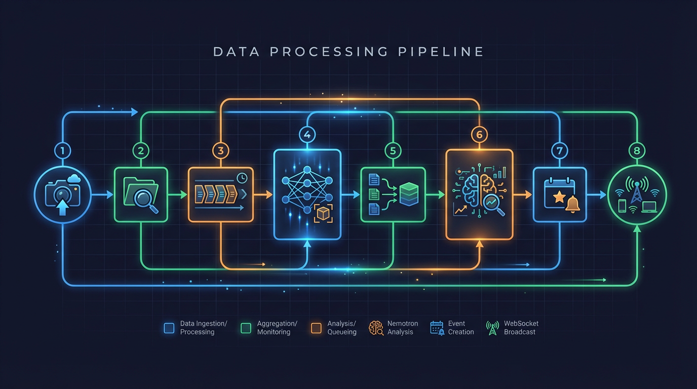
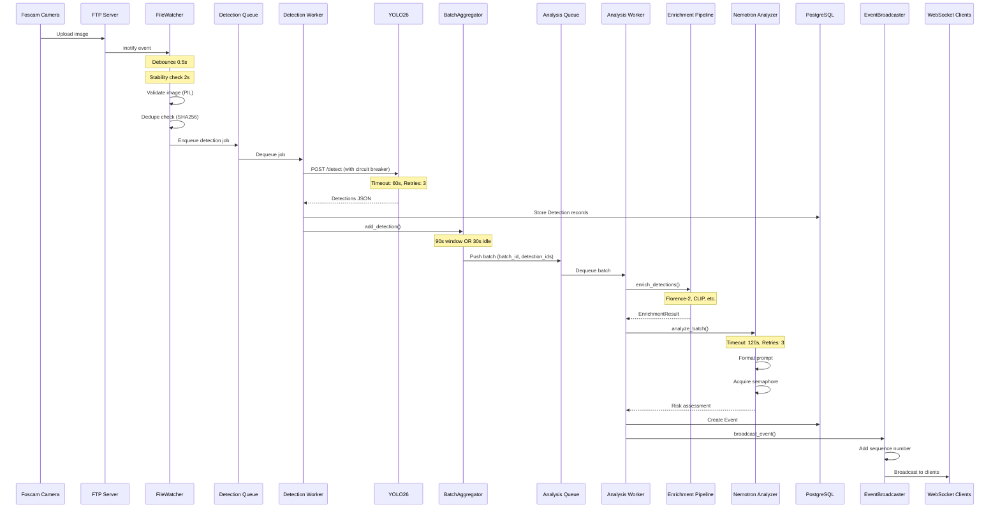
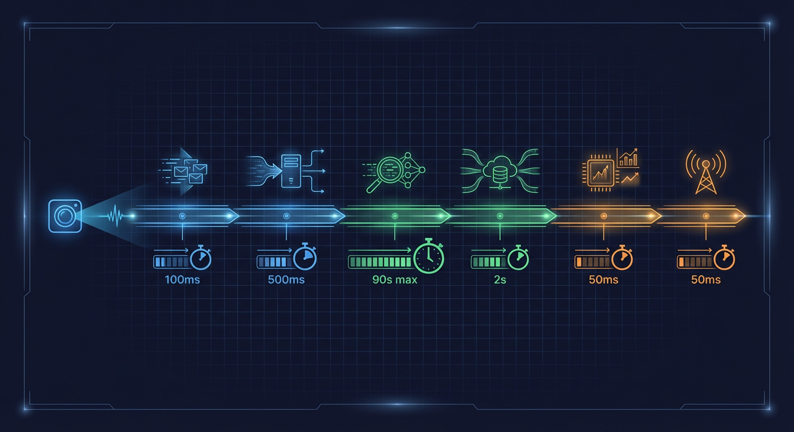

# Image to Event Flow

This document traces the complete journey of a camera image from upload to security event creation, including all processing stages, timing, and error handling.



## Flow Sequence Diagram



## Stage 1: File Detection

**Source:** `backend/services/file_watcher.py:330-400`

### 1.1 Filesystem Monitoring

The FileWatcher monitors camera directories using either inotify (Linux native) or polling mode (for Docker/NFS environments).

```python
# backend/services/file_watcher.py:351-384
def __init__(
    self,
    camera_root: str | None = None,
    redis_client: Any | None = None,
    debounce_delay: float = 0.5,          # Wait after last modification
    queue_name: str = DETECTION_QUEUE,
    ...
    stability_time: float = 2.0,          # File size stable for 2s
):
```

**Configuration:**
| Parameter | Value | Purpose |
|-----------|-------|---------|
| `debounce_delay` | 0.5s | Avoid processing during active writes |
| `stability_time` | 2.0s | Ensure FTP upload is complete |
| `use_polling` | False (default) | Use native inotify; set True for Docker |
| `polling_interval` | 1.0s | Polling frequency if enabled |

### 1.2 Image Validation

Before queuing, images are validated for integrity:

```python
# backend/services/file_watcher.py:131-156
def _validate_image_sync(file_path: str) -> bool:
    # Try to open and verify image header
    with Image.open(file_path) as img:
        img.verify()  # Check headers

    # Re-open and fully load to catch truncation
    with Image.open(file_path) as img:
        img.load()  # Forces full decompression

    return True
```

**Validation checks:**

1. File exists and is readable
2. File size >= 10KB (`MIN_IMAGE_FILE_SIZE`)
3. PIL can verify image header
4. PIL can fully load image data (catches truncated images)

### 1.3 Deduplication

Files are deduplicated using SHA256 content hashes stored in Redis:

```python
# backend/services/file_watcher.py:13-19
# Files are deduplicated using SHA256 content hashes stored in Redis with TTL.
# This prevents duplicate processing caused by:
# - Watchdog create/modify event bursts
# - Service restarts during file processing
# - FTP upload retries
```

**TTL:** 5 minutes (configurable)

### Error Paths (Stage 1)

| Error             | Handling                | Recovery                     |
| ----------------- | ----------------------- | ---------------------------- |
| Empty file        | Log warning, skip       | Wait for complete upload     |
| Truncated image   | Log warning, skip       | Camera retries upload        |
| Duplicate file    | Skip silently           | Dedupe prevents reprocessing |
| Redis unavailable | Continue without dedupe | May cause duplicates         |

## Stage 2: Object Detection

**Source:** `backend/services/detector_client.py:151-332`

### 2.1 Detection Queue Processing

The detection worker dequeues image paths and sends them to YOLO26:

```python
# backend/services/detector_client.py:1-35
# Detection Flow:
#     1. Read image file from filesystem
#     2. Validate image integrity (catch truncated/corrupt images)
#     3. Acquire shared AI inference semaphore (NEM-1463)
#     4. POST to detector server with image data (with retry on transient failures)
#     5. Release semaphore
#     6. Parse JSON response with detections
#     7. Filter by confidence threshold
#     8. Store detections in database
#     9. Return Detection model instances
```

### 2.2 YOLO26 HTTP Request

```python
# backend/services/detector_client.py:541-600
async def _send_detection_request(
    self,
    image_data: bytes,
    image_name: str,
    camera_id: str,
    image_path: str,
) -> dict[str, Any]:
    """Send detection request with retry logic and concurrency limiting."""
    ...
    # Use semaphore to limit concurrent GPU requests (NEM-1500)
    async with semaphore:
        async with asyncio.timeout(explicit_timeout):
            files = {"file": (image_name, image_data, "image/jpeg")}
```

**Timing:**
| Parameter | Value | Source |
|-----------|-------|--------|
| Connect timeout | 10s | `backend/services/detector_client.py:97` |
| Read timeout | 60s | `backend/services/detector_client.py:98` |
| Explicit timeout | 70s | `backend/services/detector_client.py:582-583` |

### 2.3 Circuit Breaker Protection

```python
# backend/services/detector_client.py:295-309
self._circuit_breaker = CircuitBreaker(
    name="yolo26",
    config=CircuitBreakerConfig(
        failure_threshold=5,        # Opens after 5 consecutive failures
        recovery_timeout=60.0,      # Wait 60s before attempting recovery
        half_open_max_calls=3,      # Allow 3 test calls in half-open
        success_threshold=2,        # 2 successes close the circuit
        excluded_exceptions=(ValueError,),  # HTTP 4xx don't trip circuit
    ),
)
```

### Error Paths (Stage 2)

| Error            | Handling                         | Recovery                  |
| ---------------- | -------------------------------- | ------------------------- |
| Connection error | Retry with exponential backoff   | Up to 3 retries           |
| Timeout          | Retry with exponential backoff   | Up to 3 retries           |
| HTTP 5xx         | Retry with exponential backoff   | Up to 3 retries           |
| HTTP 4xx         | Log and return empty list        | No retry (client error)   |
| Circuit open     | Raise `DetectorUnavailableError` | Wait for recovery timeout |

## Stage 3: Batch Aggregation

**Source:** `backend/services/batch_aggregator.py:122-160`

### 3.1 Batch Creation and Management

```python
# backend/services/batch_aggregator.py:1-40
# Batching Logic:
#     - Create new batch when first detection arrives for a camera
#     - Add subsequent detections within 90-second window
#     - Close batch if:
#         * 90 seconds elapsed from batch start (window timeout)
#         * 30 seconds with no new detections (idle timeout)
#     - On batch close: push to analysis_queue with batch_id, camera_id, detection_ids
```

### 3.2 Redis Keys Structure

```
batch:{camera_id}:current      - Current batch ID for camera
batch:{batch_id}:camera_id     - Camera ID for batch
batch:{batch_id}:detections    - LIST of detection IDs (RPUSH for atomic append)
batch:{batch_id}:started_at    - Batch start timestamp
batch:{batch_id}:last_activity - Last activity timestamp
```

**Key TTL:** 1 hour (`BATCH_KEY_TTL_SECONDS = 3600`)

### 3.3 Atomic Operations

```python
# backend/services/batch_aggregator.py:282-304
async def _atomic_list_append(self, key: str, value: int, ttl: int) -> int:
    """Atomically append a value to a Redis list and refresh TTL.

    Uses Redis RPUSH for atomic append, eliminating race conditions
    in distributed environments.
    """
    client = self._redis._client
    length: int = await client.rpush(key, str(value))
    await client.expire(key, ttl)
    return length
```

### Timing Diagram

```
Time 0s: First detection arrives
         -> Create batch-{uuid}
         -> batch:started_at = now

Time 0-90s: Additional detections
            -> RPUSH to batch:detections
            -> Update batch:last_activity

CLOSE CONDITION 1: Window timeout (90s elapsed)
Time 90s: -> Close batch, push to analysis queue

CLOSE CONDITION 2: Idle timeout (30s no activity)
Time 30s+: -> Close batch, push to analysis queue

CLOSE CONDITION 3: Max detections reached
Any time:  -> Close batch, push to analysis queue
```

## Stage 4: LLM Analysis

**Source:** `backend/services/nemotron_analyzer.py:135-237`

### 4.1 Analysis Flow

```python
# backend/services/nemotron_analyzer.py:6-17
# Analysis Flow:
#     1. Fetch batch detections from Redis/database
#     2. Enrich context with zones, baselines, and cross-camera activity
#     3. Run enrichment pipeline for license plates, faces, OCR (optional)
#     4. Format prompt with enriched detection details
#     5. Acquire shared AI inference semaphore (NEM-1463)
#     6. POST to llama.cpp completion endpoint (with retry on transient failures)
#     7. Release semaphore
#     8. Parse JSON response
#     9. Create Event with risk assessment
#     10. Store Event in database
#     11. Broadcast via WebSocket (if available)
```

### 4.2 Concurrency Control

```python
# backend/services/nemotron_analyzer.py:19-22
# Concurrency Control (NEM-1463):
#     Uses a shared asyncio.Semaphore to limit concurrent AI inference operations.
#     This prevents GPU/AI service overload under high traffic. The limit is
#     configurable via AI_MAX_CONCURRENT_INFERENCES setting (default: 4).
```

### 4.3 Retry Logic

```python
# backend/services/nemotron_analyzer.py:24-27
# Retry Logic (NEM-1343):
#     - Configurable max retries via NEMOTRON_MAX_RETRIES setting (default: 3)
#     - Exponential backoff: 2^attempt seconds between retries (capped at 30s)
#     - Only retries transient failures (connection, timeout, HTTP 5xx)
```

**Timing:**
| Parameter | Value | Source |
|-----------|-------|--------|
| Connect timeout | 10s | `backend/services/nemotron_analyzer.py:130` |
| Read timeout | 120s | `backend/services/nemotron_analyzer.py:131` |
| Health timeout | 5s | `backend/services/nemotron_analyzer.py:132` |

## Stage 5: Event Creation and Broadcast

### 5.1 Event Database Record

After successful LLM analysis, an Event record is created in PostgreSQL with:

- `batch_id` - Links to the original batch
- `camera_id` - Source camera
- `risk_score` - 0-100 from LLM analysis
- `risk_level` - Derived from score (low/medium/high/critical)
- `summary` - Human-readable event description
- `reasoning` - LLM reasoning for the assessment

### 5.2 WebSocket Broadcast

**Source:** `backend/services/event_broadcaster.py:335-400`

```python
# backend/services/event_broadcaster.py:347-352
# Message Delivery Guarantees (NEM-1688):
# - All messages include monotonically increasing sequence numbers
# - Last MESSAGE_BUFFER_SIZE messages are buffered for replay
# - High-priority messages (risk_score >= 80 or critical) require acknowledgment
# - Per-client ACK tracking for delivery confirmation
```

**Buffer size:** 100 messages

## End-to-End Timing Summary



| Stage                | Typical Duration | Max Duration    |
| -------------------- | ---------------- | --------------- |
| File stability wait  | 2s               | 2s              |
| Image validation     | <100ms           | 500ms           |
| Detection queue wait | Variable         | Depends on load |
| YOLO26 inference     | 200-500ms        | 60s (timeout)   |
| Batch aggregation    | 30-90s           | 90s (window)    |
| Analysis queue wait  | Variable         | Depends on load |
| Enrichment pipeline  | 500ms-5s         | 30s (timeout)   |
| Nemotron analysis    | 2-10s            | 120s (timeout)  |
| Event creation       | <100ms           | 1s              |
| WebSocket broadcast  | <10ms            | 100ms           |

**Total end-to-end:** 35s - 95s typical (dominated by batch aggregation window)

## Complete Error Recovery Matrix

| Stage      | Error Type        | Immediate Action | Recovery              |
| ---------- | ----------------- | ---------------- | --------------------- |
| File Watch | Truncated image   | Log, skip        | Camera re-uploads     |
| Detection  | Connection error  | Retry 3x         | Circuit breaker opens |
| Detection  | Timeout           | Retry 3x         | Circuit breaker opens |
| Detection  | Circuit open      | Raise exception  | Wait recovery timeout |
| Batch      | Redis unavailable | Fail batch       | Retry on next batch   |
| Analysis   | LLM timeout       | Retry 3x         | Skip batch, log error |
| Analysis   | Parse error       | No retry         | Log error, skip batch |
| Broadcast  | WebSocket closed  | Buffer message   | Client reconnects     |

## Related Documents

- [batch-aggregation-flow.md](batch-aggregation-flow.md) - Detailed batch timing
- [llm-analysis-flow.md](llm-analysis-flow.md) - LLM request/response details
- [error-recovery-flow.md](error-recovery-flow.md) - Circuit breaker sequences
