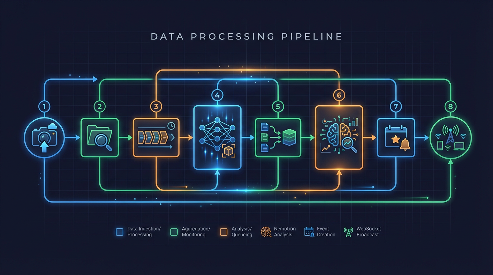
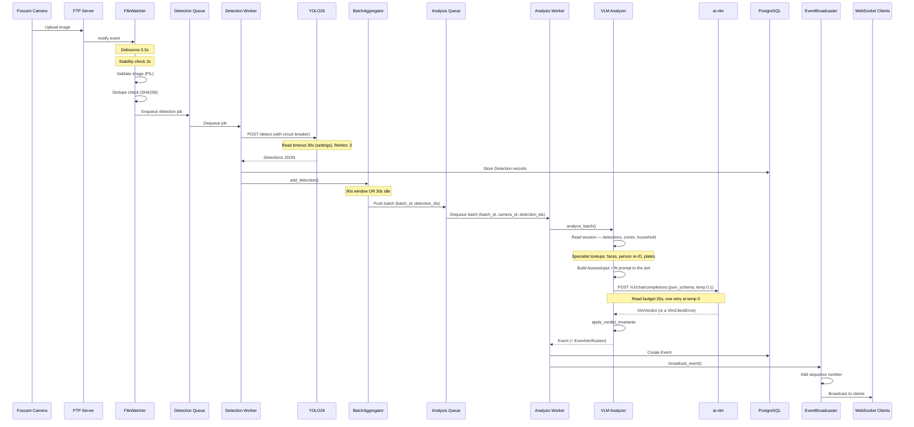
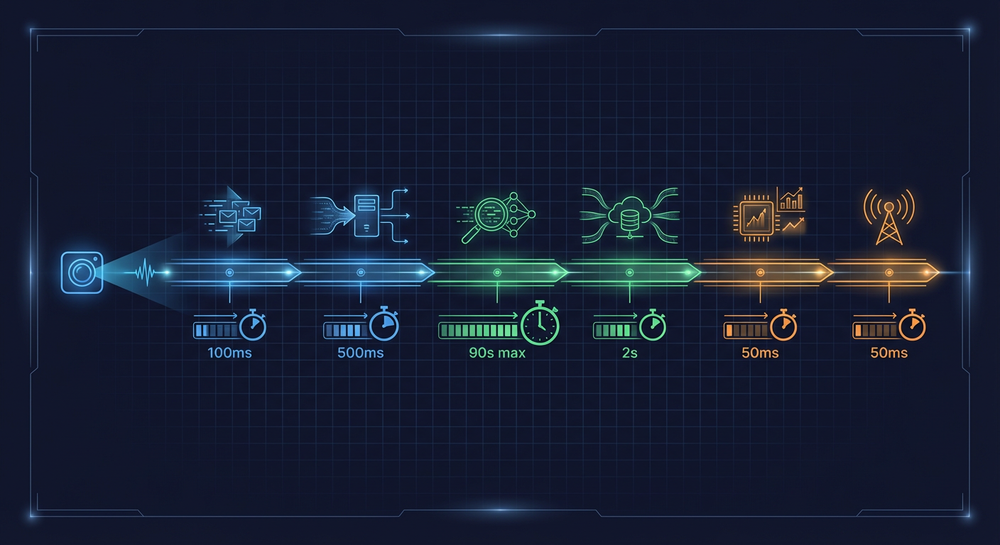

# Image to Event Flow

This document traces the complete journey of a camera image from upload to security event creation, including all processing stages, timing, and error handling.



## Flow Sequence Diagram


```mermaid
sequenceDiagram
    participant Camera as Foscam Camera
    participant FTP as FTP Server
    participant FW as FileWatcher
    participant DQ as Detection Queue
    participant DW as Detection Worker
    participant RT as YOLO26
    participant BA as BatchAggregator
    participant AQ as Analysis Queue
    participant AW as Analysis Worker
    participant VA as VLM Analyzer
    participant VLM as ai-vlm
    participant DB as PostgreSQL
    participant EB as EventBroadcaster
    participant WS as WebSocket Clients

    Camera->>FTP: Upload image
    FTP->>FW: inotify event
    Note over FW: Debounce 0.5s
    Note over FW: Stability check 2s
    FW->>FW: Validate image (PIL)
    FW->>FW: Dedupe check (SHA256)
    FW->>DQ: Enqueue detection job

    DQ->>DW: Dequeue job
    DW->>RT: POST /detect (with circuit breaker)
    Note over RT: Read timeout 30s (settings), Retries: 3
    RT-->>DW: Detections JSON
    DW->>DB: Store Detection records
    DW->>BA: add_detection()

    Note over BA: 90s window OR 30s idle
    BA->>AQ: Push batch (batch_id, detection_ids)

    AQ->>AW: Dequeue batch (batch_id, camera_id, detection_ids)

    AW->>VA: analyze_batch()
    VA->>VA: Read session — detections, zones, household
    Note over VA: Specialist lookups: faces, person re-ID, plates
    VA->>VA: Build AssessInput + fit prompt to the slot
    VA->>VLM: POST /v1/chat/completions (json_schema, temp 0.1)
    Note over VA,VLM: Read budget 25s, one retry at temp 0
    VLM-->>VA: VlmVerdict (or a VlmClientError)
    VA->>VA: apply_verdict_invariants
    VA-->>AW: Event (+ EventVerification)

    AW->>DB: Create Event
    AW->>EB: broadcast_event()
    EB->>EB: Add sequence number
    EB->>WS: Broadcast to clients
```

## Stage 1: File Detection

**Source:** `backend/services/file_watcher.py:379-413`

### 1.1 Filesystem Monitoring

The FileWatcher monitors camera directories using either inotify (Linux native) or polling mode (for Docker/NFS environments).

```python
# backend/services/file_watcher.py:400-413 (abridged)
def __init__(
    self,
    camera_root: str | None = None,
    redis_client: Any | None = None,
    debounce_delay: float = 0.5,          # Wait after last modification
    queue_name: str = DETECTION_QUEUE,
    ...
    stability_time: float = 2.0,          # File size stable for 2s
):
```

**Configuration:**

| Parameter          | Value           | Purpose                                 |
| ------------------ | --------------- | --------------------------------------- |
| `debounce_delay`   | 0.5s            | Avoid processing during active writes   |
| `stability_time`   | 2.0s            | Ensure FTP upload is complete           |
| `use_polling`      | False (default) | Use native inotify; set True for Docker |
| `polling_interval` | 1.0s            | Polling frequency if enabled            |

### 1.2 Image Validation

Before queuing, images are validated for integrity:

```python
# backend/services/file_watcher.py:139-164 (abridged from the body)
def _validate_image_sync(file_path: str) -> bool:
    # Try to open and verify image header
    with Image.open(file_path) as img:
        img.verify()  # Check headers

    # Re-open and fully load to catch truncation
    with Image.open(file_path) as img:
        img.load()  # Forces full decompression

    return True
```

**Validation checks:**

1. File exists and is readable
2. File size >= 10KB (`MIN_IMAGE_FILE_SIZE`)
3. PIL can verify image header
4. PIL can fully load image data (catches truncated images)

### 1.3 Deduplication

Files are deduplicated using SHA256 content hashes stored in Redis:

```python
# backend/services/file_watcher.py:12-16
# Files are deduplicated using SHA256 content hashes stored in Redis with TTL.
# This prevents duplicate processing caused by:
# - Watchdog create/modify event bursts
# - Service restarts during file processing
# - FTP upload retries
```

**TTL:** 5 minutes (configurable)

### Error Paths (Stage 1)

| Error             | Handling                | Recovery                     |
| ----------------- | ----------------------- | ---------------------------- |
| Empty file        | Log warning, skip       | Wait for complete upload     |
| Truncated image   | Log warning, skip       | Camera retries upload        |
| Duplicate file    | Skip silently           | Dedupe prevents reprocessing |
| Redis unavailable | Continue without dedupe | May cause duplicates         |

## Stage 2: Object Detection

**Source:** `backend/services/detector_client.py:993` (`DetectorClient.detect_objects`)

### 2.1 Detection Queue Processing

The detection worker dequeues image paths and sends them to YOLO26:

```python
# backend/services/detector_client.py:12-20
# Detection Flow:
#     1. Read image file from filesystem
#     2. Validate image integrity (catch truncated/corrupt images)
#     3. Acquire shared AI inference semaphore (NEM-1463)
#     4. POST to detector server with image data (with retry on transient failures)
#     5. Release semaphore
#     6. Parse JSON response with detections
#     7. Filter by confidence threshold
#     8. Store detections in database
#     9. Return Detection model instances
```

### 2.2 YOLO26 HTTP Request

```python
# backend/services/detector_client.py:596-667 (abridged from the body)
async def _send_detection_request(
    self,
    image_data: bytes,
    image_name: str,
    camera_id: str,
    image_path: str,
) -> dict[str, Any]:
    ...
    explicit_timeout = self._read_timeout + settings.ai_connect_timeout  # :637
    ...
    # Use semaphore to limit concurrent GPU requests (NEM-1500)
    async with semaphore:                          # :663
        async with asyncio.timeout(explicit_timeout):  # :665
            response = await self._http_client.post(...)  # :667
```

**Timing:**

| Parameter        | Value                 | Source                                        |
| ---------------- | --------------------- | --------------------------------------------- |
| Read timeout     | `yolo26_read_timeout` | `backend/core/config.py:1105-1110`            |
| Explicit timeout | read + connect        | `backend/services/detector_client.py:637`     |
| Timeout wiring   | connect/read/pool     | `backend/services/detector_client.py:298-303` |

### 2.3 Circuit Breaker Protection

```python
# backend/services/detector_client.py:336-345
self._circuit_breaker = CircuitBreaker(
    name=f"detector_{self._detector_type}",
    config=CircuitBreakerConfig(
        failure_threshold=5,
        recovery_timeout=60.0,
        half_open_max_calls=3,
        success_threshold=2,
        excluded_exceptions=(ValueError,),  # HTTP 4xx errors should not trip circuit
    ),
)
```

The breaker is named after the detector type (`detector_yolo26`), so each
detector keeps its own failure state.

### Error Paths (Stage 2)

| Error            | Handling                         | Recovery                  |
| ---------------- | -------------------------------- | ------------------------- |
| Connection error | Retry with exponential backoff   | Up to 3 retries           |
| Timeout          | Retry with exponential backoff   | Up to 3 retries           |
| HTTP 5xx         | Retry with exponential backoff   | Up to 3 retries           |
| HTTP 4xx         | Log and return empty list        | No retry (client error)   |
| Circuit open     | Raise `DetectorUnavailableError` | Wait for recovery timeout |

## Stage 3: Batch Aggregation

**Source:** `backend/services/batch_aggregator.py:172` (`BatchAggregator`)

### 3.1 Batch Creation and Management

```python
# backend/services/batch_aggregator.py:6-13
# Batching Logic:
#     - Create new batch when first detection arrives for a camera
#     - Add subsequent detections within 90-second window
#     - Close batch if:
#         * 90 seconds elapsed from batch start (window timeout)
#         * 30 seconds with no new detections (idle timeout)
#     - On batch close: push to analysis_queue with batch_id, camera_id, detection_ids
```

### 3.2 Redis Keys Structure

```
batch:{camera_id}:current      - Current batch ID for camera
batch:{batch_id}:camera_id     - Camera ID for batch
batch:{batch_id}:detections    - LIST of detection IDs (RPUSH for atomic append)
batch:{batch_id}:started_at    - Batch start timestamp
batch:{batch_id}:last_activity - Last activity timestamp
```

**Key TTL:** 1 hour (`BATCH_KEY_TTL_SECONDS = 3600`)

### 3.3 Atomic Operations

```python
# backend/services/batch_aggregator.py:334-356
async def _atomic_list_append(self, key: str, value: int, ttl: int) -> int:
    """Atomically append a value to a Redis list and refresh TTL.

    Uses Redis RPUSH for atomic append, eliminating race conditions
    in distributed environments.
    """
    client = self._redis._client
    length: int = await client.rpush(key, str(value))
    await client.expire(key, ttl)
    return length
```

### Timing Diagram

```
Time 0s: First detection arrives
         -> Create batch-{uuid}
         -> batch:started_at = now

Time 0-90s: Additional detections
            -> RPUSH to batch:detections
            -> Update batch:last_activity

CLOSE CONDITION 1: Window timeout (90s elapsed)
Time 90s: -> Close batch, push to analysis queue

CLOSE CONDITION 2: Idle timeout (30s no activity)
Time 30s+: -> Close batch, push to analysis queue

CLOSE CONDITION 3: Max detections reached
Any time:  -> Close batch, push to analysis queue
```

## Stage 4: VLM Analysis

**Source:** `backend/services/vlm_analyzer.py:380-655`

`VlmAnalyzer.analyze_batch()` is the analysis entry point the Analysis Worker
calls (`backend/services/pipeline_workers.py:1052`). The engine is the
`ai-vlm` container (llama.cpp, compose profile `vlm`), and the only thing in
the backend that dials it is `VlmClient` (`backend/services/vlm_client.py:215`).

### 4.1 Analysis Flow

```python
# backend/services/vlm_analyzer.py:380-655 (steps numbered from the body)
# Analysis Flow:
#     1. Check the idempotency key batch_event:<batch_id> (:401) — a repeat
#        returns the existing Event instead of assessing twice
#     2. Resolve camera_id / detection_ids from the queue payload, falling back
#        to the batch: Redis keys (:417-431); with neither, refuse loudly —
#        the VLM never originates an event
#     3. SESSION 1 (READ, :434): Detection rows, zones, household
#     4. Specialist lookups over the selected key frames (:503-524):
#        faces, person re-ID, plates -> three short text lines
#     5. Build the AssessInput context and request (:536-545)
#     6. NO SESSION across the call (:551): VlmClient.assess() POSTs
#        /v1/chat/completions with response_format json_schema
#     7. apply_verdict_invariants() maps the verdict to stored fields (:570)
#     8. SESSION 2 (WRITE, :573): Event + EventVerification in ONE transaction
#     9. Idempotency key set AFTER the write (:638)
#    10. Broadcast LAST, best-effort (:643)
```

The session split is deliberate: no session is held across the VLM call, which
can consume the whole read budget.

### 4.2 Specialist Lookups

Three database-backed lookups feed the prompt (`backend/services/vlm_specialists.py:884`):
`faces`, `person_reid`, and `plates`. They answer against enrolled galleries
and stored plate records rather than re-examining the scene, and each one
degrades to a single text line instead of failing the batch:

```python
# backend/services/vlm_specialists.py:12-18
# 1. **Never block the verdict (spec §6).** A missing model, a missing optional
#    package, a database hiccup, a failed inference — every one degrades to the
#    text "unavailable". Nothing in this module raises into the analyzer; the
#    entry points catch everything and there is deliberately no way for a
#    specialist failure to fail a batch. "unavailable" is also never "unknown":
#    the prompt shows which specialist did not run instead of a silently
#    missing line.
```

The analyzer keeps a belt-and-braces catch of its own, so even a bug in that
stage lands as three `unavailable` lines on the same keys
(`backend/services/vlm_analyzer.py:514-523`) rather than a lost event.

### 4.3 Retry Logic

The client owns exactly one transport retry, inside the same read budget, and
the second attempt re-sends the same body at temperature 0 (the first attempt is greedy too):

```python
# backend/services/vlm_client.py:810-817
last_error: VlmClientError | None = None
for attempt, temperature in enumerate((None, 0.0)):
    if temperature is not None:
        # §6 step 1: retry at temp 0. The first attempt is greedy too
        # (_ASSESS_TEMPERATURE), so the retry is a plain re-send; it stays
        # explicit so changing the first-attempt temperature cannot
        # silently change the retry.
        body["temperature"] = temperature
```

There is no third attempt and no backoff ladder: a second retry would double
the budget a single call already fits. When that retry still fails, the client
raises and the analyzer maps the failure to `verification_failed` instead of
propagating it (`backend/services/vlm_analyzer.py:556-560`) — the Event is
still written, with a NULL score.

**Timing:**

| Parameter                   | Value            | Source                                   |
| --------------------------- | ---------------- | ---------------------------------------- |
| Connect timeout             | 10s              | `backend/core/config.py:1093-1098`       |
| Read budget (one attempt)   | 25s              | `backend/core/config.py:1117-1125`       |
| Wake ping (`max_tokens: 1`) | 90s              | `backend/core/config.py:1126-1128`       |
| Breaker                     | 5 failures / 60s | `backend/services/vlm_client.py:247-249` |

The read budget is sized so the single retry fits inside it — a per-attempt
ceiling at or above 30 s would leave no room for the second attempt.

## Stage 5: Event Creation and Broadcast

### 5.1 Event Database Record

The Event record is written in Session 2 of `analyze_batch()`
(`backend/services/vlm_analyzer.py:573`) with:

- `batch_id` - Links to the original batch
- `camera_id` - Source camera
- `risk_score` - 0-100 from the VLM verdict; NULL when verification failed
- `risk_level` - Always derived from the score by `SeverityService` (low/medium/high/critical); the model never emits a level
- `summary` - Human-readable event description
- `reasoning` - The verdict's reasoning, with any §6 clamp left visible in the text

The same transaction writes the `EventVerification` row
(`backend/models/event_verification.py`) carrying the verdict itself, the scene
description, the verification criteria, the key-frame detection ids, the
engine/model provenance the server reported, and the call latency.

A transport or schema failure is not a lost event: `apply_verdict_invariants()`
returns `verification_failed` with a NULL score and honest summary text
(`backend/services/vlm_analyzer.py:267-280`), so the row exists and the UI shows
the event as needing review.

### 5.2 WebSocket Broadcast

**Source:** `backend/services/event_broadcaster.py:349-366`

```python
# backend/services/event_broadcaster.py:361-366
# Message Delivery Guarantees (NEM-1688):
# - All messages include monotonically increasing sequence numbers
# - Last MESSAGE_BUFFER_SIZE messages are buffered for replay
# - High-priority messages (risk_score >= 80 or critical) require acknowledgment
# - Per-client ACK tracking for delivery confirmation
```

**Buffer size:** 100 messages

## End-to-End Timing Summary



| Stage                 | Typical Duration | Max Duration                   |
| --------------------- | ---------------- | ------------------------------ |
| File stability wait   | 2s               | 2s                             |
| Image validation      | <100ms           | 500ms                          |
| Detection queue wait  | Variable         | Depends on load                |
| YOLO26 inference      | 200-500ms        | 60s (timeout)                  |
| Batch aggregation     | 30-90s           | 90s (window)                   |
| Analysis queue wait   | Variable         | Depends on load                |
| Specialist lookups    | Variable         | Depends on load                |
| VLM assess (one call) | a few seconds    | 25s (read budget) x 2 attempts |
| Event creation        | <100ms           | 1s                             |
| WebSocket broadcast   | <10ms            | 100ms                          |

**Total end-to-end:** dominated by the batch aggregation window.

## Complete Error Recovery Matrix

| Stage      | Error Type        | Immediate Action     | Recovery                                |
| ---------- | ----------------- | -------------------- | --------------------------------------- |
| File Watch | Truncated image   | Log, skip            | Camera re-uploads                       |
| Detection  | Connection error  | Retry 3x             | Circuit breaker opens                   |
| Detection  | Timeout           | Retry 3x             | Circuit breaker opens                   |
| Detection  | Circuit open      | Raise exception      | Wait recovery timeout                   |
| Batch      | Redis unavailable | Fail batch           | Retry on next batch                     |
| Analysis   | Transport failure | Retry once at temp 0 | `verification_failed`, NULL score, kept |
| Analysis   | Schema violation  | No retry             | `verification_failed`, NULL score, kept |
| Analysis   | Breaker open      | Refuse without I/O   | Wait 60s recovery                       |
| Broadcast  | WebSocket closed  | Buffer message       | Client reconnects                       |

No analysis failure drops an event: the ladder bottoms out in a written row
that reads `verification_failed` (`backend/services/vlm_analyzer.py:267-280`).

## Related Documents

- [batch-aggregation-flow.md](batch-aggregation-flow.md) - Detailed batch timing
- [llm-analysis-flow.md](llm-analysis-flow.md) - Analysis request/response details
- [error-recovery-flow.md](error-recovery-flow.md) - Circuit breaker sequences
