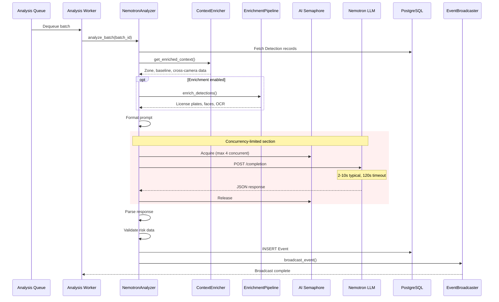

# LLM Analysis Flow

This document describes the Nemotron LLM analysis process, including prompt construction, request handling, retry logic, and response parsing.

## Analysis Flow Overview

**Source:** `backend/services/nemotron_analyzer.py:1-28`

```python
# backend/services/nemotron_analyzer.py:1-28
"""Nemotron analyzer service for LLM-based risk assessment.

This service analyzes batches of detections using the Nemotron LLM
via llama.cpp server to generate risk scores and natural language summaries.

Analysis Flow:
    1. Fetch batch detections from Redis/database
    2. Enrich context with zones, baselines, and cross-camera activity
    3. Run enrichment pipeline for license plates, faces, OCR (optional)
    4. Format prompt with enriched detection details
    5. Acquire shared AI inference semaphore (NEM-1463)
    6. POST to llama.cpp completion endpoint (with retry on transient failures)
    7. Release semaphore
    8. Parse JSON response
    9. Create Event with risk assessment
    10. Store Event in database
    11. Broadcast via WebSocket (if available)
"""
```

## Analysis Sequence Diagram



## NemotronAnalyzer Class

**Source:** `backend/services/nemotron_analyzer.py:135-237`

```python
# backend/services/nemotron_analyzer.py:135-237
class NemotronAnalyzer:
    """Analyzes detection batches using Nemotron LLM for risk assessment.

    Features:
        - Retry logic with exponential backoff for transient failures (NEM-1343)
        - Configurable timeouts and retry attempts via settings
        - Context enrichment with zone, baseline, and cross-camera data
        - Enrichment pipeline for license plates, faces, and OCR
    """

    def __init__(
        self,
        redis_client: RedisClient | None = None,
        context_enricher: ContextEnricher | None = None,
        enrichment_pipeline: EnrichmentPipeline | None = None,
        use_enriched_context: bool = True,
        use_enrichment_pipeline: bool = True,
        max_retries: int | None = None,
        service_facade: AnalyzerServiceFacade | None = None,
    ):
```

### Configuration

| Parameter       | Default | Source                                 |
| --------------- | ------- | -------------------------------------- |
| Connect timeout | 10s     | `NEMOTRON_CONNECT_TIMEOUT` (line 130)  |
| Read timeout    | 120s    | `NEMOTRON_READ_TIMEOUT` (line 131)     |
| Health timeout  | 5s      | `NEMOTRON_HEALTH_TIMEOUT` (line 132)   |
| Max retries     | 3       | `nemotron_max_retries` setting         |
| Max concurrent  | 4       | `AI_MAX_CONCURRENT_INFERENCES` setting |

## Concurrency Control

**Source:** `backend/services/nemotron_analyzer.py:19-22`

```python
# backend/services/nemotron_analyzer.py:19-22
# Concurrency Control (NEM-1463):
#     Uses a shared asyncio.Semaphore to limit concurrent AI inference operations.
#     This prevents GPU/AI service overload under high traffic. The limit is
#     configurable via AI_MAX_CONCURRENT_INFERENCES setting (default: 4).
```

### Semaphore Acquisition Flow

```
Request 1: Acquire semaphore (count: 4 -> 3) -> Process -> Release (count: 3 -> 4)
Request 2: Acquire semaphore (count: 4 -> 3) -> Process -> Release
Request 3: Acquire semaphore (count: 4 -> 3) -> Process -> Release
Request 4: Acquire semaphore (count: 4 -> 3) -> Process -> Release
Request 5: WAIT (count: 0) -> Acquire when available -> Process -> Release
```

## Retry Logic

**Source:** `backend/services/nemotron_analyzer.py:24-27`

```python
# backend/services/nemotron_analyzer.py:24-27
# Retry Logic (NEM-1343):
#     - Configurable max retries via NEMOTRON_MAX_RETRIES setting (default: 3)
#     - Exponential backoff: 2^attempt seconds between retries (capped at 30s)
#     - Only retries transient failures (connection, timeout, HTTP 5xx)
```

### Retry Timing

| Attempt | Backoff            | Cumulative Wait |
| ------- | ------------------ | --------------- |
| 1       | 0s                 | 0s              |
| 2       | 2s                 | 2s              |
| 3       | 4s                 | 6s              |
| 4       | 8s (capped at 30s) | 14s             |

### Retriable Errors

| Error Type               | Retriable | Reason                  |
| ------------------------ | --------- | ----------------------- |
| `httpx.ConnectError`     | Yes       | Transient network issue |
| `httpx.TimeoutException` | Yes       | Server overload         |
| HTTP 5xx                 | Yes       | Server error            |
| HTTP 4xx                 | No        | Client error            |
| JSON parse error         | No        | Response format issue   |
| Validation error         | No        | Invalid response data   |

## Prompt Construction

### Prompt Templates

**Source:** `backend/services/nemotron_analyzer.py:95-114`

```python
# backend/services/nemotron_analyzer.py:95-114
from backend.services.prompts import (
    ENRICHED_RISK_ANALYSIS_PROMPT,
    FULL_ENRICHED_RISK_ANALYSIS_PROMPT,
    MODEL_ZOO_ENHANCED_RISK_ANALYSIS_PROMPT,
    RISK_ANALYSIS_PROMPT,
    VISION_ENHANCED_RISK_ANALYSIS_PROMPT,
    format_action_recognition_context,
    format_camera_health_context,
    format_clothing_analysis_context,
    format_depth_context,
    format_detections_with_all_enrichment,
    format_household_context,
    format_image_quality_context,
    format_pet_classification_context,
    format_pose_analysis_context,
    format_vehicle_classification_context,
    format_vehicle_damage_context,
    format_violence_context,
    format_weather_context,
)
```

### Prompt Components

| Component             | Source             | Content                                   |
| --------------------- | ------------------ | ----------------------------------------- |
| Detection details     | Database           | Object labels, bounding boxes, confidence |
| Zone context          | ContextEnricher    | Zone definitions, baseline deviations     |
| Cross-camera activity | ContextEnricher    | Related detections on other cameras       |
| License plates        | EnrichmentPipeline | OCR results from vehicles                 |
| Face detections       | EnrichmentPipeline | Face locations in person detections       |
| Weather context       | EnrichmentPipeline | Current weather conditions                |
| Time context          | System             | Time of day, day of week                  |

### Example Prompt Structure

```
<|im_start|>system
You are a security analysis AI. Analyze the following detections and provide a risk assessment.

Current time: 2024-12-23 22:15:00 (Night, Monday)
Weather: Clear, 45°F

Zone: Front Yard (Entry Zone)
Baseline: Typically 0-2 person detections per hour at this time
Current: 3 person detections (above baseline)

Cross-camera activity:
- Side Gate camera: 1 person detection 2 minutes ago
- Driveway camera: 1 vehicle detection 5 minutes ago
<|im_end|>

<|im_start|>user
Detections in this batch:
1. person (confidence: 0.92) at [120, 340, 280, 580]
2. person (confidence: 0.87) at [400, 320, 520, 560]
3. car (confidence: 0.95) at [50, 100, 350, 300]

License plate detected: ABC 123 (California)
Unknown vehicle - not in household database

Provide your risk assessment as JSON:
{
  "risk_score": <0-100>,
  "risk_level": "<low|medium|high|critical>",
  "summary": "<brief description>",
  "reasoning": "<detailed explanation>"
}
<|im_end|>
```

## LLM Request

**Source:** `backend/services/nemotron_analyzer.py:455-487`

```python
# backend/services/nemotron_analyzer.py:455-487
async def _call_llm_with_version(
    self,
    context: str,
    prompt_version: str = "v1_original",
) -> dict[str, Any]:
    """Call LLM with a specific prompt version."""
    settings = get_settings()
    max_output_tokens = settings.nemotron_max_output_tokens

    payload = {
        "prompt": context,
        "temperature": 0.7,
        "top_p": 0.95,
        "max_tokens": max_output_tokens,
        "stop": ["<|im_end|>", "<|im_start|>"],
    }

    headers = {"Content-Type": "application/json"}
    headers.update(self._get_auth_headers())

    async with httpx.AsyncClient(timeout=self._timeout) as client:
        response = await client.post(
            f"{self._llm_url}/completion",
            json=payload,
            headers=headers,
        )
        response.raise_for_status()
        llm_result = response.json()
```

### Request Parameters

| Parameter     | Value        | Purpose                    |
| ------------- | ------------ | -------------------------- | ------ | -------- | ---- | ------------------------------- |
| `temperature` | 0.7          | Moderate creativity        |
| `top_p`       | 0.95         | Nucleus sampling threshold |
| `max_tokens`  | Configurable | Limit response length      |
| `stop`        | `["<         | im_end                     | >", "< | im_start | >"]` | Stop generation at chat markers |

## Response Parsing

**Source:** `backend/services/nemotron_analyzer.py:116-119`

```python
# backend/services/nemotron_analyzer.py:116-119
# Pre-compiled regex patterns for LLM response parsing
# These are compiled once at module load time for better performance
_THINK_PATTERN = re.compile(r"<think>.*?</think>", re.DOTALL)
_JSON_PATTERN = re.compile(r"\{[^{}]*(?:\{[^{}]*\}[^{}]*)*\}", re.DOTALL)
```

### Parsing Steps

1. Remove `<think>` blocks (reasoning scaffolding)
2. Extract JSON object from response text
3. Validate required fields
4. Normalize risk score to 0-100 range
5. Derive risk_level if not provided

### Expected Response Format

```json
{
  "risk_score": 75,
  "risk_level": "high",
  "summary": "Multiple unknown individuals detected at front entrance after dark",
  "reasoning": "Three persons detected at entry zone during nighttime hours (22:15). This exceeds the typical baseline of 0-2 detections. An unfamiliar vehicle with out-of-state plates is also present. The combination of multiple unknown individuals and an unrecognized vehicle at this hour warrants elevated concern."
}
```

## A/B Testing Support

**Source:** `backend/services/nemotron_analyzer.py:223-259`

```python
# backend/services/nemotron_analyzer.py:223-259
# A/B Testing support (NEM-1667)
self._ab_tester: Any | None = None  # PromptABTester when configured
self._ab_config: Any | None = None  # ABTestConfig when configured

# Prompt Experiment support (NEM-3023)
self._experiment_config: Any | None = None  # PromptExperimentConfig when configured

# A/B Rollout Manager support (NEM-3338)
self._rollout_manager: Any | None = None  # ABRolloutManager when configured
```

### Shadow Mode Analysis

**Source:** `backend/services/nemotron_analyzer.py:348-423`

```python
# backend/services/nemotron_analyzer.py:348-423
async def run_shadow_analysis(
    self,
    camera_id: str,
    context: str,
) -> dict[str, Any]:
    """Run shadow mode analysis with both prompt versions.

    In shadow mode, runs both V1 and V2 prompts but returns V1 results
    as the primary output. V2 results are logged for comparison analysis.
    """
```

Shadow mode enables safe prompt experimentation:

1. Run both V1 (control) and V2 (treatment) prompts
2. Return V1 result as primary output
3. Log V2 result for comparison
4. Track score differences and latency

## Cold Start and Warmup

**Source:** `backend/services/nemotron_analyzer.py:216-221`

```python
# backend/services/nemotron_analyzer.py:216-221
# Cold start and warmup tracking (NEM-1670)
self._last_inference_time: float | None = None
self._is_warming: bool = False
self._warmup_enabled = settings.ai_warmup_enabled
self._cold_start_threshold = settings.ai_cold_start_threshold_seconds
self._warmup_prompt = settings.nemotron_warmup_prompt
```

### Cold Start Detection

Model is considered "cold" if:

- Never used (`_last_inference_time is None`)
- Not used within threshold (default: 300s)

Cold starts may have higher latency due to:

- Model loading into GPU memory
- CUDA context initialization
- JIT compilation of kernels

## Error Handling

### Error Categories

| Error             | Handling              | User Impact          |
| ----------------- | --------------------- | -------------------- |
| Connection error  | Retry 3x with backoff | Delayed analysis     |
| Timeout           | Retry 3x with backoff | Delayed analysis     |
| HTTP 5xx          | Retry 3x with backoff | Delayed analysis     |
| HTTP 4xx          | Fail immediately      | Batch skipped        |
| Parse error       | Fail immediately      | Batch skipped        |
| Validation error  | Fail immediately      | Batch skipped        |
| Semaphore timeout | Wait or fail          | Queued behind others |

### Graceful Degradation

If LLM is unavailable:

1. Batch remains in analysis queue
2. Will be retried on next worker cycle
3. After max retries, batch is moved to DLQ
4. Frontend shows detections without risk assessment

## Metrics and Observability

**Source:** `backend/services/nemotron_analyzer.py:56-66`

```python
# backend/services/nemotron_analyzer.py:56-66
from backend.core.metrics import (
    observe_ai_request_duration,
    observe_risk_score,
    observe_stage_duration,
    record_event_by_camera,
    record_event_by_risk_level,
    record_event_created,
    record_nemotron_tokens,
    record_pipeline_error,
    record_prompt_template_used,
)
```

### Recorded Metrics

| Metric                            | Type      | Labels                  |
| --------------------------------- | --------- | ----------------------- |
| `hsi_ai_request_duration_seconds` | Histogram | service=nemotron        |
| `hsi_risk_score`                  | Histogram | camera_id               |
| `hsi_events_total`                | Counter   | risk_level, camera_id   |
| `hsi_nemotron_tokens_total`       | Counter   | type=input/output       |
| `hsi_pipeline_errors_total`       | Counter   | stage=nemotron_analysis |

## Timing Summary

| Phase               | Typical Duration | Max Duration |
| ------------------- | ---------------- | ------------ |
| Fetch detections    | <100ms           | 500ms        |
| Context enrichment  | 100-500ms        | 2s           |
| Enrichment pipeline | 500ms-5s         | 30s          |
| Prompt formatting   | <50ms            | 200ms        |
| Semaphore wait      | 0-10s            | 60s          |
| LLM inference       | 2-10s            | 120s         |
| Response parsing    | <10ms            | 100ms        |
| Event creation      | <100ms           | 500ms        |
| WebSocket broadcast | <10ms            | 100ms        |

**Total:** 3-25s typical (dominated by LLM inference)

## Related Documents

- [image-to-event.md](image-to-event.md) - Complete pipeline context
- [batch-aggregation-flow.md](batch-aggregation-flow.md) - What triggers analysis
- [enrichment-pipeline.md](enrichment-pipeline.md) - Pre-analysis enrichment
- [error-recovery-flow.md](error-recovery-flow.md) - Retry patterns
