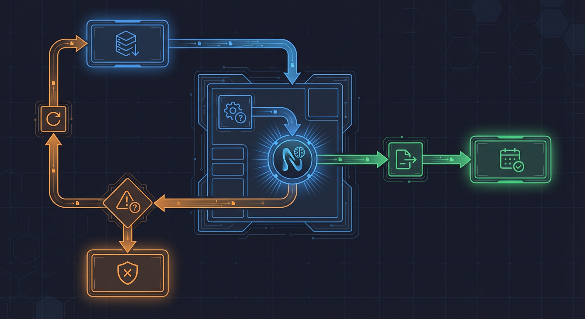
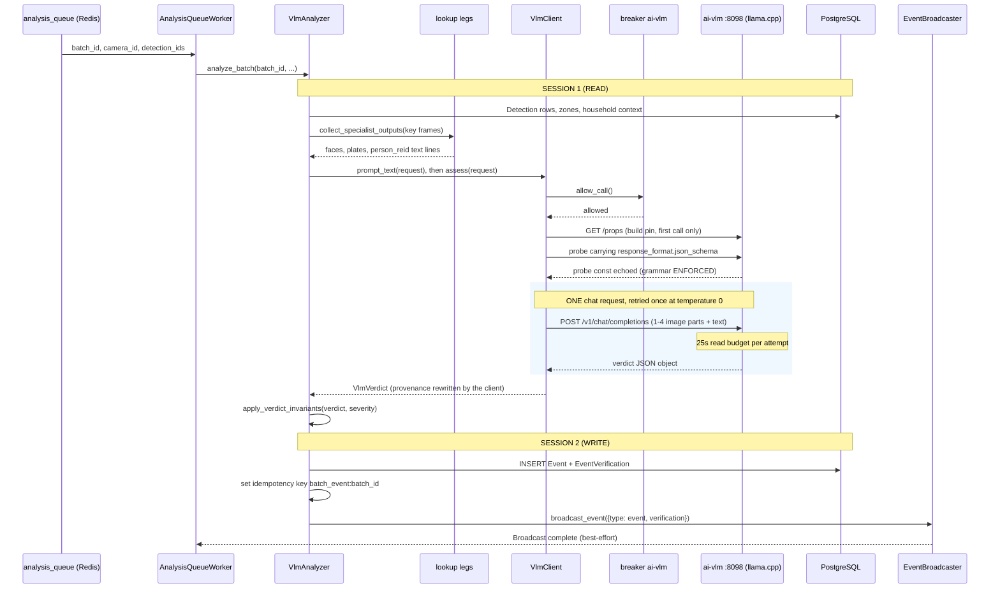
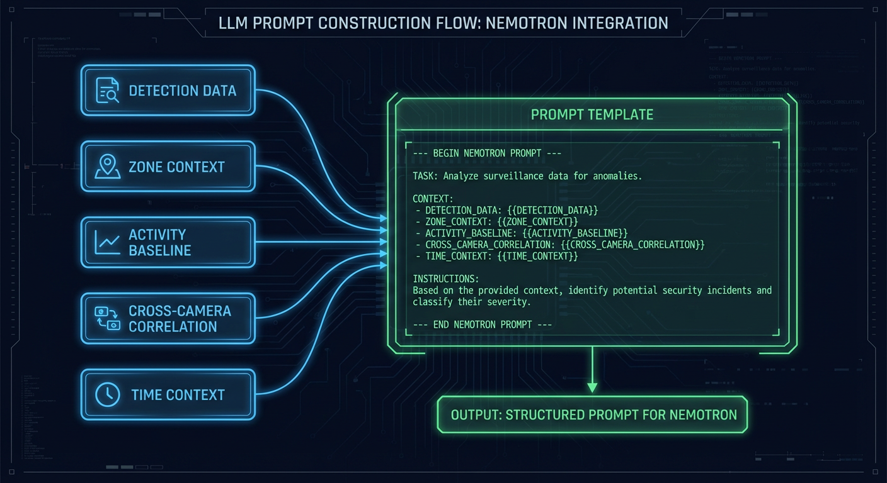

# LLM Analysis Flow

This document describes the LLM analysis step of the shipped pipeline: how a closed batch of detections becomes a prompt, one constrained request to the `ai-vlm` engine, a parsed verdict, and an `Event`. `AnalysisQueueWorker` pops the batch, `VlmAnalyzer` builds the request and writes the rows, `VlmClient` owns the wire and the single transport retry, and `apply_verdict_invariants` turns the verdict into the stored score.



## Analysis Flow Overview

Every production seam builds the one analyzer through `build_pipeline_analyzer` (`backend/services/pipeline_factory.py:28-40`), and the worker hands it a single closed batch:

**Source:** `backend/services/pipeline_workers.py:1049-1056`

```python
# Source: backend/services/pipeline_workers.py:1049-1056
            try:
                # Run LLM analysis - pass camera_id and detection_ids from queue payload
                # This avoids the need to read batch metadata from Redis (which is deleted after close_batch)
                event = await self._analyzer.analyze_batch(
                    batch_id=batch_id,
                    camera_id=camera_id,
                    detection_ids=detection_ids,
                )
```

What the analyzer module owns, in the order the rules apply:

**Source:** `backend/services/vlm_analyzer.py:9-29`

```python
# Source: backend/services/vlm_analyzer.py:9-29

  1. ONE AssessInput builder (`build_assess_context`) shared by production
     (values read from DB rows in session 1) and replay (2.1, values loaded
     from the eval store) - the "one code path" rule; the builder never
     touches an ORM object, only plain dicts.
  2. The invariant table (`apply_verdict_invariants`): rejected clamps the
     score to <= SeverityService.low_max (spec §6 - "the verdict gates
     alerts, the score still ranks"; the clamp and its reason are visible in
     the stored reasoning), uncertain KEEPS its score (§6:145 - uncertain is
     not rejected), the level is ALWAYS derived by SeverityService (the
     model never emits one - §3 Derived row), and a verification failure
     scores NULL with the event row still written (spec §6:320-323 - the
     event exists precisely so the UI shows "needs review").
  3. The ladder's tail: vlm_client already owns the ONE transport retry at
     temperature 0 (pinned in test_vlm_client.TestFailureLadder); when it
     still raises, this module maps the failure to verification_failed +
     the EventVerification row - it never re-retries (a second retry would
     double the S4 p95 budget a single call already fits).
  4. The VLM NEVER originates an event: the detector closing a batch is
     what puts camera/detections into Redis (batch_aggregator.close_batch)
     or into the queue payload; absent both, analyze_batch refuses loudly
```

The session split is deliberate. Session 1 READs detections, zones and household context and runs the lookup legs. **No session is held across the engine call**, because one attempt can take the whole read budget (`backend/core/config.py:1117-1124`). Session 2 WRITEs `Event` and `EventVerification` in one transaction, the idempotency key is set AFTER the write, and the broadcast is LAST and best-effort (`backend/services/vlm_analyzer.py:634-643`).

## Analysis Sequence Diagram


```mermaid
sequenceDiagram
    participant AQ as analysis_queue (Redis)
    participant AW as AnalysisQueueWorker
    participant VA as VlmAnalyzer
    participant SP as lookup legs
    participant VC as VlmClient
    participant CB as breaker ai-vlm
    participant VLM as ai-vlm :8098 (llama.cpp)
    participant DB as PostgreSQL
    participant EB as EventBroadcaster

    AQ->>AW: batch_id, camera_id, detection_ids
    AW->>VA: analyze_batch(batch_id, ...)

    Note over VA,DB: SESSION 1 (READ)
    VA->>DB: Detection rows, zones, household context
    VA->>SP: collect_specialist_outputs(key frames)
    SP-->>VA: faces, plates, person_reid text lines

    VA->>VC: prompt_text(request), then assess(request)
    VC->>CB: allow_call()
    CB-->>VC: allowed
    VC->>VLM: GET /props (build pin, first call only)
    VC->>VLM: probe carrying response_format.json_schema
    VLM-->>VC: probe const echoed (grammar ENFORCED)

    rect rgb(240, 248, 255)
        Note over VC,VLM: ONE chat request, retried once at temperature 0
        VC->>VLM: POST /v1/chat/completions (1-4 image parts + text)
        Note over VLM: 25s read budget per attempt
        VLM-->>VC: verdict JSON object
    end

    VC-->>VA: VlmVerdict (provenance rewritten by the client)
    VA->>VA: apply_verdict_invariants(verdict, severity)

    Note over VA,DB: SESSION 2 (WRITE)
    VA->>DB: INSERT Event + EventVerification
    VA->>VA: set idempotency key batch_event:batch_id
    VA->>EB: broadcast_event({type: event, verification})
    EB-->>AW: Broadcast complete (best-effort)
```

A failure anywhere inside the highlighted block ends in the same place as success: an `Event` row exists, carrying `verification_failed` and a NULL score. See [Error Handling](#error-handling).

## VlmAnalyzer Class

**Source:** `backend/services/vlm_analyzer.py:344-378`

```python
# Source: backend/services/vlm_analyzer.py:344-378
class VlmAnalyzer:
    """One analyze_batch call == one batch -> (at most) one assess ->
    one Event (+ EventVerification) -> one broadcast (prod mode).

    `replay=True` (2.1 wires it) runs the identical pipeline but never
    broadcasts: the replay loop feeds the eval store, not the console."""

    def __init__(
        self,
        vlm_client: VlmClient | None = None,
        redis_client: Any | None = None,
        *,
        severity: SeverityService | None = None,
        replay: bool = False,
    ) -> None:
        self._client = vlm_client
        self._redis = redis_client
        self._severity = severity or get_severity_service()
        self._replay = replay
        settings = get_settings()
        self._settings = settings
        # Degraded-path provenance: a failed call has no verdict to read
        # the engine's own label from, so the settings labels stand in (the
        # event_verifications columns are NOT NULL). Same source nemotron
        # uses (:501-502); engine stays the shipped "llama.cpp" label, the
        # model id joins it env-first next to the VLM_URL settings (1.3).
        self._fallback_engine = settings.nemotron_verification_engine
        self._fallback_model_id = settings.vlm_model_id

    def _get_client(self) -> VlmClient:
        # Lazy: construction never opens an httpx client (the batch worker
        # builds one per worker; close() after each call releases it).
        if self._client is None:
            self._client = VlmClient()
        return self._client
```

`analyze_batch` is the entry the worker calls:

**Source:** `backend/services/vlm_analyzer.py:380-390`

```python
# Source: backend/services/vlm_analyzer.py:380-390
    async def analyze_batch(
        self,
        batch_id: str,
        camera_id: str | None = None,
        detection_ids: list[int | str] | None = None,
        *,
        specialist_inputs: dict[str, str] | None = None,
    ) -> Event:
        """Analyze one closed batch. Raises ValueError when the batch has
        no detections, or when NO detector closed it (no camera metadata in
        Redis and no queue-payload camera - the §6 "VLM never originates an
```

Its two `ValueError` branches enforce the rule that the VLM never originates an event: no camera from the queue payload or Redis, and no detection ids, both refuse with zero writes.

**Source:** `backend/services/vlm_analyzer.py:420-428`

```python
# Source: backend/services/vlm_analyzer.py:420-428
            raise ValueError(
                f"Batch {batch_id} has no camera metadata - the detector never "
                "closed it; the VLM never originates events (spec §6)"
            )
        if detection_ids is None and self._redis is not None:
            raw = await self._redis.get(f"batch:{batch_id}:detections")
            detection_ids = json.loads(raw) if raw else []
        if not detection_ids:
            raise ValueError(f"Batch {batch_id} has no detections")
```

### Configuration

| Parameter                      | Default                                                 | Source                                                                                            |
| ------------------------------ | ------------------------------------------------------- | ------------------------------------------------------------------------------------------------- |
| Read budget, one attempt       | 25 s                                                    | `ai_vlm_read_timeout` (`backend/core/config.py:1117-1124`)                                        |
| Connect timeout                | 10 s                                                    | `ai_connect_timeout` (`backend/core/config.py:1093-1097`)                                         |
| Wake ping read budget          | 90 s                                                    | `ai_vlm_wake_timeout_seconds` (`backend/core/config.py:1126-1133`)                                |
| Engine URL                     | `http://localhost:8098`; `http://ai-vlm:8098` in Docker | `ai_vlm_url` (`backend/core/config.py:1042-1045`)                                                 |
| Verdict output budget          | 1024 tokens                                             | `_ASSESS_MAX_TOKENS` (`backend/services/vlm_client.py:91`)                                        |
| Context pool and slots         | 32768 across 2 slots = 16384 each                       | `docker-compose.prod.yml:205-206`, divided by the validator at `backend/core/config.py:1351-1365` |
| Largest embedded key frame     | 8 MiB                                                   | `vlm_max_image_bytes` (`backend/core/config.py:1367-1374`)                                        |
| Breaker threshold and recovery | 5 failures, 60 s                                        | `backend/services/vlm_client.py:247-250`                                                          |
| LOW-band clamp ceiling         | 29                                                      | `severity_low_max` (`backend/core/config.py:2423-2428`)                                           |
| Degraded-path engine label     | `llama.cpp`                                             | `nemotron_verification_engine` (`backend/core/config.py:1384-1386`)                               |

## Concurrency and Circuit Breaking

One breaker named `ai-vlm` is shared by every client instance, so a dead engine is discovered once rather than once per caller:

**Source:** `backend/services/vlm_client.py:247-250`

```python
# Source: backend/services/vlm_client.py:247-250
        self._breaker: CircuitBreaker = get_circuit_breaker(
            BREAKER_NAME,
            CircuitBreakerConfig(failure_threshold=5, recovery_timeout=60.0),
        )
```

`assess` asks the breaker before any I/O and refuses without a socket when it is open:

**Source:** `backend/services/vlm_client.py:765-771`

```python
# Source: backend/services/vlm_client.py:765-771
        if not await self._breaker.allow_call():
            record_pipeline_error("vlm_circuit_open")
            await self._push_unhealthy("circuit open")
            raise VlmUnavailableError(
                f"vlm breaker OPEN for {BREAKER_NAME}; refusing without I/O "
                f"(recovery in {self._breaker.config.recovery_timeout:.0f}s)"
            )
```

State machine:

```text
CLOSED      allow_call() -> True   each transport failure records one failure
  | 5th failure
OPEN        allow_call() -> False  VlmUnavailableError, NO I/O
  |           -> record_pipeline_error("vlm_circuit_open")
  |           -> DegradationManager UNHEALTHY, hsi_ai_service_degraded{service="ai-vlm"} = 1
  | 60 s elapse
HALF_OPEN   allow_call() -> True   recovery traffic is let through
  | success -> CLOSED, and only now is the unhealthy flag cleared
  | failure -> OPEN again
```

A budget problem is deliberately kept out of the breaker. `_note_budget_exhausted` counts the metric without recording a breaker failure, because a reply cut off by our own `max_tokens` is not evidence that the service should stop being called:

**Source:** `backend/services/vlm_client.py:897-917`

```python
# Source: backend/services/vlm_client.py:897-917
    async def _note_budget_exhausted(self, reason: str) -> None:
        """Count it, but do NOT feed the breaker.

        The breaker answers one question - "should we stop calling this
        service?" - and a reply cut off by OUR max_tokens answers it NO: the
        transport worked, the grammar applied, the endpoint returned 200 and
        did real work. Feeding it means a verbose corpus OPENS `ai-vlm` over a
        number we chose, after which every later item raises
        VlmUnavailableError WITHOUT I/O and the replay reports a breaker, not
        a model - the exact contamination finding B found for a per-item
        client, reached instead through a budget.

        Nothing is silenced: the metric still counts (that is the aggregate
        the M2 read uses, under its own cause), the item still refuses to
        score, and the analyzer still answers verification_failed with a NULL
        score. The diagnosis stays loud; the breaker is just not lied to.

        Deliberately NOT used for the service-level probe refusals (props
        unreachable, transport, build mismatch) - those genuinely do mean
        "stop calling this endpoint", and their breaker behavior is unchanged."""
        record_pipeline_error(reason)
```

Engine-side concurrency is the served slot count: the container runs llama.cpp with `--parallel 2`, so two `vlm_assess` calls share the pool and each request occupies one slot (`docker-compose.prod.yml:205-206`). Analysis throughput is the worker pool's business: `analysis_worker_count` defaults to 2 (`backend/core/config.py:1022-1026`), and each worker holds at most one engine call in flight.

## Retry Logic

The ladder is split in two on purpose: the client owns the one transport retry, the analyzer owns the mapping to a stored verdict and never re-retries. These are the classes the client raises:

**Source:** `backend/services/vlm_client.py:118-142`

```python
# Source: backend/services/vlm_client.py:118-142
class VlmClientError(RuntimeError):
    """Base for every client failure the analyzer maps into the ladder."""


class VlmTransportError(VlmClientError):
    """§6 step 1 territory: connection refused / timeout / 5xx. Retried
    once at temperature 0, then raised."""


class VlmSchemaError(VlmClientError):
    """§6 step 2 territory: the reply arrived COMPLETE but violates
    VlmVerdict even after the grammar supposedly guaranteed it (the E5-class
    server-side lie). Post-validation is the last line (S5). A reply cut off
    by its token budget is NOT this class - see VlmTruncatedError."""


class VlmTruncatedError(VlmSchemaError):
    """Finding A's sibling on the assess leg: the engine stopped with a
    length signal mid-object, so the JSON never closed. Subclassed under
    VlmSchemaError so every existing `except VlmSchemaError` keeps mapping to
    verification_failed (the ladder is neutral - a truncation has never
    scored), but named apart because the CAUSE and the retry calculus differ:
    a budget is not a model that emits invalid JSON, and the §6 retry asks
    again at the SAME max_tokens, so re-asking cannot close the object."""
```

### Retry Loop

The loop is a two-element tuple of temperatures over one request body:

**Source:** `backend/services/vlm_client.py:804-806`

```python
# Source: backend/services/vlm_client.py:804-806
        last_error: VlmClientError | None = None
        for attempt, temperature in enumerate((None, 0.0)):
            if temperature is not None:
```

and it leaves by returning a verdict or raising the last error:

**Source:** `backend/services/vlm_client.py:874-878`

```python
# Source: backend/services/vlm_client.py:874-878
            await self._breaker.record_success_async()
            await self._push_healthy()
            return verdict.model_copy(update={"provenance": self._served_provenance()})

        raise last_error if last_error else VlmClientError("vlm assess failed")
```

### Retry Timing

| Attempt | Temperature | Wait before the attempt | Read budget |
| ------- | ----------- | ----------------------- | ----------- |
| 1       | 0.1         | none                    | 25 s        |
| 2       | 0.0         | none                    | 25 s        |

There is no sleep between attempts and no third attempt: the retry re-sends the same body immediately at temperature 0, and a second retry would double the p95 budget a single call already fits (`backend/core/config.py:1117-1124`). A second attempt only lands inside the S4 target when the first one failed fast.

### Retriable and Non-Retriable Failures

| Failure                                                                          | Class                            | Retried                    | Feeds the breaker |
| -------------------------------------------------------------------------------- | -------------------------------- | -------------------------- | ----------------- |
| Connection refused, timeout                                                      | `VlmTransportError`              | yes, once                  | yes               |
| HTTP status other than 200                                                       | `VlmTransportError`              | yes, once                  | yes               |
| Complete reply that violates `VlmVerdict`                                        | `VlmSchemaError`                 | yes, once                  | yes               |
| Reply truncated at its token budget                                              | `VlmTruncatedError`              | no                         | no                |
| Request larger than the served slot                                              | `VlmContextOverflowError`        | no                         | no                |
| Grammar unenforced, `/props` unreachable, build mismatch                         | `ConstrainedDecodingNotEnforced` | no                         | yes               |
| Key frame unreadable, outside the capture root, wrong type, or over the byte cap | `VlmImageError`                  | no (raised before any I/O) | no                |
| Breaker OPEN                                                                     | `VlmUnavailableError`            | no (refused without I/O)   | already open      |

A truncation is raised once instead of retried, because the retry re-asks the same body at the same `max_tokens` and re-asking cannot close the object:

**Source:** `backend/services/vlm_client.py:850-856`

```python
# Source: backend/services/vlm_client.py:850-856
                    last_error = VlmTruncatedError(
                        f"vlm verdict reply hit its token budget before the "
                        f"object closed (stop={stop!r}, "
                        f"max_tokens={_ASSESS_MAX_TOKENS}); verdict UNMEASURED "
                        "at this budget, not invalid"
                    )
                    await self._note_budget_exhausted("vlm_assess_truncated")
```

## Timeout Budget

The httpx client is built per call with one read budget and one connect budget:

**Source:** `backend/services/vlm_client.py:265-275`

```python
# Source: backend/services/vlm_client.py:265-275
    async def _http(self) -> httpx.AsyncClient:
        if self._client is None:
            # default= covers write/pool: httpx requires all four or a default.
            timeout = httpx.Timeout(
                self._settings.ai_vlm_read_timeout,
                connect=self._settings.ai_connect_timeout,
            )
            self._client = httpx.AsyncClient(
                timeout=timeout, transport=self._transport, base_url=self._base_url
            )
        return self._client
```

| Phase                  | Budget          | Set by                        |
| ---------------------- | --------------- | ----------------------------- |
| TCP connect            | 10 s            | `ai_connect_timeout`          |
| One engine attempt     | 25 s read       | `ai_vlm_read_timeout`         |
| Both attempts together | 50 s worst case | the same per-attempt ceiling  |
| Wake ping              | 90 s read       | `ai_vlm_wake_timeout_seconds` |
| Breaker recovery       | 60 s            | `CircuitBreakerConfig`        |

The read budget is the load-bearing number: the S4 target of p95 at or under 30 s including cold starts is why a per-attempt ceiling at or above 30 s would leave no room for the retry (`backend/core/config.py:1117-1124`).

## Prompt Construction



### The Renderer

One function renders the text half of the message. It is public because the analyzer stores its output verbatim as `Event.llm_prompt`, and `assess` renders through the same call — the stored row records the question that was actually asked, truncation marker included:

**Source:** `backend/services/vlm_client.py:743-753`

```python
# Source: backend/services/vlm_client.py:743-753
    def prompt_text(self, request: VlmAssessRequest) -> str:
        """The text half of the assess message, FITTED to the vlm slot.

        PUBLIC because the analyzer stores it verbatim as Event.llm_prompt
        (spec §4 event detail: images referenced by path, never embedded) -
        which is precisely why the stored text must BE the text the model was
        given: `assess` renders through this same method, so the row records
        the question that was actually asked, truncation marker included.
        Same input, same string, one code path (the "ONE path" rule the
        builders follow)."""
        return self._fitted_prompt(request)[0]
```

The text it builds:

**Source:** `backend/services/vlm_client.py:536-556`

```python
# Source: backend/services/vlm_client.py:536-556
        rows = self._grounded_boxes(rows, request)
        return (
            "You are the verification expert. The detections below were produced "
            "by an object detector on the attached frame(s). Decide whether the "
            "detected candidate is REAL and CORRECTLY IDENTIFIED (verdict), and "
            "how threatening it is (risk_score 0-100). Answer ONLY with the "
            "verdict JSON object: verdict, risk_score, summary, reasoning, "
            "description, criteria (each name/passed/evidence), provenance "
            "(engine, model_id - copy the values from the served model's own "
            "reported identity).\n\n"
            f"Camera: {ctx.camera_id}\n"
            f"Time: {render_prompt_time(ctx.timestamp, self._settings.camera_timezone)}\n"
            f"Zones: {', '.join(ctx.zones) or 'none'} (crossing: {ctx.zone_crossing})\n"
            f"{self._box_guidance(rows, request)}"
            f"Detections: {json.dumps(rows, ensure_ascii=False)}\n"
            f"Household context: {json.dumps(ctx.household, ensure_ascii=False)}\n"
            f"Specialist outputs (faces/plates/re-ID; these are detector evidence, "
            f"not yours to invent): {specialist}\n"
        )

    @staticmethod
```

### Prompt Components

| Component             | Source                                                             | Content                                                                                       |
| --------------------- | ------------------------------------------------------------------ | --------------------------------------------------------------------------------------------- |
| Task sentence         | `_render_prompt`                                                   | verify the detector's candidates; answer only with the verdict JSON                           |
| `Camera:`             | `VlmAssessContext.camera_id`                                       | the camera id; no camera name is read                                                         |
| `Time:`               | `render_prompt_time` (`backend/services/capture_time.py:87`)       | the capture moment, as local wall time with zone and UTC offset when `CAMERA_TIMEZONE` is set |
| `Zones:`              | `get_zones_for_detection` (`backend/services/zone_service.py:169`) | the zone names the batch sits in, plus the `zone_crossing` signal                             |
| Box guidance          | `_box_guidance` (`backend/services/vlm_client.py:627`)             | how to read `bbox_2d` and pixel boxes, and the 1-based frame index of each row                |
| `Detections:`         | `Detection` rows through `build_assess_context`                    | id, object_type, confidence, bbox, detected_at as JSON                                        |
| `Household context:`  | `load_household_context` (`backend/services/vlm_analyzer.py:309`)  | the zone allow-lists, honest-empty on any read failure                                        |
| `Specialist outputs:` | `collect_specialist_outputs`                                       | one short text per lookup leg                                                                 |

### Lookup Legs

Three in-process lookups run concurrently inside session 1 over the key frames the selector picked. Each leg degrades to a short phrase rather than raising, so a missing optional package or an empty gallery costs the model a sentence, not the batch:

**Source:** `backend/services/vlm_specialists.py:914-927`

```python
# Source: backend/services/vlm_specialists.py:914-927
    faces_task = collect_face_text(
        frame_paths=key_frame_paths,
        settings=settings,
        gallery=face_gallery,
        session=session,
    )
    plates_task = collect_plate_text(frame_paths=key_frame_paths)
    reid_task = collect_reid_text(
        frame_paths=key_frame_paths,
        detections=detections,
        settings=settings,
        session=session,
    )
    tasks = {"faces": faces_task, "plates": plates_task, "person_reid": reid_task}
```

The legs are `collect_face_text` (`backend/services/vlm_specialists.py:499`), `collect_plate_text` (`backend/services/vlm_specialists.py:552`) and `collect_reid_text` (`backend/services/vlm_specialists.py:645`). The analyzer wraps the stage in one more belt so that even a bug inside it lands as all-unavailable texts instead of a lost event (`backend/services/vlm_analyzer.py:505-516`).

### Key Frames

A request carries 1-4 stills, as paths — bytes never leave the client. `select_key_frames` (`backend/services/key_frame_selector.py:73`) chooses the detection that represents each still, and `key_frame_ids` (`backend/services/vlm_analyzer.py:230-253`) returns exactly the detection ids whose pixels the model was shown, derived from the same pick so the two sides of the pair cannot disagree. `build_frame_refs` (`backend/services/vlm_analyzer.py:189-211`) is the one dict-to-`FrameRef` helper that the request and the lookup stage share, so the texts describe the frames the model sees.

### Fitting the Slot

The text budget is one slot, minus the verdict's own output budget, minus a reservation for the attached stills:

**Source:** `backend/services/vlm_client.py:700-706`

```python
# Source: backend/services/vlm_client.py:700-706
        """
        ctx = request.context
        budget = (
            self._settings.vlm_context_window
            - _ASSESS_MAX_TOKENS
            - self._image_token_reservation(request)
        )
```

When it still does not fit, the strongest rows survive and the prompt itself says how many were dropped — a model shown 60 of 500 rows and told nothing would read the gap as no further activity:

**Source:** `backend/services/vlm_client.py:725-732`

```python
# Source: backend/services/vlm_client.py:725-732
            if omitted <= 0:
                return body
            return body + (
                f"[{omitted} further detections were omitted from this list to fit "
                f"the model's context budget; the {kept} listed are the "
                f"highest-confidence rows and are the ones the attached frame(s) "
                "were selected around]\n"
            )
```

## LLM Request

One user turn holds the image parts and the rendered text:

**Source:** `backend/services/vlm_client.py:789-802`

```python
# Source: backend/services/vlm_client.py:789-802
        body = {
            "messages": [
                {
                    "role": "user",
                    "content": [*parts, {"type": "text", "text": text}],
                }
            ],
            "temperature": 0.1,
            "max_tokens": _ASSESS_MAX_TOKENS,
            "response_format": {
                "type": "json_schema",
                "json_schema": {"name": "vlm_verdict", "schema": self._wire_schema()},
            },
        }
```

### Request Parameters

| Parameter             | Value                             | Purpose                                        |
| --------------------- | --------------------------------- | ---------------------------------------------- |
| `messages[0].role`    | `user`                            | a single chat turn                             |
| `messages[0].content` | image parts, then one text part   | up to 4 data-URI stills plus the fitted prompt |
| `temperature`         | 0.1, and 0.0 on the retry         | near-deterministic verdicts                    |
| `max_tokens`          | 1024                              | the verdict's output budget                    |
| `response_format`     | `json_schema`, name `vlm_verdict` | constrained decoding                           |

The schema is the generated contract file with `$ref`s inlined and grammar-unsafe constraints stripped — one source, never hand-copied:

**Source:** `backend/services/vlm_client.py:422-431`

```python
# Source: backend/services/vlm_client.py:422-431
    def _wire_schema(self) -> dict[str, Any]:
        """The GENERATED response contract, $refs inlined and grammar-unsafe
        constraints stripped - one source (backend/ai_contract/schemas/, the
        same file the fake serves and the golden pins read), transport-shaped
        here, never hand-copied. Built once per client."""
        if self._wire is None:
            schema = json.loads(_CONTRACT_SCHEMA_PATH.read_text(encoding="utf-8"))
            defs = schema.get("$defs") or {}
            self._wire = _strip_grammar_unsafe(_resolve_refs(schema, defs))
        return self._wire
```

### Image Guards

Every path in a request came from a database row, so each one is checked before it is opened:

**Source:** `backend/services/vlm_client.py:449-452`

```python
# Source: backend/services/vlm_client.py:449-452
        parts: list[dict[str, Any]] = []
        for raw in request.image_paths[:4]:
            path = Path(raw)
            try:
```

The three guards are: inside the capture root (privacy and traversal), a still by extension type from the repo's own image allow-list, and within `vlm_max_image_bytes`. All three refuse by raising `VlmImageError` before any read (`backend/services/vlm_client.py:437-505`), which the analyzer maps to `verification_failed` with a NULL score — that is the honest degradation, and it is what prevents a score computed from pixels the model never saw.

### Enforcement Probe

Before the first verdict is trusted on an endpoint and build, the client reads `GET /props` for the build string and the served model id (`backend/services/vlm_client.py:309-322`), then proves constrained decoding on the chat shape with an image part (`backend/services/vlm_client.py:292-300`). A reply that accepts `response_format` without echoing the probe const is the evidence itself, and the probe fails closed:

**Source:** `backend/services/vlm_client.py:405-420`

```python
# Source: backend/services/vlm_client.py:405-420
            if resp.status_code == 200:
                # The E5-class lie, generalized to response_format: accepted
                # the parameter, answered completely, and did not enforce it.
                # A COMPLETE reply without the const is the evidence itself -
                # never forgiven by finding A's triage.
                raise ConstrainedDecodingNotEnforced(
                    f"vlm endpoint accepted response_format.json_schema but the reply "
                    f"did not echo the probe const (build {self._build_info!r}, "
                    f"stop={stop!r}) - constrained decoding is not enforced "
                    "here. Fail closed.",
                    verdict="ignored",
                )
            raise ConstrainedDecodingNotEnforced(
                f"vlm probe got HTTP {resp.status_code}; cannot measure enforcement",
                verdict="inconclusive",
            )
```

The proof is cached per client instance and never globally, because enforcement is a property of the endpoint and its build.

## Response Parsing

### Parsing Steps

1. Read the message content out of the chat envelope (`backend/services/vlm_client.py:999-1005`).
2. Ask the engine why generation stopped, reading `finish_reason` (`_stop_reason_of`, `backend/services/vlm_client.py:1008`).
3. Validate the text against the contract model: `VlmVerdict.model_validate_json` (`backend/services/vlm_client.py:832-835`).
4. If validation fails and the stop reason is a length signal, raise `VlmTruncatedError`: the object never closed, so it was never a candidate for being valid JSON.
5. Otherwise raise `VlmSchemaError`: the reply is complete and still violates the contract.
6. On success, record breaker success, clear the unhealthy flag, and rewrite `provenance` from what the client knows (`backend/services/vlm_client.py:874-876`, `backend/services/vlm_client.py:252-263`).

**Source:** `backend/services/vlm_client.py:999-1005`

```python
# Source: backend/services/vlm_client.py:999-1005
def _content_of(resp: httpx.Response) -> str:
    if resp.status_code != 200:
        return ""
    try:
        return resp.json()["choices"][0]["message"]["content"] or ""
    except Exception:
        return ""
```

There is no regex scraping of the reply: constrained decoding produced the object, so the client parses it as JSON and validates it.

### Expected Response Format

The contract the grammar enforces is the generated schema at `backend/ai_contract/schemas/vlm_assess.response.json`; its Pydantic mirror:

**Source:** `backend/services/vlm_verdict.py:55-72`

```python
# Source: backend/services/vlm_verdict.py:55-72
class VlmVerdict(BaseModel):
    """The constrained response for `vlm_assess` (spec §3).

    Deliberately NO extra keys (the wire carries no level; the batch id and
    other pipeline bookkeeping belong to the analyzer, not the model) and NO
    defaults on any field - under constrained decoding every field is
    required and emitted, and a default here would let a partially-echoed
    response pass validation while lying about a value."""

    model_config = ConfigDict(extra="forbid")

    verdict: Verdict
    risk_score: int = Field(ge=0, le=100)
    summary: str = Field(min_length=1)
    reasoning: str = Field(min_length=1)
    description: str = Field(min_length=1)
    criteria: list[VlmCriterion] = Field(min_length=1)
    provenance: VlmProvenance
```

A well-formed reply:

```json
{
  "verdict": "confirmed",
  "risk_score": 72,
  "summary": "Two people on the front walk after dark, neither on the allow-list",
  "reasoning": "Two person detections in the Entry Zone at 22:15 local. The faces leg reported no gallery match and the person re-ID leg reported no prior sighting, so neither detection resolves to a known person.",
  "description": "Two adults on the front walk, one carrying a bag, a sedan at the curb.",
  "criteria": [
    { "name": "candidate_visible", "passed": true, "evidence": "two person crops on frame 1" },
    { "name": "identity_known", "passed": false, "evidence": "faces: 2 unknown face(s)" }
  ],
  "provenance": { "engine": "llama.cpp", "model_id": "Qwen3VL-8B-Instruct-Q4_K_M" }
}
```

There is no `risk_level` on the wire: the model never emits a level, and `SeverityService` derives it from the score (`backend/services/severity.py:137`). The `provenance` in the reply is replaced by the client's own, because a model cannot know its own identity and the grammar forces it to write something anyway (`backend/services/vlm_client.py:252-263`).

## Verdict Invariants and Event Creation

Every outcome passes through the invariant table before it is stored. `verdict is None` is the ladder bottoming out:

**Source:** `backend/services/vlm_analyzer.py:255-280`

```python
# Source: backend/services/vlm_analyzer.py:255-280
def apply_verdict_invariants(
    verdict: VlmVerdict | None,
    severity: SeverityService,
) -> dict[str, Any]:
    """The §6 rule table, as data - pinned row by row by
    test_vlm_analyzer.TestVerdictInvariants.

    verdict=None means the ladder bottomed out (transport/schema/probe
    failure): score and level are NULL (D11), summary/reasoning are honest
    text - the event row still gets written so the UI shows "needs
    review" (spec §6:320-323)."""
    if verdict is None:
        return {
            "verdict": "verification_failed",
            "risk_score": None,
            "risk_level": None,
            "summary": "VLM verification failed; this event needs review.",
            "reasoning": (
                "The VLM could not produce a valid verdict within the §6 "
                "budget (transport or schema failure after one retry at "
                "temperature 0). Score and level are NULL by design - never "
                "a fabricated low score."
            ),
            "description": "",
            "criteria": None,
        }
```

A real verdict is clamped and levelled in the same function:

**Source:** `backend/services/vlm_analyzer.py:281-299`

```python
# Source: backend/services/vlm_analyzer.py:281-299

    risk_score: int | None = verdict.risk_score
    reasoning = verdict.reasoning
    if verdict.verdict == "rejected":
        # "the verdict gates alerts, the score still ranks" (spec §6): a
        # rejected verdict may not present above the LOW band. Clamp, and
        # leave the clamp VISIBLE in the stored reasoning ("log the clamp").
        if risk_score is not None and risk_score > severity.low_max:
            reasoning = (
                f"{reasoning} [§6: verdict 'rejected' clamped to <= "
                f"{severity.low_max} (was {risk_score})]"
            )
            risk_score = severity.low_max

    risk_level = (
        severity.risk_score_to_severity(risk_score).value if risk_score is not None else None
    )
    return {
        "verdict": verdict.verdict,
```

Session 2 writes both rows in one transaction:

**Source:** `backend/services/vlm_analyzer.py:573-590`

```python
# Source: backend/services/vlm_analyzer.py:573-590
        # ---------------- SESSION 2 (WRITE) ------------------------------
        async with get_session() as session:
            event = Event(
                batch_id=batch_id,
                camera_id=camera_id,
                started_at=start_time,
                ended_at=end_time,
                risk_score=outcome["risk_score"],
                risk_level=outcome["risk_level"],
                summary=outcome["summary"],
                reasoning=outcome["reasoning"],
                # Paths, never bytes (D10): the prompt text plus the key
                # frames the model was actually shown.
                llm_prompt=f"{prompt_text}\nKEY FRAMES: {request.image_paths}",
                reviewed=False,
            )
            session.add(event)
            await session.flush()
```

**Source:** `backend/services/vlm_analyzer.py:592-607`

```python
# Source: backend/services/vlm_analyzer.py:592-607
            if verdict is not None:
                engine, model_id = verdict.provenance.engine, verdict.provenance.model_id
            else:
                engine, model_id = self._fallback_engine, self._fallback_model_id
            row = EventVerification(
                event_id=event.id,
                verdict=outcome["verdict"],
                scene_description=outcome["description"] or None,
                criteria=outcome["criteria"],
                key_frame_detection_ids=frame_ids,
                engine=engine,
                model_id=model_id,
                # honest latency: the attempt happened; None only if it
                # never reached the transport (degraded pre-call errors).
                latency_ms=latency_ms,
            )
```

Then the idempotency key, then the broadcast:

**Source:** `backend/services/vlm_analyzer.py:634-643`

```python
# Source: backend/services/vlm_analyzer.py:634-643

        # Idempotency AFTER the write (a crash before this line just means
        # a retry re-runs - the unique events.batch_id constraint is the
        # backstop, nemotron's doctrine).
        await self._set_idempotency(batch_id, event.id)

        # Broadcast LAST, best-effort (prod only): a failure logs and the
        # committed event stands.
        if not self._replay:
            await self._broadcast(event, verification_json)
```

The WS payload carries the `verification` key rendered by `verification_payload` (`backend/api/schemas/event_verification.py:75`) from the rows this transaction just wrote, so it is built INSIDE session 2 and published after it (`backend/services/vlm_analyzer.py:622-633`) — `EventVerification` is async-expunged when its session closes. The publisher is `broadcast_event` (`backend/services/event_broadcaster.py:770`), and a broadcast failure only logs: the committed event stands and the WS consumer catches up from the database.

## Cold Start and Warmup

A batch that just opened is the moment to warm the engine, and warming means one minimal real request — a health probe may not wake a sleeping llama.cpp:

**Source:** `backend/services/vlm_client.py:946-960`

```python
# Source: backend/services/vlm_client.py:946-960
    async def wake(self) -> bool:
        """`POST /v1/chat/completions` with `max_tokens: 1` - ONE minimal
        REAL request so llama.cpp loads its weights during the 30-90 s
        window (spec §6: health probes may not wake a sleeping server; the
        M1 run repeats the through-sleep proof on the A5500 [O]). Never
        raises: the caller is a detached task inside batch ingest."""
        try:
            http = await self._http()
            resp = await http.post(
                CHAT_PATH,
                json={
                    "messages": [{"role": "user", "content": "ping"}],
                    "max_tokens": 1,
                    "temperature": 0.0,
                },
```

The batch aggregator fires it and does not wait:

**Source:** `backend/services/batch_aggregator.py:672-676`

```python
# Source: backend/services/batch_aggregator.py:672-676
            # Lazy import: services.vlm_client pulls the contract/grammar
            # stack in; the aggregator must not carry it at module scope.
            from backend.services.vlm_client import wake_ai_vlm

            asyncio.create_task(wake_ai_vlm())
```

| Fact                         | Behaviour                                                      |
| ---------------------------- | -------------------------------------------------------------- |
| Read budget                  | `ai_vlm_wake_timeout_seconds`, default 90 s                    |
| Evidence that weights loaded | HTTP 200 and nothing else; a 503 woke nothing                  |
| Metric on a successful wake  | `record_model_cold_start("ai-vlm")`                            |
| Any failure                  | swallowed by design; the batch proceeds without the head start |

`wake_ai_vlm()` (`backend/services/vlm_client.py:981`) builds a throwaway client for the ping, so the batch that opened and the batch that gets analyzed minutes later may be different callers — a warm engine serves whoever asks.

## A/B Testing Support

Prompt experimentation lives in the prompt-management layer, not inside the analyzer:

**Source:** `backend/services/prompt_service.py:215-230`

```python
# Source: backend/services/prompt_service.py:215-230
    def select_prompt_version(self) -> tuple[int, bool]:
        """Select which prompt version to use for a request.

        Returns:
            Tuple of (version_number, is_treatment)
        """
        if not self._config.enabled:
            return (self._config.control_version, False)

        # Random selection based on traffic split
        # Using secrets for better randomness (not cryptographic, just A/B testing)
        random_value = secrets.randbelow(1000) / 1000.0
        if random_value <= self._config.traffic_split:
            return (self._config.treatment_version, True)
        else:
            return (self._config.control_version, False)
```

Nothing in `analyze_batch` calls it: a shipped verdict always rides the one rendered prompt above, which is also the text stored on the event. The comparison machinery — `ShadowModeDeploymentConfig`, `record_shadow_mode_comparison` (`backend/config/shadow_mode_deployment.py:285`) and `ShadowModeStatsTracker` (`backend/config/shadow_mode_deployment.py:468`) — is reached through the `/api/prompts` routes (`backend/api/routes/prompt_management.py:44`), and wiring it into the per-event path is an explicit change at that layer.

## Error Handling

### Error Categories

| Error                                   | Handling                              | Stored outcome                              |
| --------------------------------------- | ------------------------------------- | ------------------------------------------- |
| Connection, timeout, HTTP 5xx           | retried once at temperature 0         | `verification_failed`, NULL score and level |
| Complete reply violating `VlmVerdict`   | retried once at temperature 0         | `verification_failed`, NULL score and level |
| Reply truncated at `max_tokens`         | raised once, breaker untouched        | `verification_failed`, NULL score and level |
| Request larger than the served slot     | raised once, breaker untouched        | `verification_failed`, NULL score and level |
| Grammar unenforced, or build mismatch   | raised once                           | `verification_failed`, NULL score and level |
| Key frame refused by a guard            | raised before any I/O                 | `verification_failed`, NULL score and level |
| Breaker OPEN                            | refused without I/O                   | `verification_failed`, NULL score and level |
| No camera metadata, or no detection ids | `ValueError` propagates to the worker | no event is written                         |

The mapping is one tuple in the analyzer, and anything outside it is a bug that propagates loud rather than a degraded row:

**Source:** `backend/services/vlm_analyzer.py:85-91`

```python
# Source: backend/services/vlm_analyzer.py:85-91
# The failure classes that map to §6 step 2 (verification_failed + NULL):
# every raise vlm_client documents, plus its probe error. Anything else is
# a bug and propagates LOUD - the ladder covers engine failures, not
# programming errors.
_DEGRADABLE_ERRORS: tuple[type[BaseException], ...] = (
    VlmClientError,
    ConstrainedDecodingNotEnforced,
```

**Source:** `backend/services/vlm_analyzer.py:555-566`

```python
# Source: backend/services/vlm_analyzer.py:555-566
        verdict: VlmVerdict | None = None
        try:
            verdict = await client.assess(request)
        except _DEGRADABLE_ERRORS as exc:
            # §6 step 2: the client's retry already burned; map to the
            # degraded row, never propagate the ladder here.
            record_pipeline_error("vlm_verification_failed")
            logger.warning(
                "vlm assess failed - event records verification_failed",
                extra={"batch_id": batch_id, "camera_id": camera_id, "error": str(exc)},
            )
        finally:
```

### No Event Is Ever Dropped

Every engine failure path ends at the same statement: `apply_verdict_invariants(None, ...)` and an `Event` row reading `VLM verification failed; this event needs review.` with a NULL score and a NULL level. The score is never fabricated low, and the row exists precisely so the UI can show it as needing review. The two `ValueError` branches are the only paths that write nothing, and they mean no detector ever closed the batch — a batch the VLM is not allowed to invent.

### Graceful Degradation

1. A transport failure records a breaker failure, and the fifth opens `ai-vlm` and pushes DegradationManager UNHEALTHY.
2. While the breaker is open, `assess` refuses without I/O, so one slow engine cannot pile requests up across batches.
3. After 60 s the breaker half-opens and lets a batch try again; the unhealthy flag clears only once the breaker is truly closed, not on a half-open trial success.
4. A batch whose analysis raised `ValueError` is logged and skipped by the worker (`backend/services/pipeline_workers.py:1128-1132`); the next detector close produces the next batch.
5. Every outcome above still produced an event row whenever a detector had closed the batch, which is what makes the console show `needs review` instead of silence.

## Metrics and Observability

**Source:** `backend/services/vlm_client.py:52-56`

```python
# Source: backend/services/vlm_client.py:52-56
from backend.core.metrics import (
    record_model_cold_start,
    record_pipeline_error,
    record_prompt_truncated,
)
```

### Recorded Metrics

| Metric                             | Type    | Labels                 | Definition                          |
| ---------------------------------- | ------- | ---------------------- | ----------------------------------- |
| `hsi_pipeline_errors_total`        | Counter | `error_type`           | `backend/core/metrics.py:342-347`   |
| `hsi_prompts_truncated_total`      | Counter | none                   | `backend/core/metrics.py:422-426`   |
| `hsi_model_cold_start_total`       | Counter | `model`                | `backend/core/metrics.py:2341-2346` |
| `hsi_ai_service_degraded`          | Gauge   | `service`              | `backend/core/metrics.py:2380-2385` |
| `hsi_specialist_unavailable_total` | Counter | `specialist`, `reason` | `backend/core/metrics.py:2394-2399` |

### `error_type` Values on This Path

| Value                         | Where                                                                     |
| ----------------------------- | ------------------------------------------------------------------------- |
| `vlm_transport_error`         | transport raised, `backend/services/vlm_client.py:813`                    |
| `vlm_http_error`              | status other than 200, `backend/services/vlm_client.py:830`               |
| `vlm_schema_invalid`          | validation failed, `backend/services/vlm_client.py:871`                   |
| `vlm_assess_truncated`        | verdict cut at its budget, `backend/services/vlm_client.py:856`           |
| `vlm_context_overflow`        | the served slot refused the request, `backend/services/vlm_client.py:821` |
| `vlm_probe_props_unreachable` | `backend/services/vlm_client.py:318`                                      |
| `vlm_probe_build_mismatch`    | `backend/services/vlm_client.py:326`                                      |
| `vlm_probe_transport`         | `backend/services/vlm_client.py:362`                                      |
| `vlm_probe_truncated`         | probe reply hit its budget, `backend/services/vlm_client.py:396`          |
| `vlm_probe_not_enforced`      | `backend/services/vlm_client.py:404`                                      |
| `vlm_circuit_open`            | refused without I/O, `backend/services/vlm_client.py:766`                 |
| `vlm_verification_failed`     | the analyzer's terminal mapping, `backend/services/vlm_analyzer.py:561`   |

## Timing Summary

| Phase                                                                 | Typical                      | Budget                                 |
| --------------------------------------------------------------------- | ---------------------------- | -------------------------------------- |
| Idempotency check (Redis)                                             | under a ms                   | none coded                             |
| Session 1 read: detections, zones, household                          | tens of ms                   | none coded                             |
| Lookup legs, run concurrently                                         | dominated by the slowest leg | none coded; every leg degrades to text |
| Key-frame selection and prompt render                                 | under a ms to a few ms       | none coded                             |
| `/props` and the enforcement probe, first call per endpoint and build | one extra request            | the same read budget                   |
| Engine attempt                                                        | model-dependent              | 25 s read                              |
| Retry at temperature 0                                                | immediate, no backoff        | 25 s read                              |
| Invariants and the session 2 write                                    | single-digit ms              | none coded                             |
| WS broadcast                                                          | under a ms                   | best-effort                            |

**Target:** p95 of 30 s or less from batch close to stored event, cold starts included. The 25 s read budget and the single retry are both sized against that number (`backend/core/config.py:1117-1124`).

## Related Documents

- [image-to-event.md](image-to-event.md) - Complete pipeline context
- [batch-aggregation-flow.md](batch-aggregation-flow.md) - What triggers analysis
- [AI Pipeline — Current State](../ai-pipeline-current-state.md) - The shipped analysis path
- [error-recovery-flow.md](error-recovery-flow.md) - Retry patterns
