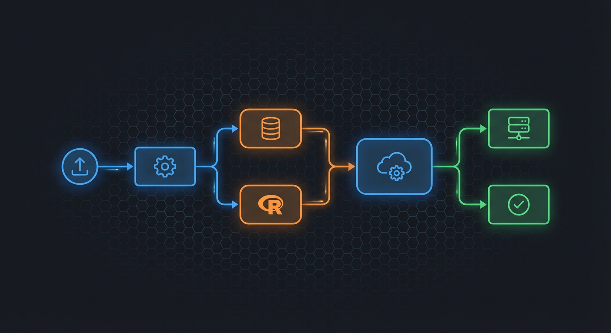
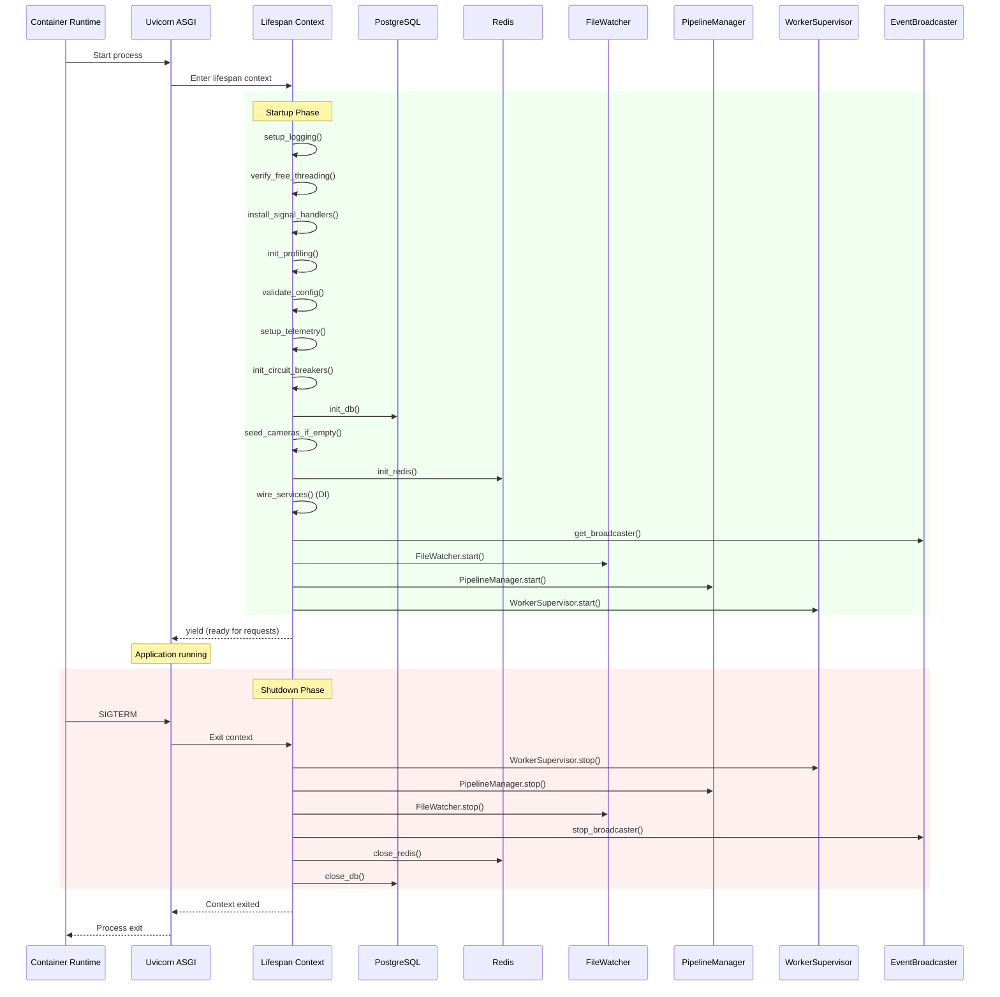
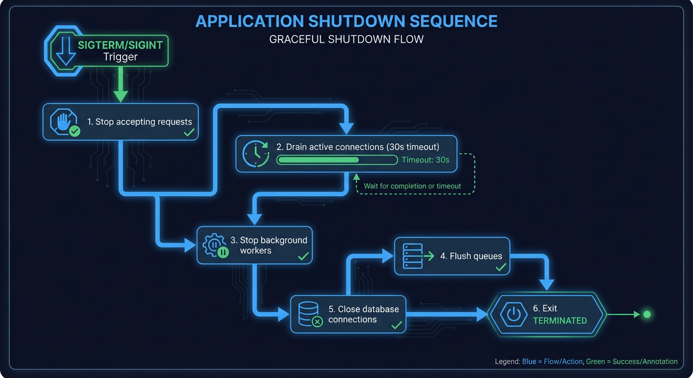

# Startup and Shutdown Flow

This document describes the application lifecycle, including startup initialization sequence, signal handling, and graceful shutdown procedures.



## Application Lifecycle Overview

**Source:** `backend/main.py:461-479`

```python
# backend/main.py:461-479
@asynccontextmanager
async def lifespan(_app: FastAPI) -> AsyncGenerator[None]:
    """Manage application lifecycle - startup and shutdown events.

    This lifespan context manager handles:
    1. Startup: Initialize all services (database, Redis, workers, etc.)
    2. Signal handling: Install SIGTERM/SIGINT handlers for graceful shutdown
    3. Shutdown: Stop all services in proper order, clean up resources

    Signal Handling:
        SIGTERM and SIGINT handlers are installed during startup. When a signal
        is received, the handler logs the event and sets a shutdown event.
        Uvicorn will then trigger the lifespan shutdown sequence.

    Container Orchestration:
        - Docker/Podman: SIGTERM sent on `docker stop` (30s default grace period)
        - Kubernetes: SIGTERM sent on pod termination (30s default grace period)
        - The application should complete shutdown within the grace period
    """
```

## Startup Sequence Diagram



## Startup Initialization Order

**Source:** `backend/main.py:480-649`

### Phase 1: Logging and Verification

```python
# backend/main.py:482-495
# Initialize logging first (before any other initialization)
setup_logging()
lifespan_logger = get_logger(__name__)

# Verify free-threaded Python is active (Python 3.14t with PYTHON_GIL=0)
try:
    verify_free_threading()
    lifespan_logger.info(f"Python runtime: {get_threading_mode()}")
except RuntimeError as e:
    lifespan_logger.warning(f"Free-threading verification: {e}")
```

### Phase 2: Signal Handlers

**Source:** `backend/main.py:141-193`

```python
# backend/main.py:141-193
def install_signal_handlers() -> None:
    """Install signal handlers for graceful shutdown.

    Registers handlers for SIGTERM and SIGINT that:
    1. Log the received signal
    2. Set the shutdown event for coordination
    """
    loop = asyncio.get_running_loop()
    shutdown_event = get_shutdown_event()

    def create_signal_handler(sig: signal.Signals) -> None:
        def handler() -> None:
            logger.info(
                f"Received {sig.name}, initiating graceful shutdown...",
                extra={"signal": sig.name, "signal_number": sig.value},
            )
            shutdown_event.set()

        loop.add_signal_handler(sig, handler)

    create_signal_handler(signal.SIGTERM)
    create_signal_handler(signal.SIGINT)
```

### Phase 3: Configuration and Telemetry

```python
# backend/main.py:505-527
# Validate configuration and log summary (NEM-2026)
config_result = validate_config(settings)
log_config_summary(config_result)

# Initialize OpenTelemetry tracing (NEM-1629)
otel_initialized = setup_telemetry(_app, settings)

# Initialize Pyroscope continuous profiling (NEM-3103)
init_profiling()
```

### Phase 4: Circuit Breakers

**Source:** `backend/main.py:248-297`

```python
# backend/main.py:248-297
def init_circuit_breakers() -> list[str]:
    """Pre-register circuit breakers for known external services.

    Pre-registered circuit breakers:
    - rtdetr: RT-DETRv2 object detection service
    - nemotron: Nemotron LLM risk analysis service
    - postgresql: Database connection pool
    - redis: Redis cache and queue service
    """
    # AI services - more aggressive (quick failure detection)
    ai_service_config = CircuitBreakerConfig(
        failure_threshold=5,
        recovery_timeout=30.0,
        half_open_max_calls=3,
        success_threshold=2,
    )

    # Infrastructure services - more tolerant
    infrastructure_config = CircuitBreakerConfig(
        failure_threshold=10,
        recovery_timeout=60.0,
        half_open_max_calls=5,
        success_threshold=3,
    )
```

### Phase 5: Database Initialization

```python
# backend/main.py:533-543
await init_db()
lifespan_logger.info(f"Database initialized: {redact_url(settings.database_url)}")

# Re-enable database logging now that tables exist (NEM-2442)
enable_deferred_db_logging()

# Auto-seed cameras from filesystem if database is empty
seeded = await seed_cameras_if_empty()
```

### Phase 6: Redis and Service Wiring

```python
# backend/main.py:560-568
redis_client = await init_redis()
lifespan_logger.info(f"Redis initialized: {redact_url(settings.redis_url)}")

# Wire up DI container with all application services (NEM-2003)
container = get_container()
await wire_services(container)
```

### Phase 7: Event Broadcaster

```python
# backend/main.py:570-575
# Initialize and start event broadcaster for WebSocket real-time events
event_broadcaster = await get_broadcaster(redis_client)
channel = event_broadcaster.channel_name
lifespan_logger.info(f"Event broadcaster started, listening on channel: {channel}")
```

### Phase 8: File Watcher

```python
# backend/main.py:577-584
# Initialize file watcher (monitors camera directories for new images)
file_watcher = FileWatcher(
    redis_client=redis_client,
    camera_creator=create_camera_callback,
)
await file_watcher.start()
lifespan_logger.info(f"File watcher started: {settings.foscam_base_path}")
```

### Phase 9: Pipeline Workers

```python
# backend/main.py:586-591
# Initialize pipeline workers (detection queue, analysis queue, batch timeout)
pipeline_manager = await get_pipeline_manager(redis_client)
await pipeline_manager.start()
lifespan_logger.info(
    "Pipeline workers started (detection, analysis, batch timeout, metrics)"
)
```

### Phase 10: Worker Supervisor

```python
# backend/main.py:593-645
# Initialize WorkerSupervisor for automatic crash recovery (NEM-2460)
supervisor_config = SupervisorConfig(
    check_interval=settings.worker_supervisor_check_interval,
    default_max_restarts=settings.worker_supervisor_max_restarts,
)
worker_supervisor = get_worker_supervisor(
    config=supervisor_config,
    broadcaster=event_broadcaster,
    on_restart=on_worker_restart,
    on_failure=on_worker_failure,
)

# Register workers with the supervisor
await worker_supervisor.register_worker("detection", ...)
await worker_supervisor.register_worker("analysis", ...)
await worker_supervisor.register_worker("batch_timeout", ...)
await worker_supervisor.register_worker("metrics", ...)

await worker_supervisor.start()
```

## Startup Timeline

| Phase | Duration  | Components                      |
| ----- | --------- | ------------------------------- |
| 1     | <100ms    | Logging, verification           |
| 2     | <10ms     | Signal handlers                 |
| 3     | 100-500ms | Config validation, telemetry    |
| 4     | <50ms     | Circuit breakers                |
| 5     | 500ms-2s  | Database connection, migrations |
| 6     | 100-500ms | Redis connection, DI wiring     |
| 7     | 50-200ms  | Event broadcaster               |
| 8     | 100-500ms | File watcher                    |
| 9     | 100-300ms | Pipeline workers                |
| 10    | 50-200ms  | Worker supervisor               |

**Total startup time:** 1-5 seconds typical

## Signal Handling

### Supported Signals

| Signal  | Source                     | Behavior          |
| ------- | -------------------------- | ----------------- |
| SIGTERM | Container stop, Kubernetes | Graceful shutdown |
| SIGINT  | Ctrl+C, IDE stop           | Graceful shutdown |

### Shutdown Event

**Source:** `backend/main.py:124-138`

```python
# backend/main.py:124-138
def get_shutdown_event() -> asyncio.Event:
    """Get the global shutdown event, creating it if necessary.

    The shutdown event is used to coordinate graceful shutdown between
    signal handlers and the FastAPI lifespan context. When a signal is
    received, the event is set, allowing async code to detect the shutdown
    request and clean up appropriately.
    """
    global _shutdown_event
    if _shutdown_event is None:
        _shutdown_event = asyncio.Event()
    return _shutdown_event
```

## Shutdown Sequence



### Graceful Shutdown Order

```
1. Signal received (SIGTERM/SIGINT)
2. Shutdown event set
3. Stop accepting new requests
4. Stop worker supervisor
5. Stop pipeline workers (drain queues)
6. Stop file watcher
7. Stop event broadcaster
8. Close Redis connection
9. Close database connection
10. Exit process
```

### Worker Shutdown

```python
# Pipeline workers stop sequence
1. Stop accepting new queue items
2. Complete in-progress work (with timeout)
3. Flush metrics
4. Close connections
```

### Queue Draining

```python
# Drain remaining queue items before shutdown
await drain_queues(timeout=30)  # 30 second timeout
```

## Container Grace Periods

| Platform   | Default Grace | Configurable                    |
| ---------- | ------------- | ------------------------------- |
| Docker     | 30s           | `docker stop -t N`              |
| Podman     | 30s           | `podman stop -t N`              |
| Kubernetes | 30s           | `terminationGracePeriodSeconds` |

### Recommended Configuration

```yaml
# Kubernetes pod spec
spec:
  terminationGracePeriodSeconds: 60 # Allow 60s for graceful shutdown
  containers:
    - name: backend
      lifecycle:
        preStop:
          exec:
            command: ['/bin/sh', '-c', 'sleep 5'] # Allow load balancer drain
```

## Startup Health Checks

### Readiness Probe

```python
# /health/ready endpoint
async def readiness_check():
    """Check if application is ready to serve traffic."""
    # Check database connection
    # Check Redis connection
    # Check AI services available
    return {"status": "ready"}
```

### Liveness Probe

```python
# /health/live endpoint
async def liveness_check():
    """Check if application is alive."""
    return {"status": "alive"}
```

## Error Handling During Startup

**Source:** `backend/main.py:647-649`

```python
# backend/main.py:647-649
except Exception as e:
    lifespan_logger.error(f"Redis connection failed: {e}")
    lifespan_logger.warning("Continuing without Redis - some features may be unavailable")
```

### Startup Failure Scenarios

| Component    | Failure Behavior      | Impact                      |
| ------------ | --------------------- | --------------------------- |
| Database     | Exit with error       | Fatal - cannot start        |
| Redis        | Continue with warning | No real-time features       |
| File watcher | Continue with warning | No new image processing     |
| AI services  | Continue              | Circuit breaker will handle |

## Shutdown Monitoring

### Metrics

- `hsi_shutdown_initiated_timestamp` - When shutdown started
- `hsi_shutdown_duration_seconds` - Total shutdown time
- `hsi_workers_drained_total` - Workers successfully drained

### Logging

```python
# Shutdown logging
logger.info("Received SIGTERM, initiating graceful shutdown...")
logger.info("Stopping worker supervisor...")
logger.info("Stopping pipeline workers...")
logger.info("Draining queues...")
logger.info("Shutdown complete")
```

## Startup Sequence Diagram (Detailed)

```
┌─────────────────────────────────────────────────────────────────────┐
│                        Startup Sequence                              │
├─────────────────────────────────────────────────────────────────────┤
│                                                                      │
│  T+0ms    setup_logging()                                           │
│           ├── Configure log handlers                                │
│           └── Set log levels                                        │
│                                                                      │
│  T+50ms   verify_free_threading()                                   │
│           └── Check PYTHON_GIL=0                                    │
│                                                                      │
│  T+60ms   install_signal_handlers()                                 │
│           ├── Register SIGTERM handler                              │
│           └── Register SIGINT handler                               │
│                                                                      │
│  T+70ms   init_profiling()                                          │
│           └── Start Pyroscope agent                                 │
│                                                                      │
│  T+100ms  validate_config()                                         │
│           └── Check required settings                               │
│                                                                      │
│  T+200ms  setup_telemetry()                                         │
│           └── Initialize OpenTelemetry                              │
│                                                                      │
│  T+250ms  init_circuit_breakers()                                   │
│           ├── Create rtdetr breaker                                 │
│           ├── Create nemotron breaker                               │
│           ├── Create postgresql breaker                             │
│           └── Create redis breaker                                  │
│                                                                      │
│  T+300ms  init_db()                                                 │
│           ├── Create connection pool                                │
│           └── Run migrations                                        │
│                                                                      │
│  T+1000ms seed_cameras_if_empty()                                   │
│           └── Auto-discover cameras from filesystem                 │
│                                                                      │
│  T+1200ms init_redis()                                              │
│           └── Create connection pool                                │
│                                                                      │
│  T+1400ms wire_services()                                           │
│           └── Initialize DI container                               │
│                                                                      │
│  T+1500ms get_broadcaster()                                         │
│           ├── Create EventBroadcaster                               │
│           └── Subscribe to Redis pub/sub                            │
│                                                                      │
│  T+1700ms FileWatcher.start()                                       │
│           ├── Initialize watchdog observer                          │
│           └── Start monitoring directories                          │
│                                                                      │
│  T+2000ms PipelineManager.start()                                   │
│           ├── Start detection worker                                │
│           ├── Start analysis worker                                 │
│           ├── Start batch timeout worker                            │
│           └── Start metrics worker                                  │
│                                                                      │
│  T+2200ms WorkerSupervisor.start()                                  │
│           └── Begin monitoring workers                              │
│                                                                      │
│  T+2300ms Application ready for requests                            │
│                                                                      │
└─────────────────────────────────────────────────────────────────────┘
```

## Related Documents

- [error-recovery-flow.md](error-recovery-flow.md) - Circuit breaker initialization
- [image-to-event.md](image-to-event.md) - Worker initialization context
- [websocket-message-flow.md](websocket-message-flow.md) - Broadcaster initialization
