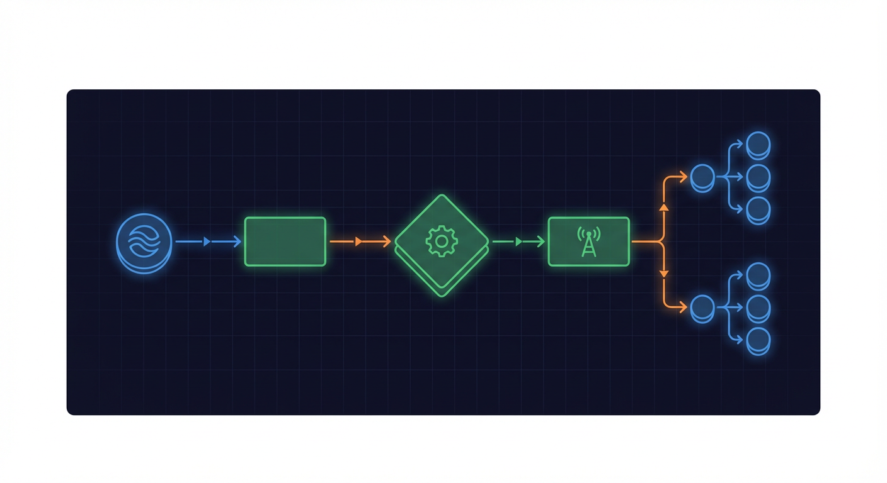
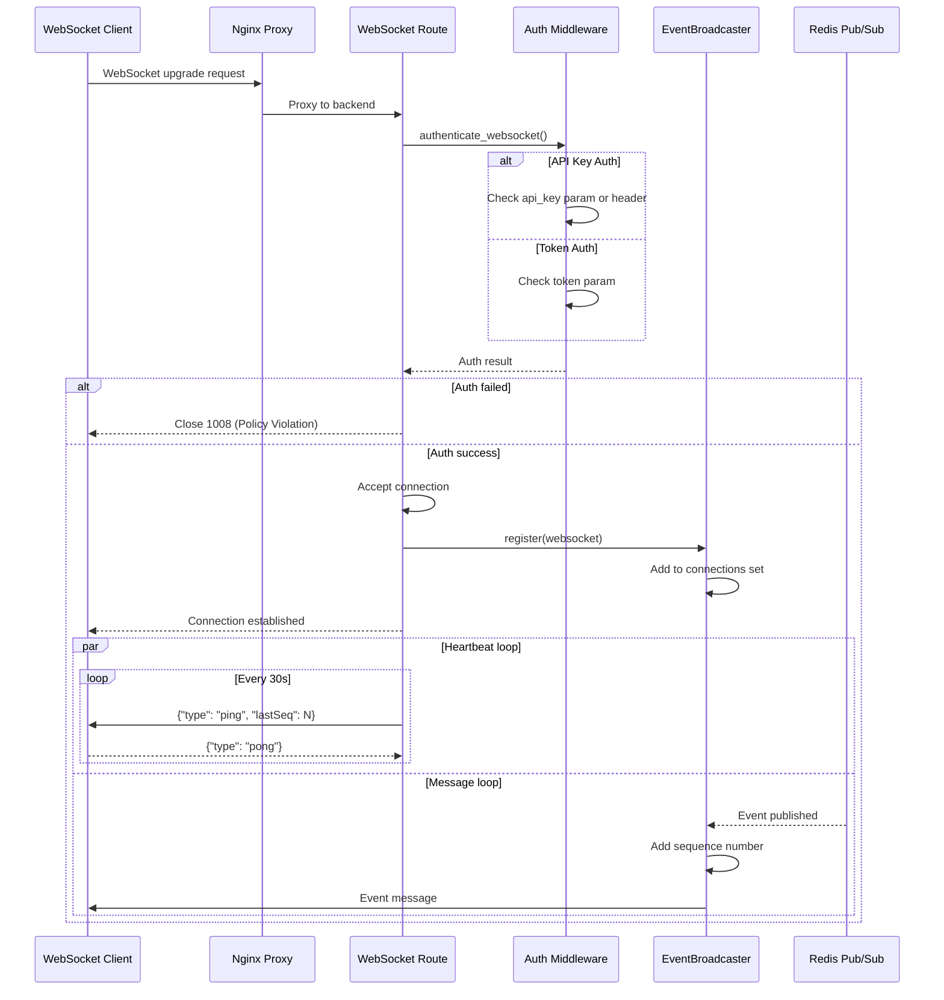
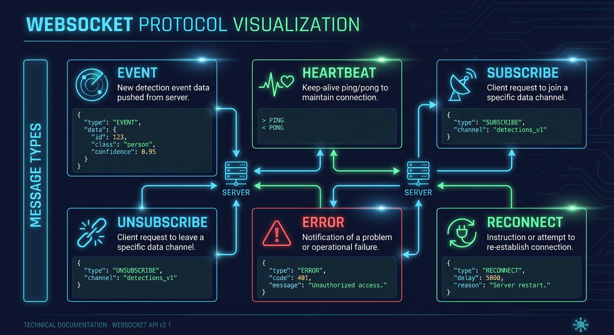
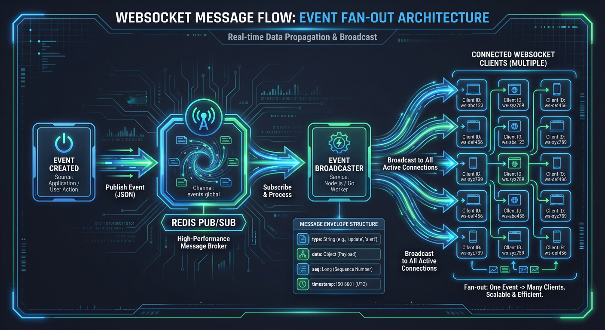

# WebSocket Message Flow

This document describes the complete WebSocket message flow from connection establishment through event delivery, including authentication, subscription management, heartbeat, and message sequencing.



## Connection Sequence Diagram



## Authentication

**Source:** `backend/api/routes/websocket.py:1-39` (module docstring)

### Authentication Methods

```python
# backend/api/routes/websocket.py:1-39
# WebSocket Authentication:
#     When API key authentication is enabled (api_key_enabled=true in settings),
#     WebSocket connections must provide a valid API key via one of:
#     1. Query parameter: ws://host/ws/events?api_key=YOUR_KEY
#     2. Sec-WebSocket-Protocol header: "api-key.YOUR_KEY"
#
#     Connections without a valid API key will be rejected with code 1008
#     (Policy Violation).
```

| Method          | Format         | Example                                  |
| --------------- | -------------- | ---------------------------------------- |
| Query parameter | `?api_key=KEY` | `ws://host/ws/events?api_key=abc123`     |
| Protocol header | `api-key.KEY`  | `Sec-WebSocket-Protocol: api-key.abc123` |
| Token parameter | `?token=TOKEN` | `ws://host/ws/events?token=xyz789`       |

### Rate Limiting

```python
# Before accepting connection
if not await check_websocket_rate_limit(websocket, redis):
    logger.warning("WebSocket connection rejected: rate limit exceeded")
    await websocket.close(code=1008)  # Policy Violation
    return
```

## Message Validation

**Source:** `backend/api/routes/websocket.py:79-133`

### Validation Flow

```python
# backend/api/routes/websocket.py:79-133
async def validate_websocket_message(
    websocket: WebSocket, raw_data: str
) -> WebSocketMessage | None:
    """Validate an incoming WebSocket message.

    Uses Pydantic's model_validate_json() for single-pass JSON parsing and
    validation, powered by jiter for 10-30% better performance compared to
    the two-step json.loads() + model_validate() approach.
    """
    # Use single-pass JSON parsing + validation with jiter (NEM-3396)
    try:
        message = WebSocketMessage.model_validate_json(raw_data)
        return message
    except ValidationError as e:
        # Check if any error is a JSON parsing error
        errors = e.errors()
        is_json_error = any(
            err.get("type") in ("json_invalid", "value_error.jsondecode") for err in errors
        )

        if is_json_error:
            error_response = WebSocketErrorResponse(
                error=WebSocketErrorCode.INVALID_JSON,
                message="Message must be valid JSON",
                details={"raw_data_preview": raw_data[:100] if raw_data else None},
            )
        else:
            error_response = WebSocketErrorResponse(
                error=WebSocketErrorCode.INVALID_MESSAGE_FORMAT,
                message="Message does not match expected schema",
                details={"validation_errors": errors},
            )

        await websocket.send_text(error_response.model_dump_json())
        return None
```

### Error Codes

| Code                     | Description                 |
| ------------------------ | --------------------------- |
| `INVALID_JSON`           | Message is not valid JSON   |
| `INVALID_MESSAGE_FORMAT` | JSON does not match schema  |
| `UNKNOWN_MESSAGE_TYPE`   | Message type not recognized |
| `VALIDATION_ERROR`       | Data validation failed      |

## Message Types



**Source:** `backend/api/routes/websocket.py:136-243`

### Client-to-Server Messages

```python
# backend/api/routes/websocket.py:136-243
match message_type:
    case WebSocketMessageType.PING.value:
        # Client keepalive - respond with pong

    case WebSocketMessageType.SUBSCRIBE.value:
        # Subscribe to event patterns

    case WebSocketMessageType.UNSUBSCRIBE.value:
        # Unsubscribe from patterns

    case WebSocketMessageType.PONG.value:
        # Response to server ping

    case WebSocketMessageType.RESYNC.value:
        # Request missed messages
```

### Ping/Pong

```json
// Client -> Server
{"type": "ping"}

// Server -> Client
{"type": "pong"}
```

### Subscribe

**Source:** `backend/api/routes/websocket.py:20-28`

```python
# backend/api/routes/websocket.py:20-28
# WebSocket Event Filtering (NEM-2383):
#     Clients can subscribe to specific event patterns to reduce bandwidth:
#     - Send: {"action": "subscribe", "events": ["alert.*", "camera.status_changed"]}
#     - Receive: {"action": "subscribed", "events": ["alert.*", "camera.status_changed"]}
#
#     Pattern syntax:
#     - "*" - All events (default if no subscription sent)
#     - "alert.*" - All alert events
#     - "camera.status_changed" - Exact match
```

```json
// Client -> Server
{"type": "subscribe", "data": {"events": ["alert.*", "camera.status_changed"]}}

// Server -> Client
{"action": "subscribed", "events": ["alert.*", "camera.status_changed"]}
```

### Resync

```json
// Client -> Server (gap detected)
{"type": "resync", "data": {"channel": "events", "last_sequence": 42}}

// Server -> Client
{"type": "resync_ack", "channel": "events", "last_sequence": 42}
```

## Server-to-Client Messages

### Event Message

```json
{
  "type": "event",
  "sequence": 42,
  "requires_ack": true,
  "data": {
    "id": 1,
    "event_id": 1,
    "batch_id": "batch_abc123",
    "camera_id": "front_door",
    "risk_score": 85,
    "risk_level": "critical",
    "summary": "Person detected at front door",
    "reasoning": "Unknown individual approaching entrance",
    "started_at": "2025-12-23T12:00:00Z"
  }
}
```

### Camera Status

```json
{
  "type": "camera.status_changed",
  "sequence": 43,
  "data": {
    "camera_id": "front_door",
    "status": "online",
    "last_seen_at": "2025-12-23T12:00:00Z"
  }
}
```

### Service Status

```json
{
  "type": "service.status",
  "sequence": 44,
  "data": {
    "service": "yolo26",
    "status": "healthy",
    "latency_ms": 245
  }
}
```

## Heartbeat

**Source:** `backend/api/routes/websocket.py:280-323`

### Server-Initiated Heartbeat

```python
# backend/api/routes/websocket.py:280-323
async def send_heartbeat(
    websocket: WebSocket,
    interval: int,
    stop_event: asyncio.Event,
    connection_id: str = "",
) -> None:
    """Send periodic heartbeat pings to keep the WebSocket connection alive.

    This server-initiated heartbeat helps detect disconnected clients and
    keeps connections alive through proxies/load balancers that may have
    idle timeouts.

    Heartbeat messages include the current sequence number (lastSeq) to allow
    clients to detect message gaps even during idle periods.
    """
    sequence_tracker = get_sequence_tracker()

    while not stop_event.is_set():
        await asyncio.sleep(interval)
        if websocket.client_state == WebSocketState.CONNECTED:
            last_seq = sequence_tracker.get_current_sequence(connection_id)
            heartbeat_msg = {"type": "ping", "lastSeq": last_seq}
            await websocket.send_text(json.dumps(heartbeat_msg))
```

### Timing Parameters

| Parameter          | Default | Source                                    |
| ------------------ | ------- | ----------------------------------------- |
| Heartbeat interval | 30s     | `websocket_ping_interval_seconds` setting |
| Idle timeout       | 300s    | `websocket_idle_timeout_seconds` setting  |

## Message Sequencing

**Source:** `backend/api/routes/websocket.py:246-277`

### Sequence Tracking

```python
# backend/api/routes/websocket.py:246-277
async def send_sequenced_message(
    websocket: WebSocket,
    connection_id: str,
    message: dict[str, Any],
) -> bool:
    """Send a message with a sequence number to a WebSocket client.

    Adds a 'seq' field to the message with the next sequence number for this
    connection. This enables clients to detect missed messages.
    """
    sequence_tracker = get_sequence_tracker()
    seq = sequence_tracker.next_sequence(connection_id)
    message["seq"] = seq

    try:
        await websocket.send_text(json.dumps(message))
        return True
    except Exception as e:
        logger.debug(f"Failed to send sequenced message: {e}")
        return False
```

### Gap Detection

Clients can detect missed messages by tracking sequence numbers:

```javascript
// Client-side gap detection
let lastSeq = 0;

ws.onmessage = (event) => {
  const msg = JSON.parse(event.data);

  if (msg.seq !== undefined) {
    if (msg.seq > lastSeq + 1) {
      // Gap detected - request resync
      ws.send(
        JSON.stringify({
          type: 'resync',
          data: { channel: 'events', last_sequence: lastSeq },
        })
      );
    }
    lastSeq = msg.seq;
  }
};
```

## Event Broadcasting



**Source:** `backend/services/event_broadcaster.py:345-400`

### EventBroadcaster Class

```python
# backend/services/event_broadcaster.py:345-372
class EventBroadcaster:
    """Manages WebSocket connections and broadcasts events via Redis pub/sub.

    This class acts as a bridge between Redis pub/sub events and WebSocket
    connections, allowing multiple backend instances to share event notifications.

    Includes a supervision task that monitors listener health and automatically
    restarts dead listeners to ensure reliability.

    Message Delivery Guarantees (NEM-1688):
    - All messages include monotonically increasing sequence numbers
    - Last MESSAGE_BUFFER_SIZE messages are buffered for replay
    - High-priority messages (risk_score >= 80 or critical) require acknowledgment
    - Per-client ACK tracking for delivery confirmation
    """

    MAX_RECOVERY_ATTEMPTS = 5
    SUPERVISION_INTERVAL = 30.0
    MESSAGE_BUFFER_SIZE = MESSAGE_BUFFER_SIZE  # 100
```

### Message Buffer

```python
# backend/services/event_broadcaster.py:493-513
def _add_sequence_and_buffer(self, message: dict[str, Any]) -> dict[str, Any]:
    """Add sequence number and buffer the message for replay.

    Creates a copy of the message with sequence and requires_ack fields,
    then adds it to the message buffer.
    """
    # Create a copy to avoid modifying the original
    sequenced = dict(message)
    sequenced["sequence"] = self._next_sequence()
    sequenced["requires_ack"] = requires_ack(message)

    # Add to buffer
    self._message_buffer.append(sequenced)

    return sequenced
```

## Broadcast Retry

**Source:** `backend/services/event_broadcaster.py:155-254`

### Retry Logic

```python
# backend/services/event_broadcaster.py:155-192
async def broadcast_with_retry[T](
    broadcast_func: Callable[[], Awaitable[T]],
    message_type: str,
    *,
    max_retries: int = DEFAULT_MAX_RETRIES,    # 3
    base_delay: float = DEFAULT_BASE_DELAY,     # 1.0s
    max_delay: float = DEFAULT_MAX_DELAY,       # 30.0s
    metrics: BroadcastRetryMetrics | None = None,
) -> T:
    """Execute a broadcast function with retry logic and exponential backoff.

    This function wraps any broadcast operation with retry logic that:
    - Uses exponential backoff (1s, 2s, 4s, etc.) with jitter
    - Logs each retry attempt with context
    - Records metrics for monitoring
    - Raises the final exception if all retries are exhausted
    """
```

### Backoff Calculation

```python
# backend/services/event_broadcaster.py:215-219
# Calculate exponential backoff with jitter
delay = min(base_delay * (2**attempt), max_delay)
jitter = delay * random.uniform(0.1, 0.3)
total_delay = delay + jitter
```

| Attempt | Base Delay  | Max Delay |
| ------- | ----------- | --------- |
| 1       | 1s + jitter | 30s       |
| 2       | 2s + jitter | 30s       |
| 3       | 4s + jitter | 30s       |

## Connection Lifecycle

### Full Endpoint Handler

**Source:** `backend/api/routes/websocket.py:326-543`

```python
# backend/api/routes/websocket.py:326-412 (excerpt)
@router.websocket("/ws/events")
async def websocket_events_endpoint(
    websocket: WebSocket,
    redis: RedisClient = Depends(get_redis),
    _token_valid: bool = Depends(validate_websocket_token),
) -> None:
    """WebSocket endpoint for streaming security events in real-time."""

    # Check rate limit before accepting connection
    if not await check_websocket_rate_limit(websocket, redis):
        await websocket.close(code=1008)
        return

    # Authenticate WebSocket connection before accepting
    if not await authenticate_websocket(websocket):
        return

    broadcaster = await get_broadcaster(redis)
    settings = get_settings()
    idle_timeout = settings.websocket_idle_timeout_seconds
    heartbeat_interval = settings.websocket_ping_interval_seconds

    # Generate unique connection ID
    connection_id = f"ws-events-{uuid.uuid4().hex[:8]}"
    set_connection_id(connection_id)
```

## Error Handling

### Close Codes

| Code | Name             | Description                |
| ---- | ---------------- | -------------------------- |
| 1000 | Normal           | Clean disconnect           |
| 1008 | Policy Violation | Auth failure or rate limit |
| 1011 | Internal Error   | Server error               |
| 1012 | Service Restart  | Server restarting          |

### Error Response Format

```json
{
  "error": "INVALID_JSON",
  "message": "Message must be valid JSON",
  "details": {
    "raw_data_preview": "not valid json..."
  }
}
```

## Complete Message Flow Diagram

```mermaid
sequenceDiagram
    participant Client as WebSocket Client
    participant Backend as Backend Server
    participant Redis as Redis Pub/Sub

    rect rgb(30, 58, 95)
        Note over Client,Backend: Connection Phase
        Client->>Backend: Upgrade Request
        Backend->>Backend: Auth Check
        Backend-->>Client: Connection OK
    end

    rect rgb(45, 74, 62)
        Note over Client,Backend: Heartbeat
        Backend->>Client: Heartbeat Ping
        Client-->>Backend: Pong
    end

    rect rgb(30, 58, 95)
        Note over Client,Backend: Subscription
        Client->>Backend: Subscribe
        Backend-->>Client: Subscribed
    end

    rect rgb(74, 58, 45)
        Note over Client,Redis: Event Delivery
        Redis-->>Backend: Event Published
        Backend->>Backend: Add seq, buffer
        Backend-->>Client: Event (seq=1)
        Backend-->>Client: Event (seq=2)
    end

    rect rgb(45, 74, 62)
        Note over Client,Backend: Gap Recovery
        Note right of Client: Gap detected
        Client->>Backend: Resync
        Backend-->>Client: Resync ACK
        Backend-->>Client: Buffered Messages
    end

    rect rgb(30, 58, 95)
        Note over Client,Backend: Disconnect
        Client->>Backend: Close
        Backend-->>Client: Close ACK
    end
```



## Related Documents

- [event-lifecycle.md](event-lifecycle.md) - Event broadcasting details
- [error-recovery-flow.md](error-recovery-flow.md) - Retry and recovery patterns
- [api-request-flow.md](api-request-flow.md) - REST API comparison
