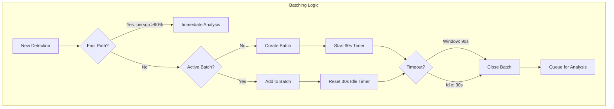
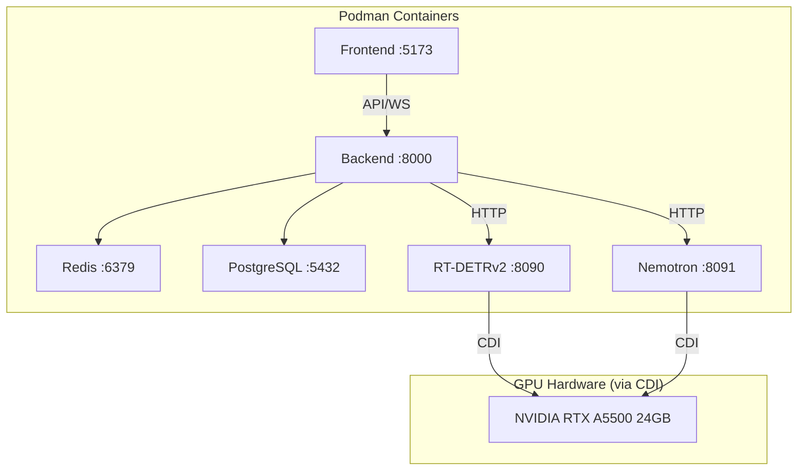
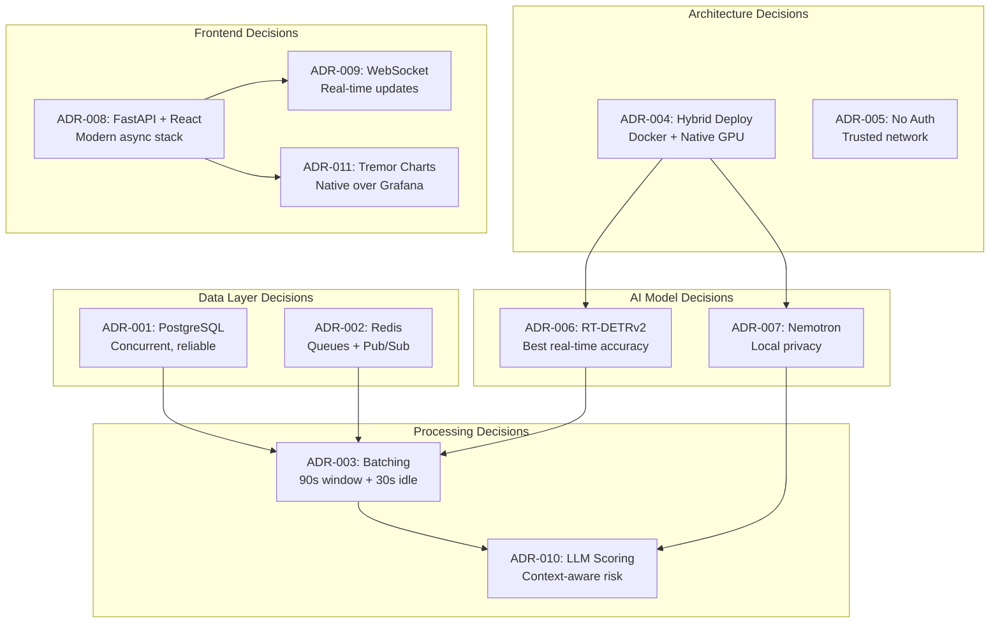

# Architecture Decision Records (ADRs)

This document captures the key architectural decisions made during the development of the Home Security Intelligence system. Each decision follows the ADR format: Context, Decision, Alternatives Considered, and Consequences.

---

## Table of Contents

1. [ADR-001: PostgreSQL for Database](#adr-001-postgresql-for-database)
2. [ADR-002: Redis for Queues and Pub/Sub](#adr-002-redis-for-queues-and-pubsub)
3. [ADR-003: Detection Batching Strategy](#adr-003-detection-batching-strategy)
4. [ADR-004: Hybrid Deployment Architecture](#adr-004-hybrid-deployment-architecture)
5. [ADR-005: No Authentication](#adr-005-no-authentication)
6. [ADR-006: RT-DETRv2 for Object Detection](#adr-006-rt-detrv2-for-object-detection)
7. [ADR-007: Nemotron for Risk Analysis](#adr-007-nemotron-for-risk-analysis)
8. [ADR-008: FastAPI + React Stack](#adr-008-fastapi--react-stack)
9. [ADR-009: WebSocket for Real-time Updates](#adr-009-websocket-for-real-time-updates)
10. [ADR-010: LLM-Determined Risk Scoring](#adr-010-llm-determined-risk-scoring)
11. [ADR-011: Native Tremor Charts over Grafana Embeds](#adr-011-native-tremor-charts-over-grafana-embeds)

---

## ADR-001: PostgreSQL for Database

**Status:** Accepted (Revised)
**Date:** 2024-12-21 (Updated: 2024-12-28)

### Context

We needed a database for storing security events, detections, camera configurations, and GPU statistics. The system is designed for single-user, local deployment on a home network with moderate data volume (30-day retention, ~5-8 cameras).

The system requires a database for storing security events, detections, camera configurations, and GPU statistics. Testing revealed that PostgreSQL was essential for handling the AI pipeline's parallel workers with concurrent writes.

### Decision

Use **PostgreSQL** with `asyncpg` async driver.

### Alternatives Considered

| Alternative        | Pros                                                                                | Cons                                                                       |
| ------------------ | ----------------------------------------------------------------------------------- | -------------------------------------------------------------------------- |
| **PostgreSQL**     | Battle-tested, concurrent writes, full-text search, JSONB, handles parallel workers | Requires separate process, slightly more complex deployment                |
| **SQLite**         | Zero setup, embedded, file-based backup                                             | Single-writer limitation causes bottlenecks with multiple pipeline workers |
| **MongoDB**        | Flexible schema, good for event-like data                                           | Additional complexity, overkill for structured data                        |
| **In-memory only** | Fastest, simplest                                                                   | No persistence, data loss on restart                                       |

### Why PostgreSQL Won

1. **Concurrency:** Multiple pipeline workers (FileWatcher, BatchAggregator, CleanupService) need concurrent writes without blocking
2. **Production-ready:** Proven for concurrent workloads, no need for WAL mode tuning or busy timeouts
3. **Testing reliability:** SQLite's concurrency issues cause test flakiness and race conditions
4. **Future-proofing:** Easy migration path if scaling beyond single-node
5. **Modern features:** JSONB for flexible data, full-text search, better indexing

### Consequences

**Positive:**

- True concurrent read/write access without locking issues
- No write contention between pipeline workers
- Reliable test suite without flaky database locks
- Better tooling (pgAdmin, DBeaver, psql CLI)
- More robust transaction handling

**Negative:**

- Requires PostgreSQL service (but already using Docker Compose)
- Requires separate database process (handled by Docker Compose)
- Database must be created before first run

**Mitigations:**

- Docker Compose handles PostgreSQL automatically
- Database initialization happens on first app startup
- Connection pooling handles multiple workers efficiently

---

## ADR-002: Redis for Queues and Pub/Sub

**Status:** Accepted
**Date:** 2024-12-21

### Context

The AI processing pipeline requires:

1. A queue for passing image paths from File Watcher to RT-DETRv2 detector
2. A queue for passing detection batches to Nemotron analyzer
3. Pub/Sub for real-time event broadcasting to WebSocket clients
4. Temporary storage for batch aggregation state

### Decision

Use **Redis** as a multi-purpose infrastructure component for queues, pub/sub, and temporary state - not just caching.

### Alternatives Considered

| Alternative           | Pros                                                  | Cons                                                 |
| --------------------- | ----------------------------------------------------- | ---------------------------------------------------- |
| **RabbitMQ**          | Purpose-built message broker, advanced routing        | Additional service, overkill for simple queues       |
| **Redis**             | Multi-purpose (queue + pub/sub + cache), simple, fast | In-memory by default, less durable than RabbitMQ     |
| **Kafka**             | High throughput, persistent, replay                   | Massive overkill, complex setup                      |
| **In-process queues** | No external dependency                                | Lost on restart, no persistence, single-process only |

### Consequences

**Positive:**

- Single service handles multiple concerns (queues, pub/sub, batch state)
- Sub-millisecond operations for queue operations
- Built-in TTL for automatic key expiration (orphan cleanup)
- Connection pooling with health checks for reliability
- Simple LIST operations (`RPUSH`, `BLPOP`) for queue semantics

**Negative:**

- In-memory by default - queue contents lost on Redis restart
- Another service to deploy and monitor
- Must handle connection failures with retry logic

**Implementation Details:**

```python
# Queue operations with automatic JSON serialization
await redis.add_to_queue("detection_queue", {"image_path": path, "camera_id": camera})
item = await redis.get_from_queue("detection_queue", timeout=5)

# Pub/Sub for real-time updates
await redis.publish("events", {"type": "new_event", "data": event})

# Batch state with TTL for orphan cleanup
await redis.set(f"batch:{batch_id}:detections", detections, expire=3600)
```

---

## ADR-003: Detection Batching Strategy

**Status:** Accepted
**Date:** 2024-12-21

### Context

A single "person walks to door" event might generate 15+ camera images over 30 seconds. Processing each image independently through the LLM would:

- Waste GPU resources on repetitive analysis
- Generate 15 separate "person detected" alerts instead of one meaningful event
- Miss the contextual story (approached, paused, left)

### Decision

Batch detections into **90-second time windows** with **30-second idle timeout**, then analyze the batch as a single event.

### Alternatives Considered

| Alternative                 | Pros                           | Cons                                          |
| --------------------------- | ------------------------------ | --------------------------------------------- |
| **Immediate per-image**     | Fastest alerts, simplest logic | Noisy, expensive, no context                  |
| **Fixed 60-second windows** | Predictable timing             | May split natural events, delays short events |
| **90s window + 30s idle**   | Balances context and latency   | More complex state management                 |
| **Event-driven clustering** | Most intelligent grouping      | Complex ML, harder to implement               |

### Consequences

**Positive:**

- Natural grouping - a single "person approaches door" becomes one event
- LLM can reason about sequences ("person approached, paused, left")
- Reduces LLM calls by ~90% compared to per-image processing
- Configurable via `BATCH_WINDOW_SECONDS` and `BATCH_IDLE_TIMEOUT_SECONDS`

**Negative:**

- Maximum 90-second delay for alerts (worst case)
- Idle timeout adds complexity to batch management
- Redis keys must have TTL for orphan cleanup if service crashes

**Fast Path Exception:**
High-confidence critical detections (person >90%) bypass batching for immediate alerts:

```python
if confidence >= 0.90 and object_type == "person":
    await analyzer.analyze_detection_fast_path(camera_id, detection_id)
```



---

## ADR-004: Fully Containerized Deployment with GPU Passthrough

**Status:** Accepted (Updated 2024-12-30)
**Date:** 2024-12-21 (Updated 2024-12-30)

### Context

The system requires:

- Backend API service (FastAPI)
- Frontend application (React)
- PostgreSQL database
- Redis for queues/pub/sub
- RT-DETRv2 object detection (~4GB VRAM)
- Nemotron Mini 4B risk analysis (~3GB VRAM, Q4_K_M quantization)

Originally, a hybrid deployment was planned with native AI services. However, NVIDIA Container Toolkit (CDI) has matured significantly, enabling reliable GPU passthrough in Podman containers.

### Decision

Use **fully containerized deployment** with Podman for all services, including GPU-intensive AI models using NVIDIA Container Toolkit (CDI).

### Update History

**2024-12-30:** Changed from hybrid (Docker + native GPU) to fully containerized with GPU passthrough. NVIDIA Container Toolkit now provides reliable GPU access within Podman containers.

### Alternatives Considered

| Alternative    | Pros                                                | Cons                                                   |
| -------------- | --------------------------------------------------- | ------------------------------------------------------ |
| **All Podman** | Uniform deployment, single compose file, easier ops | Requires NVIDIA Container Toolkit setup                |
| **All Native** | Best performance, simplest GPU access               | No isolation, harder dependency management             |
| **Hybrid**     | Avoids GPU passthrough complexity                   | Two deployment methods, AI services started separately |
| **Kubernetes** | Production-grade orchestration                      | Massive overkill for single-node home deployment       |

### Consequences

**Positive:**

- Single deployment command for all services
- Consistent container management across all services
- GPU performance is comparable to native (minimal overhead with CDI)
- Easier ops - `podman-compose up -d` starts everything
- Better reproducibility - all dependencies in container images

**Negative:**

- Requires NVIDIA Container Toolkit (nvidia-container-toolkit) installation
- CDI configuration needed for Podman GPU access
- Slightly more complex initial setup than native GPU

**Deployment Commands:**

```bash
# Start ALL services (including AI with GPU)
podman-compose -f docker-compose.prod.yml up -d

# Check AI container GPU usage
nvidia-smi --query-compute-apps=pid,name,used_memory --format=csv
```



---

## ADR-005: No Authentication

**Status:** Accepted
**Date:** 2024-12-21

### Context

This is a single-user home security system deployed on a trusted local network. Adding authentication would increase complexity without providing significant value for the target use case.

### Decision

**No authentication** for MVP. The system assumes it runs on a trusted network and is accessed by a single user.

### Alternatives Considered

| Alternative    | Pros                                             | Cons                                          |
| -------------- | ------------------------------------------------ | --------------------------------------------- |
| **No Auth**    | Simple, fast development, no password management | Insecure if exposed to internet               |
| **Basic Auth** | Simple to implement                              | Passwords transmitted in headers, annoying UX |
| **JWT Tokens** | Stateless, industry standard                     | Implementation complexity, token management   |
| **OAuth/OIDC** | Enterprise-grade, SSO                            | Massive overkill, requires identity provider  |

### Consequences

**Positive:**

- Zero authentication complexity
- No password management or recovery flows
- Faster development and iteration
- Simpler API client code

**Negative:**

- **MUST NOT** expose to the internet without adding auth
- No audit trail of who accessed what
- No multi-user support

**Security Mitigations:**

- Path traversal protection on media endpoints
- Designed for localhost/LAN access only
- Documentation warns against public exposure

```
WARNING: This system is designed for local/trusted network use.
         DO NOT expose to the internet without adding authentication.
```

---

## ADR-006: RT-DETRv2 for Object Detection

**Status:** Accepted
**Date:** 2024-12-21

### Context

We need fast, accurate object detection to identify security-relevant objects (people, vehicles, animals) in camera images. The model must run locally on consumer GPU hardware.

### Decision

Use **RT-DETRv2** (Real-Time Detection Transformer v2) loaded via HuggingFace Transformers.

### Alternatives Considered

| Model         | Accuracy (mAP) | Speed    | VRAM | Pros                               | Cons                              |
| ------------- | -------------- | -------- | ---- | ---------------------------------- | --------------------------------- |
| **YOLOv8**    | ~53%           | 5-10ms   | ~2GB | Fast, lightweight, well-documented | Older architecture, less accurate |
| **RT-DETR**   | ~54%           | 15-30ms  | ~3GB | Transformer-based, good accuracy   | First generation                  |
| **RT-DETRv2** | ~56%           | 30-50ms  | ~4GB | Best accuracy, end-to-end          | Slightly slower, more VRAM        |
| **DINO**      | ~63%           | 80-100ms | ~8GB | Highest accuracy                   | Too slow for real-time            |

### Consequences

**Positive:**

- State-of-the-art accuracy for real-time detection
- Transformer architecture - better at understanding spatial relationships
- HuggingFace integration - easy model loading and inference
- Trained on COCO + Objects365 - recognizes 80+ object classes

**Negative:**

- ~4GB VRAM usage (acceptable for RTX A5500)
- 30-50ms inference time (vs. 5-10ms for YOLOv8)
- Requires CUDA - no CPU fallback for production use

**Security-Relevant Classes:**
Only these classes are returned to reduce noise:

- `person`, `car`, `truck`, `dog`, `cat`, `bird`, `bicycle`, `motorcycle`, `bus`

All other COCO classes (chairs, bottles, etc.) are filtered out.

---

## ADR-007: Nemotron for Risk Analysis

**Status:** Accepted
**Date:** 2024-12-21

### Context

After detecting objects, we need an AI model to analyze the context and provide risk assessment. This requires natural language understanding and reasoning capabilities.

### Decision

Use **Nemotron Mini 4B Instruct** via **llama.cpp** for local LLM inference.

### Alternatives Considered

| Option                        | Pros                            | Cons                                               |
| ----------------------------- | ------------------------------- | -------------------------------------------------- |
| **Cloud API (GPT-4, Claude)** | Best quality, no GPU needed     | Privacy concerns, latency, cost, internet required |
| **Local Llama 2 7B**          | Open source, good quality       | ~14GB VRAM, slower                                 |
| **Local Nemotron 4B**         | NVIDIA-optimized, compact, fast | Smaller context, less general                      |
| **Rule-based scoring**        | Deterministic, fast, no ML      | Cannot understand context, no reasoning            |

### Consequences

**Positive:**

- **Privacy**: All data stays local - no images or events sent to cloud
- **Latency**: 2-5 seconds per batch vs. 5-10 seconds for cloud APIs
- **Cost**: Zero inference cost after initial setup
- **Offline**: Works without internet connectivity
- **NVIDIA-optimized**: Designed for efficient inference on NVIDIA GPUs

**Negative:**

- Lower quality than GPT-4 or Claude for complex reasoning
- Q4_K_M quantization trades some accuracy for speed
- Limited context window (4096 tokens)
- Requires ~3GB VRAM (Nemotron Mini 4B Q4_K_M)

**Why Local over Cloud:**

```
Camera images contain sensitive data (home interior, family members).
Sending to cloud APIs would require:
- User consent for data processing
- GDPR compliance considerations
- Trust in third-party data handling
- Internet dependency for core functionality

Local inference eliminates all these concerns.
```

---

## ADR-008: FastAPI + React Stack

**Status:** Accepted
**Date:** 2024-12-21

### Context

We need a web framework for the backend API and a frontend framework for the dashboard. The stack should be modern, well-supported, and suitable for real-time applications.

### Decision

Use **FastAPI** (Python) for backend and **React + TypeScript + Tailwind + Tremor** for frontend.

### Alternatives Considered

**Backend:**
| Framework | Pros | Cons |
|-----------|------|------|
| **FastAPI** | Async-native, auto-docs, type hints, WebSocket support | Python ecosystem |
| **Django** | Batteries-included, ORM | Sync by default, heavier |
| **Node.js Express** | JavaScript everywhere | Different ecosystem from AI code |
| **Go Fiber** | Very fast, low memory | Fewer AI/ML libraries |

**Frontend:**
| Framework | Pros | Cons |
|-----------|------|------|
| **React** | Huge ecosystem, hooks, well-documented | Bundle size, learning curve |
| **Vue** | Simpler, good docs | Smaller ecosystem |
| **Svelte** | Smallest bundle, fast | Newer, smaller community |
| **HTMX** | Minimal JavaScript | Limited for complex UIs |

### Consequences

**Positive:**

- FastAPI: Native async/await matches AI inference patterns
- FastAPI: Automatic OpenAPI docs at `/docs`
- FastAPI: Built-in WebSocket support for real-time updates
- React: Tremor provides excellent pre-built dashboard components
- React: TypeScript catches errors at compile time
- Python backend: Same language as AI models - easier integration

**Negative:**

- Two languages (Python + TypeScript) to maintain
- React bundle size larger than minimal alternatives
- FastAPI requires async mindset throughout

---

## ADR-009: WebSocket for Real-time Updates

**Status:** Accepted
**Date:** 2024-12-21

### Context

The dashboard needs real-time updates for:

- New security events as they are analyzed
- System status (GPU utilization, temperature)
- Camera status changes

### Decision

Use **WebSocket** connections for real-time, bidirectional communication.

### Alternatives Considered

| Technique                    | Pros                                | Cons                                          |
| ---------------------------- | ----------------------------------- | --------------------------------------------- |
| **Polling**                  | Simple, works everywhere            | Latency, wasted requests, server load         |
| **Long Polling**             | Better than polling                 | Connection overhead, complexity               |
| **SSE (Server-Sent Events)** | Simple, one-way streaming           | No bidirectional, limited browser connections |
| **WebSocket**                | Full duplex, low latency, efficient | More complex setup, connection management     |

### Consequences

**Positive:**

- Sub-second event delivery to dashboard
- Bidirectional - client can send messages back
- Single persistent connection per client
- Native browser support (no polyfills)

**Negative:**

- Must handle reconnection logic on client
- Connection state management complexity
- Proxy/firewall considerations

**Implementation:**

```typescript
// Client-side reconnection with exponential backoff
const { isConnected, lastMessage } = useWebSocket({
  url: "ws://localhost:8000/ws/events",
  reconnect: true,
  reconnectInterval: 3000,
  reconnectAttempts: 5,
});
```

**WebSocket Channels:**
| Endpoint | Purpose | Message Types |
|----------|---------|---------------|
| `/ws/events` | Security events | `new_event`, `detection` |
| `/ws/system` | System status | `gpu_stats`, `camera_status` |

---

## ADR-010: LLM-Determined Risk Scoring

**Status:** Accepted
**Date:** 2024-12-21

### Context

Each security event needs a risk score (0-100) and risk level (low/medium/high/critical). This could be calculated algorithmically or determined by the LLM.

### Decision

Let the **LLM determine risk scores** based on context, rather than using algorithmic rules.

### Alternatives Considered

| Approach              | Pros                                    | Cons                                       |
| --------------------- | --------------------------------------- | ------------------------------------------ |
| **Algorithmic rules** | Deterministic, explainable, fast        | Cannot understand context, many edge cases |
| **ML classifier**     | Learns patterns, fast inference         | Needs training data, black box             |
| **LLM-determined**    | Understands context, provides reasoning | Slower, may be inconsistent                |
| **Hybrid**            | Best of both                            | Complex to implement and maintain          |

### Consequences

**Positive:**

- Context-aware: "person at 2am" scores higher than "person at 2pm"
- Reasoning: LLM explains WHY it scored the event
- Flexible: No hardcoded rules to maintain
- Natural language: Human-readable explanations

**Negative:**

- ~2-5 seconds per analysis (vs. milliseconds for rules)
- Potential inconsistency between runs
- Dependent on prompt engineering

**Risk Scoring Guidelines (in LLM prompt):**

> See [Risk Levels Reference](../reference/config/risk-levels.md) for the canonical definition.

```
- 0-29 (low): Normal activity, no concern
- 30-59 (medium): Unusual but not threatening
- 60-84 (high): Suspicious activity requiring attention
- 85-100 (critical): Potential security threat, immediate action needed
```

---

## ADR-011: Native Tremor Charts over Grafana Embeds

**Status:** Accepted
**Date:** 2024-12-27

### Context

The dashboard needs to display system metrics (GPU utilization, memory, temperature). We considered embedding Grafana panels vs. using native React chart components.

### Decision

Use **native Tremor charts** for dashboard metrics. Link to standalone Grafana for detailed exploration.

### Alternatives Considered

| Option                        | Pros                                     | Cons                                               |
| ----------------------------- | ---------------------------------------- | -------------------------------------------------- |
| **Grafana iframe embeds**     | Rich visualization, pre-built dashboards | Auth complexity, CSP issues, cross-origin problems |
| **Grafana public dashboards** | Shareable, no auth                       | Requires Enterprise or public exposure             |
| **Grafana image rendering**   | Simple integration                       | Stale data, polling overhead                       |
| **Native Tremor charts**      | Simple, no auth, already in stack        | Less feature-rich than Grafana                     |

### Consequences

**Positive:**

- No additional authentication complexity
- No CSP/iframe security issues
- Tremor already in frontend stack
- Faster dashboard load times
- Backend metrics API serves both dashboard and Grafana

**Negative:**

- Less sophisticated charting than Grafana
- No built-in alerting through dashboard
- Users wanting detailed metrics must open separate Grafana window

**Implementation:**

```typescript
import { AreaChart } from '@tremor/react';

<AreaChart
  data={gpuMetrics}
  index="timestamp"
  categories={["utilization", "memory_used"]}
  colors={["blue", "cyan"]}
/>
```

---

## Decision Overview Diagram



---

## Image Generation Prompts

These prompts can be used with AI image generators to create documentation infographics.

### 1. Database Trade-off Comparison

**Prompt:**

```
Create a documentation infographic showing PostgreSQL as the chosen database for a
home security AI application.

Style: Clean technical documentation, dark theme (#0E0E0E background),
accent color #76B900 (NVIDIA green).

Layout: Center-focused with PostgreSQL highlighted.

Center "PostgreSQL" (highlighted as chosen):
- Icon: Elephant database icon
- Pros (green checkmarks): Concurrent writes, Full-text search, JSONB support, Transaction isolation
- Use case: AI pipeline with parallel workers

Bottom section: Decision matrix showing "Concurrent AI Pipeline + Parallel Workers = PostgreSQL"

Visual hierarchy: Clean sans-serif fonts, generous whitespace, subtle borders.
Dimensions: 1200x800 pixels, suitable for documentation.
```

### 2. Technology Stack Visualization

**Prompt:**

```
Create a technology stack visualization for a home security AI system showing
why each technology was chosen.

Style: Modern tech documentation, dark theme (#1A1A1A background),
highlight color #76B900.

Layout: Layered architecture diagram with 4 horizontal layers.

Top Layer "Frontend":
- React logo + "React 18" - "Component ecosystem"
- TypeScript logo + "TypeScript" - "Type safety"
- Tailwind logo + "Tailwind" - "Utility-first CSS"
- Tremor logo + "Tremor" - "Dashboard components"

Second Layer "Backend":
- Python logo + "FastAPI" - "Async-native, auto-docs"
- WebSocket icon + "WebSocket" - "Real-time bidirectional"

Third Layer "Data":
- PostgreSQL logo + "PostgreSQL" - "Concurrent, reliable"
- Redis logo + "Redis" - "Queues + Pub/Sub"

Bottom Layer "AI":
- PyTorch logo + "RT-DETRv2" - "30-50ms detection"
- NVIDIA logo + "Nemotron 4B" - "Local LLM privacy"
- GPU icon + "RTX A5500" - "24GB VRAM"

Arrows showing data flow between layers.
Dimensions: 1400x900 pixels, suitable for README or architecture docs.
```

### 3. Deployment Decision Diagram

**Prompt:**

```
Create a deployment architecture decision diagram showing hybrid Docker +
Native GPU deployment strategy.

Style: Technical infrastructure diagram, dark theme, green (#76B900)
and blue (#0066CC) accent colors.

Layout: Split diagram with Docker containers on left, native processes on right.

Left side "Docker Containers" (blue container icons):
- Frontend container (:5173) - "React dashboard"
- Backend container (:8000) - "FastAPI API"
- Redis container (:6379) - "Queues + Pub/Sub"
- Label: "Isolated, portable, easy deployment"

Right side "Native GPU Processes" (green GPU icons):
- RT-DETRv2 process (:8090) - "Object detection ~4GB VRAM"
- Nemotron process (:8091) - "Risk analysis ~3GB VRAM"
- GPU hardware icon - "RTX A5500 24GB"
- Label: "Direct GPU access, optimal performance"

Center: Arrows showing HTTP communication between containers and native processes.
Decision callout: "Why Hybrid? GPU passthrough in Docker adds complexity
without benefit for single-node deployment"

Dimensions: 1400x800 pixels, landscape orientation for documentation.
```

### 4. Batching Strategy Infographic

**Prompt:**

```
Create an infographic explaining the detection batching strategy with
90-second windows and 30-second idle timeout.

Style: Process flow diagram, dark theme (#0E0E0E), timeline visualization,
accent colors green (#76B900) for normal path, orange (#FFB800) for fast path.

Layout: Horizontal timeline showing batching logic.

Top section "The Problem":
- 15 camera images icon
- Arrow to 15 separate alerts icon
- Caption: "Without batching: 15 images = 15 noisy alerts"

Middle section "The Solution" (main focus):
- Timeline from 0s to 90s
- Detection icons clustered along timeline
- 90s window marker (full width)
- 30s idle timeout marker (partial)
- Arrow to single event icon
- Caption: "With batching: 15 images = 1 contextual event"

Bottom section "Fast Path Exception":
- Person icon with >90% confidence badge
- Lightning bolt arrow to immediate alert
- Caption: "High-confidence person detections bypass batching"

Include small comparison box:
- "Per-image: 15 LLM calls, no context"
- "Batched: 1 LLM call, full context"

Dimensions: 1200x700 pixels, suitable for README.
```

---

## Revision History

| Date       | Version | Changes                                                  |
| ---------- | ------- | -------------------------------------------------------- |
| 2024-12-21 | 1.0     | Initial architecture decisions documented                |
| 2024-12-27 | 1.1     | Added ADR-011 (Grafana integration decision)             |
| 2025-12-28 | 1.2     | Consolidated all ADRs into single document with diagrams |
