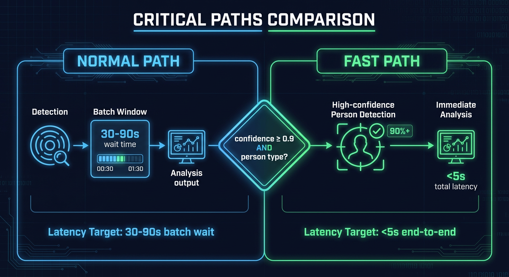
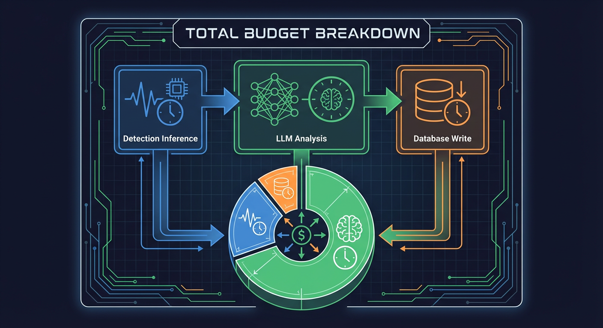

# Critical Paths and Latency Optimization



This document describes the performance-critical paths through the detection pipeline, latency targets, and optimization strategies.

## Latency Targets

| Stage                   | Target | Rationale                     |
| ----------------------- | ------ | ----------------------------- |
| File detection to queue | <500ms | User-perceived responsiveness |
| Detection inference     | <100ms | GPU batch efficiency          |
| Event broadcast         | <50ms  | Real-time UI updates          |
| Total pipeline          | <5s    | End-to-end detection to event |

## Pipeline Stages with Latency Tracking

The pipeline records latency at each stage for observability:

```
watch_to_detect --> detect_to_batch --> batch_to_analyze --> total_pipeline
```

### Stage 1: watch_to_detect

**Source:** `backend/services/file_watcher.py` (lines 767-769)

```python
duration_ms = int((time.time() - start_time) * 1000)
record_pipeline_stage_latency("watch_to_detect", float(duration_ms))
```

**Components:**

- File system event detection (watchdog)
- Debounce delay (0.5s default)
- File stability check (2.0s for FTP)
- Image validation (PIL load)
- Deduplication check (Redis)
- Queue enqueue (Redis LPUSH)

### Stage 2: detect_to_batch

**Source:** `backend/services/pipeline_workers.py` (lines 453-455)

```python
duration = time.time() - start_time
observe_stage_duration("detect", duration)
record_pipeline_stage_latency("detect_to_batch", duration * 1000)
```

**Components:**

- Queue dequeue (Redis BRPOP)
- Payload validation
- Semaphore acquisition
- RT-DETRv2 HTTP request
- Detection filtering
- Database insert
- Batch aggregator update

### Stage 3: batch_to_analyze

**Source:** `backend/services/pipeline_workers.py` (lines 888-891)

```python
duration = time.time() - start_time
record_pipeline_stage_latency("batch_to_analyze", duration * 1000)
await record_stage_latency(self._redis, "analyze", duration * 1000)
```

**Components:**

- Queue dequeue (Redis BRPOP)
- Payload validation
- Detection fetch (PostgreSQL)
- Context enrichment
- Enrichment pipeline (optional)
- Semaphore acquisition
- Nemotron LLM request
- Response parsing
- Event creation
- Database insert
- WebSocket broadcast

### Stage 4: total_pipeline

**Source:** `backend/services/pipeline_workers.py` (lines 894-916)

```python
if pipeline_start_time:
    start_dt = datetime.fromisoformat(pipeline_start_time.replace("Z", "+00:00"))
    total_duration_ms = (datetime.now(UTC) - start_dt).total_seconds() * 1000
    record_pipeline_stage_latency("total_pipeline", total_duration_ms)
```

**Tracked from:** First file detection to event creation completion.

## Fast Path Optimization

For critical detections, the fast path bypasses batch aggregation entirely.

**Source:** `backend/services/batch_aggregator.py` (lines 1028-1082)

### Criteria (Lines 1028-1048)

```python
def _should_use_fast_path(self, confidence: float | None, object_type: str | None) -> bool:
    if confidence is None or object_type is None:
        return False
    if confidence < self._fast_path_threshold:  # 0.9 default
        return False
    return object_type.lower() in [t.lower() for t in self._fast_path_types]
```

**Default criteria:**

- Confidence >= 0.9 (90%)
- Object type in `["person"]`

### Latency Impact

| Path         | Typical Latency | Notes                              |
| ------------ | --------------- | ---------------------------------- |
| Normal batch | 30-90s          | Wait for batch window/idle timeout |
| Fast path    | <5s             | Immediate analysis                 |

### Trade-offs

**Benefits:**

- Immediate alerts for high-confidence threats
- Reduced time-to-notification for security events

**Costs:**

- Higher LLM load (more individual requests)
- Less context for LLM (single detection vs batch)

## Concurrency Control

### Inference Semaphore (NEM-1463)

**Source:** `backend/services/inference_semaphore.py`

Limits concurrent AI inference operations to prevent GPU overload:

```python
# Default limit: 4 concurrent inferences
AI_MAX_CONCURRENT_INFERENCES = 4
```

**Impact on latency:**

- Under load, requests queue behind the semaphore
- Trade-off between throughput and latency
- Higher limits increase parallelism but risk GPU OOM

### Detector Client Semaphore (NEM-1500)

**Source:** `backend/services/detector_client.py` (lines 184-204)

```python
@classmethod
def _get_semaphore(cls) -> asyncio.Semaphore:
    settings = get_settings()
    limit = settings.ai_max_concurrent_inferences

    if cls._request_semaphore is None or cls._semaphore_limit != limit:
        cls._request_semaphore = asyncio.Semaphore(limit)
```

## Retry and Backoff

### Exponential Backoff (NEM-1343)

Both detector and analyzer use exponential backoff for transient failures:

```python
# Backoff calculation
delay = min(2**attempt, 30)  # Cap at 30 seconds
```

**Retry schedule:**
| Attempt | Delay |
|---------|-------|
| 1 | 1s |
| 2 | 2s |
| 3 | 4s |
| 4 | 8s |
| 5+ | 30s (capped) |

### Impact on Latency

Worst-case latency with retries (3 attempts):

```
Base latency + 1s + 2s + 4s = Base + 7s
```

## Circuit Breaker (NEM-1724)

**Source:** `backend/services/detector_client.py` (lines 296-309)

Prevents retry storms when services are unavailable:

```python
self._circuit_breaker = CircuitBreaker(
    name="rtdetr",
    config=CircuitBreakerConfig(
        failure_threshold=5,      # Opens after 5 failures
        recovery_timeout=60.0,    # 60s before retry
        half_open_max_calls=3,
        success_threshold=2,
    ),
)
```

**Latency impact:**

- When circuit is open, requests fail immediately
- Prevents cascading delays during outages

## Timeout Configuration



### Detector Timeouts

**Source:** `backend/services/detector_client.py` (lines 97-99)

```python
DETECTOR_CONNECT_TIMEOUT = 10.0   # Connection establishment
DETECTOR_READ_TIMEOUT = 60.0      # AI inference response
DETECTOR_HEALTH_TIMEOUT = 5.0     # Health check
```

### Analyzer Timeouts

**Source:** `backend/services/nemotron_analyzer.py` (lines 127-132)

```python
NEMOTRON_CONNECT_TIMEOUT = 10.0   # Connection establishment
NEMOTRON_READ_TIMEOUT = 120.0     # LLM response (complex inference)
NEMOTRON_HEALTH_TIMEOUT = 5.0     # Health check
```

### Defense-in-Depth (NEM-1465)

**Source:** `backend/services/detector_client.py` (lines 579-582)

```python
# Explicit asyncio.timeout() wrapper
explicit_timeout = settings.rtdetr_read_timeout + settings.ai_connect_timeout
async with asyncio.timeout(explicit_timeout):
    response = await self._http_client.post(...)
```

## Cold Start Optimization (NEM-1670)

### Model Warmup

**Source:** `backend/services/detector_client.py` (lines 488-539)

```python
async def warmup(self) -> bool:
    """Perform model warmup by running a test inference."""
    if not self._warmup_enabled:
        return True

    was_cold = self.is_cold()
    self._is_warming = True

    result = await self.model_readiness_probe()

    if result:
        self._track_inference()
        set_model_warmth_state("rtdetr", "warm")
```

**Configuration:**

```python
ai_warmup_enabled = True          # Enable warmup on startup
ai_cold_start_threshold_seconds = 300  # 5 minutes idle = cold
```

### Cold Detection

```python
def is_cold(self) -> bool:
    if self._last_inference_time is None:
        return True
    seconds_since_last = time.monotonic() - self._last_inference_time
    return seconds_since_last > self._cold_start_threshold
```

## Redis Pipelining

### Batch Timeout Checking

**Source:** `backend/services/batch_aggregator.py` (lines 582-617)

Uses Redis pipelining to reduce RTTs from O(N \* 3) to O(2):

```python
# Phase 1: Fetch all batch IDs in parallel (single RTT)
batch_id_pipe = redis_client.pipeline()
for batch_key in batch_keys:
    batch_id_pipe.get(batch_key)
batch_ids = await batch_id_pipe.execute()

# Phase 2: Fetch all metadata in parallel (single RTT)
metadata_pipe = redis_client.pipeline()
for _batch_key, batch_id in valid_batches:
    metadata_pipe.get(f"batch:{batch_id}:started_at")
    metadata_pipe.get(f"batch:{batch_id}:last_activity")
```

### Atomic Batch Creation (NEM-2014)

**Source:** `backend/services/batch_aggregator.py` (lines 333-391)

```python
async with client.pipeline(transaction=True) as pipe:
    pipe.set(batch_key, batch_id, ex=ttl)
    pipe.set(f"batch:{batch_id}:camera_id", camera_id, ex=ttl)
    pipe.set(f"batch:{batch_id}:started_at", str(current_time), ex=ttl)
    pipe.set(f"batch:{batch_id}:last_activity", str(current_time), ex=ttl)
    await pipe.execute()
```

## Async I/O Optimization

### Thread Pool for Blocking Operations

**Source:** `backend/services/file_watcher.py` (lines 246-247)

```python
# Run blocking PIL operations in thread pool
return await asyncio.to_thread(_validate_image_sync, file_path)
```

### Parallel Data Fetching

**Source:** `backend/services/batch_aggregator.py` (lines 788-800)

```python
async with asyncio.TaskGroup() as tg:
    tg.create_task(fetch_detections())
    tg.create_task(fetch_started_at())
    tg.create_task(fetch_pipeline_time())
```

## HTTP Connection Pooling (NEM-1721)

**Source:** `backend/services/detector_client.py` (lines 284-293)

```python
# Persistent HTTP connection pool
self._http_client = httpx.AsyncClient(
    timeout=self._timeout,
    limits=httpx.Limits(max_connections=10, max_keepalive_connections=5),
)
```

**Benefits:**

- Avoids TCP handshake overhead
- Reuses existing connections
- Prevents connection exhaustion

## Free-Threading Support (Python 3.13t/3.14t)

**Source:** `backend/services/detector_client.py` (lines 107-148)

When running on free-threaded Python (GIL disabled):

```python
def _is_free_threaded() -> bool:
    if hasattr(sys, "_is_gil_enabled"):
        return not sys._is_gil_enabled()
    return False

def _get_default_inference_limit() -> int:
    if _is_free_threaded():
        return 20  # Higher limit with true parallelism
    return 4     # Conservative limit with GIL
```

## Monitoring and Alerts

### Key Metrics to Monitor

| Metric                                                 | Alert Threshold | Description               |
| ------------------------------------------------------ | --------------- | ------------------------- |
| `hsi_pipeline_stage_duration_seconds{stage="detect"}`  | p99 > 1s        | Detection taking too long |
| `hsi_pipeline_stage_duration_seconds{stage="analyze"}` | p99 > 60s       | Analysis taking too long  |
| `hsi_queue_depth{queue="detection"}`                   | > 100           | Detection backlog         |
| `hsi_queue_depth{queue="analysis"}`                    | > 50            | Analysis backlog          |
| `hsi_pipeline_errors_total`                            | > 10/min        | Error rate spike          |

### Latency Percentiles

Track p50, p90, p99 for each stage:

```
hsi_pipeline_stage_duration_seconds_bucket{stage="detect",le="0.1"}
hsi_pipeline_stage_duration_seconds_bucket{stage="detect",le="0.5"}
hsi_pipeline_stage_duration_seconds_bucket{stage="detect",le="1.0"}
hsi_pipeline_stage_duration_seconds_bucket{stage="detect",le="5.0"}
```

## Related Documentation

- **[FileWatcher](file-watcher.md):** Entry point optimizations
- **[Detection Queue](detection-queue.md):** Queue processing patterns
- **[Batch Aggregator](batch-aggregator.md):** Batching strategy
- **[Analysis Queue](analysis-queue.md):** LLM optimization
- **[Resilience Patterns](../resilience.md):** Circuit breakers and retries
