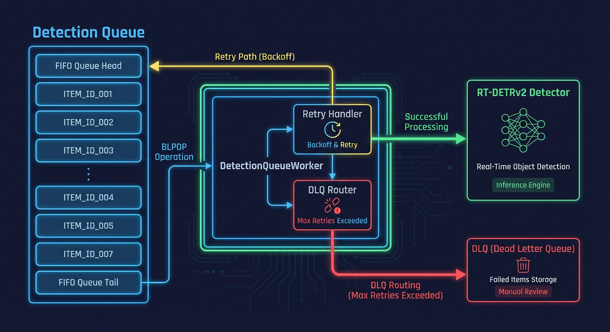
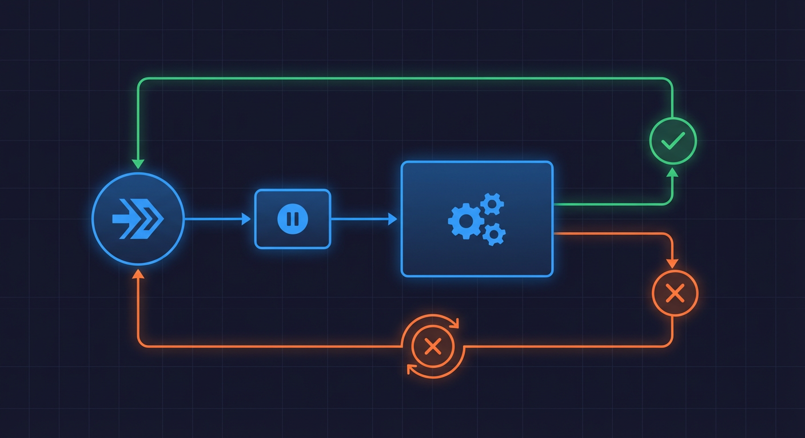

# Detection Queue Architecture



The detection queue receives file upload notifications from the FileWatcher and routes them through object detection before batch aggregation.

## Overview

**Source Files:**

- `backend/services/pipeline_workers.py` (DetectionQueueWorker)
- `backend/api/schemas/queue.py` (Payload validation)
- `backend/core/constants.py` (Queue names)

## Queue Structure

The detection queue uses a Redis LIST data structure with LPUSH/BRPOP pattern for FIFO ordering.

**Queue Name:** `DETECTION_QUEUE = "detection_queue"` (constants.py:146)

**With prefix:** `hsi:queue:detection_queue` (constants.py:260-261)

```python
def get_prefixed_queue_name(queue_name: str) -> str:
    prefix = _get_redis_key_prefix()
    return f"{prefix}:queue:{queue_name}"
```

## Queue Payload Schema

**Source:** `backend/api/schemas/queue.py` (lines 18-105)

```python
class DetectionQueuePayload(BaseModel):
    camera_id: str = Field(
        ...,
        min_length=1,
        max_length=64,
        pattern=r"^[a-zA-Z0-9_-]+$",
    )
    file_path: str = Field(..., min_length=1, max_length=4096)
    timestamp: str  # ISO format
    media_type: Literal["image", "video"] = "image"
    file_hash: str | None = None  # SHA256 hex
    pipeline_start_time: str | None = None  # For latency tracking
```

### Security Validations

**Path Traversal Prevention (lines 72-93):**

```python
@field_validator("file_path")
def validate_file_path(cls, v: str) -> str:
    # Must be absolute path
    if not v.startswith("/"):
        raise ValueError("file_path must be an absolute path starting with /")

    # Check for path traversal
    if ".." in v:
        raise ValueError("file_path cannot contain '..'")

    # Check for null bytes
    if "\x00" in v:
        raise ValueError("file_path cannot contain null bytes")
```

**Timestamp Validation (lines 95-104):**

```python
@field_validator("timestamp")
def validate_timestamp(cls, v: str) -> str:
    datetime.fromisoformat(v.replace("Z", "+00:00"))
    return v
```

## DetectionQueueWorker

**Source:** `backend/services/pipeline_workers.py` (lines 208-689)

### Class Definition

```python
class DetectionQueueWorker:  # Line 208
    """Worker that consumes images from detection_queue and runs object detection."""
```

### Constructor Parameters (Lines 220-278)

| Parameter          | Type              | Default           | Description                            |
| ------------------ | ----------------- | ----------------- | -------------------------------------- |
| `redis_client`     | `RedisClient`     | Required          | Redis client for queue operations      |
| `detector_client`  | `DetectorClient`  | Auto-created      | Client for RT-DETRv2                   |
| `batch_aggregator` | `BatchAggregator` | Auto-created      | For grouping detections                |
| `video_processor`  | `VideoProcessor`  | Auto-created      | For video frame extraction             |
| `retry_handler`    | `RetryHandler`    | Auto-created      | For transient failure handling         |
| `frame_buffer`     | `FrameBuffer`     | Global singleton  | For X-CLIP temporal action recognition |
| `queue_name`       | `str`             | `DETECTION_QUEUE` | Queue to consume from                  |
| `poll_timeout`     | `int`             | 5                 | BLPOP timeout in seconds               |
| `stop_timeout`     | `float`           | 10.0              | Graceful stop timeout                  |

### Retry Configuration (Lines 261-270)

```python
self._retry_handler = retry_handler or RetryHandler(
    redis_client=redis_client,
    config=RetryConfig(
        max_retries=3,
        base_delay_seconds=1.0,
        max_delay_seconds=30.0,
        exponential_base=2.0,
        jitter=True,
    ),
)
```

## Processing Loop



### Main Loop (Lines 342-382)

```python
async def _run_loop(self) -> None:
    """Main processing loop for the detection queue worker."""
    while self._running:
        # Pop item from queue with timeout (lines 350-353)
        item = await self._redis.get_from_queue(
            self._queue_name,
            timeout=self._poll_timeout,
        )

        if item is None:
            continue  # Timeout - check shutdown signal

        await self._process_detection_item(item)
```

### Item Processing (Lines 384-474)

```python
async def _process_detection_item(self, item: dict[str, Any]) -> None:
    """Process a single detection queue item."""
    # Security: Validate payload (lines 405-421)
    try:
        validated: DetectionQueuePayload = validate_detection_payload(item)
    except ValueError as e:
        self._stats.errors += 1
        record_pipeline_error("invalid_detection_payload")
        logger.error(f"SECURITY: Rejecting invalid payload: {e}")
        return

    # Route to image or video processing (lines 439-446)
    if media_type == "video":
        await self._process_video_detection(camera_id, file_path, item, pipeline_start_time)
    else:
        await self._process_image_detection(camera_id, file_path, item, pipeline_start_time)
```

## Image Detection Processing

**Source:** Lines 476-552

```python
async def _process_image_detection(
    self,
    camera_id: str,
    file_path: str,
    job_data: dict[str, Any],
    pipeline_start_time: str | None = None,
) -> None:
    """Process a single image file for object detection."""

    async def _detect_with_session() -> list[Any]:
        async with get_session() as session:
            return await self._detector.detect_objects(
                image_path=file_path,
                camera_id=camera_id,
                session=session,
            )

    # Use retry handler for transient failures (lines 506-510)
    result = await self._retry_handler.with_retry(
        operation=_detect_with_session,
        job_data=job_data,
        queue_name=self._queue_name,
    )

    # Add detections to batch (lines 533-542)
    for detection in detections:
        await self._aggregator.add_detection(
            camera_id=camera_id,
            detection_id=detection.id,
            _file_path=file_path,
            confidence=detection.confidence,
            object_type=detection.object_type,
            pipeline_start_time=pipeline_start_time,
        )
```

## Video Detection Processing

**Source:** Lines 554-688

For video files, the worker extracts frames and processes each:

```python
async def _process_video_detection(
    self, camera_id: str, video_path: str, ...
) -> None:
    """Process a video by extracting frames and detecting on each."""

    # Extract frames using optimized batch method (lines 583-587)
    frame_paths = await self._video_processor.extract_frames_for_detection_batch(
        video_path=video_path,
        interval_seconds=self._video_frame_interval,
        max_frames=self._video_max_frames,
    )

    # Process each frame (lines 605-668)
    for frame_path in frame_paths:
        result = await self._retry_handler.with_retry(
            operation=_detect_frame,
            job_data=job_data,
            queue_name=self._queue_name,
        )

        # Add detections to batch with video path (lines 647-655)
        for detection in detections:
            await self._aggregator.add_detection(
                camera_id=camera_id,
                detection_id=detection.id,
                _file_path=video_path,  # Use video path, not frame
                ...
            )

    # Cleanup extracted frames (line 672)
    self._video_processor.cleanup_extracted_frames(video_path)
```

## Worker Statistics

**Source:** Lines 189-206

```python
@dataclass(slots=True)
class WorkerStats:
    """Statistics for a worker process."""
    items_processed: int = 0
    errors: int = 0
    last_processed_at: float | None = None
    state: WorkerState = WorkerState.STOPPED
```

**Worker States (lines 179-187):**

```python
class WorkerState(Enum):
    STOPPED = "stopped"
    STARTING = "starting"
    RUNNING = "running"
    STOPPING = "stopping"
    ERROR = "error"
```

## Lifecycle Methods

### Start (Lines 290-308)

```python
async def start(self) -> None:
    """Start the detection queue worker."""
    if self._running:
        return  # Idempotent

    self._running = True
    self._stats.state = WorkerState.STARTING
    self._task = create_tracked_task(
        self._run_loop(),
        name="DetectionQueueWorker",
        task_prefix="detect-worker",
    )
    self._stats.state = WorkerState.RUNNING
```

### Stop (Lines 310-340)

```python
async def stop(self) -> None:
    """Stop the detection queue worker gracefully."""
    self._stats.state = WorkerState.STOPPING
    self._running = False

    if self._task:
        try:
            await asyncio.wait_for(self._task, timeout=self._stop_timeout)
        except TimeoutError:
            self._task.cancel()
            await self._task

    self._stats.state = WorkerState.STOPPED
```

## Error Handling

### Error Categorization (Lines 128-176)

```python
def categorize_exception(e: Exception, worker_name: str) -> str:
    """Categorize exception for metrics."""
    # Connection errors
    if type(e).__name__ in ("ConnectionError", "ConnectionRefusedError", ...):
        return f"{worker_name}_connection_error"

    # Timeout errors
    if isinstance(e, TimeoutError):
        return f"{worker_name}_timeout_error"

    # Validation errors
    if isinstance(e, ValueError | TypeError | KeyError):
        return f"{worker_name}_validation_error"

    # Redis errors
    if "redis" in type(e).__module__.lower():
        return f"{worker_name}_redis_error"

    return f"{worker_name}_processing_error"
```

### Error Recovery (Lines 364-377)

```python
except Exception as e:
    self._stats.errors += 1
    self._stats.state = WorkerState.ERROR
    error_type = categorize_exception(e, "detection")
    record_pipeline_error(error_type)
    logger.error(f"Error in DetectionQueueWorker loop: {e}")

    # Brief delay before retrying
    await asyncio.sleep(1.0)
    self._stats.state = WorkerState.RUNNING
```

## DLQ Handling

When all retries are exhausted, jobs are moved to the dead-letter queue (lines 512-529):

```python
if not result.success:
    # All retries exhausted - job moved to DLQ
    logger.warning(
        f"Detection failed after {result.attempts} attempts, moved to DLQ",
    )
    record_pipeline_error("detection_max_retries_exceeded")
    raise DetectorUnavailableError(
        f"Detection failed after {result.attempts} retries: {result.error}"
    )
```

**DLQ Names (constants.py:170-174):**

```python
DLQ_PREFIX = "dlq:"
DLQ_DETECTION_QUEUE = f"{DLQ_PREFIX}{DETECTION_QUEUE}"  # "dlq:detection_queue"
```

## Metrics

### Stage Duration (Lines 451-457)

```python
duration = time.time() - start_time
observe_stage_duration("detect", duration)
record_pipeline_stage_latency("detect_to_batch", duration * 1000)
await record_stage_latency(self._redis, "detect", duration * 1000)
```

### Queue Depth

The `QueueMetricsWorker` (lines 1102-1204) updates queue metrics every 5 seconds:

```python
detection_depth = await self._redis.get_queue_length(DETECTION_QUEUE)
set_queue_depth("detection", detection_depth)
```

## OpenTelemetry Tracing

Detection processing is traced for observability (lines 426-435):

```python
with (
    log_context(camera_id=camera_id, file_path=file_path, media_type=media_type),
    tracer.start_as_current_span("detection_processing"),
):
    add_span_attributes(
        camera_id=camera_id,
        file_path=file_path,
        media_type=media_type,
        pipeline_stage="detection",
    )
```

## Configuration

| Setting                        | Default | Description                            |
| ------------------------------ | ------- | -------------------------------------- |
| `video_frame_interval_seconds` | `1.0`   | Seconds between extracted video frames |
| `video_max_frames`             | `10`    | Maximum frames to extract per video    |
| `detector_max_retries`         | `3`     | Max retry attempts for detector calls  |

## Related Documentation

- **[FileWatcher](file-watcher.md):** Source of queue items
- **[Batch Aggregator](batch-aggregator.md):** Destination for detections
- **[Critical Paths](critical-paths.md):** Latency optimization
