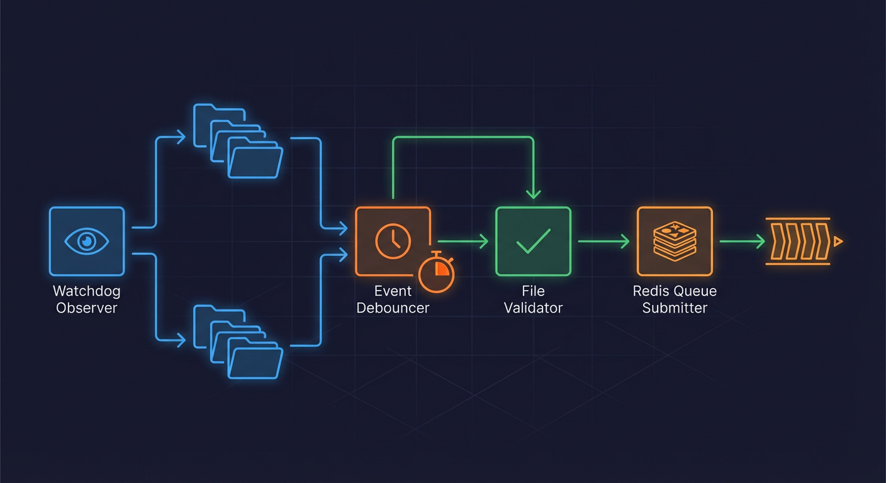
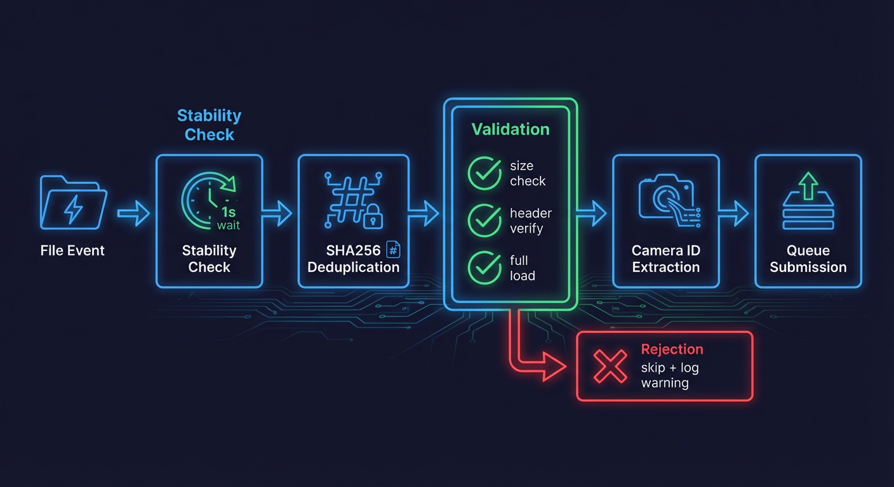

# FileWatcher Service



The FileWatcher service monitors camera upload directories for new image and video files, validates them, and queues them for AI processing.

## Overview

**Source:** `backend/services/file_watcher.py`

The FileWatcher is the entry point for the detection pipeline. It:

1. Watches camera directories using watchdog observers
2. Debounces rapid file system events
3. Validates file integrity before processing
4. Deduplicates files via content hashing
5. Queues valid files to `detection_queue`

## Class Definition

```python
class FileWatcher:  # Line 330
    """Watches camera directories for new media uploads and queues for processing."""
```

### Constructor Parameters (Lines 351-384)

| Parameter             | Type            | Default           | Description                                    |
| --------------------- | --------------- | ----------------- | ---------------------------------------------- |
| `camera_root`         | `str`           | From settings     | Root directory containing camera folders       |
| `redis_client`        | `RedisClient`   | None              | Redis client for queue operations              |
| `debounce_delay`      | `float`         | 0.5               | Seconds to wait after last file modification   |
| `queue_name`          | `str`           | `DETECTION_QUEUE` | Name of Redis queue                            |
| `dedupe_service`      | `DedupeService` | Auto-created      | Service for file deduplication                 |
| `auto_create_cameras` | `bool`          | True              | Auto-create camera records for new directories |
| `use_polling`         | `bool`          | From settings     | Use polling instead of native observer         |
| `stability_time`      | `float`         | 2.0               | Seconds file must be stable before processing  |

## Observer Selection

The FileWatcher supports two observer modes (lines 47-55, 404-420):

**Native Observer (default):**

- Linux: inotify (kernel-level notifications)
- macOS: FSEvents (native API)
- Windows: ReadDirectoryChangesW

**Polling Observer (for containers/NFS):**

- Used when `FILE_WATCHER_POLLING=true`
- Configurable interval via `FILE_WATCHER_POLLING_INTERVAL`
- Required for Docker Desktop/macOS mounts or network filesystems

## File Type Support

**Supported Extensions (lines 68-70):**

```python
IMAGE_EXTENSIONS = {".jpg", ".jpeg", ".png"}
VIDEO_EXTENSIONS = {".mp4", ".mkv", ".avi", ".mov"}
SUPPORTED_EXTENSIONS = IMAGE_EXTENSIONS | VIDEO_EXTENSIONS
```

**Validation Functions:**

- `is_image_file()` (lines 73-83)
- `is_video_file()` (lines 85-95)
- `is_supported_media_file()` (lines 97-107)
- `get_media_type()` (lines 109-124)

## Image Validation

The FileWatcher performs comprehensive image validation to catch truncated/corrupt files from incomplete FTP uploads.

### Minimum File Size (Line 128)

```python
MIN_IMAGE_FILE_SIZE = 10 * 1024  # 10KB
```

### Validation Process (Lines 159-205)

1. **File existence check:** Verify file is readable
2. **Size validation:** Reject files smaller than 10KB
3. **Header verification:** PIL `img.verify()` checks image header
4. **Full load test:** PIL `img.load()` catches truncated images

```python
def is_valid_image(file_path: str) -> bool:
    # Check file size (lines 184-196)
    file_size = file_path_obj.stat().st_size
    if file_size < MIN_IMAGE_FILE_SIZE:
        return False

    # Verify header (line 146)
    img.verify()

    # Full load to catch truncation (line 154)
    img.load()
```

### Async Validation (Lines 207-254)

The `is_valid_image_async()` function runs PIL operations in a thread pool to avoid blocking the event loop.

## File Stability Check



FTP uploads may arrive in chunks. The stability check ensures files are complete before processing (lines 560-621).

```python
async def _wait_for_file_stability(self, file_path: str, stability_time: float = 2.0):
    """Wait until file size stops changing for stability_time seconds."""
```

**Algorithm:**

1. Poll file size every 0.5 seconds
2. Track when size last changed
3. Return True when size unchanged for `stability_time` seconds
4. Return False after 20 checks (~10 seconds) if never stable

## Debounce Logic


Watchdog may fire multiple events for a single file write. The debounce logic consolidates these (lines 667-711).

```python
async def _schedule_file_processing(self, file_path: str) -> None:
    """Schedule file processing with debounce logic."""
    # Cancel existing pending task for this file (lines 677-678)
    if file_path in self._pending_tasks:
        self._pending_tasks[file_path].cancel()

    # Create new debounced task (lines 680-682)
    task = asyncio.create_task(self._debounced_process(file_path))
    self._pending_tasks[file_path] = task
```

The `_debounced_process()` method (lines 694-711) waits for the configured delay before calling `_process_file()`.

## Deduplication

Files are deduplicated using SHA256 content hashes stored in Redis (lines 809-819).

```python
async def _queue_for_detection(self, camera_id: str, file_path: str, ...):
    # Check for duplicate using content hash (lines 809-818)
    if self._dedupe_service:
        is_duplicate, file_hash = await self._dedupe_service.is_duplicate_and_mark(file_path)
        if is_duplicate:
            logger.info(f"Skipping duplicate file: {file_path}")
            return
```

**Deduplication prevents:**

- Watchdog create/modify event bursts
- Service restarts during file processing
- FTP upload retries

## Camera ID Extraction

Camera IDs are derived from upload directory names (lines 524-558):

```python
def _get_camera_id_from_path(self, file_path: str) -> tuple[str | None, str | None]:
    """Extract normalized camera ID and folder name from file path."""
    # Get relative path from camera root
    relative_path = path.relative_to(camera_root_path)

    # First component is the folder name
    folder_name = relative_path.parts[0]

    # Normalize to camera ID
    camera_id = normalize_camera_id(folder_name)
```

**Example:**

```
Upload path: /export/foscam/Front Door/image.jpg
  -> folder_name: "Front Door"
  -> camera_id: "front_door" (normalized)
```

## Auto Camera Creation

When `auto_create_cameras=True`, new cameras are created automatically (lines 623-665):

```python
async def _ensure_camera_exists(self, camera_id: str, folder_name: str):
    """Ensure camera record exists in database, creating if necessary."""
    if camera_id in self._known_cameras:
        return  # Skip if already processed

    self._known_cameras.add(camera_id)

    camera = Camera.from_folder_name(folder_name, folder_path)
    await self._camera_creator(camera)
```

## Queue Payload Structure

The detection queue payload (lines 822-828):

```python
detection_data = {
    "camera_id": camera_id,
    "file_path": file_path,
    "timestamp": pipeline_start_time,
    "media_type": media_type or "image",
    "pipeline_start_time": pipeline_start_time,
}
```

**Validation Schema:** `DetectionQueuePayload` in `backend/api/schemas/queue.py` (lines 18-105)

## Rate Limiting

To prevent Redis connection exhaustion during bulk uploads, queue operations are rate-limited (lines 833-848):

```python
# Use semaphore to limit concurrent queue operations (lines 836-837)
semaphore = self._queue_semaphore or asyncio.Semaphore(self._max_concurrent_queue)
async with semaphore:
    result = await self.redis_client.add_to_queue_safe(...)

    # Add configurable delay between operations (lines 846-848)
    if self._queue_delay_ms > 0:
        await asyncio.sleep(self._queue_delay_ms / 1000.0)
```

## Lifecycle Methods

### Start (Lines 875-972)

```python
async def start(self) -> None:
    """Start watching camera directories for file changes."""
    # Capture event loop for thread-safe task scheduling (lines 888-890)
    self._loop = asyncio.get_running_loop()

    # Initialize rate limiting semaphore (line 949)
    self._queue_semaphore = asyncio.Semaphore(self._max_concurrent_queue)

    # Schedule observer for camera root (lines 962-966)
    self.observer.schedule(self._event_handler, str(camera_root_path), recursive=True)

    # Start observer (line 969)
    self.observer.start()
```

### Stop (Lines 974-1016)

```python
async def stop(self) -> None:
    """Stop watching and cleanup resources."""
    # Cancel all pending tasks (lines 989-996)
    for task in self._pending_tasks.values():
        task.cancel()
    await asyncio.gather(*self._pending_tasks.values(), return_exceptions=True)

    # Stop observer (lines 999-1003)
    self.observer.stop()
    await loop.run_in_executor(None, lambda: self.observer.join(timeout=5))
```

## Metrics

The FileWatcher records latency metrics (lines 768-769):

```python
# Record watch stage latency to in-memory tracker
record_pipeline_stage_latency("watch_to_detect", float(duration_ms))
```

## Error Handling

| Error Scenario             | Handling                             |
| -------------------------- | ------------------------------------ |
| File not found             | Skip file, log warning               |
| File too small             | Skip file, log warning (line 193)    |
| Corrupt image              | Skip file, log warning (line 200)    |
| Camera ID extraction fails | Skip file, log warning (line 557)    |
| Queue operation fails      | Raise RuntimeError (line 860)        |
| Event loop not available   | Log error, skip file (lines 507-520) |

## Configuration Settings

| Setting                             | Default          | Description                     |
| ----------------------------------- | ---------------- | ------------------------------- |
| `foscam_base_path`                  | `/export/foscam` | Camera upload root directory    |
| `file_watcher_polling`              | `false`          | Use polling observer            |
| `file_watcher_polling_interval`     | `1.0`            | Polling interval in seconds     |
| `file_watcher_max_concurrent_queue` | `10`             | Max concurrent queue operations |
| `file_watcher_queue_delay_ms`       | `0`              | Delay between queue operations  |

## Related Documentation

- **[Detection Queue](detection-queue.md):** Queue processing details
- **[Batch Aggregator](batch-aggregator.md):** How detections are grouped
