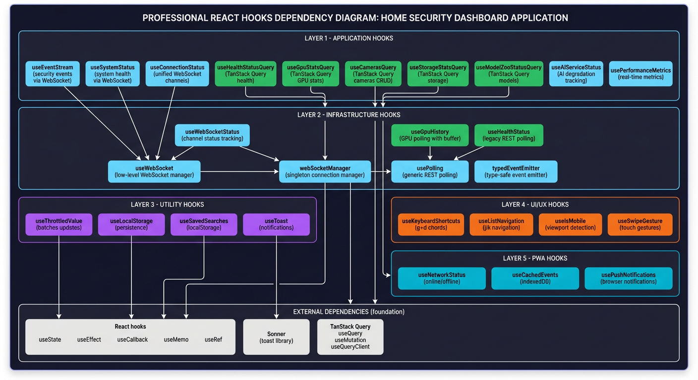
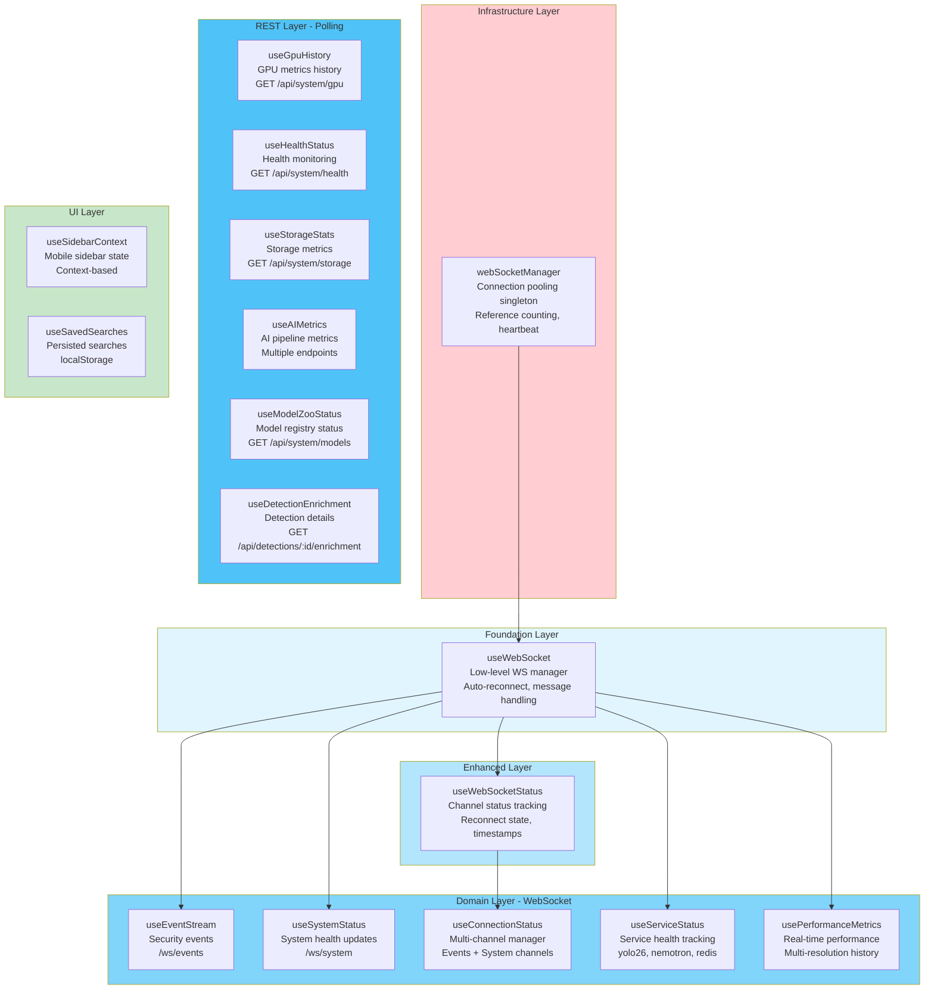
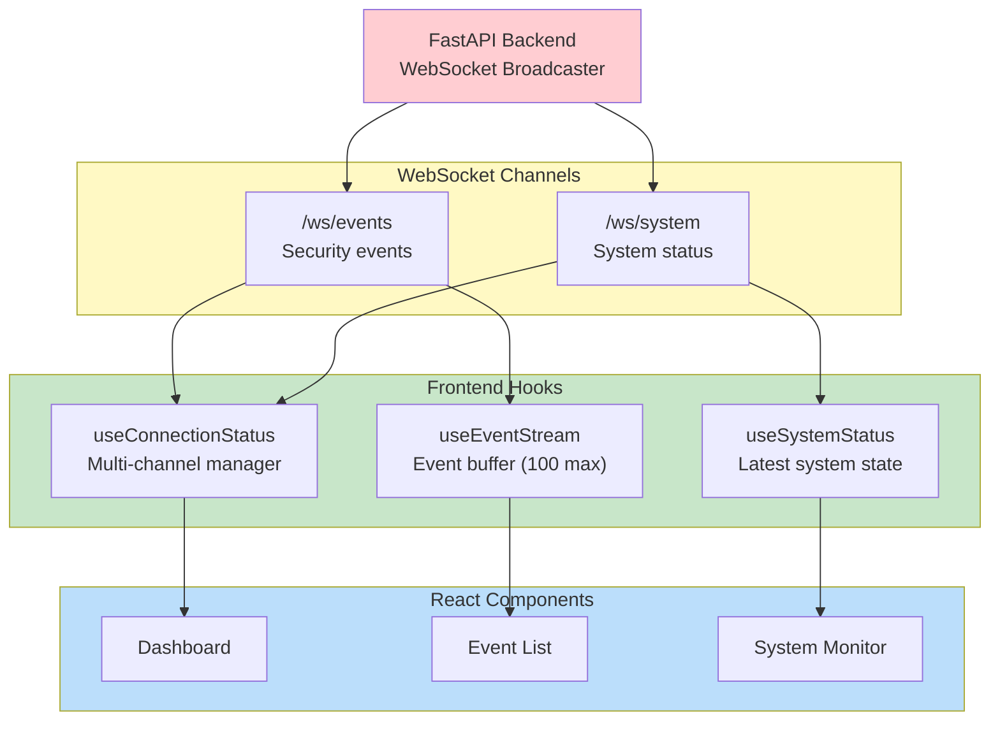

# Frontend Hooks Architecture

## Overview

The frontend uses custom React hooks to manage real-time WebSocket connections, REST API polling, and state management for the home security dashboard. These hooks provide a clean abstraction layer over WebSocket communication and REST endpoints, enabling components to receive live updates for security events, system status, GPU metrics, and health monitoring.

The hook architecture follows a layered design:

1. **Infrastructure Layer**: Singleton WebSocket connection manager with deduplication (`webSocketManager`)
2. **Foundation Layer**: Low-level WebSocket connection management (`useWebSocket`)
3. **Enhanced Layer**: Connection status tracking (`useWebSocketStatus`)
4. **Domain Layer**: Feature-specific hooks for events, system status, AI metrics, and multi-channel management
5. **REST Layer**: Polling-based hooks for health, GPU history, storage stats, and AI model status
6. **UI Layer**: Context hooks and localStorage persistence (`useSidebarContext`, `useSavedSearches`)

All WebSocket URLs are constructed via `buildWebSocketUrl()` from the API service, which respects environment variables (`VITE_WS_BASE_URL`, `VITE_API_KEY`) and provides SSR-safe connection handling.

## Hook Hierarchy



_Frontend React hooks dependency diagram showing the layered architecture from WebSocket manager to domain-specific hooks._



## Hooks Reference

### useWebSocket

**Purpose**: Low-level WebSocket connection manager with automatic reconnection logic.

**Source**: `frontend/src/hooks/useWebSocket.ts:22`

**Features**:

- Automatic reconnection with configurable attempts and intervals (default: 5 attempts, 3s interval)
- Message serialization (JSON) and deserialization with fallback to raw data
- Connection state tracking (`isConnected`)
- Manual connect/disconnect controls
- Lifecycle callbacks: `onOpen`, `onClose`, `onError`, `onMessage`
- SSR-safe: checks for `window.WebSocket` availability
- Prevents duplicate connections (checks OPEN/CONNECTING states)

**Type Definitions**:

```typescript
interface WebSocketOptions {
  url: string;
  onMessage?: (data: unknown) => void;
  onOpen?: () => void;
  onClose?: () => void;
  onError?: (error: Event) => void;
  reconnect?: boolean; // default: true
  reconnectInterval?: number; // default: 3000ms
  reconnectAttempts?: number; // default: 5
}

interface UseWebSocketReturn {
  isConnected: boolean;
  lastMessage: unknown;
  send: (data: unknown) => void;
  connect: () => void;
  disconnect: () => void;
}
```

**Example**:

```typescript
const { isConnected, lastMessage, send } = useWebSocket({
  url: 'ws://localhost:8000/ws/events',
  onMessage: (data) => console.log('Received:', data),
  reconnectAttempts: 5,
  reconnectInterval: 3000,
});

// Send message when connected
if (isConnected) {
  send({ type: 'ping' });
}
```

---

### useWebSocketStatus

**Purpose**: Enhanced WebSocket hook that tracks detailed channel status including reconnection state and message timestamps.

**Source**: `frontend/src/hooks/useWebSocketStatus.ts:33`

**Features**:

- Full WebSocket lifecycle management with reconnection
- Channel-level status tracking (name, state, reconnect attempts)
- Last message timestamp tracking
- SSR-safe (checks for `window.WebSocket` availability)
- Reconnect state transitions: connected → reconnecting → disconnected

**Type Definitions**:

```typescript
type ConnectionState = 'connected' | 'disconnected' | 'reconnecting';

interface ChannelStatus {
  name: string;
  state: ConnectionState;
  reconnectAttempts: number;
  maxReconnectAttempts: number;
  lastMessageTime: Date | null;
}

interface WebSocketStatusOptions {
  url: string;
  channelName: string;
  onMessage?: (data: unknown) => void;
  onOpen?: () => void;
  onClose?: () => void;
  onError?: (error: Event) => void;
  reconnect?: boolean; // default: true
  reconnectInterval?: number; // default: 3000ms
  reconnectAttempts?: number; // default: 5
}

interface UseWebSocketStatusReturn {
  channelStatus: ChannelStatus;
  lastMessage: unknown;
  send: (data: unknown) => void;
  connect: () => void;
  disconnect: () => void;
}
```

**Example**:

```typescript
const { channelStatus, lastMessage } = useWebSocketStatus({
  url: buildWebSocketUrl('/ws/events'),
  channelName: 'Events',
  onMessage: handleMessage,
});

// Display channel status
console.log(`${channelStatus.name}: ${channelStatus.state}`);
console.log(
  `Reconnect attempts: ${channelStatus.reconnectAttempts}/${channelStatus.maxReconnectAttempts}`
);
```

---

### useEventStream

**Purpose**: High-level hook for receiving security events via WebSocket (`/ws/events` endpoint).

**Source**: `frontend/src/hooks/useEventStream.ts:62`

**Features**:

- Receives backend event messages in envelope format: `{type: "event", data: {...}}`
- Type guard functions (`isSecurityEvent`, `isBackendEventMessage`) for message validation
- Ignores non-event messages (e.g., `service_status`, `ping`)
- Maintains in-memory buffer of last 100 events (newest first, constant `MAX_EVENTS`)
- Provides `latestEvent` computed value via `useMemo`
- `clearEvents()` method to reset buffer
- Uses `buildWebSocketUrl()` from api service for URL construction

**Type Definitions**:

```typescript
interface SecurityEvent {
  id: string | number;
  event_id?: number;
  batch_id?: string;
  camera_id: string;
  camera_name?: string;
  risk_score: number;
  risk_level: 'low' | 'medium' | 'high' | 'critical';
  summary: string;
  timestamp?: string;
  started_at?: string;
}

interface BackendEventMessage {
  type: 'event';
  data: SecurityEvent;
}

interface UseEventStreamReturn {
  events: SecurityEvent[];
  isConnected: boolean;
  latestEvent: SecurityEvent | null;
  clearEvents: () => void;
}
```

**Example**:

```typescript
const { events, isConnected, latestEvent, clearEvents } = useEventStream();

// Display latest event
if (latestEvent) {
  console.log(`New event: ${latestEvent.summary}`);
  console.log(`Risk: ${latestEvent.risk_level} (${latestEvent.risk_score})`);
  console.log(`Camera: ${latestEvent.camera_name}`);
}

// Render event list (newest first)
return (
  <div>
    <button onClick={clearEvents}>Clear Events</button>
    {events.map(event => (
      <EventCard key={event.id} event={event} />
    ))}
  </div>
);
```

---

### useSystemStatus

**Purpose**: High-level hook for receiving system health updates via WebSocket (`/ws/system` endpoint).

**Source**: `frontend/src/hooks/useSystemStatus.ts:64`

**Features**:

- Receives backend `system_status` messages and transforms to frontend format
- Tracks GPU metrics: utilization, temperature, memory (used/total), inference FPS
- Tracks active camera count and overall system health
- Type guard function `isBackendSystemStatus()` for message validation
- Uses `buildWebSocketUrl()` from api service for URL construction

**Type Definitions**:

```typescript
interface SystemStatus {
  health: 'healthy' | 'degraded' | 'unhealthy';
  gpu_utilization: number | null;
  gpu_temperature: number | null;
  gpu_memory_used: number | null;
  gpu_memory_total: number | null;
  inference_fps: number | null;
  active_cameras: number;
  last_update: string;
}

interface BackendSystemStatus {
  type: 'system_status';
  data: {
    gpu: {
      utilization: number | null;
      memory_used: number | null;
      memory_total: number | null;
      temperature: number | null;
      inference_fps: number | null;
    };
    cameras: {
      active: number;
      total: number;
    };
    queue: {
      pending: number;
      processing: number;
    };
    health: 'healthy' | 'degraded' | 'unhealthy';
  };
  timestamp: string;
}

interface UseSystemStatusReturn {
  status: SystemStatus | null;
  isConnected: boolean;
}
```

**Example**:

```typescript
const { status, isConnected } = useSystemStatus();

if (status) {
  return (
    <div>
      <span className={`status-${status.health}`}>
        System: {status.health}
      </span>
      <span>GPU: {status.gpu_utilization}%</span>
      <span>Temp: {status.gpu_temperature}°C</span>
      <span>Memory: {status.gpu_memory_used}/{status.gpu_memory_total} MB</span>
      <span>Active Cameras: {status.active_cameras}</span>
    </div>
  );
}
```

---

### useConnectionStatus

**Purpose**: Unified hook that manages both `/ws/events` and `/ws/system` WebSocket channels, providing aggregated connection status and data from both sources.

**Source**: `frontend/src/hooks/useConnectionStatus.ts:102`

**Features**:

- Single hook for all WebSocket connections
- Aggregated connection summary (overall state, any reconnecting, all connected)
- Stores events in memory buffer (max 100 events)
- Parses backend system status messages
- Provides channel-level status for each WebSocket connection
- Overall connection state derived from both channels

**Type Definitions**:

```typescript
interface ConnectionStatusSummary {
  eventsChannel: ChannelStatus;
  systemChannel: ChannelStatus;
  overallState: ConnectionState; // 'connected' | 'disconnected' | 'reconnecting'
  anyReconnecting: boolean;
  allConnected: boolean;
  totalReconnectAttempts: number;
}

interface UseConnectionStatusReturn {
  summary: ConnectionStatusSummary;
  events: SecurityEvent[];
  systemStatus: BackendSystemStatus | null;
  clearEvents: () => void;
}
```

**Example**:

```typescript
const { summary, events, systemStatus, clearEvents } = useConnectionStatus();

// Display aggregated connection status
return (
  <div>
    <ConnectionIndicator state={summary.overallState} />

    {/* Channel-specific status */}
    <div>
      Events: {summary.eventsChannel.state}
      (Attempts: {summary.eventsChannel.reconnectAttempts})
    </div>
    <div>
      System: {summary.systemChannel.state}
      (Attempts: {summary.systemChannel.reconnectAttempts})
    </div>

    {/* Display events and system status */}
    <EventList events={events} />
    <SystemDashboard status={systemStatus} />
  </div>
);
```

---

### useGpuHistory

**Purpose**: Hook for polling GPU stats and maintaining a rolling history buffer for time-series visualization.

**Source**: `frontend/src/hooks/useGpuHistory.ts:55`

**Features**:

- Polls `GET /api/system/gpu` at configurable intervals (default: 5000ms)
- Maintains rolling buffer of historical metrics (default: 60 data points)
- Start/stop polling controls
- Clear history method
- Auto-start option (default: true)

**Type Definitions**:

```typescript
interface GpuMetricDataPoint {
  timestamp: string;
  utilization: number;
  memory_used: number;
  temperature: number;
}

interface UseGpuHistoryOptions {
  pollingInterval?: number; // default: 5000ms
  maxDataPoints?: number; // default: 60
  autoStart?: boolean; // default: true
}

interface UseGpuHistoryReturn {
  current: GPUStats | null;
  history: GpuMetricDataPoint[];
  isLoading: boolean;
  error: string | null;
  start: () => void;
  stop: () => void;
  clearHistory: () => void;
}
```

**Example**:

```typescript
const { current, history, isLoading, start, stop, clearHistory } = useGpuHistory({
  pollingInterval: 5000,
  maxDataPoints: 60,
});

// Use history array for time-series chart
return (
  <div>
    <LineChart
      data={history}
      dataKey="utilization"
      xAxis="timestamp"
    />
    <div>
      Current: {current?.utilization}% utilization, {current?.temperature}°C
    </div>
    <button onClick={stop}>Pause</button>
    <button onClick={start}>Resume</button>
    <button onClick={clearHistory}>Clear</button>
  </div>
);
```

---

### useHealthStatus

**Purpose**: Hook for REST-based health status polling from `GET /api/system/health`.

**Source**: `frontend/src/hooks/useHealthStatus.ts:55`

**Features**:

- Polls health endpoint at configurable intervals (default: 30000ms)
- Provides overall system status and per-service status
- Manual refresh capability
- Mount-safe state updates (tracks mounted state)
- Preserves previous health data on error (prevents UI flash)

**Type Definitions**:

```typescript
interface ServiceStatus {
  status: 'healthy' | 'degraded' | 'unhealthy';
  message?: string;
  last_check?: string;
}

interface HealthResponse {
  status: 'healthy' | 'degraded' | 'unhealthy';
  services: Record<string, ServiceStatus>;
  timestamp: string;
}

interface UseHealthStatusOptions {
  pollingInterval?: number; // default: 30000ms
  enabled?: boolean; // default: true
}

interface UseHealthStatusReturn {
  health: HealthResponse | null;
  isLoading: boolean;
  error: string | null;
  overallStatus: 'healthy' | 'degraded' | 'unhealthy' | null;
  services: Record<string, ServiceStatus>;
  refresh: () => Promise<void>;
}
```

**Example**:

```typescript
const { health, isLoading, error, overallStatus, services, refresh } = useHealthStatus({
  pollingInterval: 30000,
});

if (isLoading) return <Spinner />;
if (error) return <Error message={error} />;

return (
  <div>
    <h2>System Health: {overallStatus}</h2>
    <button onClick={refresh}>Refresh Now</button>

    {/* Per-service status */}
    {Object.entries(services).map(([name, status]) => (
      <div key={name}>
        <span>{name}: {status.status}</span>
        {status.message && <span>{status.message}</span>}
      </div>
    ))}
  </div>
);
```

---

### useStorageStats

**Purpose**: Hook for polling storage statistics and previewing cleanup operations.

**Source**: `frontend/src/hooks/useStorageStats.ts:66`

**Features**:

- Polls `GET /api/system/storage` at configurable intervals (default: 60s)
- Provides disk usage metrics (used, total, free, percent)
- Storage breakdown by category (thumbnails, images, clips)
- Database record counts (events, detections, GPU stats, logs)
- Cleanup preview functionality (dry run mode)

**Type Definitions**:

```typescript
interface StorageStatsResponse {
  disk_usage_percent: number;
  disk_used_gb: number;
  disk_total_gb: number;
  disk_free_gb: number;
  storage: {
    thumbnails_mb: number;
    images_mb: number;
    clips_mb: number;
  };
  database: {
    events: number;
    detections: number;
    gpu_stats: number;
    logs: number;
  };
}

interface CleanupResponse {
  thumbnails_to_delete: number;
  images_to_delete: number;
  events_to_delete: number;
  estimated_space_mb: number;
}

interface UseStorageStatsOptions {
  pollInterval?: number; // default: 60000ms
  enablePolling?: boolean; // default: true
}

interface UseStorageStatsReturn {
  stats: StorageStatsResponse | null;
  loading: boolean;
  error: string | null;
  refresh: () => Promise<void>;
  previewCleanup: () => Promise<CleanupResponse | null>;
  previewLoading: boolean;
  cleanupPreview: CleanupResponse | null;
}
```

**Example**:

```typescript
const {
  stats,
  loading,
  error,
  refresh,
  previewCleanup,
  cleanupPreview
} = useStorageStats({
  pollInterval: 60000,
});

if (loading) return <Spinner />;
if (error) return <Error message={error} />;

return (
  <div>
    <h2>Storage Usage: {stats?.disk_usage_percent}%</h2>
    <p>{stats?.disk_used_gb} GB / {stats?.disk_total_gb} GB</p>

    {/* Storage breakdown */}
    <div>
      <span>Thumbnails: {stats?.storage.thumbnails_mb} MB</span>
      <span>Images: {stats?.storage.images_mb} MB</span>
      <span>Clips: {stats?.storage.clips_mb} MB</span>
    </div>

    {/* Cleanup preview */}
    <button onClick={previewCleanup}>Preview Cleanup</button>
    {cleanupPreview && (
      <div>
        Will delete {cleanupPreview.events_to_delete} events
        and free {cleanupPreview.estimated_space_mb} MB
      </div>
    )}
  </div>
);
```

---

### webSocketManager

**Purpose**: Singleton WebSocket connection manager that provides connection deduplication with reference counting.

**Source**: `frontend/src/hooks/webSocketManager.ts:420`

**Features**:

- Connection deduplication: Multiple components subscribing to the same URL share one underlying WebSocket
- Reference counting: Connections are only closed when all subscribers disconnect
- Exponential backoff with jitter for reconnection attempts (base interval \* 2^attempt + random jitter)
- Connection timeout handling (configurable, closes connection if CONNECTING state exceeds timeout)
- Heartbeat support: Automatically responds to server ping messages with pong
- Last heartbeat timestamp tracking for connection health monitoring
- SSR-safe: Checks for `window.WebSocket` availability before connecting

**Type Definitions**:

```typescript
type MessageHandler = (data: unknown) => void;
type OpenHandler = () => void;
type CloseHandler = () => void;
type ErrorHandler = (error: Event) => void;
type HeartbeatHandler = () => void;
type MaxRetriesHandler = () => void;

interface Subscriber {
  id: string;
  onMessage?: MessageHandler;
  onOpen?: OpenHandler;
  onClose?: CloseHandler;
  onError?: ErrorHandler;
  onHeartbeat?: HeartbeatHandler;
  onMaxRetriesExhausted?: MaxRetriesHandler;
}

interface ConnectionConfig {
  reconnect: boolean;
  reconnectInterval: number;
  maxReconnectAttempts: number;
  connectionTimeout: number;
  autoRespondToHeartbeat: boolean;
}

// Connection state query result
interface ConnectionState {
  isConnected: boolean;
  reconnectCount: number;
  hasExhaustedRetries: boolean;
  lastHeartbeat: Date | null;
}
```

**API Methods**:

| Method                               | Description                                                |
| ------------------------------------ | ---------------------------------------------------------- |
| `subscribe(url, subscriber, config)` | Subscribe to a WebSocket URL, returns unsubscribe function |
| `send(url, data)`                    | Send a message on a connection, returns boolean success    |
| `getConnectionState(url)`            | Get current connection state and retry info                |
| `reconnect(url)`                     | Force reconnection (resets retry counter)                  |
| `getSubscriberCount(url)`            | Get number of active subscribers for a URL                 |
| `hasConnection(url)`                 | Check if a connection exists for a URL                     |
| `clearAll()`                         | Close all connections                                      |
| `reset()`                            | Clear all connections and reset subscriber counter         |

**Example**:

```typescript
import { webSocketManager, generateSubscriberId } from './webSocketManager';

// Subscribe to a WebSocket URL
const subscriberId = generateSubscriberId();
const unsubscribe = webSocketManager.subscribe(
  'ws://localhost:8000/ws/events',
  {
    id: subscriberId,
    onMessage: (data) => console.log('Received:', data),
    onOpen: () => console.log('Connected'),
    onClose: () => console.log('Disconnected'),
    onHeartbeat: () => console.log('Heartbeat received'),
    onMaxRetriesExhausted: () => console.log('Max retries reached'),
  },
  {
    reconnect: true,
    reconnectInterval: 3000,
    maxReconnectAttempts: 5,
    connectionTimeout: 10000,
    autoRespondToHeartbeat: true,
  }
);

// Send a message
webSocketManager.send('ws://localhost:8000/ws/events', { type: 'subscribe', channel: 'alerts' });

// Check connection state
const state = webSocketManager.getConnectionState('ws://localhost:8000/ws/events');
console.log(`Connected: ${state.isConnected}, Retries: ${state.reconnectCount}`);

// Unsubscribe when done
unsubscribe();
```

---

### useSidebarContext

**Purpose**: React context hook for managing mobile sidebar state in the Layout component.

**Source**: `frontend/src/hooks/useSidebarContext.ts:12`

**Features**:

- Provides mobile menu open/close state
- Toggle function for hamburger menu interaction
- Must be used within Layout component (throws error otherwise)
- Context-based state sharing between Layout and child components

**Type Definitions**:

```typescript
interface SidebarContextType {
  isMobileMenuOpen: boolean;
  setMobileMenuOpen: (open: boolean) => void;
  toggleMobileMenu: () => void;
}
```

**Example**:

```typescript
import { useSidebarContext, SidebarContext } from './useSidebarContext';

// In the Layout component (provider)
function Layout({ children }) {
  const [isMobileMenuOpen, setMobileMenuOpen] = useState(false);

  const contextValue = {
    isMobileMenuOpen,
    setMobileMenuOpen,
    toggleMobileMenu: () => setMobileMenuOpen((prev) => !prev),
  };

  return (
    <SidebarContext.Provider value={contextValue}>
      <Header />
      <Sidebar />
      <main>{children}</main>
    </SidebarContext.Provider>
  );
}

// In a child component (consumer)
function Header() {
  const { isMobileMenuOpen, toggleMobileMenu } = useSidebarContext();

  return (
    <header>
      <button onClick={toggleMobileMenu} aria-expanded={isMobileMenuOpen}>
        {isMobileMenuOpen ? 'Close Menu' : 'Open Menu'}
      </button>
    </header>
  );
}

// In the Sidebar component (consumer)
function Sidebar() {
  const { isMobileMenuOpen, setMobileMenuOpen } = useSidebarContext();

  return (
    <aside className={isMobileMenuOpen ? 'sidebar-open' : 'sidebar-closed'}>
      <nav>
        <a href="/" onClick={() => setMobileMenuOpen(false)}>
          Dashboard
        </a>
        <a href="/events" onClick={() => setMobileMenuOpen(false)}>
          Events
        </a>
      </nav>
    </aside>
  );
}
```

**Related Components**:

- `Layout` - Provides the SidebarContext
- `Header` - Contains hamburger menu button
- `Sidebar` - Navigation menu that responds to mobile state

---

## Usage Patterns

### Real-time Data Flow

The real-time data flow follows this pattern:



**Message Envelope Pattern**:

Both `useEventStream` and `useSystemStatus` expect messages wrapped in an envelope:

```typescript
// Backend sends messages in this format
{
  type: 'event' | 'system_status',  // Message type discriminator
  data: { ... },                     // Actual payload
  timestamp?: string                 // Optional timestamp
}
```

Type guards validate the envelope structure before processing:

```typescript
function isBackendEventMessage(data: unknown): data is BackendEventMessage {
  if (!data || typeof data !== 'object') return false;
  const msg = data as Record<string, unknown>;
  return msg.type === 'event' && isSecurityEvent(msg.data);
}
```

---

### Polling vs WebSocket

**Use WebSocket when:**

- Real-time updates are critical (security events, system alerts)
- Data changes frequently (multiple times per second)
- Push-based architecture is preferred (server initiates updates)
- Low latency is required

**Use REST Polling when:**

- Updates are infrequent (health checks every 30s, storage stats every 60s)
- Data is not time-critical
- You need historical data (GPU metrics over time)
- Preview/dry-run operations are needed (cleanup preview)

**WebSocket Hooks**:

- `useEventStream` - Real-time security events
- `useSystemStatus` - Live system health updates
- `useConnectionStatus` - Multi-channel WebSocket manager

**REST Polling Hooks**:

- `useHealthStatus` - Health checks (30s interval)
- `useGpuHistory` - GPU metrics history (5s interval)
- `useStorageStats` - Storage statistics (60s interval)

---

### URL Construction Pattern

All WebSocket hooks use `buildWebSocketUrl()` for consistent URL construction:

```typescript
import { buildWebSocketUrl } from '../services/api';

// Automatically handles:
// - VITE_WS_BASE_URL environment variable
// - Falls back to window.location.host
// - Appends api_key query param if VITE_API_KEY is set
// - Converts ws:// or wss:// protocol based on location
const wsUrl = buildWebSocketUrl('/ws/events');

const { isConnected } = useWebSocket({ url: wsUrl });
```

---

### Reconnection Pattern

The base `useWebSocket` hook handles reconnection automatically:

1. **Initial Connection**: Attempts to connect on mount
2. **Connection Lost**: Transitions to reconnecting state
3. **Retry Logic**: Attempts reconnection up to `reconnectAttempts` times (default: 5)
4. **Backoff**: Waits `reconnectInterval` ms between attempts (default: 3000ms)
5. **Success**: Resets reconnect counter on successful connection
6. **Failure**: Transitions to disconnected after max attempts reached
7. **Manual Disconnect**: Stops reconnection when `disconnect()` is called
8. **Cleanup**: Clears pending reconnection timeouts on unmount

**Reconnect State Tracking** (via `useWebSocketStatus`):

```typescript
const { channelStatus } = useWebSocketStatus({
  url: wsUrl,
  channelName: 'Events',
});

// channelStatus.state: 'connected' | 'reconnecting' | 'disconnected'
// channelStatus.reconnectAttempts: current attempt count
// channelStatus.maxReconnectAttempts: maximum attempts (default: 5)
```

---

### Event Buffer Management

`useEventStream` maintains a rolling buffer of events:

```typescript
const MAX_EVENTS = 100; // Constant buffer size

// Events are stored newest-first
const [events, setEvents] = useState<SecurityEvent[]>([]);

// New events are prepended
setEvents((prevEvents) => {
  const newEvents = [event, ...prevEvents];
  return newEvents.slice(0, MAX_EVENTS); // Keep only last 100
});

// Access latest event
const latestEvent = useMemo(() => {
  return events.length > 0 ? events[0] : null;
}, [events]);
```

---

## Testing Patterns

All hooks have comprehensive test coverage using Vitest and React Testing Library:

### Test Files

| Hook/Module              | Test File                          | Coverage                                               |
| ------------------------ | ---------------------------------- | ------------------------------------------------------ |
| `useWebSocket`           | `useWebSocket.test.ts`             | Connection lifecycle, message handling, reconnects     |
| `useWebSocket`           | `useWebSocket.timeout.test.ts`     | Timeout handling edge cases                            |
| `webSocketManager`       | `webSocketManager.test.ts`         | Connection pooling, reference counting, subscriptions  |
| `webSocketManager`       | `webSocketManager.timeout.test.ts` | Timeout and reconnection edge cases                    |
| `useWebSocketStatus`     | `useWebSocketStatus.test.ts`       | Channel status tracking, reconnect state               |
| `useConnectionStatus`    | `useConnectionStatus.test.ts`      | Multi-channel status aggregation                       |
| `useEventStream`         | `useEventStream.test.ts`           | Event buffering, envelope parsing, non-event filtering |
| `useSystemStatus`        | `useSystemStatus.test.ts`          | Backend message transformation, type guards            |
| `useGpuHistory`          | `useGpuHistory.test.ts`            | Polling, history buffer, start/stop controls           |
| `useHealthStatus`        | `useHealthStatus.test.ts`          | REST polling, error handling, refresh                  |
| `useStorageStats`        | `useStorageStats.test.ts`          | Storage polling, cleanup preview                       |
| `usePerformanceMetrics`  | `usePerformanceMetrics.test.ts`    | WebSocket filtering, multi-resolution history buffers  |
| `useAIMetrics`           | `useAIMetrics.test.ts`             | Multi-endpoint polling, metrics aggregation            |
| `useServiceStatus`       | `useServiceStatus.test.ts`         | Service health tracking, derived flags                 |
| `useDetectionEnrichment` | `useDetectionEnrichment.test.ts`   | Conditional fetching, refetch capability               |
| `useModelZooStatus`      | `useModelZooStatus.test.ts`        | Model registry polling, VRAM stats calculation         |
| `useSavedSearches`       | `useSavedSearches.test.ts`         | localStorage persistence, cross-tab sync               |
| `useSidebarContext`      | `useSidebarContext.test.tsx`       | Context provider/consumer, error handling              |

### Testing Best Practices

1. **Mock WebSocket API**: Use `vi.stubGlobal()` to mock WebSocket constructor
2. **Fake Timers**: Use `vi.useFakeTimers()` for polling interval tests
3. **Cleanup**: Always call `cleanup()` and clear mocks after each test
4. **SSR Safety**: Test behavior when `window.WebSocket` is undefined
5. **Reconnection**: Test reconnection logic with connection failures
6. **Message Validation**: Test type guards with invalid data

---

## Related Documentation

- [Real-time Architecture](real-time.md) - WebSocket infrastructure and message flow
- [API Reference: WebSocket Endpoints](../developer/api/realtime.md) - Backend WebSocket API
- [API Reference: System Endpoints](../developer/api/system-ops.md) - REST API endpoints
- [Frontend Architecture Overview](overview.md) - Component hierarchy and data flow
- [Testing Guide](../development/testing.md) - Frontend testing patterns

---

## Implementation Notes

### SSR Safety

All WebSocket hooks check for `window.WebSocket` availability before connecting:

```typescript
if (typeof window === 'undefined' || !window.WebSocket) {
  return;
}
```

This prevents errors during server-side rendering or in test environments.

### Mount Safety

Hooks like `useHealthStatus` track mount state to prevent state updates after unmount:

```typescript
const isMountedRef = useRef<boolean>(true);

useEffect(() => {
  isMountedRef.current = true;
  return () => {
    isMountedRef.current = false;
  };
}, []);

// Only update state if still mounted
if (isMountedRef.current) {
  setHealth(response);
}
```

### Duplicate Connection Prevention

`useWebSocket` prevents duplicate connections by checking WebSocket ready state:

```typescript
if (
  wsRef.current?.readyState === WebSocket.OPEN ||
  wsRef.current?.readyState === WebSocket.CONNECTING
) {
  return; // Already connected or connecting
}
```

### Memory Management

Event buffers are automatically limited to prevent memory leaks:

```typescript
// useEventStream maintains max 100 events
const MAX_EVENTS = 100;
const newEvents = [event, ...prevEvents].slice(0, MAX_EVENTS);

// useGpuHistory maintains configurable max data points (default: 60)
if (newHistory.length > maxDataPoints) {
  return newHistory.slice(-maxDataPoints);
}
```

---

### usePerformanceMetrics

**Purpose**: Real-time system performance metrics via WebSocket (`/ws/system` endpoint), filtering for `performance_update` messages.

**Source**: `frontend/src/hooks/usePerformanceMetrics.ts`

**Features**:

- Subscribes to `/ws/system` WebSocket and filters for `performance_update` messages
- Maintains circular buffers for historical data at different time resolutions (5m, 15m, 60m)
- Downsampling strategy: 5m buffer samples every update, 15m every 3rd, 60m every 12th
- Provides GPU metrics, AI model status, inference latency, and database metrics
- Tracks active alerts from the backend
- Uses `buildWebSocketOptions()` for URL construction

**Type Definitions**:

```typescript
interface PerformanceUpdate {
  timestamp: string;
  gpu: GpuMetrics | null;
  ai_models: Record<string, AiModelMetrics | NemotronMetrics>;
  nemotron: NemotronMetrics | null;
  inference: InferenceMetrics | null;
  databases: Record<string, DatabaseMetrics | RedisMetrics>;
  host: HostMetrics | null;
  containers: ContainerMetrics[];
  alerts: PerformanceAlert[];
}

interface UsePerformanceMetricsReturn {
  current: PerformanceUpdate | null;
  history: PerformanceHistory;
  alerts: PerformanceAlert[];
  isConnected: boolean;
  timeRange: TimeRange;
  setTimeRange: (range: TimeRange) => void;
}
```

**Example**:

```typescript
const { current, history, alerts, isConnected, timeRange, setTimeRange } = usePerformanceMetrics();

// Display current GPU utilization
if (current?.gpu) {
  console.log(`GPU: ${current.gpu.utilization}%`);
  console.log(`VRAM: ${current.gpu.vram_used_gb}/${current.gpu.vram_total_gb} GB`);
}

// Get historical data for selected time range
const historicalData = history[timeRange];
```

---

### useAIMetrics

**Purpose**: Fetches AI performance metrics from multiple REST endpoints and combines them into a unified state.

**Source**: `frontend/src/hooks/useAIMetrics.ts`

**Features**:

- Polls multiple endpoints: `/api/metrics`, `/api/system/telemetry`, `/api/system/health`, `/api/system/pipeline-latency`
- Combines data from Prometheus metrics, health checks, and pipeline latency API
- Configurable polling interval (default: 5000ms)
- Provides YOLO26 and Nemotron model status
- Tracks detection/analysis latency percentiles
- Mount-safe state updates

**Type Definitions**:

```typescript
interface AIPerformanceState {
  yolo26: AIModelStatus;
  nemotron: AIModelStatus;
  detectionLatency: AILatencyMetrics | null;
  analysisLatency: AILatencyMetrics | null;
  pipelineLatency: PipelineLatencyResponse | null;
  totalDetections: number;
  totalEvents: number;
  detectionQueueDepth: number;
  analysisQueueDepth: number;
  pipelineErrors: Record<string, number>;
  queueOverflows: Record<string, number>;
  dlqItems: Record<string, number>;
  lastUpdated: string | null;
}

interface UseAIMetricsResult {
  data: AIPerformanceState;
  isLoading: boolean;
  error: string | null;
  refresh: () => Promise<void>;
}
```

**Example**:

```typescript
const { data, isLoading, error, refresh } = useAIMetrics({
  pollingInterval: 5000,
});

if (data.yolo26.status === 'healthy') {
  console.log(`YOLO26 latency P95: ${data.detectionLatency?.p95}ms`);
}
```

---

### useServiceStatus

**Purpose**: Tracks individual service health status via WebSocket (`/ws/events` endpoint), listening for `service_status` messages.

**Source**: `frontend/src/hooks/useServiceStatus.ts`

**Features**:

- Subscribes to `/ws/events` and filters for `service_status` messages
- Tracks status for each monitored service (yolo26, nemotron, redis)
- Provides derived flags: `hasUnhealthy`, `isAnyRestarting`
- Service status types: healthy, unhealthy, restarting, restart_failed, failed
- Uses `buildWebSocketOptions()` for URL construction

**Type Definitions**:

```typescript
type ServiceName = 'redis' | 'yolo26' | 'nemotron';
type ServiceStatusType = 'healthy' | 'unhealthy' | 'restarting' | 'restart_failed' | 'failed';

interface ServiceStatus {
  service: ServiceName;
  status: ServiceStatusType;
  message?: string;
  timestamp: string;
}

interface UseServiceStatusResult {
  services: Record<ServiceName, ServiceStatus | null>;
  hasUnhealthy: boolean;
  isAnyRestarting: boolean;
  getServiceStatus: (name: ServiceName) => ServiceStatus | null;
}
```

**Example**:

```typescript
const { services, hasUnhealthy, isAnyRestarting, getServiceStatus } = useServiceStatus();

if (hasUnhealthy) {
  console.log('Warning: One or more services are unhealthy');
}

const yolo26Status = getServiceStatus('yolo26');
if (yolo26Status?.status === 'restarting') {
  console.log(`YOLO26 is restarting: ${yolo26Status.message}`);
}
```

---

### useDetectionEnrichment

**Purpose**: Fetches enrichment data for a specific detection from the backend enrichment endpoint.

**Source**: `frontend/src/hooks/useDetectionEnrichment.ts`

**Features**:

- Fetches structured enrichment results from `/api/detections/{id}/enrichment`
- Contains results from 18+ vision models run during detection processing
- Conditional fetching based on `enabled` option
- Manual refetch capability
- Handles loading, error, and null states

**Type Definitions**:

```typescript
interface UseDetectionEnrichmentOptions {
  enabled?: boolean;
}

interface UseDetectionEnrichmentReturn {
  data: EnrichmentResponse | null;
  isLoading: boolean;
  error: string | null;
  refetch: () => Promise<void>;
}
```

**Example**:

```typescript
const { data, isLoading, error, refetch } = useDetectionEnrichment(detectionId);

if (isLoading) return <Spinner />;
if (error) return <ErrorMessage error={error} />;
if (data) {
  // Display enrichment results from vision models
  return <EnrichmentPanel enrichment_data={data} />;
}
```

---

### useModelZooStatus

**Purpose**: Fetches and polls Model Zoo status from `/api/system/models` endpoint.

**Source**: `frontend/src/hooks/useModelZooStatus.ts`

**Features**:

- Polls Model Zoo registry at configurable intervals (default: 10000ms)
- Provides list of all AI models in the registry
- Calculates VRAM statistics (budget, used, available, percentage)
- Manual refresh capability
- Handles loading and error states

**Type Definitions**:

```typescript
interface VRAMStats {
  budget_mb: number;
  used_mb: number;
  available_mb: number;
  usage_percent: number;
}

interface UseModelZooStatusOptions {
  pollingInterval?: number;
}

interface UseModelZooStatusReturn {
  models: ModelStatusResponse[];
  vramStats: VRAMStats | null;
  isLoading: boolean;
  error: string | null;
  refresh: () => Promise<void>;
}
```

**Example**:

```typescript
const { models, vramStats, isLoading, error, refresh } = useModelZooStatus({
  pollingInterval: 10000,
});

if (vramStats) {
  console.log(`VRAM Usage: ${vramStats.usage_percent.toFixed(1)}%`);
  console.log(`${vramStats.used_mb}MB / ${vramStats.budget_mb}MB`);
}

// List loaded models
models
  .filter((m) => m.status === 'loaded')
  .forEach((m) => {
    console.log(`${m.name}: ${m.vram_mb}MB`);
  });
```

---

### useSavedSearches

**Purpose**: Manages saved event searches in localStorage for the Events page.

**Source**: `frontend/src/hooks/useSavedSearches.ts`

**Features**:

- Persists searches to localStorage (key: `hsi_saved_searches`)
- Limits to 10 most recent searches
- Provides CRUD operations (save, delete, load, clearAll)
- Cross-tab synchronization via `storage` event listener
- Handles localStorage errors gracefully (quota exceeded, unavailable)

**Type Definitions**:

```typescript
interface SavedSearch {
  id: string;
  name: string;
  query: string;
  filters: SearchFilters;
  createdAt: string;
}

interface LoadedSearch {
  query: string;
  filters: SearchFilters;
}

interface UseSavedSearchesReturn {
  savedSearches: SavedSearch[];
  saveSearch: (name: string, query: string, filters: SearchFilters) => void;
  deleteSearch: (id: string) => void;
  loadSearch: (id: string) => LoadedSearch | null;
  clearAll: () => void;
}
```

**Example**:

```typescript
const { savedSearches, saveSearch, deleteSearch, loadSearch, clearAll } = useSavedSearches();

// Save a new search
saveSearch('High Risk Events', 'suspicious person', { severity: 'high' });

// Load a saved search
const search = loadSearch('search-123');
if (search) {
  setQuery(search.query);
  setFilters(search.filters);
}

// Render saved searches dropdown
savedSearches.map(s => (
  <MenuItem key={s.id} onClick={() => loadSearch(s.id)}>
    {s.name}
  </MenuItem>
));
```

---

## Future Enhancements

Potential improvements for the hooks architecture:

1. **WebSocket Connection Pooling**: Share single WebSocket connection across multiple hooks
2. **Exponential Backoff**: Implement exponential backoff for reconnection attempts
3. **Message Queue**: Queue messages when disconnected and replay on reconnection
4. **Compression**: Support WebSocket message compression (permessage-deflate)
5. **Binary Messages**: Support binary WebSocket frames (currently JSON only)
6. **Connection Status UI**: Built-in toast notifications for connection state changes
7. **Metrics Collection**: Track connection uptime, message rates, reconnection frequency
8. **Request/Response Pattern**: Support request-reply pattern over WebSocket (not just broadcast)
