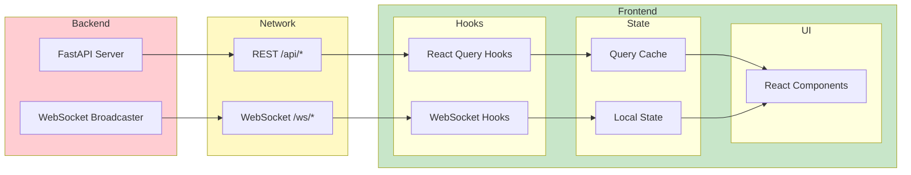

# Frontend Architecture Hub

> React-based dashboard for AI-powered home security monitoring with real-time WebSocket updates, Tremor data visualizations, and NVIDIA-themed dark UI

## Key Files

- `frontend/src/App.tsx:1-213` - Application root with routing and providers
- `frontend/src/components/layout/Layout.tsx:1-140` - Main layout with sidebar and header
- `frontend/src/services/queryClient.ts:1-873` - TanStack Query configuration
- `frontend/src/hooks/index.ts:1-942` - Custom hooks barrel export
- `frontend/tailwind.config.js:1-295` - NVIDIA-themed Tailwind configuration

## Overview

The frontend is a React 19 single-page application built with Vite, providing a real-time security monitoring dashboard. The architecture emphasizes:

1. **Real-time Updates**: WebSocket connections for live event streams and system status
2. **Server State Management**: TanStack Query (React Query) for caching, deduplication, and background refetching
3. **Component Modularity**: Feature-based component organization with shared common components
4. **NVIDIA Dark Theme**: Custom Tailwind configuration with NVIDIA green (#76B900) as primary color
5. **Accessibility**: WCAG 2.1 AA compliance with proper contrast ratios and ARIA attributes

## Component Architecture

```mermaid
graph TB
    subgraph App["App.tsx"]
        QCP[QueryClientProvider]
        TP[ToastProvider]
        AP[AnnouncementProvider]
        RLP[RateLimitProvider]
        BR[BrowserRouter]
    end

    subgraph Layout["Layout Component"]
        Header[Header]
        Sidebar[Sidebar]
        Main[Main Content]
        MBN[MobileBottomNav]
    end

    subgraph Pages["Page Components"]
        Dashboard[DashboardPage]
        Timeline[EventTimeline]
        Alerts[AlertsPage]
        Analytics[AnalyticsPage]
        AI[AIPerformancePage]
        Settings[SettingsPage]
    end

    subgraph Hooks["Custom Hooks"]
        WSHooks[WebSocket Hooks]
        QueryHooks[Query Hooks]
        UIHooks[UI Hooks]
    end

    subgraph Services["Services"]
        API[API Client]
        Logger[Structured Logger]
        QC[Query Client]
    end

    QCP --> TP
    TP --> AP
    AP --> RLP
    RLP --> BR
    BR --> Layout

    Layout --> Header
    Layout --> Sidebar
    Layout --> Main
    Layout --> MBN

    Main --> Pages
    Pages --> Hooks
    Hooks --> Services

    style App fill:#1A1A1A,stroke:#76B900
    style Layout fill:#1E1E1E,stroke:#76B900
    style Pages fill:#2A2A2A,stroke:#76B900
    style Hooks fill:#3A3A3A,stroke:#76B900
    style Services fill:#4A4A4A,stroke:#76B900
```



## Directory Structure

```
frontend/src/
  components/
    ai/               # AI performance and audit components
    ai-audit/         # AI audit dashboard components
    alerts/           # Alert management UI
    analytics/        # Analytics and charts
    audit/            # Audit log viewer
    common/           # Shared components (Button, Modal, etc.)
    dashboard/        # Main dashboard components
    entities/         # Entity tracking UI
    events/           # Event timeline components
    jobs/             # Background job monitoring
    layout/           # Layout, Header, Sidebar
    settings/         # Settings panels
    system/           # System monitoring
    zones/            # Zone management
  hooks/              # Custom React hooks (80+ hooks)
  services/           # API client, logger, query client
  contexts/           # React contexts (announcements, rate limit)
  pages/              # Page-level components
  types/              # TypeScript types (generated from OpenAPI)
  utils/              # Utility functions
  test/               # Test setup and factories
  mocks/              # MSW mock handlers
```

## Provider Hierarchy

The application wraps components in a specific provider order (`frontend/src/App.tsx:135-199`):

| Order | Provider                | Purpose                         |
| ----- | ----------------------- | ------------------------------- |
| 1     | `QueryClientProvider`   | TanStack Query for server state |
| 2     | `ToastProvider`         | Sonner toast notifications      |
| 3     | `AnnouncementProvider`  | ARIA live region announcements  |
| 4     | `RateLimitProvider`     | Rate limit state management     |
| 5     | `BrowserRouter`         | React Router DOM                |
| 6     | `ErrorBoundary`         | Global error catching           |
| 7     | `AmbientStatusProvider` | Visual/audio status awareness   |
| 8     | `Layout`                | Page layout structure           |

## Application Routes

| Path          | Component              | Description                       |
| ------------- | ---------------------- | --------------------------------- |
| `/`           | `DashboardPage`        | Real-time security monitoring     |
| `/timeline`   | `EventTimeline`        | Chronological event list          |
| `/alerts`     | `AlertsPage`           | Alert management                  |
| `/analytics`  | `AnalyticsPage`        | Detection trends and charts       |
| `/entities`   | `EntitiesPage`         | Entity re-identification tracking |
| `/ai`         | `AIPerformancePage`    | AI model performance metrics      |
| `/ai-audit`   | `AIAuditPage`          | AI decision auditing              |
| `/operations` | `SystemMonitoringPage` | System health and controls        |
| `/settings`   | `SettingsPage`         | Application configuration         |
| `/zones`      | `ZonesPage`            | Zone intelligence dashboard       |
| `/logs`       | `LogsPage`             | Application logs viewer           |
| `/audit`      | `AuditLogPage`         | Audit trail viewer                |
| `/jobs`       | `JobsPage`             | Background job monitoring         |

## Data Flow Architecture



## Technology Stack

| Category        | Technology         | Version        |
| --------------- | ------------------ | -------------- |
| Framework       | React              | 19.2.3         |
| Build Tool      | Vite               | 7.3.0          |
| Routing         | React Router DOM   | 7.11.0         |
| Server State    | TanStack Query     | 5.90.16        |
| UI Components   | Tremor             | 3.17.4         |
| Styling         | Tailwind CSS       | 3.4.1          |
| Icons           | Lucide React       | 0.562.0        |
| Animations      | Framer Motion      | 12.24.10       |
| Testing         | Vitest             | 4.0.16         |
| E2E Testing     | Playwright         | 1.57.0         |
| Type Generation | OpenAPI TypeScript | Auto-generated |

## Hub Documents

| Document                                        | Description                                                 |
| ----------------------------------------------- | ----------------------------------------------------------- |
| [Component Hierarchy](./component-hierarchy.md) | Page components, layout structure, and composition patterns |
| [State Management](./state-management.md)       | React Query patterns and local state management             |
| [Custom Hooks](./custom-hooks.md)               | useEvents, useWebSocket, useSystemStatus documentation      |
| [Styling Patterns](./styling-patterns.md)       | Tailwind CSS, Tremor components, dark theme                 |
| [Testing Patterns](./testing-patterns.md)       | Vitest, React Testing Library, and MSW patterns             |

## Related Documentation

- [Frontend Hooks Architecture](../frontend-hooks.md) - Detailed WebSocket hooks documentation
- [Real-time System](../real-time.md) - Backend WebSocket infrastructure
- [API Reference](../../developer/api/) - REST and WebSocket API documentation

---

_Last updated: 2026-01-24 - Initial frontend hub documentation for NEM-3462_
