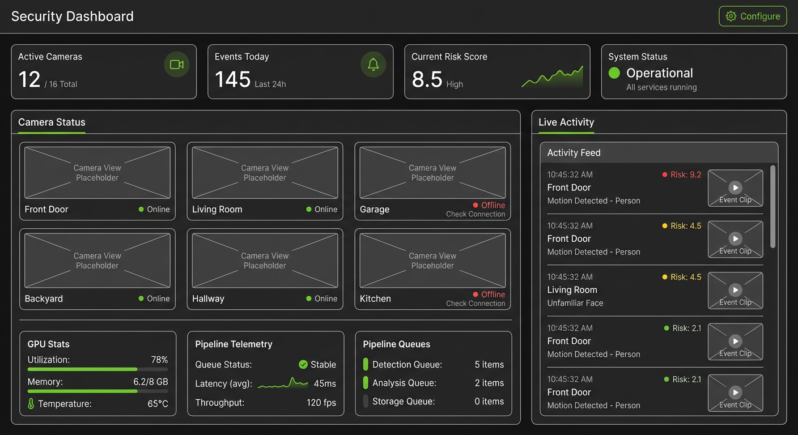

# Component Hierarchy

> Page components, layout structure, and React component composition patterns

## Key Files

- `frontend/src/App.tsx:29-111` - Lazy-loaded page component definitions
- `frontend/src/components/layout/Layout.tsx:1-140` - Main layout component
- `frontend/src/components/layout/Sidebar.tsx:1-321` - Navigation sidebar
- `frontend/src/components/layout/Header.tsx:1-386` - Application header
- `frontend/src/components/dashboard/DashboardPage.tsx:1-533` - Main dashboard

## Overview

The frontend follows a hierarchical component structure with clear separation between layout, page, and feature components. Components are organized by feature domain with shared components in a common directory. The architecture supports lazy loading for optimal initial bundle size.

## Component Tree

```mermaid
graph TB
    subgraph Root["Application Root"]
        App[App.tsx]
    end

    subgraph Providers["Context Providers"]
        QCP[QueryClientProvider]
        TP[ToastProvider]
        AP[AnnouncementProvider]
        RLP[RateLimitProvider]
        ASP[AmbientStatusProvider]
    end

    subgraph LayoutLayer["Layout Layer"]
        Layout[Layout]
        Header[Header]
        Sidebar[Sidebar]
        MBN[MobileBottomNav]
        Main[Main Content Area]
    end

    subgraph Pages["Page Components"]
        DP[DashboardPage]
        ET[EventTimeline]
        AP2[AlertsPage]
        ANP[AnalyticsPage]
        AIP[AIPerformancePage]
        SP[SettingsPage]
    end

    subgraph Features["Feature Components"]
        CG[CameraGrid]
        AF[ActivityFeed]
        GS[GpuStats]
        PT[PipelineTelemetry]
        SC[SummaryCards]
    end

    App --> Providers
    Providers --> Layout
    Layout --> Header
    Layout --> Sidebar
    Layout --> MBN
    Layout --> Main
    Main --> Pages
    DP --> Features

    style Root fill:#0E0E0E,stroke:#76B900
    style Providers fill:#1A1A1A,stroke:#76B900
    style LayoutLayer fill:#1E1E1E,stroke:#76B900
    style Pages fill:#2A2A2A,stroke:#76B900
    style Features fill:#3A3A3A,stroke:#76B900
```



## Layout Component

The `Layout` component (`frontend/src/components/layout/Layout.tsx:34-140`) provides the main application structure:

### Props Interface

```typescript
// frontend/src/components/layout/Layout.tsx:30-32
interface LayoutProps {
  children: ReactNode;
}
```

### Structure

```
Layout
  |- SkipLink                 # Accessibility: skip to main content
  |- Header                   # Top navigation bar
  |- flex container
  |    |- Sidebar            # Desktop navigation (hidden on mobile)
  |    |- Mobile Overlay     # Backdrop for mobile menu
  |    |- Main Content
  |         |- ConnectionStatusBanner
  |         |- ServiceStatusAlert
  |         |- {children}    # Page content
  |- CommandPalette          # Global command palette (Cmd+K)
  |- ShortcutsHelpModal      # Keyboard shortcuts help
  |- MobileBottomNav         # Mobile navigation (shown on mobile)
```

### Context Providers

The Layout component provides two React contexts:

| Context                 | Hook                         | Purpose                         |
| ----------------------- | ---------------------------- | ------------------------------- |
| `SidebarContext`        | `useSidebarContext()`        | Mobile sidebar open/close state |
| `CommandPaletteContext` | `useCommandPaletteContext()` | Command palette open state      |

## Page Components

Page components are lazy-loaded for code splitting (`frontend/src/App.tsx:29-111`):

### Lazy Loading Pattern

```typescript
// frontend/src/App.tsx:32-34
// Dashboard is loaded eagerly since it's the landing page
const DashboardPage = lazy(() => import('./components/dashboard/DashboardPage'));

// frontend/src/App.tsx:39-42
// Module re-export pattern for barrel exports
const AnalyticsPage = lazy(() =>
  import('./components/analytics').then((module) => ({ default: module.AnalyticsPage }))
);
```

### Page Component Structure

Each page component follows a consistent pattern:

```typescript
// Typical page component structure
function PageComponent() {
  // 1. Navigation hooks
  const navigate = useNavigate();

  // 2. Data hooks (React Query or WebSocket)
  const { data, isLoading, error } = useDataQuery();
  const { events, isConnected } = useEventStream();

  // 3. Local state
  const [filter, setFilter] = useState('');

  // 4. Derived state (useMemo)
  const filteredData = useMemo(() => /* ... */, [data, filter]);

  // 5. Event handlers (useCallback)
  const handleAction = useCallback(() => /* ... */, []);

  // 6. Effects for side effects
  useEffect(() => { /* initial load */ }, []);

  // 7. Loading state
  if (isLoading) return <LoadingSkeleton />;

  // 8. Error state
  if (error) return <ErrorDisplay error={error} />;

  // 9. Main render
  return <PageLayout>/* ... */</PageLayout>;
}
```

## Dashboard Page



The `DashboardPage` (`frontend/src/components/dashboard/DashboardPage.tsx:55-504`) is the main entry point:

### Component Composition

```mermaid
graph TB
    subgraph DashboardPage
        DL[DashboardLayout]

        subgraph Widgets
            SR[StatsRow]
            ASR[AIPerformanceSummaryRow]
            CG[CameraGrid]
            AF[ActivityFeed]
            GS[GpuStats]
            PT[PipelineTelemetry]
            PQ[PipelineQueues]
            SC[SummaryCards]
        end
    end

    DL --> SR
    DL --> ASR
    DL --> CG
    DL --> AF
    DL --> GS
    DL --> PT
    DL --> PQ
    AF --> SC

    style DashboardPage fill:#1A1A1A,stroke:#76B900
    style Widgets fill:#2A2A2A,stroke:#76B900
```



### Hooks Used

| Hook                     | Purpose                   | Source                                       |
| ------------------------ | ------------------------- | -------------------------------------------- |
| `useEventStream()`       | Real-time security events | `frontend/src/hooks/useEventStream.ts:63`    |
| `useSystemStatus()`      | System health updates     | `frontend/src/hooks/useSystemStatus.ts:50`   |
| `useRecentEventsQuery()` | Initial events fetch      | `frontend/src/hooks/useRecentEventsQuery.ts` |
| `useSummaries()`         | Hourly/daily summaries    | `frontend/src/hooks/useSummaries.ts`         |
| `useAIMetrics()`         | AI performance data       | `frontend/src/hooks/useAIMetrics.ts`         |
| `useDateRangeState()`    | Date filter state         | `frontend/src/hooks/useDateRangeState.ts`    |
| `useThrottledValue()`    | Throttle WS updates       | `frontend/src/hooks/useThrottledValue.ts`    |

### Render Props Pattern

The `DashboardLayout` uses render props for widget customization:

```typescript
// frontend/src/components/dashboard/DashboardPage.tsx:365-501
<DashboardLayout
  widgetProps={{
    statsRow: { /* props */ },
    cameraGrid: { /* props */ },
    activityFeed: { /* props */ },
  }}
  renderStatsRow={(props) => <StatsRow {...props} />}
  renderCameraGrid={(props) => <CameraGrid {...props} />}
  renderActivityFeed={(props) => <ActivityFeed {...props} />}
/>
```

## Sidebar Navigation

The `Sidebar` component (`frontend/src/components/layout/Sidebar.tsx:1-321`) provides hierarchical navigation:

### Navigation Groups

```typescript
// frontend/src/components/layout/sidebarNav.ts
export const navGroups: NavGroup[] = [
  {
    id: 'monitoring',
    label: 'Monitoring',
    defaultExpanded: true,
    items: [
      { id: 'dashboard', path: '/', label: 'Dashboard', icon: LayoutDashboard },
      { id: 'timeline', path: '/timeline', label: 'Timeline', icon: Clock },
      // ...
    ],
  },
  // ...
];
```

### State Persistence

Sidebar expansion state is persisted to localStorage:

```typescript
// frontend/src/components/layout/Sidebar.tsx:14-24
function loadExpansionState(): Record<string, boolean> {
  try {
    const stored = localStorage.getItem(STORAGE_KEY);
    if (stored) {
      return JSON.parse(stored) as Record<string, boolean>;
    }
  } catch {
    // Ignore parse errors
  }
  return {};
}
```

## Common Components

Shared components in `frontend/src/components/common/`:

### UI Components

| Component        | File                 | Purpose                     |
| ---------------- | -------------------- | --------------------------- |
| `Button`         | `Button.tsx`         | Styled button with variants |
| `IconButton`     | `IconButton.tsx`     | Icon-only button            |
| `Skeleton`       | `Skeleton.tsx`       | Loading placeholder         |
| `EmptyState`     | `EmptyState.tsx`     | Empty data display          |
| `LoadingSpinner` | `LoadingSpinner.tsx` | Loading indicator           |
| `Tooltip`        | `Tooltip.tsx`        | Hover tooltips              |

### Feedback Components

| Component                | File                         | Purpose                |
| ------------------------ | ---------------------------- | ---------------------- |
| `ToastProvider`          | `ToastProvider.tsx`          | Sonner toast container |
| `ErrorBoundary`          | `ErrorBoundary.tsx`          | Error catching         |
| `FeatureErrorBoundary`   | `FeatureErrorBoundary.tsx`   | Feature-level errors   |
| `ConnectionStatusBanner` | `ConnectionStatusBanner.tsx` | WebSocket status       |
| `ServiceStatusAlert`     | `ServiceStatusAlert.tsx`     | Service health alerts  |

### Badge Components

| Component         | File                  | Purpose               |
| ----------------- | --------------------- | --------------------- |
| `RiskBadge`       | `RiskBadge.tsx`       | Risk level indicator  |
| `AlertBadge`      | `AlertBadge.tsx`      | Alert count badge     |
| `ConfidenceBadge` | `ConfidenceBadge.tsx` | AI confidence display |
| `ObjectTypeBadge` | `ObjectTypeBadge.tsx` | Detection type badge  |

## Error Boundary Pattern

Components use `FeatureErrorBoundary` for graceful degradation:

```typescript
// frontend/src/components/dashboard/DashboardPage.tsx:513-531
function DashboardPageWithErrorBoundary() {
  return (
    <FeatureErrorBoundary
      feature="Dashboard"
      fallback={
        <div className="flex min-h-screen flex-col items-center justify-center bg-[#121212] p-8">
          <AlertTriangle className="mb-4 h-12 w-12 text-red-400" />
          <h3 className="mb-2 text-lg font-semibold text-red-400">Dashboard Unavailable</h3>
          <p className="max-w-md text-center text-sm text-gray-400">
            Unable to load the security dashboard. Please refresh the page or try again later.
          </p>
        </div>
      }
    >
      <DashboardPage />
    </FeatureErrorBoundary>
  );
}
```

## Component Patterns

### Compound Components

For complex UI with related parts:

```typescript
// Example: SummaryCards compound component
<SummaryCards>
  <SummaryCards.Hourly data={hourly} />
  <SummaryCards.Daily data={daily} />
</SummaryCards>
```

### Controlled Components

Form elements with controlled state:

```typescript
// Pattern for filter inputs
function FilterInput({ value, onChange }: FilterInputProps) {
  return (
    <input
      type="text"
      value={value}
      onChange={(e) => onChange(e.target.value)}
      className="..."
    />
  );
}
```

### Render Props

For customizable rendering:

```typescript
// DashboardLayout render props pattern
interface DashboardLayoutProps {
  widgetProps: WidgetProps;
  renderStatsRow: (props: StatsRowProps) => ReactNode;
  renderCameraGrid: (props: CameraGridProps) => ReactNode;
}
```

## Mobile Responsiveness

Components adapt to mobile viewports:

### Layout Breakpoints

| Breakpoint | Width          | Behavior                   |
| ---------- | -------------- | -------------------------- |
| Mobile     | < 768px        | Bottom nav, hidden sidebar |
| Tablet     | 768px - 1024px | Collapsible sidebar        |
| Desktop    | > 1024px       | Fixed sidebar              |

### Mobile-Specific Components

- `MobileBottomNav` - Bottom navigation bar for mobile
- `BottomSheet` - Slide-up modal for mobile
- Sidebar transforms to overlay on mobile

```typescript
// frontend/src/components/layout/Layout.tsx:88-99
{/* Hide sidebar on mobile, show MobileBottomNav instead */}
{!isMobile && <Sidebar />}

{/* Mobile overlay backdrop */}
{isMobileMenuOpen && (
  <div
    className="fixed inset-0 z-30 bg-black/50 md:hidden"
    onClick={() => setMobileMenuOpen(false)}
    aria-hidden="true"
    data-testid="mobile-overlay"
  />
)}
```

## Related Documentation

- [State Management](./state-management.md) - React Query and local state patterns
- [Custom Hooks](./custom-hooks.md) - Hook documentation
- [Styling Patterns](./styling-patterns.md) - Component styling

---

_Last updated: 2026-01-24 - Initial component hierarchy documentation for NEM-3462_
