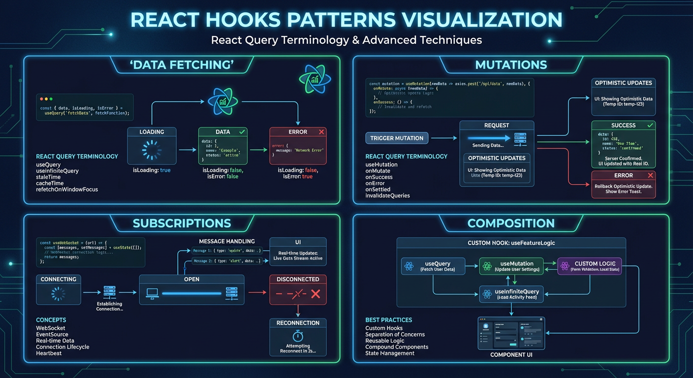
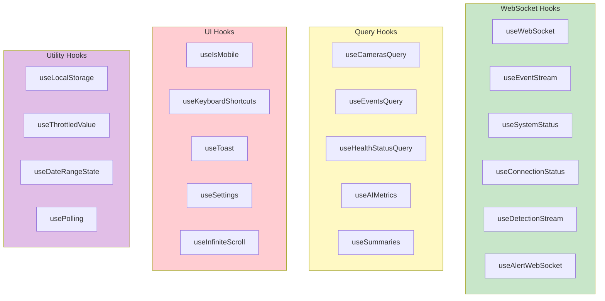
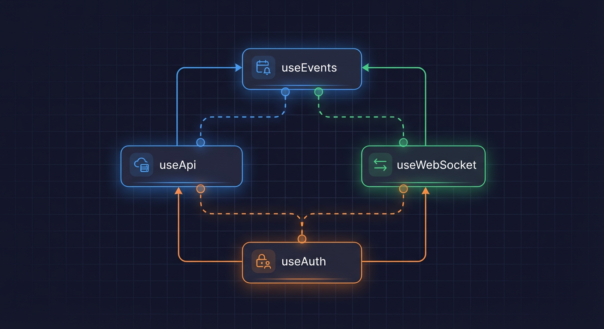

# Custom Hooks



> Documentation for useEvents, useWebSocket, useSystemStatus, and other custom React hooks

## Key Files

- `frontend/src/hooks/useWebSocket.ts:1-208` - Base WebSocket hook
- `frontend/src/hooks/useEventStream.ts:1-264` - Security event stream
- `frontend/src/hooks/useSystemStatus.ts:1-138` - System health status
- `frontend/src/hooks/useConnectionStatus.ts:1-386` - Connection state aggregation
- `frontend/src/hooks/index.ts:1-658` - Barrel export of all hooks

## Overview

The frontend uses custom React hooks extensively for data fetching, WebSocket connections, and state management. The hooks follow consistent patterns for error handling, loading states, and cleanup. With over 80 hooks, they are organized into categories: WebSocket hooks, Query hooks, UI hooks, and utility hooks.

## Hook Categories



## WebSocket Hooks

### useWebSocket

Base WebSocket hook with reconnection and heartbeat support (`frontend/src/hooks/useWebSocket.ts:56-205`).

#### Interface

```typescript
// frontend/src/hooks/useWebSocket.ts:13-38
export interface WebSocketOptions {
  url: string;
  protocols?: string[]; // Sec-WebSocket-Protocol for auth
  onMessage?: (data: unknown) => void;
  onOpen?: () => void;
  onClose?: () => void;
  onError?: (error: Event) => void;
  onMaxRetriesExhausted?: () => void;
  onHeartbeat?: () => void;
  reconnect?: boolean;
  reconnectInterval?: number;
  reconnectAttempts?: number;
  connectionTimeout?: number;
  autoRespondToHeartbeat?: boolean;
}

// frontend/src/hooks/useWebSocket.ts:40-54
export interface UseWebSocketReturn {
  isConnected: boolean;
  lastMessage: unknown;
  send: (data: unknown) => void;
  connect: () => void;
  disconnect: () => void;
  hasExhaustedRetries: boolean;
  reconnectCount: number;
  lastHeartbeat: Date | null;
  connectionId: string;
}
```

#### Usage

```typescript
import { useWebSocket } from '@/hooks';

function MyComponent() {
  const { isConnected, send, lastMessage } = useWebSocket({
    url: 'ws://localhost:8000/ws/events',
    onMessage: (data) => console.log('Received:', data),
    reconnect: true,
    reconnectAttempts: 15,
    reconnectInterval: 1000,
  });

  return (
    <div>
      <span>Status: {isConnected ? 'Connected' : 'Disconnected'}</span>
      <button onClick={() => send({ type: 'ping' })}>Send Ping</button>
    </div>
  );
}
```

#### Features

| Feature             | Default | Description                             |
| ------------------- | ------- | --------------------------------------- |
| Auto-reconnect      | `true`  | Automatically reconnect on disconnect   |
| Exponential backoff | 1s base | Delay doubles with each retry (max 30s) |
| Max attempts        | 15      | ~8+ minutes of retry with backoff       |
| Connection timeout  | 10s     | Close and retry if connection hangs     |
| Heartbeat response  | `true`  | Automatically respond to server pings   |

### useEventStream

Real-time security event stream with deduplication (`frontend/src/hooks/useEventStream.ts:63-264`).

#### Interface

```typescript
// frontend/src/hooks/useEventStream.ts:26-33
export interface UseEventStreamReturn {
  events: SecurityEvent[];
  isConnected: boolean;
  latestEvent: SecurityEvent | null;
  clearEvents: () => void;
  sequenceStats: SequenceStatistics;
}
```

#### Usage

```typescript
import { useEventStream } from '@/hooks';

function EventList() {
  const { events, isConnected, latestEvent, clearEvents } = useEventStream();

  return (
    <div>
      <header>
        <span>{isConnected ? 'Live' : 'Offline'}</span>
        <button onClick={clearEvents}>Clear</button>
      </header>
      <ul>
        {events.map((event) => (
          <li key={event.id}>
            {event.summary} - Risk: {event.risk_score}
          </li>
        ))}
      </ul>
    </div>
  );
}
```

#### Features

- **LRU Cache Deduplication**: Prevents duplicate events using an LRU cache (`frontend/src/hooks/useEventStream.ts:72-77`)
- **Sequence Validation**: Ensures events are processed in order (`frontend/src/hooks/useEventStream.ts:83-104`)
- **Event Limit**: Keeps only the most recent 100 events (`frontend/src/hooks/useEventStream.ts:35`)
- **Memory Management**: Automatic cleanup of seen event IDs

### useSystemStatus

System health and GPU metrics via WebSocket (`frontend/src/hooks/useSystemStatus.ts:50-138`).

#### Interface

```typescript
// frontend/src/hooks/useSystemStatus.ts:18-27
export interface SystemStatus {
  health: 'healthy' | 'degraded' | 'unhealthy';
  gpu_utilization: number | null;
  gpu_temperature: number | null;
  gpu_memory_used: number | null;
  gpu_memory_total: number | null;
  inference_fps: number | null;
  active_cameras: number;
  last_update: string;
}

// frontend/src/hooks/useSystemStatus.ts:29-32
export interface UseSystemStatusReturn {
  status: SystemStatus | null;
  isConnected: boolean;
}
```

#### Usage

```typescript
import { useSystemStatus } from '@/hooks';

function SystemPanel() {
  const { status, isConnected } = useSystemStatus();

  if (!status) return <LoadingSpinner />;

  return (
    <div>
      <Badge color={status.health === 'healthy' ? 'green' : 'red'}>
        {status.health}
      </Badge>
      <Metric>GPU: {status.gpu_utilization ?? 'N/A'}%</Metric>
      <Metric>FPS: {status.inference_fps ?? 'N/A'}</Metric>
    </div>
  );
}
```

#### Features

- **Initial REST Fetch**: Fetches initial status via REST to avoid "Unknown" state (`frontend/src/hooks/useSystemStatus.ts:58-88`)
- **Type Guards**: Validates WebSocket message types (`frontend/src/hooks/useSystemStatus.ts:90-122`)
- **Data Transformation**: Flattens nested WebSocket structure (`frontend/src/hooks/useSystemStatus.ts:37-48`)

### useConnectionStatus

Aggregates connection status across multiple WebSocket channels (`frontend/src/hooks/useConnectionStatus.ts:117-386`).

#### Interface

```typescript
// frontend/src/hooks/useConnectionStatus.ts:38-51
export interface ConnectionStatusSummary {
  eventsChannel: ChannelStatus;
  systemChannel: ChannelStatus;
  overallState: ConnectionState;
  anyReconnecting: boolean;
  allConnected: boolean;
  totalReconnectAttempts: number;
  hasExhaustedRetries: boolean;
  allFailed: boolean;
  disconnectedSince: Date | null;
}

// frontend/src/hooks/useConnectionStatus.ts:53-62
export interface UseConnectionStatusReturn {
  summary: ConnectionStatusSummary;
  events: SecurityEvent[];
  systemStatus: BackendSystemStatus | null;
  clearEvents: () => void;
  isPollingFallback: boolean;
  retryConnection: () => void;
}
```

#### Features

- **Multi-channel Monitoring**: Tracks both events and system WebSocket channels
- **REST Fallback**: Polls REST API when WebSocket fails (`frontend/src/hooks/useConnectionStatus.ts:147-236`)
- **Auto-recovery**: Automatically reconnects when backend becomes available
- **Disconnection Tracking**: Records when disconnection started

## Query Hooks

### useEventsInfiniteQuery

Infinite scrolling events with cursor-based pagination.

```typescript
// frontend/src/hooks/useEventsQuery.ts
export interface UseEventsInfiniteQueryOptions {
  filters?: EventFilters;
  pageSize?: number;
  enabled?: boolean;
}

// Usage
const { data, fetchNextPage, hasNextPage, isFetching } = useEventsInfiniteQuery({
  filters: { camera_id: 'cam-1', risk_level: 'high' },
  pageSize: 20,
});
```

### useCamerasQuery

Camera list and individual camera data.

```typescript
// frontend/src/hooks/useCamerasQuery.ts
export function useCamerasQuery(options?: UseCamerasQueryOptions): UseCamerasQueryReturn;
export function useCameraQuery(id: string, options?: UseCameraQueryOptions): UseCameraQueryReturn;
export function useCameraMutation(): UseCameraMutationReturn;

// Usage
const { cameras, isLoading, error } = useCamerasQuery();
const { camera, isLoading } = useCameraQuery('camera-1');
const { mutate: updateCamera } = useCameraMutation();
```

### useHealthStatusQuery

System health with polling support.

```typescript
// frontend/src/hooks/useHealthStatusQuery.ts
export interface UseHealthStatusQueryOptions {
  staleTime?: number;
  pollingInterval?: number;
  enabled?: boolean;
}

// Usage
const { data: health, isLoading } = useHealthStatusQuery({
  pollingInterval: 5000, // Poll every 5 seconds
});
```

### useSummaries

Dashboard hourly and daily summaries.

```typescript
// frontend/src/hooks/useSummaries.ts
export interface UseSummariesOptions {
  enabled?: boolean;
  staleTime?: number;
}

// Usage
const { hourly, daily, isLoading, error, refetch } = useSummaries();
```

## UI Hooks

### useIsMobile

Responsive breakpoint detection.

```typescript
// frontend/src/hooks/useIsMobile.ts
export function useIsMobile(): boolean;

// Usage
const isMobile = useIsMobile();
return isMobile ? <MobileLayout /> : <DesktopLayout />;
```

### useKeyboardShortcuts

Global keyboard shortcut handling.

```typescript
// frontend/src/hooks/useKeyboardShortcuts.ts
export interface UseKeyboardShortcutsOptions {
  shortcuts: Record<string, () => void>;
  enabled?: boolean;
}

// Usage
useKeyboardShortcuts({
  shortcuts: {
    'cmd+k': () => setCommandPaletteOpen(true),
    escape: () => setModalOpen(false),
    '?': () => setHelpOpen(true),
  },
});
```

### useToast

Toast notification management.

```typescript
// frontend/src/hooks/useToast.ts
export interface UseToastReturn {
  toast: (options: ToastOptions) => void;
  success: (message: string) => void;
  error: (message: string) => void;
  warning: (message: string) => void;
  promise: <T>(promise: Promise<T>, messages: PromiseMessages) => Promise<T>;
}

// Usage
const { toast, success, error, promise } = useToast();

success('Camera added successfully');
error('Failed to connect to server');
promise(saveData(), {
  loading: 'Saving...',
  success: 'Saved!',
  error: 'Failed to save',
});
```

### useInfiniteScroll

Intersection Observer-based infinite scroll.

```typescript
// frontend/src/hooks/useInfiniteScroll.ts
export interface UseInfiniteScrollOptions {
  hasMore: boolean;
  isLoading: boolean;
  onLoadMore: () => void;
  threshold?: number;
  rootMargin?: string;
}

// Usage
const { ref: loadMoreRef } = useInfiniteScroll({
  hasMore,
  isLoading: isFetchingNextPage,
  onLoadMore: () => fetchNextPage(),
  rootMargin: '200px',
});

return (
  <div>
    {items.map(item => <Item key={item.id} {...item} />)}
    <div ref={loadMoreRef} /> {/* Trigger element */}
  </div>
);
```

## Utility Hooks

### useLocalStorage

Persistent localStorage state.

```typescript
// frontend/src/hooks/useLocalStorage.ts
export function useLocalStorage<T>(key: string, initialValue: T): [T, (value: T) => void];

// Usage
const [theme, setTheme] = useLocalStorage('theme', 'dark');
const [settings, setSettings] = useLocalStorage('dashboard-settings', defaultSettings);
```

### useThrottledValue

Throttle rapidly changing values.

```typescript
// frontend/src/hooks/useThrottledValue.ts
export interface UseThrottledValueOptions {
  interval: number;
}

// Usage - Throttle WebSocket events to reduce re-renders
const throttledEvents = useThrottledValue(wsEvents, { interval: 500 });
const throttledStatus = useThrottledValue(systemStatus, { interval: 500 });
```

### useDateRangeState

Date range with URL persistence.

```typescript
// frontend/src/hooks/useDateRangeState.ts
export interface UseDateRangeStateReturn {
  preset: DateRangePreset;
  setPreset: (preset: DateRangePreset) => void;
  range: DateRange;
  apiParams: DateRangeApiParams;
}

// Usage
const { preset, setPreset, apiParams } = useDateRangeState({
  defaultPreset: 'today',
  persistToUrl: true,
});

// apiParams contains { start_date, end_date } for API calls
```

### usePolling

Configurable polling with pause/resume.

```typescript
// frontend/src/hooks/usePolling.ts
export interface UsePollingOptions<T> {
  fn: () => Promise<T>;
  interval: number;
  enabled?: boolean;
  onSuccess?: (data: T) => void;
  onError?: (error: Error) => void;
}

// Usage
const { data, isPolling, pause, resume } = usePolling({
  fn: fetchSystemMetrics,
  interval: 5000,
  enabled: isActive,
});
```

## Hook Composition Pattern



Hooks are designed to be composed together:

```typescript
// frontend/src/components/dashboard/DashboardPage.tsx:89-116
function DashboardPage() {
  // WebSocket hooks for real-time data
  const { events: wsEvents, isConnected: eventsConnected } = useEventStream();
  const { status: systemStatus, isConnected: systemConnected } = useSystemStatus();

  // Query hooks for initial data
  const { events: initialEvents, isLoading: eventsLoading } = useRecentEventsQuery({
    limit: 50,
    staleTime: 30000,
  });

  // Summary data
  const { hourly, daily, isLoading: summariesLoading } = useSummaries();

  // AI metrics with polling
  const { data: aiMetrics } = useAIMetrics({
    pollingInterval: 5000,
    enablePolling: true,
  });

  // Throttle WebSocket updates to reduce re-renders
  const throttledWsEvents = useThrottledValue(wsEvents, { interval: 500 });
  const throttledSystemStatus = useThrottledValue(systemStatus, { interval: 500 });

  // Merge WebSocket events with initial events
  const mergedEvents = useMemo(() => {
    // ... deduplication logic
  }, [throttledWsEvents, initialEvents]);
}
```

## Testing Hooks

Hooks are tested using `@testing-library/react`:

```typescript
// Example hook test
import { renderHook, waitFor } from '@testing-library/react';
import { useEventStream } from './useEventStream';

describe('useEventStream', () => {
  it('should initialize with empty events', () => {
    const { result } = renderHook(() => useEventStream(), {
      wrapper: TestWrapper,
    });

    expect(result.current.events).toEqual([]);
    expect(result.current.isConnected).toBe(false);
  });

  it('should add events from WebSocket messages', async () => {
    const { result } = renderHook(() => useEventStream(), {
      wrapper: TestWrapper,
    });

    // Simulate WebSocket message
    mockWebSocket.emit('message', {
      type: 'event',
      data: mockSecurityEvent,
    });

    await waitFor(() => {
      expect(result.current.events).toHaveLength(1);
    });
  });
});
```

## Related Documentation

- [Frontend Hooks Architecture](../frontend-hooks.md) - Detailed hook implementation
- [State Management](./state-management.md) - React Query configuration
- [Testing Patterns](./testing-patterns.md) - Hook testing patterns

---

_Last updated: 2026-01-24 - Initial custom hooks documentation for NEM-3462_
