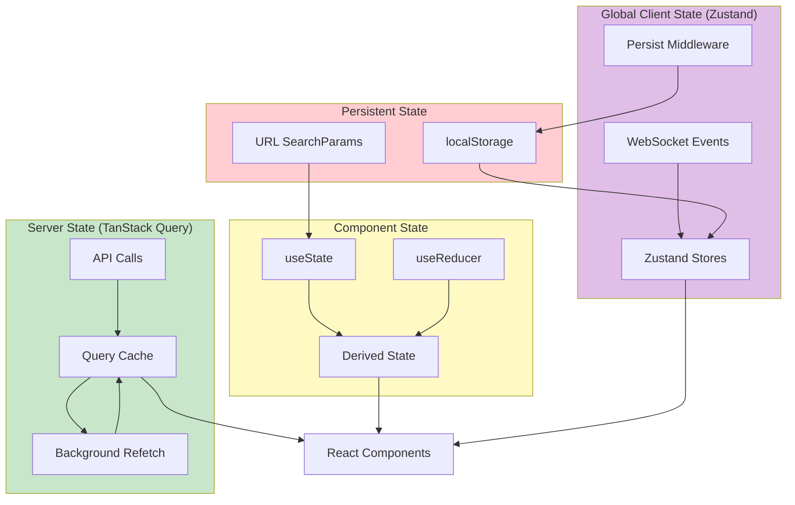

# State Management

> React Query patterns for server state and local state management strategies

## Key Files

- `frontend/src/services/queryClient.ts:1-848` - TanStack Query configuration
- `frontend/src/hooks/useLocalStorage.ts:1-45` - Local storage persistence
- `frontend/src/stores/index.ts` - Centralized Zustand store exports
- `frontend/src/stores/middleware.ts` - Zustand middleware utilities (Immer, DevTools)
- `frontend/src/contexts/AnnouncementContext.tsx:1-60` - ARIA announcement context

### Zustand Stores

| Store                       | Purpose                                             |
| --------------------------- | --------------------------------------------------- |
| `rate-limit-store.ts`       | Rate limit info from API headers, auto-clear timers |
| `settings-store.ts`         | User preferences (audio, notifications, favicon)    |
| `dashboard-config-store.ts` | Dashboard widget visibility, order, theme settings  |
| `prometheus-alert-store.ts` | Prometheus alert state for monitoring dashboard     |
| `realtime-metrics-store.ts` | GPU metrics, pipeline metrics, inference metrics    |
| `storage-status-store.ts`   | Storage usage warnings and status                   |
| `worker-status-store.ts`    | AI pipeline worker health status                    |

## Overview

The frontend separates state into four categories:

1. **Server State**: Managed by TanStack Query (React Query) for API data with caching, background refetching, and optimistic updates
2. **Client State**: React's useState/useReducer for UI state (modals, filters, form inputs)
3. **Global Client State**: Managed by Zustand stores for cross-component state (rate limits, settings, metrics)
4. **Persistent State**: localStorage for user preferences via Zustand persist middleware or custom hooks

This separation ensures predictable data flow and prevents common pitfalls like stale data, race conditions, and unnecessary re-renders.

## TanStack Query Configuration

### Query Client Setup

The query client (`frontend/src/services/queryClient.ts:735-810`) provides optimized defaults:

```typescript
// frontend/src/services/queryClient.ts:750-809
export function createQueryClient(): QueryClient {
  return new QueryClient({
    defaultOptions: {
      queries: {
        staleTime: DEFAULT_STALE_TIME, // 30 seconds
        gcTime: 5 * 60 * 1000, // 5 minutes garbage collection
        refetchOnWindowFocus: false, // Explicit polling preferred
        refetchOnReconnect: true,
        retry: (failureCount, error) => shouldRetryQuery(failureCount, error),
        retryDelay: (attemptIndex, error) => calculateRetryDelay(attemptIndex, error),
      },
      mutations: {
        retry: (failureCount, error) => shouldRetryMutation(failureCount, error),
        retryDelay: (attemptIndex, error) => calculateRetryDelay(attemptIndex, error),
      },
    },
  });
}
```

### Stale Time Constants

Different data types have different freshness requirements (`frontend/src/services/queryClient.ts:36-54`):

| Constant              | Duration   | Use Case                            |
| --------------------- | ---------- | ----------------------------------- |
| `REALTIME_STALE_TIME` | 5 seconds  | GPU metrics, health status          |
| `DEFAULT_STALE_TIME`  | 30 seconds | Events, detections                  |
| `STATIC_STALE_TIME`   | 5 minutes  | Configuration, severity definitions |

### Retry Logic

Queries and mutations have different retry strategies:

```typescript
// frontend/src/services/queryClient.ts:171-180
// Queries: Retry transient errors (timeouts, rate limits, service unavailable)
export function shouldRetryQuery(failureCount: number, error: unknown): boolean {
  if (failureCount >= MAX_RETRY_ATTEMPTS) return false;
  return shouldRetry(error); // Checks error codes and HTTP status
}

// frontend/src/services/queryClient.ts:199-228
// Mutations: Only retry timeout errors (prevents duplicate side effects)
export function shouldRetryMutation(failureCount: number, error: unknown): boolean {
  if (failureCount >= MAX_RETRY_ATTEMPTS) return false;
  if (isTimeoutError(error)) return true;
  // Only retry timeout-related error codes
  return MUTATION_SAFE_RETRY_CODES.has(errorCode);
}
```

### Retry Delay with Exponential Backoff

```typescript
// frontend/src/services/queryClient.ts:127-152
export function calculateRetryDelay(attemptIndex: number, error: unknown): number {
  // Respect Retry-After header from rate limit responses
  if (error?.problemDetails?.retry_after > 0) {
    return Math.min(error.problemDetails.retry_after * 1000, MAX_RETRY_DELAY_MS);
  }
  // Exponential backoff: 1s, 2s, 4s
  return Math.min(Math.pow(2, attemptIndex) * RETRY_BASE_DELAY_MS, MAX_RETRY_DELAY_MS);
}
```

## Query Key Factories

Hierarchical query keys enable granular cache invalidation (`frontend/src/services/queryClient.ts:320-714`):

```typescript
// frontend/src/services/queryClient.ts:320-392
export const queryKeys = {
  cameras: {
    all: ['cameras'] as const,
    list: () => [...queryKeys.cameras.all, 'list'] as const,
    detail: (id: string) => [...queryKeys.cameras.all, 'detail', id] as const,
  },
  events: {
    all: ['events'] as const,
    list: (filters?: EventsQueryParams) =>
      filters
        ? ([...queryKeys.events.all, 'list', filters] as const)
        : ([...queryKeys.events.all, 'list'] as const),
    detail: (id: number) => [...queryKeys.events.all, 'detail', id] as const,
  },
  // ... more key factories
};
```

### Cache Invalidation Patterns

```typescript
// Invalidate all camera queries
queryClient.invalidateQueries({ queryKey: queryKeys.cameras.all });

// Invalidate specific camera only
queryClient.invalidateQueries({ queryKey: queryKeys.cameras.detail('cam-1') });

// Invalidate all events (preserves camera cache)
queryClient.invalidateQueries({ queryKey: queryKeys.events.all });

// Invalidate filtered event list
queryClient.invalidateQueries({
  queryKey: queryKeys.events.list({ camera_id: 'cam-1' }),
});
```

## Query Hook Patterns

### Basic Query Hook

```typescript
// frontend/src/hooks/useHealthStatusQuery.ts
export function useHealthStatusQuery(options?: UseHealthStatusQueryOptions) {
  return useQuery({
    queryKey: queryKeys.system.health,
    queryFn: fetchHealth,
    staleTime: options?.staleTime ?? REALTIME_STALE_TIME,
    refetchInterval: options?.pollingInterval,
    enabled: options?.enabled ?? true,
  });
}
```

### Infinite Query Hook

For paginated data with cursor-based pagination:

```typescript
// frontend/src/hooks/useEventsQuery.ts
export function useEventsInfiniteQuery(options?: UseEventsInfiniteQueryOptions) {
  return useInfiniteQuery({
    queryKey: eventsQueryKeys.list(options?.filters),
    queryFn: ({ pageParam }) =>
      fetchEvents({
        ...options?.filters,
        cursor: pageParam,
        limit: options?.pageSize ?? 20,
      }),
    initialPageParam: undefined as string | undefined,
    getNextPageParam: (lastPage) => lastPage.next_cursor,
    staleTime: DEFAULT_STALE_TIME,
  });
}
```

### Mutation Hook with Optimistic Updates

```typescript
// Pattern for optimistic updates
export function useCameraMutation() {
  const queryClient = useQueryClient();

  return useMutation({
    mutationFn: updateCamera,
    onMutate: async (newData) => {
      // Cancel outgoing refetches
      await queryClient.cancelQueries({ queryKey: queryKeys.cameras.all });

      // Snapshot current value
      const previous = queryClient.getQueryData(queryKeys.cameras.detail(newData.id));

      // Optimistically update
      queryClient.setQueryData(queryKeys.cameras.detail(newData.id), newData);

      return { previous };
    },
    onError: (err, variables, context) => {
      // Rollback on error
      queryClient.setQueryData(queryKeys.cameras.detail(variables.id), context?.previous);
    },
    onSettled: () => {
      // Refetch after mutation
      queryClient.invalidateQueries({ queryKey: queryKeys.cameras.all });
    },
  });
}
```

## Local State Patterns

### useState for UI State

```typescript
// Modal state
const [isOpen, setIsOpen] = useState(false);

// Filter state
const [filter, setFilter] = useState<FilterState>({
  camera: null,
  riskLevel: null,
  dateRange: 'today',
});

// Form state
const [formData, setFormData] = useState<FormData>(initialFormData);
```

### useReducer for Complex State

```typescript
// Complex filter state with reducer
type FilterAction =
  | { type: 'SET_CAMERA'; camera: string | null }
  | { type: 'SET_RISK_LEVEL'; level: RiskLevel | null }
  | { type: 'RESET' };

function filterReducer(state: FilterState, action: FilterAction): FilterState {
  switch (action.type) {
    case 'SET_CAMERA':
      return { ...state, camera: action.camera };
    case 'SET_RISK_LEVEL':
      return { ...state, riskLevel: action.level };
    case 'RESET':
      return initialFilterState;
    default:
      return state;
  }
}

const [filters, dispatch] = useReducer(filterReducer, initialFilterState);
```

### useMemo for Derived State

```typescript
// frontend/src/components/dashboard/DashboardPage.tsx:160-178
const mergedEvents: SecurityEvent[] = useMemo(() => {
  const wsEventIds = new Set(throttledWsEvents.map((e) => String(e.id)));
  const initialSecurityEvents = initialEvents
    .filter((event) => !wsEventIds.has(String(event.id)))
    .map((event) => ({
      id: event.id,
      camera_id: event.camera_id,
      risk_score: event.risk_score ?? 0,
      risk_level: (event.risk_level as SecurityEvent['risk_level']) ?? 'low',
      summary: event.summary ?? '',
      started_at: event.started_at,
    }));
  return [...throttledWsEvents, ...initialSecurityEvents];
}, [throttledWsEvents, initialEvents]);
```

## Persistent State

### useLocalStorage Hook

```typescript
// frontend/src/hooks/useLocalStorage.ts
export function useLocalStorage<T>(
  key: string,
  initialValue: T
): [T, (value: T | ((val: T) => T)) => void] {
  const [storedValue, setStoredValue] = useState<T>(() => {
    try {
      const item = window.localStorage.getItem(key);
      return item ? JSON.parse(item) : initialValue;
    } catch {
      return initialValue;
    }
  });

  const setValue = useCallback(
    (value: T | ((val: T) => T)) => {
      const valueToStore = value instanceof Function ? value(storedValue) : value;
      setStoredValue(valueToStore);
      window.localStorage.setItem(key, JSON.stringify(valueToStore));
    },
    [key, storedValue]
  );

  return [storedValue, setValue];
}
```

### URL State Persistence

```typescript
// frontend/src/hooks/useDateRangeState.ts
export function useDateRangeState(options?: UseDateRangeStateOptions) {
  const [searchParams, setSearchParams] = useSearchParams();

  // Read from URL or use default
  const preset = (searchParams.get('range') as DateRangePreset) || options?.defaultPreset;

  // Update URL when preset changes
  const setPreset = useCallback(
    (newPreset: DateRangePreset) => {
      setSearchParams((prev) => {
        const next = new URLSearchParams(prev);
        next.set('range', newPreset);
        return next;
      });
    },
    [setSearchParams]
  );

  return { preset, setPreset, apiParams: calculatePresetRange(preset) };
}
```

## Zustand Store Patterns

The project uses Zustand 5 with middleware for global client state. All stores follow consistent patterns:

- **DevTools middleware** for debugging in development
- **useShallow hooks** for selective subscriptions and re-render optimization
- **Immer middleware** for immutable updates (where needed)
- **Persist middleware** for localStorage persistence (settings, dashboard config)

### Rate Limit Store

Tracks API rate limit headers with auto-clear behavior:

```typescript
// frontend/src/stores/rate-limit-store.ts
export const useRateLimitStore = create<RateLimitState>()(
  devtools(
    (set, get) => ({
      current: null,
      isLimited: false,
      secondsUntilReset: 0,
      update: (info: RateLimitInfo) => {
        // Auto-schedules clear when reset time passes
        set({ current: info, isLimited: info.remaining === 0 });
      },
      clear: () => set({ current: null, isLimited: false }),
    }),
    { name: 'rate-limit-store', enabled: import.meta.env.DEV }
  )
);

// Shallow hooks for selective subscriptions
export function useRateLimitStatus() {
  return useRateLimitStore(
    useShallow((state) => ({
      isLimited: state.isLimited,
      secondsUntilReset: state.secondsUntilReset,
    }))
  );
}
```

### Real-time Metrics Store

Receives WebSocket events for GPU and pipeline metrics:

```typescript
// frontend/src/stores/realtime-metrics-store.ts
export const useRealtimeMetricsStore = create<RealtimeMetricsState>()(
  devtools(
    subscribeWithSelector((set) => ({
      gpu: null,
      pipeline: null,
      inference: null,
      // WebSocket event handlers update slices independently
      updateGPU: (metrics) => set({ gpu: metrics }),
      updatePipeline: (metrics) => set({ pipeline: metrics }),
    })),
    { name: 'realtime-metrics-store' }
  )
);
```

### Settings Store (with Persistence)

User preferences persisted to localStorage:

```typescript
// frontend/src/stores/settings-store.ts
export const useSettingsStore = create<SettingsStore>()(
  devtools(
    persist(
      (set) => ({
        ambient: { enabled: true, color: 'blue' },
        audio: { enabled: false, volume: 0.5 },
        // Actions
        updateAmbient: (settings) =>
          set((state) => ({
            ambient: { ...state.ambient, ...settings },
          })),
      }),
      {
        name: SETTINGS_STORAGE_KEY,
        version: SETTINGS_VERSION,
        storage: createJSONStorage(() => localStorage),
      }
    ),
    { name: 'settings-store' }
  )
);
```

## Context Patterns

### Announcement Context (ARIA)

```typescript
// frontend/src/contexts/AnnouncementContext.tsx
export function AnnouncementProvider({ children }: { children: ReactNode }) {
  const [announcement, setAnnouncement] = useState<string | null>(null);

  const announce = useCallback((message: string) => {
    setAnnouncement(null);
    // Force re-render for screen reader
    requestAnimationFrame(() => setAnnouncement(message));
  }, []);

  return (
    <AnnouncementContext.Provider value={{ announce }}>
      {children}
      <div role="status" aria-live="polite" className="sr-only">
        {announcement}
      </div>
    </AnnouncementContext.Provider>
  );
}
```

## State Flow Diagram



## Best Practices

### Query Key Naming

1. Use the factory pattern from `queryKeys` object
2. Include all filter parameters in the key
3. Keep keys hierarchical for bulk invalidation

### Stale Time Selection

| Data Type         | Stale Time | Reason                    |
| ----------------- | ---------- | ------------------------- |
| Real-time metrics | 5s         | Needs frequent updates    |
| List data         | 30s        | Moderate change frequency |
| Configuration     | 5min       | Rarely changes            |
| Static data       | Infinity   | Never changes             |

### Error Handling

```typescript
// Component-level error handling
const { data, error, isError } = useQuery({...});

if (isError) {
  return <ErrorBoundary error={error} />;
}

// Global error handling via QueryCache
const queryCache = new QueryCache({
  onError: (error) => {
    updateRateLimitStoreFromError(error);
    // Log to monitoring service
  },
});
```

### Performance Optimization

1. **Use `select`** to transform/filter data at query level
2. **Use `staleTime`** to prevent unnecessary refetches
3. **Use `gcTime`** to cache for navigation back
4. **Disable `refetchOnWindowFocus`** for explicit control

## Related Documentation

- [Custom Hooks](./custom-hooks.md) - Query and mutation hooks
- [Component Hierarchy](./component-hierarchy.md) - Where state lives
- [Frontend Hooks Architecture](../frontend-hooks.md) - WebSocket state management

---

_Last updated: 2026-01-24 - Initial state management documentation for NEM-3462_
