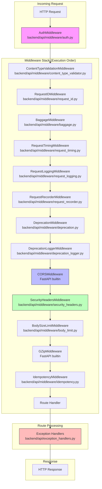

# Middleware Hub

> Request processing pipeline and cross-cutting concerns for the Home Security Intelligence API

## Overview

The middleware stack in this application processes all incoming HTTP requests before they reach route handlers, and all outgoing responses before they're sent to clients. This hub documents each middleware component, their execution order, and how they work together to provide logging, error handling, security, and request validation.

Middleware components in FastAPI/Starlette are executed in a specific order determined by their registration sequence in `backend/main.py`. The order matters because each middleware can modify the request before passing it to the next middleware, and modify the response on the way back. Understanding this execution order is critical for debugging and extending the middleware stack.

The middleware architecture follows defense-in-depth principles, with multiple layers of validation, security headers, and error handling. Each middleware is designed to be independent and testable, with clear responsibilities and minimal coupling to other components.

## Documents

| Document                                         | Description                                           | Key Files                                                                                       |
| ------------------------------------------------ | ----------------------------------------------------- | ----------------------------------------------------------------------------------------------- |
| [request-logging.md](./request-logging.md)       | Structured request/response logging for observability | `backend/api/middleware/request_logging.py`                                                     |
| [error-handling.md](./error-handling.md)         | Global exception handlers and error response formats  | `backend/api/exception_handlers.py`, `backend/api/middleware/error_handler.py`                  |
| [cors-configuration.md](./cors-configuration.md) | CORS settings for frontend integration                | `backend/main.py:1127-1139`, `backend/core/config.py:752-765`                                   |
| [request-validation.md](./request-validation.md) | Pydantic validation, path parameter parsing           | `backend/api/middleware/content_type_validator.py`, `backend/api/exception_handlers.py:305-374` |
| [rate-limiting.md](./rate-limiting.md)           | Rate limit configuration and tiers                    | `backend/api/middleware/rate_limit.py`                                                          |

## Architecture Diagram



## Quick Reference

| Component                       | File                                               | Purpose                           |
| ------------------------------- | -------------------------------------------------- | --------------------------------- |
| AuthMiddleware                  | `backend/api/middleware/auth.py`                   | API key authentication            |
| ContentTypeValidationMiddleware | `backend/api/middleware/content_type_validator.py` | Validate Content-Type headers     |
| RequestIDMiddleware             | `backend/api/middleware/request_id.py`             | Generate/propagate request IDs    |
| BaggageMiddleware               | `backend/api/middleware/baggage.py`                | OpenTelemetry context propagation |
| RequestTimingMiddleware         | `backend/api/middleware/request_timing.py`         | Measure request duration          |
| RequestLoggingMiddleware        | `backend/api/middleware/request_logging.py`        | Structured request logging        |
| RequestRecorderMiddleware       | `backend/api/middleware/request_recorder.py`       | Debug request recording           |
| DeprecationMiddleware           | `backend/api/middleware/deprecation.py`            | RFC 8594 deprecation headers      |
| DeprecationLoggerMiddleware     | `backend/api/middleware/deprecation_logger.py`     | Log deprecated endpoint usage     |
| CORSMiddleware                  | FastAPI builtin                                    | Cross-Origin Resource Sharing     |
| SecurityHeadersMiddleware       | `backend/api/middleware/security_headers.py`       | Security response headers         |
| BodySizeLimitMiddleware         | `backend/api/middleware/body_limit.py`             | Request body size limits          |
| GZipMiddleware                  | FastAPI builtin                                    | Response compression              |
| IdempotencyMiddleware           | `backend/api/middleware/idempotency.py`            | Idempotency-Key support           |
| RateLimiter                     | `backend/api/middleware/rate_limit.py`             | Rate limiting (route dependency)  |

## Key Concepts

### Middleware Execution Order


Middleware in Starlette/FastAPI executes in **reverse registration order** for requests and **registration order** for responses. The middleware registered first wraps all subsequent middleware:

```
Request:  Client -> Last Registered -> ... -> First Registered -> Route
Response: Route -> First Registered -> ... -> Last Registered -> Client
```

This means `AuthMiddleware` (registered first in `backend/main.py:1084`) processes requests first and responses last.

### Exception Handlers vs Middleware

Exception handlers (`backend/api/exception_handlers.py`) are distinct from middleware. They catch exceptions raised during request processing and convert them to HTTP responses. They're registered separately via `app.add_exception_handler()` and process exceptions based on type hierarchy.

### Context Variables

Several middleware components use Python context variables to share state across the request lifecycle:

- `request_id` - Request correlation ID
- `correlation_id` - Distributed tracing ID
- `trace_id` / `span_id` - OpenTelemetry context

## Configuration

| Setting                          | Location                         | Default             | Description                   |
| -------------------------------- | -------------------------------- | ------------------- | ----------------------------- |
| `api_key_enabled`                | `backend/core/config.py`         | `false`             | Enable API key authentication |
| `cors_origins`                   | `backend/core/config.py:752-765` | Development origins | Allowed CORS origins          |
| `rate_limit_enabled`             | `backend/core/config.py:1328`    | `true`              | Enable rate limiting          |
| `rate_limit_requests_per_minute` | `backend/core/config.py:1332`    | `60`                | Default rate limit            |
| `request_logging_enabled`        | `backend/core/config.py:1821`    | `true`              | Enable request logging        |
| `request_recording_enabled`      | `backend/core/config.py`         | `false`             | Enable request recording      |
| `idempotency_enabled`            | `backend/core/config.py`         | `false`             | Enable idempotency middleware |
| `hsts_preload`                   | `backend/core/config.py`         | `false`             | HSTS preload directive        |

## Middleware Registration

Middleware is registered in `backend/main.py:1083-1162`:

```python
# From backend/main.py:1083-1162
# Add authentication middleware (if enabled in settings)
app.add_middleware(AuthMiddleware)

# Add Content-Type validation middleware for request body validation (NEM-1617)
app.add_middleware(ContentTypeValidationMiddleware)

# Add request ID middleware for log correlation
app.add_middleware(RequestIDMiddleware)

# Add OpenTelemetry Baggage middleware for cross-service context propagation (NEM-3796)
app.add_middleware(BaggageMiddleware)

# Add request timing middleware for API latency tracking (NEM-1469)
app.add_middleware(RequestTimingMiddleware)

# Add request logging middleware for structured observability (NEM-1963)
if get_settings().request_logging_enabled:
    app.add_middleware(RequestLoggingMiddleware)

# Add request recording middleware for debugging production issues (NEM-1964)
if get_settings().request_recording_enabled:
    app.add_middleware(RequestRecorderMiddleware)

# Add RFC 8594 deprecation headers middleware (NEM-2089)
app.add_middleware(DeprecationMiddleware, config=_get_deprecation_config())

# Add deprecation logger middleware for tracking deprecated endpoint usage (NEM-2090)
app.add_middleware(DeprecationLoggerMiddleware)

# Security: Restrict CORS methods to only what's needed
_cors_origins = get_settings().cors_origins
_allow_credentials = "*" not in _cors_origins
app.add_middleware(
    CORSMiddleware,
    allow_origins=_cors_origins,
    allow_credentials=_allow_credentials,
    allow_methods=["GET", "POST", "PUT", "PATCH", "DELETE", "OPTIONS"],
    allow_headers=["*"],
)

# Add security headers middleware for defense-in-depth
app.add_middleware(SecurityHeadersMiddleware, hsts_preload=get_settings().hsts_preload)

# Add body size limit middleware to prevent DoS attacks (NEM-1614)
app.add_middleware(BodySizeLimitMiddleware, max_body_size=10 * 1024 * 1024)

# Add GZip compression middleware for response compression (NEM-3741)
app.add_middleware(GZipMiddleware, minimum_size=1000, compresslevel=5)

# Add idempotency middleware for mutation endpoints (NEM-1999)
if get_settings().idempotency_enabled:
    app.add_middleware(IdempotencyMiddleware)
```

## Related Hubs

- [API Reference](../api-reference/README.md) - Endpoint documentation
- [Observability](../observability/README.md) - Logging and tracing integration
- [Security](../security/README.md) - Security middleware and authentication
- [Resilience Patterns](../resilience-patterns/README.md) - Circuit breakers and retry logic

---

_Last updated: 2025-01-24 - Complete middleware hub documentation for NEM-3461_
