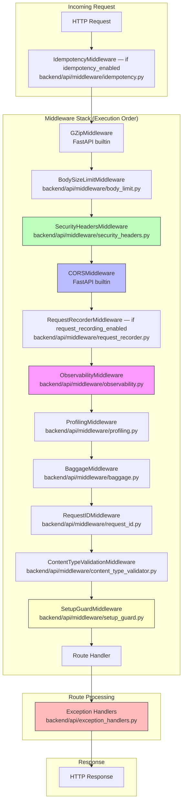
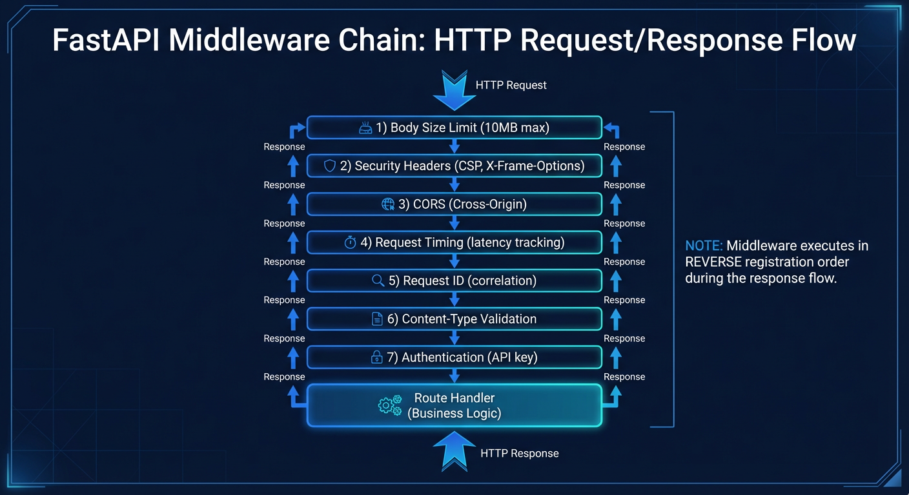

# Middleware Hub

> Request processing pipeline and cross-cutting concerns for the Home Security Intelligence API

## Overview

The middleware stack in this application processes all incoming HTTP requests before they reach route handlers, and all outgoing responses before they're sent to clients. This hub documents each middleware component, their execution order, and how they work together to provide logging, error handling, security, and request validation.

Middleware components in FastAPI/Starlette are executed in a specific order determined by their registration sequence in `backend/main.py`. The order matters because each middleware can modify the request before passing it to the next middleware, and modify the response on the way back. Understanding this execution order is critical for debugging and extending the middleware stack.

The middleware architecture follows defense-in-depth principles, with multiple layers of validation, security headers, and error handling. Each middleware is designed to be independent and testable, with clear responsibilities and minimal coupling to other components.

## Documents

| Document                                         | Description                                           | Key Files                                                                                       |
| ------------------------------------------------ | ----------------------------------------------------- | ----------------------------------------------------------------------------------------------- |
| [request-logging.md](./request-logging.md)       | Structured request/response logging for observability | `backend/api/middleware/observability.py`, `backend/api/middleware/request_id.py`               |
| [error-handling.md](./error-handling.md)         | Global exception handlers and error response formats  | `backend/api/exception_handlers.py`, `backend/api/middleware/error_handler.py`                  |
| [cors-configuration.md](./cors-configuration.md) | CORS settings for frontend integration                | `backend/main.py:1413-1418`, `backend/core/config.py:916-928`                                   |
| [request-validation.md](./request-validation.md) | Pydantic validation, path parameter parsing           | `backend/api/middleware/content_type_validator.py`, `backend/api/exception_handlers.py:305-374` |
| [rate-limiting.md](./rate-limiting.md)           | Rate limit configuration and tiers                    | `backend/api/middleware/rate_limit.py`                                                          |

## Architecture Diagram


```mermaid
graph TD
    subgraph "Incoming Request"
        REQ[HTTP Request] --> IDEM
    end

    subgraph "Middleware Stack (Execution Order)"
        IDEM[IdempotencyMiddleware — if idempotency_enabled<br/>backend/api/middleware/idempotency.py] --> GZIP
        GZIP[GZipMiddleware<br/>FastAPI builtin] --> BL
        BL[BodySizeLimitMiddleware<br/>backend/api/middleware/body_limit.py] --> SEC
        SEC[SecurityHeadersMiddleware<br/>backend/api/middleware/security_headers.py] --> CORS
        CORS[CORSMiddleware<br/>FastAPI builtin] --> RR
        RR[RequestRecorderMiddleware — if request_recording_enabled<br/>backend/api/middleware/request_recorder.py] --> OBS
        OBS[ObservabilityMiddleware<br/>backend/api/middleware/observability.py] --> PROF
        PROF[ProfilingMiddleware<br/>backend/api/middleware/profiling.py] --> BAG
        BAG[BaggageMiddleware<br/>backend/api/middleware/baggage.py] --> RID
        RID[RequestIDMiddleware<br/>backend/api/middleware/request_id.py] --> CT
        CT[ContentTypeValidationMiddleware<br/>backend/api/middleware/content_type_validator.py] --> SG
        SG[SetupGuardMiddleware<br/>backend/api/middleware/setup_guard.py] --> ROUTE
    end

    subgraph "Route Processing"
        ROUTE[Route Handler] --> EH
        EH[Exception Handlers<br/>backend/api/exception_handlers.py]
    end

    subgraph "Response"
        EH --> RESP[HTTP Response]
    end

    style OBS fill:#f9f,stroke:#333
    style CORS fill:#bbf,stroke:#333
    style SEC fill:#bfb,stroke:#333
    style SG fill:#ffc,stroke:#333
    style EH fill:#fbb,stroke:#333
```

AuthMiddleware is **not** in this chain — it is intentionally unregistered (NEM-5527);
see [Middleware Registration](#middleware-registration) below.

## Quick Reference

| Component                       | File                                               | Purpose                                                      |
| ------------------------------- | -------------------------------------------------- | ------------------------------------------------------------ |
| AuthMiddleware                  | `backend/api/middleware/auth.py`                   | API key/session auth — **not registered** (NEM-5527)         |
| ContentTypeValidationMiddleware | `backend/api/middleware/content_type_validator.py` | Validate Content-Type headers                                |
| RequestIDMiddleware             | `backend/api/middleware/request_id.py`             | Generate/propagate request IDs                               |
| BaggageMiddleware               | `backend/api/middleware/baggage.py`                | OpenTelemetry context propagation                            |
| ObservabilityMiddleware         | `backend/api/middleware/observability.py`          | Timing, request logging and metrics in one pass (NEM-5558)   |
| RequestRecorderMiddleware       | `backend/api/middleware/request_recorder.py`       | Debug request recording (conditional)                        |
| DeprecationMiddleware           | `backend/api/middleware/deprecation.py`            | RFC 8594 deprecation headers — **not registered** (NEM-5558) |
| DeprecationLoggerMiddleware     | `backend/api/middleware/deprecation_logger.py`     | Deprecation logging — **not registered** (NEM-5558)          |
| CORSMiddleware                  | FastAPI builtin                                    | Cross-Origin Resource Sharing                                |
| SecurityHeadersMiddleware       | `backend/api/middleware/security_headers.py`       | Security response headers                                    |
| BodySizeLimitMiddleware         | `backend/api/middleware/body_limit.py`             | Request body size limits                                     |
| GZipMiddleware                  | FastAPI builtin                                    | Response compression                                         |
| IdempotencyMiddleware           | `backend/api/middleware/idempotency.py`            | Idempotency-Key support (conditional)                        |
| ProfilingMiddleware             | `backend/api/middleware/profiling.py`              | Pyroscope trace-to-profile tags (NEM-4127)                   |
| SetupGuardMiddleware            | `backend/api/middleware/setup_guard.py`            | 503 until first admin is registered (NEM-5312)               |
| RateLimiter                     | `backend/api/middleware/rate_limit.py`             | Rate limiting (route dependency)                             |

`RequestTimingMiddleware` and `RequestLoggingMiddleware` no longer exist — their files were
deleted in NEM-5558 and `ObservabilityMiddleware` replaced both (the names survive only in
`observability.py` docstrings).

## Key Concepts

### Middleware Execution Order



Middleware in Starlette/FastAPI executes in **reverse registration order** for requests and **registration order** for responses. The middleware registered first wraps all subsequent middleware:

```
Request:  Client -> Last Registered -> ... -> First Registered -> Route
Response: Route -> First Registered -> ... -> Last Registered -> Client
```

This means `IdempotencyMiddleware` — the **last** `add_middleware()` call in `backend/main.py:1351-1441`
(where enabled) — processes requests first and responses last, while `SetupGuardMiddleware` — the first
call — is innermost. `AuthMiddleware` never processes requests: it is not registered (NEM-5527).

### Exception Handlers vs Middleware

Exception handlers (`backend/api/exception_handlers.py`) are distinct from middleware. They catch exceptions raised during request processing and convert them to HTTP responses. They're registered separately via `app.add_exception_handler()` and process exceptions based on type hierarchy.

### Context Variables

Several middleware components use Python context variables to share state across the request lifecycle:

- `request_id` - Request correlation ID
- `correlation_id` - Distributed tracing ID
- `trace_id` / `span_id` - OpenTelemetry context

## Configuration

| Setting                          | Location                         | Default             | Description                              |
| -------------------------------- | -------------------------------- | ------------------- | ---------------------------------------- |
| `api_key_enabled`                | `backend/core/config.py:1904`    | `false`             | Enable API key authentication            |
| `cors_origins`                   | `backend/core/config.py:916-928` | HTTPS :8444 origins | Allowed CORS origins                     |
| `rate_limit_enabled`             | `backend/core/config.py:2225`    | `true`              | Enable rate limiting                     |
| `rate_limit_requests_per_minute` | `backend/core/config.py:2229`    | `60`                | Default rate limit                       |
| `request_logging_enabled`        | `backend/core/config.py:2764`    | `true`              | Feed structured logs via ObservabilityMW |
| `request_recording_enabled`      | `backend/core/config.py:2773`    | `false`             | Enable request recording (debug)         |
| `idempotency_enabled`            | `backend/core/config.py:2306`    | `true`              | Enable idempotency middleware            |
| `hsts_preload`                   | `backend/core/config.py:2796`    | `false`             | HSTS preload directive                   |

## Middleware Registration

Middleware is registered in `backend/main.py:1351-1441`. Note the order: with
Starlette, the **last** `add_middleware()` call is the **outermost** layer, so
requests flow bottom-up through this list:

```python
# From backend/main.py:1351-1441 (abridged, in registration order)
app.add_middleware(SetupGuardMiddleware)  # 503 until first admin registered (NEM-5312)

# NEM-5527: global AuthMiddleware is intentionally NOT registered — single-user
# deployment; per-route deps (verify_api_key, require_admin_access) protect
# admin endpoints; 127.0.0.1 network binding is the security boundary.

app.add_middleware(ContentTypeValidationMiddleware)  # NEM-1617
app.add_middleware(RequestIDMiddleware)              # log correlation
app.add_middleware(BaggageMiddleware)                # W3C Baggage (NEM-3796)
app.add_middleware(ProfilingMiddleware)              # Pyroscope trace-tags (NEM-4127)

# NEM-5558: one unified middleware replaces RequestTiming + RequestLogging
app.add_middleware(
    ObservabilityMiddleware,
    enable_request_logging=get_settings().request_logging_enabled,
)

if get_settings().request_recording_enabled:          # NEM-1964, off by default
    app.add_middleware(RequestRecorderMiddleware)

# NEM-5558: DeprecationMiddleware/DeprecationLoggerMiddleware removed
# (zero deprecated endpoints registered).

# NEM-5059: explicit header allowlist, not "*"
_cors_allowed_headers = ["Content-Type", "Authorization", "X-Request-ID", "X-API-Key"]
app.add_middleware(
    CORSMiddleware,
    allow_origins=_cors_origins,
    allow_credentials=_allow_credentials,  # disabled when "*" is an origin
    allow_methods=["GET", "POST", "PUT", "PATCH", "DELETE", "OPTIONS"],
    allow_headers=_cors_allowed_headers,
)

app.add_middleware(SecurityHeadersMiddleware, hsts_preload=get_settings().hsts_preload)
app.add_middleware(BodySizeLimitMiddleware, max_body_size=10 * 1024 * 1024)  # NEM-1614
app.add_middleware(GZipMiddleware, minimum_size=1000, compresslevel=5)       # NEM-3741

if get_settings().idempotency_enabled:                # NEM-1999, ON by default
    app.add_middleware(IdempotencyMiddleware)
```

## Additional Middleware

The middleware directory contains 23 modules. Key middleware not detailed here include: `setup_guard.py` (SetupGuardMiddleware - blocks API with 503 until admin setup is complete), `etag.py` (ETag caching), `profiling.py` (request profiling), `prometheus.py` (metrics), `baggage.py` (context propagation).

### SetupGuardMiddleware

The `SetupGuardMiddleware` (`backend/api/middleware/setup_guard.py`) is a critical middleware that returns 503 for all non-whitelisted endpoints until the first admin user has been registered. This ensures the system is properly initialized before accepting traffic. It is registered first in `backend/main.py`, making it the innermost gate — the last check a request passes before route dispatch.

## Related Hubs

- [API Reference](../api-reference/README.md) - Endpoint documentation
- [Observability](../observability/README.md) - Logging and tracing integration
- [Security](../security/README.md) - Security middleware and authentication
- [Resilience Patterns](../resilience-patterns/README.md) - Circuit breakers and retry logic

---

_Last updated: 2025-01-24 - Complete middleware hub documentation for NEM-3461_
