# CORS Configuration

> Cross-Origin Resource Sharing settings for frontend integration

**Key Files:**

- `backend/main.py:1127-1139` - CORS middleware registration
- `backend/core/config.py:752-765` - CORS origin configuration
- `backend/api/middleware/security_headers.py` - Security headers

## Overview

Cross-Origin Resource Sharing (CORS) controls which web origins can make requests to the API. The Home Security Intelligence API configures CORS to allow the React frontend (running on different ports during development) to communicate with the backend API.

The CORS middleware is provided by FastAPI/Starlette and configured with explicit allowed origins, methods, and headers. The configuration follows security best practices by avoiding wildcards in production and properly handling credentials.

## Architecture

```mermaid
sequenceDiagram
    participant Browser
    participant Frontend as Frontend<br/>(localhost:3000)
    participant CORS as CORSMiddleware
    participant API as API Backend<br/>(localhost:8000)

    Note over Browser,API: Preflight Request (OPTIONS)
    Browser->>CORS: OPTIONS /api/events<br/>Origin: http://localhost:3000
    CORS->>CORS: Check Origin against allow_origins
    CORS-->>Browser: 200 OK<br/>Access-Control-Allow-Origin: http://localhost:3000<br/>Access-Control-Allow-Methods: GET, POST, ...<br/>Access-Control-Allow-Headers: *

    Note over Browser,API: Actual Request
    Browser->>CORS: GET /api/events<br/>Origin: http://localhost:3000
    CORS->>API: GET /api/events
    API-->>CORS: 200 OK (JSON response)
    CORS-->>Browser: 200 OK<br/>Access-Control-Allow-Origin: http://localhost:3000
```



## CORS Middleware Configuration

The CORS middleware is configured in `backend/main.py:1127-1139`:

```python
# From backend/main.py:1127-1139
# Security: Restrict CORS methods to only what's needed
# Using explicit methods instead of wildcard "*" to follow least-privilege principle
# Note: When allow_credentials=True, allow_origins cannot be ["*"]
# If "*" is in origins, we disable credentials to allow any origin
_cors_origins = get_settings().cors_origins
_allow_credentials = "*" not in _cors_origins
app.add_middleware(
    CORSMiddleware,
    allow_origins=_cors_origins,
    allow_credentials=_allow_credentials,
    allow_methods=["GET", "POST", "PUT", "PATCH", "DELETE", "OPTIONS"],
    allow_headers=["*"],
)
```

## Configuration

### Default Origins

Default allowed origins are configured in `backend/core/config.py:752-765`:

```python
# From backend/core/config.py:752-765
# CORS settings
# Includes common development ports and 0.0.0.0 (accept from any origin when bound to all interfaces)
# For production, override via CORS_ORIGINS env var with specific allowed origins
cors_origins: list[str] = Field(
    default=[
        "http://localhost:3000",
        "http://localhost:5173",
        "http://127.0.0.1:3000",
        "http://127.0.0.1:5173",
        "http://0.0.0.0:3000",
        "http://0.0.0.0:5173",
    ],
    description="Allowed CORS origins. Set CORS_ORIGINS env var to override for your network.",
)
```

| Origin                  | Port | Use Case                     |
| ----------------------- | ---- | ---------------------------- |
| `http://localhost:3000` | 3000 | React dev server (default)   |
| `http://localhost:5173` | 5173 | Vite dev server              |
| `http://127.0.0.1:3000` | 3000 | Loopback address             |
| `http://127.0.0.1:5173` | 5173 | Loopback address (Vite)      |
| `http://0.0.0.0:3000`   | 3000 | Any network interface        |
| `http://0.0.0.0:5173`   | 5173 | Any network interface (Vite) |

### Environment Variable Override

Set `CORS_ORIGINS` to override the default origins:

```bash
# Single origin
export CORS_ORIGINS='["https://app.example.com"]'

# Multiple origins
export CORS_ORIGINS='["https://app.example.com", "https://admin.example.com"]'

# Development with wildcard (disables credentials)
export CORS_ORIGINS='["*"]'
```

## CORS Headers

### Request Headers

The CORS middleware handles these request headers:

| Header                           | Description                   |
| -------------------------------- | ----------------------------- |
| `Origin`                         | The origin making the request |
| `Access-Control-Request-Method`  | Method for preflight check    |
| `Access-Control-Request-Headers` | Headers for preflight check   |

### Response Headers

The CORS middleware adds these response headers:

| Header                             | Value                                    | Description              |
| ---------------------------------- | ---------------------------------------- | ------------------------ |
| `Access-Control-Allow-Origin`      | Origin or `*`                            | Allowed origin           |
| `Access-Control-Allow-Credentials` | `true`/omitted                           | Allow cookies/auth       |
| `Access-Control-Allow-Methods`     | `GET, POST, PUT, PATCH, DELETE, OPTIONS` | Allowed HTTP methods     |
| `Access-Control-Allow-Headers`     | `*`                                      | Allowed request headers  |
| `Access-Control-Max-Age`           | `600`                                    | Preflight cache duration |

### Example Response Headers

```http
HTTP/1.1 200 OK
Access-Control-Allow-Origin: http://localhost:3000
Access-Control-Allow-Credentials: true
Access-Control-Allow-Methods: GET, POST, PUT, PATCH, DELETE, OPTIONS
Access-Control-Allow-Headers: *
Vary: Origin
```

## Credentials Handling

The `allow_credentials` setting is dynamically determined based on origins (`backend/main.py:1132`):

```python
# From backend/main.py:1132
_allow_credentials = "*" not in _cors_origins
```

| Origins Configuration | `allow_credentials` | Cookie Support |
| --------------------- | ------------------- | -------------- |
| Explicit origins      | `true`              | Yes            |
| Contains `"*"`        | `false`             | No             |

When `allow_credentials=true`:

- Cookies and HTTP authentication are allowed
- The response cannot use `Access-Control-Allow-Origin: *`
- Each request's origin is echoed back if allowed

## Security Headers Integration

The `SecurityHeadersMiddleware` (`backend/api/middleware/security_headers.py`) adds additional security headers that complement CORS:

| Header                         | Default Value                     | Purpose                      |
| ------------------------------ | --------------------------------- | ---------------------------- |
| `X-Content-Type-Options`       | `nosniff`                         | Prevent MIME sniffing        |
| `X-Frame-Options`              | `DENY`                            | Prevent clickjacking         |
| `X-XSS-Protection`             | `1; mode=block`                   | XSS filter                   |
| `Referrer-Policy`              | `strict-origin-when-cross-origin` | Control referrer             |
| `Content-Security-Policy`      | See below                         | Restrict resource loading    |
| `Cross-Origin-Opener-Policy`   | `same-origin`                     | Isolate browsing context     |
| `Cross-Origin-Resource-Policy` | `same-origin`                     | Prevent cross-origin loading |

### Content Security Policy

Default CSP from `backend/api/middleware/security_headers.py:104-115`:

```python
# From backend/api/middleware/security_headers.py:104-115
self.content_security_policy = content_security_policy or (
    "default-src 'self'; "
    "script-src 'self'; "
    "style-src 'self' 'unsafe-inline'; "
    "img-src 'self' data: blob:; "
    "font-src 'self' data:; "
    "connect-src 'self' ws: wss:; "
    "frame-ancestors 'none'; "
    "base-uri 'self'; "
    "form-action 'self'; "
    "upgrade-insecure-requests"
)
```

## Preflight Requests

For non-simple requests (e.g., `PUT`, `DELETE`, custom headers), browsers send a preflight `OPTIONS` request:

### Preflight Request Example

```http
OPTIONS /api/events/123 HTTP/1.1
Host: localhost:8000
Origin: http://localhost:3000
Access-Control-Request-Method: DELETE
Access-Control-Request-Headers: X-API-Key, Content-Type
```

### Preflight Response Example

```http
HTTP/1.1 200 OK
Access-Control-Allow-Origin: http://localhost:3000
Access-Control-Allow-Methods: GET, POST, PUT, PATCH, DELETE, OPTIONS
Access-Control-Allow-Headers: *
Access-Control-Max-Age: 600
```

The browser caches preflight responses for `Access-Control-Max-Age` seconds (default 600 = 10 minutes).

## Production Configuration

For production deployments, configure explicit origins:

```bash
# In .env or environment
CORS_ORIGINS='["https://security.example.com"]'
```

Or in Docker Compose:

```yaml
# docker-compose.prod.yml
services:
  backend:
    environment:
      - CORS_ORIGINS=["https://security.example.com"]
```

### Production Security Checklist

1. **Explicit origins**: Never use `"*"` in production
2. **HTTPS only**: All production origins should use HTTPS
3. **Credentials enabled**: Keep `allow_credentials=true` for session/cookie support
4. **Minimal methods**: Only allow methods actually used by the frontend
5. **Specific headers**: Consider restricting `allow_headers` to specific headers

## Troubleshooting

### CORS Error: "No 'Access-Control-Allow-Origin' header"

**Cause**: Request origin not in `cors_origins` list.

**Solution**: Add the origin to `CORS_ORIGINS`:

```bash
export CORS_ORIGINS='["http://localhost:3000", "http://your-origin.com"]'
```

### CORS Error: "Credentials flag is true, but Access-Control-Allow-Origin is '\*'"

**Cause**: Wildcard origin with credentials.

**Solution**: Use explicit origins instead of `"*"`:

```bash
export CORS_ORIGINS='["http://localhost:3000"]'
```

### Preflight Request Failing

**Cause**: Method not allowed or headers not permitted.

**Solution**: Verify `allow_methods` includes the required method and `allow_headers` includes required headers.

### WebSocket Connection Failing

WebSocket connections from the browser also require CORS-like origin checking. The origin is validated during the WebSocket handshake.

## Testing CORS

### Using curl

```bash
# Test preflight request
curl -X OPTIONS http://localhost:8000/api/events \
  -H "Origin: http://localhost:3000" \
  -H "Access-Control-Request-Method: GET" \
  -v

# Test actual request
curl http://localhost:8000/api/events \
  -H "Origin: http://localhost:3000" \
  -v
```

### Using Browser DevTools

1. Open DevTools (F12)
2. Go to Network tab
3. Make a cross-origin request
4. Check response headers for `Access-Control-Allow-Origin`

## Related Documents

- [Security Hub](../security/README.md) - Security middleware overview
- [API Reference](../api-reference/README.md) - API endpoint documentation
- [Frontend Hub](../frontend/README.md) - Frontend configuration

---

_Last updated: 2025-01-24 - Created for NEM-3461_
