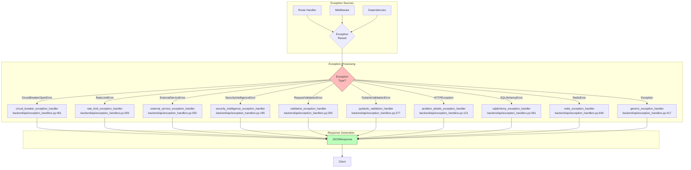

# Error Handling

> Global exception handlers and standardized error response formats

**Key Files:**

- `backend/api/exception_handlers.py:1-772` - Global exception handlers
- `backend/api/middleware/error_handler.py:1-357` - Error classes and ErrorResponse schema
- `backend/api/middleware/exception_handler.py:1-101` - Error message sanitization
- `backend/api/schemas/problem_details.py` - RFC 7807 Problem Details schema
- `backend/core/exceptions.py` - Base exception hierarchy

## Overview

The error handling system provides centralized exception handling that converts all exceptions to standardized error responses. It ensures consistent error formats across all API endpoints, proper logging with request context, and sanitization of error messages to prevent information leakage.

The system implements RFC 7807 "Problem Details for HTTP APIs" for standard HTTP exceptions, providing machine-readable error responses. Application-specific exceptions use a custom format with error codes, messages, and optional details.

## Architecture



## Exception Handler Registration

Exception handlers are registered in order of specificity in `backend/api/exception_handlers.py:695-770`:

```python
# From backend/api/exception_handlers.py:695-770
def register_exception_handlers(app: FastAPI) -> None:
    """Register all exception handlers with the FastAPI application."""
    # Register handlers in order of specificity (most specific first)

    # Circuit breaker errors (specific external service error)
    app.add_exception_handler(CircuitBreakerOpenError, circuit_breaker_exception_handler)

    # Rate limit errors
    app.add_exception_handler(RateLimitError, rate_limit_exception_handler)

    # External service errors (includes AI services, database, cache)
    app.add_exception_handler(ExternalServiceError, external_service_exception_handler)

    # Application-specific errors (includes validation, not found, etc.)
    app.add_exception_handler(SecurityIntelligenceError, security_intelligence_exception_handler)

    # FastAPI request validation errors
    app.add_exception_handler(RequestValidationError, validation_exception_handler)

    # Pydantic validation errors (response serialization)
    app.add_exception_handler(PydanticValidationError, pydantic_validation_handler)

    # Standard HTTP exceptions - RFC 7807 Problem Details format
    app.add_exception_handler(StarletteHTTPException, problem_details_exception_handler)

    # SQLAlchemy database errors
    app.add_exception_handler(SQLAlchemyError, sqlalchemy_exception_handler)

    # Redis cache errors
    app.add_exception_handler(RedisError, redis_exception_handler)

    # Catch-all for any unhandled exceptions
    app.add_exception_handler(Exception, generic_exception_handler)
```

## Error Response Formats

### Standard Error Response

The standard error response format is used for application-specific exceptions (`backend/api/middleware/error_handler.py:105-163`):

```json
{
  "error": {
    "code": "NOT_FOUND",
    "message": "Camera 'front_door' not found",
    "details": {
      "camera_id": "front_door"
    },
    "request_id": "abc12345",
    "timestamp": "2024-01-15T10:30:00.123456Z"
  }
}
```

### RFC 7807 Problem Details

HTTP exceptions use RFC 7807 "Problem Details" format (`backend/api/exception_handlers.py:121-193`):

```json
{
  "type": "about:blank",
  "title": "Not Found",
  "status": 404,
  "detail": "Camera 'front_door' does not exist",
  "instance": "/api/cameras/front_door"
}
```

This format is returned with media type `application/problem+json`.

### Validation Error Response

Request validation errors include field-level details (`backend/api/exception_handlers.py:305-374`):

```json
{
  "error": {
    "code": "VALIDATION_ERROR",
    "message": "Request validation failed",
    "errors": [
      {
        "field": "body.risk_score",
        "message": "Input should be less than or equal to 100",
        "value": "150"
      },
      {
        "field": "body.camera_id",
        "message": "Field required",
        "value": null
      }
    ],
    "request_id": "abc12345",
    "timestamp": "2024-01-15T10:30:00.123456Z"
  }
}
```

## Exception Hierarchy

### Application Exceptions

The `SecurityIntelligenceError` base class (`backend/core/exceptions.py`) provides:

| Exception                 | Status Code | Error Code                | Use Case                 |
| ------------------------- | ----------- | ------------------------- | ------------------------ |
| `NotFoundError`           | 404         | `NOT_FOUND`               | Resource not found       |
| `ValidationError`         | 422         | `VALIDATION_ERROR`        | Input validation failed  |
| `ConflictError`           | 409         | `CONFLICT`                | Resource conflict        |
| `AuthenticationError`     | 401         | `AUTHENTICATION_REQUIRED` | Auth required            |
| `AuthorizationError`      | 403         | `ACCESS_DENIED`           | Permission denied        |
| `RateLimitError`          | 429         | `RATE_LIMIT_EXCEEDED`     | Rate limit hit           |
| `ExternalServiceError`    | 503         | `EXTERNAL_SERVICE_ERROR`  | External service failure |
| `CircuitBreakerOpenError` | 503         | `CIRCUIT_BREAKER_OPEN`    | Circuit breaker tripped  |

### AppException Classes

The `AppException` class (`backend/api/middleware/error_handler.py:170-239`) provides a simpler interface:

```python
# From backend/api/middleware/error_handler.py:170-239
class AppException(Exception):
    """Base exception for application-specific API errors."""

    status_code: int = 500
    error: str = "internal_error"

    def __init__(
        self,
        message: str | None = None,
        *,
        status_code: int | None = None,
        error: str | None = None,
        details: dict[str, Any] | None = None,
    ) -> None:
        self.message = message or self._get_default_message()
        if status_code is not None:
            self.status_code = status_code
        if error is not None:
            self.error = error
        self.details = details
        super().__init__(self.message)
```

## Error Code Mapping

HTTP status codes are mapped to error codes in `backend/api/exception_handlers.py:260-274`:

```python
# From backend/api/exception_handlers.py:260-274
status_to_code = {
    400: "BAD_REQUEST",
    401: "AUTHENTICATION_REQUIRED",
    403: "ACCESS_DENIED",
    404: "NOT_FOUND",
    405: "METHOD_NOT_ALLOWED",
    409: "CONFLICT",
    422: "VALIDATION_ERROR",
    429: "RATE_LIMIT_EXCEEDED",
    500: "INTERNAL_ERROR",
    502: "BAD_GATEWAY",
    503: "SERVICE_UNAVAILABLE",
    504: "GATEWAY_TIMEOUT",
}
```

## Error Message Sanitization

Error messages are sanitized to prevent information leakage (`backend/api/middleware/exception_handler.py:61-101`):

```python
# From backend/api/middleware/exception_handler.py:61-101
def create_safe_error_message(
    error: Exception,
    *,
    context: str = "",
    include_exception_type: bool = False,
) -> str:
    """Create a safe error message for API responses.

    This function wraps sanitize_error_for_response with additional options
    for API response formatting.
    """
    safe_message = sanitize_error_for_response(error, context=context)

    if include_exception_type:
        exception_type = type(error).__name__
        if context:
            return safe_message
        return f"{exception_type}: {safe_message}"

    return safe_message
```

The sanitization (`backend/core/sanitization.py`) removes:

- File paths (keeps filename only)
- URL credentials
- IP addresses
- API keys and tokens
- Password values
- Bearer tokens

## Special Exception Handlers

### Database Errors

SQLAlchemy errors are handled in `backend/api/exception_handlers.py:591-646`:

| Exception Type          | Status | Error Code             | Message                                  |
| ----------------------- | ------ | ---------------------- | ---------------------------------------- |
| `IntegrityError`        | 409    | `DATABASE_CONFLICT`    | Database constraint violation            |
| Other `SQLAlchemyError` | 503    | `DATABASE_UNAVAILABLE` | Database service temporarily unavailable |

### Redis Errors

Redis errors return 503 with `CACHE_UNAVAILABLE` (`backend/api/exception_handlers.py:649-693`).

### Rate Limit Errors

Rate limit errors include retry information (`backend/api/exception_handlers.py:506-548`):

```python
# Response includes Retry-After header
if exc.details and "retry_after" in exc.details:
    response.headers["Retry-After"] = str(exc.details["retry_after"])
```

### Circuit Breaker Errors

Circuit breaker errors include service name and recovery timeout (`backend/api/exception_handlers.py:461-503`):

```json
{
  "error": {
    "code": "CIRCUIT_BREAKER_OPEN",
    "message": "Service temporarily unavailable",
    "details": {
      "service": "rtdetr",
      "recovery_timeout_seconds": 30
    }
  }
}
```

## Logging

All exception handlers log errors with appropriate levels and context:

| Status Code | Log Level | Context                                  |
| ----------- | --------- | ---------------------------------------- |
| 5xx         | ERROR     | Full traceback, request ID, path, method |
| 429         | WARNING   | Rate limit details                       |
| 4xx         | INFO      | Request ID, path, method                 |

Example logging from `backend/api/exception_handlers.py:157-172`:

```python
# From backend/api/exception_handlers.py:157-172
log_context = {
    "status_code": exc.status_code,
    "path": str(request.url.path),
    "method": request.method,
}

request_id = get_request_id(request)
if request_id:
    log_context["request_id"] = request_id

if exc.status_code >= 500:
    logger.error(f"HTTP error: {detail}", extra=log_context)
elif exc.status_code == 429:
    logger.warning(f"Rate limit: {detail}", extra=log_context)
elif exc.status_code >= 400:
    logger.info(f"Client error: {detail}", extra=log_context)
```

## Usage Examples

### Raising Application Errors

```python
from backend.api.middleware.error_handler import NotFoundError, ValidationError

@router.get("/cameras/{camera_id}")
async def get_camera(camera_id: str) -> Camera:
    camera = await get_camera_by_id(camera_id)
    if not camera:
        raise NotFoundError(
            message=f"Camera '{camera_id}' not found",
            details={"camera_id": camera_id},
        )
    return camera

@router.post("/events")
async def create_event(event: EventCreate) -> Event:
    if event.risk_score > 100:
        raise ValidationError(
            message="Risk score must be between 0 and 100",
            details={"field": "risk_score", "value": event.risk_score},
        )
    return await create_event_in_db(event)
```

### Custom Exception with Details

```python
from backend.api.middleware.error_handler import ServiceUnavailableError

@router.post("/analyze")
async def analyze_image(image_path: str):
    try:
        result = await ai_service.analyze(image_path)
    except AIServiceError as e:
        raise ServiceUnavailableError(
            message="Object detection service temporarily unavailable",
            details={"service": "rtdetr", "retry_after": 30},
        )
    return result
```

## Testing

Test coverage is in `backend/tests/unit/api/test_exception_handlers.py`.

### Running Tests

```bash
# Run exception handler tests
uv run pytest backend/tests/unit/api/test_exception_handlers.py -v

# Run with coverage
uv run pytest backend/tests/unit/api/ --cov=backend.api.exception_handlers
```

## Related Documents

- [Request Logging](./request-logging.md) - Request ID propagation for error tracing
- [Rate Limiting](./rate-limiting.md) - Rate limit error responses
- [Resilience Patterns](../resilience-patterns/README.md) - Circuit breaker errors

---

_Last updated: 2025-01-24 - Created for NEM-3461_
