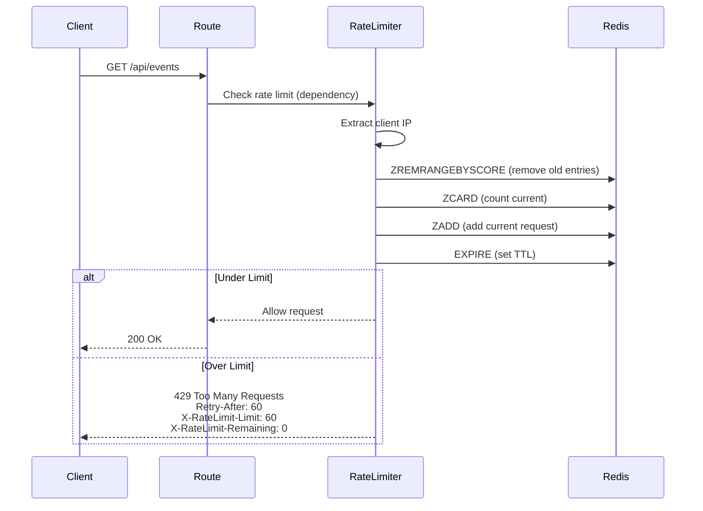

# Rate Limiting

> Rate limit configuration and tier-based throttling

**Key Files:**

- `backend/api/middleware/rate_limit.py:1-537` - Rate limiting implementation
- `backend/core/config.py:1326-1397` - Rate limit configuration
- `backend/api/exception_handlers.py:506-548` - Rate limit error handling

## Overview

Rate limiting protects the API from abuse and ensures fair resource allocation among clients. The system uses a sliding window counter algorithm implemented in Redis to track request counts per client IP. Different endpoint types (media, search, AI inference) have different rate limits based on their computational cost.

The rate limiter is implemented as a FastAPI dependency (not middleware) to allow per-endpoint configuration. It supports multiple tiers with configurable requests-per-minute and burst allowances.

## Architecture



## Rate Limit Tiers

The system defines multiple rate limit tiers for different endpoint types (`backend/api/middleware/rate_limit.py:170-179`):

```python
# From backend/api/middleware/rate_limit.py:170-179
class RateLimitTier(str, Enum):
    """Rate limit tiers for different endpoint types."""

    DEFAULT = "default"
    MEDIA = "media"
    WEBSOCKET = "websocket"
    SEARCH = "search"
    EXPORT = "export"
    AI_INFERENCE = "ai_inference"
    BULK = "bulk"
```

### Tier Configuration

| Tier         | Requests/Min | Burst | Use Case                |
| ------------ | ------------ | ----- | ----------------------- |
| DEFAULT      | 60           | 10    | General API endpoints   |
| MEDIA        | 120          | 10    | Image/video endpoints   |
| WEBSOCKET    | 100          | 2     | WebSocket connections   |
| SEARCH       | 30           | 10    | Search endpoints        |
| EXPORT       | 10           | 0     | CSV export (no burst)   |
| AI_INFERENCE | 10           | 3     | LLM/detection endpoints |
| BULK         | 10           | 2     | Bulk operations         |

## Configuration

Rate limit settings are defined in `backend/core/config.py:1326-1397`:

```python
# From backend/core/config.py:1328-1397
rate_limit_enabled: bool = Field(
    default=True,
    description="Enable rate limiting for API endpoints",
)
rate_limit_requests_per_minute: int = Field(
    default=60,
    ge=1,
    le=1000,
    description="Maximum requests per minute per client IP",
)
rate_limit_burst: int = Field(
    default=10,
    ge=1,
    le=100,
    description="Additional burst allowance for short request spikes",
)
```

### Environment Variables

| Variable                                      | Type | Default | Description                  |
| --------------------------------------------- | ---- | ------- | ---------------------------- |
| `RATE_LIMIT_ENABLED`                          | bool | `true`  | Enable/disable rate limiting |
| `RATE_LIMIT_REQUESTS_PER_MINUTE`              | int  | `60`    | Default requests/minute      |
| `RATE_LIMIT_BURST`                            | int  | `10`    | Default burst allowance      |
| `RATE_LIMIT_MEDIA_REQUESTS_PER_MINUTE`        | int  | `120`   | Media tier limit             |
| `RATE_LIMIT_WEBSOCKET_CONNECTIONS_PER_MINUTE` | int  | `100`   | WebSocket tier limit         |
| `RATE_LIMIT_SEARCH_REQUESTS_PER_MINUTE`       | int  | `30`    | Search tier limit            |
| `RATE_LIMIT_EXPORT_REQUESTS_PER_MINUTE`       | int  | `10`    | Export tier limit            |
| `RATE_LIMIT_AI_INFERENCE_REQUESTS_PER_MINUTE` | int  | `10`    | AI inference tier limit      |
| `RATE_LIMIT_AI_INFERENCE_BURST`               | int  | `3`     | AI inference burst           |
| `RATE_LIMIT_BULK_REQUESTS_PER_MINUTE`         | int  | `10`    | Bulk operations limit        |
| `RATE_LIMIT_BULK_BURST`                       | int  | `2`     | Bulk operations burst        |

## Implementation

### RateLimiter Class

The `RateLimiter` class (`backend/api/middleware/rate_limit.py:266-436`) implements the sliding window algorithm:

```python
# From backend/api/middleware/rate_limit.py:266-316
class RateLimiter:
    """FastAPI dependency for rate limiting using Redis sliding window.

    The sliding window algorithm divides time into fixed-size windows and
    tracks request counts using Redis sorted sets with timestamps as scores.
    """

    def __init__(
        self,
        tier: RateLimitTier = RateLimitTier.DEFAULT,
        requests_per_minute: int | None = None,
        burst: int | None = None,
        key_prefix: str = "rate_limit",
    ):
        self.tier = tier
        self._requests_per_minute = requests_per_minute
        self._burst = burst
        self.key_prefix = key_prefix
        self.window_seconds = 60  # 1 minute sliding window
```

### Sliding Window Algorithm

The sliding window uses Redis sorted sets (`backend/api/middleware/rate_limit.py:328-399`):

```python
# From backend/api/middleware/rate_limit.py:355-393
async def _check_rate_limit(
    self,
    redis_client: RedisClient,
    client_ip: str,
) -> tuple[bool, int, int]:
    """Check if request is within rate limits using sliding window."""
    key = self._make_key(client_ip)
    now = time.time()
    window_start = now - self.window_seconds

    # Total limit including burst
    total_limit = self.requests_per_minute + self.burst

    client = redis_client._ensure_connected()

    # Use Redis pipeline for atomic operations
    pipe = client.pipeline()

    # Remove expired entries (outside the sliding window)
    pipe.zremrangebyscore(key, "-inf", window_start)

    # Count current requests in window
    pipe.zcard(key)

    # Add current request with timestamp
    pipe.zadd(key, {f"{now}": now})

    # Set expiry on the key (slightly longer than window)
    pipe.expire(key, self.window_seconds + 10)

    results = await pipe.execute()

    # Pipeline returns: removed count, current count, added count, expiry set
    current_count = results[1]

    # Check if over limit (count is before adding current request)
    is_allowed = current_count < total_limit
```

## Client IP Extraction

The `get_client_ip` function (`backend/api/middleware/rate_limit.py:219-264`) extracts the client IP securely:

```python
# From backend/api/middleware/rate_limit.py:219-264
def get_client_ip(request: Request | WebSocket) -> str:
    """Extract client IP address from request.

    Handles X-Forwarded-For header for proxied requests, but ONLY when the
    direct client IP is from a trusted proxy. This prevents IP spoofing attacks
    where attackers forge X-Forwarded-For headers to bypass rate limits.
    """
    settings = get_settings()

    # Get direct client IP first
    direct_ip = "unknown"
    if request.client:
        direct_ip = str(request.client.host)

    # Only process X-Forwarded-For/X-Real-IP if the direct client is a trusted proxy
    if direct_ip != "unknown" and _is_ip_trusted(direct_ip, settings.trusted_proxy_ips):
        forwarded_for = request.headers.get("X-Forwarded-For")
        if forwarded_for:
            client_ip = str(forwarded_for.split(",")[0].strip())
            if client_ip:
                return client_ip

    return direct_ip
```

### Trusted Proxy Configuration

Only trusted proxies can use forwarded headers (`backend/api/middleware/rate_limit.py:139-168`):

```python
# From backend/api/middleware/rate_limit.py:139-168
def _is_ip_trusted(client_ip: str, trusted_ips: list[str]) -> bool:
    """Check if an IP address is in the trusted proxy list.

    Supports both individual IPs and CIDR notation (e.g., '10.0.0.0/8').
    """
    try:
        ip_obj = ipaddress.ip_address(client_ip)
    except ValueError:
        return False

    networks, ips = _get_compiled_trusted_proxies(trusted_ips)

    if ip_obj in ips:
        return True

    return any(ip_obj in network for network in networks)
```

## Rate Limit Headers

When a rate limit is exceeded, the response includes standard headers (`backend/api/middleware/rate_limit.py:417-435`):

| Header                  | Description                      | Example      |
| ----------------------- | -------------------------------- | ------------ |
| `Retry-After`           | Seconds until retry is allowed   | `60`         |
| `X-RateLimit-Limit`     | Total requests allowed           | `70`         |
| `X-RateLimit-Remaining` | Requests remaining               | `0`          |
| `X-RateLimit-Reset`     | Unix timestamp when limit resets | `1705315800` |

### Example 429 Response

```http
HTTP/1.1 429 Too Many Requests
Content-Type: application/json
Retry-After: 60
X-RateLimit-Limit: 70
X-RateLimit-Remaining: 0
X-RateLimit-Reset: 1705315800

{
  "detail": {
    "error": "Too many requests",
    "message": "Rate limit exceeded. Maximum 70 requests per minute.",
    "retry_after_seconds": 60,
    "tier": "default"
  }
}
```

## Usage Examples

### Basic Usage (Default Tier)

```python
from backend.api.middleware.rate_limit import RateLimiter, RateLimitTier
from fastapi import Depends

@router.get("/events")
async def list_events(
    _: None = Depends(RateLimiter(tier=RateLimitTier.DEFAULT)),
):
    return {"events": [...]}
```

### Custom Rate Limit

```python
@router.post("/custom-endpoint")
async def custom_endpoint(
    _: None = Depends(RateLimiter(requests_per_minute=100, burst=20)),
):
    return {"status": "ok"}
```

### Using Convenience Dependencies

```python
from backend.api.middleware.rate_limit import (
    rate_limit_default,
    rate_limit_media,
    rate_limit_search,
    rate_limit_export,
    rate_limit_ai_inference,
    rate_limit_bulk,
)

@router.get("/images/{image_id}")
async def get_image(
    _: None = Depends(rate_limit_media()),
):
    return {"image": "..."}

@router.get("/search")
async def search(
    _: None = Depends(rate_limit_search()),
):
    return {"results": [...]}
```

### WebSocket Rate Limiting

```python
from backend.api.middleware.rate_limit import check_websocket_rate_limit

@router.websocket("/ws/events")
async def events_websocket(
    websocket: WebSocket,
    redis: RedisClient = Depends(get_redis),
):
    if not await check_websocket_rate_limit(websocket, redis):
        await websocket.close(code=status.WS_1008_POLICY_VIOLATION)
        return

    await websocket.accept()
    # ...
```

## Fail-Open Behavior

When Redis is unavailable, the rate limiter fails open (allows requests) (`backend/api/middleware/rate_limit.py:395-399`):

```python
# From backend/api/middleware/rate_limit.py:395-399
except Exception as e:
    # On Redis errors, fail open (allow the request)
    logger.error(f"Rate limit check failed: {e}", exc_info=True)
    return (True, 0, self.requests_per_minute)
```

This ensures API availability during Redis outages, though temporary abuse is possible.

## Testing

### Unit Tests

```python
import pytest
from backend.api.middleware.rate_limit import RateLimiter, RateLimitTier

@pytest.mark.asyncio
async def test_rate_limit_allows_under_limit(redis_mock):
    limiter = RateLimiter(tier=RateLimitTier.DEFAULT)
    is_allowed, count, limit = await limiter._check_rate_limit(redis_mock, "127.0.0.1")
    assert is_allowed is True

@pytest.mark.asyncio
async def test_rate_limit_blocks_over_limit(redis_mock):
    # Simulate 70+ requests already made
    limiter = RateLimiter(tier=RateLimitTier.DEFAULT)
    # ... setup redis_mock to return count > limit
    is_allowed, count, limit = await limiter._check_rate_limit(redis_mock, "127.0.0.1")
    assert is_allowed is False
```

### Running Tests

```bash
# Run rate limit tests
uv run pytest backend/tests/unit/api/middleware/test_rate_limit.py -v

# Run integration tests
uv run pytest backend/tests/integration/test_middleware_chain.py -v -k rate
```

## Disabling Rate Limiting

For development or testing, rate limiting can be disabled:

```bash
export RATE_LIMIT_ENABLED=false
```

Or in code for specific tests:

```python
# In conftest.py
@pytest.fixture
def app_no_rate_limit(monkeypatch):
    monkeypatch.setenv("RATE_LIMIT_ENABLED", "false")
    from backend.main import app
    return app
```

## Related Documents

- [Error Handling](./error-handling.md) - Rate limit error responses
- [Resilience Patterns](../resilience-patterns/README.md) - Circuit breakers
- [Security Hub](../security/README.md) - IP spoofing protection

---

_Last updated: 2025-01-24 - Created for NEM-3461_
