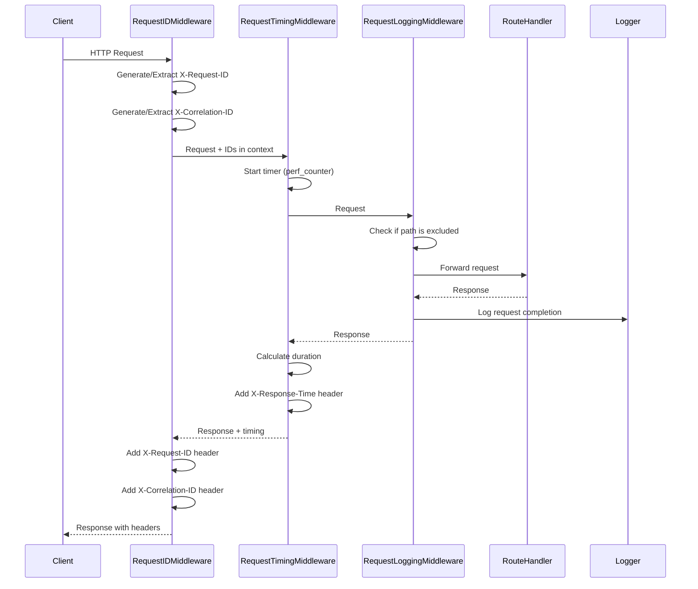
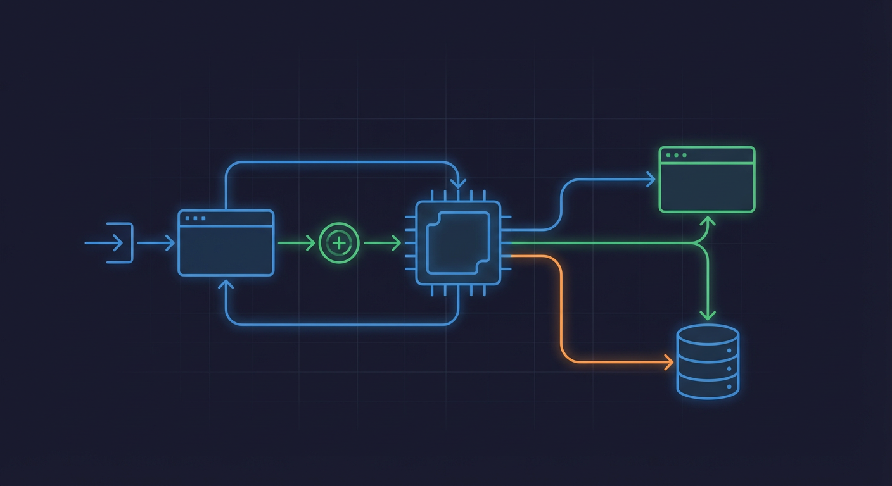

# Request/Response Logging Middleware

> Structured HTTP request logging for observability and debugging

**Key Files:**

- `backend/api/middleware/request_logging.py:1-321` - Primary implementation
- `backend/api/middleware/request_timing.py:1-156` - Request timing measurement
- `backend/api/middleware/request_id.py:1-90` - Request ID generation
- `backend/core/config.py:1819-1823` - Configuration settings

## Overview

The request logging middleware provides structured logging for all HTTP requests processed by the API. It captures request metadata, response status codes, timing information, and correlation IDs to enable log aggregation, analysis, and debugging in tools like Grafana Loki or ELK.

The middleware integrates with OpenTelemetry for trace context propagation, allowing log-to-trace correlation in distributed tracing systems. It masks sensitive data (like client IP addresses) and excludes noisy endpoints (health checks, metrics) from logging to reduce log volume.

## Architecture



## Implementation Details

### RequestLoggingMiddleware



The `RequestLoggingMiddleware` (`backend/api/middleware/request_logging.py:136-321`) provides structured logging for HTTP requests:

```python
# From backend/api/middleware/request_logging.py:136-173
class RequestLoggingMiddleware(BaseHTTPMiddleware):
    """Middleware for structured HTTP request/response logging.

    Features:
    - Logs request completion with timing, status code, and correlation IDs
    - Excludes configurable paths (health checks, metrics) from logging
    - Uses appropriate log levels (ERROR for 5xx, WARNING for 4xx)
    - Masks client IP addresses for privacy
    - Includes trace context for observability correlation
    """

    def __init__(
        self,
        app: Any,
        excluded_paths: list[str] | None = None,
        log_level: int = logging.INFO,
        dispatch: Callable[..., Any] | None = None,
    ) -> None:
        super().__init__(app)
        self.excluded_paths = set(excluded_paths) if excluded_paths else set(DEFAULT_EXCLUDED_PATHS)
        self.default_log_level = log_level
```

### Excluded Paths

By default, the following paths are excluded from logging to reduce noise (`backend/api/middleware/request_logging.py:45-54`):

```python
# From backend/api/middleware/request_logging.py:45-54
DEFAULT_EXCLUDED_PATHS = frozenset(
    {
        "/health",
        "/ready",
        "/metrics",
        "/",
        "/api/system/health",
        "/api/system/health/ready",
    }
)
```

### Log Level Selection

Log levels are determined based on HTTP status code (`backend/api/middleware/request_logging.py:119-134`):

| Status Code Range | Log Level | Use Case            |
| ----------------- | --------- | ------------------- |
| 2xx, 3xx          | INFO      | Successful requests |
| 4xx               | WARNING   | Client errors       |
| 5xx               | ERROR     | Server errors       |

### Request ID Middleware

The `RequestIDMiddleware` (`backend/api/middleware/request_id.py:45-90`) generates and propagates correlation IDs:

```python
# From backend/api/middleware/request_id.py:66-91
async def dispatch(
    self, request: Request, call_next: Callable[[Request], Awaitable[Response]]
) -> Response:
    """Generate request ID and correlation ID, set them in context."""
    # Get existing request ID from header or generate new one
    request_id = request.headers.get("X-Request-ID") or str(uuid.uuid4())[:8]

    # Get existing correlation ID from header or generate new one
    # Correlation ID is a full UUID for distributed tracing
    correlation_id = request.headers.get("X-Correlation-ID") or str(uuid.uuid4())

    # Set in context for logging and service access
    set_request_id(request_id)
    set_correlation_id(correlation_id)

    try:
        response = await call_next(request)
        # Add request ID and correlation ID to response headers
        response.headers["X-Request-ID"] = request_id
        response.headers["X-Correlation-ID"] = correlation_id
        return response
    finally:
        # Clear context
        set_request_id(None)
        set_correlation_id(None)
```

### Request Timing Middleware

The `RequestTimingMiddleware` (`backend/api/middleware/request_timing.py:26-156`) measures request duration:

```python
# From backend/api/middleware/request_timing.py:78-106
async def dispatch(
    self, request: Request, call_next: Callable[[Request], Awaitable[Response]]
) -> Response:
    # Record start time with high precision
    start_time = time.perf_counter()

    try:
        response = await call_next(request)

        # Calculate duration in milliseconds
        duration_ms = (time.perf_counter() - start_time) * 1000

        # Add timing header
        response.headers["X-Response-Time"] = f"{duration_ms:.2f}ms"

        # Log slow requests
        if duration_ms >= self.slow_request_threshold_ms:
            self._log_slow_request(request, response, duration_ms)

        return response
```

## Structured Log Format


The `format_request_log` function (`backend/api/middleware/request_logging.py:60-117`) creates structured log entries:

```python
# From backend/api/middleware/request_logging.py:60-117
def format_request_log(
    method: str,
    path: str,
    status_code: int,
    duration_ms: float,
    client_ip: str,
    request_id: str | None = None,
    correlation_id: str | None = None,
    trace_id: str | None = None,
    span_id: str | None = None,
    user_agent: str | None = None,
    content_length: int | None = None,
) -> dict[str, Any]:
    log_data: dict[str, Any] = {
        "method": method,
        "path": path,
        "status_code": status_code,
        "duration_ms": round(duration_ms, 2),
        "client_ip": client_ip,
    }
    # ... optional fields added if present
    return log_data
```

### Example Log Entry

```json
{
  "timestamp": "2024-01-15T10:30:00.123Z",
  "level": "INFO",
  "message": "GET /api/events completed with 200 in 45.23ms",
  "method": "GET",
  "path": "/api/events",
  "status_code": 200,
  "duration_ms": 45.23,
  "client_ip": "192.xxx.xxx.xxx",
  "request_id": "abc12345",
  "correlation_id": "550e8400-e29b-41d4-a716-446655440000",
  "trace_id": "4bf92f3577b34da6a3ce929d0e0e4736",
  "span_id": "00f067aa0ba902b7",
  "user_agent": "Mozilla/5.0...",
  "content_length": 1234
}
```

## Configuration

| Setting                     | Type   | Default | Description                               |
| --------------------------- | ------ | ------- | ----------------------------------------- |
| `REQUEST_LOGGING_ENABLED`   | `bool` | `true`  | Enable/disable request logging middleware |
| `SLOW_REQUEST_THRESHOLD_MS` | `int`  | `500`   | Threshold for slow request warnings       |

Configuration is loaded from `backend/core/config.py:1819-1823`:

```python
# From backend/core/config.py:1819-1823
request_logging_enabled: bool = Field(
    default=True,
    description="Enable structured request/response logging middleware. "
)
```

## Response Headers

The middleware stack adds the following headers to all responses:

| Header             | Source                  | Description                       | Example                                |
| ------------------ | ----------------------- | --------------------------------- | -------------------------------------- |
| `X-Request-ID`     | RequestIDMiddleware     | Short request identifier          | `abc12345`                             |
| `X-Correlation-ID` | RequestIDMiddleware     | Full UUID for distributed tracing | `550e8400-e29b-41d4-a716-446655440000` |
| `X-Response-Time`  | RequestTimingMiddleware | Request duration                  | `45.23ms`                              |

### Example Response Headers

```http
HTTP/1.1 200 OK
Content-Type: application/json
X-Request-ID: abc12345
X-Correlation-ID: 550e8400-e29b-41d4-a716-446655440000
X-Response-Time: 45.23ms
```

## IP Address Masking

Client IP addresses are masked for privacy (`backend/api/middleware/request_logging.py:294-321`):

```python
# From backend/api/middleware/request_logging.py:294-321
def _get_client_ip(self, request: Request) -> str:
    """Get client IP address from request.

    Checks X-Forwarded-For header first (for proxied requests),
    falls back to client.host.
    """
    # Check X-Forwarded-For header (may contain multiple IPs)
    forwarded_for = request.headers.get("x-forwarded-for")
    if forwarded_for:
        # Take the first IP (original client)
        return forwarded_for.split(",")[0].strip()

    # Check X-Real-IP header (nginx)
    real_ip = request.headers.get("x-real-ip")
    if real_ip:
        return real_ip.strip()

    # Fall back to connection client
    if request.client:
        return request.client.host

    return "unknown"
```

The `mask_ip` function from `backend/core/logging` masks the IP to preserve the first octet only (e.g., `192.xxx.xxx.xxx`).

## Error Handling

### Request Processing Errors

When an exception occurs during request processing, the middleware logs the error with full context (`backend/api/middleware/request_logging.py:268-293`):

```python
# From backend/api/middleware/request_logging.py:268-293
except Exception as e:
    # Calculate duration even for errors
    duration_ms = (time.perf_counter() - start_time) * 1000

    # Log error with context
    log_data = format_request_log(
        method=method,
        path=path,
        status_code=500,
        duration_ms=duration_ms,
        client_ip=client_ip_masked,
        request_id=request_id,
        correlation_id=correlation_id,
        trace_id=trace_ctx.get("trace_id"),
        span_id=trace_ctx.get("span_id"),
    )
    log_data["error_type"] = type(e).__name__

    _logger.error(
        f"{method} {path} failed with exception after {duration_ms:.2f}ms",
        extra=log_data,
        exc_info=True,
    )

    raise
```

## Testing

Test coverage is provided in `backend/tests/unit/api/middleware/`.

### Running Tests

```bash
# Run middleware tests
uv run pytest backend/tests/unit/api/middleware/ -v

# Run with coverage
uv run pytest backend/tests/unit/api/middleware/ --cov=backend.api.middleware
```

## Examples

### Enabling Request Logging

```python
# In backend/main.py
from backend.api.middleware import RequestLoggingMiddleware

app = FastAPI()
app.add_middleware(RequestLoggingMiddleware)
```

### Custom Excluded Paths

```python
app.add_middleware(
    RequestLoggingMiddleware,
    excluded_paths=["/health", "/ready", "/metrics", "/custom-health"],
    log_level=logging.DEBUG,
)
```

### Accessing Request ID in Route Handlers

```python
from backend.api.middleware.request_id import get_correlation_id
from backend.core.logging import get_request_id

@router.get("/api/example")
async def example():
    request_id = get_request_id()
    correlation_id = get_correlation_id()
    logger.info("Processing request", extra={
        "request_id": request_id,
        "correlation_id": correlation_id
    })
    return {"status": "ok"}
```

## Related Documents

- [Error Handling](./error-handling.md) - Exception handling and error responses
- [Observability Hub](../observability/README.md) - Logging infrastructure
- [Security Hub](../security/README.md) - IP masking and privacy

---

_Last updated: 2025-01-24 - Created for NEM-3461_
