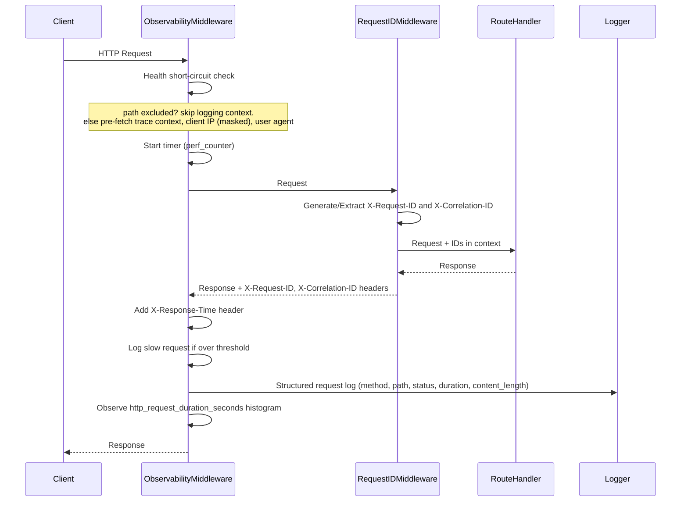

# Request/Response Logging Middleware

> Structured HTTP request logging for observability and debugging

**Key Files:**

- `backend/api/middleware/observability.py:1-369` - `ObservabilityMiddleware` and `format_request_log`
- `backend/api/middleware/request_id.py:1-90` - Request ID generation
- `backend/api/middleware/prometheus.py:64` - `http_request_duration_seconds` histogram
- `backend/core/config.py:2764-2769` - Configuration settings

## Overview

`ObservabilityMiddleware` provides structured logging for all HTTP requests processed by the API. It captures request metadata, response status codes, timing information, and trace context to enable log aggregation, analysis, and debugging in tools like Grafana Loki or ELK.

NEM-5558 unified three separate middlewares into this one pass: the former
`RequestTimingMiddleware` and `RequestLoggingMiddleware` (their files
`backend/api/middleware/request_timing.py` and
`backend/api/middleware/request_logging.py` were deleted; the class names
survive only in `observability.py` docstrings) and `PrometheusMiddleware`
metrics recording. A single `time.perf_counter()` timer now drives the
`X-Response-Time` header, the slow-request warning, the structured request log
and the Prometheus latency histogram, which removes two whole middleware layers
from the request path.

The middleware integrates with OpenTelemetry for trace context propagation, allowing log-to-trace correlation in distributed tracing systems. It masks sensitive data (like client IP addresses) and excludes noisy endpoints (health checks, metrics) from logging to reduce log volume.

## Architecture


```mermaid
sequenceDiagram
    participant Client
    participant ObservabilityMiddleware
    participant RequestIDMiddleware
    participant RouteHandler
    participant Logger

    Client->>ObservabilityMiddleware: HTTP Request
    ObservabilityMiddleware->>ObservabilityMiddleware: Health short-circuit check

    Note over ObservabilityMiddleware: path excluded? skip logging context.<br/>else pre-fetch trace context, client IP (masked), user agent

    ObservabilityMiddleware->>ObservabilityMiddleware: Start timer (perf_counter)
    ObservabilityMiddleware->>RequestIDMiddleware: Request
    RequestIDMiddleware->>RequestIDMiddleware: Generate/Extract X-Request-ID and X-Correlation-ID
    RequestIDMiddleware->>RouteHandler: Request + IDs in context

    RouteHandler-->>RequestIDMiddleware: Response
    RequestIDMiddleware-->>ObservabilityMiddleware: Response + X-Request-ID, X-Correlation-ID headers

    ObservabilityMiddleware->>ObservabilityMiddleware: Add X-Response-Time header
    ObservabilityMiddleware->>ObservabilityMiddleware: Log slow request if over threshold
    ObservabilityMiddleware->>Logger: Structured request log (method, path, status, duration, content_length)
    ObservabilityMiddleware->>ObservabilityMiddleware: Observe http_request_duration_seconds histogram
    ObservabilityMiddleware-->>Client: Response
```

## Implementation Details

### ObservabilityMiddleware

The `ObservabilityMiddleware` (`backend/api/middleware/observability.py:163-369`) combines timing, structured logging and Prometheus metrics in one `dispatch()` pass (`observability.py:214-338`):

```python
# From backend/api/middleware/observability.py:241-252, 278-289 (abridged)
try:
    response = await call_next(request)
    status_code = response.status_code

    # Timing
    duration_seconds = time.perf_counter() - start_time
    duration_ms = duration_seconds * 1000
    response.headers["X-Response-Time"] = f"{duration_ms:.2f}ms"

    # Slow request logging
    if duration_ms >= self.slow_request_threshold_ms:
        self._log_slow_request(request, response, duration_ms)

    # ... structured request logging (see below) ...

    # Prometheus metrics
    if should_record_metrics:
        http_request_duration_seconds.labels(
            method=method,
            handler=_get_handler_name(request),
            status=str(status_code),
            http_route=_get_route_pattern(request),
        ).observe(duration_seconds)
```

### Registration and Placement

In `backend/main.py:1382-1385` the middleware is registered with the structured-log switch fed from settings:

```python
# From backend/main.py:1380-1385 (NEM-5558)
app.add_middleware(
    ObservabilityMiddleware,
    enable_request_logging=get_settings().request_logging_enabled,
)
```

Registration order puts it outside `RequestIDMiddleware` but inside `RequestRecorderMiddleware` and `CORSMiddleware` (see [Middleware Registration](./README.md#middleware-registration)). Two consequences follow from that placement:

- Because `CORSMiddleware` answers preflight `OPTIONS` requests itself, `ObservabilityMiddleware` (inside it) never sees preflights — they are neither timed, logged, nor counted in the histogram.
- The middleware pre-fetches its logging context (including `get_request_id()` and `get_correlation_id()`) _before_ calling inward, and `RequestIDMiddleware` sits inside it — so the pre-fetch runs before the IDs are assigned, and the completion log's `extra` carries `duration_ms`, `content_length`, trace IDs and user agent with `request_id`/`correlation_id` left empty (`format_request_log` omits empty fields). The response headers are unaffected — `RequestIDMiddleware` adds them on the way out.

### Health Short-Circuit and Excluded Paths

Three paths skip observability entirely (`observability.py:44-50`), and more are excluded from request logging to reduce noise (`observability.py:53-62`):

```python
# From backend/api/middleware/observability.py:44-62
HEALTH_SHORT_CIRCUIT_PATHS = frozenset(
    {
        "/health",
        "/api/system/health/ready",
        "/metrics",
    }
)

# Default paths to exclude from request logging (reduce noise)
DEFAULT_EXCLUDED_PATHS = frozenset(
    {
        "/health",
        "/ready",
        "/metrics",
        "/",
        "/api/system/health",
        "/api/system/health/ready",
    }
)
```

Metrics have their own exclusion list, `EXCLUDED_PATHS` in `backend/api/middleware/prometheus.py:74-81`.

### Log Level Selection

Log levels are determined based on HTTP status code (`observability.py:154-160`, default level `logging.INFO`):

| Status Code Range | Log Level | Use Case            |
| ----------------- | --------- | ------------------- |
| 2xx, 3xx          | INFO      | Successful requests |
| 4xx               | WARNING   | Client errors       |
| 5xx               | ERROR     | Server errors       |

### Request ID Middleware

The `RequestIDMiddleware` (`backend/api/middleware/request_id.py:45-90`) generates and propagates correlation IDs:

```python
# From backend/api/middleware/request_id.py:66-90
async def dispatch(
    self, request: Request, call_next: Callable[[Request], Awaitable[Response]]
) -> Response:
    """Generate request ID and correlation ID, set them in context."""
    # Get existing request ID from header or generate new one
    request_id = request.headers.get("X-Request-ID") or str(uuid.uuid4())[:8]

    # Get existing correlation ID from header or generate new one
    # Correlation ID is a full UUID for distributed tracing
    correlation_id = request.headers.get("X-Correlation-ID") or str(uuid.uuid4())

    # Set in context for logging and service access
    set_request_id(request_id)
    set_correlation_id(correlation_id)

    try:
        response = await call_next(request)
        # Add request ID and correlation ID to response headers
        response.headers["X-Request-ID"] = request_id
        response.headers["X-Correlation-ID"] = correlation_id
        return response
    finally:
        # Clear context
        set_request_id(None)
        set_correlation_id(None)
```

## Structured Log Format

The `format_request_log` function (`backend/api/middleware/observability.py:65-121`) creates structured log entries:

```python
# From backend/api/middleware/observability.py:99-121 (abridged)
log_data: dict[str, Any] = {
    "method": method,
    "path": path,
    "status_code": status_code,
    "duration_ms": round(duration_ms, 2),
    "client_ip": client_ip,
}

# Add optional correlation fields
if request_id:
    log_data["request_id"] = request_id
# correlation_id, trace_id, span_id, user_agent and content_length
# are likewise included only when present
return log_data
```

### Example Log Entry

```json
{
  "timestamp": "2024-01-15T10:30:00.123Z",
  "level": "INFO",
  "message": "GET /api/events completed with 200 in 45.23ms",
  "method": "GET",
  "path": "/api/events",
  "status_code": 200,
  "duration_ms": 45.23,
  "client_ip": "192.xxx.xxx.xxx",
  "request_id": "abc12345",
  "correlation_id": "550e8400-e29b-41d4-a716-446655440000",
  "trace_id": "4bf92f3577b34da6a3ce929d0e0e4736",
  "span_id": "00f067aa0ba902b7",
  "user_agent": "Mozilla/5.0...",
  "content_length": 1234
}
```

This is the full shape `format_request_log` produces. The middleware's own completion line, in the shipped registration order, omits `request_id`/`correlation_id` (see Registration and Placement above); those IDs appear on records logged from the handler/service layers, where `ContextFilter` in `backend/core/logging.py` backfills both from context.

## Configuration

| Setting                     | Type   | Default | Description                                          |
| --------------------------- | ------ | ------- | ---------------------------------------------------- |
| `REQUEST_LOGGING_ENABLED`   | `bool` | `true`  | Feed structured logs through ObservabilityMiddleware |
| `SLOW_REQUEST_THRESHOLD_MS` | `int`  | `500`   | Threshold for slow request warnings                  |

Configuration is loaded from `backend/core/config.py:2764-2769`:

```python
# From backend/core/config.py:2764-2769
request_logging_enabled: bool = Field(
    default=True,
    description="Enable structured request/response logging middleware. "
    "When enabled, HTTP requests are logged with timing, status codes, and correlation IDs. "
    "Health check and metrics endpoints are excluded by default to reduce noise.",
)
```

The middleware constructor's own defaults are `enable_request_logging=False` and, for the slow threshold, `500` ms — falling back to the `slow_request_threshold_ms` setting when not passed (`observability.py:178-212`). `backend/main.py` passes only the settings-derived `enable_request_logging` explicitly, so structured logging tracks `request_logging_enabled` (default `true`) and the threshold tracks `SLOW_REQUEST_THRESHOLD_MS`.

## Response Headers

The middleware stack adds the following headers to all responses:

| Header             | Source                  | Description                       | Example                                |
| ------------------ | ----------------------- | --------------------------------- | -------------------------------------- |
| `X-Request-ID`     | RequestIDMiddleware     | Short request identifier          | `abc12345`                             |
| `X-Correlation-ID` | RequestIDMiddleware     | Full UUID for distributed tracing | `550e8400-e29b-41d4-a716-446655440000` |
| `X-Response-Time`  | ObservabilityMiddleware | Request duration                  | `45.23ms`                              |

### Example Response Headers

```http
HTTP/1.1 200 OK
Content-Type: application/json
X-Request-ID: abc12345
X-Correlation-ID: 550e8400-e29b-41d4-a716-446655440000
X-Response-Time: 45.23ms
```

## IP Address Masking

The client IP is resolved from proxy headers first, then masked for privacy (`observability.py:228-235`, `359-369`):

```python
# From backend/api/middleware/observability.py:359-369
def _get_client_ip(self, request: Request) -> str:
    """Get client IP address from request, checking proxy headers."""
    forwarded_for = request.headers.get("x-forwarded-for")
    if forwarded_for:
        return forwarded_for.split(",")[0].strip()
    real_ip = request.headers.get("x-real-ip")
    if real_ip:
        return real_ip.strip()
    if request.client:
        return request.client.host
    return "unknown"
```

The `mask_ip` function from `backend/core/logging` masks the IP to preserve the first octet only (e.g., `192.xxx.xxx.xxx`).

## Error Handling

### Request Processing Errors

When an exception occurs during request processing, the middleware logs the failure with full context and still records metrics (`observability.py:291-338`):

```python
# From backend/api/middleware/observability.py:291-338 (abridged)
except Exception as e:
    duration_ms = (time.perf_counter() - start_time) * 1000

    # Always log failures
    logger.error(
        "Request processing failed",
        extra={
            "duration_ms": round(duration_ms, 2),
            "path": path,
            "method": method,
            "error_type": type(e).__name__,
            "error": str(e),
        },
    )

    # Structured error logging (status_code=500) when enabled
    if should_log:
        log_data = format_request_log(...)
        log_data["error_type"] = type(e).__name__
        logger.error(
            f"{method} {path} failed with exception after {duration_ms:.2f}ms",
            extra=log_data,
            exc_info=True,
        )

    raise
```

### Slow Request Warnings

Requests at or above `slow_request_threshold_ms` produce a WARNING (`observability.py:340-357`) with method, path, status code, duration and unmasked client host, independent of `enable_request_logging`.

## Testing

Test coverage is provided in `backend/tests/unit/api/middleware/test_observability.py`.

### Running Tests

```bash
# Run middleware tests
uv run pytest backend/tests/unit/api/middleware/ -v

# Run with coverage
uv run pytest backend/tests/unit/api/middleware/ --cov=backend.api.middleware
```

## Examples

### Enabling Request Logging

In the shipped app this is enabled through the unified middleware
(`backend/main.py:1382-1385` registers `ObservabilityMiddleware(enable_request_logging=...)`,
gated by `request_logging_enabled`). Mounting the middleware directly, e.g. in
a custom ASGI app, looks like:

```python
from backend.api.middleware import ObservabilityMiddleware

app = FastAPI()
app.add_middleware(ObservabilityMiddleware, enable_request_logging=True)
```

### Custom Excluded Paths

```python
app.add_middleware(
    ObservabilityMiddleware,
    enable_request_logging=True,
    logging_excluded_paths=frozenset({"/health", "/ready", "/metrics", "/custom-health"}),
    slow_request_threshold_ms=250,
)
```

### Accessing Request ID in Route Handlers

```python
from backend.api.middleware.request_id import get_correlation_id
from backend.core.logging import get_request_id

@router.get("/api/example")
async def example():
    request_id = get_request_id()
    correlation_id = get_correlation_id()
    logger.info("Processing request", extra={
        "request_id": request_id,
        "correlation_id": correlation_id
    })
    return {"status": "ok"}
```

## Related Documents

- [Error Handling](./error-handling.md) - Exception handling and error responses
- [Observability Hub](../observability/README.md) - Logging infrastructure
- [Security Hub](../security/README.md) - IP masking and privacy

---

_Last updated: 2025-01-24 - Created for NEM-3461; rewritten for NEM-5558, when RequestTimingMiddleware and RequestLoggingMiddleware were deleted and merged into ObservabilityMiddleware_
