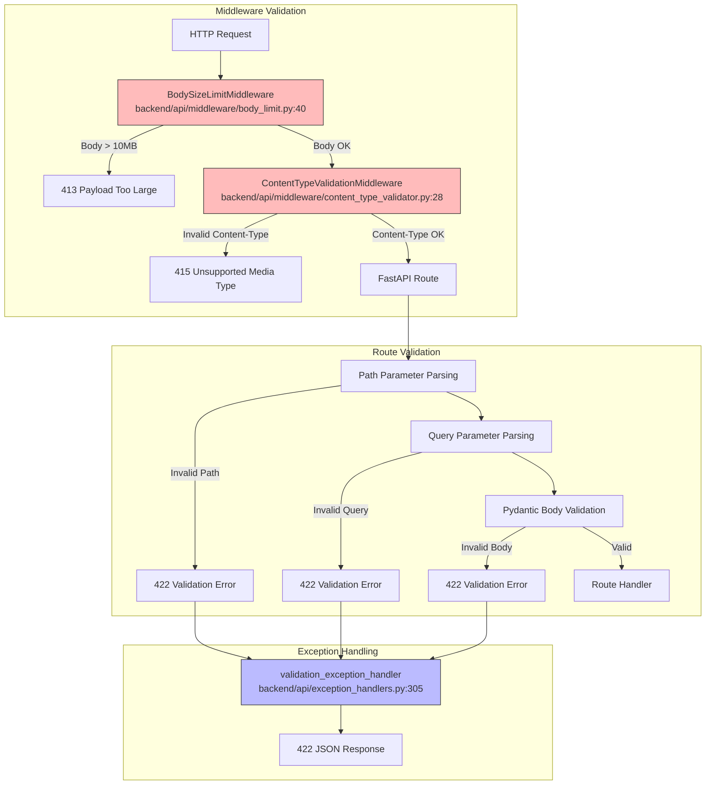

# Request Validation

> Pydantic validation, Content-Type checking, and path parameter parsing

**Key Files:**

- `backend/api/middleware/content_type_validator.py:1-195` - Content-Type validation
- `backend/api/middleware/body_limit.py:1-103` - Request body size limits
- `backend/api/exception_handlers.py:305-374` - Validation error handling
- `backend/api/validators.py` - Custom validation utilities

## Overview

Request validation in the Home Security Intelligence API occurs at multiple layers. The middleware stack validates Content-Type headers and body sizes before requests reach route handlers. Pydantic then validates request bodies, path parameters, and query parameters based on type annotations and validation rules defined in schemas.

The validation system provides detailed error messages with field-level information, making it easy for API clients to identify and fix validation issues. All validation errors are caught by global exception handlers and returned in a consistent format.

## Architecture



## Content-Type Validation

### ContentTypeValidationMiddleware

The `ContentTypeValidationMiddleware` (`backend/api/middleware/content_type_validator.py:28-195`) validates Content-Type headers for requests with bodies:

```python
# From backend/api/middleware/content_type_validator.py:28-58
class ContentTypeValidationMiddleware(BaseHTTPMiddleware):
    """Middleware that validates Content-Type header for request bodies."""

    METHODS_WITH_BODY: ClassVar[set[str]] = {"POST", "PUT", "PATCH"}

    # Allowed content types (base types without charset/boundary parameters)
    ALLOWED_CONTENT_TYPES: ClassVar[set[str]] = {
        "application/json",
        "multipart/form-data",
    }

    # Paths to exempt from Content-Type validation
    EXEMPT_PATHS: ClassVar[set[str]] = {
        "/",
        "/health",
        "/ready",
        "/api/system/health",
        "/api/system/health/ready",
        "/api/metrics",
    }
```

### Content-Type Parsing

The middleware extracts the base content type, ignoring parameters like charset and boundary (`backend/api/middleware/content_type_validator.py:77-96`):

```python
# From backend/api/middleware/content_type_validator.py:77-96
def _parse_content_type(self, content_type_header: str) -> str:
    """Parse Content-Type header to extract base type.

    Handles Content-Type headers with parameters like charset or boundary:
    - "application/json; charset=utf-8" -> "application/json"
    - "multipart/form-data; boundary=----" -> "multipart/form-data"
    """
    if not content_type_header:
        return ""

    # Split on semicolon to remove parameters
    base_type = content_type_header.split(";")[0].strip().lower()
    return base_type
```

### Error Response

When Content-Type validation fails, a 415 Unsupported Media Type is returned:

```json
{
  "detail": "Unsupported Media Type: text/plain. Use application/json or multipart/form-data",
  "error": "unsupported_media_type"
}
```

## Body Size Limits

### BodySizeLimitMiddleware

The `BodySizeLimitMiddleware` (`backend/api/middleware/body_limit.py:40-103`) prevents DoS attacks via large payloads:

```python
# From backend/api/middleware/body_limit.py:40-71
class BodySizeLimitMiddleware(BaseHTTPMiddleware):
    """Middleware to limit request body size and prevent DoS attacks.

    This middleware checks the Content-Length header before processing
    the request body. If the declared size exceeds the configured limit,
    the request is rejected with a 413 Payload Too Large response.
    """

    def __init__(
        self,
        app: ASGIApp,
        max_body_size: int = DEFAULT_MAX_BODY_SIZE,  # 10MB
    ) -> None:
        super().__init__(app)
        self.max_body_size = max_body_size
```

### Default Limit

The default limit is 10MB, configured in `backend/main.py:1061`:

```python
# From backend/main.py:1061
app.add_middleware(BodySizeLimitMiddleware, max_body_size=10 * 1024 * 1024)
```

### Error Response

When body size exceeds the limit:

```json
{
  "error_code": "PAYLOAD_TOO_LARGE",
  "message": "Request body too large"
}
```

## Pydantic Validation

### Request Body Validation

FastAPI automatically validates request bodies using Pydantic models:

```python
# Example from backend/api/schemas/events.py
class EventCreate(BaseModel):
    camera_id: str = Field(..., min_length=1, max_length=100)
    risk_score: int = Field(..., ge=0, le=100)
    summary: str | None = Field(None, max_length=1000)

    @field_validator("camera_id")
    def validate_camera_id(cls, v: str) -> str:
        if not v.replace("_", "").replace("-", "").isalnum():
            raise ValueError("Camera ID must be alphanumeric with underscores/hyphens")
        return v
```

### Path Parameter Validation

Path parameters are validated based on type annotations:

```python
@router.get("/events/{event_id}")
async def get_event(
    event_id: int = Path(..., ge=1, description="Event ID")
) -> EventResponse:
    ...
```

### Query Parameter Validation

Query parameters support default values, constraints, and custom types:

```python
@router.get("/events")
async def list_events(
    limit: int = Query(50, ge=1, le=200),
    offset: int = Query(0, ge=0),
    camera_id: str | None = Query(None, max_length=100),
    start_date: datetime | None = Query(None),
    end_date: datetime | None = Query(None),
) -> EventListResponse:
    ...
```

## Validation Error Response

The `validation_exception_handler` (`backend/api/exception_handlers.py:305-374`) formats validation errors:

```python
# From backend/api/exception_handlers.py:305-374
async def validation_exception_handler(
    request: Request,
    exc: RequestValidationError,
) -> JSONResponse:
    """Handle Pydantic validation errors from request parsing."""
    errors = []
    for error in exc.errors():
        # Build field path (e.g., "body.name", "query.limit")
        loc = error.get("loc", ())
        field_parts = [str(part) for part in loc]
        field = ".".join(field_parts) if field_parts else "unknown"

        # Get message and sanitize
        msg = error.get("msg", "Validation error")

        # Get the invalid value (truncate for security)
        input_value = error.get("input")
        value = None
        if input_value is not None:
            str_value = str(input_value)
            value = str_value[:100] if len(str_value) > 100 else str_value

        errors.append({
            "field": field,
            "message": msg,
            "value": value,
        })
```

### Error Response Format

```json
{
  "error": {
    "code": "VALIDATION_ERROR",
    "message": "Request validation failed",
    "errors": [
      {
        "field": "body.risk_score",
        "message": "Input should be less than or equal to 100",
        "value": "150"
      },
      {
        "field": "body.camera_id",
        "message": "Field required",
        "value": null
      },
      {
        "field": "query.limit",
        "message": "Input should be less than or equal to 200",
        "value": "500"
      }
    ],
    "request_id": "abc12345",
    "timestamp": "2024-01-15T10:30:00.123456Z"
  }
}
```

### Field Location Prefixes

| Prefix    | Description        | Example            |
| --------- | ------------------ | ------------------ |
| `body.`   | Request body field | `body.camera_id`   |
| `query.`  | Query parameter    | `query.limit`      |
| `path.`   | Path parameter     | `path.event_id`    |
| `header.` | Request header     | `header.X-API-Key` |

## Custom Validators

### Date Range Validation

The `validate_date_range` utility (`backend/api/validators.py`) validates date ranges:

```python
# From backend/api/validators.py
def validate_date_range(
    start_date: datetime | None,
    end_date: datetime | None,
) -> tuple[datetime | None, datetime | None]:
    """Validate and normalize date range parameters.

    Raises HTTPException if start_date is after end_date.
    """
    if start_date and end_date and start_date > end_date:
        raise HTTPException(
            status_code=status.HTTP_400_BAD_REQUEST,
            detail="start_date must be before or equal to end_date",
        )
    return start_date, end_date
```

### Field Filtering

The field filter utilities (`backend/api/utils/field_filter.py`) validate sparse fieldsets:

```python
# Example usage from backend/api/routes/events.py:89-106
VALID_EVENT_LIST_FIELDS = frozenset({
    "id", "camera_id", "started_at", "ended_at",
    "risk_score", "risk_level", "summary", "reasoning",
    "reviewed", "detection_count", "thumbnail_url",
})

@router.get("/events")
async def list_events(
    fields: str | None = Query(None, description="Comma-separated field names"),
) -> EventListResponse:
    if fields:
        field_list = parse_fields_param(fields)
        validate_fields(field_list, VALID_EVENT_LIST_FIELDS)
```

## Idempotency Key Validation

The `IdempotencyMiddleware` validates Idempotency-Key headers (`backend/api/middleware/idempotency.py:75-98`):

```python
# From backend/api/middleware/idempotency.py:75-98
IDEMPOTENCY_KEY_PATTERN = re.compile(r"^[a-zA-Z0-9_\-]+$")
IDEMPOTENCY_KEY_MAX_LENGTH = 256
IDEMPOTENCY_KEY_MIN_LENGTH = 1

def validate_idempotency_key(key: str) -> tuple[bool, str | None]:
    """Validate an idempotency key for format and length."""
    if len(key) < IDEMPOTENCY_KEY_MIN_LENGTH:
        return False, "Idempotency-Key cannot be empty"

    if len(key) > IDEMPOTENCY_KEY_MAX_LENGTH:
        return False, f"Idempotency-Key exceeds maximum length of {IDEMPOTENCY_KEY_MAX_LENGTH} characters"

    if not IDEMPOTENCY_KEY_PATTERN.match(key):
        return False, "Idempotency-Key contains invalid characters. Only alphanumeric characters, underscores, and hyphens are allowed."

    return True, None
```

## Testing Validation

### Unit Testing Validation

```python
import pytest
from fastapi.testclient import TestClient
from backend.main import app

client = TestClient(app)

def test_validation_error_response():
    """Test that validation errors return proper format."""
    response = client.post(
        "/api/events",
        json={"risk_score": 150},  # Invalid: > 100
    )
    assert response.status_code == 422
    data = response.json()
    assert data["error"]["code"] == "VALIDATION_ERROR"
    assert any(e["field"] == "body.risk_score" for e in data["error"]["errors"])

def test_content_type_validation():
    """Test Content-Type validation."""
    response = client.post(
        "/api/events",
        content="not json",
        headers={"Content-Type": "text/plain"},
    )
    assert response.status_code == 415
```

### Running Tests

```bash
# Run validation tests
uv run pytest backend/tests/unit/api/middleware/ -v -k validation

# Run with coverage
uv run pytest backend/tests/unit/api/ --cov=backend.api.middleware
```

## Common Validation Patterns

### Enum Validation

```python
class RiskLevel(str, Enum):
    LOW = "low"
    MEDIUM = "medium"
    HIGH = "high"
    CRITICAL = "critical"

class EventCreate(BaseModel):
    risk_level: RiskLevel = Field(..., description="Risk severity level")
```

### Nested Object Validation

```python
class DetectionBox(BaseModel):
    x: int = Field(..., ge=0)
    y: int = Field(..., ge=0)
    width: int = Field(..., ge=1)
    height: int = Field(..., ge=1)

class Detection(BaseModel):
    label: str
    confidence: float = Field(..., ge=0.0, le=1.0)
    box: DetectionBox
```

### List Validation

```python
class BulkCreateRequest(BaseModel):
    items: list[EventCreate] = Field(
        ...,
        min_length=1,
        max_length=100,
        description="Items to create (1-100)",
    )
```

## Related Documents

- [Error Handling](./error-handling.md) - Validation error response format
- [API Reference](../api-reference/README.md) - API schemas and constraints
- [Testing Hub](../testing/README.md) - Validation test patterns

---

_Last updated: 2025-01-24 - Created for NEM-3461_
