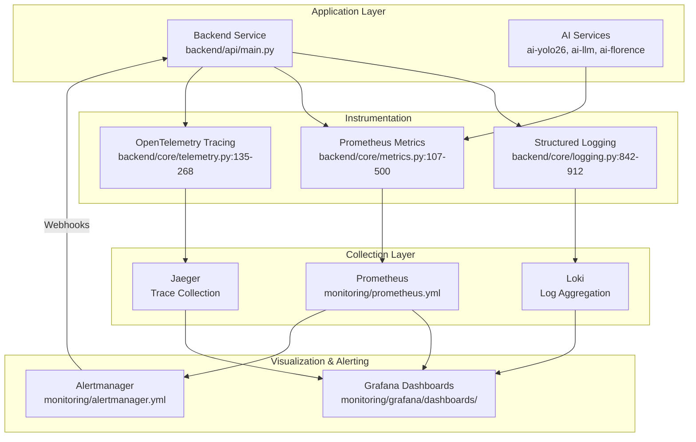
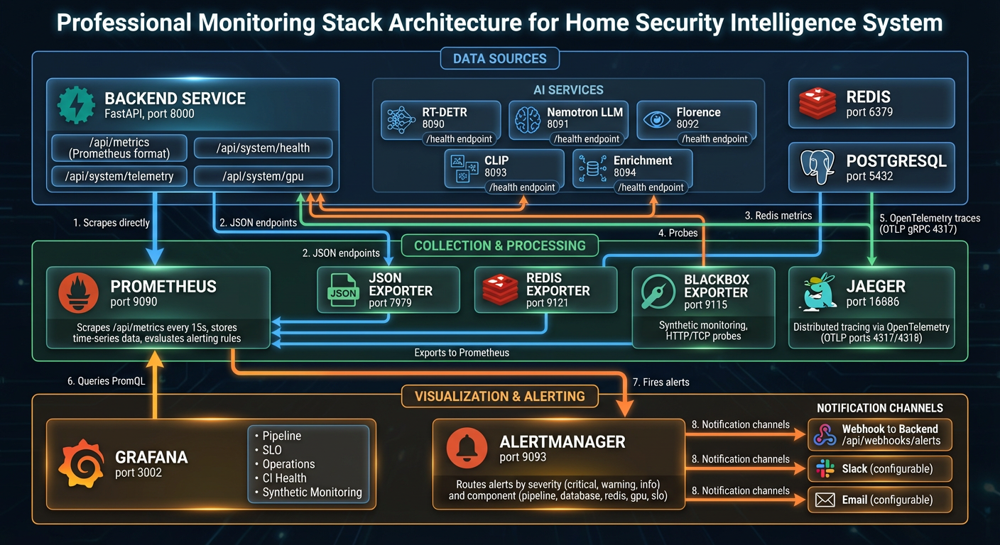

# Observability Hub

> Comprehensive observability stack providing structured logging, distributed tracing, metrics collection, and alerting for the home security intelligence system.

## Overview

The observability infrastructure provides full visibility into system operation through four pillars: structured logging with JSON output and trace correlation, Prometheus metrics for quantitative monitoring, distributed tracing via OpenTelemetry for request flow analysis, and Grafana dashboards with Alertmanager for visualization and alerting.

All components are designed for correlation. Log entries include trace IDs and span IDs enabling navigation from logs to traces. Metrics include labels that map to trace attributes. Grafana datasources are configured with derived fields and trace-to-metrics queries for seamless navigation between observability data types.

The stack runs entirely in containers alongside the application services, with Prometheus scraping metrics endpoints, Loki aggregating logs, Jaeger collecting traces, and Grafana providing unified visualization. Alertmanager routes alerts based on severity and component, with inhibition rules preventing alert storms.

## Documents

| Document                                           | Description                                             | Key Files                              |
| -------------------------------------------------- | ------------------------------------------------------- | -------------------------------------- |
| [structured-logging.md](./structured-logging.md)   | JSON log format, context propagation, trace correlation | `backend/core/logging.py:1-1232`       |
| [prometheus-metrics.md](./prometheus-metrics.md)   | Custom metrics definitions, histogram buckets, labels   | `backend/core/metrics.py:1-3240`       |
| [distributed-tracing.md](./distributed-tracing.md) | OpenTelemetry setup, span context, baggage propagation  | `backend/core/telemetry.py:1-1007`     |
| [grafana-dashboards.md](./grafana-dashboards.md)   | Dashboard configurations, panel queries, datasources    | `monitoring/grafana/dashboards/*.json` |
| [alertmanager.md](./alertmanager.md)               | Alert routing, notification channels, inhibition rules  | `monitoring/alertmanager.yml:1-215`    |

## Architecture Diagram



## Quick Reference

| Component             | File                                   | Purpose                                            |
| --------------------- | -------------------------------------- | -------------------------------------------------- |
| `setup_logging`       | `backend/core/logging.py:842-912`      | Configure console, file, and database log handlers |
| `CustomJsonFormatter` | `backend/core/logging.py:612-697`      | JSON log formatting with trace context             |
| `ContextFilter`       | `backend/core/logging.py:467-609`      | Inject request ID, trace ID, span ID into logs     |
| `setup_telemetry`     | `backend/core/telemetry.py:135-268`    | Initialize OpenTelemetry with auto-instrumentation |
| `MetricsService`      | `backend/core/metrics.py:696-1244`     | Centralized Prometheus metric recording            |
| Prometheus Config     | `monitoring/prometheus.yml:1-410`      | Scrape configuration for all services              |
| Alertmanager Config   | `monitoring/alertmanager.yml:1-215`    | Alert routing and notification                     |
| Alerting Rules        | `monitoring/alerting-rules.yml:1-1116` | Alert definitions with severity labels             |

## Key Concepts

### Trace Correlation

Every log entry includes `trace_id` and `span_id` fields when OpenTelemetry is active. This enables navigation from logs to the corresponding distributed trace in Jaeger:

```
trace_id=abc123def456... span_id=789xyz...
```

Grafana's Loki datasource is configured with derived fields to extract trace IDs and link directly to Jaeger (`monitoring/grafana/provisioning/datasources/prometheus.yml:198-214`).

### Metric Cardinality Control

All metric labels are sanitized through allowlists to prevent cardinality explosion (`backend/core/sanitization.py`). Camera IDs, error types, object classes, and risk levels are validated before being used as label values.

### Multi-Window Alerting

Alerts use multi-window burn rate calculations for SLO monitoring. Fast burns (14.4x over 1h) trigger critical alerts, while slow burns (3x over 1d) trigger warnings (`monitoring/prometheus-rules.yml:141-169`).

## Configuration

| Setting                       | Location                 | Default                    | Description                   |
| ----------------------------- | ------------------------ | -------------------------- | ----------------------------- |
| `LOG_LEVEL`                   | `backend/core/config.py` | `INFO`                     | Minimum log level             |
| `LOG_FILE_PATH`               | `backend/core/config.py` | `/var/log/hsi/backend.log` | Log file location             |
| `OTEL_ENABLED`                | `backend/core/config.py` | `False`                    | Enable OpenTelemetry tracing  |
| `OTEL_SERVICE_NAME`           | `backend/core/config.py` | `nemotron-backend`         | Service name in traces        |
| `OTEL_TRACE_SAMPLE_RATE`      | `backend/core/config.py` | `1.0`                      | Trace sampling rate (0.0-1.0) |
| `OTEL_EXPORTER_OTLP_ENDPOINT` | `backend/core/config.py` | `http://localhost:4317`    | OTLP collector endpoint       |

## Monitoring Stack Components



The monitoring stack provides comprehensive observability through integrated components that share data and enable cross-correlation between metrics, logs, and traces.

## Datasources

| Datasource   | Type                           | Purpose                       | Configuration                                                        |
| ------------ | ------------------------------ | ----------------------------- | -------------------------------------------------------------------- |
| Prometheus   | `prometheus`                   | Metrics queries and alerts    | `monitoring/grafana/provisioning/datasources/prometheus.yml:6-16`    |
| Alertmanager | `alertmanager`                 | Alert state visualization     | `monitoring/grafana/provisioning/datasources/prometheus.yml:18-28`   |
| Jaeger       | `jaeger`                       | Distributed trace exploration | `monitoring/grafana/provisioning/datasources/prometheus.yml:41-101`  |
| Loki         | `loki`                         | Log aggregation and search    | `monitoring/grafana/provisioning/datasources/prometheus.yml:198-214` |
| Pyroscope    | `grafana-pyroscope-datasource` | Continuous profiling          | `monitoring/grafana/provisioning/datasources/prometheus.yml:216-231` |

## Related Hubs

- [Resilience Patterns](../resilience-patterns/README.md) - Circuit breakers and error monitoring
- [System Overview](../system-overview/README.md) - Architecture context
- [AI Orchestration](../ai-orchestration/README.md) - AI service metrics
- [Testing](../testing/README.md) - Observability testing patterns
