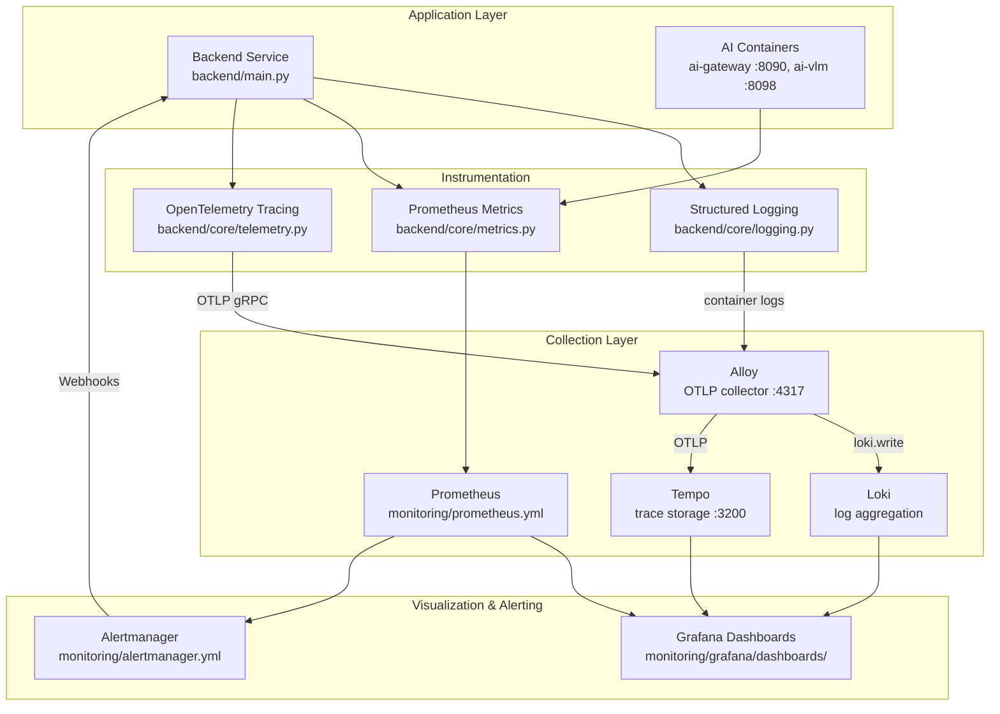
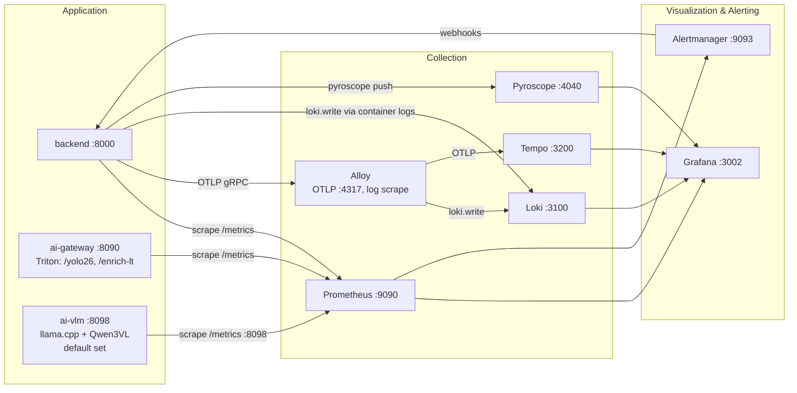

# Observability Hub

> Comprehensive observability stack providing structured logging, distributed tracing, metrics collection, and alerting for the home security intelligence system.

## Overview

The observability infrastructure provides full visibility into system operation through four pillars: structured logging with JSON output and trace correlation, Prometheus metrics for quantitative monitoring, distributed tracing via OpenTelemetry for request flow analysis, and Grafana dashboards with Alertmanager for visualization and alerting.

All components are designed for correlation. Log entries include trace IDs and span IDs enabling navigation from logs to traces. Metrics include labels that map to trace attributes. Grafana datasources are configured with derived fields and trace-to-metrics queries for seamless navigation between observability data types.

The stack runs entirely in containers alongside the application services: Prometheus scrapes
metrics endpoints, Alloy receives OTLP traces and forwards them to Tempo, Loki stores logs, and
Grafana provides unified visualization. Alertmanager routes alerts based on severity and component,
with inhibition rules preventing alert storms (`monitoring/alertmanager.yml:45, 118`). Alloy also
scrapes container logs and ships them to Loki (`monitoring/alloy/config.alloy:50-140`).

## Documents

| Document                                           | Description                                             | Key Files                                 |
| -------------------------------------------------- | ------------------------------------------------------- | ----------------------------------------- |
| [structured-logging.md](./structured-logging.md)   | JSON log format, context propagation, trace correlation | `backend/core/logging.py` (1265 lines)    |
| [prometheus-metrics.md](./prometheus-metrics.md)   | Custom metrics definitions, histogram buckets, labels   | `backend/core/metrics.py` (5201 lines)    |
| [distributed-tracing.md](./distributed-tracing.md) | OpenTelemetry setup, span context, baggage propagation  | `backend/core/telemetry.py` (1574 lines)  |
| [grafana-dashboards.md](./grafana-dashboards.md)   | Dashboard configurations, panel queries, datasources    | `monitoring/grafana/dashboards/*.json`    |
| [alertmanager.md](./alertmanager.md)               | Alert routing, notification channels, inhibition rules  | `monitoring/alertmanager.yml` (238 lines) |

## Architecture Diagram


```mermaid
graph TD
    subgraph "Application Layer"
        BE[Backend Service<br/>backend/main.py]
        AI[AI Containers<br/>ai-gateway :8090, ai-vlm :8098]
    end

    subgraph "Instrumentation"
        LOG[Structured Logging<br/>backend/core/logging.py]
        MET[Prometheus Metrics<br/>backend/core/metrics.py]
        TRC[OpenTelemetry Tracing<br/>backend/core/telemetry.py]
    end

    subgraph "Collection Layer"
        PROM[Prometheus<br/>monitoring/prometheus.yml]
        LOKI[Loki<br/>log aggregation]
        ALLOY[Alloy<br/>OTLP collector :4317]
        TEMPO[Tempo<br/>trace storage :3200]
    end

    subgraph "Visualization & Alerting"
        GRAF[Grafana Dashboards<br/>monitoring/grafana/dashboards/]
        AM[Alertmanager<br/>monitoring/alertmanager.yml]
    end

    BE --> LOG
    BE --> MET
    BE --> TRC
    AI --> MET

    LOG --> |container logs| ALLOY
    ALLOY --> |loki.write| LOKI
    MET --> PROM
    TRC --> |OTLP gRPC| ALLOY
    ALLOY --> |OTLP| TEMPO

    PROM --> GRAF
    LOKI --> GRAF
    TEMPO --> GRAF
    PROM --> AM

    AM --> |Webhooks| BE
```

## Quick Reference

| Component             | File                                                           | Purpose                                            |
| --------------------- | -------------------------------------------------------------- | -------------------------------------------------- |
| `setup_logging`       | `backend/core/logging.py:852-934`                              | Configure console, file, and database log handlers |
| `CustomJsonFormatter` | `backend/core/logging.py:611-698`                              | JSON log formatting with trace context             |
| `ContextFilter`       | `backend/core/logging.py:466-610`                              | Inject request ID, trace ID, span ID into logs     |
| `setup_telemetry`     | `backend/core/telemetry.py:145-354`                            | Initialize OpenTelemetry with auto-instrumentation |
| `MetricsService`      | `backend/core/metrics.py:910-1367`                             | Centralized Prometheus metric recording            |
| Prometheus Config     | `monitoring/prometheus.yml` (509 lines; scrape_configs at :51) | Scrape configuration for all services              |
| Alertmanager Config   | `monitoring/alertmanager.yml` (238 lines)                      | Alert routing and notification                     |
| Alerting Rules        | `monitoring/alerting-rules.yml` (1153 lines)                   | Alert definitions with severity labels             |

## Key Concepts

### Trace Correlation

Every log entry includes `trace_id` and `span_id` fields when OpenTelemetry is active. This enables
navigation from logs to the corresponding distributed trace in Tempo:

```
trace_id=abc123def456... span_id=789xyz...
```

Grafana's Loki datasource is configured with derived fields to extract trace IDs and link directly
to Tempo (`monitoring/grafana/provisioning/datasources/prometheus.yml:212-218`).

### Metric Cardinality Control

All metric labels are sanitized through allowlists to prevent cardinality explosion (`backend/core/sanitization.py`). Camera IDs, error types, object classes, and risk levels are validated before being used as label values.

### Multi-Window Alerting

Alerts use multi-window burn rate calculations for SLO monitoring. Fast burns (14.4x over 1h, paired with 6x over 6h) trigger critical alerts, while slow burns (3x over 1d) trigger warnings
(`monitoring/alerting-rules.yml:331-361`, on the burn-rate series recorded in
`monitoring/prometheus-rules.yml:141-169`).

## Configuration

| Setting                       | Location                      | Default                  | Description                   |
| ----------------------------- | ----------------------------- | ------------------------ | ----------------------------- |
| `LOG_LEVEL`                   | `backend/core/config.py:1851` | `WARNING`                | Minimum log level             |
| `LOG_FILE_PATH`               | `backend/core/config.py:1855` | `data/logs/security.log` | Log file location             |
| `OTEL_ENABLED`                | `backend/core/config.py:1742` | `True`                   | Enable OpenTelemetry tracing  |
| `OTEL_SERVICE_NAME`           | `backend/core/config.py:1747` | `nemotron-backend`       | Service name in traces        |
| `OTEL_TRACE_SAMPLE_RATE`      | `backend/core/config.py:1762` | `1.0`                    | Trace sampling rate (0.0-1.0) |
| `OTEL_EXPORTER_OTLP_ENDPOINT` | `backend/core/config.py:1752` | `http://alloy:4317`      | OTLP collector endpoint       |

## Monitoring Stack Components

The deployed monitoring topology (match it in every diagram on this page):


```mermaid
graph LR
    subgraph App["Application"]
        BE[backend :8000]
        GW[ai-gateway :8090<br/>Triton: /yolo26, /enrich-lt]
        VLM[ai-vlm :8098<br/>llama.cpp + Qwen3VL<br/>default set]
    end

    subgraph Collect["Collection"]
        ALLOY[Alloy<br/>OTLP :4317, log scrape]
        PROM[Prometheus :9090]
        LOKI[Loki :3100]
        TEMPO[Tempo :3200]
        PYRO[Pyroscope :4040]
    end

    subgraph Viz["Visualization & Alerting"]
        GRAF[Grafana :3002]
        AM[Alertmanager :9093]
    end

    BE --> |scrape /metrics| PROM
    GW --> |scrape /metrics| PROM
    VLM --> |scrape /metrics :8098| PROM
    BE --> |OTLP gRPC| ALLOY
    ALLOY --> |loki.write| LOKI
    ALLOY --> |OTLP| TEMPO
    BE --> |loki.write via container logs| LOKI
    BE --> |pyroscope push| PYRO
    PROM --> GRAF
    LOKI --> GRAF
    TEMPO --> GRAF
    PYRO --> GRAF
    PROM --> AM
    AM --> |webhooks| BE
```

Prometheus scrapes the backend, `ai-gateway` and `ai-vlm` directly
(`monitoring/prometheus.yml:61, 90, 138`), and the blackbox job probes
`http://ai-vlm:8098/health`, `http://ai-gateway:8090/health`,
`http://ai-gateway:8090/yolo26/health` and
`http://ai-gateway:8090/enrich-lt/health` (`monitoring/prometheus.yml:404-434`).

The monitoring stack provides comprehensive observability through integrated components that share data and enable cross-correlation between metrics, logs, and traces.

## Datasources

| Datasource   | Type                           | Purpose                       | Configuration                                                        |
| ------------ | ------------------------------ | ----------------------------- | -------------------------------------------------------------------- |
| Prometheus   | `prometheus`                   | Metrics queries and alerts    | `monitoring/grafana/provisioning/datasources/prometheus.yml:13-23`   |
| Alertmanager | `alertmanager`                 | Alert state visualization     | `monitoring/grafana/provisioning/datasources/prometheus.yml:25-35`   |
| Backend-API  | `marcusolsson-json-datasource` | JSON API queries via backend  | `monitoring/grafana/provisioning/datasources/prometheus.yml:37-46`   |
| Tempo        | `tempo`                        | Distributed trace exploration | `monitoring/grafana/provisioning/datasources/prometheus.yml:48-200`  |
| Loki         | `loki`                         | Log aggregation and search    | `monitoring/grafana/provisioning/datasources/prometheus.yml:202-218` |
| Pyroscope    | `grafana-pyroscope-datasource` | Continuous profiling          | `monitoring/grafana/provisioning/datasources/prometheus.yml:220-237` |

## Related Hubs

- [Resilience Patterns](../resilience-patterns/README.md) - Circuit breakers and error monitoring
- [System Overview](../system-overview/README.md) - Architecture context
- [AI Orchestration](../ai-orchestration/README.md) - AI service metrics
- [Testing](../testing/README.md) - Observability testing patterns
