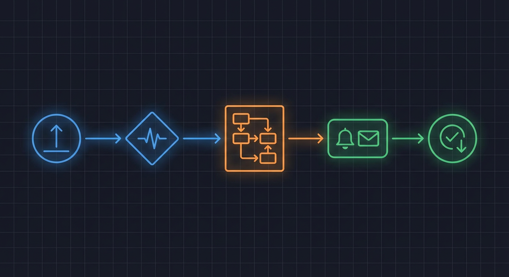
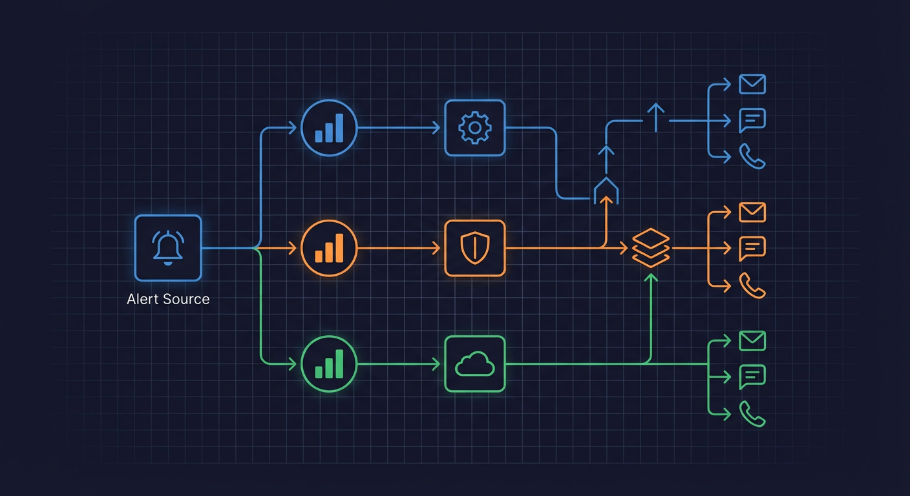
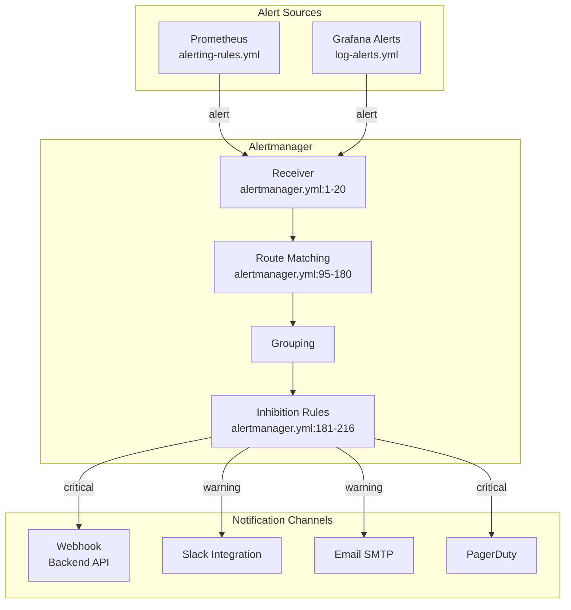

# Alertmanager



> Alert routing, notification channels, and inhibition rules for the home security intelligence system.

**Key Files:**

- `monitoring/alertmanager.yml:1-215` - Alertmanager configuration
- `monitoring/alerting-rules.yml:1-1116` - Alert rule definitions
- `monitoring/prometheus-rules.yml:1-169` - Recording rules for SLIs
- `monitoring/grafana/provisioning/alerting/log-alerts.yml` - Grafana log-based alerts

## Overview

Alertmanager receives alerts from Prometheus based on metric thresholds and routes them to appropriate notification channels. The system uses severity-based routing with escalation paths, grouping to reduce alert noise, and inhibition rules to prevent cascading alerts during major incidents.

Alerts are categorized by severity (critical, warning, info) and component (pipeline, infrastructure, ai-services, database). Route matching determines notification channel: critical alerts trigger webhooks and multiple channels, warnings go to standard channels, and info alerts are logged only.

The configuration supports both self-hosted and cloud deployments with flexible notification targets including webhooks, email, Slack, and PagerDuty.

## Architecture





## Alert Configuration

### Global Settings

Base configuration (`monitoring/alertmanager.yml:1-30`):

```yaml
global:
  # Time to wait before declaring an alert resolved
  resolve_timeout: 5m

  # SMTP configuration for email alerts
  smtp_smarthost: 'smtp.example.com:587'
  smtp_from: 'alertmanager@example.com'
  smtp_auth_username: 'alertmanager'
  smtp_auth_password: '${SMTP_PASSWORD}'
  smtp_require_tls: true

  # Slack API URL (can be overridden per receiver)
  slack_api_url: '${SLACK_WEBHOOK_URL}'

  # PagerDuty service key
  pagerduty_url: 'https://events.pagerduty.com/v2/enqueue'
```

### Receiver Configuration

Define notification targets (`monitoring/alertmanager.yml:35-90`):

```yaml
receivers:
  # Critical alerts: webhook + PagerDuty
  - name: 'critical-alerts'
    webhook_configs:
      - url: 'http://backend:8000/api/webhooks/alerts'
        send_resolved: true
        http_config:
          basic_auth:
            username: 'alertmanager'
            password_file: '/etc/alertmanager/webhook_password'
    pagerduty_configs:
      - service_key: '${PAGERDUTY_SERVICE_KEY}'
        severity: 'critical'
        description: '{{ .CommonAnnotations.summary }}'
        details:
          firing: '{{ template "pagerduty.default.instances" .Alerts.Firing }}'
          resolved: '{{ template "pagerduty.default.instances" .Alerts.Resolved }}'

  # Warning alerts: Slack
  - name: 'warning-alerts'
    slack_configs:
      - channel: '#hsi-alerts'
        send_resolved: true
        title: '{{ .Status | toUpper }}: {{ .CommonAnnotations.summary }}'
        text: '{{ .CommonAnnotations.description }}'
        color: '{{ if eq .Status "firing" }}danger{{ else }}good{{ end }}'

  # Info alerts: log only (no notification)
  - name: 'info-alerts'
    webhook_configs:
      - url: 'http://backend:8000/api/webhooks/alerts?severity=info'
        send_resolved: false

  # Null receiver for silenced alerts
  - name: 'null'
```

### Route Configuration

Route matching rules (`monitoring/alertmanager.yml:95-180`):

```yaml
route:
  # Default receiver for unmatched alerts
  receiver: 'warning-alerts'

  # Time to wait before sending initial alert
  group_wait: 30s

  # Time between alert batches for same group
  group_interval: 5m

  # Time before re-sending if alert still firing
  repeat_interval: 4h

  # Group alerts by these labels
  group_by: ['alertname', 'severity', 'component']

  # Child routes (evaluated in order, first match wins)
  routes:
    # Critical infrastructure alerts
    - match:
        severity: critical
        component: infrastructure
      receiver: 'critical-alerts'
      group_wait: 10s
      repeat_interval: 1h

    # Critical pipeline alerts
    - match:
        severity: critical
        component: pipeline
      receiver: 'critical-alerts'
      group_wait: 10s

    # Critical AI service alerts
    - match:
        severity: critical
        component: ai-services
      receiver: 'critical-alerts'
      group_wait: 10s

    # Warning alerts by component
    - match:
        severity: warning
      receiver: 'warning-alerts'

    # Info alerts (logging only)
    - match:
        severity: info
      receiver: 'info-alerts'

    # Database alerts to dedicated channel
    - match_re:
        alertname: 'Database.*'
      receiver: 'critical-alerts'
      group_by: ['alertname', 'instance']
```

### Inhibition Rules

Prevent alert cascades (`monitoring/alertmanager.yml:181-215`):

```yaml
inhibit_rules:
  # If backend is down, suppress all dependent alerts
  - source_match:
      alertname: 'BackendDown'
      severity: 'critical'
    target_match:
      component: 'pipeline'
    equal: ['instance']

  # If GPU is unavailable, suppress AI service alerts
  - source_match:
      alertname: 'GPUUnavailable'
    target_match:
      component: 'ai-services'

  # If Redis is down, suppress cache-related alerts
  - source_match:
      alertname: 'RedisDown'
    target_match_re:
      alertname: 'Cache.*|Queue.*'

  # If Prometheus is down, suppress metric-based alerts
  - source_match:
      alertname: 'PrometheusDown'
    target_match_re:
      alertname: '.*Latency.*|.*Rate.*|.*Queue.*'

  # Critical severity inhibits warning for same alertname
  - source_match:
      severity: 'critical'
    target_match:
      severity: 'warning'
    equal: ['alertname', 'instance']
```

## Alert Rule Definitions

### Infrastructure Alerts

Service availability (`monitoring/alerting-rules.yml:15-80`):

| Alert            | Condition                    | Severity | For |
| ---------------- | ---------------------------- | -------- | --- |
| `BackendDown`    | `up{job="hsi-backend"} == 0` | critical | 1m  |
| `RedisDown`      | `up{job="redis"} == 0`       | critical | 1m  |
| `PrometheusDown` | `up{job="prometheus"} == 0`  | critical | 1m  |
| `PostgresDown`   | `up{job="postgres"} == 0`    | critical | 1m  |
| `JaegerDown`     | `up{job="jaeger"} == 0`      | warning  | 5m  |

Example rule:

```yaml
- alert: BackendDown
  expr: up{job="hsi-backend-metrics"} == 0
  for: 1m
  labels:
    severity: critical
    component: infrastructure
  annotations:
    summary: 'Backend service is down'
    description: 'The HSI backend service has been unreachable for more than 1 minute'
    runbook_url: 'https://docs.hsi.local/runbooks/backend-down'
```

### GPU Alerts

GPU health monitoring (`monitoring/alerting-rules.yml:85-150`):

| Alert                   | Condition                                                 | Severity | For |
| ----------------------- | --------------------------------------------------------- | -------- | --- |
| `GPUUnavailable`        | `hsi_gpu_available != 1`                                  | critical | 2m  |
| `GPUTemperatureHigh`    | `hsi_gpu_temperature > 85`                                | critical | 5m  |
| `GPUTemperatureWarning` | `hsi_gpu_temperature > 75`                                | warning  | 10m |
| `GPUMemoryHigh`         | `hsi_gpu_memory_used_mb / hsi_gpu_memory_total_mb > 0.95` | warning  | 5m  |
| `GPUUtilizationLow`     | `hsi_gpu_utilization < 10`                                | info     | 30m |

Example rule:

```yaml
- alert: GPUTemperatureHigh
  expr: hsi_gpu_temperature > 85
  for: 5m
  labels:
    severity: critical
    component: infrastructure
  annotations:
    summary: 'GPU temperature critical: {{ $value }}C'
    description: 'GPU temperature has exceeded 85C for 5 minutes. Thermal throttling imminent.'
```

### Pipeline Alerts

Processing health (`monitoring/alerting-rules.yml:155-280`):

| Alert                    | Condition                                        | Severity | For |
| ------------------------ | ------------------------------------------------ | -------- | --- |
| `DetectionQueueBacklog`  | `hsi_detection_queue_depth > 100`                | warning  | 5m  |
| `DetectionQueueCritical` | `hsi_detection_queue_depth > 500`                | critical | 2m  |
| `AnalysisQueueBacklog`   | `hsi_analysis_queue_depth > 50`                  | warning  | 5m  |
| `PipelineLatencyHigh`    | `hsi_detect_latency_p95_ms > 60000`              | warning  | 10m |
| `PipelineErrorRateHigh`  | `rate(hsi_pipeline_errors_total[5m]) > 0.1`      | warning  | 5m  |
| `NoDetectionsProcessed`  | `rate(hsi_detections_processed_total[15m]) == 0` | critical | 15m |
| `NoEventsCreated`        | `rate(hsi_events_created_total[30m]) == 0`       | warning  | 30m |

Example rule:

```yaml
- alert: DetectionQueueBacklog
  expr: hsi_detection_queue_depth > 100
  for: 5m
  labels:
    severity: warning
    component: pipeline
  annotations:
    summary: 'Detection queue backlog: {{ $value }} items'
    description: 'Detection queue has more than 100 items waiting for 5+ minutes'
```

### AI Service Alerts

Model health (`monitoring/alerting-rules.yml:285-400`):

| Alert                  | Condition             | Severity | For |
| ---------------------- | --------------------- | -------- | --- |
| `RTDETRLatencyHigh`    | P95 > 5s              | warning  | 10m |
| `NemotronLatencyHigh`  | P95 > 60s             | warning  | 10m |
| `EnrichmentErrorRate`  | Error rate > 5%       | warning  | 5m  |
| `LLMContextOverflow`   | Truncation rate > 10% | warning  | 15m |
| `AIServiceUnavailable` | Service down          | critical | 2m  |

Example rule:

```yaml
- alert: NemotronLatencyHigh
  expr: |
    histogram_quantile(0.95,
      rate(hsi_ai_request_duration_seconds_bucket{service="nemotron"}[5m])
    ) > 60
  for: 10m
  labels:
    severity: warning
    component: ai-services
  annotations:
    summary: 'Nemotron P95 latency high: {{ $value | humanizeDuration }}'
    description: 'LLM inference P95 latency exceeds 60s for 10+ minutes'
```

### Database Alerts

PostgreSQL health (`monitoring/alerting-rules.yml:405-500`):

| Alert                         | Condition        | Severity | For |
| ----------------------------- | ---------------- | -------- | --- |
| `DatabaseConnectionsHigh`     | Active > 80% max | warning  | 5m  |
| `DatabaseConnectionsCritical` | Active > 95% max | critical | 2m  |
| `SlowQueriesHigh`             | rate > 1/min     | warning  | 10m |
| `DatabaseDiskUsageHigh`       | Usage > 80%      | warning  | 15m |
| `DatabaseDiskUsageCritical`   | Usage > 95%      | critical | 5m  |

### Cache Alerts

Redis health (`monitoring/alerting-rules.yml:505-580`):

| Alert                 | Condition            | Severity | For |
| --------------------- | -------------------- | -------- | --- |
| `CacheHitRateLow`     | Hit rate < 50%       | warning  | 15m |
| `CacheEvictionsHigh`  | Evictions > 1000/min | warning  | 5m  |
| `RedisMemoryHigh`     | Used > 80% max       | warning  | 10m |
| `RedisMemoryCritical` | Used > 95% max       | critical | 5m  |

### SLO Burn Rate Alerts

Multi-window SLO monitoring (`monitoring/alerting-rules.yml:585-700`):

| Alert                           | Condition       | Severity | Windows |
| ------------------------------- | --------------- | -------- | ------- |
| `APIAvailabilityBurnRateFast`   | 14.4x burn rate | critical | 1h, 5m  |
| `APIAvailabilityBurnRateMedium` | 6x burn rate    | critical | 6h, 30m |
| `APIAvailabilityBurnRateSlow`   | 3x burn rate    | warning  | 1d, 6h  |

Example multi-window burn rate rule:

```yaml
- alert: APIAvailabilityBurnRateFast
  expr: |
    (
      hsi:burn_rate:api_availability_1h > 14.4
      and
      hsi:burn_rate:api_availability_5m > 14.4
    )
  for: 2m
  labels:
    severity: critical
    component: slo
  annotations:
    summary: 'API availability SLO burn rate critical'
    description: 'Fast burn: consuming 14.4x error budget. Will exhaust 30d budget in 2 days at current rate.'
```

## Recording Rules for Alerts

Pre-computed metrics for alerting (`monitoring/prometheus-rules.yml:119-169`):

```yaml
# Error budget calculations
- record: hsi:error_budget:api_availability_remaining
  expr: |
    1 - (
      (1 - hsi:api_availability:ratio_rate30d)
      /
      (1 - 0.995)
    )

# Burn rate calculations
- record: hsi:burn_rate:api_availability_1h
  expr: |
    (1 - hsi:api_availability:ratio_rate1h) / (1 - 0.995)

- record: hsi:burn_rate:api_availability_6h
  expr: |
    (1 - hsi:api_availability:ratio_rate6h) / (1 - 0.995)

- record: hsi:burn_rate:api_availability_1d
  expr: |
    (1 - hsi:api_availability:ratio_rate1d) / (1 - 0.995)
```

## Grafana Log-Based Alerts

Log pattern alerting (`monitoring/grafana/provisioning/alerting/log-alerts.yml`):

| Alert              | LogQL                  | Severity |
| ------------------ | ---------------------- | -------- |
| `HighErrorRate`    | ERROR/CRITICAL > 5%    | warning  |
| `CriticalLogSpike` | CRITICAL count > 10/5m | critical |
| `NoLogsReceived`   | count == 0 for 10m     | critical |

Example:

```yaml
- alert: HighErrorRate
  expr: |
    sum(count_over_time({container=~"backend|ai-.*"} |~ "ERROR|CRITICAL" [5m]))
    / sum(count_over_time({container=~"backend|ai-.*"} [5m])) > 0.05
  for: 5m
  labels:
    severity: warning
    source: logs
  annotations:
    summary: 'High error rate in logs'
    description: 'Error rate exceeds 5% for 5 minutes'
```

## Alert Labels

Standard labels for routing and filtering:

| Label       | Values                                                                  | Purpose                     |
| ----------- | ----------------------------------------------------------------------- | --------------------------- |
| `severity`  | `critical`, `warning`, `info`                                           | Route selection, escalation |
| `component` | `infrastructure`, `pipeline`, `ai-services`, `database`, `cache`, `slo` | Team routing                |
| `instance`  | Service instance                                                        | Deduplication, inhibition   |
| `source`    | `prometheus`, `grafana`, `logs`                                         | Alert origin                |

## Alert Annotations

Standard annotations for context:

| Annotation      | Purpose                    |
| --------------- | -------------------------- |
| `summary`       | Brief alert title          |
| `description`   | Detailed explanation       |
| `runbook_url`   | Link to remediation docs   |
| `dashboard_url` | Link to relevant dashboard |
| `value`         | Current metric value       |

## Testing Alerts

Verify alert rules:

```bash
# Check Prometheus rule syntax
promtool check rules monitoring/alerting-rules.yml

# Test rule evaluation
promtool test rules monitoring/alerting-rules-test.yml

# Query Prometheus for active alerts
curl -s http://prometheus:9090/api/v1/alerts | jq '.data.alerts'

# Check Alertmanager status
curl -s http://alertmanager:9093/api/v2/status | jq
```

## Silences

Create temporary silences for maintenance:

```bash
# Create silence via API
curl -X POST http://alertmanager:9093/api/v2/silences \
  -H "Content-Type: application/json" \
  -d '{
    "matchers": [
      {"name": "alertname", "value": "GPUTemperatureWarning", "isRegex": false}
    ],
    "startsAt": "2024-01-15T10:00:00Z",
    "endsAt": "2024-01-15T12:00:00Z",
    "createdBy": "admin",
    "comment": "GPU maintenance window"
  }'
```

## Related Documents

- [Prometheus Metrics](./prometheus-metrics.md) - Metric definitions used in alerts
- [Grafana Dashboards](./grafana-dashboards.md) - Alert visualization
- [Structured Logging](./structured-logging.md) - Log-based alerting
