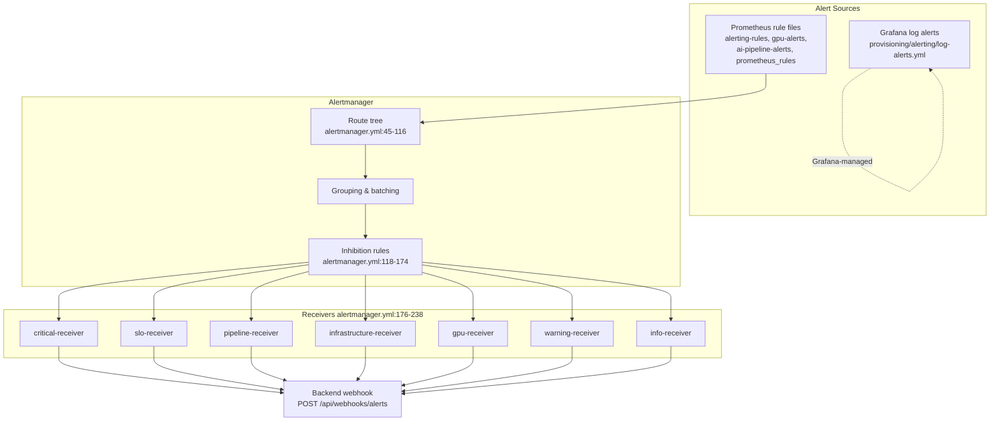

# Alertmanager

> Alert routing, notification channels, and inhibition rules for the home security intelligence system.

**Key Files:**

- `monitoring/alertmanager.yml` (238 lines) - Alertmanager configuration
- `monitoring/alerting-rules.yml` (1241 lines) - Core alert rule definitions
- `monitoring/gpu-alerts.yml`, `monitoring/ai-pipeline-alerts.yml`, `monitoring/prometheus_rules.yml` - Additional rule groups (all loaded via `rule_files` in `monitoring/prometheus.yml:26-33`)
- `monitoring/prometheus-rules.yml` (175 lines) - Recording rules for SLIs, error budgets, burn rates
- `monitoring/grafana/provisioning/alerting/log-alerts.yml` - Grafana log-based alerts

## Overview

Prometheus evaluates the rule files above and sends firing alerts to Alertmanager, which groups
them, applies inhibition rules, and forwards them to receivers. Alertmanager itself runs as the
`alertmanager` compose service and mounts `monitoring/alertmanager.yml`
(`docker-compose.prod.yml:1055`).

In the shipped configuration **every receiver delivers through the same webhook**:
`http://backend:8000/api/webhooks/alerts`. The receivers exist so that routing, batching, and
repeat intervals can differ per class of alert; Slack, email, and PagerDuty are present only as
commented examples to enable (`monitoring/alertmanager.yml:184-199`). Severity and component labels
decide which receiver handles an alert.

> **Note:** `monitoring/alertmanager.yml` is not envsubst-templated. Webhook URLs use container
> service names on the compose network (fixed internal ports), independent of `.env` port
> variables (`monitoring/alertmanager.yml:4-9`).

## Architecture


```mermaid
graph TD
    subgraph "Alert Sources"
        PROM[Prometheus rule files<br/>alerting-rules, gpu-alerts,<br/>ai-pipeline-alerts, prometheus_rules]
        GRAF[Grafana log alerts<br/>provisioning/alerting/log-alerts.yml]
    end

    subgraph "Alertmanager"
        ROUTE[Route tree<br/>alertmanager.yml:45-116]
        GROUP[Grouping &amp; batching]
        INHIB[Inhibition rules<br/>alertmanager.yml:118-174]
    end

    subgraph "Receivers alertmanager.yml:176-238"
        CRIT[critical-receiver]
        SLO[slo-receiver]
        PIPE[pipeline-receiver]
        INFRA[infrastructure-receiver]
        GPU[gpu-receiver]
        WARN[warning-receiver]
        INFO[info-receiver]
    end

    BE[Backend webhook<br/>POST /api/webhooks/alerts]

    PROM --> ROUTE
    GRAF -.Grafana-managed.-> GRAF
    ROUTE --> GROUP --> INHIB
    INHIB --> CRIT --> BE
    INHIB --> SLO --> BE
    INHIB --> PIPE --> BE
    INHIB --> INFRA --> BE
    INHIB --> GPU --> BE
    INHIB --> WARN --> BE
    INHIB --> INFO --> BE
```

## Alert Configuration

### Global Settings

`monitoring/alertmanager.yml:10-38` sets `resolve_timeout: 5m`. SMTP and Slack settings are shipped
commented out — uncomment `smtp_*` plus an `email_configs` block, or set `slack_api_url` plus a
`slack_configs` block on a receiver, to enable those channels. Notification templates load from
`/etc/alertmanager/templates/*.tmpl` (`monitoring/alertmanager.yml:41-42`).

### Route Configuration

The route tree (`monitoring/alertmanager.yml:45-116`) groups by `['alertname', 'component',
'severity']` and defaults to `default-receiver` with `group_wait: 30s`, `group_interval: 5m`,
`repeat_interval: 4h`. Child routes, evaluated in order:

| Match                 | Receiver                  | Timing overrides                                                                 |
| --------------------- | ------------------------- | -------------------------------------------------------------------------------- |
| `severity: critical`  | `critical-receiver`       | `group_wait: 10s`, `group_interval: 1m`, `repeat_interval: 1h`, `continue: true` |
| `component: slo`      | `slo-receiver`            | `group_by: ['alertname', 'slo']`, `repeat_interval: 2h`                          |
| `component: pipeline` | `pipeline-receiver`       | `group_wait: 15s`                                                                |
| `component: database` | `infrastructure-receiver` | -                                                                                |
| `component: redis`    | `infrastructure-receiver` | -                                                                                |
| `component: gpu`      | `gpu-receiver`            | -                                                                                |
| `severity: warning`   | `warning-receiver`        | `group_wait: 2m`, `group_interval: 10m`, `repeat_interval: 6h`                   |
| `severity: info`      | `info-receiver`           | `group_wait: 5m`, `group_interval: 30m`, `repeat_interval: 24h`                  |

The critical route sets `continue: true`, so a critical alert is also evaluated against the
component routes below it.

### Receivers

All eight receivers (`monitoring/alertmanager.yml:176-238`) post to
`http://backend:8000/api/webhooks/alerts`. Only `info-receiver` sets `send_resolved: false`.
`critical-receiver` carries commented `slack_configs` and `email_configs` examples for production
use; there is no PagerDuty receiver.

### Inhibition Rules

`monitoring/alertmanager.yml:118-174` defines eight suppressions, all keyed on the `HSI*` alert
names that actually exist in the rule files:

| Source                  | Suppresses                                                                             |
| ----------------------- | -------------------------------------------------------------------------------------- |
| `HSIPipelineDown`       | `HSI.*`                                                                                |
| `HSIDatabaseUnhealthy`  | `HSIDetectionQueueHigh`, `HSIAnalysisQueueHigh`, `HSISlowDetection`, `HSISlowAnalysis` |
| `HSIRedisUnhealthy`     | `HSIDetectionQueueHigh`, `HSIAnalysisQueueHigh`                                        |
| `HSIGPUMemoryHigh`      | `HSIGPUMemoryElevated` (`equal: ['component']`)                                        |
| `HSICriticalErrorRate`  | `HSIHighErrorRate`                                                                     |
| `HSIExtremeLatency`     | `HSISlowDetection`, `HSISlowAnalysis`                                                  |
| `HSIQueueCritical`      | `HSIDetectionQueueHigh`, `HSIAnalysisQueueHigh`                                        |
| `HSI.*FastBurn` (regex) | `HSI.*SlowBurn` (`equal: ['slo']`)                                                     |

`HSISlowDetection`, `HSISlowAnalysis`, and `HSIExtremeLatency` are referenced by inhibition rules
but their alert groups are commented out in `monitoring/alerting-rules.yml:274-291` because the
recording rules they depend on need `hsi_stage_duration_seconds_bucket`, which the backend does not
yet emit. Those three inhibitions are therefore inert until the latency groups are re-enabled.

## Alert Rule Definitions

### Core Service Health

`monitoring/alerting-rules.yml:6-115`. These are availability alerts driven by blackbox probes and
the json-exporter health gauges, not by `up{job=...}`:

| Alert                          | Expression                                                                              | Severity | For | Component  |
| ------------------------------ | --------------------------------------------------------------------------------------- | -------- | --- | ---------- |
| `HSIPipelineDown`              | `probe_success{job="blackbox-http-live", service="backend"} == 0`                       | critical | 1m  | `pipeline` |
| `HSIPipelineUnhealthy`         | `hsi_system_healthy == 0`                                                               | critical | 2m  | `pipeline` |
| `HSIDatabaseUnhealthy`         | `hsi_database_healthy == 0`                                                             | critical | 2m  | `database` |
| `HSIDatabaseSlowQueries`       | `histogram_quantile(0.95, rate(hsi_db_query_duration_seconds_bucket[5m])) > 1`          | warning  | 5m  | `database` |
| `HSIRedisUnhealthy`            | `hsi_redis_healthy == 0`                                                                | critical | 2m  | `redis`    |
| `HSIRedisMemoryHigh`           | `redis_memory_max_bytes > 0 and redis_memory_used_bytes / redis_memory_max_bytes > 0.8` | warning  | 5m  | `redis`    |
| `HSIRedisSlowCommands`         | `increase(redis_slowlog_length[5m]) > 0`                                                | warning  | 2m  | `redis`    |
| `HSIRedisSlowCommandsCritical` | `increase(redis_slowlog_length[5m]) > 10`                                               | critical | 2m  | `redis`    |

### GPU Alerts

Two files contribute GPU alerts. From `monitoring/alerting-rules.yml:116-236` (backend- and
DCGM-derived metrics):

| Alert                  | Expression                                              | Severity | For |
| ---------------------- | ------------------------------------------------------- | -------- | --- |
| `HSIGPUMemoryElevated` | `hsi:gpu:memory_utilization > 0.75`                     | warning  | 10m |
| `HSIGPUMemoryHigh`     | `hsi:gpu:memory_utilization > 0.9`                      | critical | 5m  |
| `HSIGPUUtilizationLow` | `hsi:gpu:utilization < 10 and hsi_total_detections > 0` | warning  | 15m |
| `AIGPUThrottling`      | `hsi_gpu_temperature > 83`                              | critical | 1m  |

From `monitoring/gpu-alerts.yml` (raw DCGM exporter metrics): `GPUMemoryNearFull`, `GPUMemoryHigh`,
`GPUHighTemperature` (`DCGM_FI_DEV_GPU_TEMP > 85`), `GPUTemperatureElevated` (`> 75`),
`GPUUtilizationSaturated`, `GPUUnderutilizedMemoryBound`, `GPUMemoryBandwidthSaturated`,
`GPUHighPowerUsage`, `GPUClockSpeedDegraded`, `DCGMExporterDown`, `NoGPUMetrics`.

### Queue and Error-Rate Alerts

Queues (`monitoring/alerting-rules.yml:238-272`):

| Alert                   | Expression                                                          | Severity | For |
| ----------------------- | ------------------------------------------------------------------- | -------- | --- |
| `HSIDetectionQueueHigh` | `hsi_detection_queue_depth > 100`                                   | warning  | 5m  |
| `HSIAnalysisQueueHigh`  | `hsi_analysis_queue_depth > 50`                                     | warning  | 5m  |
| `HSIQueueCritical`      | `hsi_detection_queue_depth > 500 or hsi_analysis_queue_depth > 200` | critical | 2m  |

Error rates (`monitoring/alerting-rules.yml:292-317`), driven by an API success-rate recording rule
rather than a pipeline error counter:

| Alert                  | Expression                                    | Severity | For |
| ---------------------- | --------------------------------------------- | -------- | --- |
| `HSIHighErrorRate`     | `1 - hsi:api_requests:success_rate_5m > 0.05` | warning  | 5m  |
| `HSICriticalErrorRate` | `1 - hsi:api_requests:success_rate_5m > 0.1`  | critical | 2m  |

### SLO Burn Rate Alerts

Multi-window burn rate on API availability (`monitoring/alerting-rules.yml:329-363`):

| Alert                        | Expression                                                                           | Severity | For |
| ---------------------------- | ------------------------------------------------------------------------------------ | -------- | --- |
| `HSIAPIAvailabilityFastBurn` | `hsi:burn_rate:api_availability_1h > 14.4 and hsi:burn_rate:api_availability_6h > 6` | critical | 2m  |
| `HSIAPIAvailabilitySlowBurn` | `hsi:burn_rate:api_availability_1d > 3`                                              | warning  | 1h  |

Latency burn-rate alerts are commented out pending the same missing histogram metrics
(`monitoring/alerting-rules.yml:364-372`).

### AI Pipeline and Worker Alerts

`monitoring/ai-pipeline-alerts.yml` covers the enrichment pipeline, LLM behaviour, and scoring:
`GPUOOMCritical`, `GPUMemoryHigh`, `GPUMemoryCritical`, `EnrichmentPipelineTimeout`,
`EnrichmentPipelineTimeoutCritical`, `EnrichmentModelErrorRate`, `EnrichmentModelErrorCritical`,
`EnrichmentQualityDegraded`, `PromptTruncationHigh`, `PromptContextUtilizationHigh`,
`LLMInferenceLatencyHigh`, `LLMInferenceLatencyCritical`, `CoalescingMergeRateLow`,
`CoalescingMergeRateHigh`, `RiskScoreCalibrationDrift`, `RiskScoreAllCritical`, `RiskScoreAllLow`,
`CLIPServiceDown`, `FlorenceServiceDown`, `CLIPAnomalyErrorsHigh`.

`monitoring/alerting-rules.yml` also defines Prometheus self-monitoring alerts (`Prometheus*`,
lines 415-690), worker alerts (`HSIWorkerFailed`, `HSIWorkerNotRunning`,
`HSIWorkerConsecutiveFailures`, lines 695-748), plus circuit-breaker, profiling, websocket, cache,
batch, and system groups.

## Recording Rules for Alerts

Pre-computed SLI metrics and burn rates (`monitoring/prometheus-rules.yml:119-175`):

```yaml
# Error budget remaining, API availability target 99.5%
- record: hsi:error_budget:api_availability_remaining
  expr: 1 - ((1 - hsi:api_availability:ratio_rate30d) / (1 - 0.995))

# Burn rates against the same target
- record: hsi:burn_rate:api_availability_1h
  expr: (1 - hsi:api_availability:ratio_rate1h) / (1 - 0.995)
- record: hsi:burn_rate:api_availability_6h
  expr: (1 - hsi:api_availability:ratio_rate6h) / (1 - 0.995)
- record: hsi:burn_rate:api_availability_1d
  expr: (1 - hsi:api_availability:ratio_rate1d) / (1 - 0.995)
```

Detection- and analysis-latency burn rates are defined in the same group
(`monitoring/prometheus-rules.yml:133-137, 158-164`) against a 95% within-SLO target.

## Grafana Log-Based Alerts

Grafana evaluates LogQL rules against Loki independently of Prometheus
(`monitoring/grafana/provisioning/alerting/log-alerts.yml`):

| Rule uid          | Title                   | Condition                                                | Severity |
| ----------------- | ----------------------- | -------------------------------------------------------- | -------- |
| `high-error-rate` | High Error Rate         | `sum(count_over_time({level="ERROR"}[5m])) > 10`, for 2m | warning  |
| `error-spike`     | Error Spike             | `sum(count_over_time({level="ERROR"}[1m])) > 20`, for 1m | critical |
| `service-silent`  | Service Silent          | `absent_over_time({container="backend"}[5m])`, for 5m    | warning  |
| `critical-error`  | Critical Error Detected | `count_over_time({level="CRITICAL"}[1m]) > 0`            | critical |

These live in Grafana's alerting engine (folder "HSI Alerts", evaluated every minute), so they do
not pass through Prometheus; notification policy is Grafana's own.

## Alert Labels

Standard labels for routing and filtering, as used across the rule files:

| Label       | Values                                                                                                                                                                                                                                                     | Purpose                       |
| ----------- | ---------------------------------------------------------------------------------------------------------------------------------------------------------------------------------------------------------------------------------------------------------- | ----------------------------- |
| `severity`  | `critical`, `warning`, `info`                                                                                                                                                                                                                              | Route selection, escalation   |
| `component` | `pipeline`, `queue`, `database`, `redis`, `cache`, `gpu`, `api`, `ai`, `llm`, `enrichment`, `scoring`, `batch`, `worker`, `circuit_breaker`, `websocket`, `monitoring`, `profiling`, `system`, `slo`, `backend`, `detection`, `analysis`, `infrastructure` | Route selection, inhibition   |
| `slo`       | `api_availability`, …                                                                                                                                                                                                                                      | SLO grouping                  |
| `alertname` | Alert identity                                                                                                                                                                                                                                             | Grouping, inhibition matching |

## Alert Annotations

Standard annotations for context:

| Annotation    | Purpose                           |
| ------------- | --------------------------------- |
| `summary`     | Brief alert title                 |
| `description` | Detailed explanation              |
| `runbook_url` | Link to the remediation wiki page |

## Testing Alerts

Verify alert rules:

```bash
# Rule syntax (promtool ships with the prom image)
podman exec prometheus promtool check rules /etc/prometheus/alerting-rules.yml

# Query Prometheus for active alerts
curl -s http://localhost:9090/api/v1/alerts | jq '.data.alerts'

# Check Alertmanager status
curl -s http://localhost:9093/api/v2/status | jq
```

## Silences

Create temporary silences for maintenance:

```bash
curl -X POST http://localhost:9093/api/v2/silences \
  -H "Content-Type: application/json" \
  -d '{
    "matchers": [
      {"name": "alertname", "value": "HSIGPUMemoryElevated", "isRegex": false}
    ],
    "startsAt": "2026-09-22T10:00:00Z",
    "endsAt": "2026-09-22T12:00:00Z",
    "createdBy": "admin",
    "comment": "GPU maintenance window"
  }'
```

## Related Documents

- [Prometheus Metrics](./prometheus-metrics.md) - Metric definitions used in alerts
- [Grafana Dashboards](./grafana-dashboards.md) - Alert visualization
- [Structured Logging](./structured-logging.md) - Log-based alerting
