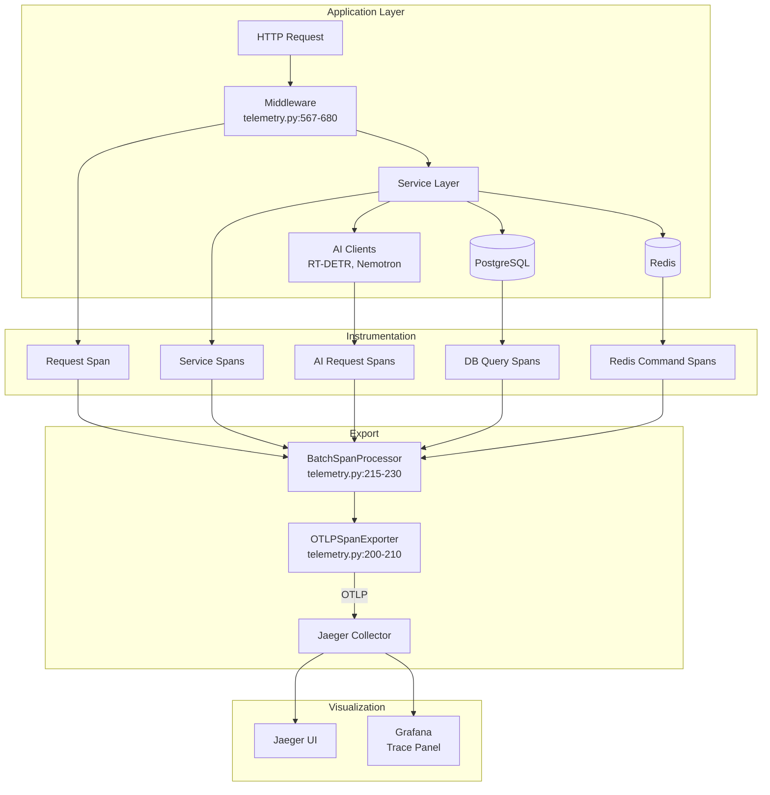

# Distributed Tracing

> OpenTelemetry-based distributed tracing with automatic instrumentation, span context propagation, and Jaeger visualization.

**Key Files:**

- `backend/core/telemetry.py:1-1007` - OpenTelemetry configuration
- `monitoring/grafana/provisioning/datasources/prometheus.yml:41-101` - Jaeger datasource
- `monitoring/grafana/dashboards/tracing.json:1-332` - Tracing dashboard

## Overview

The system uses OpenTelemetry for distributed tracing, enabling end-to-end visibility into requests as they flow through the AI pipeline. Traces capture the full lifecycle from image detection through LLM analysis to event creation, with automatic instrumentation for HTTP requests, database queries, and Redis operations.

Traces are exported to Jaeger via OTLP protocol. Jaeger provides storage, search, and visualization of traces. Grafana integrates with Jaeger for trace exploration and correlates traces with metrics and logs through derived fields and trace-to-metrics queries.

The tracing implementation supports both synchronous and asynchronous code paths, with context propagation ensuring spans maintain parent-child relationships across async boundaries.

## Architecture



## Setup and Configuration

### Initialization

OpenTelemetry is initialized during application startup (`backend/core/telemetry.py:135-268`):

```python
# From backend/core/telemetry.py:135-180
def setup_telemetry(
    service_name: str = "nemotron-backend",
    *,
    enable_auto_instrumentation: bool = True,
    otel_endpoint: str | None = None,
    sample_rate: float = 1.0,
) -> None:
    """Initialize OpenTelemetry with tracing and optional metrics."""
    if not settings.otel_enabled:
        logger.info("OpenTelemetry disabled by configuration")
        return

    # Create resource with service info
    resource = Resource.create({
        ResourceAttributes.SERVICE_NAME: service_name,
        ResourceAttributes.SERVICE_VERSION: get_app_version(),
        ResourceAttributes.DEPLOYMENT_ENVIRONMENT: settings.environment,
    })

    # Configure trace provider
    provider = TracerProvider(resource=resource)
    trace.set_tracer_provider(provider)

    # Configure exporter
    endpoint = otel_endpoint or settings.otel_exporter_otlp_endpoint
    exporter = OTLPSpanExporter(endpoint=endpoint)

    # Configure batch processor
    processor = BatchSpanProcessor(
        exporter,
        max_queue_size=2048,
        max_export_batch_size=512,
        schedule_delay_millis=5000,
    )
    provider.add_span_processor(processor)
```

### Configuration Options

| Setting                       | Type    | Default                   | Description                 |
| ----------------------------- | ------- | ------------------------- | --------------------------- |
| `OTEL_ENABLED`                | `bool`  | `False`                   | Master toggle for tracing   |
| `OTEL_SERVICE_NAME`           | `str`   | `"nemotron-backend"`      | Service name in traces      |
| `OTEL_EXPORTER_OTLP_ENDPOINT` | `str`   | `"http://localhost:4317"` | Jaeger collector endpoint   |
| `OTEL_TRACE_SAMPLE_RATE`      | `float` | `1.0`                     | Sampling rate (0.0-1.0)     |
| `OTEL_AUTO_INSTRUMENTATION`   | `bool`  | `True`                    | Enable auto-instrumentation |
| `OTEL_PROPAGATORS`            | `str`   | `"tracecontext,baggage"`  | Context propagators         |

### Auto-Instrumentation

The system auto-instruments common libraries (`backend/core/telemetry.py:270-340`):

| Library      | Instrumentation             | What's Traced          |
| ------------ | --------------------------- | ---------------------- |
| `httpx`      | `HTTPXClientInstrumentor`   | Outbound HTTP requests |
| `aiohttp`    | `AioHttpClientInstrumentor` | Async HTTP clients     |
| `sqlalchemy` | `SQLAlchemyInstrumentor`    | Database queries       |
| `redis`      | `RedisInstrumentor`         | Redis commands         |
| `fastapi`    | `FastAPIInstrumentor`       | Inbound HTTP requests  |
| `logging`    | Custom integration          | Log-trace correlation  |

## Span Operations

### Creating Manual Spans

For operations not auto-instrumented, create manual spans (`backend/core/telemetry.py:380-450`):

```python
# From backend/core/telemetry.py:380-420
@contextmanager
def create_span(
    name: str,
    *,
    kind: SpanKind = SpanKind.INTERNAL,
    attributes: dict[str, Any] | None = None,
    record_exception: bool = True,
) -> Generator[Span, None, None]:
    """Create a traced span for custom operations."""
    tracer = trace.get_tracer(__name__)
    with tracer.start_as_current_span(
        name,
        kind=kind,
        attributes=attributes or {},
    ) as span:
        try:
            yield span
        except Exception as e:
            if record_exception:
                span.record_exception(e)
                span.set_status(Status(StatusCode.ERROR, str(e)))
            raise
```

Usage:

```python
from backend.core.telemetry import create_span
from opentelemetry.trace import SpanKind

async def analyze_image(image_path: str) -> dict:
    with create_span(
        "analyze_image",
        kind=SpanKind.CLIENT,
        attributes={"image.path": image_path},
    ) as span:
        result = await run_analysis(image_path)
        span.set_attribute("detection.count", len(result.detections))
        return result
```

### Async Span Context

For async operations, use `create_async_span` (`backend/core/telemetry.py:453-500`):

```python
# From backend/core/telemetry.py:453-490
@asynccontextmanager
async def create_async_span(
    name: str,
    *,
    kind: SpanKind = SpanKind.INTERNAL,
    attributes: dict[str, Any] | None = None,
) -> AsyncGenerator[Span, None]:
    """Create a traced span for async operations."""
    tracer = trace.get_tracer(__name__)
    with tracer.start_as_current_span(name, kind=kind, attributes=attributes or {}) as span:
        try:
            yield span
        except Exception as e:
            span.record_exception(e)
            span.set_status(Status(StatusCode.ERROR, str(e)))
            raise
```

## Span Names and Attributes

### Pipeline Spans

| Span Name              | Kind       | Key Attributes                                               |
| ---------------------- | ---------- | ------------------------------------------------------------ |
| `detection_processing` | `INTERNAL` | `camera_id`, `image_path`, `detection_count`                 |
| `batch_aggregation`    | `INTERNAL` | `batch_id`, `batch_size`, `timeout_triggered`                |
| `analysis_processing`  | `INTERNAL` | `batch_id`, `model`, `input_tokens`, `output_tokens`         |
| `llm_inference`        | `CLIENT`   | `model`, `prompt_length`, `completion_length`, `duration_ms` |
| `event_creation`       | `INTERNAL` | `event_id`, `risk_score`, `camera_id`                        |

### HTTP Request Spans

Auto-instrumented by FastAPI instrumentor:

| Attribute          | Description                      |
| ------------------ | -------------------------------- |
| `http.method`      | Request method (GET, POST, etc.) |
| `http.url`         | Full request URL                 |
| `http.status_code` | Response status code             |
| `http.route`       | FastAPI route template           |
| `http.host`        | Request host header              |
| `http.user_agent`  | Client user agent                |

### Database Spans

Auto-instrumented by SQLAlchemy instrumentor:

| Attribute      | Description                       |
| -------------- | --------------------------------- |
| `db.system`    | `postgresql`                      |
| `db.name`      | Database name                     |
| `db.statement` | SQL query (truncated)             |
| `db.operation` | Query type (SELECT, INSERT, etc.) |

### Redis Spans

Auto-instrumented by Redis instrumentor:

| Attribute                 | Description                    |
| ------------------------- | ------------------------------ |
| `db.system`               | `redis`                        |
| `db.operation`            | Redis command (GET, SET, etc.) |
| `db.redis.database_index` | Redis database index           |
| `net.peer.name`           | Redis host                     |
| `net.peer.port`           | Redis port                     |

## Context Propagation

### W3C Trace Context

The system uses W3C Trace Context headers for propagation (`backend/core/telemetry.py:550-565`):

```
traceparent: 00-0af7651916cd43dd8448eb211c80319c-b7ad6b7169203331-01
tracestate: vendor1=value1,vendor2=value2
```

Format: `version-trace_id-span_id-flags`

### Propagation Across Services

Context is automatically propagated to AI services via HTTP headers:

```python
# Context is automatically injected by httpx instrumentation
async def call_rtdetr(image_data: bytes) -> dict:
    async with httpx.AsyncClient() as client:
        # traceparent header is automatically added
        response = await client.post(
            f"{rtdetr_url}/detect",
            files={"image": image_data},
        )
        return response.json()
```

### Manual Propagation

For non-HTTP transports (e.g., Redis queues), manually inject/extract context (`backend/core/telemetry.py:505-545`):

```python
# From backend/core/telemetry.py:505-530
def inject_context_to_dict(carrier: dict[str, str]) -> None:
    """Inject current trace context into a dictionary."""
    propagator = get_global_textmap()
    propagator.inject(carrier)

def extract_context_from_dict(carrier: dict[str, str]) -> Context:
    """Extract trace context from a dictionary."""
    propagator = get_global_textmap()
    return propagator.extract(carrier)
```

Usage for queue messages:

```python
# Producer
message = {"data": payload}
inject_context_to_dict(message)  # Adds traceparent, tracestate
await queue.push(message)

# Consumer
message = await queue.pop()
ctx = extract_context_from_dict(message)
with trace.use_span(trace.get_current_span(), end_on_exit=False):
    context.attach(ctx)
    # Process message with trace context restored
```

## Trace-to-Metrics Correlation

Grafana's Jaeger datasource is configured with trace-to-metrics queries (`monitoring/grafana/provisioning/datasources/prometheus.yml:52-101`):

```yaml
tracesToMetrics:
  datasourceUid: PBFA97CFB590B2093
  spanStartTimeShift: '-5m'
  spanEndTimeShift: '5m'
  tags:
    - key: 'service.name'
      value: 'service'
    - key: 'http.method'
      value: 'method'
    - key: 'http.status_code'
      value: 'status_code'
  queries:
    - name: 'Pipeline Errors/min'
      query: 'rate(hsi_pipeline_errors_total[1m]) * 60'
    - name: 'Detection Queue Depth'
      query: 'hsi_detection_queue_depth'
    - name: 'RT-DETR Latency (p95)'
      query: 'histogram_quantile(0.95, rate(rtdetr_inference_latency_seconds_bucket[5m]))'
```

This enables clicking from a trace span to related Prometheus metrics.

## Trace-to-Logs Correlation

Logs are correlated via trace ID. The Loki datasource extracts trace IDs from logs (`monitoring/grafana/provisioning/datasources/prometheus.yml:198-214`):

```yaml
derivedFields:
  - name: TraceID
    matcherRegex: 'trace_id=([a-f0-9]{32})'
    url: '${__value.raw}'
    datasourceUid: PC9A941E8F2E49454
    urlDisplayLabel: 'View Trace'
```

Log format includes trace context:

```
2024-01-15 10:30:45 | INFO | backend.services | trace_id=0af7651916cd43dd8448eb211c80319c span_id=b7ad6b7169203331 | Processing detection
```

## Grafana Tracing Dashboard

The tracing dashboard (`monitoring/grafana/dashboards/tracing.json`) provides:

### Pipeline Analysis Traces Panel

Shows full pipeline traces (`monitoring/grafana/dashboards/tracing.json:65-77`):

```json
{
  "targets": [
    {
      "queryType": "search",
      "service": "nemotron-backend",
      "operation": "analysis_processing",
      "limit": 15
    }
  ]
}
```

### Detection Processing Panel

Shows RT-DETR detection traces with latency thresholds (`monitoring/grafana/dashboards/tracing.json:131-143`):

- Green: < 5s (5,000,000 microseconds)
- Yellow: 5-30s
- Red: > 30s

### LLM Inference Panel

Shows Nemotron LLM traces with latency thresholds (`monitoring/grafana/dashboards/tracing.json:194-198`):

- Green: < 30s
- Yellow: 30-120s
- Red: > 120s

### Error Traces Panel

Shows traces with errors (`monitoring/grafana/dashboards/tracing.json:241-250`):

```json
{
  "targets": [
    {
      "queryType": "search",
      "service": "nemotron-backend",
      "tags": "error=true",
      "limit": 20
    }
  ]
}
```

## Sampling Configuration

For high-traffic deployments, configure sampling (`backend/core/telemetry.py:185-200`):

```python
# From backend/core/telemetry.py:185-200
if sample_rate < 1.0:
    sampler = TraceIdRatioBased(sample_rate)
else:
    sampler = AlwaysOnSampler()

provider = TracerProvider(
    resource=resource,
    sampler=sampler,
)
```

Sampling strategies:

| Rate   | Use Case                     |
| ------ | ---------------------------- |
| `1.0`  | Development, low traffic     |
| `0.1`  | Production, 10% sampling     |
| `0.01` | High-traffic, cost reduction |

## Troubleshooting

### No Traces Appearing

1. Check `OTEL_ENABLED=True` in configuration
2. Verify Jaeger collector is reachable at `OTEL_EXPORTER_OTLP_ENDPOINT`
3. Check for export errors in logs: `grep "OTLP" /var/log/hsi/backend.log`

### Missing Span Relationships

1. Verify context propagation headers are forwarded
2. Check async context managers are used correctly
3. Ensure `context.attach()` is called for manual propagation

### High Trace Cardinality

1. Avoid dynamic span names
2. Use bounded attribute values
3. Enable sampling for high-traffic services

## Testing

Run tracing tests:

```bash
uv run pytest backend/tests/unit/core/test_telemetry.py -v
```

| Test                       | Purpose                     |
| -------------------------- | --------------------------- |
| `test_setup_telemetry`     | Initialization              |
| `test_create_span`         | Manual span creation        |
| `test_context_propagation` | Header injection/extraction |
| `test_span_attributes`     | Attribute recording         |
| `test_error_recording`     | Exception capture           |

## Related Documents

- [Structured Logging](./structured-logging.md) - Log-trace correlation
- [Prometheus Metrics](./prometheus-metrics.md) - Metrics-trace correlation
- [Grafana Dashboards](./grafana-dashboards.md) - Trace visualization
