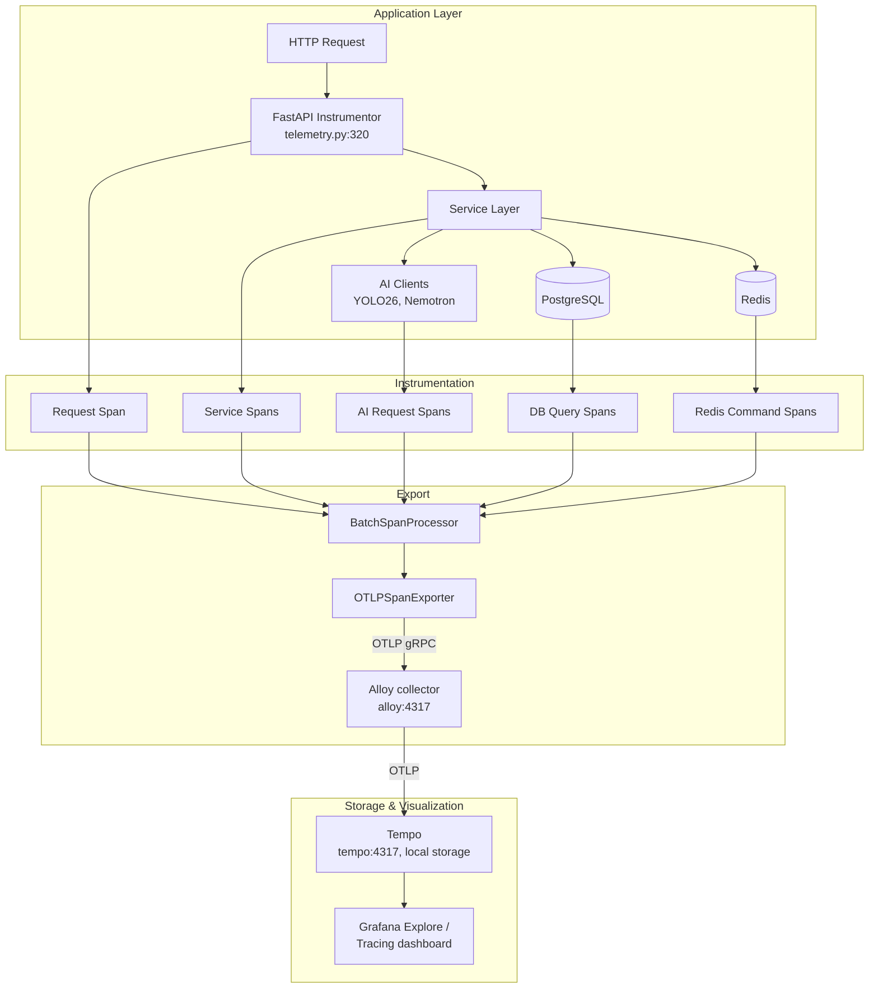

# Distributed Tracing

> OpenTelemetry-based distributed tracing with automatic instrumentation, span context propagation, and Grafana Tempo visualization.

**Key Files:**

- `backend/core/telemetry.py` - OpenTelemetry configuration
- `monitoring/alloy/config.alloy` - OTLP collector: receives traces, forwards to Tempo
- `monitoring/tempo/tempo-config.yml` - Tempo receiver and local storage config
- `monitoring/grafana/provisioning/datasources/prometheus.yml:47-101` - Tempo datasource (with trace-to-metrics queries)
- `monitoring/grafana/dashboards/tracing.json` - Tracing dashboard

## Overview

The system uses OpenTelemetry for distributed tracing, enabling end-to-end visibility into requests as they flow through the AI pipeline. Traces capture the full lifecycle from image detection through LLM analysis to event creation, with automatic instrumentation for HTTP requests, database queries, and Redis operations.

Trace export path: backend → **Alloy** (OTLP collector, default endpoint `http://alloy:4317`) →
**Tempo** (`otelcol.exporter.otlp "tempo"` in `monitoring/alloy/config.alloy`, endpoint `tempo:4317`).
Grafana reads traces from the Tempo datasource for exploration and correlates traces with metrics and
logs through derived fields and trace-to-metrics queries. Tempo replaced the former Jaeger +
Elasticsearch stack (NEM-5545); no Jaeger service runs in `docker-compose.prod.yml`.

The tracing implementation supports both synchronous and asynchronous code paths, with context propagation ensuring spans maintain parent-child relationships across async boundaries.

## Architecture


```mermaid
graph TD
    subgraph "Application Layer"
        REQ[HTTP Request] --> MW[FastAPI Instrumentor<br/>telemetry.py:320]
        MW --> SVC[Service Layer]
        SVC --> AI[AI Clients<br/>YOLO26, Nemotron]
        SVC --> DB[(PostgreSQL)]
        SVC --> REDIS[(Redis)]
    end

    subgraph "Instrumentation"
        MW --> SPAN1[Request Span]
        SVC --> SPAN2[Service Spans]
        AI --> SPAN3[AI Request Spans]
        DB --> SPAN4[DB Query Spans]
        REDIS --> SPAN5[Redis Command Spans]
    end

    subgraph "Export"
        SPAN1 --> PROC[BatchSpanProcessor]
        SPAN2 --> PROC
        SPAN3 --> PROC
        SPAN4 --> PROC
        SPAN5 --> PROC
        PROC --> EXP[OTLPSpanExporter]
        EXP --> |OTLP gRPC| ALLOY[Alloy collector<br/>alloy:4317]
    end

    subgraph "Storage & Visualization"
        ALLOY --> |OTLP| TEMPO[Tempo<br/>tempo:4317, local storage]
        TEMPO --> GRAF[Grafana Explore /<br/>Tracing dashboard]
    end
```

## Setup and Configuration

### Initialization

`setup_telemetry(app, settings)` is called during application startup
(`backend/main.py:703`; defined at `backend/core/telemetry.py:145-410`). It returns `True` when
tracing is initialized, `False` when disabled or already active. In abbreviated form
(`backend/core/telemetry.py:145-335`):

```python
# From backend/core/telemetry.py:145-335 (abbreviated)
def setup_telemetry(app: FastAPI, settings: Settings) -> bool:
    """Initialize OpenTelemetry tracing for the application."""
    if not settings.otel_enabled:
        logger.info("OpenTelemetry tracing disabled (OTEL_ENABLED=False)")
        return False

    # Resource with service info, merged with automatic container/host/process detection
    service_resource = Resource.create({
        SERVICE_NAME: settings.otel_service_name,
        "service.version": settings.app_version,
        "deployment.environment": "production" if not settings.debug else "development",
    })

    # Priority-based sampler (NEM-3793) with ParentBased fallback (NEM-3380)
    sampler = create_otel_sampler(settings)  # backend/core/sampling.py

    provider = TracerProvider(resource=resource, sampler=sampler)
    trace.set_tracer_provider(provider)

    # OTLP exporter → Alloy collector
    exporter = OTLPSpanExporter(
        endpoint=settings.otel_exporter_otlp_endpoint,
        insecure=settings.otel_exporter_otlp_insecure,
    )

    # Batch processor tuned for high throughput (NEM-3433), all values from settings
    batch_processor = BatchSpanProcessor(
        exporter,
        max_queue_size=settings.otel_batch_max_queue_size,
        max_export_batch_size=settings.otel_batch_max_export_batch_size,
        schedule_delay_millis=settings.otel_batch_schedule_delay_ms,
        export_timeout_millis=settings.otel_batch_export_timeout_ms,
    )
    provider.add_span_processor(batch_processor)

    # Composite propagator: W3C Trace Context + W3C Baggage (NEM-3382, :313-316)
    # Auto-instrumentation: FastAPI, HTTPX, SQLAlchemy, Redis (:320-333)
```

### Configuration Options

Defaults are from `backend/core/config.py:1815-1874` (the effective production values are set by
`docker-compose.prod.yml:489-492`, which mirrors these defaults; the development template
`.env.example:1047-1120` disables tracing and points the endpoint at `http://localhost:4317`).

| Setting                            | Type    | Default               | Description                          |
| ---------------------------------- | ------- | --------------------- | ------------------------------------ |
| `OTEL_ENABLED`                     | `bool`  | `True`                | Master toggle for tracing            |
| `OTEL_SERVICE_NAME`                | `str`   | `"nemotron-backend"`  | Service name in traces               |
| `OTEL_EXPORTER_OTLP_ENDPOINT`      | `str`   | `"http://alloy:4317"` | OTLP gRPC endpoint (Alloy collector) |
| `OTEL_EXPORTER_OTLP_INSECURE`      | `bool`  | `True`                | Non-TLS connection to the collector  |
| `OTEL_TRACE_SAMPLE_RATE`           | `float` | `1.0`                 | Root sampling rate (0.0-1.0)         |
| `OTEL_BATCH_MAX_QUEUE_SIZE`        | `int`   | `8192`                | Spans queued before dropping         |
| `OTEL_BATCH_MAX_EXPORT_BATCH_SIZE` | `int`   | `1024`                | Spans per export batch               |
| `OTEL_BATCH_SCHEDULE_DELAY_MS`     | `int`   | `2000`                | Delay between exports (ms)           |
| `OTEL_BATCH_EXPORT_TIMEOUT_MS`     | `int`   | `30000`               | Export timeout (ms)                  |

There are no `OTEL_AUTO_INSTRUMENTATION` or `OTEL_PROPAGATORS` settings: instrumentation
(FastAPI, HTTPX, SQLAlchemy, Redis, logging) is always applied when `OTEL_ENABLED` is on, and the
propagators are hardcoded to W3C Trace Context + W3C Baggage (`backend/core/telemetry.py:313-333`).
Root-sampling priorities are tuned through the `OTEL_SAMPLING_*` variables
(`backend/core/sampling.py:15-23`).

## Storage Backend

### Tempo Local Storage

Tempo (NEM-5545) replaced the former Jaeger + Elasticsearch stack; there is no Elasticsearch or
Jaeger service in `docker-compose.prod.yml`. Tempo stores traces on its own local disk
(`monitoring/tempo/tempo-config.yml`):

| Setting                     | Value               | Purpose                          |
| --------------------------- | ------------------- | -------------------------------- |
| `storage.trace.backend`     | `local`             | Storage backend type             |
| `storage.trace.local.path`  | `/var/tempo/traces` | Trace block directory            |
| `storage.trace.wal.path`    | `/var/tempo/wal`    | Write-ahead log                  |
| `compactor.block_retention` | `720h`              | Retention: 30 days, then deleted |
| `server.http_listen_port`   | `3200`              | Query API (Grafana reads this)   |
| OTLP receiver               | `0.0.0.0:4317/4318` | gRPC / HTTP ingest (from Alloy)  |

Data persists in the `tempo_data` compose volume. The compactor applies retention automatically —
no separate lifecycle tooling or init script is required. (`scripts/init-elasticsearch.sh` is a
leftover from the Jaeger era and is not part of any current deployment step.)

### Resource Requirements

| Component         | CPU | Memory | Disk                |
| ----------------- | --- | ------ | ------------------- |
| Tempo             | 1   | 1GB    | `tempo_data` volume |
| Alloy (collector) | 0.5 | 768MB  | -                   |

(Limits from the `deploy.resources.limits` blocks in `docker-compose.prod.yml`.)

### Auto-Instrumentation

The system auto-instruments common libraries (`backend/core/telemetry.py:320-333, 377-381`):

| Library      | Instrumentation           | What's Traced          |
| ------------ | ------------------------- | ---------------------- |
| `fastapi`    | `FastAPIInstrumentor`     | Inbound HTTP requests  |
| `httpx`      | `HTTPXClientInstrumentor` | Outbound HTTP requests |
| `sqlalchemy` | `SQLAlchemyInstrumentor`  | Database queries       |
| `redis`      | `RedisInstrumentor`       | Redis commands         |
| `logging`    | `LoggingInstrumentor`     | Log-trace correlation  |

## Span Operations

### Creating Manual Spans

For operations not auto-instrumented, use the `trace_span` context manager
(`backend/core/telemetry.py:1225-1266`). It takes the span name plus attributes as keyword
arguments and records exceptions automatically:

```python
from backend.core.telemetry import trace_span

async def analyze_image(image_path: str) -> dict:
    with trace_span("analyze_image", image_path=image_path) as span:
        result = await run_analysis(image_path)
        span.set_attribute("detection_count", len(result.detections))
        return result
```

Related helpers in the same module:

- `trace_function(...)` — decorator that wraps a sync or async function in a span
  (`backend/core/telemetry.py:1279`)
- `create_span_with_links(name, links=[...])` — span linked to spans from another async context,
  e.g. batch work linked back to the originating detection spans (`backend/core/telemetry.py:675`)
- `ai_service_span(...)` — client span with AI semantic attributes
  (`backend/core/telemetry.py:1347`)

## Span Names and Attributes

### Pipeline Spans

Pipeline spans are created with `tracer.start_as_current_span(...)` and annotated through the
semantic-convention helpers in `backend/core/telemetry_ai_conventions.py`.

| Span Name              | Where                                        | Key Attributes                                                                                                                                     |
| ---------------------- | -------------------------------------------- | -------------------------------------------------------------------------------------------------------------------------------------------------- |
| `detection_processing` | `backend/services/pipeline_workers.py:498`   | `pipeline.camera_id`, `pipeline.stage`, `camera_id`, `file_path`, `media_type`                                                                     |
| `analysis_processing`  | `backend/services/pipeline_workers.py:1012`  | `batch_id`, `detection_count`, `pipeline_stage`, `camera_id`                                                                                       |
| `llm_inference`        | `backend/services/nemotron_analyzer.py:3946` | `ai.model.name`, `ai.model.version`, `ai.model.provider`, `ai.inference.device`, `ai.inference.batch_size`, `pipeline.*`, `llm_service`, `llm_url` |

`AIModelAttributes.set_on_span(...)` writes the `ai.model.*` / `ai.inference.*` attributes and
`set_pipeline_context_attributes(...)` writes `pipeline.camera_id`, `pipeline.batch_id`,
`pipeline.stage`, and `pipeline.detection_count` (`backend/core/telemetry_ai_conventions.py:64-103, 106-147, 289-320`).

### HTTP Request Spans

Auto-instrumented by FastAPI instrumentor:

| Attribute          | Description                      |
| ------------------ | -------------------------------- |
| `http.method`      | Request method (GET, POST, etc.) |
| `http.url`         | Full request URL                 |
| `http.status_code` | Response status code             |
| `http.route`       | FastAPI route template           |
| `http.host`        | Request host header              |
| `http.user_agent`  | Client user agent                |

### Database Spans

Auto-instrumented by SQLAlchemy instrumentor:

| Attribute      | Description                       |
| -------------- | --------------------------------- |
| `db.system`    | `postgresql`                      |
| `db.name`      | Database name                     |
| `db.statement` | SQL query (truncated)             |
| `db.operation` | Query type (SELECT, INSERT, etc.) |

### Redis Spans

Auto-instrumented by Redis instrumentor:

| Attribute                 | Description                    |
| ------------------------- | ------------------------------ |
| `db.system`               | `redis`                        |
| `db.operation`            | Redis command (GET, SET, etc.) |
| `db.redis.database_index` | Redis database index           |
| `net.peer.name`           | Redis host                     |
| `net.peer.port`           | Redis port                     |

## Context Propagation

### W3C Trace Context

The system uses W3C Trace Context headers for propagation (propagator configured at
`backend/core/telemetry.py:313-316`):

```
traceparent: 00-0af7651916cd43dd8448eb211c80319c-b7ad6b7169203331-01
tracestate: vendor1=value1,vendor2=value2
```

Format: `version-trace_id-span_id-flags`

### W3C Baggage for Cross-Service Context (NEM-3796)

The system uses W3C Baggage to propagate application-specific context across service boundaries (`backend/api/middleware/baggage.py`):

```
baggage: camera.id=front_door,event.priority=high,request.source=api
```

Baggage is automatically propagated alongside trace context via the composite propagator.

#### Baggage Keys

| Key              | Description                              | Valid Values                 |
| ---------------- | ---------------------------------------- | ---------------------------- |
| `camera.id`      | Source camera for detection pipeline     | Camera identifier string     |
| `event.priority` | Priority level for downstream processing | low, normal, high, critical  |
| `request.source` | Origin of request                        | ui, api, scheduled, internal |
| `batch.id`       | Batch identifier for batch processing    | Batch identifier string      |

#### Setting Baggage

```python
from backend.api.middleware.baggage import set_pipeline_baggage

# At the start of the detection pipeline
set_pipeline_baggage(
    camera_id="front_door",
    event_priority="high",
    request_source="api"
)
```

#### Reading Baggage

```python
from backend.api.middleware.baggage import (
    get_camera_id_from_baggage,
    get_event_priority_from_baggage,
    get_request_source_from_baggage,
)

# In downstream services
camera_id = get_camera_id_from_baggage()
if get_event_priority_from_baggage() == "high":
    # Fast-track processing
    pass
```

#### Automatic Baggage Extraction

The `BaggageMiddleware` automatically:

- Extracts `request.source` from `X-Request-Source` header (defaults to "api")
- Extracts `camera.id` from URL path patterns like `/cameras/{camera_id}/...`
- Preserves incoming baggage from upstream services

### Propagation Across Services

Context is automatically propagated to AI services via HTTP headers:

```python
# Context is automatically injected by httpx instrumentation
async def call_yolo26(image_data: bytes) -> dict:
    async with httpx.AsyncClient() as client:
        # traceparent header is automatically added
        response = await client.post(
            f"{yolo26_url}/detect",
            files={"image": image_data},
        )
        return response.json()
```

### Manual Propagation

For non-HTTP transports and incoming requests, use the helpers in `backend/core/telemetry.py`:

- `get_trace_headers() -> dict` — injects the current trace context and baggage into a headers
  dict (`traceparent`, `tracestate`, `baggage`) for outbound calls (`backend/core/telemetry.py:1178`)
- `extract_context_from_headers(headers)` — extracts and attaches the context from incoming
  headers using the composite propagator (`backend/core/telemetry.py:1143`)

```python
# Producer (e.g., pushing to a Redis queue)
from backend.core.telemetry import get_trace_headers
message = {"data": payload, **get_trace_headers()}  # adds traceparent/tracestate/baggage
await queue.push(message)

# Consumer
from backend.core.telemetry import extract_context_from_headers
message = await queue.pop()
extract_context_from_headers({k: v for k, v in message.items() if k in {"traceparent", "tracestate", "baggage"}})
# Trace context is now restored for spans created in this task
```

## Trace-to-Metrics Correlation

Grafana's Tempo datasource is configured with trace-to-metrics queries
(`monitoring/grafana/provisioning/datasources/prometheus.yml:59-104`):

```yaml
tracesToMetrics:
  datasourceUid: prometheus
  spanStartTimeShift: '-5m'
  spanEndTimeShift: '5m'
  tags:
    - key: 'service.name'
      value: 'service'
    - key: 'db.system'
      value: 'db_system'
    - key: 'http.method'
      value: 'method'
    - key: 'http.status_code'
      value: 'status_code'
  queries:
    - name: 'Pipeline Errors/min'
      query: 'rate(hsi_pipeline_errors_total[1m]) * 60'
    - name: 'Detection Queue Depth'
      query: 'hsi_detection_queue_depth'
    - name: 'Analysis Queue Depth'
      query: 'hsi_analysis_queue_depth'
    - name: 'YOLO26 Latency (p95)'
      query: 'histogram_quantile(0.95, rate(yolo26_inference_latency_seconds_bucket[5m]))'
    # ... Nemotron tokens/sec, Florence/CLIP/Enrichment p95, batch latency percentiles
```

This enables clicking from a trace span to related Prometheus metrics.

## Trace-to-Logs Correlation

Logs are correlated via trace ID. The Loki datasource extracts trace IDs from logs and links them
to Tempo (`monitoring/grafana/provisioning/datasources/prometheus.yml:225-231`), and the Tempo
datasource links back to Loki from a trace
(`tracesToLogsV2.datasourceUid: loki`, lines 56-58):

```yaml
derivedFields:
  - name: TraceID
    matcherRegex: 'trace_id=([a-f0-9]{32})'
    url: '${__value.raw}'
    datasourceUid: tempo
    urlDisplayLabel: 'View Trace'
```

Log format includes trace context:

```
2024-01-15 10:30:45 | INFO | backend.services | trace_id=0af7651916cd43dd8448eb211c80319c span_id=b7ad6b7169203331 | Processing detection
```

## Grafana Tracing Dashboard

The tracing dashboard (`monitoring/grafana/dashboards/tracing.json`) queries Tempo with TraceQL.
Its trace-table panels:

### Pipeline Analysis Traces Panel

Full pipeline traces (`monitoring/grafana/dashboards/tracing.json:629-631`):

```json
{
  "datasource": { "type": "tempo", "uid": "tempo" },
  "queryType": "traceql",
  "query": "{ resource.service.name = \"nemotron-backend\" && name = \"analysis_processing\" }",
  "limit": 15
}
```

### Detection Processing Panel

Detection traces (`monitoring/grafana/dashboards/tracing.json:717-719`) — same TraceQL shape with
`name = "detection_processing"`.

### LLM Inference Panel

LLM inference traces (`monitoring/grafana/dashboards/tracing.json:797-799`) —
`name = "llm_inference"`.

### Error Traces Panel

Traces carrying an error status (`monitoring/grafana/dashboards/tracing.json:871-873`):

```json
{
  "queryType": "traceql",
  "query": "{ resource.service.name = \"nemotron-backend\" && status = error }"
}
```

### Other Panels

The dashboard also has Prometheus-based overview panels (trace count / duration / error rate by
service, span distribution, slowest endpoints, AI latency comparison) and a Tempo
`serviceMap` Service Dependency Graph panel (`monitoring/grafana/dashboards/tracing.json:905`).

## Sampling Configuration

Sampling is priority-based (NEM-3793): `create_otel_sampler(settings)` in
`backend/core/sampling.py` returns a sampler that always keeps error traces, high-risk events, and
high-priority endpoints, and rate-limits everything else. Parent-based decisions are preserved: a
sampled (or unsampled) parent forces the same decision on children
(`backend/core/telemetry.py:233-280`). Rates are configured through environment variables
(`backend/core/sampling.py:15-23`, examples in `.env.example:1076-1100`):

| Variable                             | Default | Applies to                                                                |
| ------------------------------------ | ------- | ------------------------------------------------------------------------- |
| `OTEL_SAMPLING_ERROR_RATE`           | `1.0`   | Traces containing errors                                                  |
| `OTEL_SAMPLING_HIGH_RISK_RATE`       | `1.0`   | High-risk (security-relevant) events                                      |
| `OTEL_SAMPLING_HIGH_PRIORITY_RATE`   | `1.0`   | High-priority endpoints (`/api/events`, `/api/alerts`, `/api/detections`) |
| `OTEL_SAMPLING_MEDIUM_PRIORITY_RATE` | `0.5`   | Medium-priority endpoints                                                 |
| `OTEL_SAMPLING_BACKGROUND_RATE`      | `0.1`   | Background paths (`/health`, `/metrics`)                                  |
| `OTEL_SAMPLING_DEFAULT_RATE`         | `0.1`   | Everything else                                                           |
| `OTEL_TRACE_SAMPLE_RATE`             | `1.0`   | Fallback root rate if the priority sampler fails                          |

`OTEL_SAMPLING_HIGH_PRIORITY_PATHS`, `OTEL_SAMPLING_MEDIUM_PRIORITY_PATHS`, and
`OTEL_SAMPLING_BACKGROUND_PATHS` override the path lists.

## Troubleshooting

### No Traces Appearing

1. Check `OTEL_ENABLED` — `true` in production (`docker-compose.prod.yml:489`), but `.env.example`
   ships it as `false` for development
2. Verify the Alloy collector is reachable at `OTEL_EXPORTER_OTLP_ENDPOINT`
   (default `http://alloy:4317`) and that Alloy forwards to Tempo (`monitoring/alloy/config.alloy`)
3. Check backend logs and Tempo ingests: `podman logs backend | grep -i otlp` and
   `podman logs tempo`

### Missing Span Relationships

1. Verify context propagation headers are forwarded
2. Check async context managers are used correctly
3. Ensure `context.attach()` is called for manual propagation

### High Trace Cardinality

1. Avoid dynamic span names
2. Use bounded attribute values
3. Enable sampling for high-traffic services

## Testing

Run tracing tests:

```bash
uv run pytest backend/tests/unit/core/test_telemetry.py -v
```

| Test                                                            | Purpose                      |
| --------------------------------------------------------------- | ---------------------------- |
| `test_setup_telemetry_disabled_by_default`                      | Disabled path                |
| `test_setup_telemetry_success_initializes_all_instrumentations` | Initialization               |
| `test_setup_telemetry_configures_parent_based_sampler`          | Sampler wiring (NEM-3380)    |
| `test_setup_telemetry_configures_composite_propagator`          | Propagator wiring (NEM-3382) |
| `test_trace_span_creates_span_with_attributes`                  | Manual span creation         |
| `test_trace_span_records_exception_on_error`                    | Exception capture            |
| `test_extract_context_from_headers_calls_propagate`             | Header extraction            |

## Related Documents

- [Structured Logging](./structured-logging.md) - Log-trace correlation
- [Prometheus Metrics](./prometheus-metrics.md) - Metrics-trace correlation
- [Grafana Dashboards](./grafana-dashboards.md) - Trace visualization
