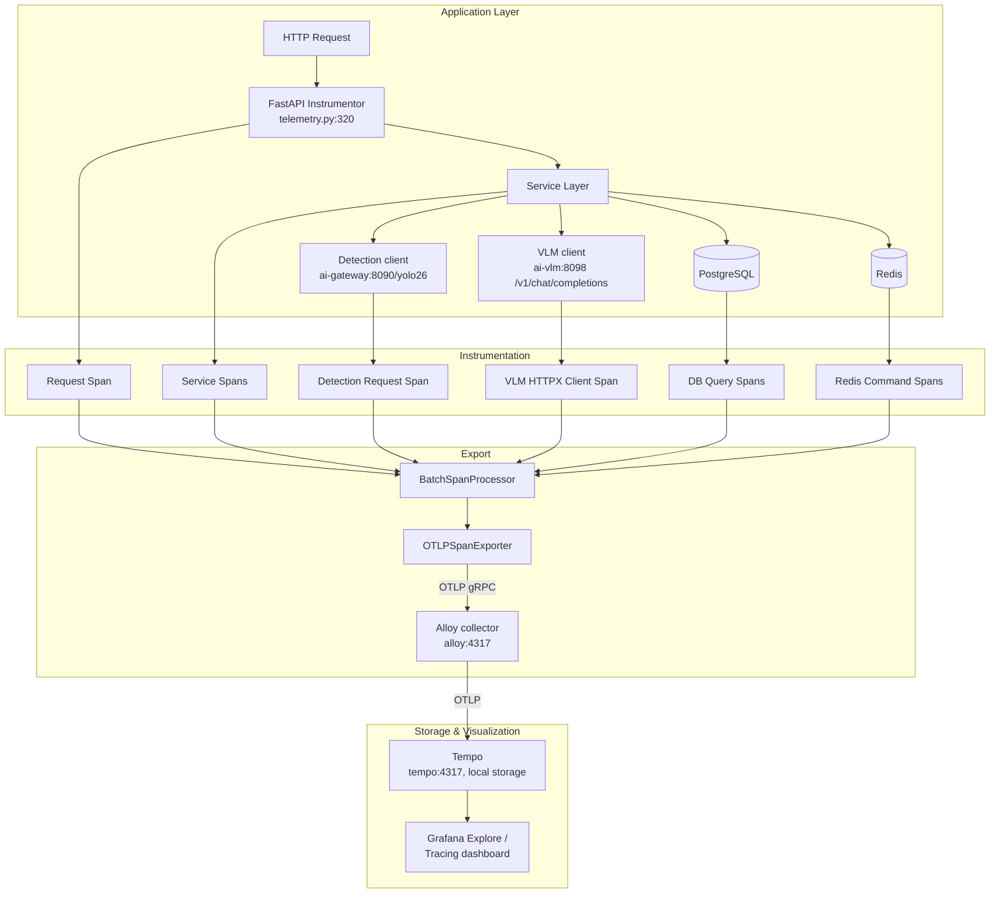

# Distributed Tracing

> OpenTelemetry-based distributed tracing with automatic instrumentation, span context propagation, and Grafana Tempo visualization.

**Key Files:**

- `backend/core/telemetry.py` - OpenTelemetry configuration
- `monitoring/alloy/config.alloy` - OTLP collector: receives traces, forwards to Tempo
- `monitoring/tempo/tempo-config.yml` - Tempo receiver and local storage config
- `monitoring/grafana/provisioning/datasources/prometheus.yml:48-200` - Tempo datasource (with trace-to-metrics queries)
- `monitoring/grafana/dashboards/tracing.json` - Tracing dashboard

## Overview

The system uses OpenTelemetry for distributed tracing, enabling end-to-end visibility into requests as they flow through the AI pipeline. Traces capture the full lifecycle from image detection through VLM analysis to event creation, with automatic instrumentation for HTTP requests, database queries, and Redis operations.

Trace export path: backend → **Alloy** (OTLP collector, default endpoint `http://alloy:4317`) →
**Tempo** (`otelcol.exporter.otlp "tempo"` in `monitoring/alloy/config.alloy:261-263`, endpoint
`tempo:4317`). Grafana reads traces from the Tempo datasource for exploration and correlates traces
with metrics and logs through derived fields and trace-to-metrics queries. Tempo is the trace store
the deployment ships (NEM-5545): `docker-compose.prod.yml` runs the `tempo` service
(`docker-compose.prod.yml:980`) and the `alloy` service (`docker-compose.prod.yml:1415`), and no
other trace store.

The tracing implementation supports both synchronous and asynchronous code paths, with context propagation ensuring spans maintain parent-child relationships across async boundaries.

## Architecture


```mermaid
graph TD
    subgraph "Application Layer"
        REQ[HTTP Request] --> MW[FastAPI Instrumentor<br/>telemetry.py:320]
        MW --> SVC[Service Layer]
        SVC --> DET[Detection client<br/>ai-gateway:8090/yolo26]
        SVC --> VLM[VLM client<br/>ai-vlm:8098 /v1/chat/completions]
        SVC --> DB[(PostgreSQL)]
        SVC --> REDIS[(Redis)]
    end

    subgraph "Instrumentation"
        MW --> SPAN1[Request Span]
        SVC --> SPAN2[Service Spans]
        DET --> SPAN3[Detection Request Span]
        VLM --> SPAN6[VLM HTTPX Client Span]
        DB --> SPAN4[DB Query Spans]
        REDIS --> SPAN5[Redis Command Spans]
    end

    subgraph "Export"
        SPAN1 --> PROC[BatchSpanProcessor]
        SPAN2 --> PROC
        SPAN3 --> PROC
        SPAN6 --> PROC
        SPAN4 --> PROC
        SPAN5 --> PROC
        PROC --> EXP[OTLPSpanExporter]
        EXP --> |OTLP gRPC| ALLOY[Alloy collector<br/>alloy:4317]
    end

    subgraph "Storage & Visualization"
        ALLOY --> |OTLP| TEMPO[Tempo<br/>tempo:4317, local storage]
        TEMPO --> GRAF[Grafana Explore /<br/>Tracing dashboard]
    end
```

## Setup and Configuration

### Initialization

`setup_telemetry(app, settings)` is called during application startup
(`backend/main.py:839`; defined at `backend/core/telemetry.py:145-353`). It returns `True` when
tracing is initialized, `False` when disabled or already active. In abbreviated form
(`backend/core/telemetry.py:145-338`):

```python
# From backend/core/telemetry.py:145-338 (abbreviated)
def setup_telemetry(app: FastAPI, settings: Settings) -> bool:
    """Initialize OpenTelemetry tracing for the application."""
    if not settings.otel_enabled:
        logger.info("OpenTelemetry tracing disabled (OTEL_ENABLED=False)")
        return False

    # Resource with service info (:207-212), merged with automatic
    # container/host/process detection (:233)
    service_resource = Resource.create({
        SERVICE_NAME: settings.otel_service_name,
        "service.version": settings.app_version,
        "deployment.environment": "production" if not settings.debug else "development",
    })

    # Priority-based sampler (NEM-3793) with ParentBased fallback (NEM-3380)
    sampler = create_otel_sampler(settings)  # backend/core/sampling.py:255, :539

    provider = TracerProvider(resource=resource, sampler=sampler)  # :282
    trace.set_tracer_provider(provider)

    # OTLP exporter → Alloy collector (:285-288)
    exporter = OTLPSpanExporter(
        endpoint=settings.otel_exporter_otlp_endpoint,
        insecure=settings.otel_exporter_otlp_insecure,
    )

    # Batch processor tuned for high throughput (NEM-3433), all values from settings
    batch_processor = BatchSpanProcessor(          # :292-298
        exporter,
        max_queue_size=settings.otel_batch_max_queue_size,
        max_export_batch_size=settings.otel_batch_max_export_batch_size,
        schedule_delay_millis=settings.otel_batch_schedule_delay_ms,
        export_timeout_millis=settings.otel_batch_export_timeout_ms,
    )
    provider.add_span_processor(batch_processor)   # :299

    # Composite propagator: W3C Trace Context + W3C Baggage (NEM-3382, :313-316)
    # Auto-instrumentation: FastAPI, HTTPX, SQLAlchemy, Redis (:320-333),
    # Python logging (:338 → _setup_otel_logging)
```

### Configuration Options

Defaults are from `backend/core/config.py:1949-2056` (the effective production values are set by
`docker-compose.prod.yml:630-633`, which mirrors these defaults; the development template
`.env.example:939-1015` disables tracing and points the endpoint at `http://localhost:4317`).

| Setting                            | Type    | Default               | Description                          |
| ---------------------------------- | ------- | --------------------- | ------------------------------------ |
| `OTEL_ENABLED`                     | `bool`  | `True`                | Master toggle for tracing            |
| `OTEL_SERVICE_NAME`                | `str`   | `"nemotron-backend"`  | Service name in traces               |
| `OTEL_EXPORTER_OTLP_ENDPOINT`      | `str`   | `"http://alloy:4317"` | OTLP gRPC endpoint (Alloy collector) |
| `OTEL_EXPORTER_OTLP_INSECURE`      | `bool`  | `True`                | Non-TLS connection to the collector  |
| `OTEL_TRACE_SAMPLE_RATE`           | `float` | `1.0`                 | Root sampling rate (0.0-1.0)         |
| `OTEL_BATCH_MAX_QUEUE_SIZE`        | `int`   | `8192`                | Spans queued before dropping         |
| `OTEL_BATCH_MAX_EXPORT_BATCH_SIZE` | `int`   | `1024`                | Spans per export batch               |
| `OTEL_BATCH_SCHEDULE_DELAY_MS`     | `int`   | `2000`                | Delay between exports (ms)           |
| `OTEL_BATCH_EXPORT_TIMEOUT_MS`     | `int`   | `30000`               | Export timeout (ms)                  |

`OTEL_SERVICE_NAME` keeps its default (`backend/core/config.py:1955-1959`) in every deployment:
the backend is the only service that produces spans, so all pipeline traces arrive under the single
service name `nemotron-backend` — including the calls to `ai-gateway:8090` and `ai-vlm:8098`, which
are client spans inside a backend trace rather than separate services.

There are no `OTEL_AUTO_INSTRUMENTATION` or `OTEL_PROPAGATORS` settings: instrumentation
(FastAPI, HTTPX, SQLAlchemy, Redis, logging) is always applied when `OTEL_ENABLED` is on, and the
propagators are hardcoded to W3C Trace Context + W3C Baggage (`backend/core/telemetry.py:313-338`).
Root-sampling priorities are tuned through the `OTEL_SAMPLING_*` variables
(`backend/core/sampling.py:14-22`).

## Storage Backend

### Tempo Local Storage

Tempo (NEM-5545) is the trace store of record; the trace backend in `docker-compose.prod.yml` is
`tempo` (`docker-compose.prod.yml:980-1007`). Tempo stores traces on its own local disk
(`monitoring/tempo/tempo-config.yml`):

| Setting                     | Value               | Purpose                          |
| --------------------------- | ------------------- | -------------------------------- |
| `storage.trace.backend`     | `local`             | Storage backend type             |
| `storage.trace.local.path`  | `/var/tempo/traces` | Trace block directory            |
| `storage.trace.wal.path`    | `/var/tempo/wal`    | Write-ahead log                  |
| `compactor.block_retention` | `720h`              | Retention: 30 days, then deleted |
| `server.http_listen_port`   | `3200`              | Query API (Grafana reads this)   |
| OTLP receiver               | `0.0.0.0:4317/4318` | gRPC / HTTP ingest (from Alloy)  |

Data persists in the `tempo_data` compose volume (`docker-compose.prod.yml:990`, declared at
`docker-compose.prod.yml:1485`). The compactor applies retention automatically — no separate
lifecycle tooling or init script is required.

### Resource Requirements

| Component         | CPU | Memory | Disk                |
| ----------------- | --- | ------ | ------------------- |
| Tempo             | 1   | 1GB    | `tempo_data` volume |
| Alloy (collector) | 0.5 | 768MB  | -                   |

(Tempo limits `docker-compose.prod.yml:1003-1007`, Alloy limits `docker-compose.prod.yml:1474-1478`.)

### Auto-Instrumentation

The system auto-instruments common libraries (`backend/core/telemetry.py:320-333` and `:338`, with
the logging instrumentation at `backend/core/telemetry.py:381`):

| Library      | Instrumentation           | What's Traced          |
| ------------ | ------------------------- | ---------------------- |
| `fastapi`    | `FastAPIInstrumentor`     | Inbound HTTP requests  |
| `httpx`      | `HTTPXClientInstrumentor` | Outbound HTTP requests |
| `sqlalchemy` | `SQLAlchemyInstrumentor`  | Database queries       |
| `redis`      | `RedisInstrumentor`       | Redis commands         |
| `logging`    | `LoggingInstrumentor`     | Log-trace correlation  |

The AI legs ride the HTTPX instrumentation: the detector client's `httpx` post to
`{AI_GATEWAY_URL}/yolo26/detect` (`backend/services/detector_client.py:668`) and the VLM client's
`httpx.AsyncClient` (`backend/services/vlm_client.py:272-274`) posting to
`/v1/chat/completions` (`backend/services/vlm_client.py:85`) each get a client span with the
injected `traceparent` header, no manual instrumentation required.

## Span Operations

### Creating Manual Spans

For operations not auto-instrumented, use the `trace_span` context manager
(`backend/core/telemetry.py:1225-1268`). It takes the span name plus attributes as keyword
arguments and records exceptions automatically:

```python
from backend.core.telemetry import trace_span

async def analyze_image(image_path: str) -> dict:
    with trace_span("analyze_image", image_path=image_path) as span:
        result = await run_analysis(image_path)
        span.set_attribute("detection_count", len(result.detections))
        return result
```

Related helpers in the same module:

- `trace_function(...)` — decorator that wraps a sync or async function in a span
  (`backend/core/telemetry.py:1279`)
- `create_span_with_links(name, links=[...])` — span linked to spans from another async context,
  e.g. batch work linked back to the originating detection spans (`backend/core/telemetry.py:675`)
- `ai_service_span(...)` — client span with AI semantic attributes
  (`backend/core/telemetry.py:1347`); the pipeline does not call it today — the AI legs it was built
  for get their spans from the HTTPX instrumentation, and the one manual AI span goes through
  `trace_span` plus `AIModelAttributes` (see Pipeline Spans below)

## Span Names and Attributes

### Pipeline Spans

Pipeline spans are created with `tracer.start_as_current_span(...)` and `trace_span(...)`, and
annotated through the semantic-convention helpers in `backend/core/telemetry_ai_conventions.py`.

| Span Name                  | Where                                         | Key Attributes                                                                                                                                                             |
| -------------------------- | --------------------------------------------- | -------------------------------------------------------------------------------------------------------------------------------------------------------------------------- |
| `detection_processing`     | `backend/services/pipeline_workers.py:499`    | `pipeline.camera_id`, `pipeline.stage`, `camera_id`, `file_path`, `media_type`, `pipeline_stage`                                                                           |
| `analysis_processing`      | `backend/services/pipeline_workers.py:1015`   | `batch_id`, `detection_count`, `pipeline_stage`, `camera_id`                                                                                                               |
| `yolo26_detection_request` | `backend/services/detector_client.py:641-646` | `camera_id`, `image_path`, `image_size_bytes`, `retry_attempt`, `ai.model.name`, `ai.model.version`, `ai.model.provider`, `ai.inference.device`, `ai.inference.batch_size` |

`detection_processing` wraps one detection job for a camera; `analysis_processing` wraps the
batch's analysis call, which runs `VlmAnalyzer.analyze_batch()`
(`backend/services/pipeline_workers.py:1052`, built by `build_pipeline_analyzer()` at
`backend/services/pipeline_factory.py:28-40`). `yolo26_detection_request` is emitted once per
detector HTTP attempt inside the detection span — the name is built from the detector type at
`backend/services/detector_client.py:642`, and the detector type is `yolo26`
(`backend/services/detector_client.py:280`).

The VLM leg of the analysis (`ai-vlm:8098`, `POST /v1/chat/completions`) has no manual span of its
own: `VlmClient` runs on an instrumented `httpx.AsyncClient`
(`backend/services/vlm_client.py:272-274`), so its span arrives through the HTTPX instrumentation
as a child of `analysis_processing`. VLM failures are counted instead of spanned —
`record_pipeline_error("vlm_circuit_open")` (`backend/services/vlm_client.py:766`) and
`record_pipeline_error("vlm_verification_failed")` (`backend/services/vlm_analyzer.py:561`) feed
`hsi_pipeline_errors_total`.

`AIModelAttributes.set_on_span(...)` writes the `ai.model.*` / `ai.inference.*` attributes and
`set_pipeline_context_attributes(...)` writes `pipeline.camera_id`, `pipeline.batch_id`,
`pipeline.stage`, and `pipeline.detection_count` (`backend/core/telemetry_ai_conventions.py:64-103, 106-147, 289-312`).

### HTTP Request Spans

Auto-instrumented by FastAPI instrumentor:

| Attribute          | Description                      |
| ------------------ | -------------------------------- |
| `http.method`      | Request method (GET, POST, etc.) |
| `http.url`         | Full request URL                 |
| `http.status_code` | Response status code             |
| `http.route`       | FastAPI route template           |
| `http.host`        | Request host header              |
| `http.user_agent`  | Client user agent                |

### Database Spans

Auto-instrumented by SQLAlchemy instrumentor:

| Attribute      | Description                       |
| -------------- | --------------------------------- |
| `db.system`    | `postgresql`                      |
| `db.name`      | Database name                     |
| `db.statement` | SQL query (truncated)             |
| `db.operation` | Query type (SELECT, INSERT, etc.) |

### Redis Spans

Auto-instrumented by Redis instrumentor:

| Attribute                 | Description                    |
| ------------------------- | ------------------------------ |
| `db.system`               | `redis`                        |
| `db.operation`            | Redis command (GET, SET, etc.) |
| `db.redis.database_index` | Redis database index           |
| `net.peer.name`           | Redis host                     |
| `net.peer.port`           | Redis port                     |

## Context Propagation

### W3C Trace Context

The system uses W3C Trace Context headers for propagation (propagator configured at
`backend/core/telemetry.py:313-316`):

```
traceparent: 00-0af7651916cd43dd8448eb211c80319c-b7ad6b7169203331-01
tracestate: vendor1=value1,vendor2=value2
```

Format: `version-trace_id-span_id-flags`

### W3C Baggage for Cross-Service Context (NEM-3796)

The system uses W3C Baggage to propagate application-specific context across service boundaries
(`backend/api/middleware/baggage.py`, registered in `backend/main.py:1507`):

```
baggage: camera.id=front_door,event.priority=high,request.source=api
```

Baggage is automatically propagated alongside trace context via the composite propagator.

#### Baggage Keys

| Key              | Description                              | Valid Values                 |
| ---------------- | ---------------------------------------- | ---------------------------- |
| `camera.id`      | Source camera for detection pipeline     | Camera identifier string     |
| `event.priority` | Priority level for downstream processing | low, normal, high, critical  |
| `request.source` | Origin of request                        | ui, api, scheduled, internal |
| `batch.id`       | Batch identifier for batch processing    | Batch identifier string      |

#### Setting Baggage

```python
from backend.api.middleware.baggage import set_pipeline_baggage

# At the start of the detection pipeline
set_pipeline_baggage(
    camera_id="front_door",
    event_priority="high",
    request_source="api"
)
```

#### Reading Baggage

```python
from backend.api.middleware.baggage import (
    get_camera_id_from_baggage,
    get_event_priority_from_baggage,
    get_request_source_from_baggage,
)

# In downstream services
camera_id = get_camera_id_from_baggage()
if get_event_priority_from_baggage() == "high":
    # Fast-track processing
    pass
```

#### Automatic Baggage Extraction

The `BaggageMiddleware` (`backend/api/middleware/baggage.py:67`) automatically:

- Extracts `request.source` from `X-Request-Source` header (defaults to "api",
  `backend/api/middleware/baggage.py:105-107`; valid values are the `VALID_REQUEST_SOURCES`
  frozenset at `backend/api/middleware/baggage.py:60`)
- Extracts `camera.id` from URL path patterns like `/cameras/{camera_id}/...`
  (`CAMERA_ID_PATH_PATTERN`, `backend/api/middleware/baggage.py:64`)
- Preserves incoming baggage from upstream services

### Propagation Across Services

Context is automatically propagated to AI services via HTTP headers:

```python
# Context is automatically injected by httpx instrumentation.
# The detector URL is the gateway route: {AI_GATEWAY_URL}/yolo26
# (backend/services/detector_client.py:285), and the request goes to /detect
# (backend/services/detector_client.py:668).
async def detect(image_data: bytes) -> dict:
    async with httpx.AsyncClient() as client:
        # traceparent header is automatically added
        response = await client.post(
            f"{detector_url}/detect",
            files={"file": ("frame.jpg", image_data, "image/jpeg")},
        )
        return response.json()
```

The VLM leg works the same way: `VlmClient` builds one `httpx.AsyncClient` per endpoint
(`backend/services/vlm_client.py:272-274`) against `settings.ai_vlm_url`
(`backend/services/vlm_client.py:235`, `http://ai-vlm:8098` in
`docker-compose.prod.yml:554`) and posts to `CHAT_PATH = "/v1/chat/completions"`
(`backend/services/vlm_client.py:85`), so the same injected `traceparent` header links the VLM call
into the `analysis_processing` trace.

### Manual Propagation

For non-HTTP transports and incoming requests, use the helpers in `backend/core/telemetry.py`:

- `get_trace_headers() -> dict` — injects the current trace context and baggage into a headers
  dict (`traceparent`, `tracestate`, `baggage`) for outbound calls (`backend/core/telemetry.py:1178`)
- `extract_context_from_headers(headers)` — extracts and attaches the context from incoming
  headers using the composite propagator (`backend/core/telemetry.py:1143`)

```python
# Producer (e.g., pushing to a Redis queue)
from backend.core.telemetry import get_trace_headers
message = {"data": payload, **get_trace_headers()}  # adds traceparent/tracestate/baggage
await queue.push(message)

# Consumer
from backend.core.telemetry import extract_context_from_headers
message = await queue.pop()
extract_context_from_headers({k: v for k, v in message.items() if k in {"traceparent", "tracestate", "baggage"}})
# Trace context is now restored for spans created in this task
```

## Trace-to-Metrics Correlation

Grafana's Tempo datasource is configured with trace-to-metrics queries
(`monitoring/grafana/provisioning/datasources/prometheus.yml:48-200`; the `tracesToMetrics` block is
lines 59-190, and `tracesToLogsV2` is lines 56-58):

```yaml
tracesToMetrics:
  datasourceUid: prometheus
  spanStartTimeShift: '-5m'
  spanEndTimeShift: '5m'
  tags:
    - key: 'service.name'
      value: 'service'
    - key: 'db.system'
      value: 'db_system'
    - key: 'http.method'
      value: 'method'
    - key: 'http.status_code'
      value: 'status_code'
  queries:
    - name: 'Pipeline Errors/min'
      query: 'rate(hsi_pipeline_errors_total[1m]) * 60'
    - name: 'Detection Queue Depth'
      query: 'hsi_detection_queue_depth'
    - name: 'Analysis Queue Depth'
      query: 'hsi_analysis_queue_depth'
    - name: 'YOLO26 Latency (p95)'
      query: 'histogram_quantile(0.95, sum(rate(hsi_ai_request_duration_seconds_bucket{service="yolo26"}[5m])) by (le))'
    # ... circuit-breaker state, batch/detect/analyze latency percentiles,
    # DB/Redis health, GPU utilization, event and cost counters, worker pool,
    # SLO gauges — the full list is lines 73-207 of the same file
```

AI-service latency is read from the backend's own client-side histogram
`hsi_ai_request_duration_seconds` (`backend/core/metrics.py:324`), labelled per AI service;
`observe_ai_request_duration()` (`backend/core/metrics.py:1451`) is fed by the detector client
(`backend/services/detector_client.py:1139`).

This enables clicking from a trace span to related Prometheus metrics.

## Trace-to-Logs Correlation

Logs are correlated via trace ID. The Loki datasource extracts trace IDs from logs and links them
to Tempo (`monitoring/grafana/provisioning/datasources/prometheus.yml:202-218`, `derivedFields` at
lines 212-218), and the Tempo datasource links back to Loki from a trace
(`tracesToLogsV2.datasourceUid: loki`, `monitoring/grafana/provisioning/datasources/prometheus.yml:56-58`):

```yaml
derivedFields:
  - name: TraceID
    matcherRegex: 'trace_id=([a-f0-9]{32})'
    url: '${__value.raw}'
    datasourceUid: tempo
    urlDisplayLabel: 'View Trace'
```

Log format includes trace context:

```
2024-01-15 10:30:45 | INFO | backend.services | trace_id=0af7651916cd43dd8448eb211c80319c span_id=b7ad6b7169203331 | Processing detection
```

## Grafana Tracing Dashboard

The tracing dashboard (`monitoring/grafana/dashboards/tracing.json`, 1605 lines) queries Tempo with
TraceQL. Its trace-table panels:

### Pipeline Analysis Traces Panel

Full pipeline traces (`monitoring/grafana/dashboards/tracing.json:960-973`):

```json
{
  "datasource": { "type": "tempo", "uid": "tempo" },
  "queryType": "traceql",
  "query": "{ resource.service.name = \"nemotron-backend\" && name = \"analysis_processing\" }",
  "limit": 15
}
```

### Detection Processing Panel

Detection traces (`monitoring/grafana/dashboards/tracing.json:1104-1117`, `limit: 10`) — same
TraceQL shape with `name = "detection_processing"`.

### LLM Inference Panel

The `LLM Inference` panel (`monitoring/grafana/dashboards/tracing.json:1235-1248`) filters on
`name = "llm_inference"`. TraceQL matches the literal span `name` attribute, so a predicate that
names a span the pipeline does not emit renders an empty table rather than an error; the span names
the pipeline emits are the ones listed in Pipeline Spans above.

### Error Traces Panel

Traces carrying an error status (`monitoring/grafana/dashboards/tracing.json:1353-1366`,
`limit: 20`):

```json
{
  "queryType": "traceql",
  "query": "{ resource.service.name = \"nemotron-backend\" && status = error }"
}
```

### Other Panels

The dashboard also has Prometheus-based overview panels (trace count / duration / error rate by
service, span distribution, slowest endpoints, AI latency comparison), an `All Recent Traces` table
(`monitoring/grafana/dashboards/tracing.json:1552`), and a Tempo `serviceMap` Service Dependency
Graph panel (`monitoring/grafana/dashboards/tracing.json:1409`).

## Sampling Configuration

Sampling is priority-based (NEM-3793): `create_otel_sampler(settings)`
(`backend/core/sampling.py:539`) returns a sampler that always keeps error traces, high-risk events,
and high-priority endpoints, and rate-limits everything else. Parent-based decisions are preserved:
a sampled (or unsampled) parent forces the same decision on children
(`backend/core/telemetry.py:252-279`). Rates are configured through environment variables
(`backend/core/sampling.py:14-22`, examples in `.env.example:971-995`):

| Variable                             | Default | Applies to                                                                |
| ------------------------------------ | ------- | ------------------------------------------------------------------------- |
| `OTEL_SAMPLING_ERROR_RATE`           | `1.0`   | Traces containing errors                                                  |
| `OTEL_SAMPLING_HIGH_RISK_RATE`       | `1.0`   | High-risk (security-relevant) events                                      |
| `OTEL_SAMPLING_HIGH_PRIORITY_RATE`   | `1.0`   | High-priority endpoints (`/api/events`, `/api/alerts`, `/api/detections`) |
| `OTEL_SAMPLING_MEDIUM_PRIORITY_RATE` | `0.5`   | Medium-priority endpoints                                                 |
| `OTEL_SAMPLING_BACKGROUND_RATE`      | `0.1`   | Background paths (`/health`, `/metrics`)                                  |
| `OTEL_SAMPLING_DEFAULT_RATE`         | `0.1`   | Everything else                                                           |
| `OTEL_TRACE_SAMPLE_RATE`             | `1.0`   | Fallback root rate if the priority sampler fails                          |

`OTEL_SAMPLING_HIGH_PRIORITY_PATHS`, `OTEL_SAMPLING_MEDIUM_PRIORITY_PATHS`, and
`OTEL_SAMPLING_BACKGROUND_PATHS` override the path lists.

## Troubleshooting

### No Traces Appearing

1. Check `OTEL_ENABLED` — `true` in production (`docker-compose.prod.yml:630`), but `.env.example`
   ships it as `false` for development (`.env.example:943`)
2. Verify the Alloy collector is reachable at `OTEL_EXPORTER_OTLP_ENDPOINT`
   (default `http://alloy:4317`) and that Alloy forwards to Tempo
   (`otelcol.receiver.otlp "default"` → `otelcol.exporter.otlp.tempo`,
   `monitoring/alloy/config.alloy:247-263`)
3. Check backend logs and Tempo ingests: `podman logs backend | grep -i otlp` and
   `podman logs tempo`

### Missing Span Relationships

1. Verify context propagation headers are forwarded
2. Check async context managers are used correctly
3. Ensure `context.attach()` is called for manual propagation

### High Trace Cardinality

1. Avoid dynamic span names
2. Use bounded attribute values
3. Enable sampling for high-traffic services

## Testing

Run tracing tests:

```bash
uv run pytest backend/tests/unit/core/test_telemetry.py -v
```

| Test                                                            | Purpose                      |
| --------------------------------------------------------------- | ---------------------------- |
| `test_setup_telemetry_disabled_by_default`                      | Disabled path                |
| `test_setup_telemetry_success_initializes_all_instrumentations` | Initialization               |
| `test_setup_telemetry_configures_parent_based_sampler`          | Sampler wiring (NEM-3380)    |
| `test_setup_telemetry_configures_composite_propagator`          | Propagator wiring (NEM-3382) |
| `test_trace_span_creates_span_with_attributes`                  | Manual span creation         |
| `test_trace_span_records_exception_on_error`                    | Exception capture            |
| `test_extract_context_from_headers_calls_propagate`             | Header extraction            |

## Related Documents

- [Structured Logging](./structured-logging.md) - Log-trace correlation
- [Prometheus Metrics](./prometheus-metrics.md) - Metrics-trace correlation
- [Grafana Dashboards](./grafana-dashboards.md) - Trace visualization
