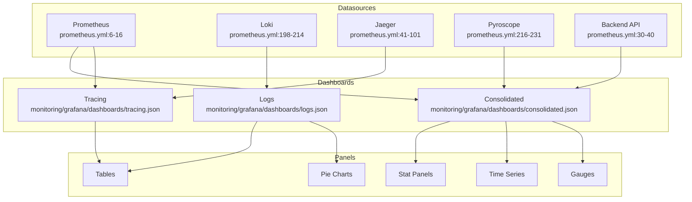

# Grafana Dashboards

> Pre-configured Grafana dashboards for monitoring pipeline health, AI service performance, and system observability.

**Key Files:**

- `monitoring/grafana/dashboards/consolidated.json` - Main operations dashboard
- `monitoring/grafana/dashboards/tracing.json` - Distributed tracing dashboard
- `monitoring/grafana/dashboards/logs.json` - Log aggregation dashboard
- `monitoring/grafana/provisioning/dashboards/dashboard.yml` - Dashboard provisioning
- `monitoring/grafana/provisioning/datasources/prometheus.yml` - Datasource configuration

## Overview

Grafana provides unified visualization across all observability data types: Prometheus metrics, Loki logs, Jaeger traces, and Pyroscope profiles. Dashboards are provisioned automatically via configuration files, ensuring consistent deployment across environments.

The system includes three primary dashboards: an operations dashboard consolidating all metrics, a distributed tracing dashboard for request flow analysis, and a logs dashboard for centralized log viewing with error pattern detection.

Datasources are configured with cross-correlation features, enabling seamless navigation from metrics to traces to logs.

## Architecture



## Datasource Configuration

### Prometheus

Primary metrics datasource (`monitoring/grafana/provisioning/datasources/prometheus.yml:6-16`):

```yaml
- name: Prometheus
  uid: PBFA97CFB590B2093
  type: prometheus
  access: proxy
  url: http://prometheus:9090
  isDefault: true
  jsonData:
    timeInterval: '15s'
    httpMethod: POST
```

### Jaeger with Trace-to-Metrics

Distributed tracing with metric correlation (`monitoring/grafana/provisioning/datasources/prometheus.yml:41-101`):

```yaml
- name: Jaeger
  uid: PC9A941E8F2E49454
  type: jaeger
  url: http://jaeger:16686
  jsonData:
    nodeGraph:
      enabled: true
    tracesToMetrics:
      datasourceUid: PBFA97CFB590B2093
      spanStartTimeShift: '-5m'
      spanEndTimeShift: '5m'
      queries:
        - name: 'Pipeline Errors/min'
          query: 'rate(hsi_pipeline_errors_total[1m]) * 60'
        - name: 'Detection Queue Depth'
          query: 'hsi_detection_queue_depth'
        - name: 'YOLO26 Latency (p95)'
          query: 'histogram_quantile(0.95, rate(yolo26_inference_latency_seconds_bucket[5m]))'
```

### Loki with Trace Correlation

Log aggregation with trace linking (`monitoring/grafana/provisioning/datasources/prometheus.yml:198-214`):

```yaml
- name: Loki
  uid: loki
  type: loki
  url: http://loki:3100
  jsonData:
    maxLines: 1000
    derivedFields:
      - name: TraceID
        matcherRegex: 'trace_id=([a-f0-9]{32})'
        url: '${__value.raw}'
        datasourceUid: PC9A941E8F2E49454
        urlDisplayLabel: 'View Trace'
```

### Pyroscope for Profiling

Continuous profiling with trace correlation (`monitoring/grafana/provisioning/datasources/prometheus.yml:216-231`):

```yaml
- name: Pyroscope
  uid: pyroscope
  type: grafana-pyroscope-datasource
  url: http://pyroscope:4040
  jsonData:
    tracesToProfiles:
      datasourceUid: PC9A941E8F2E49454
      tags:
        - key: service.name
          value: service
      profileTypeId: 'process_cpu:cpu:nanoseconds:cpu:nanoseconds'
```

## Consolidated Operations Dashboard

The main dashboard (`monitoring/grafana/dashboards/consolidated.json`) provides system-wide visibility.

### Executive Summary Row

| Panel                | Metric                             | Thresholds                           |
| -------------------- | ---------------------------------- | ------------------------------------ |
| GPU Utilization      | `hsi_gpu_utilization`              | Green <70%, Yellow 70-90%, Red >90%  |
| Inference FPS        | `hsi_inference_fps`                | Red <0.1, Yellow 0.1-0.5, Green >0.5 |
| Detection Queue      | `hsi_detection_queue_depth`        | Green <10, Yellow 10-50, Red >50     |
| Pipeline P95 Latency | `hsi_detect_latency_p95_ms / 1000` | Green <30s, Yellow 30-60s, Red >60s  |
| GPU Temperature      | `hsi_gpu_temperature`              | Green <70C, Yellow 70-85C, Red >85C  |

Example PromQL (`monitoring/grafana/dashboards/consolidated.json:98-99`):

```promql
hsi_gpu_utilization
```

### GPU Memory Gauge

Displays GPU VRAM usage (`monitoring/grafana/dashboards/consolidated.json:276-362`):

```promql
hsi_gpu_memory_used_mb / hsi_gpu_memory_total_mb * 100
```

Thresholds:

- Green: <80%
- Yellow: 80-95%
- Red: >95%

### Event Rate Panel

Time series of event creation rate (`monitoring/grafana/dashboards/consolidated.json`):

```promql
rate(hsi_events_created_total[5m]) * 60
```

Shows events per minute with sparkline.

### Detection Throughput Panel

Detection processing rate:

```promql
rate(hsi_detections_processed_total[5m])
```

### Risk Score Distribution

Histogram of LLM-assigned risk scores:

```promql
sum by (level) (rate(hsi_events_by_risk_level_total[1h]))
```

### Cache Hit Rate Panel

Cache effectiveness visualization:

```promql
sum(rate(hsi_cache_hits_total[5m])) / (sum(rate(hsi_cache_hits_total[5m])) + sum(rate(hsi_cache_misses_total[5m])))
```

### Worker Status Panel

Pipeline worker states:

```promql
count(hsi_pipeline_worker_state == 1)  # Running
count(hsi_pipeline_worker_state == 3)  # Failed
```

## Tracing Dashboard

The tracing dashboard (`monitoring/grafana/dashboards/tracing.json:1-332`) provides distributed trace exploration.

### Pipeline Analysis Traces

Full pipeline traces with duration thresholds (`monitoring/grafana/dashboards/tracing.json:40-77`):

| Threshold | Duration | Color  |
| --------- | -------- | ------ |
| Normal    | <60s     | Green  |
| Warning   | 60-180s  | Yellow |
| Critical  | >180s    | Red    |

Query configuration:

```json
{
  "datasource": { "type": "jaeger", "uid": "PC9A941E8F2E49454" },
  "queryType": "search",
  "service": "nemotron-backend",
  "operation": "analysis_processing",
  "limit": 15
}
```

### Detection Processing Panel

YOLO26 detection traces (`monitoring/grafana/dashboards/tracing.json:86-143`):

| Threshold | Duration | Meaning                |
| --------- | -------- | ---------------------- |
| Green     | <5s      | Normal detection time  |
| Yellow    | 5-30s    | Slow detection         |
| Red       | >30s     | Detection timeout risk |

### LLM Inference Panel

Nemotron LLM traces (`monitoring/grafana/dashboards/tracing.json:144-200`):

| Threshold | Duration | Meaning                |
| --------- | -------- | ---------------------- |
| Green     | <30s     | Normal inference       |
| Yellow    | 30-120s  | Slow inference         |
| Red       | >120s    | Inference timeout risk |

### Error Traces Panel

Traces with error tags (`monitoring/grafana/dashboards/tracing.json:210-253`):

```json
{
  "queryType": "search",
  "service": "nemotron-backend",
  "tags": "error=true",
  "limit": 20
}
```

### All Recent Traces Panel

General trace view (`monitoring/grafana/dashboards/tracing.json:262-318`):

```json
{
  "queryType": "search",
  "service": "nemotron-backend",
  "limit": 30
}
```

## Logs Dashboard

The logs dashboard (`monitoring/grafana/dashboards/logs.json`) provides centralized log analysis.

### Error Rate Stat

Error percentage from logs (`monitoring/grafana/dashboards/logs.json:67-73`):

```logql
sum(count_over_time({container=~"$service", level=~"ERROR|CRITICAL"} [5m])) / (sum(count_over_time({container=~"$service"} [5m])) > 0)
```

Thresholds:

- Green: <1%
- Yellow: 1-5%
- Red: >5%

### Log Throughput Stat

Log entries per second (`monitoring/grafana/dashboards/logs.json:112-118`):

```logql
sum(rate({container=~"$service"} [5m]))
```

### Log Volume by Level

Stacked bar chart by log level (`monitoring/grafana/dashboards/logs.json:173-248`):

```logql
sum by (level) (count_over_time({container=~"$service", level=~"$level"} |~ "$search" [$__interval]))
```

Color mapping:

- DEBUG: Blue
- INFO: Green
- WARNING: Yellow
- ERROR: Orange
- CRITICAL: Red

### Level Distribution Pie Chart

Percentage breakdown (`monitoring/grafana/dashboards/logs.json:250-311`):

```logql
sum by (level) (count_over_time({container=~"$service", level=~"$level"} |~ "$search" [$__range]))
```

### Top Error Patterns Table

Most common errors (`monitoring/grafana/dashboards/logs.json:358-365`):

```logql
topk(10, sum by (level, container) (count_over_time({container=~"$service", level=~"ERROR|CRITICAL"} [15m])))
```

### Live Log Stream Panel

Real-time log viewing (`monitoring/grafana/dashboards/logs.json`):

```logql
{container=~"$service", level=~"$level"} |~ "$search"
```

## Dashboard Variables

### Service Variable

Filter by container/service (`monitoring/grafana/dashboards/logs.json`):

| Variable   | Type   | Values                                                     |
| ---------- | ------ | ---------------------------------------------------------- |
| `$service` | Custom | `backend\|ai-yolo26\|ai-llm\|ai-florence\|redis\|postgres` |

### Level Variable

Filter by log level:

| Variable | Type   | Values                                  |
| -------- | ------ | --------------------------------------- |
| `$level` | Custom | `DEBUG\|INFO\|WARNING\|ERROR\|CRITICAL` |

### Search Variable

Free-text log search:

| Variable  | Type    | Default |
| --------- | ------- | ------- |
| `$search` | Textbox | `""`    |

## Dashboard Provisioning

Dashboards are automatically loaded (`monitoring/grafana/provisioning/dashboards/dashboard.yml`):

```yaml
apiVersion: 1

providers:
  - name: 'HSI Dashboards'
    orgId: 1
    folder: 'Home Security Intelligence'
    type: file
    disableDeletion: false
    updateIntervalSeconds: 10
    options:
      path: /var/lib/grafana/dashboards
```

## Alert Rules

Grafana alert rules are provisioned in `monitoring/grafana/provisioning/alerting/log-alerts.yml`:

### High Error Rate Alert

```yaml
- alert: HighErrorRate
  expr: |
    sum(count_over_time({container=~"backend|ai-.*"} |~ "ERROR|CRITICAL" [5m]))
    / sum(count_over_time({container=~"backend|ai-.*"} [5m])) > 0.05
  for: 5m
  labels:
    severity: warning
  annotations:
    summary: 'High error rate in logs'
    description: 'Error rate exceeds 5% for 5 minutes'
```

### No Logs Alert

```yaml
- alert: NoLogsReceived
  expr: |
    sum(count_over_time({container="backend"} [5m])) == 0
  for: 10m
  labels:
    severity: critical
  annotations:
    summary: 'No logs received from backend'
```

## PromQL Query Examples

### SLI Queries

```promql
# API Availability (from recording rules)
hsi:api_availability:ratio_rate1h

# Detection P95 Latency
hsi:detection_latency:p95_5m

# Error Budget Remaining
hsi:error_budget:api_availability_remaining * 100
```

### Infrastructure Queries

```promql
# GPU Memory Pressure
hsi_gpu_memory_used_mb / hsi_gpu_memory_total_mb > 0.9

# Worker Pool Utilization
hsi_worker_busy_count / hsi_worker_active_count

# Queue Backpressure
hsi_detection_queue_depth > 100 or hsi_analysis_queue_depth > 50
```

### AI Service Queries

```promql
# LLM Token Throughput
rate(hsi_nemotron_tokens_input_total[5m]) + rate(hsi_nemotron_tokens_output_total[5m])

# Enrichment Model Error Rate
sum by (model) (rate(hsi_enrichment_model_errors_total[5m])) / sum by (model) (rate(hsi_enrichment_model_calls_total[5m]))

# Detection Confidence Distribution
histogram_quantile(0.95, rate(hsi_detection_confidence_bucket[5m]))
```

## Best Practices

### Panel Design

1. **Use appropriate visualization types**: Stats for current values, time series for trends, tables for detailed data
2. **Set meaningful thresholds**: Based on SLOs and operational experience
3. **Include units**: Percent, seconds, bytes, etc.
4. **Limit queries**: Avoid heavy aggregations; use recording rules

### Query Optimization

1. **Use recording rules** for frequently-used aggregations
2. **Limit time ranges** to what's necessary
3. **Avoid regex** where possible
4. **Use `rate()` over `increase()`** for better resolution

### Dashboard Organization

1. **Executive summary first**: Key metrics at top
2. **Progressive detail**: General to specific as you scroll
3. **Related panels grouped**: Use rows and collapsible sections
4. **Consistent time ranges**: Align panel refresh intervals

## Related Documents

- [Prometheus Metrics](./prometheus-metrics.md) - Metric definitions
- [Distributed Tracing](./distributed-tracing.md) - Trace data sources
- [Structured Logging](./structured-logging.md) - Log format for Loki
- [Alertmanager](./alertmanager.md) - Alert routing from Grafana
