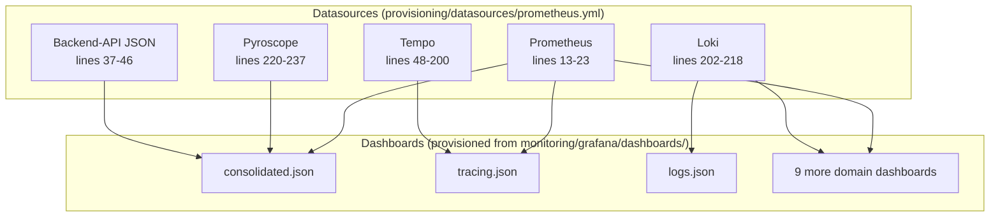

# Grafana Dashboards

> Pre-configured Grafana dashboards for monitoring pipeline health, AI service performance, and system observability.

**Key Files:**

- `monitoring/grafana/dashboards/consolidated.json` - Main operations dashboard
- `monitoring/grafana/dashboards/tracing.json` - Distributed tracing dashboard (Tempo)
- `monitoring/grafana/dashboards/logs.json` - Log aggregation dashboard (Loki)
- Additional provisioned dashboards: `ai-service-health.json`, `ai-services.json`, `analytics.json`, `api-health.json`, `hsi-gpu-metrics.json`, `hsi-profiling.json`, `hsi-request-profiling.json`, `video-analytics.json` (all in `monitoring/grafana/dashboards/`)
- `monitoring/grafana/provisioning/dashboards/dashboard.yml` - Dashboard provisioning
- `monitoring/grafana/provisioning/datasources/prometheus.yml` (237 lines) - Datasource configuration

## Overview

Grafana provides unified visualization across all observability data types: Prometheus metrics,
Loki logs, Tempo traces, and Pyroscope profiles. Dashboards are provisioned automatically from
`monitoring/grafana/dashboards/` (bind-mounted into the container at
`/var/lib/grafana/dashboards`), so edits land on restart without re-baking the image.

Grafana is served behind the frontend nginx proxy under `/grafana/`
(`GF_SERVER_ROOT_URL=/grafana/`, `docker-compose.prod.yml`); the direct port mapping is
`127.0.0.1:${GRAFANA_PORT:-3002}`.

Datasources are configured with cross-correlation: traces link to logs (Loki) and metrics
(Prometheus), logs extract trace IDs for one-click navigation to Tempo, and profiles link back to
traces.

## Architecture


```mermaid
graph TD
    subgraph "Datasources (provisioning/datasources/prometheus.yml)"
        PROM[Prometheus<br/>lines 13-23]
        LOKI[Loki<br/>lines 202-218]
        TEMPO[Tempo<br/>lines 48-200]
        PYRO[Pyroscope<br/>lines 220-237]
        API[Backend-API JSON<br/>lines 37-46]
    end

    subgraph "Dashboards (provisioned from monitoring/grafana/dashboards/)"
        CONS[consolidated.json]
        TRAC[tracing.json]
        LOGS[logs.json]
        EXTRA[9 more domain dashboards]
    end

    PROM --> CONS
    PROM --> TRAC
    LOKI --> LOGS
    TEMPO --> TRAC
    PYRO --> CONS
    API --> CONS
    PROM --> EXTRA
    LOKI --> EXTRA
```

## Datasource Configuration

All datasources are provisioned in
`monitoring/grafana/provisioning/datasources/prometheus.yml` with stable lowercase uids
(`prometheus`, `loki`, `tempo`, `pyroscope`, `alertmanager`, `Backend-API`). Dashboard JSON refers
to those uids.

### Prometheus

Primary metrics datasource (`monitoring/grafana/provisioning/datasources/prometheus.yml:13-23`):

```yaml
- name: Prometheus
  uid: prometheus
  type: prometheus
  access: proxy
  url: http://prometheus:9090
  isDefault: true
  jsonData:
    timeInterval: '15s'
    httpMethod: POST
```

### Tempo with Trace-to-Metrics and Trace-to-Logs

Distributed tracing (NEM-5545, replaced the Jaeger datasource;
`monitoring/grafana/provisioning/datasources/prometheus.yml:48-200`):

```yaml
- name: Tempo
  uid: tempo
  type: tempo
  url: http://tempo:3200
  jsonData:
    tracesToLogsV2:
      datasourceUid: loki
      filterByTraceID: true
    tracesToMetrics:
      datasourceUid: prometheus # uid of the Prometheus datasource
      spanStartTimeShift: '-5m'
      spanEndTimeShift: '5m'
      queries:
        - name: 'Pipeline Errors/min'
          query: 'rate(hsi_pipeline_errors_total[1m]) * 60'
        - name: 'Detection Queue Depth'
          query: 'hsi_detection_queue_depth'
        - name: 'YOLO26 Latency (p95)'
          query: 'histogram_quantile(0.95, sum(rate(hsi_ai_request_duration_seconds_bucket{service="yolo26"}[5m])) by (le))'
        # ... batch latency percentiles, detect/analyze latency, worker pool
    nodeGraph:
      enabled: true
    tracesToProfiles:
      datasourceUid: pyroscope
      profileTypeId: 'process_cpu:cpu:nanoseconds:cpu:nanoseconds'
```

### Loki with Trace Correlation

Log aggregation with trace linking (`monitoring/grafana/provisioning/datasources/prometheus.yml:202-218`):

```yaml
- name: Loki
  uid: loki
  type: loki
  url: http://loki:3100
  jsonData:
    maxLines: 1000
    derivedFields:
      - name: TraceID
        matcherRegex: 'trace_id=([a-f0-9]{32})'
        url: '${__value.raw}'
        datasourceUid: tempo
        urlDisplayLabel: 'View Trace'
```

### Pyroscope for Profiling

Continuous profiling (`monitoring/grafana/provisioning/datasources/prometheus.yml:220-237`):

```yaml
- name: Pyroscope
  uid: pyroscope
  type: grafana-pyroscope-datasource
  url: http://pyroscope:4040
  jsonData:
    tracesToProfiles:
      datasourceUid: tempo
      profileTypeId: 'process_cpu:cpu:nanoseconds:cpu:nanoseconds'
```

## Consolidated Operations Dashboard

The main dashboard (`monitoring/grafana/dashboards/consolidated.json`) is organized in rows:
Executive Summary, System Health, Alert Management, Container Resources, Host System Health,
Pipeline Overview, GPU & Hardware, AI Inference, AI Quality & Audit, Detection Analytics, Risk
Analysis, Queue Health, Worker Health, DLQ & Worker Health, Circuit Breaker & Cache,
Experimentation, Pipeline Latencies, Cost & Efficiency, Service Health, Redis
Details, Real User Monitoring (RUM), SLI/SLO Overview, AI Container Health, Synthetic Monitoring,
and Gateway Inference Traffic (`hsi_ai_inference_*`).

### Executive Summary Row

| Panel                | Expression                                                 | Thresholds (green / yellow / red) |
| -------------------- | ---------------------------------------------------------- | --------------------------------- |
| GPU Utilization      | `hsi_gpu_utilization`                                      | <70% / 70-90% / >90%              |
| Inference FPS        | `hsi_inference_fps`                                        | -                                 |
| Detection Queue      | `hsi_detection_queue_depth`                                | <10 / 10-50 / >50                 |
| Pipeline P95 Latency | `hsi_detect_latency_p95_ms / 1000`                         | <30s / 30-60s / >60s              |
| GPU Temp             | `hsi_gpu_temperature`                                      | <70C / 70-85C / >85C              |
| VRAM Usage           | `(hsi_gpu_memory_used_mb / hsi_gpu_memory_total_mb) * 100` | <80% / 80-95% / >95%              |

### Other Representative Panels

| Area              | Panel                | Expression                                                                                                                                                                                                   |
| ----------------- | -------------------- | ------------------------------------------------------------------------------------------------------------------------------------------------------------------------------------------------------------ |
| Pipeline          | Throughput           | `rate(hsi_detections_processed_total[5m])`, `rate(hsi_events_created_total[5m])`                                                                                                                             |
| Risk              | Events by Risk Level | `rate(hsi_events_by_risk_level_total[5m])`                                                                                                                                                                   |
| Cache             | Cache Hit Rate       | `sum(rate(hsi_cache_hits_total[5m])) / (sum(rate(hsi_cache_hits_total[5m])) + sum(rate(hsi_cache_misses_total[5m])))`                                                                                        |
| Workers           | Worker Pool          | `hsi_worker_active_count`, `hsi_worker_busy_count`, `hsi_worker_idle_count`, `hsi_pipeline_worker_state`                                                                                                     |
| AI Inference      | Per-service latency  | `histogram_quantile(0.95, rate(hsi_ai_request_duration_seconds_bucket{service="yolo26"}[5m]))` — the backend's client-side histogram, labelled per AI service by `backend/services/detector_client.py:1139`  |
| AI Serving Health | Model health probes  | `probe_success{job="blackbox-http-2xx"}` per probe target (`model="gateway"`, `"yolo26"`, `"enrichment-light"`, `"llm"` — `monitoring/prometheus.yml:404-434`)                                               |
| LLM (ai-vlm)      | llama.cpp metrics    | `llamacpp:predicted_tokens_seconds`, `llamacpp:requests_processing` (scraped from `ai-vlm:8098`, `monitoring/prometheus.yml:90-98`), `hsi_llm_context_utilization_ratio` (`backend/core/metrics.py:412-413`) |
| SLO               | Availability / burn  | `hsi:api_availability:ratio_rate30d * 100`, `hsi:burn_rate:api_availability_1h`, `hsi:error_budget:api_availability_remaining * 100`                                                                         |
| Synthetic         | Blackbox probes      | `probe_success`, `probe_duration_seconds`, `probe_http_duration_seconds{phase="connect"}`                                                                                                                    |

## Tracing Dashboard

The tracing dashboard (`monitoring/grafana/dashboards/tracing.json`, 1605 lines) queries Tempo with
TraceQL (`queryType: "traceql"`, datasource uid `tempo`). The trace-table panels have no colour
thresholds; they list recent spans for click-through to the trace view. The service selector is
`resource.service.name = "nemotron-backend"`, which is the value of `OTEL_SERVICE_NAME`
(`backend/core/config.py:1958`).

### Pipeline Analysis Traces (`monitoring/grafana/dashboards/tracing.json:967`)

```json
{
  "datasource": { "type": "tempo", "uid": "tempo" },
  "queryType": "traceql",
  "query": "{ resource.service.name = \"nemotron-backend\" && name = \"analysis_processing\" }",
  "limit": 15
}
```

### Detection Traces Row Panels

Same shape with `name = "detection_processing"` (`monitoring/grafana/dashboards/tracing.json:1111`) and an `LLM Inference` table on
`name = "llm_inference"` (`monitoring/grafana/dashboards/tracing.json:1242`), limit 10. The pipeline spans those tables match are
opened in the worker loops: `detection_processing` (`backend/services/pipeline_workers.py:499`) and
`analysis_processing` (`backend/services/pipeline_workers.py:1015`).

### Error Traces Panel (`monitoring/grafana/dashboards/tracing.json:1360`)

```json
{
  "datasource": { "type": "tempo", "uid": "tempo" },
  "queryType": "traceql",
  "query": "{ resource.service.name = \"nemotron-backend\" && status = error }",
  "limit": 20
}
```

### Service Dependency Graph (`monitoring/grafana/dashboards/tracing.json:1409`)

Tempo `queryType: "serviceMap"` panel — renders the service topology from trace data. Tempo runs with
the local trace store and OTLP receivers on 4317/4318 (`monitoring/tempo/tempo-config.yml`, 21 lines);
traces reach it through Alloy's OTLP export.

### Overview Panels

Prometheus-backed panels for trace counts, duration, error rate by service, span distribution, and
AI latency comparison sit above the trace tables, plus an "All Recent Traces" table
(`{ resource.service.name = "nemotron-backend" }`, limit 30, `monitoring/grafana/dashboards/tracing.json:1552`).

## Logs Dashboard

The logs dashboard (`monitoring/grafana/dashboards/logs.json`, 790 lines) provides centralized log
analysis against Loki; each panel's LogQL lives in its `targets[].expr`.

### Error Rate Stat (`monitoring/grafana/dashboards/logs.json:70`)

```logql
sum(count_over_time({container=~"$service", level=~"ERROR|CRITICAL"} [5m])) / (sum(count_over_time({container=~"$service"} [5m])) > 0)
```

### Log Throughput Stat (`monitoring/grafana/dashboards/logs.json:115`)

```logql
sum(rate({container=~"$service"} [5m]))
```

### Log Volume by Level (`monitoring/grafana/dashboards/logs.json:242`)

```logql
sum by (level) (count_over_time({container=~"$service", level=~"$level"} |~ "$search" [$__interval]))
```

### Level Distribution Pie Chart (`monitoring/grafana/dashboards/logs.json:305`)

```logql
sum by (level) (count_over_time({container=~"$service", level=~"$level"} |~ "$search" [$__range]))
```

### Top Error Patterns Table (`monitoring/grafana/dashboards/logs.json:360`)

```logql
topk(10, sum by (level, container) (count_over_time({container=~"$service", level=~"ERROR|CRITICAL"} [15m])))
```

### Live Log Stream Panel

```logql
{container=~"$service", level=~"$level"} |~ "$search"
```

A separate "PostgreSQL Database Logs" row filters the postgres container.

## Dashboard Variables

The logs dashboard template variables (`logs.json` `templating.list`):

| Variable   | Type    | Definition                          |
| ---------- | ------- | ----------------------------------- |
| `$service` | query   | `label_values(container)`           |
| `$level`   | Custom  | `DEBUG,INFO,WARNING,ERROR,CRITICAL` |
| `$search`  | Textbox | empty                               |

Container values come live from Loki labels, so they always reflect the deployed compose services
(`backend`, `ai-gateway`, `ai-vlm`, `redis`, `postgres`, `tempo`, `loki`, ...).

## Dashboard Provisioning

Dashboards are automatically loaded (`monitoring/grafana/provisioning/dashboards/dashboard.yml`):

```yaml
apiVersion: 1

providers:
  - name: 'Home Security Intelligence'
    orgId: 1
    folder: 'Home Security Intelligence'
    folderUid: 'hsi-dashboards'
    type: file
    disableDeletion: false
    updateIntervalSeconds: 30
    allowUiUpdates: true
    options:
      path: /var/lib/grafana/dashboards
      foldersFromFilesStructure: false
```

## Alert Rules

Grafana-managed alert rules are provisioned in
`monitoring/grafana/provisioning/alerting/log-alerts.yml` (folder "HSI Alerts", 1m interval). They
use Grafana's alerting format (`uid`/`title`/`condition` with LogQL queries against the `loki`
datasource), not Prometheus rule syntax: `high-error-rate`, `error-spike`, `service-silent`,
`critical-error` (see [Alertmanager](./alertmanager.md#grafana-log-based-alerts) for the full
table).

## PromQL Query Examples

### SLI Queries

```promql
# API availability (recording rules, monitoring/prometheus-rules.yml)
hsi:api_availability:ratio_rate1h

# Detection latency SLI (recording rules)
hsi:detection_latency:p95_5m

# Error budget remaining
hsi:error_budget:api_availability_remaining * 100
```

### Infrastructure Queries

```promql
# GPU memory pressure
hsi_gpu_memory_used_mb / hsi_gpu_memory_total_mb > 0.9

# Worker pool utilization
hsi_worker_busy_count / hsi_worker_active_count

# Queue backpressure
hsi_detection_queue_depth > 100 or hsi_analysis_queue_depth > 50
```

### AI Service Queries

```promql
# Verdict-engine token throughput (llama.cpp series scraped from ai-vlm:8098,
# monitoring/prometheus.yml:90-98)
rate(llama_tokens_predicted_total{service="ai-vlm"}[1m])

# ai-vlm breaker-driven degradation + specialist unavailability
sum by (service) (hsi_ai_service_degraded)
sum by (specialist, reason) (rate(hsi_specialist_unavailable_total[5m]))

# Detection confidence distribution (P95)
histogram_quantile(0.95, rate(hsi_detection_confidence_bucket[5m]))
```

## Best Practices

### Panel Design

1. **Use appropriate visualization types**: Stats for current values, time series for trends, tables for detailed data
2. **Set meaningful thresholds**: Based on SLOs and operational experience
3. **Include units**: Percent, seconds, bytes, etc.
4. **Limit queries**: Avoid heavy aggregations; use recording rules

### Query Optimization

1. **Use recording rules** for frequently-used aggregations
2. **Limit time ranges** to what's necessary
3. **Avoid regex** where possible
4. **Use `rate()` over `increase()`** for better resolution

### Dashboard Organization

1. **Executive summary first**: Key metrics at top
2. **Progressive detail**: General to specific as you scroll
3. **Related panels grouped**: Use rows and collapsible sections
4. **Consistent time ranges**: Align panel refresh intervals

## Related Documents

- [Prometheus Metrics](./prometheus-metrics.md) - Metric definitions
- [Distributed Tracing](./distributed-tracing.md) - Trace data sources
- [Structured Logging](./structured-logging.md) - Log format for Loki
- [Alertmanager](./alertmanager.md) - Alert routing from Grafana
