# Real-Time Architecture


_AI-generated visualization of WebSocket real-time architecture with Redis pub/sub hub and client connections._

This document details the real-time communication architecture of the Home Security Intelligence system, including WebSocket channels, Redis pub/sub backbone, event broadcasting patterns, and message formats.

---

## Table of Contents

1. [Real-Time Overview](#real-time-overview)
2. [WebSocket Channels](#websocket-channels)
3. [Redis Pub/Sub Backbone](#redis-pubsub-backbone)
4. [Event Broadcasting](#event-broadcasting)
5. [System Status Broadcasting](#system-status-broadcasting)
   - [SystemBroadcaster Features](#systembroadcaster-features)
   - [Circuit Breaker Integration](#circuit-breaker-integration)
   - [Degraded Mode](#degraded-mode)
   - [Performance Broadcasting](#performance-broadcasting)
6. [Message Formats](#message-formats)
7. [Frontend Integration](#frontend-integration)
8. [Connection Management](#connection-management)
9. [Scaling Considerations](#scaling-considerations)
10. [Image Generation Prompts](#image-generation-prompts)

---

## Real-Time Overview

The real-time system enables instant dashboard updates without polling by using WebSocket connections backed by Redis pub/sub for multi-instance scalability.

### Architecture Diagram


### Detailed Architecture Diagram

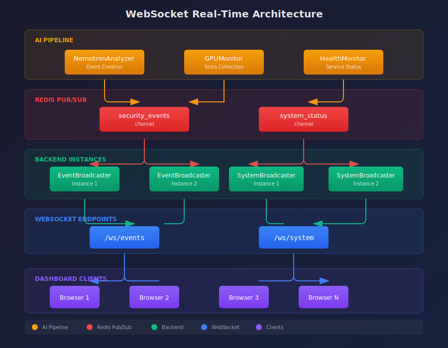

### Diagram: WebSocket Architecture

```mermaid
flowchart TB
    subgraph Pipeline["AI Pipeline"]
        NA[NemotronAnalyzer<br/>Event Creation]
        GPU[GPUMonitor<br/>Stats Collection]
        HM[HealthMonitor<br/>Service Status]
    end

    subgraph Redis["Redis Pub/Sub"]
        CH1[security_events<br/>channel]
        CH2[system_status<br/>channel]
    end

    subgraph Backend["Backend Instances"]
        EB1[EventBroadcaster<br/>Instance 1]
        EB2[EventBroadcaster<br/>Instance 2]
        SB1[SystemBroadcaster<br/>Instance 1]
        SB2[SystemBroadcaster<br/>Instance 2]
    end

    subgraph WebSocket["WebSocket Endpoints"]
        WS1[/ws/events]
        WS2[/ws/system]
    end

    subgraph Clients["Dashboard Clients"]
        C1[Browser 1]
        C2[Browser 2]
        C3[Browser N]
    end

    NA -.->|publish| CH1
    GPU -.->|publish| CH2
    HM -.->|publish| CH2

    CH1 -.->|subscribe| EB1
    CH1 -.->|subscribe| EB2
    CH2 -.->|subscribe| SB1
    CH2 -.->|subscribe| SB2

    EB1 & EB2 --> WS1
    SB1 & SB2 --> WS2

    WS1 --> C1 & C2 & C3
    WS2 --> C1 & C2 & C3

    style CH1 fill:#A855F7,color:#fff
    style CH2 fill:#A855F7,color:#fff
    style WS1 fill:#3B82F6,color:#fff
    style WS2 fill:#3B82F6,color:#fff
```

### Communication Patterns

| Pattern                   | Use Case               | Technology                     |
| ------------------------- | ---------------------- | ------------------------------ |
| **Push notifications**    | Security events        | WebSocket + Redis pub/sub      |
| **Status updates**        | GPU stats, health      | WebSocket + periodic broadcast |
| **Multi-instance sync**   | Load-balanced backends | Redis pub/sub                  |
| **Connection management** | Client tracking        | In-memory set per instance     |

---

## WebSocket Channels

The system exposes three WebSocket endpoints for real-time updates.

### Channel Overview

| Channel      | Endpoint                 | Purpose                      | Message Frequency |
| ------------ | ------------------------ | ---------------------------- | ----------------- |
| **Events**   | `/ws/events`             | Security event notifications | On event creation |
| **System**   | `/ws/system`             | System health and GPU stats  | Every 5 seconds   |
| **Job Logs** | `/ws/jobs/{job_id}/logs` | Real-time job log streaming  | On log emission   |

### Events Channel (`/ws/events`)

Delivers real-time security event notifications as they are created by the AI pipeline.

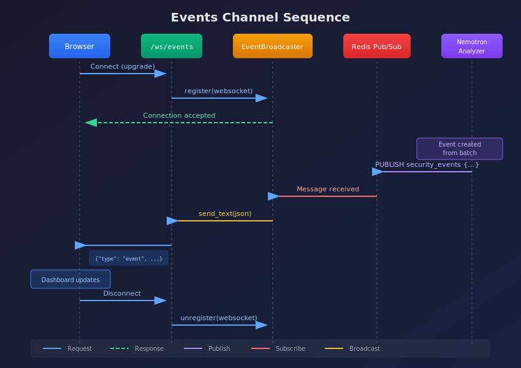

### Diagram: Events Channel Sequence

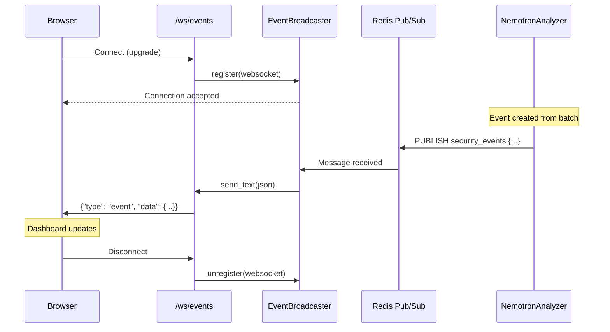

### System Channel (`/ws/system`)

Delivers periodic system status updates including GPU statistics and service health.

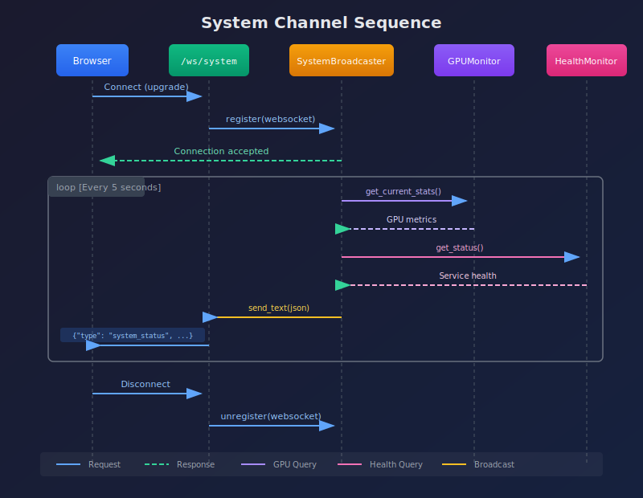

### Diagram: System Channel Sequence

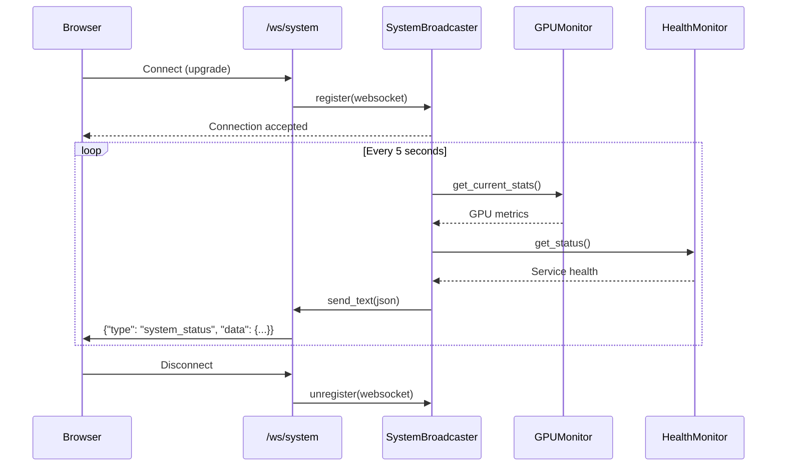

### Job Logs Channel (`/ws/jobs/{job_id}/logs`)

Streams real-time log entries for active jobs (pending or running status). This enables the Jobs page to display live log output as background tasks execute.

**Authentication:**

- Query parameter: `ws://host/ws/jobs/{job_id}/logs?api_key=YOUR_KEY`
- Sec-WebSocket-Protocol header: `"api-key.YOUR_KEY"`
- Token parameter: `ws://host/ws/jobs/{job_id}/logs?token=YOUR_TOKEN`

**Message Format:**

```json
{
  "type": "log",
  "data": {
    "timestamp": "2026-01-17T10:32:05Z",
    "level": "INFO",
    "message": "Processing batch 2/3",
    "context": { "batch_id": "abc123" }
  }
}
```

**Behavior:**

- Subscribes to Redis pub/sub channel `job:{job_id}:logs`
- Logs are forwarded to the WebSocket as they are emitted by the job
- Connection closes when the client disconnects or the idle timeout is reached
- Server sends periodic heartbeat pings to detect disconnected clients

**Source:** [backend/api/routes/websocket.py](../../backend/api/routes/websocket.py) - `websocket_job_logs` endpoint

---

## Redis Pub/Sub Backbone

Redis pub/sub enables real-time message distribution across multiple backend instances, ensuring all connected clients receive events regardless of which instance handles their WebSocket connection.

### Channel Configuration

The channel name is configured in settings and retrieved via the [get_event_channel](../../backend/services/event_broadcaster.py) function at line 27:

```python
# backend/services/event_broadcaster.py:27
def get_event_channel() -> str:
    """Get the Redis event channel name from settings.

    Returns:
        The configured Redis event channel name.
    """
    return get_settings().redis_event_channel
```

### Pub/Sub Flow

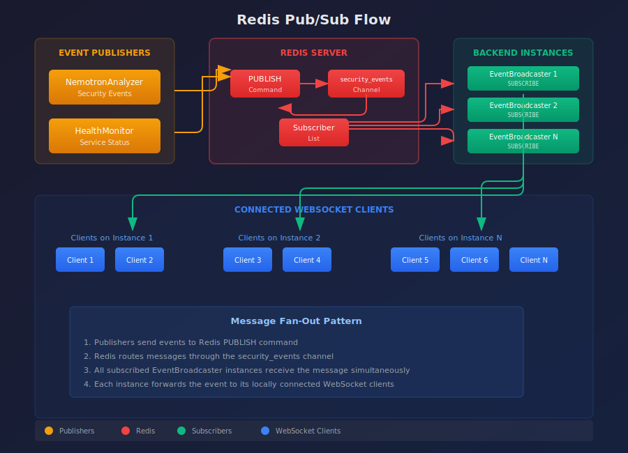

### Diagram: Redis Pub/Sub Flow

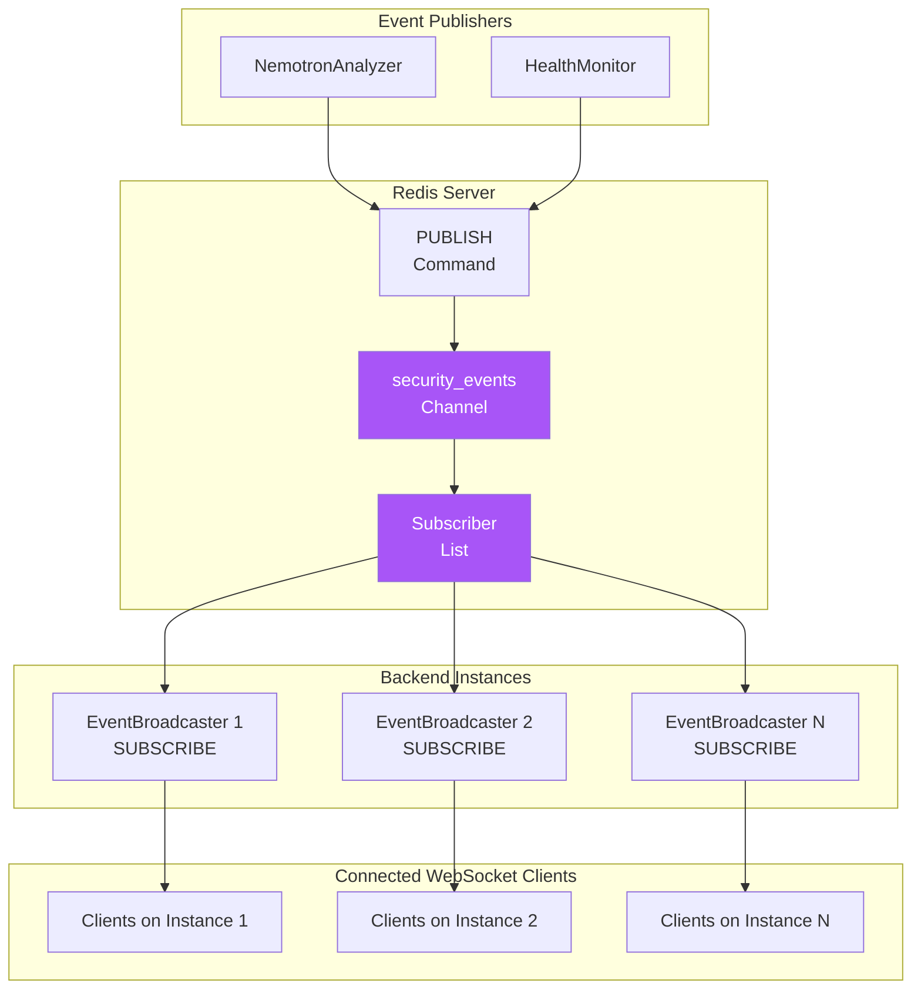

### Redis Message Format

Messages published to Redis include the full event envelope:

```json
{
  "type": "event",
  "data": {
    "id": 123,
    "event_id": 123,
    "batch_id": "abc123def456",
    "camera_id": "front_door",
    "risk_score": 75,
    "risk_level": "high",
    "summary": "Person detected near entrance",
    "started_at": "2024-01-15T10:30:00.000000"
  }
}
```

---

## Event Broadcasting

The [EventBroadcaster](../../backend/services/event_broadcaster.py) class at line 36 manages WebSocket connections and distributes events.

### EventBroadcaster Implementation

```python
# backend/services/event_broadcaster.py:36
class EventBroadcaster:
    """Manages WebSocket connections and broadcasts events via Redis pub/sub.

    This class acts as a bridge between Redis pub/sub events and WebSocket
    connections, allowing multiple backend instances to share event notifications.
    """

    def __init__(self, redis_client: RedisClient, channel_name: str | None = None):
        self._redis = redis_client
        self._channel_name = channel_name or get_settings().redis_event_channel
        self._connections: set[WebSocket] = set()
        self._pubsub: PubSub | None = None
        self._listener_task: asyncio.Task[None] | None = None
        self._is_listening = False
```

### Broadcasting Flow

```mermaid
flowchart TB
    subgraph Event["Event Creation"]
        NA[NemotronAnalyzer<br/>analyze_batch()]
    end

    subgraph Broadcast["EventBroadcaster"]
        GET[get_broadcaster()]
        PUB[broadcast_event()]
        REDIS[Redis PUBLISH]
    end

    subgraph Listen["Event Listener"]
        SUB[Redis SUBSCRIBE]
        LOOP[_listen_for_events()]
        SEND[_send_to_all_clients()]
    end

    subgraph Clients["WebSocket Connections"]
        WS1[WebSocket 1]
        WS2[WebSocket 2]
        WSN[WebSocket N]
    end

    NA --> GET
    GET --> PUB
    PUB --> REDIS

    REDIS -.->|Async| SUB
    SUB --> LOOP
    LOOP --> SEND
    SEND --> WS1 & WS2 & WSN

    style REDIS fill:#A855F7,color:#fff
```

### Connection Management

The broadcaster maintains a set of active connections:

```python
async def connect(self, websocket: WebSocket) -> None:
    """Register a new WebSocket connection."""
    await websocket.accept()
    self._connections.add(websocket)
    logger.info(f"WebSocket connected. Total connections: {len(self._connections)}")

async def disconnect(self, websocket: WebSocket) -> None:
    """Unregister a WebSocket connection."""
    self._connections.discard(websocket)
    with contextlib.suppress(Exception):
        await websocket.close()
    logger.info(f"WebSocket disconnected. Total connections: {len(self._connections)}")
```

### Global Broadcaster Instance

The [get_broadcaster](../../backend/services/event_broadcaster.py) function at line 263 provides a singleton instance:

```python
# backend/services/event_broadcaster.py:263
async def get_broadcaster(redis_client: RedisClient) -> EventBroadcaster:
    """Get or create the global event broadcaster instance.

    This function is thread-safe and handles concurrent initialization
    attempts using an async lock to prevent race conditions.
    """
    global _broadcaster

    if _broadcaster is not None:
        return _broadcaster

    lock = _get_broadcaster_lock()
    async with lock:
        if _broadcaster is None:
            broadcaster = EventBroadcaster(redis_client)
            await broadcaster.start()
            _broadcaster = broadcaster

    return _broadcaster
```

---

## System Status Broadcasting

The [SystemBroadcaster](../../backend/services/system_broadcaster.py) periodically sends system status updates to all connected clients. It provides real-time system health information including GPU statistics, camera status, queue depths, and AI service health.

### SystemBroadcaster Features

| Feature                      | Description                                                                        |
| ---------------------------- | ---------------------------------------------------------------------------------- |
| **Periodic broadcasting**    | Sends `system_status` messages every 5 seconds (configurable)                      |
| **Performance broadcasting** | Sends `performance_update` messages with detailed metrics via PerformanceCollector |
| **Circuit breaker**          | Protects against cascading failures with automatic recovery                        |
| **Degraded mode**            | Gracefully handles failures when Redis pub/sub is unavailable                      |
| **Multi-instance support**   | Uses Redis pub/sub to synchronize status across multiple backend instances         |
| **Local-first delivery**     | Always sends to local clients first, then publishes to Redis for remote instances  |

### Status Update Content

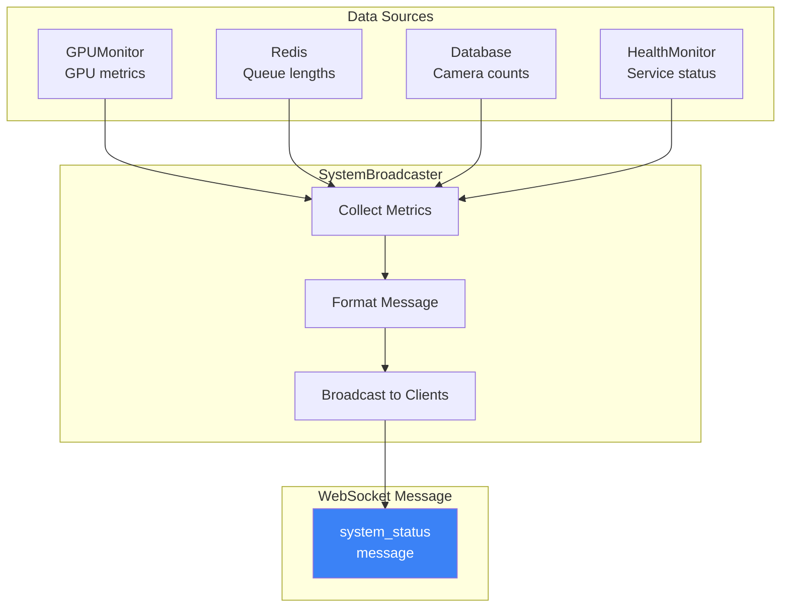

### Broadcast Interval

System status updates are sent every 5 seconds (configurable):

```python
class SystemBroadcaster:
    """Broadcasts comprehensive system status updates."""

    def __init__(
        self,
        redis_client: RedisClient,
        broadcast_interval: float = 5.0,
    ):
        self._redis = redis_client
        self._interval = broadcast_interval
        # ...
```

### Circuit Breaker Integration

The SystemBroadcaster integrates with a [WebSocketCircuitBreaker](../../backend/core/websocket_circuit_breaker.py) to protect against cascading failures when the Redis pub/sub connection becomes unreliable.

#### Circuit Breaker States

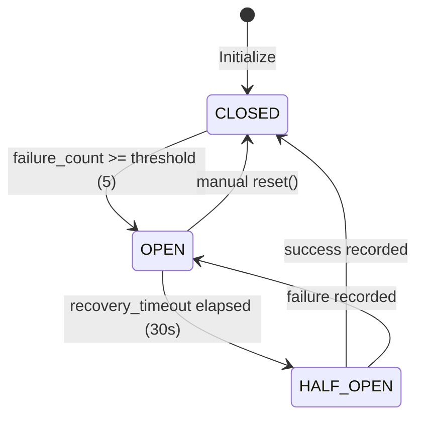

| State         | Description                                                                   |
| ------------- | ----------------------------------------------------------------------------- |
| **CLOSED**    | Normal operation. Redis pub/sub listener is active and broadcasting normally. |
| **OPEN**      | Too many failures. Recovery blocked to allow system stabilization.            |
| **HALF_OPEN** | Testing recovery after timeout. Limited operations allowed.                   |

#### Circuit Breaker Configuration

The SystemBroadcaster's circuit breaker uses these default settings:

| Parameter             | Value | Description                                    |
| --------------------- | ----- | ---------------------------------------------- |
| `failure_threshold`   | 5     | Consecutive failures before opening circuit    |
| `recovery_timeout`    | 30.0s | Time to wait before attempting recovery        |
| `half_open_max_calls` | 1     | Maximum calls allowed while testing recovery   |
| `success_threshold`   | 1     | Successes needed in half-open to close circuit |

#### Accessing Circuit Breaker State

```python
from backend.services.system_broadcaster import get_system_broadcaster

broadcaster = get_system_broadcaster()

# Get current circuit breaker state
state = broadcaster.get_circuit_state()  # Returns WebSocketCircuitState enum

# Access circuit breaker directly for detailed metrics
cb = broadcaster.circuit_breaker
status = cb.get_status()  # Returns dict with state, counters, config
```

### Degraded Mode

The SystemBroadcaster enters **degraded mode** when it cannot reliably broadcast real-time updates to clients. This is a graceful degradation strategy that maintains service availability even when the Redis pub/sub backbone is unavailable.

#### When Degraded Mode is Activated

Degraded mode (`is_degraded() returns True`) is activated when ANY of these conditions occur:

1. **Circuit breaker opens**: The pub/sub listener circuit breaker transitions to OPEN state after recording `failure_threshold` (default: 5) consecutive failures.

2. **Recovery attempts exhausted**: The broadcaster has attempted `MAX_RECOVERY_ATTEMPTS` (default: 5) reconnection attempts without success.

3. **Pub/sub connection fails to re-establish**: After a connection reset, if the new subscription cannot be created.

```python
# Check if broadcaster is in degraded mode
from backend.services.system_broadcaster import get_system_broadcaster

broadcaster = get_system_broadcaster()
if broadcaster.is_degraded():
    # Real-time updates may be delayed or unavailable
    # Consider showing a warning to users
    pass
```

#### Behavior in Degraded Mode

When degraded mode is active:

| Capability                   | Status                                                  |
| ---------------------------- | ------------------------------------------------------- |
| **WebSocket connections**    | Still accepted - clients can connect                    |
| **Local client updates**     | Working - direct sends still occur                      |
| **Redis pub/sub listener**   | Stopped - no cross-instance synchronization             |
| **Multi-instance sync**      | Unavailable - instances operate independently           |
| **System status collection** | Working - metrics still gathered from DB/Redis          |
| **Performance collection**   | Working - PerformanceCollector continues gathering data |

#### Degraded State Notification

When entering degraded mode, the broadcaster sends a `service_status` message to all connected clients:

```json
{
  "type": "service_status",
  "data": {
    "service": "system_broadcaster",
    "status": "degraded",
    "message": "System status broadcasting is degraded. Updates may be delayed or unavailable.",
    "circuit_state": "open"
  }
}
```

Frontend applications can listen for this message to show appropriate warnings to users.

#### Recovery from Degraded Mode

The broadcaster automatically recovers from degraded mode when:

1. The circuit breaker transitions from OPEN to HALF_OPEN (after `recovery_timeout`)
2. A successful pub/sub reconnection occurs
3. The circuit breaker transitions to CLOSED

```python
# Manual recovery (restart pub/sub listener)
# This is typically done by restarting the broadcaster
from backend.services.system_broadcaster import stop_system_broadcaster, get_system_broadcaster_async

await stop_system_broadcaster()
broadcaster = await get_system_broadcaster_async(redis_client=redis)
# Degraded mode is automatically cleared on successful start
```

#### Degraded Mode Flow

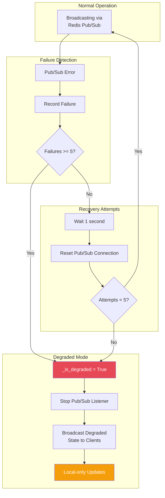

### Performance Broadcasting

The SystemBroadcaster can broadcast detailed performance metrics through its `broadcast_performance()` method. This requires a [PerformanceCollector](../../backend/services/performance_collector.py) to be configured.

#### Enabling Performance Broadcasting

```python
from backend.services.system_broadcaster import get_system_broadcaster
from backend.services.performance_collector import PerformanceCollector

# Get or create the broadcaster
broadcaster = get_system_broadcaster()

# Create and configure the performance collector
collector = PerformanceCollector(redis_client=redis, db_session_factory=get_session)

# Enable performance broadcasting
broadcaster.set_performance_collector(collector)
```

#### Performance Broadcast Flow

When enabled, performance metrics are automatically broadcast in the same loop as system status updates:

```python
async def _broadcast_loop(self, interval: float) -> None:
    while self._running:
        if self.connections:
            # Broadcast system status
            status_data = await self._get_system_status()
            await self.broadcast_status(status_data)

            # Also broadcast detailed performance metrics
            await self.broadcast_performance()

        await asyncio.sleep(interval)
```

#### Redis Channels

The SystemBroadcaster uses two Redis pub/sub channels:

| Channel              | Message Type         | Purpose                                      |
| -------------------- | -------------------- | -------------------------------------------- |
| `system_status`      | `system_status`      | Basic health information (GPU, cameras, etc) |
| `performance_update` | `performance_update` | Detailed performance metrics                 |

Both channels support multi-instance deployments where any backend can publish and all instances forward to their local WebSocket clients.

---

## Message Formats

### Event Message

Sent when a security event is created:

```json
{
  "type": "event",
  "data": {
    "id": 123,
    "event_id": 123,
    "batch_id": "abc123def456",
    "camera_id": "front_door",
    "risk_score": 75,
    "risk_level": "high",
    "summary": "Person detected near entrance at unusual hour",
    "started_at": "2024-01-15T02:30:00.000000",
    "ended_at": "2024-01-15T02:31:30.000000"
  }
}
```

### System Status Message

Sent periodically with system health:

```json
{
  "type": "system_status",
  "data": {
    "gpu": {
      "name": "NVIDIA RTX A5500",
      "utilization": 45.2,
      "memory_used": 7168,
      "memory_total": 24576,
      "temperature": 65.0,
      "power_usage": 125.5
    },
    "queues": {
      "detection_queue": 3,
      "analysis_queue": 1,
      "dlq_total": 0
    },
    "cameras": {
      "total": 4,
      "online": 4,
      "offline": 0
    },
    "services": {
      "yolo26": "healthy",
      "nemotron": "healthy",
      "redis": "healthy"
    }
  },
  "timestamp": "2024-01-15T10:30:00.000000"
}
```

### Service Status Message

Sent when service health changes:

```json
{
  "type": "service_status",
  "data": {
    "service": "yolo26",
    "status": "unhealthy",
    "message": "Health check failed"
  },
  "timestamp": "2024-01-15T10:30:00.000000"
}
```

### Performance Update Message

Sent periodically (every 5 seconds) with detailed system performance metrics. This message provides comprehensive monitoring data for the AI Performance dashboard.

**Message Type:** `performance_update`

**Source:** [SystemBroadcaster](../../backend/services/system_broadcaster.py) via [PerformanceCollector](../../backend/services/performance_collector.py)

**Redis Channel:** `performance_update`

**Trigger:** Broadcast loop (every 5 seconds when clients are connected)

**Frontend Consumer:** [usePerformanceMetrics](../../frontend/src/hooks/usePerformanceMetrics.ts) hook

#### Message Structure

```json
{
  "type": "performance_update",
  "data": {
    "timestamp": "2024-01-15T10:30:00.000000",
    "gpu": { ... },
    "ai_models": { ... },
    "nemotron": { ... },
    "inference": { ... },
    "databases": { ... },
    "host": { ... },
    "containers": [ ... ],
    "alerts": [ ... ]
  }
}
```

#### Field Descriptions

| Field        | Type            | Description                                                           |
| ------------ | --------------- | --------------------------------------------------------------------- |
| `timestamp`  | ISO 8601 string | When this update was generated (UTC)                                  |
| `gpu`        | object \| null  | GPU metrics from pynvml or AI container health endpoints              |
| `ai_models`  | object          | Dictionary of AI model metrics keyed by model name (yolo26, nemotron) |
| `nemotron`   | object \| null  | Nemotron LLM-specific metrics (slots, context size)                   |
| `inference`  | object \| null  | AI inference latency percentiles and throughput                       |
| `databases`  | object          | Dictionary of database metrics keyed by name (postgresql, redis)      |
| `host`       | object \| null  | Host system metrics from psutil (CPU, RAM, disk)                      |
| `containers` | array           | Health status of all monitored containers                             |
| `alerts`     | array           | Active performance alerts when thresholds are exceeded                |

#### GPU Metrics (`gpu`)

```json
{
  "name": "NVIDIA RTX A5500",
  "utilization": 38.0,
  "vram_used_gb": 22.7,
  "vram_total_gb": 24.0,
  "temperature": 38,
  "power_watts": 31
}
```

| Field           | Type   | Description                        |
| --------------- | ------ | ---------------------------------- |
| `name`          | string | GPU device name                    |
| `utilization`   | float  | GPU utilization percentage (0-100) |
| `vram_used_gb`  | float  | VRAM used in GB                    |
| `vram_total_gb` | float  | Total VRAM in GB                   |
| `temperature`   | int    | GPU temperature in Celsius         |
| `power_watts`   | int    | GPU power usage in Watts           |

#### AI Models (`ai_models`)

Dictionary containing metrics for each AI model:

**YOLO26 (`yolo26`):**

```json
{
  "status": "healthy",
  "vram_gb": 0.17,
  "model": "yolo26_r50vd_coco_o365",
  "device": "cuda:0"
}
```

| Field     | Type   | Description                                          |
| --------- | ------ | ---------------------------------------------------- |
| `status`  | string | Health status: "healthy", "unhealthy", "unreachable" |
| `vram_gb` | float  | VRAM used by the model in GB                         |
| `model`   | string | Model name/variant                                   |
| `device`  | string | CUDA device (e.g., "cuda:0")                         |

#### Nemotron Metrics (`nemotron`)

```json
{
  "status": "healthy",
  "slots_active": 1,
  "slots_total": 2,
  "context_size": 4096
}
```

| Field          | Type   | Description                                          |
| -------------- | ------ | ---------------------------------------------------- |
| `status`       | string | Health status: "healthy", "unhealthy", "unreachable" |
| `slots_active` | int    | Number of active inference slots                     |
| `slots_total`  | int    | Total available inference slots                      |
| `context_size` | int    | Context window size in tokens                        |

#### Inference Metrics (`inference`)

```json
{
  "yolo26_latency_ms": { "avg": 45, "p95": 82, "p99": 120 },
  "nemotron_latency_ms": { "avg": 2100, "p95": 4800, "p99": 8200 },
  "pipeline_latency_ms": { "avg": 3200, "p95": 6100 },
  "throughput": { "images_per_min": 12.4, "events_per_min": 2.1 },
  "queues": { "detection": 0, "analysis": 0 }
}
```

| Field                 | Type   | Description                                       |
| --------------------- | ------ | ------------------------------------------------- |
| `yolo26_latency_ms`   | object | YOLO26 latency stats (avg, p95, p99 in ms)        |
| `nemotron_latency_ms` | object | Nemotron latency stats (avg, p95, p99 in ms)      |
| `pipeline_latency_ms` | object | Full pipeline latency stats (avg, p95 in ms)      |
| `throughput`          | object | Processing rates (images_per_min, events_per_min) |
| `queues`              | object | Queue depths (detection, analysis)                |

#### Database Metrics (`databases`)

**PostgreSQL:**

```json
{
  "status": "healthy",
  "connections_active": 5,
  "connections_max": 30,
  "cache_hit_ratio": 98.2,
  "transactions_per_min": 1200
}
```

**Redis:**

```json
{
  "status": "healthy",
  "connected_clients": 8,
  "memory_mb": 1.5,
  "hit_ratio": 99.5,
  "blocked_clients": 0
}
```

#### Host Metrics (`host`)

```json
{
  "cpu_percent": 12.0,
  "ram_used_gb": 8.2,
  "ram_total_gb": 32.0,
  "disk_used_gb": 156.0,
  "disk_total_gb": 500.0
}
```

| Field           | Type  | Description                        |
| --------------- | ----- | ---------------------------------- |
| `cpu_percent`   | float | CPU utilization percentage (0-100) |
| `ram_used_gb`   | float | RAM used in GB                     |
| `ram_total_gb`  | float | Total RAM in GB                    |
| `disk_used_gb`  | float | Disk used in GB                    |
| `disk_total_gb` | float | Total disk in GB                   |

#### Container Metrics (`containers`)

Array of container health statuses:

```json
[
  { "name": "backend", "status": "running", "health": "healthy" },
  { "name": "frontend", "status": "running", "health": "healthy" },
  { "name": "postgres", "status": "running", "health": "healthy" },
  { "name": "redis", "status": "running", "health": "healthy" },
  { "name": "ai-yolo26", "status": "running", "health": "healthy" },
  { "name": "ai-llm", "status": "running", "health": "healthy" }
]
```

| Field    | Type   | Description                                                      |
| -------- | ------ | ---------------------------------------------------------------- |
| `name`   | string | Container name                                                   |
| `status` | string | Container status ("running", "stopped", "restarting", "unknown") |
| `health` | string | Health status ("healthy", "unhealthy", "starting")               |

#### Performance Alerts (`alerts`)

Array of alerts when metrics exceed configured thresholds:

```json
[
  {
    "severity": "warning",
    "metric": "gpu_temperature",
    "value": 82,
    "threshold": 80,
    "message": "GPU temperature high: 82C"
  }
]
```

| Field       | Type   | Description                             |
| ----------- | ------ | --------------------------------------- |
| `severity`  | string | Alert severity: "warning" or "critical" |
| `metric`    | string | Metric name that triggered the alert    |
| `value`     | float  | Current metric value                    |
| `threshold` | float  | Threshold that was exceeded             |
| `message`   | string | Human-readable alert message            |

**Alert Thresholds:**

| Metric            | Warning | Critical |
| ----------------- | ------- | -------- |
| `gpu_temperature` | 75C     | 85C      |
| `gpu_utilization` | 90%     | 98%      |
| `gpu_vram`        | 90%     | 95%      |
| `host_cpu`        | 80%     | 95%      |
| `host_ram`        | 85%     | 95%      |
| `host_disk`       | 80%     | 90%      |
| `pg_cache_hit`    | <90%    | <80%     |
| `redis_hit_ratio` | <50%    | <10%     |

#### Complete Example

```json
{
  "type": "performance_update",
  "data": {
    "timestamp": "2024-01-15T10:30:00.000000",
    "gpu": {
      "name": "NVIDIA RTX A5500",
      "utilization": 38.0,
      "vram_used_gb": 22.7,
      "vram_total_gb": 24.0,
      "temperature": 38,
      "power_watts": 31
    },
    "ai_models": {
      "yolo26": {
        "status": "healthy",
        "vram_gb": 0.17,
        "model": "yolo26_r50vd_coco_o365",
        "device": "cuda:0"
      },
      "nemotron": {
        "status": "healthy",
        "slots_active": 1,
        "slots_total": 2,
        "context_size": 4096
      }
    },
    "nemotron": {
      "status": "healthy",
      "slots_active": 1,
      "slots_total": 2,
      "context_size": 4096
    },
    "inference": {
      "yolo26_latency_ms": { "avg": 45, "p95": 82, "p99": 120 },
      "nemotron_latency_ms": { "avg": 2100, "p95": 4800, "p99": 8200 },
      "pipeline_latency_ms": { "avg": 3200, "p95": 6100 },
      "throughput": { "images_per_min": 12.4, "events_per_min": 2.1 },
      "queues": { "detection": 0, "analysis": 0 }
    },
    "databases": {
      "postgresql": {
        "status": "healthy",
        "connections_active": 5,
        "connections_max": 30,
        "cache_hit_ratio": 98.2,
        "transactions_per_min": 1200
      },
      "redis": {
        "status": "healthy",
        "connected_clients": 8,
        "memory_mb": 1.5,
        "hit_ratio": 99.5,
        "blocked_clients": 0
      }
    },
    "host": {
      "cpu_percent": 12.0,
      "ram_used_gb": 8.2,
      "ram_total_gb": 32.0,
      "disk_used_gb": 156.0,
      "disk_total_gb": 500.0
    },
    "containers": [
      { "name": "backend", "status": "running", "health": "healthy" },
      { "name": "frontend", "status": "running", "health": "healthy" },
      { "name": "postgres", "status": "running", "health": "healthy" },
      { "name": "redis", "status": "running", "health": "healthy" },
      { "name": "ai-yolo26", "status": "running", "health": "healthy" },
      { "name": "ai-llm", "status": "running", "health": "healthy" }
    ],
    "alerts": []
  }
}
```

### Message Type Summary

| Type                 | Source            | Trigger        | Content                                   |
| -------------------- | ----------------- | -------------- | ----------------------------------------- |
| `event`              | NemotronAnalyzer  | Event creation | Security event details                    |
| `system_status`      | SystemBroadcaster | Every 5s       | GPU, queues, cameras, health              |
| `service_status`     | HealthMonitor     | Status change  | Service name and status                   |
| `performance_update` | SystemBroadcaster | Every 5s       | Detailed GPU, AI, database, host metrics  |
| `log`                | JobLogEmitter     | Log emission   | Job log entry (timestamp, level, message) |

---

## Frontend Integration

### WebSocket Hooks

The frontend uses custom React hooks for WebSocket integration:

#### useWebSocket

Base hook for WebSocket connection management:

```typescript
// frontend/src/hooks/useWebSocket.ts
export function useWebSocket(url: string, options?: WebSocketOptions) {
  const [isConnected, setIsConnected] = useState(false);
  const [lastMessage, setLastMessage] = useState<WebSocketMessage | null>(null);

  useEffect(() => {
    const ws = new WebSocket(url);

    ws.onopen = () => setIsConnected(true);
    ws.onclose = () => setIsConnected(false);
    ws.onmessage = (event) => {
      const message = JSON.parse(event.data);
      setLastMessage(message);
    };

    return () => ws.close();
  }, [url]);

  return { isConnected, lastMessage };
}
```

#### useEventStream

Hook for security event stream:

```typescript
// frontend/src/hooks/useEventStream.ts
export function useEventStream() {
  const { isConnected, lastMessage } = useWebSocket('/ws/events');
  const [events, setEvents] = useState<Event[]>([]);

  useEffect(() => {
    if (lastMessage?.type === 'event') {
      setEvents((prev) => [lastMessage.data, ...prev].slice(0, 100));
    }
  }, [lastMessage]);

  return { isConnected, events };
}
```

#### useSystemStatus

Hook for system status updates:

```typescript
// frontend/src/hooks/useSystemStatus.ts
export function useSystemStatus() {
  const { isConnected, lastMessage } = useWebSocket('/ws/system');
  const [status, setStatus] = useState<SystemStatus | null>(null);

  useEffect(() => {
    if (lastMessage?.type === 'system_status') {
      setStatus(lastMessage.data);
    }
  }, [lastMessage]);

  return { isConnected, status };
}
```

### Frontend Architecture

```mermaid
flowchart TB
    subgraph Hooks["React Hooks Layer"]
        UWS[useWebSocket<br/>Base Hook]
        UES[useEventStream<br/>Events Hook]
        USS[useSystemStatus<br/>Status Hook]
    end

    subgraph Components["React Components"]
        DASH[DashboardPage]
        FEED[ActivityFeed]
        GAUGE[RiskGauge]
        GPU[GPUStats]
        HEALTH[HealthIndicators]
    end

    subgraph WebSocket["WebSocket Connections"]
        WS1[/ws/events]
        WS2[/ws/system]
    end

    UWS --> UES
    UWS --> USS

    UES --> WS1
    USS --> WS2

    DASH --> UES
    DASH --> USS

    UES --> FEED
    UES --> GAUGE
    USS --> GPU
    USS --> HEALTH

    style WS1 fill:#3B82F6,color:#fff
    style WS2 fill:#3B82F6,color:#fff
```

---

## Connection Management

### Lifecycle Management

```mermaid
flowchart TB
    subgraph Startup["Application Startup"]
        INIT[FastAPI Lifespan<br/>@asynccontextmanager]
        START[broadcaster.start()]
        SUB[Subscribe to Redis]
    end

    subgraph Runtime["Runtime"]
        CONN[Client Connects]
        REG[Register WebSocket]
        LISTEN[Listen for Messages]
        SEND[Send to Clients]
        DISC[Client Disconnects]
        UNREG[Unregister WebSocket]
    end

    subgraph Shutdown["Application Shutdown"]
        STOP[broadcaster.stop()]
        UNSUB[Unsubscribe from Redis]
        CLOSE[Close All WebSockets]
    end

    INIT --> START
    START --> SUB

    CONN --> REG
    REG --> LISTEN
    LISTEN --> SEND
    DISC --> UNREG

    STOP --> UNSUB
    UNSUB --> CLOSE
```

### Error Handling

The broadcaster handles disconnections gracefully:

```python
async def _send_to_all_clients(self, event_data: Any) -> None:
    """Send event data to all connected WebSocket clients."""
    if not self._connections:
        return

    message = event_data if isinstance(event_data, str) else json.dumps(event_data)

    disconnected = []
    for ws in self._connections:
        try:
            await ws.send_text(message)
        except Exception as e:
            logger.warning(f"Failed to send to WebSocket client: {e}")
            disconnected.append(ws)

    # Clean up disconnected clients
    for ws in disconnected:
        await self.disconnect(ws)
```

---

## Scaling Considerations

### Multi-Instance Deployment

Redis pub/sub enables horizontal scaling of backend instances:

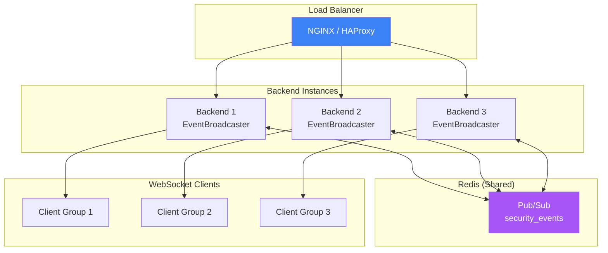

### Key Scaling Properties

| Property              | Behavior                                |
| --------------------- | --------------------------------------- |
| **Event delivery**    | All instances receive via pub/sub       |
| **Client affinity**   | WebSocket pinned to one instance        |
| **Message ordering**  | Per-channel FIFO guarantee              |
| **Failure isolation** | Instance crash only affects its clients |

### WebSocket Sticky Sessions

For WebSocket connections, load balancers must use sticky sessions:

```nginx
# NGINX configuration for WebSocket sticky sessions
upstream backend {
    ip_hash;  # Sticky sessions based on client IP
    server backend1:8000;
    server backend2:8000;
    server backend3:8000;
}

location /ws/ {
    proxy_pass http://backend;
    proxy_http_version 1.1;
    proxy_set_header Upgrade $http_upgrade;
    proxy_set_header Connection "upgrade";
    proxy_set_header Host $host;
}
```

---

## Image Generation Prompts

### Prompt: Real-Time Data Flow

**Dimensions:** 800x1200 (vertical 2:3)

```
Technical illustration of a real-time event distribution system,
showing WebSocket connections and Redis pub/sub architecture.

Visual elements:
- Top: Multiple camera icons generating events (represented as data pulses)
- Middle layer: Redis pub/sub hub as a central glowing node with branching channels
- Lower layer: Multiple backend instances receiving messages (server icons)
- Bottom: WebSocket connections fanning out to browser clients
- Data streams: Glowing green lines flowing from top to bottom

Visual style:
- Dark background #121212
- Primary data flow: NVIDIA green #76B900
- Redis/pub-sub: Purple #A855F7
- WebSocket connections: Blue #3B82F6
- Glowing effect on active connections
- Particle effects representing real-time messages

Style: Isometric technical diagram, data visualization aesthetic, vertical flow
No text overlays
```

### Prompt: WebSocket Connection Lifecycle

**Dimensions:** 800x1000 (vertical)

```
Technical illustration of WebSocket connection lifecycle,
showing connect, message flow, and disconnect phases.

Visual elements:
- Left side: Browser/client icon
- Center: WebSocket tunnel visualization (tube with flowing data)
- Right side: Server icon
- Three phases shown vertically:
  1. Connection handshake (green glow)
  2. Active communication (pulsing data particles)
  3. Graceful disconnect (fading connection)
- Status indicators for each phase

Color scheme:
- Dark background #121212
- Connected state: Green #76B900
- Data flow: Blue #3B82F6
- Disconnect: Red #E74856 fading to gray

Style: Modern technical diagram, connection visualization, vertical timeline
No text overlays
```

---

## Related Documentation

| Document                                                  | Purpose                          |
| --------------------------------------------------------- | -------------------------------- |
| [Overview](overview.md)                                   | High-level system architecture   |
| [AI Pipeline](ai-pipeline.md)                             | Detection and analysis flow      |
| [Resilience](resilience.md)                               | Error handling and recovery      |
| [API Reference - WebSocket](../developer/api/realtime.md) | WebSocket endpoint documentation |
| [Frontend Hooks](../../frontend/src/hooks/AGENTS.md)      | Custom hook implementation       |

---

_This document describes the real-time communication architecture for the Home Security Intelligence system. For implementation details, see the source files referenced in the frontmatter._
