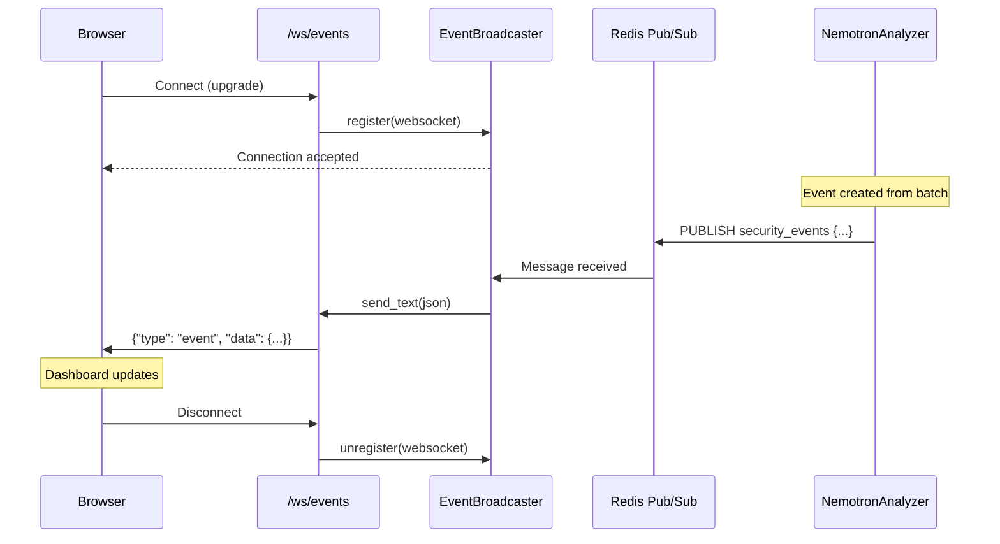
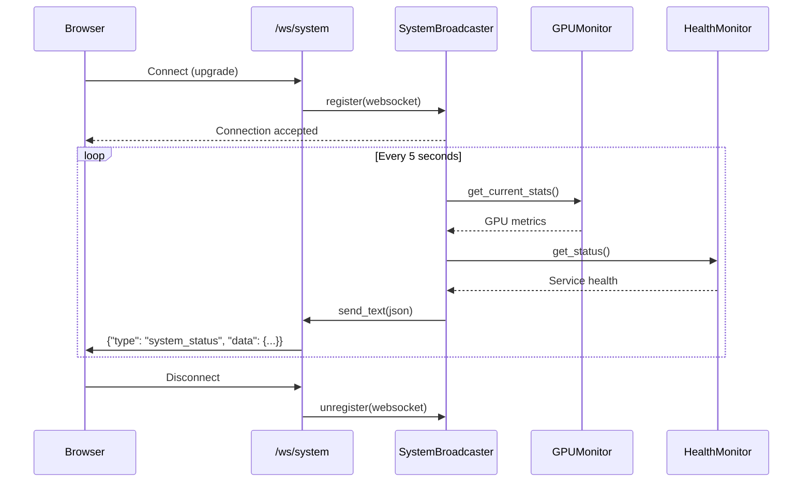
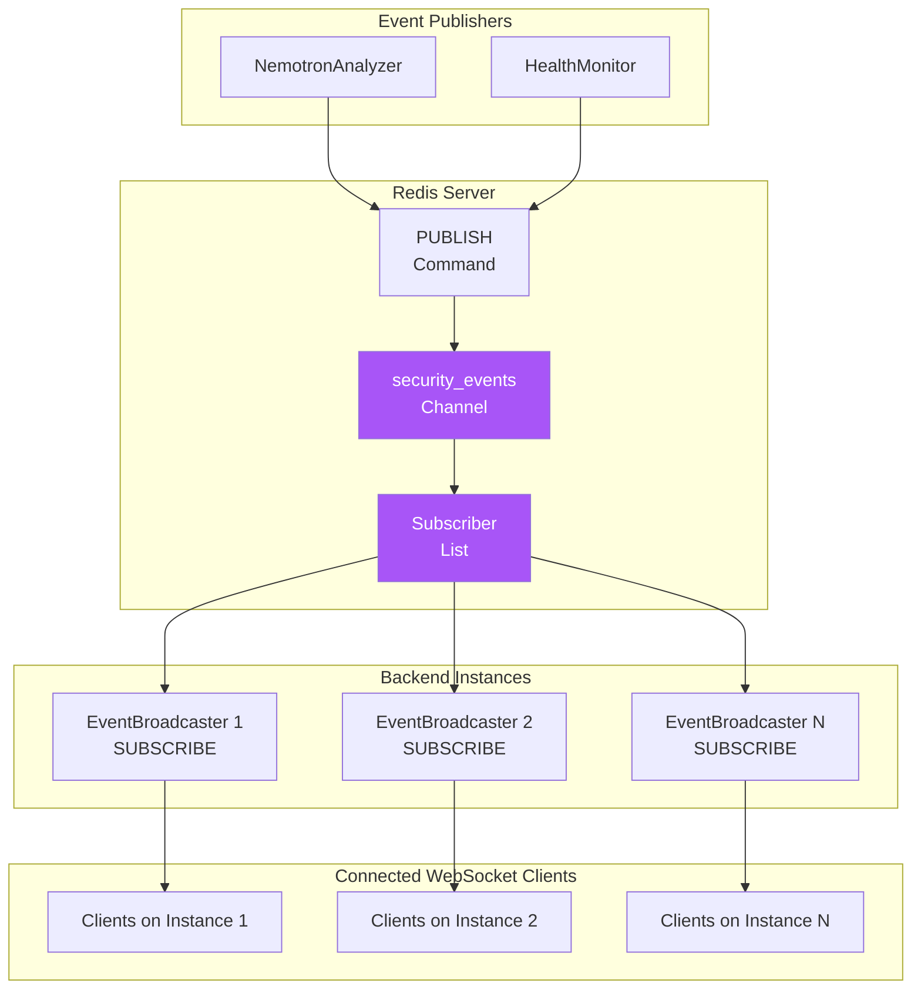
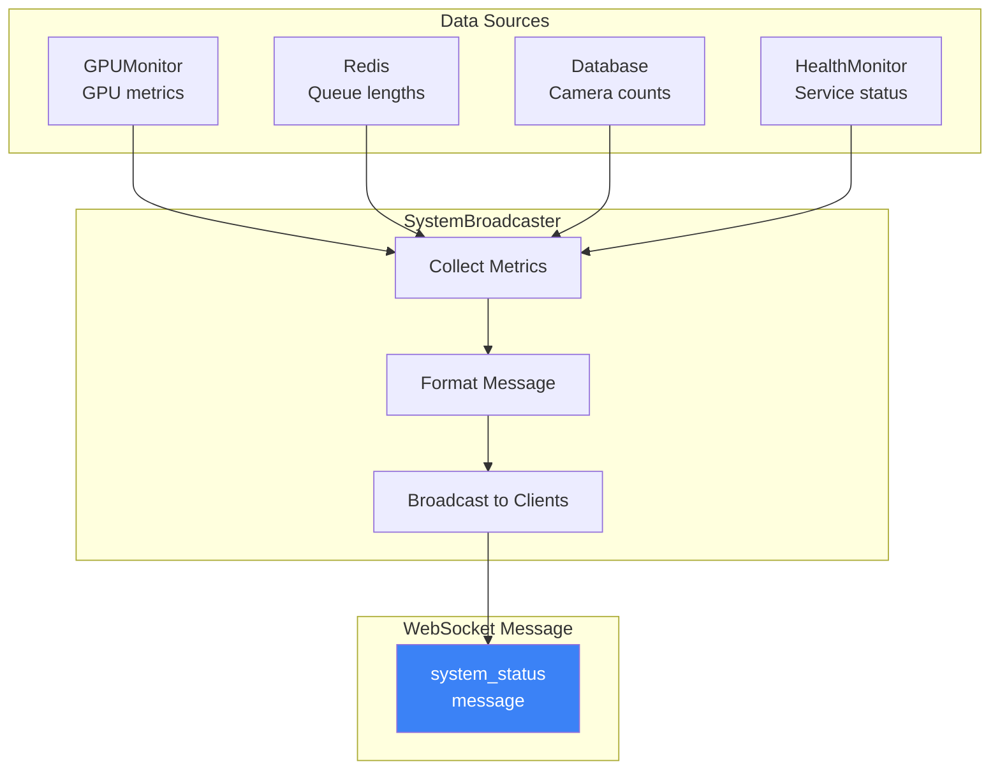
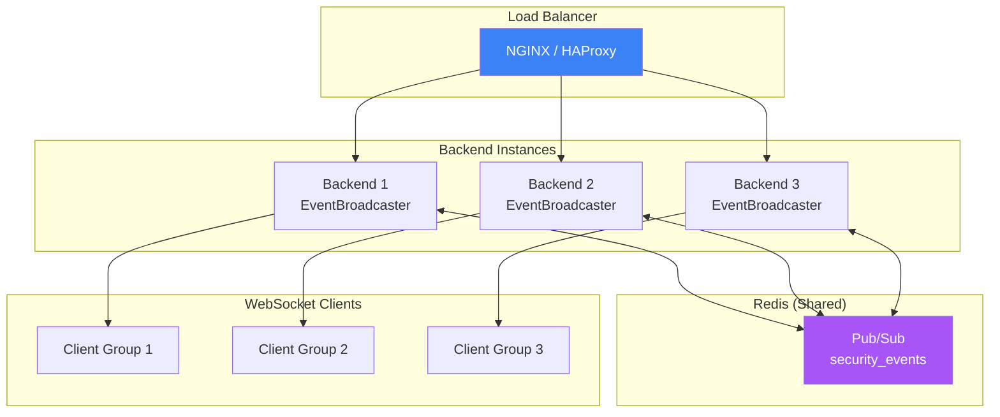

# Real-Time Architecture

This document details the real-time communication architecture of the Home Security Intelligence system, including WebSocket channels, Redis pub/sub backbone, event broadcasting patterns, and message formats.

---

## Table of Contents

1. [Real-Time Overview](#real-time-overview)
2. [WebSocket Channels](#websocket-channels)
3. [Redis Pub/Sub Backbone](#redis-pubsub-backbone)
4. [Event Broadcasting](#event-broadcasting)
5. [System Status Broadcasting](#system-status-broadcasting)
6. [Message Formats](#message-formats)
7. [Frontend Integration](#frontend-integration)
8. [Connection Management](#connection-management)
9. [Scaling Considerations](#scaling-considerations)
10. [Image Generation Prompts](#image-generation-prompts)

---

## Real-Time Overview

The real-time system enables instant dashboard updates without polling by using WebSocket connections backed by Redis pub/sub for multi-instance scalability.

### Architecture Diagram

```mermaid
flowchart TB
    subgraph Pipeline["AI Pipeline"]
        NA[NemotronAnalyzer<br/>Event Creation]
        GPU[GPUMonitor<br/>Stats Collection]
        HM[HealthMonitor<br/>Service Status]
    end

    subgraph Redis["Redis Pub/Sub"]
        CH1[security_events<br/>channel]
        CH2[system_status<br/>channel]
    end

    subgraph Backend["Backend Instances"]
        EB1[EventBroadcaster<br/>Instance 1]
        EB2[EventBroadcaster<br/>Instance 2]
        SB1[SystemBroadcaster<br/>Instance 1]
        SB2[SystemBroadcaster<br/>Instance 2]
    end

    subgraph WebSocket["WebSocket Endpoints"]
        WS1[/ws/events]
        WS2[/ws/system]
    end

    subgraph Clients["Dashboard Clients"]
        C1[Browser 1]
        C2[Browser 2]
        C3[Browser N]
    end

    NA -->|publish| CH1
    GPU -->|publish| CH2
    HM -->|publish| CH2

    CH1 -->|subscribe| EB1
    CH1 -->|subscribe| EB2
    CH2 -->|subscribe| SB1
    CH2 -->|subscribe| SB2

    EB1 & EB2 --> WS1
    SB1 & SB2 --> WS2

    WS1 --> C1 & C2 & C3
    WS2 --> C1 & C2 & C3

    style CH1 fill:#A855F7,color:#fff
    style CH2 fill:#A855F7,color:#fff
    style WS1 fill:#3B82F6,color:#fff
    style WS2 fill:#3B82F6,color:#fff
```

### Communication Patterns

| Pattern                   | Use Case               | Technology                     |
| ------------------------- | ---------------------- | ------------------------------ |
| **Push notifications**    | Security events        | WebSocket + Redis pub/sub      |
| **Status updates**        | GPU stats, health      | WebSocket + periodic broadcast |
| **Multi-instance sync**   | Load-balanced backends | Redis pub/sub                  |
| **Connection management** | Client tracking        | In-memory set per instance     |

---

## WebSocket Channels

The system exposes two WebSocket endpoints for real-time updates.

### Channel Overview

| Channel    | Endpoint     | Purpose                      | Message Frequency |
| ---------- | ------------ | ---------------------------- | ----------------- |
| **Events** | `/ws/events` | Security event notifications | On event creation |
| **System** | `/ws/system` | System health and GPU stats  | Every 5 seconds   |

### Events Channel (`/ws/events`)

Delivers real-time security event notifications as they are created by the AI pipeline.



### System Channel (`/ws/system`)

Delivers periodic system status updates including GPU statistics and service health.



---

## Redis Pub/Sub Backbone

Redis pub/sub enables real-time message distribution across multiple backend instances, ensuring all connected clients receive events regardless of which instance handles their WebSocket connection.

### Channel Configuration

The channel name is configured in settings and retrieved via the [get_event_channel](../../backend/services/event_broadcaster.py) function at line 27:

```python
# backend/services/event_broadcaster.py:27
def get_event_channel() -> str:
    """Get the Redis event channel name from settings.

    Returns:
        The configured Redis event channel name.
    """
    return get_settings().redis_event_channel
```

### Pub/Sub Flow



### Redis Message Format

Messages published to Redis include the full event envelope:

```json
{
  "type": "event",
  "data": {
    "id": 123,
    "event_id": 123,
    "batch_id": "abc123def456",
    "camera_id": "front_door",
    "risk_score": 75,
    "risk_level": "high",
    "summary": "Person detected near entrance",
    "started_at": "2024-01-15T10:30:00.000000"
  }
}
```

---

## Event Broadcasting

The [EventBroadcaster](../../backend/services/event_broadcaster.py) class at line 36 manages WebSocket connections and distributes events.

### EventBroadcaster Implementation

```python
# backend/services/event_broadcaster.py:36
class EventBroadcaster:
    """Manages WebSocket connections and broadcasts events via Redis pub/sub.

    This class acts as a bridge between Redis pub/sub events and WebSocket
    connections, allowing multiple backend instances to share event notifications.
    """

    def __init__(self, redis_client: RedisClient, channel_name: str | None = None):
        self._redis = redis_client
        self._channel_name = channel_name or get_settings().redis_event_channel
        self._connections: set[WebSocket] = set()
        self._pubsub: PubSub | None = None
        self._listener_task: asyncio.Task[None] | None = None
        self._is_listening = False
```

### Broadcasting Flow

```mermaid
flowchart TB
    subgraph Event["Event Creation"]
        NA[NemotronAnalyzer<br/>analyze_batch()]
    end

    subgraph Broadcast["EventBroadcaster"]
        GET[get_broadcaster()]
        PUB[broadcast_event()]
        REDIS[Redis PUBLISH]
    end

    subgraph Listen["Event Listener"]
        SUB[Redis SUBSCRIBE]
        LOOP[_listen_for_events()]
        SEND[_send_to_all_clients()]
    end

    subgraph Clients["WebSocket Connections"]
        WS1[WebSocket 1]
        WS2[WebSocket 2]
        WSN[WebSocket N]
    end

    NA --> GET
    GET --> PUB
    PUB --> REDIS

    REDIS -.->|Async| SUB
    SUB --> LOOP
    LOOP --> SEND
    SEND --> WS1 & WS2 & WSN

    style REDIS fill:#A855F7,color:#fff
```

### Connection Management

The broadcaster maintains a set of active connections:

```python
async def connect(self, websocket: WebSocket) -> None:
    """Register a new WebSocket connection."""
    await websocket.accept()
    self._connections.add(websocket)
    logger.info(f"WebSocket connected. Total connections: {len(self._connections)}")

async def disconnect(self, websocket: WebSocket) -> None:
    """Unregister a WebSocket connection."""
    self._connections.discard(websocket)
    with contextlib.suppress(Exception):
        await websocket.close()
    logger.info(f"WebSocket disconnected. Total connections: {len(self._connections)}")
```

### Global Broadcaster Instance

The [get_broadcaster](../../backend/services/event_broadcaster.py) function at line 263 provides a singleton instance:

```python
# backend/services/event_broadcaster.py:263
async def get_broadcaster(redis_client: RedisClient) -> EventBroadcaster:
    """Get or create the global event broadcaster instance.

    This function is thread-safe and handles concurrent initialization
    attempts using an async lock to prevent race conditions.
    """
    global _broadcaster

    if _broadcaster is not None:
        return _broadcaster

    lock = _get_broadcaster_lock()
    async with lock:
        if _broadcaster is None:
            broadcaster = EventBroadcaster(redis_client)
            await broadcaster.start()
            _broadcaster = broadcaster

    return _broadcaster
```

---

## System Status Broadcasting

The SystemBroadcaster periodically sends system status updates to all connected clients.

### Status Update Content



### Broadcast Interval

System status updates are sent every 5 seconds (configurable):

```python
class SystemBroadcaster:
    """Broadcasts comprehensive system status updates."""

    def __init__(
        self,
        redis_client: RedisClient,
        broadcast_interval: float = 5.0,
    ):
        self._redis = redis_client
        self._interval = broadcast_interval
        # ...
```

---

## Message Formats

### Event Message

Sent when a security event is created:

```json
{
  "type": "event",
  "data": {
    "id": 123,
    "event_id": 123,
    "batch_id": "abc123def456",
    "camera_id": "front_door",
    "risk_score": 75,
    "risk_level": "high",
    "summary": "Person detected near entrance at unusual hour",
    "started_at": "2024-01-15T02:30:00.000000",
    "ended_at": "2024-01-15T02:31:30.000000"
  }
}
```

### System Status Message

Sent periodically with system health:

```json
{
  "type": "system_status",
  "data": {
    "gpu": {
      "name": "NVIDIA RTX A5500",
      "utilization": 45.2,
      "memory_used": 7168,
      "memory_total": 24576,
      "temperature": 65.0,
      "power_usage": 125.5
    },
    "queues": {
      "detection_queue": 3,
      "analysis_queue": 1,
      "dlq_total": 0
    },
    "cameras": {
      "total": 4,
      "online": 4,
      "offline": 0
    },
    "services": {
      "rtdetr": "healthy",
      "nemotron": "healthy",
      "redis": "healthy"
    }
  },
  "timestamp": "2024-01-15T10:30:00.000000"
}
```

### Service Status Message

Sent when service health changes:

```json
{
  "type": "service_status",
  "data": {
    "service": "rtdetr",
    "status": "unhealthy",
    "message": "Health check failed"
  },
  "timestamp": "2024-01-15T10:30:00.000000"
}
```

### Message Type Summary

| Type             | Source            | Trigger        | Content                      |
| ---------------- | ----------------- | -------------- | ---------------------------- |
| `event`          | NemotronAnalyzer  | Event creation | Security event details       |
| `system_status`  | SystemBroadcaster | Every 5s       | GPU, queues, cameras, health |
| `service_status` | HealthMonitor     | Status change  | Service name and status      |

---

## Frontend Integration

### WebSocket Hooks

The frontend uses custom React hooks for WebSocket integration:

#### useWebSocket

Base hook for WebSocket connection management:

```typescript
// frontend/src/hooks/useWebSocket.ts
export function useWebSocket(url: string, options?: WebSocketOptions) {
  const [isConnected, setIsConnected] = useState(false);
  const [lastMessage, setLastMessage] = useState<WebSocketMessage | null>(null);

  useEffect(() => {
    const ws = new WebSocket(url);

    ws.onopen = () => setIsConnected(true);
    ws.onclose = () => setIsConnected(false);
    ws.onmessage = (event) => {
      const message = JSON.parse(event.data);
      setLastMessage(message);
    };

    return () => ws.close();
  }, [url]);

  return { isConnected, lastMessage };
}
```

#### useEventStream

Hook for security event stream:

```typescript
// frontend/src/hooks/useEventStream.ts
export function useEventStream() {
  const { isConnected, lastMessage } = useWebSocket("/ws/events");
  const [events, setEvents] = useState<Event[]>([]);

  useEffect(() => {
    if (lastMessage?.type === "event") {
      setEvents((prev) => [lastMessage.data, ...prev].slice(0, 100));
    }
  }, [lastMessage]);

  return { isConnected, events };
}
```

#### useSystemStatus

Hook for system status updates:

```typescript
// frontend/src/hooks/useSystemStatus.ts
export function useSystemStatus() {
  const { isConnected, lastMessage } = useWebSocket("/ws/system");
  const [status, setStatus] = useState<SystemStatus | null>(null);

  useEffect(() => {
    if (lastMessage?.type === "system_status") {
      setStatus(lastMessage.data);
    }
  }, [lastMessage]);

  return { isConnected, status };
}
```

### Frontend Architecture

```mermaid
flowchart TB
    subgraph Hooks["React Hooks Layer"]
        UWS[useWebSocket<br/>Base Hook]
        UES[useEventStream<br/>Events Hook]
        USS[useSystemStatus<br/>Status Hook]
    end

    subgraph Components["React Components"]
        DASH[DashboardPage]
        FEED[ActivityFeed]
        GAUGE[RiskGauge]
        GPU[GPUStats]
        HEALTH[HealthIndicators]
    end

    subgraph WebSocket["WebSocket Connections"]
        WS1[/ws/events]
        WS2[/ws/system]
    end

    UWS --> UES
    UWS --> USS

    UES --> WS1
    USS --> WS2

    DASH --> UES
    DASH --> USS

    UES --> FEED
    UES --> GAUGE
    USS --> GPU
    USS --> HEALTH

    style WS1 fill:#3B82F6,color:#fff
    style WS2 fill:#3B82F6,color:#fff
```

---

## Connection Management

### Lifecycle Management

```mermaid
flowchart TB
    subgraph Startup["Application Startup"]
        INIT[FastAPI Lifespan<br/>@asynccontextmanager]
        START[broadcaster.start()]
        SUB[Subscribe to Redis]
    end

    subgraph Runtime["Runtime"]
        CONN[Client Connects]
        REG[Register WebSocket]
        LISTEN[Listen for Messages]
        SEND[Send to Clients]
        DISC[Client Disconnects]
        UNREG[Unregister WebSocket]
    end

    subgraph Shutdown["Application Shutdown"]
        STOP[broadcaster.stop()]
        UNSUB[Unsubscribe from Redis]
        CLOSE[Close All WebSockets]
    end

    INIT --> START
    START --> SUB

    CONN --> REG
    REG --> LISTEN
    LISTEN --> SEND
    DISC --> UNREG

    STOP --> UNSUB
    UNSUB --> CLOSE
```

### Error Handling

The broadcaster handles disconnections gracefully:

```python
async def _send_to_all_clients(self, event_data: Any) -> None:
    """Send event data to all connected WebSocket clients."""
    if not self._connections:
        return

    message = event_data if isinstance(event_data, str) else json.dumps(event_data)

    disconnected = []
    for ws in self._connections:
        try:
            await ws.send_text(message)
        except Exception as e:
            logger.warning(f"Failed to send to WebSocket client: {e}")
            disconnected.append(ws)

    # Clean up disconnected clients
    for ws in disconnected:
        await self.disconnect(ws)
```

---

## Scaling Considerations

### Multi-Instance Deployment

Redis pub/sub enables horizontal scaling of backend instances:



### Key Scaling Properties

| Property              | Behavior                                |
| --------------------- | --------------------------------------- |
| **Event delivery**    | All instances receive via pub/sub       |
| **Client affinity**   | WebSocket pinned to one instance        |
| **Message ordering**  | Per-channel FIFO guarantee              |
| **Failure isolation** | Instance crash only affects its clients |

### WebSocket Sticky Sessions

For WebSocket connections, load balancers must use sticky sessions:

```nginx
# NGINX configuration for WebSocket sticky sessions
upstream backend {
    ip_hash;  # Sticky sessions based on client IP
    server backend1:8000;
    server backend2:8000;
    server backend3:8000;
}

location /ws/ {
    proxy_pass http://backend;
    proxy_http_version 1.1;
    proxy_set_header Upgrade $http_upgrade;
    proxy_set_header Connection "upgrade";
    proxy_set_header Host $host;
}
```

---

## Image Generation Prompts

### Prompt: Real-Time Data Flow

**Dimensions:** 800x1200 (vertical 2:3)

```
Technical illustration of a real-time event distribution system,
showing WebSocket connections and Redis pub/sub architecture.

Visual elements:
- Top: Multiple camera icons generating events (represented as data pulses)
- Middle layer: Redis pub/sub hub as a central glowing node with branching channels
- Lower layer: Multiple backend instances receiving messages (server icons)
- Bottom: WebSocket connections fanning out to browser clients
- Data streams: Glowing green lines flowing from top to bottom

Visual style:
- Dark background #121212
- Primary data flow: NVIDIA green #76B900
- Redis/pub-sub: Purple #A855F7
- WebSocket connections: Blue #3B82F6
- Glowing effect on active connections
- Particle effects representing real-time messages

Style: Isometric technical diagram, data visualization aesthetic, vertical flow
No text overlays
```

### Prompt: WebSocket Connection Lifecycle

**Dimensions:** 800x1000 (vertical)

```
Technical illustration of WebSocket connection lifecycle,
showing connect, message flow, and disconnect phases.

Visual elements:
- Left side: Browser/client icon
- Center: WebSocket tunnel visualization (tube with flowing data)
- Right side: Server icon
- Three phases shown vertically:
  1. Connection handshake (green glow)
  2. Active communication (pulsing data particles)
  3. Graceful disconnect (fading connection)
- Status indicators for each phase

Color scheme:
- Dark background #121212
- Connected state: Green #76B900
- Data flow: Blue #3B82F6
- Disconnect: Red #E74856 fading to gray

Style: Modern technical diagram, connection visualization, vertical timeline
No text overlays
```

---

## Related Documentation

| Document                                                   | Purpose                          |
| ---------------------------------------------------------- | -------------------------------- |
| [Overview](overview.md)                                    | High-level system architecture   |
| [AI Pipeline](ai-pipeline.md)                              | Detection and analysis flow      |
| [Resilience](resilience.md)                                | Error handling and recovery      |
| [API Reference - WebSocket](../api-reference/websocket.md) | WebSocket endpoint documentation |
| [Frontend Hooks](../../frontend/src/hooks/AGENTS.md)       | Custom hook implementation       |

---

_This document describes the real-time communication architecture for the Home Security Intelligence system. For implementation details, see the source files referenced in the frontmatter._
