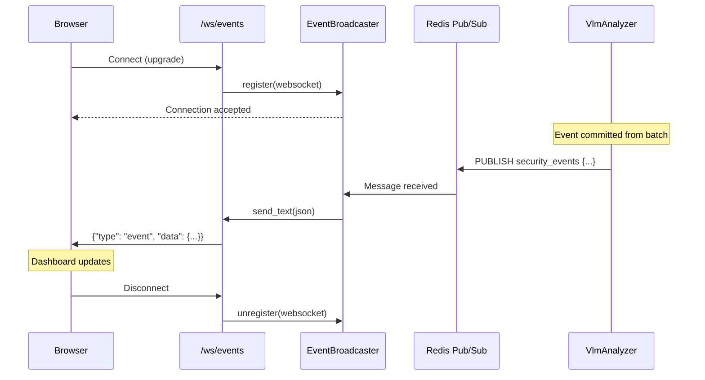
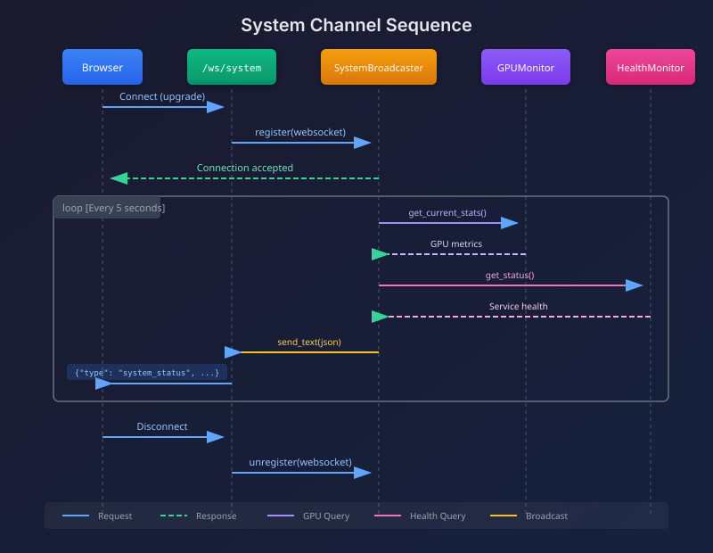
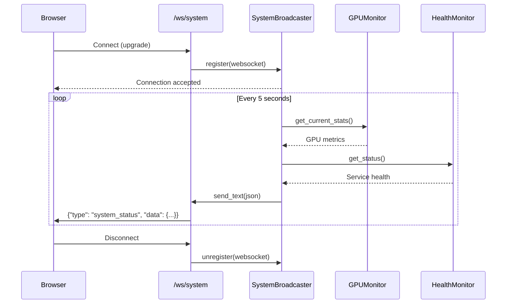
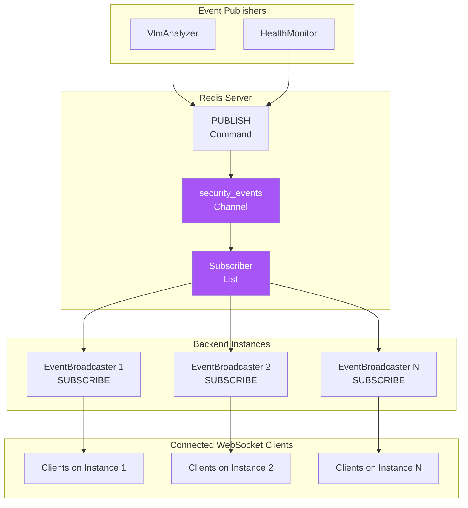
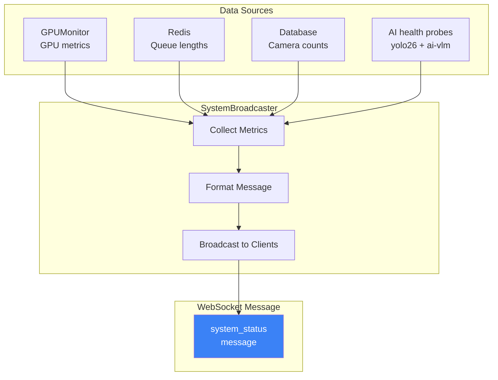
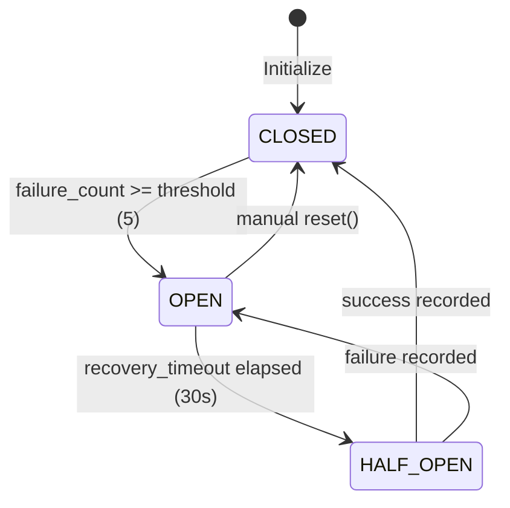
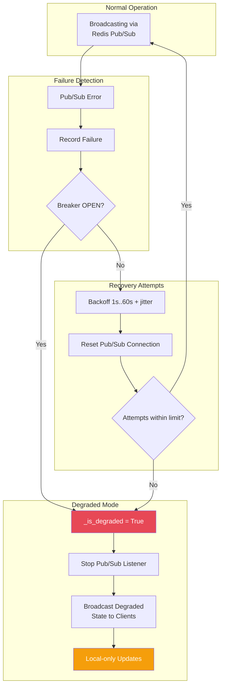
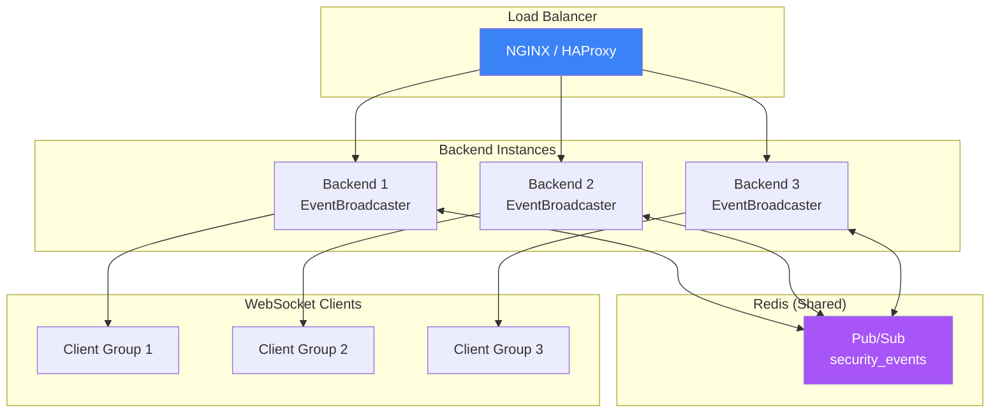

# Real-Time Architecture


_AI-generated visualization of WebSocket real-time architecture with Redis pub/sub hub and client connections._

This document details the real-time communication architecture of the Home Security Intelligence system, including WebSocket channels, Redis pub/sub backbone, event broadcasting patterns, and message formats.

---

## Table of Contents

1. [Real-Time Overview](#real-time-overview)
2. [WebSocket Channels](#websocket-channels)
3. [Redis Pub/Sub Backbone](#redis-pubsub-backbone)
4. [Event Broadcasting](#event-broadcasting)
5. [System Status Broadcasting](#system-status-broadcasting)
   - [SystemBroadcaster Features](#systembroadcaster-features)
   - [Circuit Breaker Integration](#circuit-breaker-integration)
   - [Degraded Mode](#degraded-mode)
   - [Performance Broadcasting](#performance-broadcasting)
6. [Message Formats](#message-formats)
7. [Frontend Integration](#frontend-integration)
8. [Connection Management](#connection-management)
9. [Scaling Considerations](#scaling-considerations)

---

## Real-Time Overview

The real-time system enables instant dashboard updates without polling by using WebSocket connections backed by Redis pub/sub for multi-instance scalability.

### Architecture Diagram


### Diagram: WebSocket Architecture

```mermaid
flowchart TB
    subgraph Pipeline["AI Pipeline"]
        NA[VlmAnalyzer<br/>Event Creation]
        GPU[GPUMonitor<br/>Stats Collection]
        HM[HealthMonitor<br/>Service Status]
    end

    subgraph Redis["Redis Pub/Sub"]
        CH1[security_events<br/>channel]
        CH2[system_status<br/>channel]
    end

    subgraph Backend["Backend Instances"]
        EB1[EventBroadcaster<br/>Instance 1]
        EB2[EventBroadcaster<br/>Instance 2]
        SB1[SystemBroadcaster<br/>Instance 1]
        SB2[SystemBroadcaster<br/>Instance 2]
    end

    subgraph WebSocket["WebSocket Endpoints"]
        WS1[/ws/events]
        WS2[/ws/system]
    end

    subgraph Clients["Dashboard Clients"]
        C1[Browser 1]
        C2[Browser 2]
        C3[Browser N]
    end

    NA -.->|publish| CH1
    GPU -.->|publish| CH2
    HM -.->|publish| CH2

    CH1 -.->|subscribe| EB1
    CH1 -.->|subscribe| EB2
    CH2 -.->|subscribe| SB1
    CH2 -.->|subscribe| SB2

    EB1 & EB2 --> WS1
    SB1 & SB2 --> WS2

    WS1 --> C1 & C2 & C3
    WS2 --> C1 & C2 & C3

    style CH1 fill:#A855F7,color:#fff
    style CH2 fill:#A855F7,color:#fff
    style WS1 fill:#3B82F6,color:#fff
    style WS2 fill:#3B82F6,color:#fff
```

### Communication Patterns

| Pattern                   | Use Case               | Technology                     |
| ------------------------- | ---------------------- | ------------------------------ |
| **Push notifications**    | Security events        | WebSocket + Redis pub/sub      |
| **Status updates**        | GPU stats, health      | WebSocket + periodic broadcast |
| **Multi-instance sync**   | Load-balanced backends | Redis pub/sub                  |
| **Connection management** | Client tracking        | In-memory set per instance     |

---

## WebSocket Channels

The system exposes four WebSocket endpoints for real-time updates, all defined in
`backend/api/routes/websocket.py`.

### Channel Overview

<!-- prettier-ignore-start -->
--8<-- "docs/_includes/websocket-channels.md"
<!-- prettier-ignore-end -->

### Events Channel (`/ws/events`)

Delivers real-time security event notifications as they are created by the AI pipeline.

### Diagram: Events Channel Sequence


```mermaid
sequenceDiagram
    participant Client as Browser
    participant WS as /ws/events
    participant EB as EventBroadcaster
    participant Redis as Redis Pub/Sub
    participant NA as VlmAnalyzer

    Client->>WS: Connect (upgrade)
    WS->>EB: register(websocket)
    EB-->>Client: Connection accepted

    Note over NA: Event committed from batch

    NA->>Redis: PUBLISH security_events {...}
    Redis->>EB: Message received
    EB->>WS: send_text(json)
    WS->>Client: {"type": "event", "data": {...}}

    Note over Client: Dashboard updates

    Client->>WS: Disconnect
    WS->>EB: unregister(websocket)
```

Broadcast is the last step of `VlmAnalyzer.analyze_batch()` and is best-effort: a failed
broadcast never un-does the committed event.

### System Channel (`/ws/system`)

Delivers periodic system status updates including GPU statistics and service health.



### Diagram: System Channel Sequence


```mermaid
sequenceDiagram
    participant Client as Browser
    participant WS as /ws/system
    participant SB as SystemBroadcaster
    participant GPU as GPUMonitor
    participant HM as HealthMonitor

    Client->>WS: Connect (upgrade)
    WS->>SB: register(websocket)
    SB-->>Client: Connection accepted

    loop Every 5 seconds
        SB->>GPU: get_current_stats()
        GPU-->>SB: GPU metrics
        SB->>HM: get_status()
        HM-->>SB: Service health

        SB->>WS: send_text(json)
        WS->>Client: {"type": "system_status", "data": {...}}
    end

    Client->>WS: Disconnect
    WS->>SB: unregister(websocket)
```

### Job Logs Channel (`/ws/jobs/{job_id}/logs`)

Streams real-time log entries for active jobs (pending or running status). This enables the Jobs page to display live log output as background tasks execute.

**Authentication:**

- Query parameter: `ws://host/ws/jobs/{job_id}/logs?api_key=YOUR_KEY`
- Sec-WebSocket-Protocol header: `"api-key.YOUR_KEY"`
- Token parameter: `ws://host/ws/jobs/{job_id}/logs?token=YOUR_TOKEN`

**Message Format:**

```json
{
  "type": "log",
  "data": {
    "timestamp": "2026-01-17T10:32:05Z",
    "level": "INFO",
    "message": "Processing batch 2/3",
    "context": { "batch_id": "abc123" }
  }
}
```

**Behavior:**

- Subscribes to Redis pub/sub channel `job:{job_id}:logs`
- Logs are forwarded to the WebSocket as they are emitted by the job (`backend/services/job_log_emitter.py`)
- Connection closes when the client disconnects or the idle timeout is reached
- Server sends periodic heartbeat pings to detect disconnected clients

**Source:** `backend/api/routes/websocket.py` - `websocket_job_logs` endpoint

---

## Redis Pub/Sub Backbone

Redis pub/sub enables real-time message distribution across multiple backend instances, ensuring all connected clients receive events regardless of which instance handles their WebSocket connection.

### Channel Configuration

The event channel name comes from settings — `backend/core/config.py` ships
`redis_event_channel` with the default `security_events`, and
`backend/services/event_broadcaster.py:340` reads it:

```python
# backend/services/event_broadcaster.py:340
def get_event_channel() -> str:
    """Get the Redis event channel name from settings.

    Returns:
        The configured Redis event channel name.
    """
    return get_settings().redis_event_channel
```

### Diagram: Redis Pub/Sub Flow


```mermaid
flowchart TB
    subgraph Publishers["Event Publishers"]
        P1[VlmAnalyzer]
        P2[HealthMonitor]
    end

    subgraph Redis["Redis Server"]
        PUB[PUBLISH<br/>Command]
        CH[security_events<br/>Channel]
        SUB[Subscriber<br/>List]
    end

    subgraph Subscribers["Backend Instances"]
        S1[EventBroadcaster 1<br/>SUBSCRIBE]
        S2[EventBroadcaster 2<br/>SUBSCRIBE]
        S3[EventBroadcaster N<br/>SUBSCRIBE]
    end

    subgraph Clients["Connected WebSocket Clients"]
        C1[Clients on Instance 1]
        C2[Clients on Instance 2]
        C3[Clients on Instance N]
    end

    P1 & P2 --> PUB
    PUB --> CH
    CH --> SUB
    SUB --> S1 & S2 & S3

    S1 --> C1
    S2 --> C2
    S3 --> C3

    style CH fill:#A855F7,color:#fff
    style SUB fill:#A855F7,color:#fff
```

### Redis Message Format

Messages published to Redis include the event envelope plus the verification object the REST API
returns for the same event:

```json
{
  "type": "event",
  "data": {
    "id": 123,
    "event_id": 123,
    "batch_id": "abc123def456",
    "camera_id": "front_door",
    "risk_score": 75,
    "risk_level": "high",
    "summary": "Person detected near entrance",
    "started_at": "2026-10-02T10:30:00.000000"
  }
}
```

---

## Event Broadcasting

`EventBroadcaster` (`backend/services/event_broadcaster.py:349`) manages WebSocket connections and distributes events.

### EventBroadcaster Implementation

```python
# backend/services/event_broadcaster.py:385
def __init__(self, redis_client: RedisClient, channel_name: str | None = None):
    self._redis = redis_client
    self._channel_name = channel_name or get_settings().redis_event_channel
    self._connections: set[WebSocket] = set()
    self._pubsub: PubSub | None = None
    self._listener_task: asyncio.Task[None] | None = None
    self._supervisor_task: asyncio.Task[None] | None = None
    self._is_listening = False
```

### Broadcasting Flow

```mermaid
flowchart TB
    subgraph Event["Event Creation"]
        NA[VlmAnalyzer<br/>analyze_batch()]
    end

    subgraph Broadcast["EventBroadcaster"]
        GET[get_broadcaster()]
        PUB[broadcast_event()]
        REDIS[Redis PUBLISH]
    end

    subgraph Listen["Event Listener"]
        SUB[Redis SUBSCRIBE]
        LOOP[_listen_for_events()]
        SEND[_send_to_all_clients()]
    end

    subgraph Clients["WebSocket Connections"]
        WS1[WebSocket 1]
        WS2[WebSocket 2]
        WSN[WebSocket N]
    end

    NA --> GET
    GET --> PUB
    PUB --> REDIS

    REDIS -.->|Async| SUB
    SUB --> LOOP
    LOOP --> SEND
    SEND --> WS1 & WS2 & WSN

    style REDIS fill:#A855F7,color:#fff
```

### Connection Management

The broadcaster maintains a set of active connections (`connect` at
`backend/services/event_broadcaster.py:731`, `disconnect` at `:753`).

### Global Broadcaster Instance

The singleton accessor at `backend/services/event_broadcaster.py:2392` guards initialization with
an async lock so concurrent callers share one instance:

```python
# backend/services/event_broadcaster.py:2392
async def get_broadcaster(redis_client: RedisClient) -> EventBroadcaster:
    """Get or create the global event broadcaster instance.

    This function is thread-safe and handles concurrent initialization
    attempts using an async lock to prevent race conditions.
    """
    global _broadcaster  # noqa: PLW0603

    if _broadcaster is not None:
        return _broadcaster

    lock = _get_broadcaster_lock()
    async with lock:
        if _broadcaster is None:
            broadcaster = EventBroadcaster(redis_client)
            await broadcaster.start()
            _broadcaster = broadcaster

    return _broadcaster
```

---

## System Status Broadcasting

`SystemBroadcaster` (`backend/services/system_broadcaster.py:68`) periodically sends system status
updates to all connected clients. It provides real-time system health information including GPU
statistics, camera counts, queue depths, and AI service health.

### SystemBroadcaster Features

| Feature                      | Description                                                                        |
| ---------------------------- | ---------------------------------------------------------------------------------- |
| **Periodic broadcasting**    | Sends `system_status` messages every 5 seconds (configurable)                      |
| **Performance broadcasting** | Sends `performance_update` messages with detailed metrics via PerformanceCollector |
| **Circuit breaker**          | Protects against cascading failures with automatic recovery                        |
| **Degraded mode**            | Gracefully handles failures when Redis pub/sub is unavailable                      |
| **Multi-instance support**   | Uses Redis pub/sub to synchronize status across multiple backend instances         |
| **Local-first delivery**     | Always sends to local clients first, then publishes to Redis for remote instances  |

### Status Update Content


```mermaid
flowchart TB
    subgraph Sources["Data Sources"]
        GPU[GPUMonitor<br/>GPU metrics]
        REDIS[Redis<br/>Queue lengths]
        DB[Database<br/>Camera counts]
        HEALTH[AI health probes<br/>yolo26 + ai-vlm]
    end

    subgraph Aggregator["SystemBroadcaster"]
        COLLECT[Collect Metrics]
        FORMAT[Format Message]
        SEND[Broadcast to Clients]
    end

    subgraph Output["WebSocket Message"]
        MSG[system_status<br/>message]
    end

    GPU --> COLLECT
    REDIS --> COLLECT
    DB --> COLLECT
    HEALTH --> COLLECT

    COLLECT --> FORMAT
    FORMAT --> SEND
    SEND --> MSG

    style MSG fill:#3B82F6,color:#fff
```

`_check_ai_health()` (`backend/services/system_broadcaster.py:1010`) probes the two shipped AI
services concurrently — the YOLO26 detector and the verdict engine at `settings.ai_vlm_url` — with
a short timeout so the broadcast loop never blocks. The result is folded into the `ai` block of the
status payload, whose per-service keys are `yolo26` and `ai-vlm`.

### Broadcast Interval

System status updates are sent every 5 seconds (`broadcast_interval` defaults to `5.0` on the
`SystemBroadcaster` constructor).

### Circuit Breaker Integration

The SystemBroadcaster integrates with a `WebSocketCircuitBreaker`
(`backend/core/websocket_circuit_breaker.py:96`) to protect against cascading failures when the
Redis pub/sub connection becomes unreliable.

#### Circuit Breaker States


```mermaid
stateDiagram-v2
    [*] --> CLOSED: Initialize
    CLOSED --> OPEN: failure_count >= threshold (5)
    OPEN --> HALF_OPEN: recovery_timeout elapsed (30s)
    HALF_OPEN --> CLOSED: success recorded
    HALF_OPEN --> OPEN: failure recorded
    OPEN --> CLOSED: manual reset()
```

| State         | Description                                                                   |
| ------------- | ----------------------------------------------------------------------------- |
| **CLOSED**    | Normal operation. Redis pub/sub listener is active and broadcasting normally. |
| **OPEN**      | Too many failures. Recovery blocked to allow system stabilization.            |
| **HALF_OPEN** | Testing recovery after timeout. Limited operations allowed.                   |

#### Accessing Circuit Breaker State

```python
from backend.services.system_broadcaster import get_system_broadcaster

broadcaster = get_system_broadcaster()

# Get current circuit breaker state
state = broadcaster.get_circuit_state()  # Returns WebSocketCircuitState enum

# Access circuit breaker directly for detailed metrics
cb = broadcaster.circuit_breaker
status = cb.get_status()  # Returns dict with state, counters, config
```

### Degraded Mode

The SystemBroadcaster enters **degraded mode** when it cannot reliably broadcast real-time updates to clients. This is a graceful degradation strategy that maintains service availability even when the Redis pub/sub backbone is unavailable.

#### When Degraded Mode is Activated

Degraded mode (`is_degraded()` returns True) is activated when ANY of these conditions occur:

1. **Circuit breaker opens**: The pub/sub listener circuit breaker transitions to OPEN state, blocking recovery so the system can stabilize.

2. **Recovery attempts exhausted**: The broadcaster has attempted `MAX_RECOVERY_ATTEMPTS` reconnection attempts without success.

3. **Pub/sub connection fails to re-establish**: After a connection reset, if the new subscription cannot be created.

```python
# Check if broadcaster is in degraded mode
from backend.services.system_broadcaster import get_system_broadcaster

broadcaster = get_system_broadcaster()
if broadcaster.is_degraded():
    # Real-time updates may be delayed or unavailable
    # Consider showing a warning to users
    pass
```

#### Behavior in Degraded Mode

When degraded mode is active:

| Capability                   | Status                                                  |
| ---------------------------- | ------------------------------------------------------- |
| **WebSocket connections**    | Still accepted - clients can connect                    |
| **Local client updates**     | Working - direct sends still occur                      |
| **Redis pub/sub listener**   | Stopped - no cross-instance synchronization             |
| **Multi-instance sync**      | Unavailable - instances operate independently           |
| **System status collection** | Working - metrics still gathered from DB/Redis          |
| **Performance collection**   | Working - PerformanceCollector continues gathering data |

#### Degraded State Notification

When entering degraded mode, the broadcaster sends a `service_status` message to all connected
clients (`_broadcast_degraded_state()` at `backend/services/system_broadcaster.py:406`):

```json
{
  "type": "service_status",
  "data": {
    "service": "system_broadcaster",
    "status": "degraded",
    "message": "System status broadcasting is degraded. Updates may be delayed or unavailable.",
    "circuit_state": "open"
  }
}
```

Frontend applications can listen for this message to show appropriate warnings to users.

#### Recovery from Degraded Mode

The broadcaster automatically recovers from degraded mode when:

1. The circuit breaker transitions from OPEN to HALF_OPEN (after `recovery_timeout`)
2. A successful pub/sub reconnection occurs
3. The circuit breaker transitions to CLOSED

Recovery is bounded and uses exponential backoff with jitter (base 1s, doubling, capped at 60s) so
multiple instances do not stampede the same Redis server.

#### Degraded Mode Flow


```mermaid
flowchart TB
    subgraph Normal["Normal Operation"]
        BROADCAST[Broadcasting via<br/>Redis Pub/Sub]
    end

    subgraph Failure["Failure Detection"]
        F1[Pub/Sub Error]
        F2[Record Failure]
        F3{Breaker OPEN?}
    end

    subgraph Recovery["Recovery Attempts"]
        R1[Backoff 1s..60s + jitter]
        R2[Reset Pub/Sub Connection]
        R3{Attempts within limit?}
    end

    subgraph Degraded["Degraded Mode"]
        D1[_is_degraded = True]
        D2[Stop Pub/Sub Listener]
        D3[Broadcast Degraded<br/>State to Clients]
        D4[Local-only Updates]
    end

    BROADCAST --> F1
    F1 --> F2
    F2 --> F3
    F3 -->|No| R1
    F3 -->|Yes| D1
    R1 --> R2
    R2 --> R3
    R3 -->|Yes| BROADCAST
    R3 -->|No| D1
    D1 --> D2
    D2 --> D3
    D3 --> D4

    style D1 fill:#E74856,color:#fff
    style D4 fill:#F59E0B,color:#fff
```

### Performance Broadcasting

The SystemBroadcaster can broadcast detailed performance metrics through its `broadcast_performance()` method. This requires a `PerformanceCollector` (`backend/services/performance_collector.py`) to be configured.

#### Enabling Performance Broadcasting

```python
from backend.services.system_broadcaster import get_system_broadcaster
from backend.services.performance_collector import PerformanceCollector

# Get or create the broadcaster
broadcaster = get_system_broadcaster()

# Create and configure the performance collector
collector = PerformanceCollector(redis_client=redis, db_session_factory=get_session)

# Enable performance broadcasting
broadcaster.set_performance_collector(collector)
```

#### Redis Channels

The SystemBroadcaster uses two Redis pub/sub channels, defined at
`backend/services/system_broadcaster.py:62` and `:65`:

| Channel              | Message Type         | Purpose                                      |
| -------------------- | -------------------- | -------------------------------------------- |
| `system_status`      | `system_status`      | Basic health information (GPU, cameras, etc) |
| `performance_update` | `performance_update` | Detailed performance metrics                 |

Both channels support multi-instance deployments where any backend can publish and all instances forward to their local WebSocket clients.

---

## Message Formats

### Event Message

Sent when a security event is created. The VLM writes `risk_score`, `risk_level`, `summary` and
`reasoning` per event, and the `verification` object carries the verdict and scene description:

```json
{
  "type": "event",
  "data": {
    "id": 123,
    "event_id": 123,
    "batch_id": "abc123def456",
    "camera_id": "front_door",
    "risk_score": 75,
    "risk_level": "high",
    "summary": "Person detected near entrance at unusual hour",
    "started_at": "2026-10-02T02:30:00.000000",
    "ended_at": "2026-10-02T02:31:30.000000"
  }
}
```

A batch the engine could not assess still produces an event: `risk_score` and `risk_level` are
null and `verification.verdict` reads `verification_failed`. That signature — a run of null scores
with `verification_failed` — means the VLM is unreachable or blind, not that the camera is empty.

### System Status Message

`SystemBroadcaster._get_system_status()` builds this payload:

```json
{
  "type": "system_status",
  "data": {
    "gpu": {
      "utilization": 45.2,
      "memory_used": 7168,
      "memory_total": 24576,
      "temperature": 65.0,
      "inference_fps": 12.0
    },
    "cameras": {
      "active": 4,
      "total": 4
    },
    "queue": {
      "pending": 3,
      "processing": 1
    },
    "health": "healthy",
    "ai": {
      "status": "healthy",
      "yolo26": "healthy",
      "ai-vlm": "healthy"
    }
  },
  "timestamp": "2026-10-02T10:30:00.000000"
}
```

`queue.pending` is the detection queue length and `queue.processing` the analysis queue length
(`_get_queue_stats()`). `ai.status` is `healthy` when both probes pass, `degraded` when one does,
`unhealthy` when neither does.

### Service Status Message

Sent when service health changes:

```json
{
  "type": "service_status",
  "data": {
    "service": "yolo26",
    "status": "unhealthy",
    "message": "Health check failed"
  },
  "timestamp": "2026-10-02T10:30:00.000000"
}
```

### Performance Update Message

Sent periodically (every 5 seconds) with detailed system performance metrics. This message provides comprehensive monitoring data for the AI Performance dashboard.

**Message Type:** `performance_update`

**Source:** `SystemBroadcaster` via `PerformanceCollector`

**Schema:** `backend/api/schemas/performance.py:PerformanceUpdate` (line 275)

**Redis Channel:** `performance_update`

**Trigger:** Broadcast loop (every 5 seconds when clients are connected)

**Frontend Consumer:** `frontend/src/hooks/usePerformanceMetrics.ts`

#### Message Structure

```json
{
  "type": "performance_update",
  "data": {
    "timestamp": "2026-10-02T10:30:00.000000",
    "gpu": { ... },
    "ai_models": { ... },
    "inference": { ... },
    "databases": { ... },
    "host": { ... },
    "containers": [ ... ],
    "alerts": [ ... ]
  }
}
```

#### Field Descriptions

| Field        | Type            | Description                                                              |
| ------------ | --------------- | ------------------------------------------------------------------------ |
| `timestamp`  | ISO 8601 string | When this update was generated (UTC)                                     |
| `gpu`        | object \| null  | GPU metrics from pynvml                                                  |
| `ai_models`  | object          | AI model metrics keyed by model name (`yolo26`, plus the LLM slot block) |
| `inference`  | object \| null  | AI inference latency percentiles and throughput                          |
| `databases`  | object          | Database metrics keyed by name (`postgresql`, `redis`)                   |
| `host`       | object \| null  | Host system metrics from psutil (CPU, RAM, disk)                         |
| `containers` | array           | Health status of all monitored containers                                |
| `alerts`     | array           | Active performance alerts when thresholds are exceeded                   |

The schema field names carry the `nemotron` spelling:
`PerformanceUpdate.nemotron`, `NemotronMetrics`, and `InferenceMetrics.nemotron_latency_ms` are
live wire/API surface, and `PerformanceCollector.collect_nemotron_metrics()` probes
`{settings.ai_vlm_url}/slots` — the llama.cpp slot contract the shipped engine serves. Renaming
that surface is its own API decision, not drift to fix in a docs pass.

#### GPU Metrics (`gpu`)

```json
{
  "name": "NVIDIA RTX A5500",
  "utilization": 38.0,
  "vram_used_gb": 22.7,
  "vram_total_gb": 24.0,
  "vram_percent": 94.58,
  "temperature": 38,
  "power_watts": 31
}
```

| Field           | Type   | Description                        |
| --------------- | ------ | ---------------------------------- |
| `name`          | string | GPU device name                    |
| `utilization`   | float  | GPU utilization percentage (0-100) |
| `vram_used_gb`  | float  | VRAM used in GB                    |
| `vram_total_gb` | float  | Total VRAM in GB                   |
| `vram_percent`  | float  | Computed VRAM percentage           |
| `temperature`   | int    | GPU temperature in Celsius         |
| `power_watts`   | int    | GPU power usage in Watts           |

#### AI Models (`ai_models`)

`PerformanceCollector.collect()` keys the dict `yolo26` for the detector block, plus the LLM slot
block. `AiModelMetrics` shape:

```json
{
  "status": "healthy",
  "vram_gb": 0.17,
  "model": "yolo26",
  "device": "cuda:0"
}
```

| Field     | Type   | Description                                          |
| --------- | ------ | ---------------------------------------------------- |
| `status`  | string | Health status: "healthy", "unhealthy", "unreachable" |
| `vram_gb` | float  | VRAM used by the model in GB                         |
| `model`   | string | Model name/variant                                   |
| `device`  | string | CUDA device (e.g., "cuda:0")                         |

#### LLM Slot Metrics

The slot block in the schema reports the llama.cpp serve's slot occupancy:

```json
{
  "status": "healthy",
  "slots_active": 1,
  "slots_total": 2,
  "context_size": 4096
}
```

| Field          | Type   | Description                                          |
| -------------- | ------ | ---------------------------------------------------- |
| `status`       | string | Health status: "healthy", "unhealthy", "unreachable" |
| `slots_active` | int    | Number of active inference slots                     |
| `slots_total`  | int    | Total available inference slots                      |
| `context_size` | int    | Context window size in tokens                        |

#### Inference Metrics (`inference`)

```json
{
  "yolo26_latency_ms": { "avg": 45, "p95": 82, "p99": 120 },
  "nemotron_latency_ms": { "avg": 2100, "p95": 4800, "p99": 8200 },
  "pipeline_latency_ms": { "avg": 3200, "p95": 6100 },
  "throughput": { "images_per_min": 12.4, "events_per_min": 2.1 },
  "queues": { "detection": 0, "analysis": 0 }
}
```

| Field                 | Type   | Description                                              |
| --------------------- | ------ | -------------------------------------------------------- |
| `yolo26_latency_ms`   | object | Detection latency stats (avg, p95, p99 in ms)            |
| `nemotron_latency_ms` | object | Verdict-engine latency stats (field name is API surface) |
| `pipeline_latency_ms` | object | Full pipeline latency stats (avg, p95 in ms)             |
| `throughput`          | object | Processing rates (images_per_min, events_per_min)        |
| `queues`              | object | Queue depths (detection, analysis)                       |

#### Database Metrics (`databases`)

**PostgreSQL:**

```json
{
  "status": "healthy",
  "connections_active": 5,
  "connections_max": 30,
  "cache_hit_ratio": 98.2,
  "transactions_per_min": 1200
}
```

**Redis:**

```json
{
  "status": "healthy",
  "connected_clients": 8,
  "memory_mb": 1.5,
  "hit_ratio": 99.5,
  "blocked_clients": 0
}
```

#### Host Metrics (`host`)

```json
{
  "cpu_percent": 12.0,
  "ram_used_gb": 8.2,
  "ram_total_gb": 32.0,
  "disk_used_gb": 156.0,
  "disk_total_gb": 500.0
}
```

| Field           | Type  | Description                        |
| --------------- | ----- | ---------------------------------- |
| `cpu_percent`   | float | CPU utilization percentage (0-100) |
| `ram_used_gb`   | float | RAM used in GB                     |
| `ram_total_gb`  | float | Total RAM in GB                    |
| `disk_used_gb`  | float | Disk used in GB                    |
| `disk_total_gb` | float | Total disk in GB                   |

#### Container Metrics (`containers`)

Array of container health statuses, produced by `PerformanceCollector.collect_container_health()`
(`backend/services/performance_collector.py:438`):

```json
[
  { "name": "backend", "status": "running", "health": "healthy" },
  { "name": "frontend", "status": "running", "health": "healthy" },
  { "name": "postgres", "status": "running", "health": "healthy" },
  { "name": "redis", "status": "running", "health": "healthy" },
  { "name": "ai-yolo26", "status": "running", "health": "healthy" },
  { "name": "ai-vlm", "status": "running", "health": "healthy" }
]
```

| Field    | Type   | Description                                                      |
| -------- | ------ | ---------------------------------------------------------------- |
| `name`   | string | Container name                                                   |
| `status` | string | Container status ("running", "stopped", "restarting", "unknown") |
| `health` | string | Health status ("healthy", "unhealthy", "starting")               |

The two AI probes hit `{settings.yolo26_url}/health` (reported as `ai-yolo26`) and
`{settings.ai_vlm_url}/health` (reported as `ai-vlm`).

#### Performance Alerts (`alerts`)

Array of alerts when metrics exceed the thresholds in `PerformanceCollector`'s `THRESHOLDS`:

```json
[
  {
    "severity": "warning",
    "metric": "gpu_temperature",
    "value": 82,
    "threshold": 80,
    "message": "GPU temperature high: 82C"
  }
]
```

| Field       | Type   | Description                             |
| ----------- | ------ | --------------------------------------- |
| `severity`  | string | Alert severity: "warning" or "critical" |
| `metric`    | string | Metric name that triggered the alert    |
| `value`     | float  | Current metric value                    |
| `threshold` | float  | Threshold that was exceeded             |
| `message`   | string | Human-readable alert message            |

Alert checks run for GPU temperature and VRAM, host CPU/RAM/disk, PostgreSQL cache-hit ratio, and
Redis hit ratio — see `check_gpu_alerts`, `check_host_alerts`, `check_postgresql_alerts` and
`check_redis_alerts`.

### Message Type Summary

| Type                 | Source            | Trigger        | Content                                   |
| -------------------- | ----------------- | -------------- | ----------------------------------------- |
| `event`              | VlmAnalyzer       | Event creation | Security event details                    |
| `system_status`      | SystemBroadcaster | Every 5s       | GPU, queues, cameras, health              |
| `service_status`     | HealthMonitor     | Status change  | Service name and status                   |
| `performance_update` | SystemBroadcaster | Every 5s       | Detailed GPU, AI, database, host metrics  |
| `log`                | JobLogEmitter     | Log emission   | Job log entry (timestamp, level, message) |

---

## Frontend Integration

### WebSocket Hooks

The frontend uses custom React hooks for WebSocket integration; each is documented in
[Frontend Hooks Architecture](./frontend-hooks.md).

| Hook                       | Endpoint     | What it consumes                       |
| -------------------------- | ------------ | -------------------------------------- |
| `useWebSocket.ts`          | (base)       | Connection, reconnect, message framing |
| `useEventStream.ts`        | `/ws/events` | `event` messages                       |
| `useSystemStatus.ts`       | `/ws/system` | `system_status` and `service_status`   |
| `usePerformanceMetrics.ts` | `/ws/system` | `performance_update`                   |

### Frontend Architecture

```mermaid
flowchart TB
    subgraph Hooks["React Hooks Layer"]
        UWS[useWebSocket<br/>Base Hook]
        UES[useEventStream<br/>Events Hook]
        USS[useSystemStatus<br/>Status Hook]
    end

    subgraph Components["React Components"]
        DASH[DashboardPage]
        FEED[ActivityFeed]
        GAUGE[RiskGauge]
        GPU[GPUStats]
        HEALTH[HealthIndicators]
    end

    subgraph WebSocket["WebSocket Connections"]
        WS1[/ws/events]
        WS2[/ws/system]
    end

    UWS --> UES
    UWS --> USS

    UES --> WS1
    USS --> WS2

    DASH --> UES
    DASH --> USS

    UES --> FEED
    UES --> GAUGE
    USS --> GPU
    USS --> HEALTH

    style WS1 fill:#3B82F6,color:#fff
    style WS2 fill:#3B82F6,color:#fff
```

---

## Connection Management

### Lifecycle Management

```mermaid
flowchart TB
    subgraph Startup["Application Startup"]
        INIT[FastAPI Lifespan<br/>@asynccontextmanager]
        START[broadcaster.start()]
        SUB[Subscribe to Redis]
    end

    subgraph Runtime["Runtime"]
        CONN[Client Connects]
        REG[Register WebSocket]
        LISTEN[Listen for Messages]
        SEND[Send to Clients]
        DISC[Client Disconnects]
        UNREG[Unregister WebSocket]
    end

    subgraph Shutdown["Application Shutdown"]
        STOP[broadcaster.stop()]
        UNSUB[Unsubscribe from Redis]
        CLOSE[Close All WebSockets]
    end

    INIT --> START
    START --> SUB

    CONN --> REG
    REG --> LISTEN
    LISTEN --> SEND
    DISC --> UNREG

    STOP --> UNSUB
    UNSUB --> CLOSE
```

### Error Handling

Sends are attempted to every registered connection and a client that fails to accept is dropped
from the set, so one dead socket never blocks the fan-out.

---

## Scaling Considerations

### Multi-Instance Deployment

Redis pub/sub enables horizontal scaling of backend instances:


```mermaid
flowchart TB
    subgraph LoadBalancer["Load Balancer"]
        LB[NGINX / HAProxy]
    end

    subgraph Backends["Backend Instances"]
        B1[Backend 1<br/>EventBroadcaster]
        B2[Backend 2<br/>EventBroadcaster]
        B3[Backend 3<br/>EventBroadcaster]
    end

    subgraph Redis["Redis (Shared)"]
        PUB[Pub/Sub<br/>security_events]
    end

    subgraph Clients["WebSocket Clients"]
        C1[Client Group 1]
        C2[Client Group 2]
        C3[Client Group 3]
    end

    LB --> B1 & B2 & B3

    B1 <--> PUB
    B2 <--> PUB
    B3 <--> PUB

    B1 --> C1
    B2 --> C2
    B3 --> C3

    style PUB fill:#A855F7,color:#fff
    style LB fill:#3B82F6,color:#fff
```

### Key Scaling Properties

| Property              | Behavior                                |
| --------------------- | --------------------------------------- |
| **Event delivery**    | All instances receive via pub/sub       |
| **Client affinity**   | WebSocket pinned to one instance        |
| **Message ordering**  | Per-channel FIFO guarantee              |
| **Failure isolation** | Instance crash only affects its clients |

### WebSocket Sticky Sessions

For WebSocket connections, load balancers must use sticky sessions:

```nginx
# NGINX configuration for WebSocket sticky sessions
upstream backend {
    ip_hash;  # Sticky sessions based on client IP
    server backend1:8000;
    server backend2:8000;
    server backend3:8000;
}

location /ws/ {
    proxy_pass http://backend;
    proxy_http_version 1.1;
    proxy_set_header Upgrade $http_upgrade;
    proxy_set_header Connection "upgrade";
    proxy_set_header Host $host;
}
```

---

## Related Documentation

| Document                                                   | Purpose                                  |
| ---------------------------------------------------------- | ---------------------------------------- |
| [Overview](overview.md)                                    | High-level system architecture           |
| [AI pipeline: current state](ai-pipeline-current-state.md) | The live path that produces these events |
| [Resilience](resilience.md)                                | Error handling and recovery              |
| [Frontend Hooks Architecture](frontend-hooks.md)           | The hooks that consume these channels    |

---
