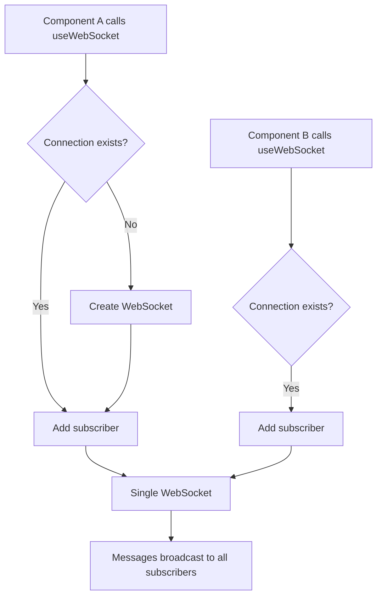
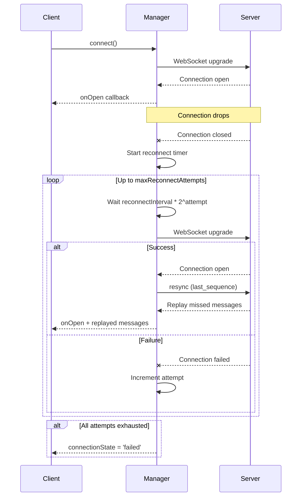
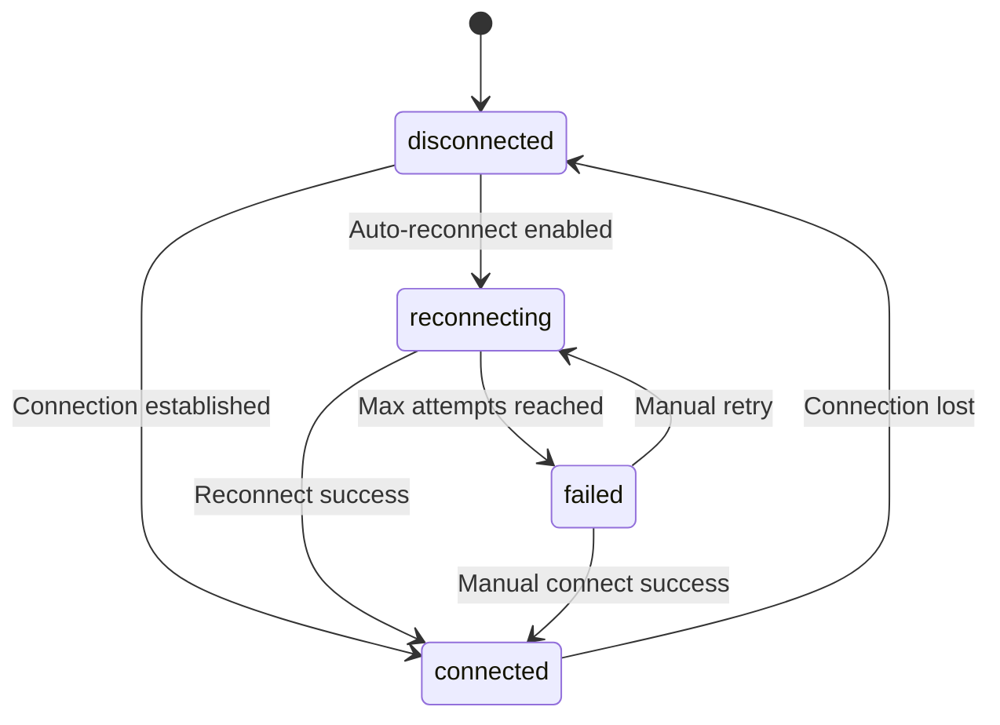

# Client Integration

Documentation for frontend WebSocket hooks and connection management.

**Sources**:

- `frontend/src/hooks/useWebSocket.ts`
- `frontend/src/hooks/useEventStream.ts`
- `frontend/src/hooks/webSocketManager.ts`
- `frontend/src/components/common/ConnectionStatusBanner.tsx`
- `frontend/src/components/common/WebSocketStatus.tsx`

## Overview

The frontend uses React hooks for WebSocket connections, providing automatic reconnection, sequence tracking, and connection status UI. A singleton WebSocketManager prevents duplicate connections when multiple components subscribe.

## Core Hooks

### useWebSocket

The foundational WebSocket hook providing connection management and message handling.

```typescript
// frontend/src/hooks/useWebSocket.ts
export function useWebSocket<T = unknown>({
  url,
  onMessage,
  onOpen,
  onClose,
  onError,
  enabled = true,
  reconnect = true,
  reconnectInterval = 3000,
  maxReconnectAttempts = 5,
}: UseWebSocketOptions<T>): UseWebSocketResult;
```

**Options**:

| Option                 | Type     | Default  | Description                  |
| ---------------------- | -------- | -------- | ---------------------------- |
| `url`                  | string   | required | WebSocket endpoint URL       |
| `onMessage`            | function | -        | Message handler callback     |
| `onOpen`               | function | -        | Connection open callback     |
| `onClose`              | function | -        | Connection close callback    |
| `onError`              | function | -        | Error callback               |
| `enabled`              | boolean  | `true`   | Enable/disable connection    |
| `reconnect`            | boolean  | `true`   | Auto-reconnect on disconnect |
| `reconnectInterval`    | number   | `3000`   | Base reconnect delay (ms)    |
| `maxReconnectAttempts` | number   | `5`      | Max reconnect attempts       |

**Return Value**:

```typescript
interface UseWebSocketResult {
  isConnected: boolean;
  isReconnecting: boolean;
  reconnectAttempts: number;
  send: (data: string | object) => void;
  disconnect: () => void;
  connect: () => void;
  lastMessage: unknown | null;
  connectionState: ConnectionState;
}
```

**Usage Example**:

```typescript
const { isConnected, send, lastMessage } = useWebSocket({
  url: '/ws/events',
  onMessage: (event) => {
    console.log('Received:', event.data);
  },
  onOpen: () => {
    // Subscribe to specific events after connection
    send({ type: 'subscribe', data: { events: ['alert.*'] } });
  },
});
```

### useEventStream

Specialized hook for the `/ws/events` channel with event-specific handling.

```typescript
// frontend/src/hooks/useEventStream.ts
export function useEventStream({
  onEvent,
  onAlert,
  onCameraStatus,
  onSceneChange,
  onDetection,
  enabled = true,
}: UseEventStreamOptions): UseEventStreamResult;
```

**Options**:

| Option           | Type     | Description             |
| ---------------- | -------- | ----------------------- |
| `onEvent`        | function | Security event callback |
| `onAlert`        | function | Alert event callback    |
| `onCameraStatus` | function | Camera status callback  |
| `onSceneChange`  | function | Scene change callback   |
| `onDetection`    | function | Detection callback      |
| `enabled`        | boolean  | Enable/disable stream   |

**Message Routing**:

```typescript
// Automatically routes messages by type
switch (message.type) {
  case 'event':
    onEvent?.(message.data);
    break;
  case 'alert_created':
  case 'alert_acknowledged':
  case 'alert_dismissed':
    onAlert?.(message.data, message.type);
    break;
  case 'camera_status':
    onCameraStatus?.(message.data);
    break;
  case 'scene_change':
    onSceneChange?.(message.data);
    break;
  case 'detection.new':
  case 'detection.batch':
    onDetection?.(message.data, message.type);
    break;
}
```

**Usage Example**:

```typescript
const { connectionState, lastEventTime } = useEventStream({
  onEvent: (event) => {
    setEvents((prev) => [event, ...prev]);
  },
  onAlert: (alert, type) => {
    if (type === 'alert_created') {
      showNotification(alert);
    }
  },
  onCameraStatus: (status) => {
    updateCameraStatus(status.camera_id, status.status);
  },
});
```

## WebSocketManager

Singleton manager preventing duplicate connections when multiple components subscribe.

```typescript
// frontend/src/hooks/webSocketManager.ts
class WebSocketManager {
  private connections: Map<string, ManagedConnection>;
  private subscribers: Map<string, Set<Subscriber>>;

  subscribe(url: string, subscriber: Subscriber): () => void;
  send(url: string, data: string | object): void;
  getConnectionState(url: string): ConnectionState;
}
```

### Connection Deduplication



### Subscriber Management

```typescript
// When component mounts
const unsubscribe = manager.subscribe('/ws/events', {
  onMessage: handleMessage,
  onStateChange: handleStateChange,
});

// When component unmounts
unsubscribe(); // Removes subscriber, closes connection if last
```

## Reconnection Flow



### Exponential Backoff

```typescript
// Reconnection delay increases with each attempt
const delay = reconnectInterval * Math.pow(2, attempt);
// Attempt 0: 3000ms
// Attempt 1: 6000ms
// Attempt 2: 12000ms
// Attempt 3: 24000ms
// Attempt 4: 48000ms
```

## Sequence Validation

### Frontend Gap Detection

```typescript
// frontend/src/hooks/sequenceValidator.ts
export function validateSequence(currentSeq: number, lastSeq: number | null): SequenceValidation {
  if (lastSeq === null) {
    return { valid: true, gap: false };
  }

  const expectedSeq = lastSeq + 1;
  if (currentSeq === expectedSeq) {
    return { valid: true, gap: false };
  }

  if (currentSeq > expectedSeq) {
    return { valid: true, gap: true, missed: currentSeq - expectedSeq };
  }

  // Duplicate or out-of-order
  return { valid: false, gap: false, duplicate: true };
}
```

### Gap Recovery

```typescript
// When gap detected
if (validation.gap) {
  // Request replay of missed messages
  send({
    type: 'resync',
    data: {
      channel: 'events',
      last_sequence: lastSeq,
    },
  });
}
```

## Connection Status Components

### ConnectionStatusBanner

Prominent banner displayed when WebSocket connection is lost.

```typescript
// frontend/src/components/common/ConnectionStatusBanner.tsx
export interface ConnectionStatusBannerProps {
  connectionState: ConnectionState;
  disconnectedSince: Date | null;
  reconnectAttempts?: number;
  maxReconnectAttempts?: number;
  onRetry: () => void;
  staleThresholdMs?: number;
  isPollingFallback?: boolean;
}
```

**States and Styling**:

| State          | Background | Icon             | Message                      |
| -------------- | ---------- | ---------------- | ---------------------------- |
| `reconnecting` | Yellow     | Spinning refresh | "Reconnecting (Attempt X/Y)" |
| `failed`       | Orange     | Warning triangle | "Connection Failed"          |
| `disconnected` | Red        | WiFi off         | "Disconnected"               |

**Stale Data Warning**:

When disconnected for longer than `staleThresholdMs` (default 60 seconds), displays:

```
Data may be stale: events and system status may be outdated
```

### WebSocketStatus

Compact status indicator with tooltip showing channel details.

```typescript
// frontend/src/components/common/WebSocketStatus.tsx
export interface WebSocketStatusProps {
  eventsChannel: ChannelStatus;
  systemChannel: ChannelStatus;
  showDetails?: boolean;
  onRetry?: () => void;
  isPollingFallback?: boolean;
}
```

**Channel Status**:

```typescript
interface ChannelStatus {
  name: string;
  state: ConnectionState;
  lastMessageTime: Date | null;
  reconnectAttempts: number;
  maxReconnectAttempts: number;
  hasExhaustedRetries: boolean;
}
```

**Tooltip Content**:

- Channel name with status indicator
- "Last message: 5s ago" or "No messages yet"
- Reconnect attempt counter when reconnecting
- "Retries exhausted" badge when failed

## Connection States

```typescript
type ConnectionState =
  | 'connected' // Active connection
  | 'disconnected' // No connection
  | 'reconnecting' // Attempting reconnection
  | 'failed'; // Retries exhausted
```

### State Transitions



## Polling Fallback

When WebSocket connection fails, components can fall back to REST API polling:

```typescript
// In useEventStream
const { connectionState } = useWebSocket({ ... });

// Enable REST polling when WebSocket fails
const enablePolling = connectionState === 'failed';

const { data: events } = useQuery({
  queryKey: ['events'],
  queryFn: fetchEvents,
  enabled: enablePolling,
  refetchInterval: 5000,  // Poll every 5 seconds
});
```

## Usage Patterns

### Dashboard Page

```typescript
function Dashboard() {
  const [events, setEvents] = useState<Event[]>([]);
  const [connectionState, setConnectionState] = useState<ConnectionState>('disconnected');

  const {
    connectionState: wsState,
    reconnectAttempts,
    connect,
  } = useEventStream({
    onEvent: (event) => {
      setEvents((prev) => [event, ...prev.slice(0, 99)]);
    },
    onAlert: (alert) => {
      toast.warning(`New alert: ${alert.severity}`);
    },
  });

  return (
    <div>
      <ConnectionStatusBanner
        connectionState={wsState}
        disconnectedSince={wsState !== 'connected' ? new Date() : null}
        reconnectAttempts={reconnectAttempts}
        onRetry={connect}
      />
      <EventList events={events} />
    </div>
  );
}
```

### Selective Subscription

```typescript
function AlertsPage() {
  const { send, isConnected } = useWebSocket({
    url: '/ws/events',
    onOpen: () => {
      // Only subscribe to alert events
      send({
        type: 'subscribe',
        data: { events: ['alert.*'] }
      });
    },
    onMessage: handleAlertMessage,
  });

  return <AlertList />;
}
```

### System Status Monitor

```typescript
function SystemStatus() {
  const [gpuStats, setGpuStats] = useState<GpuStats | null>(null);
  const [services, setServices] = useState<ServiceStatus[]>([]);

  useWebSocket({
    url: '/ws/system',
    onMessage: (event) => {
      const data = JSON.parse(event.data);
      if (data.type === 'system_status') {
        setGpuStats(data.data.gpu);
        setServices(data.data.services);
      }
    },
  });

  return (
    <div>
      <GpuStatsCard stats={gpuStats} />
      <ServiceStatusList services={services} />
    </div>
  );
}
```

## Related Documentation

- [WebSocket Server](websocket-server.md) - Backend endpoints
- [Message Formats](message-formats.md) - Message schemas
- [EventBroadcaster](event-broadcaster.md) - Server-side broadcasting
