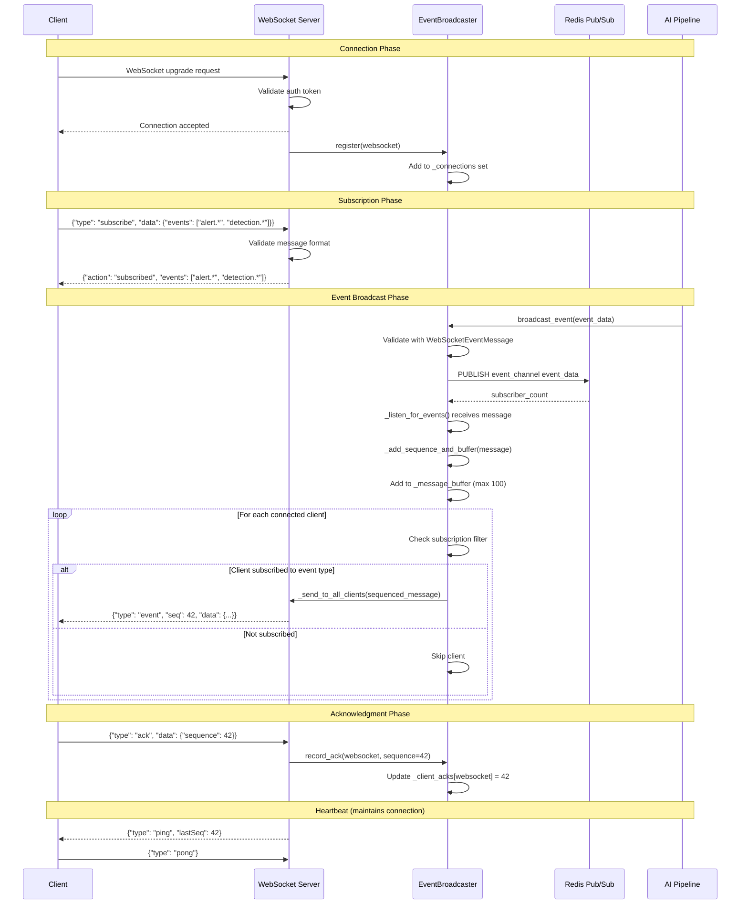
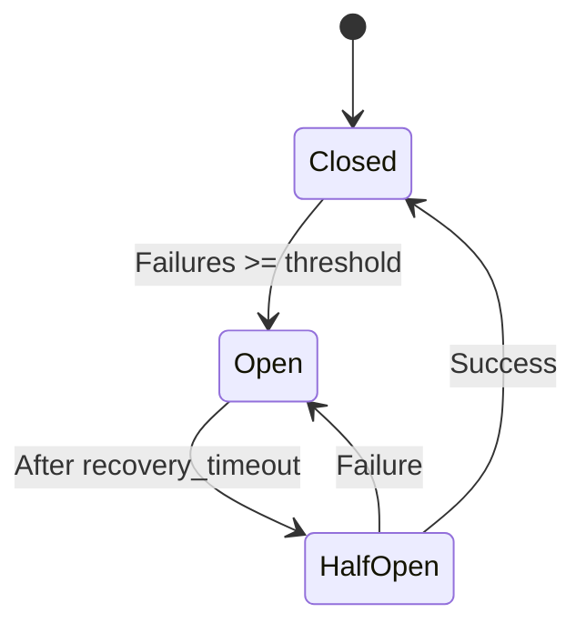

# Event Broadcaster

Documentation for the EventBroadcaster service that manages WebSocket connections and broadcasts events via Redis pub/sub.

**Source**: `backend/services/event_broadcaster.py`

## Overview

The EventBroadcaster acts as a bridge between Redis pub/sub events and WebSocket connections, enabling multiple backend instances to share event notifications. It provides reliable message delivery with retry logic, message buffering for reconnection replay, and circuit breaker protection.

## Class Structure

```python
# backend/services/event_broadcaster.py:335
class EventBroadcaster:
    """Manages WebSocket connections and broadcasts events via Redis pub/sub.

    Includes a supervision task that monitors listener health and automatically
    restarts dead listeners to ensure reliability.

    When max recovery attempts are exhausted, the broadcaster enters degraded mode
    where it continues to accept connections but cannot broadcast real-time events.
    """
```

## Initialization

```python
# backend/services/event_broadcaster.py:371
def __init__(self, redis_client: RedisClient, channel_name: str | None = None):
    """Initialize the event broadcaster.

    Args:
        redis_client: Connected Redis client instance
        channel_name: Optional channel name override. Defaults to settings.redis_event_channel.
    """
    self._redis = redis_client
    self._channel_name = channel_name or get_settings().redis_event_channel
    self._connections: set[WebSocket] = set()
    self._pubsub: PubSub | None = None
    self._listener_task: asyncio.Task[None] | None = None
    self._supervisor_task: asyncio.Task[None] | None = None
    self._is_listening = False
    self._recovery_attempts = 0
    self._listener_healthy = False
    self._is_degraded = False

    # Circuit breaker for WebSocket connection resilience
    self._circuit_breaker = WebSocketCircuitBreaker(...)

    # Message sequencing and buffering (NEM-1688)
    self._sequence_counter = 0
    self._message_buffer: deque[dict[str, Any]] = deque(maxlen=MESSAGE_BUFFER_SIZE)
    self._client_acks: dict[WebSocket, int] = {}
```

## WebSocket Message Flow

The following sequence diagram shows the complete flow of WebSocket communication, including client connection, subscription, event broadcasting, and acknowledgment.



### Flow Description

| Phase              | Description                                                                                      |
| ------------------ | ------------------------------------------------------------------------------------------------ |
| **Connection**     | Client upgrades to WebSocket, server validates auth, registers with broadcaster                  |
| **Subscription**   | Client subscribes to event patterns (e.g., `alert.*`), server confirms                           |
| **Broadcast**      | AI pipeline publishes events via Redis, broadcaster sequences and delivers to subscribed clients |
| **Acknowledgment** | Client acknowledges received sequence numbers for gap detection                                  |
| **Heartbeat**      | Server sends periodic pings with latest sequence for connection health                           |

## Redis Pub/Sub Integration

### Starting the Broadcaster

```python
# backend/services/event_broadcaster.py:570
async def start(self) -> None:
    """Start listening for events from Redis pub/sub.

    Also starts a supervision task that monitors listener health and
    automatically restarts dead listeners.
    """
    if self._is_listening:
        return

    self._pubsub = await self._redis.subscribe(self._channel_name)
    self._is_listening = True
    self._listener_healthy = True
    self._listener_task = asyncio.create_task(self._listen_for_events())
    self._supervisor_task = asyncio.create_task(self._supervise_listener())
```

### Listening for Events

```python
# backend/services/event_broadcaster.py:1406
async def _listen_for_events(self) -> None:
    """Listen for events from Redis pub/sub and broadcast to WebSocket clients."""
    async for message in self._redis.listen(self._pubsub):
        if not self._is_listening:
            break

        # Reset recovery attempts on successful message
        self._recovery_attempts = 0
        self._circuit_breaker.record_success()

        event_data = message.get("data")
        if not event_data:
            continue

        # Add sequence number and buffer the message
        broadcast_data = self._sequence_event_data(event_data)

        # Broadcast to all connected clients
        await self._send_to_all_clients(broadcast_data)
```

### Publishing Events

```python
# backend/services/event_broadcaster.py:683
async def broadcast_event(self, event_data: dict[str, Any]) -> int:
    """Broadcast an event to all connected WebSocket clients via Redis pub/sub.

    Returns:
        Number of Redis subscribers that received the message
    """
    # Validate message format
    validated_data = WebSocketEventData.model_validate(event_data.get("data", {}))
    validated_message = WebSocketEventMessage(data=validated_data)
    broadcast_data = validated_message.model_dump(mode="json")

    # Publish to Redis channel
    subscriber_count = await self._redis.publish(self._channel_name, broadcast_data)
    return subscriber_count
```

## Message Routing

### Sending to All Clients

```python
# backend/services/event_broadcaster.py:1500
async def _send_to_all_clients(self, event_data: Any) -> None:
    """Send event data to all connected WebSocket clients.

    Implements threshold-based compression (NEM-3154):
    - Messages smaller than websocket_compression_threshold are sent as plain JSON
    - Messages larger than the threshold are compressed with zlib/deflate
    """
    message = event_data if isinstance(event_data, str) else json.dumps(event_data)

    # Prepare message with optional compression
    prepared_message, was_compressed = prepare_message(message)

    # Send to all clients
    disconnected = []
    for ws in self._connections:
        try:
            if was_compressed:
                await ws.send_bytes(prepared_message)
            else:
                await ws.send_text(prepared_message)
        except Exception:
            disconnected.append(ws)

    # Clean up disconnected clients
    for ws in disconnected:
        await self.disconnect(ws)
```

## Retry Logic with Exponential Backoff

```python
# backend/services/event_broadcaster.py:145
async def broadcast_with_retry[T](
    broadcast_func: Callable[[], Awaitable[T]],
    message_type: str,
    *,
    max_retries: int = DEFAULT_MAX_RETRIES,
    base_delay: float = DEFAULT_BASE_DELAY,
    max_delay: float = DEFAULT_MAX_DELAY,
    metrics: BroadcastRetryMetrics | None = None,
) -> T:
    """Execute a broadcast function with retry logic and exponential backoff.

    This function wraps any broadcast operation with retry logic that:
    - Uses exponential backoff (1s, 2s, 4s, etc.) with jitter
    - Logs each retry attempt with context
    - Records metrics for monitoring
    - Raises the final exception if all retries are exhausted
    """
```

### Backoff Configuration

| Setting               | Default | Description            |
| --------------------- | ------- | ---------------------- |
| `DEFAULT_MAX_RETRIES` | `3`     | Maximum retry attempts |
| `DEFAULT_BASE_DELAY`  | `1.0`   | Base delay in seconds  |
| `DEFAULT_MAX_DELAY`   | `30.0`  | Maximum delay cap      |

### Backoff Calculation

```python
# backend/services/event_broadcaster.py:206-208
delay = min(base_delay * (2**attempt), max_delay)
jitter = delay * random.uniform(0.1, 0.3)  # 10-30% jitter
total_delay = delay + jitter
```

### Retry Sequence Example

| Attempt | Base Delay | With Jitter (approx) |
| ------- | ---------- | -------------------- |
| 1       | 1s         | 1.1-1.3s             |
| 2       | 2s         | 2.2-2.6s             |
| 3       | 4s         | 4.4-5.2s             |
| 4       | 8s         | 8.8-10.4s            |

## Message Replay for Reconnection

### Message Buffering

```python
# backend/services/event_broadcaster.py:68
MESSAGE_BUFFER_SIZE = 100  # Last 100 messages buffered for replay
```

```python
# backend/services/event_broadcaster.py:479
def _add_sequence_and_buffer(self, message: dict[str, Any]) -> dict[str, Any]:
    """Add sequence number and buffer the message for replay."""
    sequenced = dict(message)
    sequenced["sequence"] = self._next_sequence()
    sequenced["requires_ack"] = requires_ack(message)

    # Add to circular buffer
    self._message_buffer.append(sequenced)

    return sequenced
```

### Retrieving Buffered Messages

```python
# backend/services/event_broadcaster.py:524
def get_messages_since(
    self, last_sequence: int, mark_as_replay: bool = False
) -> list[dict[str, Any]]:
    """Get all buffered messages since a given sequence number.

    Used for reconnection replay to catch up clients that missed messages.

    Args:
        last_sequence: The last sequence number the client received.
        mark_as_replay: If True, add replay=True to returned messages.

    Returns:
        List of messages with sequence > last_sequence.
    """
    messages = [msg for msg in self._message_buffer if msg["sequence"] > last_sequence]

    if mark_as_replay:
        return [{**msg, "replay": True} for msg in messages]

    return messages
```

### Acknowledgment Tracking

```python
# backend/services/event_broadcaster.py:546
def record_ack(self, websocket: WebSocket, sequence: int) -> None:
    """Record a client's acknowledgment of a sequence number."""
    current = self._client_acks.get(websocket, 0)
    if sequence > current:
        self._client_acks[websocket] = sequence
```

## Broadcast Methods

### Security Events

```python
async def broadcast_event(self, event_data: dict[str, Any]) -> int:
```

### Service Status

```python
async def broadcast_service_status(self, status_data: dict[str, Any]) -> int:
```

### Scene Changes

```python
async def broadcast_scene_change(self, scene_change_data: dict[str, Any]) -> int:
```

### Camera Status

```python
async def broadcast_camera_status(self, camera_status_data: dict[str, Any]) -> int:
```

### Alerts

```python
async def broadcast_alert(
    self, alert_data: dict[str, Any], event_type: WebSocketAlertEventType
) -> int:
```

### Worker Status

```python
async def broadcast_worker_status(self, worker_status_data: dict[str, Any]) -> int:
```

### Detections

```python
async def broadcast_detection_new(self, detection_data: dict[str, Any]) -> int:
async def broadcast_detection_batch(self, batch_data: dict[str, Any]) -> int:
```

### Infrastructure Alerts

```python
async def broadcast_infrastructure_alert(self, alert_data: dict[str, Any]) -> int:
```

### Summary Updates

```python
async def broadcast_summary_update(
    self,
    hourly: dict[str, Any] | None = None,
    daily: dict[str, Any] | None = None,
) -> int:
```

## Circuit Breaker

The broadcaster includes a circuit breaker for resilience:

```python
# backend/services/event_broadcaster.py:389
self._circuit_breaker = WebSocketCircuitBreaker(
    failure_threshold=self.MAX_RECOVERY_ATTEMPTS,
    recovery_timeout=30.0,
    half_open_max_calls=1,
    success_threshold=1,
    name="event_broadcaster",
)
```

### Circuit States



### State Checks

```python
# backend/services/event_broadcaster.py:433
def get_circuit_state(self) -> WebSocketCircuitState:
    """Get current circuit breaker state."""
    return self._circuit_breaker.get_state()
```

## Degraded Mode

When recovery attempts are exhausted, the broadcaster enters degraded mode:

```python
# backend/services/event_broadcaster.py:1380
def _enter_degraded_mode(self) -> None:
    """Enter degraded mode after exhausting all recovery attempts.

    In degraded mode:
    - A critical alert is logged for operator attention
    - The degraded flag is set for health checks to detect
    - The broadcaster stops trying to listen but remains available
      for connection management
    """
    self._is_degraded = True
    self._is_listening = False
    self._listener_healthy = False

    logger.critical(
        "CRITICAL: EventBroadcaster has entered DEGRADED MODE..."
    )
```

### Degraded State Notification

```python
# backend/services/event_broadcaster.py:1553
async def _broadcast_degraded_state(self) -> None:
    """Broadcast degraded state notification to all connected clients."""
    degraded_message = {
        "type": "service_status",
        "data": {
            "service": "event_broadcaster",
            "status": "degraded",
            "message": "Real-time event broadcasting is degraded.",
            "circuit_state": self._circuit_breaker.get_state().value,
        },
    }
    await self._send_to_all_clients(degraded_message)
```

## Supervision Task

```python
# backend/services/event_broadcaster.py:1579
async def _supervise_listener(self) -> None:
    """Supervision task that monitors listener health and restarts if needed.

    This task runs periodically to check if the listener task is alive.
    If the listener has died unexpectedly, the supervisor will attempt
    to restart it.
    """
    while self._is_listening:
        await asyncio.sleep(self.SUPERVISION_INTERVAL)  # 30 seconds

        listener_alive = self._listener_task and not self._listener_task.done()

        if listener_alive:
            await self._handle_healthy_listener()
        elif self._is_listening:
            should_break = await self._handle_dead_listener()
            if should_break:
                break
```

## Global Instance

```python
# backend/services/event_broadcaster.py:1740
async def get_broadcaster(redis_client: RedisClient) -> EventBroadcaster:
    """Get or create the global event broadcaster instance.

    Thread-safe with async lock to prevent race conditions.
    """
    global _broadcaster

    if _broadcaster is not None:
        return _broadcaster

    lock = _get_broadcaster_lock()
    async with lock:
        if _broadcaster is None:
            broadcaster = EventBroadcaster(redis_client)
            await broadcaster.start()
            _broadcaster = broadcaster

    return _broadcaster
```

## Broadcast Metrics

```python
# backend/services/event_broadcaster.py:79
@dataclass
class BroadcastRetryMetrics:
    """Metrics for tracking broadcast retry behavior."""
    total_attempts: int = 0
    successful_broadcasts: int = 0
    failed_broadcasts: int = 0
    retries_exhausted: int = 0
    retry_counts: dict[int, int] = field(default_factory=lambda: {0: 0, 1: 0, 2: 0, 3: 0})
```

### Getting Metrics

```python
# backend/services/event_broadcaster.py:415
def get_broadcast_metrics(self) -> dict[str, Any]:
    """Get broadcast retry metrics as a dictionary."""
    return self._broadcast_metrics.to_dict()
```

## Health Checks

```python
# backend/services/event_broadcaster.py:1690
def is_listener_healthy(self) -> bool:
    """Check if the listener is currently healthy."""
    return self._is_listening and self._listener_healthy

def is_degraded(self) -> bool:
    """Check if the broadcaster is in degraded mode."""
    return self._is_degraded
```

## Context Manager

```python
# backend/services/event_broadcaster.py:624
async with EventBroadcaster(redis_client) as broadcaster:
    # broadcaster is started and listening
    await broadcaster.broadcast_event(event_data)
# broadcaster is automatically stopped
```

## Related Documentation

- [WebSocket Server](websocket-server.md) - Endpoint implementation
- [SubscriptionManager](subscription-manager.md) - Event filtering
- [Message Formats](message-formats.md) - Schema reference
- [Resilience Patterns](../resilience.md) - Circuit breaker details
