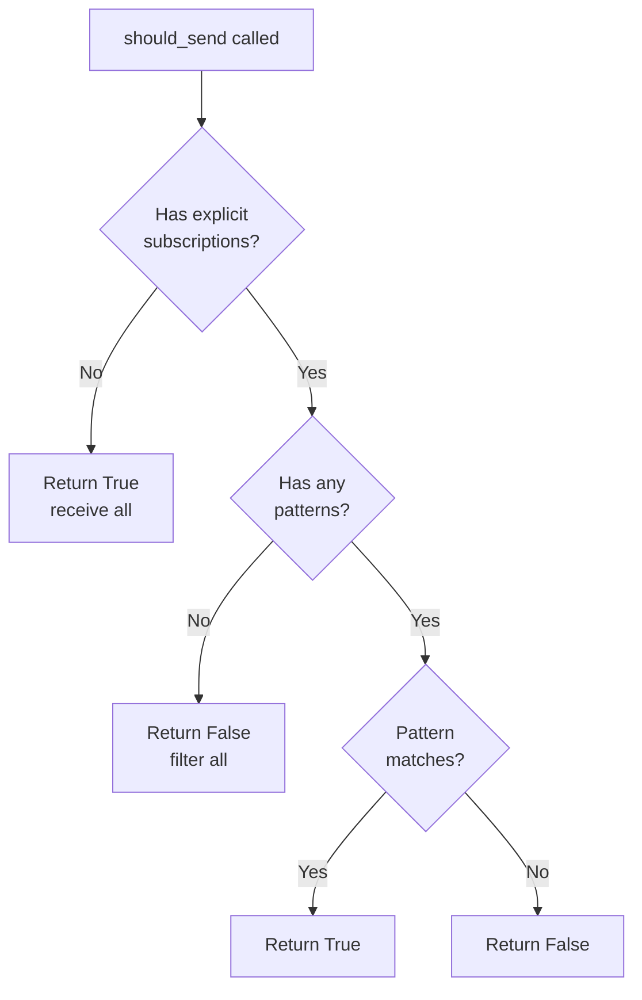

# Subscription Manager

Documentation for WebSocket event filtering with pattern matching.

**Source**: `backend/core/websocket/subscription_manager.py`

## Overview

The SubscriptionManager enables clients to subscribe to specific event patterns, reducing bandwidth and processing overhead. Clients can filter events using wildcard patterns, receiving only the events they need.

## Pattern Matching

### Pattern Syntax

The manager uses `fnmatch` for wildcard matching:

| Pattern         | Matches                                | Description             |
| --------------- | -------------------------------------- | ----------------------- |
| `*`             | All events                             | Wildcard for everything |
| `alert.*`       | `alert.created`, `alert.updated`, etc. | All alert events        |
| `camera.*`      | `camera.online`, `camera.offline`      | All camera events       |
| `detection.new` | `detection.new`                        | Exact match only        |
| `alert.cr*`     | `alert.created`, `alert.critical`      | Partial wildcard        |

### Matching Algorithm

```python
# backend/core/websocket/subscription_manager.py:358
def _matches_any_pattern(self, event_type: str, patterns: set[str]) -> bool:
    """Check if an event type matches any of the given patterns.

    Uses fnmatch for wildcard matching:
    - "*" matches everything
    - "alert.*" matches "alert.created", "alert.updated", etc.
    - "alert.created" matches exactly "alert.created"
    """
    return any(fnmatch.fnmatch(event_type, pattern) for pattern in patterns)
```

## Dual Index Structure

The manager maintains two data structures for efficient lookups:

```python
# backend/core/websocket/subscription_manager.py:96-99
def __init__(self) -> None:
    self._subscriptions: dict[str, set[str]] = {}  # connection_id -> event patterns
    self._explicit_subscriptions: set[str] = set()  # connections with explicit subscriptions
    self._lock = threading.RLock()
```

### Index 1: Subscriptions Map

Maps connection IDs to their subscribed patterns:

```
{
    "ws-events-abc123": {"alert.*", "camera.status_changed"},
    "ws-events-def456": {"*"},
    "ws-events-ghi789": {"detection.new"}
}
```

### Index 2: Explicit Subscriptions Set

Tracks which connections have explicitly subscribed:

```
{"ws-events-abc123", "ws-events-ghi789"}
```

Connections NOT in this set receive all events (backwards compatibility).

## Subscribe Operation

```python
# backend/core/websocket/subscription_manager.py:102
def subscribe(self, connection_id: str, patterns: list[str]) -> list[str]:
    """Subscribe a connection to event patterns.

    Adds the given patterns to the connection's subscription list.
    Supports wildcard patterns using fnmatch syntax.

    Args:
        connection_id: Unique identifier for the WebSocket connection.
        patterns: List of event patterns to subscribe to.

    Returns:
        List of patterns that were added (for acknowledgment).
    """
```

### Subscribe Flow

1. Acquire thread lock
2. Initialize pattern set if new connection
3. Mark connection as having explicit subscriptions
4. Normalize patterns to lowercase
5. Add patterns to subscription set
6. Log subscription details
7. Return normalized patterns

### Example

```python
manager.subscribe("ws-events-abc123", ["alert.*", "camera.status_changed"])
# Returns: ["alert.*", "camera.status_changed"]
```

## Unsubscribe Operation

```python
# backend/core/websocket/subscription_manager.py:142
def unsubscribe(self, connection_id: str, patterns: list[str] | None = None) -> list[str]:
    """Unsubscribe a connection from event patterns.

    If patterns is None, removes all subscriptions for the connection.

    Args:
        connection_id: Unique identifier for the WebSocket connection.
        patterns: List of patterns to unsubscribe from, or None for all.

    Returns:
        List of patterns that were removed.
    """
```

### Unsubscribe All

```python
manager.unsubscribe("ws-events-abc123")
# Removes connection from _subscriptions and _explicit_subscriptions
```

### Unsubscribe Specific Patterns

```python
manager.unsubscribe("ws-events-abc123", ["alert.*"])
# Removes only "alert.*" from the connection's patterns
```

## Pattern Validation

Patterns are normalized to lowercase for consistent matching:

```python
# backend/core/websocket/subscription_manager.py:127-128
normalized_patterns = [p.lower() for p in patterns]
self._subscriptions[connection_id].update(normalized_patterns)
```

Event types are also normalized during matching:

```python
# backend/core/websocket/subscription_manager.py:230-231
normalized_event = event_type.lower()
return self._matches_any_pattern(normalized_event, patterns)
```

## Should Send Check

```python
# backend/core/websocket/subscription_manager.py:197
def should_send(self, connection_id: str, event_type: str) -> bool:
    """Check if a connection should receive an event type.

    If the connection has no explicit subscriptions, returns True
    (default: receive all events for backwards compatibility).
    """
```

### Decision Logic



## Get Recipients

```python
# backend/core/websocket/subscription_manager.py:236
def get_recipients(self, event_type: str) -> set[str]:
    """Get all connection IDs that should receive an event type.

    Returns the set of all connection IDs that are subscribed to
    patterns matching the given event type.
    """
```

### Example

```python
# Subscriptions:
# ws-events-abc123: ["alert.*"]
# ws-events-def456: ["*"]
# ws-events-ghi789: ["camera.*"]

recipients = manager.get_recipients("alert.created")
# Returns: {"ws-events-abc123", "ws-events-def456"}
```

## Connection Lifecycle

### Register Connection

```python
# backend/core/websocket/subscription_manager.py:298
def register_connection(self, connection_id: str) -> None:
    """Register a new connection (receives all events by default).

    Call this when a new WebSocket connection is established.
    The connection will receive all events until subscribe() is called.
    """
```

New connections receive all events until they explicitly subscribe.

### Remove Connection

```python
# backend/core/websocket/subscription_manager.py:315
def remove_connection(self, connection_id: str) -> None:
    """Remove a connection and all its subscriptions.

    Call this when a WebSocket connection is closed to clean up.
    """
```

Cleanup removes the connection from both data structures.

## Thread Safety

The manager uses `threading.RLock` for thread-safe operations:

```python
# backend/core/websocket/subscription_manager.py:100
self._lock = threading.RLock()
```

All public methods acquire the lock before modifying state:

```python
def subscribe(self, connection_id: str, patterns: list[str]) -> list[str]:
    with self._lock:
        # ... thread-safe operations
```

## Statistics

```python
# backend/core/websocket/subscription_manager.py:340
def get_stats(self) -> dict[str, Any]:
    """Get subscription statistics."""
    with self._lock:
        total_connections = len(self._subscriptions)
        explicit_count = len(self._explicit_subscriptions)
        total_patterns = sum(len(patterns) for patterns in self._subscriptions.values())

        return {
            "total_connections": total_connections,
            "explicit_subscriptions": explicit_count,
            "default_subscriptions": total_connections - explicit_count,
            "total_patterns": total_patterns,
        }
```

## Global Singleton

The manager uses a thread-safe singleton pattern:

```python
# backend/core/websocket/subscription_manager.py:384
def get_subscription_manager() -> SubscriptionManager:
    """Get or create the global subscription manager instance."""
    global _subscription_manager

    if _subscription_manager is not None:
        return _subscription_manager

    with _manager_lock:
        if _subscription_manager is None:
            _subscription_manager = SubscriptionManager()

    return _subscription_manager
```

## Protocol Messages

### Subscribe Request

```json
{
  "action": "subscribe",
  "events": ["alert.*", "camera.status_changed", "job.progress"]
}
```

### Subscribe Acknowledgment

```json
{
  "action": "subscribed",
  "events": ["alert.*", "camera.status_changed", "job.progress"]
}
```

### Unsubscribe Request

```json
{
  "action": "unsubscribe",
  "events": ["alert.*"]
}
```

### Unsubscribe Acknowledgment

```json
{
  "action": "unsubscribed",
  "events": ["alert.*"]
}
```

## Usage Example

```python
from backend.core.websocket.subscription_manager import get_subscription_manager

# Get the global subscription manager
manager = get_subscription_manager()

# Register a new connection
manager.register_connection("ws-events-abc123")

# Subscribe to specific patterns
patterns = manager.subscribe("ws-events-abc123", ["alert.*", "camera.status_changed"])
print(f"Subscribed to: {patterns}")

# Check if connection should receive an event
if manager.should_send("ws-events-abc123", "alert.created"):
    await websocket.send_text(message)

# Get all recipients for an event
recipients = manager.get_recipients("alert.created")
for connection_id in recipients:
    # ... send to connection

# Clean up on disconnect
manager.remove_connection("ws-events-abc123")
```

## Default Behavior

For backwards compatibility, new connections receive ALL events until they explicitly subscribe:

| Subscription State       | Events Received       |
| ------------------------ | --------------------- |
| No `subscribe()` called  | All events            |
| `subscribe(["alert.*"])` | Only alert events     |
| `subscribe([])` (empty)  | No events             |
| `subscribe(["*"])`       | All events (explicit) |

## Related Documentation

- [WebSocket Server](websocket-server.md) - Endpoint integration
- [EventBroadcaster](event-broadcaster.md) - Message routing
- [Message Formats](message-formats.md) - Event type reference
