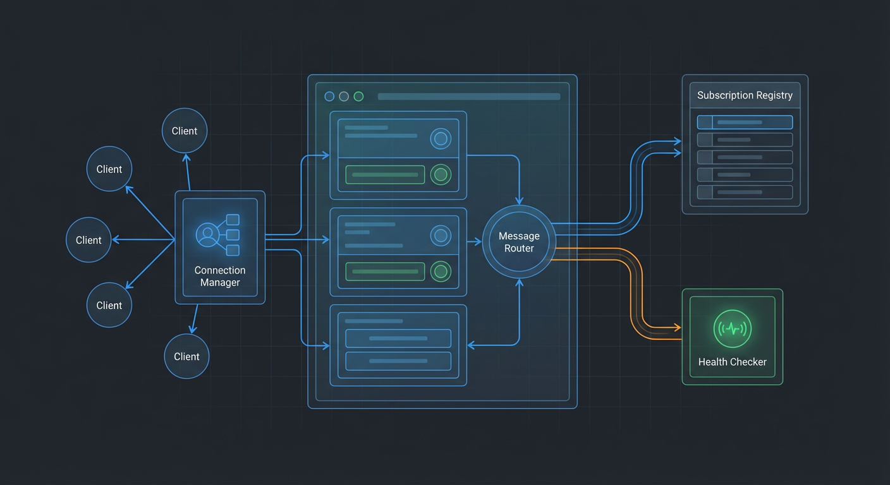
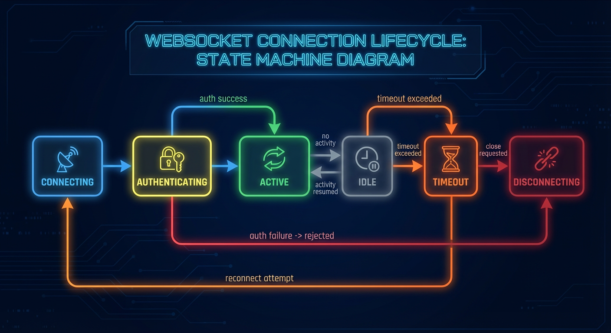
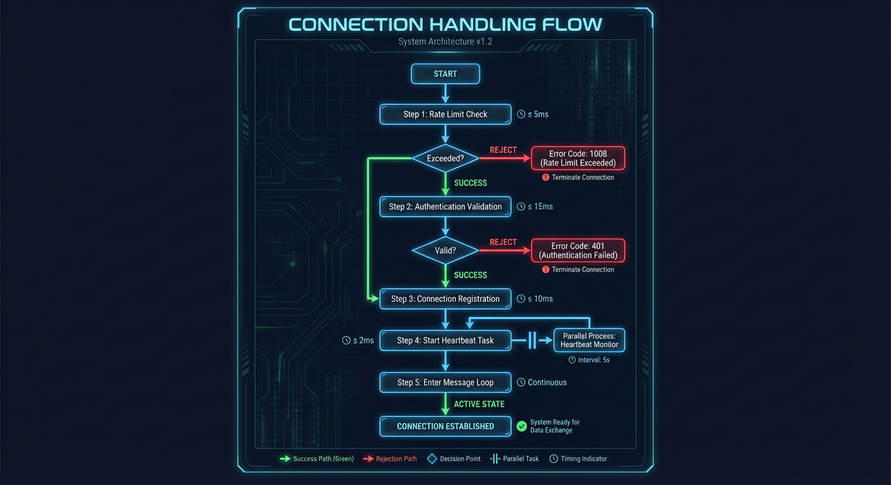
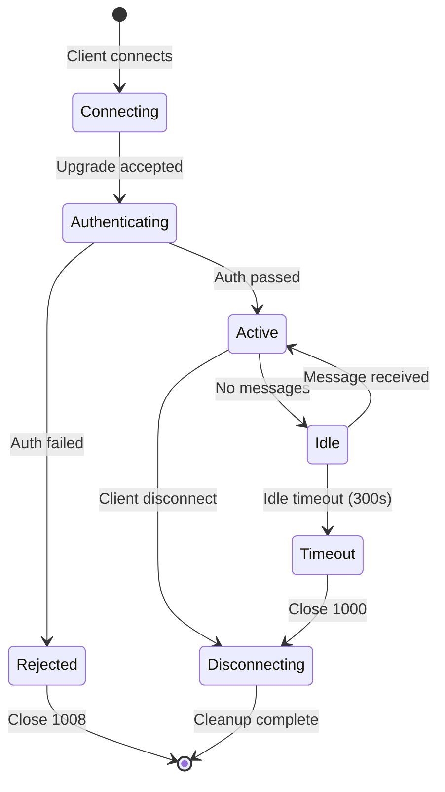

# WebSocket Server

Documentation for WebSocket endpoints, connection lifecycle, and message handling.

**Source**: `backend/api/routes/websocket.py`

## Overview

The WebSocket server provides real-time bidirectional communication between the backend and frontend clients. It handles connection lifecycle management, message validation, heartbeat mechanisms, and graceful disconnection.



## Endpoints

### Events Endpoint (`/ws/events`)

Streams security event notifications in real-time.

```python
# backend/api/routes/websocket.py:313
@router.websocket("/ws/events")
async def websocket_events_endpoint(
    websocket: WebSocket,
    redis: RedisClient = Depends(get_redis),
    _token_valid: bool = Depends(validate_websocket_token),
) -> None:
```

**Purpose**: Delivers security events as they are created by the AI pipeline.

**Message Types Received**:

- `event` - Security event notification
- `alert.*` - Alert lifecycle events
- `detection.*` - Detection events
- `camera_status` - Camera online/offline
- `scene_change` - View tampering detected

### System Endpoint (`/ws/system`)

Streams system health and GPU statistics.

```python
# backend/api/routes/websocket.py:533
@router.websocket("/ws/system")
async def websocket_system_status(
    websocket: WebSocket,
    redis: RedisClient = Depends(get_redis),
    _token_valid: bool = Depends(validate_websocket_token),
) -> None:
```

**Purpose**: Provides periodic system status updates including GPU metrics, service health, and worker status.

**Update Frequency**: Every 5 seconds

### Job Logs Endpoint (`/ws/jobs/{job_id}/logs`)

Streams real-time logs for active jobs.

```python
# backend/api/routes/websocket.py:755
@router.websocket("/ws/jobs/{job_id}/logs")
async def websocket_job_logs(
    websocket: WebSocket,
    job_id: str,
    redis: RedisClient = Depends(get_redis),
    _token_valid: bool = Depends(validate_websocket_token),
) -> None:
```

**Purpose**: Streams log entries for active processing jobs.

## Connection Lifecycle







### Connection States

1. **Connecting**: WebSocket upgrade request received
2. **Authenticating**: Validating API key or token
3. **Active**: Connected and receiving messages
4. **Idle**: No recent client messages
5. **Timeout**: Idle timeout exceeded
6. **Disconnecting**: Graceful cleanup in progress

### Authentication

Two authentication methods are supported (both optional, can be used together):

**API Key Authentication** (when `api_key_enabled=true`):

```
ws://host/ws/events?api_key=YOUR_KEY
```

Or via Sec-WebSocket-Protocol header:

```
Sec-WebSocket-Protocol: api-key.YOUR_KEY
```

**Token Authentication** (when `WEBSOCKET_TOKEN` is configured):

```
ws://host/ws/events?token=YOUR_TOKEN
```

Connections without valid credentials when auth is enabled receive close code 1008 (Policy Violation).

## Heartbeat Mechanism

The server sends periodic ping messages to keep connections alive and detect disconnected clients.

```python
# backend/api/routes/websocket.py:267
async def send_heartbeat(
    websocket: WebSocket,
    interval: int,
    stop_event: asyncio.Event,
    connection_id: str = "",
) -> None:
```

### Heartbeat Message Format

Server sends:

```json
{
  "type": "ping",
  "lastSeq": 42
}
```

The `lastSeq` field contains the current sequence number, enabling clients to detect message gaps during idle periods (NEM-3142).

### Expected Client Response

```json
{
  "type": "pong"
}
```

### Configuration

| Setting                           | Default | Description             |
| --------------------------------- | ------- | ----------------------- |
| `websocket_ping_interval_seconds` | `30`    | Heartbeat interval      |
| `websocket_idle_timeout_seconds`  | `300`   | Connection idle timeout |

## Message Loop

The main message loop handles incoming client messages with validation and routing.

```python
# backend/api/routes/websocket.py:430-490
while True:
    try:
        data = await asyncio.wait_for(
            websocket.receive_text(),
            timeout=idle_timeout,
        )

        # Support legacy plain "ping" string
        if data == "ping":
            await websocket.send_text('{"type":"pong"}')
            continue

        # Validate and handle JSON messages
        message = await validate_websocket_message(websocket, data)
        if message is not None:
            await handle_validated_message(websocket, message, connection_id)

    except TimeoutError:
        await websocket.close(code=1000, reason="Idle timeout")
        break
```

### Message Validation

All incoming messages are validated against the `WebSocketMessage` schema:

```python
# backend/api/routes/websocket.py:79
async def validate_websocket_message(
    websocket: WebSocket, raw_data: str
) -> WebSocketMessage | None:
```

Invalid messages receive an error response:

```json
{
  "type": "error",
  "error": "invalid_json",
  "message": "Message must be valid JSON",
  "details": { "raw_data_preview": "..." }
}
```

### Supported Message Types

```python
# backend/api/schemas/websocket.py:40
class WebSocketMessageType(StrEnum):
    PING = auto()       # Client heartbeat
    PONG = auto()       # Response to server ping
    SUBSCRIBE = auto()  # Subscribe to event patterns
    UNSUBSCRIBE = auto() # Unsubscribe from patterns
    RESYNC = auto()     # Request sequence resync
```

## Message Handling

```python
# backend/api/routes/websocket.py:123
async def handle_validated_message(
    websocket: WebSocket, message: WebSocketMessage, connection_id: str
) -> None:
```

### Ping/Pong

```json
// Client sends:
{"type": "ping"}

// Server responds:
{"type": "pong"}
```

### Subscribe

```json
// Client sends:
{
  "type": "subscribe",
  "data": {"events": ["alert.*", "camera.status_changed"]}
}

// Server responds:
{
  "action": "subscribed",
  "events": ["alert.*", "camera.status_changed"]
}
```

### Unsubscribe

```json
// Client sends:
{
  "type": "unsubscribe",
  "data": {"events": ["alert.*"]}
}

// Server responds:
{
  "action": "unsubscribed",
  "events": ["alert.*"]
}
```

### Resync

Request resync after detecting a sequence gap:

```json
// Client sends:
{
  "type": "resync",
  "data": {"channel": "events", "last_sequence": 42}
}

// Server responds:
{
  "type": "resync_ack",
  "channel": "events",
  "last_sequence": 42
}
```

## Graceful Disconnect

Connection cleanup ensures all resources are properly released:

```python
# backend/api/routes/websocket.py:507-530
finally:
    # Stop heartbeat task
    heartbeat_stop.set()
    if heartbeat_task is not None:
        heartbeat_task.cancel()

    # Ensure the connection is properly cleaned up
    await broadcaster.disconnect(websocket)

    # Clean up subscriptions (NEM-2383)
    subscription_manager.remove_connection(connection_id)

    # Clean up sequence tracker (NEM-3142)
    sequence_tracker.remove_connection(connection_id, websocket)

    # Clear connection_id context (NEM-1640)
    set_connection_id(None)
```

### Cleanup Steps

1. Signal heartbeat task to stop
2. Cancel and await heartbeat task
3. Remove from EventBroadcaster connection set
4. Remove from SubscriptionManager
5. Remove from SequenceTracker
6. Clear async context connection ID

## Sequence Tracking

Messages include sequence numbers for gap detection:

```python
# backend/api/routes/websocket.py:233
async def send_sequenced_message(
    websocket: WebSocket,
    connection_id: str,
    message: dict[str, Any],
) -> bool:
```

Example message with sequence:

```json
{
  "type": "event",
  "seq": 42,
  "data": {...}
}
```

## Rate Limiting

Connections are rate-limited before acceptance:

```python
# backend/api/routes/websocket.py:383
if not await check_websocket_rate_limit(websocket, redis):
    await websocket.close(code=1008)  # Policy Violation
    return
```

## Error Codes

| Code | Name             | When Used                    |
| ---- | ---------------- | ---------------------------- |
| 1000 | Normal Closure   | Idle timeout, graceful close |
| 1008 | Policy Violation | Auth failed, rate limited    |
| 1011 | Internal Error   | Unexpected exception         |

## Connection ID Generation

Each connection gets a unique identifier for tracking and logging:

```python
# backend/api/routes/websocket.py:398
connection_id = f"ws-events-{uuid.uuid4().hex[:8]}"
set_connection_id(connection_id)
```

Connection ID format:

- `/ws/events`: `ws-events-{8 hex chars}`
- `/ws/system`: `ws-system-{8 hex chars}`
- `/ws/jobs/{id}/logs`: `ws-job-logs-{job_id[:8]}-{8 hex chars}`

## Related Documentation

- [EventBroadcaster](event-broadcaster.md) - Redis pub/sub integration
- [SubscriptionManager](subscription-manager.md) - Event filtering
- [Message Formats](message-formats.md) - Detailed schema documentation
