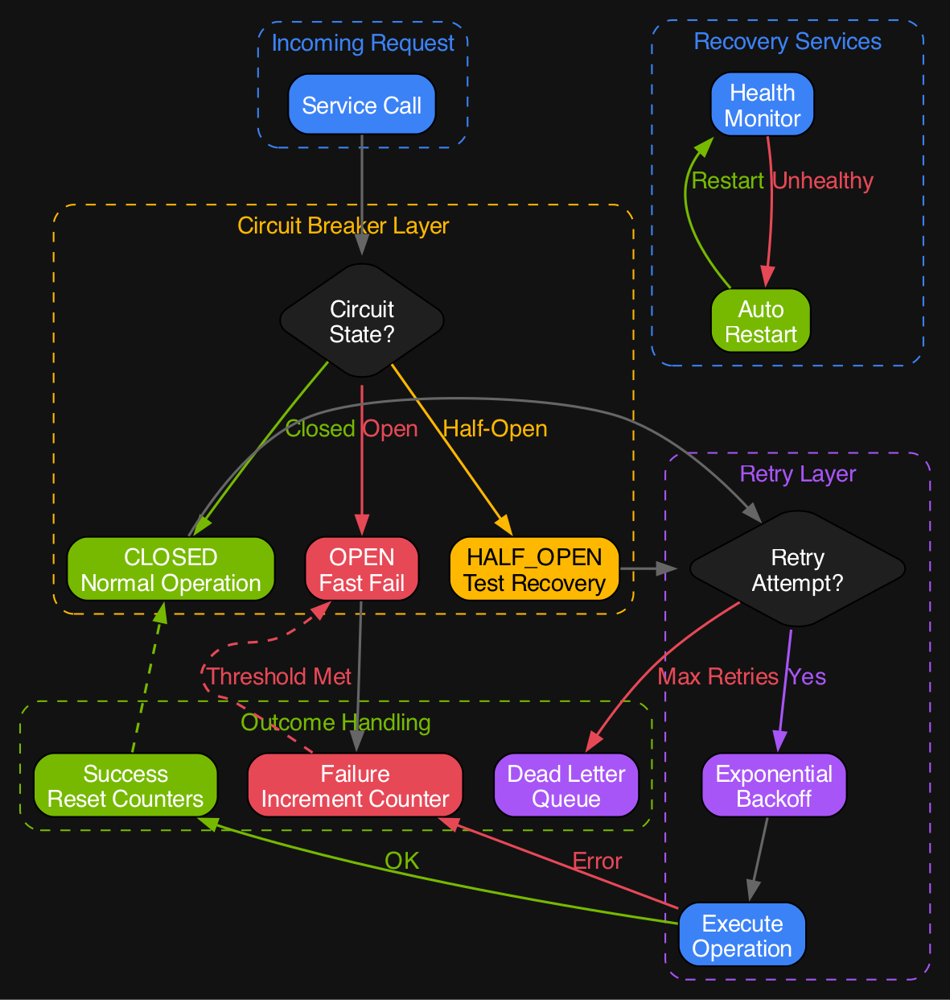
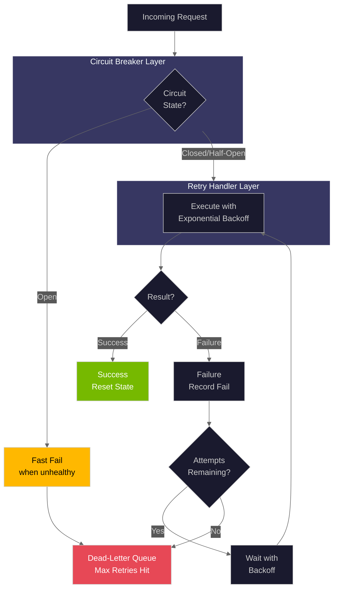
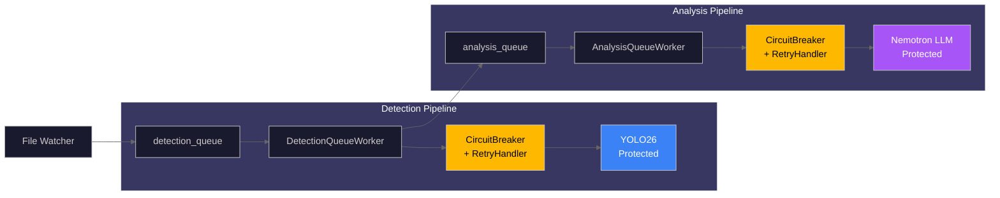

# Resilience Patterns Hub

This directory contains comprehensive documentation for the resilience patterns implemented in the Home Security Intelligence system. These patterns ensure reliable operation even when external services (YOLO26, Nemotron LLM, Redis) experience failures.

## Pattern Overview



| Pattern                                         | Purpose                                          | Source File                               |
| ----------------------------------------------- | ------------------------------------------------ | ----------------------------------------- |
| [Circuit Breaker](circuit-breaker.md)           | Prevents cascading failures by failing fast      | `backend/services/circuit_breaker.py`     |
| [Retry Handler](retry-handler.md)               | Exponential backoff for transient failures       | `backend/services/retry_handler.py`       |
| [Dead-Letter Queue](dead-letter-queue.md)       | Captures failed jobs for inspection/reprocessing | `backend/services/retry_handler.py`       |
| [Graceful Degradation](graceful-degradation.md) | Maintains operation during partial outages       | `backend/services/degradation_manager.py` |
| [Health Monitoring](health-monitoring.md)       | Automatic service recovery                       | `backend/services/health_monitor.py`      |

## Architecture Diagram



## Quick Reference

### Circuit Breaker States

| State     | Prometheus Value | Description                                 |
| --------- | ---------------- | ------------------------------------------- |
| CLOSED    | 0                | Normal operation, calls pass through        |
| OPEN      | 1                | Circuit tripped, calls rejected immediately |
| HALF_OPEN | 2                | Testing recovery, limited calls allowed     |

### Default Configuration

| Component           | Parameter           | Default |
| ------------------- | ------------------- | ------- |
| Circuit Breaker     | failure_threshold   | 5       |
| Circuit Breaker     | recovery_timeout    | 30.0s   |
| Circuit Breaker     | half_open_max_calls | 3       |
| Circuit Breaker     | success_threshold   | 2       |
| Retry Handler       | max_retries         | 3       |
| Retry Handler       | base_delay_seconds  | 1.0     |
| Retry Handler       | max_delay_seconds   | 30.0    |
| Retry Handler       | exponential_base    | 2.0     |
| Health Monitor      | check_interval      | 15.0s   |
| Health Monitor      | max_retries         | 5       |
| Degradation Manager | failure_threshold   | 3       |
| Degradation Manager | recovery_threshold  | 2       |

### Prometheus Metrics

| Metric                                | Type    | Description                                   |
| ------------------------------------- | ------- | --------------------------------------------- |
| `circuit_breaker_state`               | Gauge   | Current state (0=closed, 1=open, 2=half_open) |
| `circuit_breaker_failures_total`      | Counter | Total failures recorded                       |
| `circuit_breaker_state_changes_total` | Counter | State transitions (labeled by from/to)        |
| `circuit_breaker_calls_total`         | Counter | Total calls (labeled by result)               |
| `circuit_breaker_rejected_total`      | Counter | Calls rejected by open circuit                |
| `hsi_circuit_breaker_state`           | Gauge   | HSI-prefixed state for Grafana                |
| `hsi_circuit_breaker_trips_total`     | Counter | Times circuit has tripped open                |

## Integration Points

### Service Dependencies



### Global Registry Access

```python
from backend.services.circuit_breaker import get_circuit_breaker

# Get or create a named circuit breaker
breaker = get_circuit_breaker("yolo26")

# Check all circuit breaker states
from backend.services.circuit_breaker import _get_registry
registry = _get_registry()
all_status = registry.get_all_status()
```

## Related Documentation

| Document                                                          | Purpose                        |
| ----------------------------------------------------------------- | ------------------------------ |
| [Resilience Architecture](../resilience.md)                       | High-level resilience overview |
| [AI Pipeline](../ai-pipeline.md)                                  | Detection and analysis flow    |
| [Real-Time](../real-time.md)                                      | WebSocket architecture         |
| [Backend Services AGENTS.md](../../../backend/services/AGENTS.md) | Service implementation details |
| [AI Orchestration](../ai-orchestration/README.md)                 | AI failure handling            |
| [Observability](../observability/README.md)                       | Error monitoring               |
| [Background Services](../background-services/README.md)           | Worker resilience              |

---

_Source: NEM-3458 - Resilience Patterns Hub Documentation_
