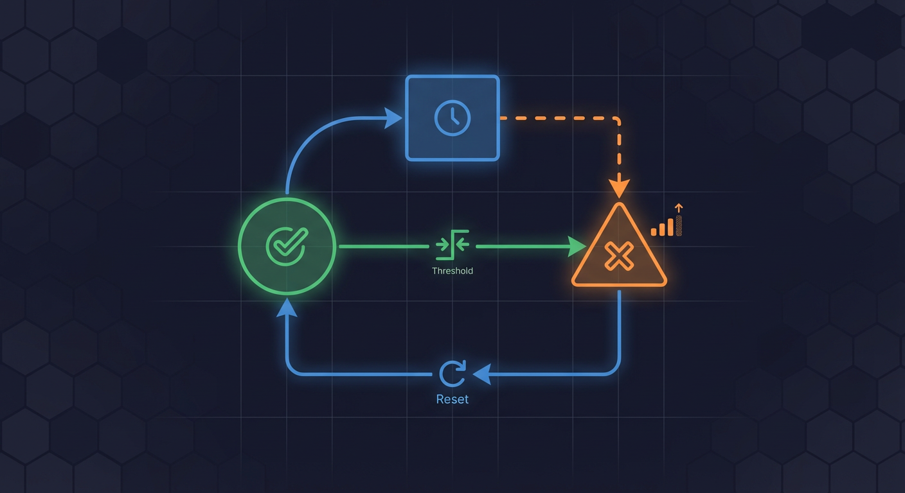
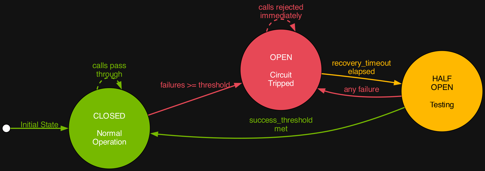
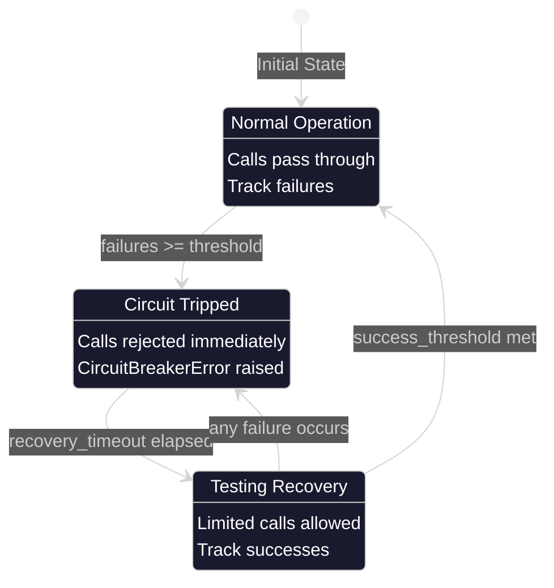

# Circuit Breaker Pattern

The circuit breaker pattern protects external services from cascading failures by monitoring failure rates and temporarily blocking calls to unhealthy services.

**Source:** `backend/services/circuit_breaker.py`

## Overview

The `CircuitBreaker` class (`backend/services/circuit_breaker.py:258-982`) implements a thread-safe async circuit breaker with three states:

- **CLOSED**: Normal operation, calls pass through
- **OPEN**: Service failing, calls rejected immediately with `CircuitBreakerError`
- **HALF_OPEN**: Testing recovery, limited calls allowed

## State Diagram







## Configuration

The `CircuitBreakerConfig` dataclass (`backend/services/circuit_breaker.py:126-142`) defines circuit breaker behavior:

```python
# backend/services/circuit_breaker.py:126-142
@dataclass(slots=True)
class CircuitBreakerConfig:
    """Configuration for circuit breaker behavior."""

    failure_threshold: int = 5
    recovery_timeout: float = 30.0
    half_open_max_calls: int = 3
    success_threshold: int = 2
    excluded_exceptions: tuple[type[Exception], ...] = ()
```

### Configuration Parameters

| Parameter             | Type  | Default | Description                                                 |
| --------------------- | ----- | ------- | ----------------------------------------------------------- |
| `failure_threshold`   | int   | 5       | Number of consecutive failures before opening circuit       |
| `recovery_timeout`    | float | 30.0    | Seconds to wait before transitioning from OPEN to HALF_OPEN |
| `half_open_max_calls` | int   | 3       | Maximum concurrent calls allowed in HALF_OPEN state         |
| `success_threshold`   | int   | 2       | Consecutive successes needed in HALF_OPEN to close circuit  |
| `excluded_exceptions` | tuple | ()      | Exception types that do not count as failures               |

## CircuitState Enum

The `CircuitState` enum (`backend/services/circuit_breaker.py:118-123`) defines the three states:

```python
# backend/services/circuit_breaker.py:118-123
class CircuitState(StrEnum):
    """Circuit breaker states."""

    CLOSED = auto()
    OPEN = auto()
    HALF_OPEN = auto()
```

## Usage Patterns

### Method 1: Call Wrapper

```python
from backend.services.circuit_breaker import CircuitBreaker, CircuitBreakerConfig

config = CircuitBreakerConfig(
    failure_threshold=5,
    recovery_timeout=30.0,
)
breaker = CircuitBreaker(name="ai_service", config=config)

try:
    result = await breaker.call(async_operation, arg1, arg2)
except CircuitBreakerError:
    # Handle service unavailable
    result = fallback_value
```

### Method 2: Async Context Manager

```python
async with breaker:
    result = await async_operation()
```

The context manager (`backend/services/circuit_breaker.py:939-970`) handles:

- State checking on entry
- Call counting in HALF_OPEN state
- Success/failure recording on exit

### Method 3: Protected Call

```python
# backend/services/circuit_breaker.py:823-862
result = await breaker.protected_call(
    lambda: client.fetch_data(),
    record_on=(ConnectionError, TimeoutError),
)
```

### Method 4: Protect Context Manager

```python
# backend/services/circuit_breaker.py:864-917
try:
    async with breaker.protect():
        result = await risky_operation()
except CircuitOpenError as e:
    # Provides recovery_time_remaining for Retry-After headers
    raise HTTPException(
        status_code=503,
        headers={"Retry-After": str(int(e.recovery_time_remaining))}
    )
```

## Global Registry

The `CircuitBreakerRegistry` class (`backend/services/circuit_breaker.py:985-1056`) manages multiple circuit breakers:

```python
# backend/services/circuit_breaker.py:1071-1084
from backend.services.circuit_breaker import get_circuit_breaker

# Get or create from global registry
breaker = get_circuit_breaker("yolo26", CircuitBreakerConfig(
    failure_threshold=5,
    recovery_timeout=30.0,
))

# The registry ensures singleton instances per name
another_ref = get_circuit_breaker("yolo26")
assert breaker is another_ref
```

### Registry Methods

| Method                        | Description                                              |
| ----------------------------- | -------------------------------------------------------- |
| `get_or_create(name, config)` | Get existing or create new circuit breaker               |
| `get(name)`                   | Get existing circuit breaker (returns None if not found) |
| `get_all_status()`            | Get status of all circuit breakers                       |
| `reset_all()`                 | Reset all circuit breakers to CLOSED                     |
| `list_names()`                | List all registered circuit breaker names                |

## Prometheus Metrics

The circuit breaker emits metrics for monitoring (`backend/services/circuit_breaker.py:64-115`):

### Legacy Metrics

| Metric                                | Type    | Labels                        | Description                                   |
| ------------------------------------- | ------- | ----------------------------- | --------------------------------------------- |
| `circuit_breaker_state`               | Gauge   | service                       | Current state (0=closed, 1=open, 2=half_open) |
| `circuit_breaker_failures_total`      | Counter | service                       | Total failures recorded                       |
| `circuit_breaker_state_changes_total` | Counter | service, from_state, to_state | State transitions                             |
| `circuit_breaker_calls_total`         | Counter | service, result               | Total calls (success/failure)                 |
| `circuit_breaker_rejected_total`      | Counter | service                       | Calls rejected by open circuit                |

### HSI-Prefixed Metrics (Grafana Dashboard)

| Metric                            | Type    | Labels  | Description                    |
| --------------------------------- | ------- | ------- | ------------------------------ |
| `hsi_circuit_breaker_state`       | Gauge   | service | Current state for Grafana      |
| `hsi_circuit_breaker_trips_total` | Counter | service | Times circuit has tripped open |

## State Transitions

### CLOSED to OPEN

Triggered when `failure_count >= failure_threshold` (`backend/services/circuit_breaker.py:535-568`):

```python
# backend/services/circuit_breaker.py:535-568
def _transition_to_open(self) -> None:
    """Transition circuit to OPEN state."""
    prev_state = self._state
    self._state = CircuitState.OPEN
    self._opened_at = time.monotonic()
    self._success_count = 0
    self._half_open_calls = 0
    self._last_state_change = datetime.now(UTC)

    # Update Prometheus metrics
    CIRCUIT_BREAKER_STATE.labels(service=self._name).set(1)
    HSI_CIRCUIT_BREAKER_STATE.labels(service=self._name).set(1)
    HSI_CIRCUIT_BREAKER_TRIPS_TOTAL.labels(service=self._name).inc()
```

### OPEN to HALF_OPEN

Triggered when `recovery_timeout` elapses (`backend/services/circuit_breaker.py:528-533, 570-598`):

```python
# backend/services/circuit_breaker.py:528-533
def _should_attempt_recovery(self) -> bool:
    """Check if recovery timeout has elapsed."""
    if self._opened_at is None:
        return False
    elapsed = time.monotonic() - self._opened_at
    return elapsed >= self._config.recovery_timeout
```

### HALF_OPEN to CLOSED

Triggered when `success_count >= success_threshold` (`backend/services/circuit_breaker.py:600-628`):

```python
# backend/services/circuit_breaker.py:600-628
def _transition_to_closed(self) -> None:
    """Transition circuit to CLOSED state."""
    self._state = CircuitState.CLOSED
    self._failure_count = 0
    self._success_count = 0
    self._opened_at = None
    self._half_open_calls = 0
    self._last_state_change = datetime.now(UTC)

    CIRCUIT_BREAKER_STATE.labels(service=self._name).set(0)
    HSI_CIRCUIT_BREAKER_STATE.labels(service=self._name).set(0)
```

### HALF_OPEN to OPEN

Triggered on any failure during HALF_OPEN (`backend/services/circuit_breaker.py:519-521`):

```python
# backend/services/circuit_breaker.py:519-521
if self._state == CircuitState.HALF_OPEN:
    # Any failure in half-open reopens the circuit
    self._transition_to_open()
```

## Exception Classes

### CircuitBreakerError

Primary exception raised when circuit is open (`backend/services/circuit_breaker.py:187-228`):

```python
# backend/services/circuit_breaker.py:187-228
class CircuitBreakerError(Exception):
    """Exception raised when circuit breaker is open."""

    def __init__(
        self,
        service_name: str,
        state: str | CircuitState | None = None,
        *,
        recovery_timeout: float | None = None,
    ) -> None:
        self.service_name = service_name
        self.name = service_name  # Alias for compatibility
        self.recovery_timeout = recovery_timeout
```

### CircuitOpenError

Exception with recovery timing information (`backend/services/circuit_breaker.py:234-255`):

```python
# backend/services/circuit_breaker.py:234-255
class CircuitOpenError(Exception):
    """Raised when circuit breaker prevents call proactively."""

    def __init__(self, service_name: str, recovery_time_remaining: float) -> None:
        self.service_name = service_name
        self.recovery_time_remaining = recovery_time_remaining
```

## Status and Metrics Methods

### get_status()

Returns dictionary with current state (`backend/services/circuit_breaker.py:661-682`):

```python
status = breaker.get_status()
# Returns:
# {
#     "name": "yolo26",
#     "state": "closed",
#     "failure_count": 0,
#     "success_count": 0,
#     "total_calls": 150,
#     "rejected_calls": 0,
#     "last_failure_time": None,
#     "opened_at": None,
#     "config": {
#         "failure_threshold": 5,
#         "recovery_timeout": 30.0,
#         "half_open_max_calls": 3,
#         "success_threshold": 2,
#     }
# }
```

### get_metrics()

Returns `CircuitBreakerMetrics` dataclass (`backend/services/circuit_breaker.py:684-708`):

```python
# backend/services/circuit_breaker.py:145-184
@dataclass(slots=True)
class CircuitBreakerMetrics:
    """Metrics for circuit breaker monitoring."""

    name: str
    state: CircuitState
    failure_count: int = 0
    success_count: int = 0
    total_calls: int = 0
    rejected_calls: int = 0
    last_failure_time: datetime | None = None
    last_state_change: datetime | None = None
```

## Manual Control

### reset()

Manually reset to CLOSED state (`backend/services/circuit_breaker.py:630-651`):

```python
breaker.reset()  # Synchronous reset
await breaker.reset_async()  # Async version with lock
```

### force_open()

Force circuit to OPEN state for maintenance (`backend/services/circuit_breaker.py:653-659`):

```python
breaker.force_open()  # For planned maintenance
```

## Thread Safety

The circuit breaker uses `asyncio.Lock` for thread-safe state management (`backend/services/circuit_breaker.py:319`):

```python
# backend/services/circuit_breaker.py:319
self._lock = asyncio.Lock()
```

Async methods acquire the lock before state changes:

- `allow_call()` - `backend/services/circuit_breaker.py:389-400`
- `_record_success()` - `backend/services/circuit_breaker.py:478-499`
- `_record_failure()` - `backend/services/circuit_breaker.py:501-526`

Sync methods (for compatibility) operate without locks:

- `record_success()` - `backend/services/circuit_breaker.py:749-763`
- `record_failure()` - `backend/services/circuit_breaker.py:769-786`

## Best Practices

1. **Name circuit breakers descriptively**: Use service names like "yolo26", "nemotron", "redis"
2. **Use the global registry**: Ensures singleton instances and centralized management
3. **Configure excluded exceptions**: Don't count validation errors as circuit breaker failures
4. **Monitor metrics**: Set up Grafana alerts on `hsi_circuit_breaker_state` changes
5. **Implement fallbacks**: Always have a degraded response when circuit is open

## Related Documentation

- [Retry Handler](retry-handler.md) - Works with circuit breakers for retry logic
- [Graceful Degradation](graceful-degradation.md) - Fallback strategies when circuit is open
- [Health Monitoring](health-monitoring.md) - Service health checks that feed circuit breaker state

---

_Source: NEM-3458 - Circuit Breaker Documentation_
