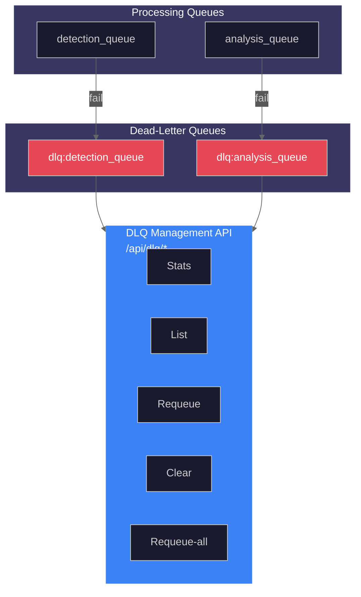
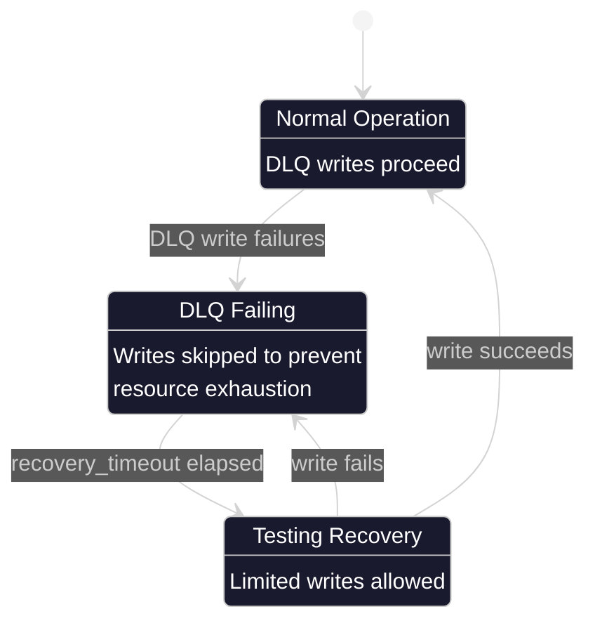

# Dead-Letter Queue (DLQ) Management

The dead-letter queue system captures failed jobs that have exhausted all retry attempts, providing inspection, reprocessing, and management capabilities.

**Source:** `backend/services/retry_handler.py`, `backend/api/routes/dlq.py`, `backend/core/constants.py`

## Overview

Jobs that fail after all retry attempts are moved to dead-letter queues for:

- **Inspection**: Examine failure reasons with enriched error context
- **Debugging**: Access stack traces, HTTP statuses, and system state
- **Recovery**: Requeue jobs for reprocessing after fixes
- **Cleanup**: Clear queues when issues are unrecoverable

## DLQ Architecture



## Queue Names

Defined in `backend/core/constants.py:146-178`:

```python
# backend/core/constants.py:146-178
# Main processing queues
DETECTION_QUEUE = "detection_queue"
ANALYSIS_QUEUE = "analysis_queue"

# Dead-Letter Queue names
DLQ_PREFIX = "dlq:"
DLQ_DETECTION_QUEUE = f"{DLQ_PREFIX}{DETECTION_QUEUE}"  # "dlq:detection_queue"
DLQ_ANALYSIS_QUEUE = f"{DLQ_PREFIX}{ANALYSIS_QUEUE}"    # "dlq:analysis_queue"
DLQ_OVERFLOW_PREFIX = "dlq:overflow:"
```

### Helper Functions

```python
# backend/core/constants.py:181-200
def get_dlq_name(queue_name: str) -> str:
    """Get the DLQ name for a given queue."""
    if queue_name.startswith(DLQ_PREFIX):
        return queue_name
    return f"{DLQ_PREFIX}{queue_name}"

def get_dlq_overflow_name(queue_name: str) -> str:
    """Get the overflow DLQ name for a given queue."""
    clean_name = queue_name.removeprefix(DLQ_PREFIX).removeprefix("overflow:")
    return f"{DLQ_OVERFLOW_PREFIX}{clean_name}"
```

## Job Format in DLQ

The `JobFailure` dataclass (`backend/services/retry_handler.py:99-161`) defines the DLQ job structure:

```python
# backend/services/retry_handler.py:99-161
@dataclass(slots=True)
class JobFailure:
    """Record of a failed job with enriched error context."""

    original_job: dict[str, Any]      # Original job payload
    error: str                         # Last error message
    attempt_count: int                 # Number of attempts made
    first_failed_at: str              # ISO timestamp of first failure
    last_failed_at: str               # ISO timestamp of last failure
    queue_name: str                   # Original queue name

    # Error context enrichment fields (NEM-1474)
    error_type: str | None = None     # Exception class name
    stack_trace: str | None = None    # Truncated stack trace (max 4096 chars)
    http_status: int | None = None    # HTTP status code (for network errors)
    response_body: str | None = None  # Truncated AI service response (max 2048 chars)
    retry_delays: list[float] | None = None  # Delays applied between retries
    context: dict[str, Any] | None = None    # System state snapshot
```

### Example DLQ Job

```json
{
  "original_job": {
    "camera_id": "front_door",
    "file_path": "/export/foscam/front_door/image_001.jpg",
    "timestamp": "2024-01-15T10:30:00.000000"
  },
  "error": "Connection refused: YOLO26 service unavailable",
  "attempt_count": 3,
  "first_failed_at": "2024-01-15T10:30:01.000000",
  "last_failed_at": "2024-01-15T10:30:15.000000",
  "queue_name": "detection_queue",
  "error_type": "ConnectionRefusedError",
  "stack_trace": "Traceback (most recent call last):\n  File ...",
  "http_status": null,
  "response_body": null,
  "retry_delays": [1.0, 2.1, 4.3],
  "context": {
    "detection_queue_depth": 15,
    "analysis_queue_depth": 3,
    "dlq_circuit_breaker_state": "closed"
  }
}
```

## DLQ Statistics

The `DLQStats` dataclass (`backend/services/retry_handler.py:175-181`):

```python
# backend/services/retry_handler.py:175-181
@dataclass(slots=True)
class DLQStats:
    """Statistics about dead-letter queues."""

    detection_queue_count: int = 0
    analysis_queue_count: int = 0
    total_count: int = 0
```

## REST API Endpoints

The DLQ API is defined in `backend/api/routes/dlq.py:1-391`.

### GET /api/dlq/stats

Get DLQ statistics (`backend/api/routes/dlq.py:107-131`):

```python
# Response:
{
  "detection_queue_count": 5,
  "analysis_queue_count": 2,
  "total_count": 7
}
```

### GET /api/dlq/jobs/{queue_name}

List jobs in a DLQ with pagination (`backend/api/routes/dlq.py:134-206`):

**Parameters:**

- `queue_name`: `dlq:detection_queue` or `dlq:analysis_queue`
- `start`: Start index (default: 0)
- `limit`: Max jobs to return (default: 100, max: 1000)

**Response:**

```json
{
  "queue_name": "dlq:detection_queue",
  "items": [
    {
      "original_job": {...},
      "error": "...",
      "attempt_count": 3,
      "first_failed_at": "...",
      "last_failed_at": "...",
      "queue_name": "detection_queue",
      "error_type": "ConnectionError",
      "stack_trace": "...",
      "http_status": null,
      "response_body": null,
      "retry_delays": [1.0, 2.0, 4.0],
      "context": {...}
    }
  ],
  "pagination": {
    "total": 5,
    "limit": 100,
    "offset": 0,
    "has_more": false
  }
}
```

### POST /api/dlq/requeue/{queue_name}

Requeue oldest job from DLQ (`backend/api/routes/dlq.py:209-259`):

**Requires:** API key authentication (when enabled)

**Response:**

```json
{
  "success": true,
  "message": "Job requeued from dlq:detection_queue to detection_queue",
  "job": null
}
```

### POST /api/dlq/requeue-all/{queue_name}

Requeue all jobs from DLQ (`backend/api/routes/dlq.py:262-337`):

**Requires:** API key authentication (when enabled)

**Parameters:**

- Limited to `settings.max_requeue_iterations` to prevent resource exhaustion

**Response:**

```json
{
  "success": true,
  "message": "Requeued 5 jobs from dlq:detection_queue to detection_queue",
  "job": null
}
```

### DELETE /api/dlq/{queue_name}

Clear all jobs from DLQ (`backend/api/routes/dlq.py:340-391`):

**Requires:** API key authentication (when enabled)

**Response:**

```json
{
  "success": true,
  "message": "Cleared 5 jobs from dlq:detection_queue",
  "queue_name": "dlq:detection_queue"
}
```

## API Key Authentication

Destructive operations require API key authentication (`backend/api/routes/dlq.py:41-85`):

```python
# backend/api/routes/dlq.py:41-85
async def verify_api_key(
    x_api_key: str | None = Header(None, alias="X-API-Key"),
    api_key: str | None = None,
) -> None:
    """Verify API key for destructive DLQ operations."""
    settings = get_settings()

    # Skip authentication if disabled
    if not settings.api_key_enabled:
        return

    # Use header first, fall back to query param
    key = x_api_key or api_key

    if not key:
        raise HTTPException(
            status_code=status.HTTP_401_UNAUTHORIZED,
            detail="API key required.",
        )
```

## DLQ Circuit Breaker

When the DLQ becomes unavailable, a circuit breaker prevents cascading failures (`backend/services/retry_handler.py:24-28`):



### Data Loss Risk

When the DLQ circuit breaker opens, jobs cannot be preserved (`backend/services/retry_handler.py:509-531`):

```python
# backend/services/retry_handler.py:509-531
if not await self._dlq_circuit_breaker.allow_call():
    logger.error(
        f"CRITICAL DATA LOSS: DLQ circuit breaker is open, "
        f"job from {queue_name} will be PERMANENTLY LOST.",
        extra={"data_loss": True, "lost_job_data": job_data},
    )
    return False
```

## Programmatic DLQ Management

### Using RetryHandler

```python
from backend.services.retry_handler import get_retry_handler

handler = get_retry_handler(redis_client)

# Get statistics
stats = await handler.get_dlq_stats()
print(f"Total DLQ jobs: {stats.total_count}")

# List jobs (without removing)
jobs = await handler.get_dlq_jobs("dlq:detection_queue", start=0, end=9)
for job in jobs:
    print(f"Failed at: {job.last_failed_at}, Error: {job.error}")

# Requeue single job
original_job = await handler.requeue_dlq_job("dlq:detection_queue")

# Move to specific queue
await handler.move_dlq_job_to_queue(
    dlq_name="dlq:detection_queue",
    target_queue="detection_queue",
)

# Clear entire DLQ
await handler.clear_dlq("dlq:detection_queue")
```

### DLQ Circuit Breaker Management

```python
# Check circuit breaker status
status = handler.get_dlq_circuit_breaker_status()
print(f"State: {status['state']}, Failures: {status['failure_count']}")

# Check if DLQ writes are blocked
if handler.is_dlq_circuit_open():
    print("WARNING: DLQ writes are blocked!")

# Reset after fixing underlying issue
handler.reset_dlq_circuit_breaker()
```

## Reprocessing Patterns

### Pattern 1: Selective Requeue

```python
# Inspect jobs first
jobs = await handler.get_dlq_jobs("dlq:detection_queue")

for job in jobs:
    if "temporary" in job.error.lower():
        # Transient error - safe to requeue
        await handler.move_dlq_job_to_queue(
            "dlq:detection_queue",
            "detection_queue"
        )
    else:
        # Permanent error - log and skip
        logger.warning(f"Skipping unrecoverable job: {job.error}")
```

### Pattern 2: Batch Requeue After Fix

```bash
# After fixing YOLO26 service:
curl -X POST http://localhost:8000/api/dlq/requeue-all/dlq:detection_queue \
  -H "X-API-Key: your-api-key"
```

### Pattern 3: Manual Inspection and Decision

```bash
# List all failed jobs
curl http://localhost:8000/api/dlq/jobs/dlq:detection_queue

# Review errors, then either:
# 1. Requeue: POST /api/dlq/requeue/dlq:detection_queue
# 2. Clear: DELETE /api/dlq/dlq:detection_queue
```

## Monitoring Recommendations

1. **Alert on DLQ depth**: Set threshold (e.g., > 10 jobs)
2. **Alert on circuit breaker open**: Immediate data loss risk
3. **Regular DLQ review**: Schedule periodic inspection
4. **Track error patterns**: Monitor `error_type` distribution

### Prometheus Queries

```promql
# DLQ depth (requires custom metric)
hsi_dlq_depth{queue="detection_queue"}

# Circuit breaker state
hsi_circuit_breaker_state{service="dlq_overflow"}
```

## Best Practices

1. **Don't ignore DLQs**: Accumulated jobs indicate systematic issues
2. **Review before clearing**: Understand failures before discarding
3. **Fix root causes**: Don't just requeue without addressing the error
4. **Test reprocessing**: Verify jobs succeed before bulk requeue
5. **Monitor circuit breaker**: Open circuit = data loss risk

## Related Documentation

- [Retry Handler](retry-handler.md) - Retry logic that feeds DLQ
- [Circuit Breaker](circuit-breaker.md) - DLQ overflow protection
- [Health Monitoring](health-monitoring.md) - Service health tracking

---

_Source: NEM-3458 - Dead-Letter Queue Documentation_
